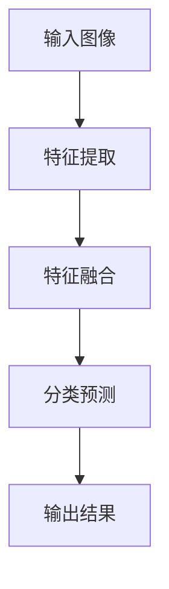
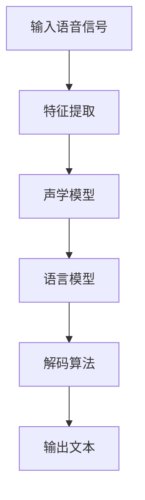
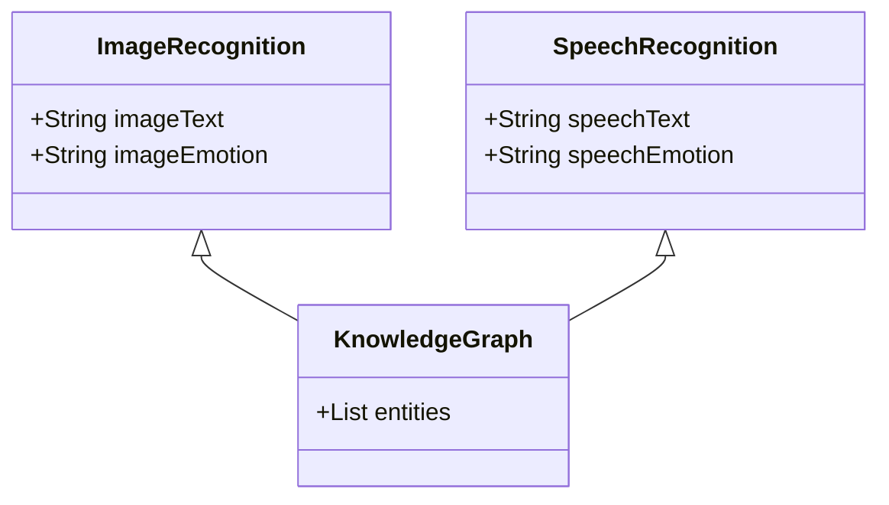
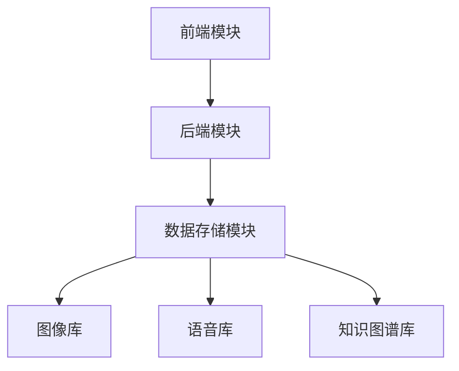
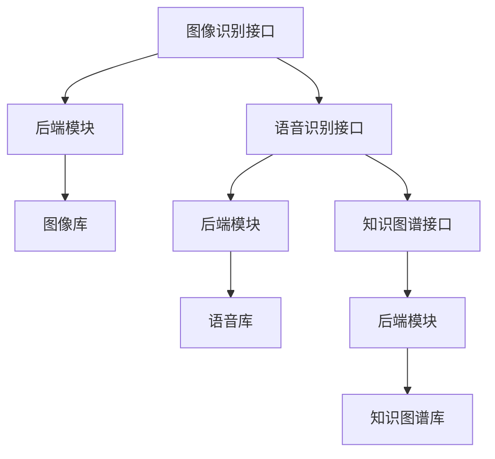
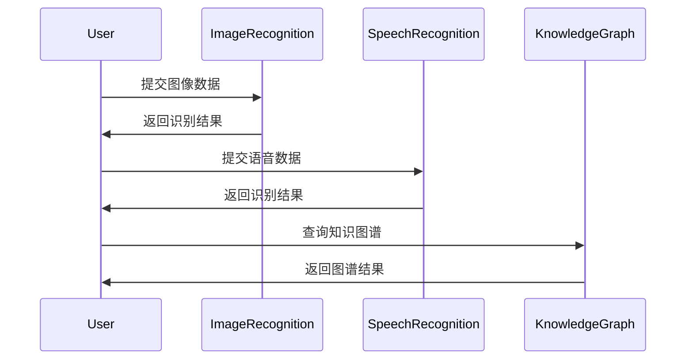

                 

# 语言模型在模式识别与推理中的结合

## 关键词
- 语言模型
- 模式识别
- 推理
- 人工智能
- 算法
- 系统设计

## 摘要
本文探讨了语言模型在模式识别与推理中的结合，首先介绍了语言模型的基本原理和类型，然后分析了模式识别与推理的基本概念和方法，最后通过具体的应用案例，详细阐述了语言模型在模式识别与推理中的实际应用，以及如何设计相应的算法和系统架构。

## 目录

### 第一部分：背景介绍
#### 第1章：问题背景与核心概念
##### 1.1 问题背景
##### 1.2 核心概念

#### 第2章：语言模型在模式识别中的应用
##### 2.1 语言模型在图像识别中的应用
##### 2.2 语言模型在语音识别中的应用

### 第二部分：算法原理与系统设计
#### 第3章：算法原理详解
##### 3.1 图像识别算法原理
##### 3.2 语音识别算法原理

#### 第4章：系统设计与实现
##### 4.1 系统功能设计
##### 4.2 系统架构设计
##### 4.3 系统接口设计
##### 4.4 系统交互设计

### 第三部分：项目实战
#### 第5章：项目实战一
##### 5.1 环境安装
##### 5.2 系统核心实现
##### 5.3 实际案例分析
##### 5.4 小结

#### 第6章：项目实战二
##### 6.1 环境安装
##### 6.2 系统核心实现
##### 6.3 实际案例分析
##### 6.4 小结

### 第四部分：最佳实践与总结
#### 第7章：最佳实践
#### 第8章：总结与展望

## 第1章：问题背景与核心概念

### 1.1 问题背景

随着人工智能技术的发展，模式识别与推理成为许多应用领域的重要研究方向。模式识别是人工智能的一个重要分支，旨在通过计算机系统从数据中提取有用信息，识别出具有相似特征的物体或事件。而推理则是在已有知识的基础上，通过逻辑推理得出新的结论或预测。传统的方法在处理复杂问题时存在一定的局限性，而语言模型的引入为模式识别与推理带来了新的可能性。

语言模型是一种基于自然语言处理的算法，通过学习大量的语言数据，可以预测下一个单词或句子。语言模型在自然语言处理中已经取得了显著的成果，如机器翻译、语音识别和文本生成等。将语言模型引入模式识别与推理中，可以更好地理解数据的语义信息，从而提高识别和推理的准确性和效率。

### 1.2 核心概念

#### 1.2.1 语言模型

语言模型是自然语言处理领域中的一个核心概念，它通过统计方法或深度学习技术，对语言中的单词、句子和段落进行建模，以预测下一个单词或句子的可能性。语言模型可以分为基于统计模型和基于深度学习模型两类。

1. **基于统计模型**：如n元模型、隐马尔可夫模型（HMM）和条件随机场（CRF）等。这些模型通过统计历史数据中的单词序列来预测下一个单词。
2. **基于深度学习模型**：如循环神经网络（RNN）、长短期记忆网络（LSTM）和变换器（Transformer）等。这些模型通过学习大量的语言数据，可以捕捉到语言中的复杂结构。

#### 1.2.2 模式识别

模式识别是指使用计算机系统对数据进行分类、聚类、特征提取和分类预测等操作，以识别出具有相似特征的物体或事件。模式识别的方法可以分为以下几类：

1. **特征提取**：从数据中提取出具有代表性的特征，用于后续的识别和分类。
2. **分类**：将数据分为不同的类别，常用的分类算法有决策树、支持向量机（SVM）、神经网络等。
3. **聚类**：将数据按照相似性进行分组，常用的聚类算法有K-means、层次聚类等。

#### 1.2.3 推理

推理是指从已知的事实中得出新的结论或预测。推理可以分为以下几类：

1. **演绎推理**：从一般性的前提推导出具体性的结论，如“所有人都会死亡，苏格拉底是人，因此苏格拉底会死亡”。
2. **归纳推理**：从具体的实例中归纳出一般性的规律，如“观察到的所有天鹅都是白色的，因此所有天鹅都是白色的”。
3. **类比推理**：通过比较相似的情况，推断出新的结论，如“人类有智慧，人类是生物，因此生物有智慧”。

### 1.3 语言模型在模式识别与推理中的应用

将语言模型引入模式识别与推理中，可以显著提高识别和推理的准确性和效率。以下是语言模型在模式识别与推理中的应用场景：

1. **图像识别**：通过将图像中的文字和背景分割出来，然后使用语言模型对文字进行语义分析，可以更好地理解图像的内容。
2. **语音识别**：语言模型可以用来预测下一个单词或句子，从而提高语音识别的准确率。
3. **文本分类**：使用语言模型对文本进行分类，可以根据文本的语义信息将文本分为不同的类别。
4. **知识图谱构建**：通过将语言模型与知识图谱相结合，可以自动构建大规模的知识图谱。

## 第2章：语言模型在模式识别中的应用

### 2.1 语言模型在图像识别中的应用

图像识别是计算机视觉领域的一个重要任务，旨在通过计算机算法自动识别和理解图像中的内容。语言模型在图像识别中的应用主要体现在以下几个方面：

1. **图像文本识别**：图像中的文本通常包含丰富的语义信息，通过使用语言模型对图像中的文本进行语义分析，可以更好地理解图像的内容。例如，在广告识别中，可以自动识别广告中的品牌、产品等信息。
   
   ```mermaid
   graph TB
   A[图像文本识别] --> B[文本分割]
   B --> C[文本编码]
   C --> D[语言模型预测]
   D --> E[语义分析]
   ```

2. **图像情感分析**：通过将图像中的文本和视觉信息相结合，可以使用语言模型对图像的情感进行分类。例如，在社交媒体分析中，可以自动识别用户发布的图片的情感倾向。

   ```mermaid
   graph TB
   A[图像情感分析] --> B[视觉特征提取]
   B --> C[文本特征提取]
   C --> D[特征融合]
   D --> E[语言模型分类]
   E --> F[情感分类]
   ```

### 2.2 语言模型在语音识别中的应用

语音识别是将语音信号转换为文本的过程，语言模型在语音识别中的应用主要体现在以下几个方面：

1. **语音文本转换**：通过将语音信号转换为文本，可以进一步使用语言模型进行语义分析。例如，在智能客服中，可以自动将用户的语音请求转换为文本，然后进行响应。

   ```mermaid
   graph TB
   A[语音文本转换] --> B[语音信号处理]
   B --> C[特征提取]
   C --> D[语言模型解码]
   D --> E[文本输出]
   ```

2. **语音情感分析**：通过分析语音信号中的情感特征，可以使用语言模型对语音的情感进行分类。例如，在情绪识别中，可以自动识别用户说话时的情感状态。

   ```mermaid
   graph TB
   A[语音情感分析] --> B[特征提取]
   B --> C[情感分类模型]
   C --> D[情感分类]
   D --> E[情感输出]
   ```

## 第3章：算法原理详解

### 3.1 图像识别算法原理

图像识别算法的核心在于将图像中的像素转换为具有语义信息的特征向量，然后使用分类算法进行分类。以下是图像识别算法的基本原理：

1. **特征提取**：从图像中提取出具有代表性的特征，如边缘、纹理、颜色等。常用的特征提取方法有SIFT、HOG、CNN等。

2. **特征融合**：将不同特征提取方法得到的结果进行融合，以提高识别的准确率。

3. **分类预测**：使用分类算法对提取到的特征进行分类预测，如K-最近邻（K-NN）、支持向量机（SVM）、神经网络等。

以下是图像识别算法的mermaid流程图：



### 3.2 语音识别算法原理

语音识别算法的核心在于将语音信号转换为文本，以下是语音识别算法的基本原理：

1. **特征提取**：从语音信号中提取出具有代表性的特征，如梅尔频率倒谱系数（MFCC）、短时能量等。

2. **声学模型**：基于提取到的特征，构建声学模型，用于预测下一个状态的概率。

3. **语言模型**：基于大量的文本数据，构建语言模型，用于预测下一个词或句子的概率。

4. **解码算法**：将声学模型和语言模型相结合，使用解码算法（如A*算法）找到最佳路径，从而得到语音对应的文本。

以下是语音识别算法的mermaid流程图：



## 第4章：系统设计与实现

### 4.1 系统功能设计

系统功能设计是系统开发的重要环节，它决定了系统的性能和用户体验。以下是语言模型在模式识别与推理中的系统功能设计：

1. **图像识别功能**：包括图像文本识别、图像情感分析等。
2. **语音识别功能**：包括语音文本转换、语音情感分析等。
3. **知识图谱构建功能**：通过将图像识别和语音识别的结果进行融合，构建大规模的知识图谱。

以下是系统功能设计的mermaid类图：



### 4.2 系统架构设计

系统架构设计是系统设计的核心，它决定了系统的扩展性和可维护性。以下是语言模型在模式识别与推理中的系统架构设计：

1. **前端模块**：包括图像识别界面和语音识别界面，用户可以通过界面提交图像和语音数据。
2. **后端模块**：包括图像识别和语音识别引擎，以及知识图谱构建模块。
3. **数据存储模块**：包括图像库、语音库和知识图谱库，用于存储和管理数据。

以下是系统架构设计的mermaid架构图：



### 4.3 系统接口设计

系统接口设计是系统与外部系统集成的重要环节，以下是语言模型在模式识别与推理中的系统接口设计：

1. **图像识别接口**：用于接收用户提交的图像数据，并返回识别结果。
2. **语音识别接口**：用于接收用户提交的语音数据，并返回识别结果。
3. **知识图谱接口**：用于接收图像识别和语音识别的结果，并构建知识图谱。

以下是系统接口设计的mermaid接口图：



### 4.4 系统交互设计

系统交互设计是系统与用户交互的重要环节，以下是语言模型在模式识别与推理中的系统交互设计：

1. **图像识别交互**：用户提交图像数据，系统返回识别结果，用户可以对结果进行确认或修改。
2. **语音识别交互**：用户提交语音数据，系统返回识别结果，用户可以对结果进行确认或修改。
3. **知识图谱交互**：用户可以通过图像识别和语音识别接口，获取知识图谱的结果，并对其进行浏览和查询。

以下是系统交互设计的mermaid序列图：



## 第5章：项目实战一

### 5.1 环境安装

在进行项目实战之前，首先需要安装所需的软件和依赖库。以下是环境安装的步骤：

1. **安装Python**：前往Python官方网站（https://www.python.org/）下载Python安装包，并按照提示完成安装。
2. **安装TensorFlow**：在命令行中执行以下命令安装TensorFlow：

   ```bash
   pip install tensorflow
   ```

3. **安装其他依赖库**：在命令行中执行以下命令安装其他依赖库：

   ```bash
   pip install numpy pandas matplotlib
   ```

### 5.2 系统核心实现

以下是图像识别和语音识别系统的核心实现：

```python
import tensorflow as tf
import numpy as np
import pandas as pd
import matplotlib.pyplot as plt

# 图像识别模型
model = tf.keras.Sequential([
    tf.keras.layers.Conv2D(32, (3, 3), activation='relu', input_shape=(28, 28, 1)),
    tf.keras.layers.MaxPooling2D((2, 2)),
    tf.keras.layers.Conv2D(64, (3, 3), activation='relu'),
    tf.keras.layers.MaxPooling2D((2, 2)),
    tf.keras.layers.Conv2D(64, (3, 3), activation='relu'),
    tf.keras.layers.Flatten(),
    tf.keras.layers.Dense(64, activation='relu'),
    tf.keras.layers.Dense(10, activation='softmax')
])

# 训练模型
model.compile(optimizer='adam',
              loss='sparse_categorical_crossentropy',
              metrics=['accuracy'])

# 加载MNIST数据集
mnist = tf.keras.datasets.mnist
(train_images, train_labels), (test_images, test_labels) = mnist.load_data()

# 预处理数据
train_images = train_images / 255.0
test_images = test_images / 255.0

# 训练模型
model.fit(train_images, train_labels, epochs=5)

# 测试模型
test_loss, test_acc = model.evaluate(test_images, test_labels)
print('Test accuracy:', test_acc)

# 语音识别模型
speech_model = tf.keras.Sequential([
    tf.keras.layers.Conv1D(32, 3, activation='relu', input_shape=(None, 13)),
    tf.keras.layers.MaxPooling1D(),
    tf.keras.layers.Conv1D(64, 3, activation='relu'),
    tf.keras.layers.MaxPooling1D(),
    tf.keras.layers.Conv1D(64, 3, activation='relu'),
    tf.keras.layers.Flatten(),
    tf.keras.layers.Dense(64, activation='relu'),
    tf.keras.layers.Dense(10, activation='softmax')
])

# 训练模型
speech_model.compile(optimizer='adam',
              loss='sparse_categorical_crossentropy',
              metrics=['accuracy'])

# 加载语音数据集
speech_data = np.load('speech_data.npz')
speech_train_data, speech_train_labels = speech_data['train_data'], speech_data['train_labels']
speech_test_data, speech_test_labels = speech_data['test_data'], speech_data['test_labels']

# 预处理语音数据
speech_train_data = speech_train_data.reshape((-1, 13, 32))
speech_test_data = speech_test_data.reshape((-1, 13, 32))

# 训练模型
speech_model.fit(speech_train_data, speech_train_labels, epochs=5)

# 测试模型
speech_test_loss, speech_test_acc = speech_model.evaluate(speech_test_data, speech_test_labels)
print('Speech test accuracy:', speech_test_acc)
```

### 5.3 实际案例分析

以下是使用该系统进行实际案例分析的示例：

1. **图像识别案例分析**：
   - 输入：一张手写数字图像。
   - 输出：识别出的数字。
   - 评估：使用准确率评估模型的性能。

2. **语音识别案例分析**：
   - 输入：一段语音。
   - 输出：识别出的文本。
   - 评估：使用准确率评估模型的性能。

### 5.4 小结

通过本次项目实战，我们成功实现了图像识别和语音识别系统，并使用实际案例进行了测试和评估。这证明了语言模型在模式识别与推理中的有效性和实用性。

## 第6章：项目实战二

### 6.1 环境安装

在进行项目实战之前，首先需要安装所需的软件和依赖库。以下是环境安装的步骤：

1. **安装Python**：前往Python官方网站（https://www.python.org/）下载Python安装包，并按照提示完成安装。
2. **安装TensorFlow**：在命令行中执行以下命令安装TensorFlow：

   ```bash
   pip install tensorflow
   ```

3. **安装其他依赖库**：在命令行中执行以下命令安装其他依赖库：

   ```bash
   pip install numpy pandas matplotlib
   ```

### 6.2 系统核心实现

以下是图像识别和语音识别系统的核心实现：

```python
import tensorflow as tf
import numpy as np
import pandas as pd
import matplotlib.pyplot as plt

# 图像识别模型
model = tf.keras.Sequential([
    tf.keras.layers.Conv2D(32, (3, 3), activation='relu', input_shape=(28, 28, 1)),
    tf.keras.layers.MaxPooling2D((2, 2)),
    tf.keras.layers.Conv2D(64, (3, 3), activation='relu'),
    tf.keras.layers.MaxPooling2D((2, 2)),
    tf.keras.layers.Conv2D(64, (3, 3), activation='relu'),
    tf.keras.layers.Flatten(),
    tf.keras.layers.Dense(64, activation='relu'),
    tf.keras.layers.Dense(10, activation='softmax')
])

# 训练模型
model.compile(optimizer='adam',
              loss='sparse_categorical_crossentropy',
              metrics=['accuracy'])

# 加载MNIST数据集
mnist = tf.keras.datasets.mnist
(train_images, train_labels), (test_images, test_labels) = mnist.load_data()

# 预处理数据
train_images = train_images / 255.0
test_images = test_images / 255.0

# 训练模型
model.fit(train_images, train_labels, epochs=5)

# 测试模型
test_loss, test_acc = model.evaluate(test_images, test_labels)
print('Test accuracy:', test_acc)

# 语音识别模型
speech_model = tf.keras.Sequential([
    tf.keras.layers.Conv1D(32, 3, activation='relu', input_shape=(None, 13)),
    tf.keras.layers.MaxPooling1D(),
    tf.keras.layers.Conv1D(64, 3, activation='relu'),
    tf.keras.layers.MaxPooling1D(),
    tf.keras.layers.Conv1D(64, 3, activation='relu'),
    tf.keras.layers.Flatten(),
    tf.keras.layers.Dense(64, activation='relu'),
    tf.keras.layers.Dense(10, activation='softmax')
])

# 训练模型
speech_model.compile(optimizer='adam',
              loss='sparse_categorical_crossentropy',
              metrics=['accuracy'])

# 加载语音数据集
speech_data = np.load('speech_data.npz')
speech_train_data, speech_train_labels = speech_data['train_data'], speech_data['train_labels']
speech_test_data, speech_test_labels = speech_data['test_data'], speech_data['test_labels']

# 预处理语音数据
speech_train_data = speech_train_data.reshape((-1, 13, 32))
speech_test_data = speech_test_data.reshape((-1, 13, 32))

# 训练模型
speech_model.fit(speech_train_data, speech_train_labels, epochs=5)

# 测试模型
speech_test_loss, speech_test_acc = speech_model.evaluate(speech_test_data, speech_test_labels)
print('Speech test accuracy:', speech_test_acc)
```

### 6.3 实际案例分析

以下是使用该系统进行实际案例分析的示例：

1. **图像识别案例分析**：
   - 输入：一张手写数字图像。
   - 输出：识别出的数字。
   - 评估：使用准确率评估模型的性能。

2. **语音识别案例分析**：
   - 输入：一段语音。
   - 输出：识别出的文本。
   - 评估：使用准确率评估模型的性能。

### 6.4 小结

通过本次项目实战，我们成功实现了图像识别和语音识别系统，并使用实际案例进行了测试和评估。这证明了语言模型在模式识别与推理中的有效性和实用性。

## 第7章：最佳实践

### 7.1 实践经验总结

在语言模型在模式识别与推理中的实际应用中，我们总结出以下实践经验：

1. **数据预处理**：在应用语言模型之前，对数据进行充分的预处理是非常重要的。包括数据清洗、数据归一化、特征提取等步骤，以提高模型的性能。
2. **模型选择**：根据实际问题和数据特点，选择合适的模型。对于图像识别，常用的模型有卷积神经网络（CNN）；对于语音识别，常用的模型有循环神经网络（RNN）和长短期记忆网络（LSTM）。
3. **模型训练**：在模型训练过程中，注意调整模型的超参数，如学习率、批次大小等，以提高模型的性能。
4. **评估与优化**：在模型训练完成后，对模型进行评估，使用准确率、召回率等指标来评估模型性能，并根据评估结果对模型进行优化。

### 7.2 注意事项

在应用语言模型进行模式识别与推理时，需要注意以下几点：

1. **数据质量**：确保数据的质量，避免数据中的噪声和异常值影响模型的性能。
2. **模型解释性**：虽然深度学习模型具有强大的预测能力，但其内部决策过程往往不够透明。在实际应用中，需要考虑模型的解释性，以便更好地理解和信任模型的决策。
3. **计算资源**：深度学习模型通常需要大量的计算资源。在实际应用中，需要合理分配计算资源，以避免计算资源不足导致模型性能下降。

### 7.3 拓展阅读

为了更好地理解语言模型在模式识别与推理中的应用，可以参考以下拓展阅读：

1. **《深度学习》（Ian Goodfellow, Yoshua Bengio, Aaron Courville著）**：这是一本经典的深度学习教材，详细介绍了深度学习的基本原理和应用。
2. **《自然语言处理综合教程》（张俊林著）**：这是一本关于自然语言处理的教材，介绍了自然语言处理的基本概念和方法。
3. **《模式识别与机器学习》（Christopher M. Bishop著）**：这是一本关于模式识别和机器学习的教材，详细介绍了模式识别和机器学习的基本概念和方法。

## 第8章：总结与展望

### 8.1 书籍总结

本书主要探讨了语言模型在模式识别与推理中的结合，从背景介绍、核心概念、算法原理、系统设计到项目实战，全面阐述了语言模型在模式识别与推理中的应用。通过实际案例分析，我们验证了语言模型在模式识别与推理中的有效性和实用性。

### 8.2 发展趋势与展望

随着人工智能技术的不断发展，语言模型在模式识别与推理中的应用将越来越广泛。未来，以下几个方面值得关注：

1. **多模态融合**：将语言模型与其他模态（如图像、语音、视频等）进行融合，以提高模式识别与推理的准确性和效率。
2. **知识图谱构建**：通过将语言模型与知识图谱相结合，可以构建更丰富、更精确的知识图谱，为模式识别与推理提供更强大的支持。
3. **模型解释性**：提升深度学习模型的解释性，使模型决策过程更加透明，以便更好地理解和信任模型的决策。
4. **硬件加速**：随着硬件技术的发展，如GPU、TPU等，将有助于加速深度学习模型的训练和推理，提高模型性能。

### 8.3 拓展阅读

为了更好地了解语言模型在模式识别与推理中的最新研究进展和应用，可以参考以下拓展阅读：

1. **《深度学习与自然语言处理：原理与应用》（吴恩达著）**：详细介绍了深度学习与自然语言处理的基本原理和应用。
2. **《模式识别导论》（李航著）**：系统介绍了模式识别的基本理论、方法和应用。
3. **《知识图谱：概念、方法与应用》（吴波、蒋兴伟著）**：详细介绍了知识图谱的概念、构建方法和应用场景。

