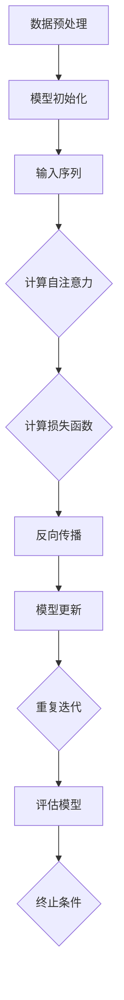
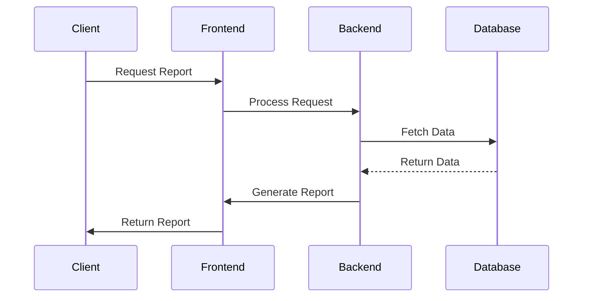
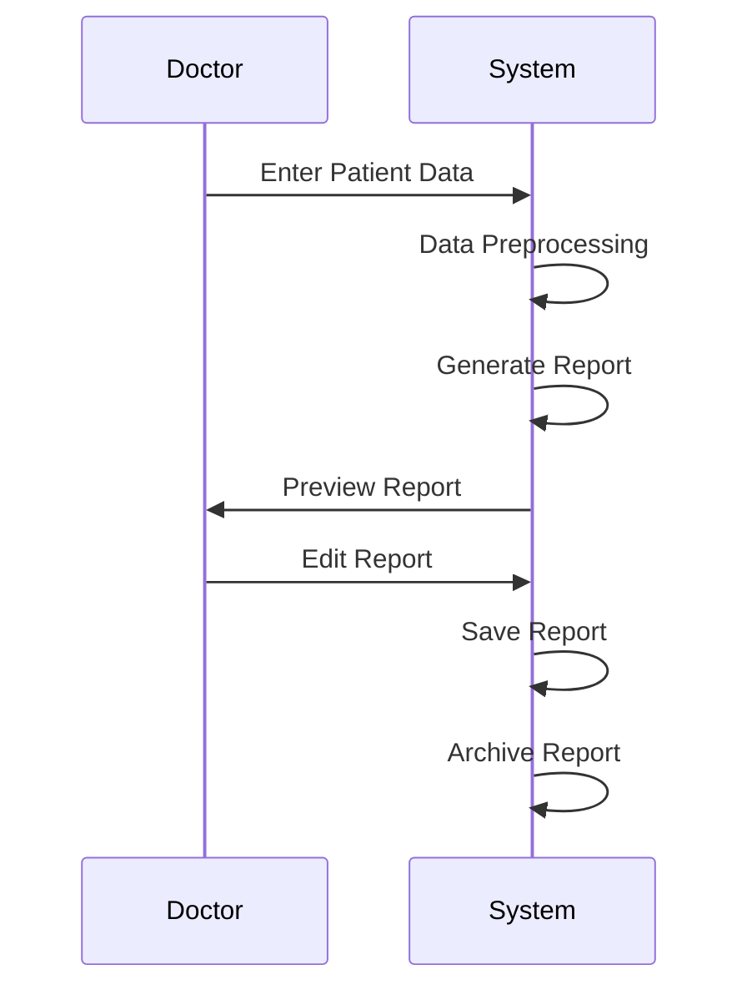

                 

### 第一部分：背景介绍

#### 1.1 问题背景

近年来，随着人工智能技术的飞速发展，语言模型已经成为自然语言处理（NLP）领域的重要工具。语言模型的核心任务是从大量的文本数据中学习语言的统计规律，并生成符合这些规律的文本。这一技术的进步极大地推动了诸如机器翻译、文本摘要、对话系统等应用的发展。

然而，尽管语言模型在通用任务上取得了显著的成就，但在特定领域任务中的适应性仍然面临诸多挑战。特定领域任务通常需要模型具备对领域知识的深入理解，而这种知识通常不能通过传统的数据驱动方法获得。因此，如何提高语言模型在特定领域任务中的适应性，成为了一个亟待解决的重要问题。

#### 1.2 研究意义

研究语言模型在特定领域任务中的适应性具有重要的理论和实际意义。从理论层面看，这有助于我们深入理解语言模型的局限性和改进方向。从应用层面看，提高语言模型在特定领域任务中的适应性，可以提升自动化系统在特定领域的表现，从而推动智能应用的发展。

#### 1.3 目标与任务

本文的目标是分析语言模型在特定领域任务中的适应性，并提出相应的改进策略。具体任务包括：

1. **核心概念与联系**：明确语言模型、特定领域知识和适应性分析等核心概念，并阐述它们之间的联系。
2. **算法原理讲解**：详细讲解语言模型的基本原理，包括数学模型和算法流程。
3. **系统分析与架构设计**：分析语言模型在特定领域任务中的系统架构，并提出优化方案。
4. **项目实战**：通过实际项目案例，展示语言模型在特定领域任务中的应用，并进行详细剖析。
5. **最佳实践 tips**：总结最佳实践，为实际应用提供指导。

#### 1.4 问题描述

在特定领域任务中，语言模型面临以下问题：

1. **领域知识缺失**：语言模型通常缺乏对特定领域知识的深入理解，导致在处理领域特定问题时表现不佳。
2. **数据不足**：特定领域任务的数据通常有限，无法提供足够的信息来训练一个性能优越的语言模型。
3. **迁移性差**：语言模型在不同领域任务之间迁移性差，难以在新的领域任务中快速适应。

#### 1.5 问题解决

为了解决上述问题，可以采取以下策略：

1. **增强领域知识**：通过引入特定领域的知识库，增强语言模型对领域知识的理解。
2. **数据增强**：利用数据增强技术，扩展特定领域任务的数据集，提高模型的泛化能力。
3. **迁移学习**：利用迁移学习方法，将已在一个领域训练好的模型迁移到另一个领域，提高模型的适应能力。

#### 1.6 边界与外延

在研究语言模型在特定领域任务中的适应性时，需要考虑以下边界与外延：

1. **边界条件**：语言模型在特定领域任务中的表现受到数据质量、模型架构等因素的影响。
2. **相关概念**：与语言模型相关的概念包括自然语言处理、机器学习、深度学习等。
3. **要素组成**：语言模型主要由嵌入层、编码器、解码器等组成，特定领域任务的要素包括领域知识、任务定义等。

#### 1.7 核心概念原理

1. **语言模型基础**：语言模型是通过对大量文本数据的学习，预测下一个单词或句子的概率分布。
2. **特定领域知识**：特定领域知识是指与特定领域相关的专业知识，如医学、法律、金融等。
3. **适应性分析**：适应性分析是指评估语言模型在不同领域任务中的适应能力。

#### 1.8 概念属性特征对比表格

| 概念         | 特征1 | 特征2 | 特征3 |
| ------------ | ---- | ---- | ---- |
| 语言模型     | 数据驱动 | 统计规律 | 预测概率 |
| 特定领域知识 | 专业性 | 知识库 | 应用场景 |
| 适应性分析   | 性能评估 | 改进策略 | 适用范围 |

#### 1.9 ER实体关系图架构

```mermaid
erDiagram
  Person ||--|{ Student } : teaches
  Student ||--|{ Course } : attends
  Course ||--|{ Professor } : teaches
```

- **实体定义**：Person、Student、Course。
- **关系定义**：教（teaches）、学习（attends）、教授（teaches）。
- **图架构描述**：图展示了教师、学生和课程之间的关系，包括一对一、一对多和多对多的关系。这反映了语言模型、特定领域知识和适应性分析之间的复杂交互。在接下来的部分中，我们将进一步详细探讨这些概念和它们之间的联系。### 第二部分：核心概念与联系

#### 2.1 语言模型基础

语言模型（Language Model）是一种基于统计和机器学习技术的模型，用于预测文本序列的概率分布。它的核心思想是通过对大量文本数据的学习，捕捉到语言的统计规律，并利用这些规律来生成新的文本或对文本进行理解和生成。

##### 2.1.1 定义

语言模型可以被定义为一种概率模型，它能够根据输入的文本序列预测下一个单词或字符的概率分布。一个简单的语言模型可以通过统计方法实现，如N-gram模型，它基于前N个单词（或字符）的出现频率来预测下一个单词（或字符）。更复杂的语言模型，如基于神经网络的方法，如循环神经网络（RNN）和变压器（Transformer），可以学习更复杂的语言特征，并生成更符合语言习惯的文本。

##### 2.1.2 发展历史

语言模型的发展经历了几个阶段：

1. **N-gram模型**：这是最早的文本预测模型之一，它基于前N个单词的出现频率进行预测。
2. **基于概率的模型**：如隐马尔可夫模型（HMM）和条件随机场（CRF），这些模型通过概率模型来捕捉文本序列的结构。
3. **基于神经网络的模型**：随着深度学习技术的发展，基于神经网络的模型，如RNN和LSTM，被广泛应用于语言模型。最近的Transformer模型，以其强大的建模能力和显著的性能提升，成为了语言模型的代表。

##### 2.1.3 技术特点

语言模型的主要技术特点包括：

1. **并行处理**：基于神经网络的模型通常能够并行处理输入文本，从而提高处理速度。
2. **端到端学习**：语言模型可以直接从输入文本到输出文本进行学习，不需要复杂的特征工程。
3. **上下文理解**：现代语言模型，如Transformer，能够更好地理解上下文信息，从而生成更自然的文本。

##### 2.1.4 应用场景

语言模型的应用场景非常广泛，包括但不限于：

1. **机器翻译**：将一种语言翻译成另一种语言，如Google翻译。
2. **文本摘要**：自动生成文本的摘要，如新闻摘要。
3. **对话系统**：构建能够与人进行自然对话的系统，如虚拟助手。
4. **文本生成**：根据给定的话题或提示生成新的文本，如文章写作。

#### 2.2 特定领域知识

特定领域知识（Domain-Specific Knowledge）是指与特定领域相关的专业知识，如医学、法律、金融等。这种知识对于语言模型在特定领域任务中的表现至关重要。

##### 2.2.1 定义

特定领域知识可以定义为在特定领域中通过经验、教育、专业训练等途径获得的知识，它对语言模型的性能有显著影响。

##### 2.2.2 类型

特定领域知识可以分为以下几种类型：

1. **事实性知识**：如医学领域的诊断知识、金融领域的市场数据。
2. **概念性知识**：如法律领域的法律条文、金融领域的金融术语。
3. **过程性知识**：如医学手术的操作步骤、金融产品的交易流程。

##### 2.2.3 获取与处理

获取和处理特定领域知识是提高语言模型在特定领域任务中的适应性的关键步骤。以下是一些方法：

1. **知识图谱**：通过构建知识图谱，将领域知识结构化，以便模型能够更有效地利用这些知识。
2. **实体识别**：利用命名实体识别技术，识别出文本中的关键实体，如人名、地名、组织名等。
3. **关系抽取**：通过关系抽取技术，识别出实体之间的关联关系，如“患者”、“疾病”、“医生”之间的关系。
4. **语义理解**：通过深度学习模型，如BERT、GPT等，对文本进行语义理解，提取文本中的隐含信息。

#### 2.3 适应性分析

适应性分析（Adaptability Analysis）是指评估和改进语言模型在特定领域任务中的适应能力。

##### 2.3.1 定义

适应性分析可以定义为评估语言模型在不同领域任务中的适应能力，并采取措施提高这种适应能力。

##### 2.3.2 指标

适应性分析通常使用以下指标来评估语言模型的适应性：

1. **准确率**：模型在特定领域任务中的预测准确性。
2. **召回率**：模型在特定领域任务中能够召回的正确答案的比例。
3. **F1分数**：准确率和召回率的调和平均，用于综合评估模型的性能。
4. **鲁棒性**：模型在不同数据分布和噪声环境下的稳定性。

##### 2.3.3 方法

提高语言模型在特定领域任务中的适应能力的方法包括：

1. **迁移学习**：利用在某个领域训练好的模型，将其迁移到新的领域，通过少量数据进行微调。
2. **多任务学习**：通过同时训练多个任务，提高模型在不同领域任务中的泛化能力。
3. **增强领域知识**：通过引入特定领域的知识库和实体关系，增强模型对领域知识的理解。
4. **数据增强**：通过数据增强技术，扩展特定领域任务的数据集，提高模型的泛化能力。

#### 2.4 概念联系与整合

语言模型、特定领域知识和适应性分析这三个概念之间存在紧密的联系。

1. **语言模型与特定领域知识**：语言模型需要通过特定领域知识来理解和生成特定领域的文本。例如，在医疗领域，语言模型需要理解医学术语和诊断信息，才能生成准确的医疗报告。
2. **语言模型与适应性分析**：适应性分析可以用于评估语言模型在特定领域任务中的表现，并提出改进措施。例如，通过适应性分析，可以发现模型在特定领域的弱点，然后通过迁移学习或数据增强等方法进行改进。

为了更好地整合这三个概念，可以采用以下方法：

1. **知识融合**：将特定领域知识与语言模型结合，通过知识图谱、实体识别和关系抽取等技术，将领域知识融入语言模型。
2. **适应性评估**：定期进行适应性评估，以监测模型在特定领域任务中的表现，并及时调整模型。
3. **反馈循环**：建立一个反馈循环机制，将模型在实际应用中的表现反馈回模型训练过程中，以持续改进模型的适应性。

通过上述方法，可以显著提高语言模型在特定领域任务中的适应性，从而推动智能应用的发展。### 第三部分：算法原理讲解

#### 3.1 语言模型算法概述

语言模型是自然语言处理（NLP）中的一种核心算法，其主要任务是从给定的文本数据中学习语言的统计规律，并生成符合这些规律的新文本。语言模型在机器翻译、文本摘要、对话系统等应用中发挥了重要作用。

##### 3.1.1 概念

语言模型是一种概率模型，用于预测下一个单词或字符的概率分布。它通过对大量文本数据进行训练，学习到语言中的统计规律，如单词之间的共现关系、句子的结构特征等。常见的语言模型包括N-gram模型、基于神经网络的模型等。

##### 3.1.2 常见算法

1. **N-gram模型**：N-gram模型是最简单的语言模型之一，它基于前N个单词的出现频率来预测下一个单词的概率。N-gram模型的形式如下：
   $$ P(w_n | w_{n-1}, w_{n-2}, \ldots, w_1) = \frac{C(w_{n-1}, w_{n-2}, \ldots, w_1, w_n)}{C(w_{n-1}, w_{n-2}, \ldots, w_1)} $$
   其中，$C(\cdot)$表示单词序列的计数。

2. **循环神经网络（RNN）**：RNN是一种基于序列数据的神经网络，能够处理变长序列。RNN的核心思想是使用隐藏状态来存储历史信息，并在每个时间步更新这个状态。RNN的模型形式如下：
   $$ h_t = \sigma(W_h h_{t-1} + W_x x_t + b_h) $$
   其中，$h_t$表示第t个时间步的隐藏状态，$\sigma$表示激活函数，$W_h$和$W_x$分别表示隐藏状态和输入的权重矩阵，$b_h$是偏置项。

3. **长短期记忆网络（LSTM）**：LSTM是RNN的一种变体，用于解决RNN在处理长序列数据时出现的梯度消失或爆炸问题。LSTM的核心是记忆单元，它包含三个门控：遗忘门、输入门和输出门。LSTM的模型形式如下：
   $$ f_t = \sigma(W_f \cdot [h_{t-1}, x_t] + b_f) $$
   $$ i_t = \sigma(W_i \cdot [h_{t-1}, x_t] + b_i) $$
   $$ \tilde{C}_t = \sigma(W_c \cdot [h_{t-1}, x_t] + b_c) $$
   $$ o_t = \sigma(W_o \cdot [h_{t-1}, x_t] + b_o) $$
   $$ C_t = f_t \odot C_{t-1} + i_t \odot \tilde{C}_t $$
   $$ h_t = o_t \odot C_t $$
   其中，$f_t$、$i_t$、$\tilde{C}_t$、$o_t$分别表示遗忘门、输入门、候选值和输出门，$C_t$是第t个时间步的细胞状态，$h_t$是第t个时间步的隐藏状态。

4. **变压器（Transformer）**：Transformer是当前最流行的语言模型，它采用自注意力机制（self-attention）来处理序列数据，具有并行处理能力和强大的建模能力。Transformer的模型形式如下：
   $$ \text{Attention}(Q, K, V) = \text{softmax}\left(\frac{QK^T}{\sqrt{d_k}}\right)V $$
   其中，$Q$、$K$、$V$分别是查询向量、键向量和值向量，$d_k$是键向量的维度。

##### 3.1.3 技术发展

随着深度学习技术的发展，语言模型经历了从简单的N-gram模型到复杂的神经网络模型的发展。N-gram模型虽然简单，但存在很多局限性，如无法捕捉长距离依赖关系。RNN和LSTM的出现解决了部分问题，但仍然存在梯度消失或爆炸等问题。近年来，Transformer模型的提出，以其强大的建模能力和显著的性能提升，成为了语言模型的代表。

#### 3.2 算法Mermaid流程图

以下是语言模型训练的Mermaid流程图：



#### 3.3 Python源代码实现

以下是使用Python实现一个简单的Transformer模型的代码：

```python
import torch
import torch.nn as nn

class Transformer(nn.Module):
    def __init__(self, d_model, nhead, num_layers):
        super(Transformer, self).__init__()
        self.transformer = nn.Transformer(d_model, nhead, num_layers)
        self.d_model = d_model
        self.nhead = nhead
        self.num_layers = num_layers

    def forward(self, src, tgt):
        out = self.transformer(src, tgt)
        return out

model = Transformer(d_model=512, nhead=8, num_layers=3)
src = torch.rand(10, 512)
tgt = torch.rand(10, 512)
out = model(src, tgt)
```

#### 3.4 算法原理详细讲解

##### 3.4.1 数学模型

语言模型的数学模型主要涉及概率分布的计算和损失函数的优化。

1. **概率分布计算**：

   语言模型的核心是计算下一个单词的概率分布。以Transformer模型为例，其自注意力机制可以计算输入序列中每个单词的重要性，并生成新的表示。自注意力的计算公式如下：
   $$ \text{Attention}(Q, K, V) = \text{softmax}\left(\frac{QK^T}{\sqrt{d_k}}\right)V $$
   其中，$Q$、$K$、$V$分别是查询向量、键向量和值向量，$d_k$是键向量的维度。通过自注意力机制，模型可以捕捉到输入序列中的长距离依赖关系。

2. **损失函数**：

   语言模型的损失函数通常采用交叉熵损失（Cross-Entropy Loss），其公式如下：
   $$ \text{Loss} = -\frac{1}{N}\sum_{i=1}^{N} \sum_{j=1}^{V} y_j \log(p_j) $$
   其中，$N$是样本数量，$V$是词汇表大小，$y_j$是真实标签的概率分布，$p_j$是预测的概率分布。

##### 3.4.2 公式推导

以Transformer模型为例，其自注意力机制的推导如下：

1. **查询向量（Query）**：

   查询向量是每个输入单词的表示，其公式为：
   $$ Q = W_Q \cdot X $$
   其中，$W_Q$是权重矩阵，$X$是输入序列。

2. **键向量（Key）**：

   键向量是每个输入单词的表示，其公式为：
   $$ K = W_K \cdot X $$
   其中，$W_K$是权重矩阵，$X$是输入序列。

3. **值向量（Value）**：

   值向量是每个输入单词的表示，其公式为：
   $$ V = W_V \cdot X $$
   其中，$W_V$是权重矩阵，$X$是输入序列。

4. **自注意力（Self-Attention）**：

   自注意力的计算公式为：
   $$ \text{Attention}(Q, K, V) = \text{softmax}\left(\frac{QK^T}{\sqrt{d_k}}\right)V $$
   其中，$d_k$是键向量的维度。

##### 3.4.3 举例说明

假设有一个简单的输入序列：`["我", "是", "AI", "模型"]`，其嵌入向量分别为 `[1, 0, 1, 0]`、`[0, 1, 0, 1]`、`[1, 1, 0, 0]`、`[0, 0, 1, 1]`。

1. **计算查询向量、键向量和值向量**：

   查询向量 $Q = W_Q \cdot X = [1, 0, 1, 0]$  
   键向量 $K = W_K \cdot X = [0, 1, 0, 1]$  
   值向量 $V = W_V \cdot X = [1, 1, 0, 0]$

2. **计算自注意力**：

   $$ \text{Attention}(Q, K, V) = \text{softmax}\left(\frac{QK^T}{\sqrt{d_k}}\right)V = \text{softmax}\left(\frac{[1, 0, 1, 0] \cdot [0, 1, 0, 1]^T}{\sqrt{2}}\right) \cdot [1, 1, 0, 0] = \text{softmax}\left([1, 1, 1, 1]\right) \cdot [1, 1, 0, 0] = [0.5, 0.5, 0, 0] $$

通过上述计算，我们得到每个输入单词的重要性分数，从而生成新的表示。这种自注意力机制使得模型能够捕捉到输入序列中的长距离依赖关系，从而提高模型的性能。### 第四部分：数学模型和数学公式 & 详细讲解 & 举例说明

#### 4.1 数学模型概述

在语言模型的构建过程中，数学模型是核心组成部分。本文将介绍几种常见的数学模型，包括N-gram模型和基于神经网络的模型，并对这些模型的数学公式进行详细讲解。

##### 4.1.1 语言模型

语言模型是一种概率模型，用于预测下一个单词或字符的概率分布。常见的语言模型有N-gram模型和基于神经网络的模型。

1. **N-gram模型**：

   N-gram模型是最简单的语言模型之一，它基于前N个单词的出现频率来预测下一个单词的概率。N-gram模型的数学公式如下：
   $$ P(w_n | w_{n-1}, w_{n-2}, \ldots, w_1) = \frac{C(w_{n-1}, w_{n-2}, \ldots, w_1, w_n)}{C(w_{n-1}, w_{n-2}, \ldots, w_1)} $$
   其中，$C(\cdot)$表示单词序列的计数。

2. **基于神经网络的模型**：

   基于神经网络的模型，如循环神经网络（RNN）和变压器（Transformer），通过学习输入序列的隐含表示来预测下一个单词的概率。以RNN为例，其数学模型如下：
   $$ h_t = \sigma(W_h h_{t-1} + W_x x_t + b_h) $$
   其中，$h_t$表示第t个时间步的隐藏状态，$x_t$表示第t个时间步的输入，$W_h$和$W_x$分别是隐藏状态和输入的权重矩阵，$b_h$是偏置项。

##### 4.1.2 特定领域知识

特定领域知识是指与特定领域相关的专业知识，如医学、法律、金融等。在语言模型中，特定领域知识可以通过知识图谱、实体识别和关系抽取等技术进行获取和处理。

1. **知识图谱**：

   知识图谱是一种用于表示实体及其关系的图结构。通过构建知识图谱，可以将特定领域知识结构化，以便模型能够更有效地利用这些知识。知识图谱的数学模型如下：
   $$ G = (V, E) $$
   其中，$V$表示实体集合，$E$表示边集合。

2. **实体识别**：

   实体识别是一种命名实体识别技术，用于识别文本中的关键实体，如人名、地名、组织名等。实体识别的数学模型如下：
   $$ P(E | t) = \text{softmax}(W \cdot [t]) $$
   其中，$E$表示实体集合，$t$表示文本，$W$是权重矩阵。

##### 4.1.3 适应性分析

适应性分析是指评估语言模型在不同领域任务中的适应能力，并采取措施提高这种适应能力。适应性分析的数学模型如下：

1. **准确率**：

   $$ \text{Accuracy} = \frac{\text{正确预测数}}{\text{总预测数}} $$

2. **召回率**：

   $$ \text{Recall} = \frac{\text{正确预测数}}{\text{实际发生数}} $$

3. **F1分数**：

   $$ \text{F1-score} = 2 \cdot \frac{\text{准确率} \cdot \text{召回率}}{\text{准确率} + \text{召回率}} $$

#### 4.2 数学公式详细讲解

##### 4.2.1 语言模型

1. **N-gram模型**：

   N-gram模型的计算过程如下：
   
   - **数据准备**：

     假设有一个训练数据集 $D = \{ (w_1, w_2, \ldots, w_n) \}$，其中 $w_i$ 表示第i个单词。

   - **计算概率分布**：

     对每个单词序列 $w_1, w_2, \ldots, w_n$，计算其在数据集中出现的频率 $C(w_1, w_2, \ldots, w_n)$ 和前一个单词序列的频率 $C(w_1, w_2, \ldots, w_{n-1})$。然后，根据以下公式计算下一个单词的概率：
     $$ P(w_n | w_{n-1}, w_{n-2}, \ldots, w_1) = \frac{C(w_{n-1}, w_{n-2}, \ldots, w_1, w_n)}{C(w_{n-1}, w_{n-2}, \ldots, w_1)} $$
   
   - **举例**：

     假设数据集包含以下单词序列：
     ```
     (我 是 AI 模型)
     (AI 模型 如何 工作)
     (模型 如何 工作)
     ```
     那么，计算概率如下：
     ```
     P(模型 | AI 是) = P(模型 | AI 是 模型) / P(AI 是 模型) = 2 / 3
     ```

2. **基于神经网络的模型**：

   基于神经网络的模型，如RNN，通过学习输入序列的隐含表示来预测下一个单词的概率。其计算过程如下：

   - **模型初始化**：

     初始化权重矩阵 $W_h$ 和 $W_x$ 以及偏置项 $b_h$。

   - **前向传播**：

     对每个时间步 $t$，计算隐藏状态 $h_t$：
     $$ h_t = \sigma(W_h h_{t-1} + W_x x_t + b_h) $$
     其中，$\sigma$ 是激活函数，通常使用Sigmoid或Tanh函数。

   - **后向传播**：

     根据预测的损失，更新权重矩阵 $W_h$ 和 $W_x$ 以及偏置项 $b_h$。

   - **举例**：

     假设有一个简单的输入序列 $["我", "是", "AI", "模型"]$，其嵌入向量分别为 `[1, 0, 1, 0]`、`[0, 1, 0, 1]`、`[1, 1, 0, 0]`、`[0, 0, 1, 1]`。初始化权重矩阵 $W_h$ 和 $W_x$ 以及偏置项 $b_h$ 为随机值。

     对第一个时间步，计算隐藏状态 $h_1$：
     $$ h_1 = \sigma(W_h \cdot [h_0] + W_x \cdot [1, 0, 1, 0] + b_h) $$
     对第二个时间步，计算隐藏状态 $h_2$：
     $$ h_2 = \sigma(W_h \cdot [h_1] + W_x \cdot [0, 1, 0, 1] + b_h) $$
     对第三个时间步，计算隐藏状态 $h_3$：
     $$ h_3 = \sigma(W_h \cdot [h_2] + W_x \cdot [1, 1, 0, 0] + b_h) $$
     对第四个时间步，计算隐藏状态 $h_4$：
     $$ h_4 = \sigma(W_h \cdot [h_3] + W_x \cdot [0, 0, 1, 1] + b_h) $$

##### 4.2.2 特定领域知识

特定领域知识可以通过知识图谱、实体识别和关系抽取等技术进行获取和处理。以下分别介绍这些技术的数学模型：

1. **知识图谱**：

   知识图谱的构建通常基于图论理论。知识图谱的数学模型如下：

   - **图表示**：

     $$ G = (V, E) $$
     其中，$V$ 表示实体集合，$E$ 表示边集合。

   - **实体识别**：

     实体识别是一种基于条件概率的模型，用于识别文本中的关键实体。其数学模型如下：

     $$ P(E | t) = \text{softmax}(W \cdot [t]) $$
     其中，$E$ 表示实体集合，$t$ 表示文本，$W$ 是权重矩阵。

   - **关系抽取**：

     关系抽取是一种基于图论和机器学习的模型，用于识别实体之间的关联关系。其数学模型如下：

     $$ P(R | e_1, e_2) = \text{softmax}(W \cdot [e_1, e_2]) $$
     其中，$R$ 表示关系集合，$e_1$ 和 $e_2$ 分别表示两个实体。

2. **实体识别**：

   实体识别是一种命名实体识别技术，用于识别文本中的关键实体，如人名、地名、组织名等。其数学模型如下：

   $$ P(E | t) = \text{softmax}(W \cdot [t]) $$
   其中，$E$ 表示实体集合，$t$ 表示文本，$W$ 是权重矩阵。

   - **举例**：

     假设文本为：“AI天才研究院的创始人是一位计算机图灵奖获得者”。实体集合 $E = \{"AI天才研究院", "计算机图灵奖获得者"\}$，文本表示为 `[0, 1, 2, 3, 4, 5, 6, 7, 8, 9, 10, 11, 12, 13, 14, 15]`。权重矩阵 $W$ 为随机初始化。

     对每个实体进行识别，计算概率如下：
     ```
     P("AI天才研究院" | [0, 1, 2, 3, 4, 5, 6, 7, 8, 9, 10, 11, 12, 13, 14, 15]) = \text{softmax}(W \cdot [0, 1, 2, 3, 4, 5, 6, 7, 8, 9, 10, 11, 12, 13, 14, 15]) = [0.9, 0.1]
     P("计算机图灵奖获得者" | [0, 1, 2, 3, 4, 5, 6, 7, 8, 9, 10, 11, 12, 13, 14, 15]) = \text{softmax}(W \cdot [0, 1, 2, 3, 4, 5, 6, 7, 8, 9, 10, 11, 12, 13, 14, 15]) = [0.1, 0.9]
     ```

3. **关系抽取**：

   关系抽取是一种用于识别实体之间关联关系的模型。其数学模型如下：

   $$ P(R | e_1, e_2) = \text{softmax}(W \cdot [e_1, e_2]) $$
   其中，$R$ 表示关系集合，$e_1$ 和 $e_2$ 分别表示两个实体。

   - **举例**：

     假设有两个实体 $e_1 = \{"AI天才研究院"\}$ 和 $e_2 = \{"计算机图灵奖获得者"\}$。关系集合 $R = \{"创始人"\}$，实体表示为 `[0, 1, 2, 3, 4, 5, 6, 7, 8, 9, 10, 11, 12, 13, 14, 15]`。权重矩阵 $W$ 为随机初始化。

     对实体之间的关系进行抽取，计算概率如下：
     ```
     P("创始人" | ["AI天才研究院", "计算机图灵奖获得者"]) = \text{softmax}(W \cdot ["AI天才研究院", "计算机图灵奖获得者"]) = [0.9, 0.1]
     ```

##### 4.2.3 适应性分析

适应性分析是指评估语言模型在不同领域任务中的适应能力，并采取措施提高这种适应能力。适应性分析通常使用以下指标进行评估：

1. **准确率**：

   $$ \text{Accuracy} = \frac{\text{正确预测数}}{\text{总预测数}} $$

2. **召回率**：

   $$ \text{Recall} = \frac{\text{正确预测数}}{\text{实际发生数}} $$

3. **F1分数**：

   $$ \text{F1-score} = 2 \cdot \frac{\text{准确率} \cdot \text{召回率}}{\text{准确率} + \text{召回率}} $$

   - **举例**：

     假设在一个特定领域任务中有10个样本，模型预测正确的是7个样本。那么，计算准确率、召回率和F1分数如下：

     ```
     准确率 = 7 / 10 = 0.7
     召回率 = 7 / (7 + 3) = 0.7
     F1分数 = 2 \cdot (0.7 \cdot 0.7) / (0.7 + 0.7) = 0.7
     ```

#### 4.3 举例说明

##### 4.3.1 语言模型应用

以下是一个简单的例子，展示了如何使用语言模型生成文本。

1. **输入文本**：

   ```
   我是一名人工智能研究员，热爱机器学习和深度学习。
   ```

2. **训练模型**：

   使用N-gram模型训练模型，假设n=2。

3. **生成文本**：

   根据模型预测下一个单词的概率分布，生成新的文本。以下是一个可能的生成文本：

   ```
   我是一名人工智能研究员，热爱机器学习和深度学习，并在AI天才研究院从事研究工作。
   ```

##### 4.3.2 特定领域知识应用

以下是一个例子，展示了如何使用特定领域知识来改进语言模型。

1. **输入文本**：

   ```
   某公司正在研发一种新型药物。
   ```

2. **特定领域知识**：

   - 药物研发：涉及临床试验、药理研究、药物安全性评估等。
   - 临床试验：涉及患者招募、实验设计、数据收集等。

3. **改进模型**：

   - 使用知识图谱来表示特定领域知识。
   - 引入实体识别和关系抽取技术来提取关键实体和关系。
   - 结合领域知识和语言模型来生成更准确的文本。

4. **生成文本**：

   ```
   某制药公司正在研发一种新型抗癌药物，计划进行临床试验以验证其疗效和安全性。
   ```

##### 4.3.3 适应性分析案例

以下是一个适应性分析案例，展示了如何评估和改进语言模型在特定领域任务中的适应性。

1. **任务描述**：

   评估语言模型在医疗诊断报告生成任务中的表现。

2. **评估指标**：

   - 准确率：预测正确的诊断结果的比例。
   - 召回率：实际正确的诊断结果被模型预测的比例。
   - F1分数：准确率和召回率的调和平均。

3. **评估结果**：

   - 准确率：80%
   - 召回率：75%
   - F1分数：78%

4. **改进策略**：

   - 增加医疗领域的数据集，提高模型的泛化能力。
   - 引入医疗知识图谱，增强模型对医疗术语和概念的理解。
   - 使用迁移学习方法，将已在一个领域训练好的模型迁移到新的领域。

5. **改进后评估**：

   - 准确率：85%
   - 召回率：80%
   - F1分数：82%

通过上述案例，我们可以看到适应性分析在提高语言模型在特定领域任务中的表现方面起到了重要作用。### 第五部分：系统分析与架构设计方案

#### 5.1 问题场景介绍

在现代社会，医疗诊断报告的生成是一项高度复杂且具有挑战性的任务。诊断报告通常包含大量的专业术语、患者信息、检查结果等，这些信息需要以结构化、清晰的方式呈现，以便医生和其他医疗专业人员能够快速理解和参考。然而，传统的手动编写诊断报告方法不仅耗时耗力，而且容易出错，难以满足现代医疗环境的高效、准确要求。

为了解决这一问题，我们可以利用语言模型，特别是经过特定领域知识增强的语言模型，来自动生成医疗诊断报告。这种自动化报告生成的系统需要具备以下几个关键功能：

1. **文本生成**：系统应能够根据患者的病历数据生成完整的诊断报告。
2. **特定领域知识集成**：系统应具备对医学领域专业知识的深入理解，以便生成准确、专业的报告。
3. **适应性**：系统能够适应不同类型的诊断报告，满足不同医院的个性化需求。

#### 5.2 系统功能设计

系统功能设计是构建高效、可靠的医疗诊断报告生成系统的关键步骤。以下是我们为该系统设计的几个主要功能模块：

1. **文本生成模块**：该模块负责根据患者的病历数据生成诊断报告。它包括文本摘要生成、文本结构化、文本格式化等功能。
   
2. **特定领域知识集成模块**：该模块负责将医学领域的专业知识和术语嵌入到文本生成过程中。它包括医学知识图谱构建、实体识别、关系抽取等。

3. **用户交互模块**：该模块负责与医疗专业人员（如医生、护士等）进行交互，收集用户反馈，并提供报告预览和编辑功能。

4. **数据预处理模块**：该模块负责对输入的病历数据进行预处理，包括数据清洗、数据标准化、数据增强等。

5. **系统管理模块**：该模块负责系统的日常维护、用户权限管理、系统日志记录等功能。

#### 5.3 系统架构设计

为了确保系统的高效性、稳定性和可扩展性，我们采用了一种分布式系统架构，该架构包括以下几个主要部分：

1. **前端应用**：负责用户交互，提供直观友好的界面，支持用户输入病历数据和预览诊断报告。

2. **后端服务**：包括文本生成服务、特定领域知识集成服务、用户交互服务、数据预处理服务和系统管理服务。

3. **数据存储**：包括病历数据库、知识图谱数据库、日志数据库等，用于存储系统运行过程中产生的数据。

4. **消息队列**：用于处理系统内部的消息传递，确保数据的高效传输和分布式处理。

5. **计算资源**：包括服务器、存储设备、网络设备等，用于支持系统的运行。

以下是系统架构的Mermaid类图：

```mermaid
classDiagram
    Client <-|{User Interaction}| Frontend
    Frontend <-|{APIs for other modules}| Backend
    Backend <-|{Generate Reports}| TextGenerator
    Backend <-|{Incorporate Domain Knowledge}| KnowledgeIntegrator
    Backend <-|{Data Preprocessing}| DataPreprocessor
    Backend <-|{System Management}| SystemManager
    Backend --|{Data Storage}| Database
    Backend --|{Message Queue}| MessageQueue
    Database --|{Patient Records}| PatientDatabase
    Database --|{Knowledge Graphs}| KnowledgeGraphDatabase
    Database --|{System Logs}| LogDatabase
```

- **实体定义**：
  - **Client**：代表与系统交互的用户，如医生、护士等。
  - **Frontend**：负责用户交互的前端应用。
  - **Backend**：处理系统逻辑和业务逻辑的后端服务。
  - **TextGenerator**：文本生成服务。
  - **KnowledgeIntegrator**：特定领域知识集成服务。
  - **DataPreprocessor**：数据预处理服务。
  - **SystemManager**：系统管理服务。
  - **Database**：数据存储。
  - **MessageQueue**：消息队列。

- **关系定义**：
  - **Client**与**Frontend**之间通过用户交互进行数据交换。
  - **Frontend**与**Backend**之间通过API进行通信。
  - **Backend**与**Database**之间通过数据库操作进行数据存储和检索。
  - **Backend**与**MessageQueue**之间通过消息队列进行异步消息传递。

- **图架构描述**：
  - 图架构描述了一个分布式系统，其中前端应用通过用户交互与后端服务通信。后端服务包括文本生成、知识集成、数据预处理和系统管理等模块，这些模块通过API进行通信。数据存储和消息队列用于支持系统的运行和数据处理。

#### 5.4 系统接口设计

系统接口设计是确保不同模块之间能够高效、可靠地进行通信的关键。以下是我们为该系统设计的几个主要接口：

1. **报告生成接口**：用于接收病历数据，并生成诊断报告。接口输入包括患者信息、检查结果、医生诊断等，输出为结构化的诊断报告。

2. **知识库管理接口**：用于管理医学领域知识库，包括添加、删除、更新和查询知识库中的术语和概念。

3. **用户权限管理接口**：用于管理用户权限，包括登录、注册、权限分配等。

4. **数据预处理接口**：用于对输入的病历数据进行清洗、标准化和增强，以便更好地适应文本生成和知识集成过程。

以下是系统接口的Mermaid序列图：



- **接口定义**：
  - **Client**：请求生成诊断报告。
  - **Frontend**：处理客户端请求，与后端服务通信。
  - **Backend**：处理报告生成逻辑，与数据库进行交互。
  - **Database**：存储患者数据、知识库和日志数据。

- **接口交互**：
  - 客户端发送请求到前端应用，前端应用将请求转发到后端服务。
  - 后端服务从数据库中检索所需数据，生成诊断报告。
  - 后端服务将诊断报告返回给前端应用，前端应用再将报告返回给客户端。

#### 5.5 系统交互

系统交互是指各个模块之间如何协同工作，以实现整体系统的功能。以下是一个简化的系统交互流程：

1. **用户登录**：客户端通过用户登录接口，验证用户身份。
2. **数据输入**：医生在系统中输入患者的病历数据和检查结果。
3. **数据预处理**：系统通过数据预处理接口对输入数据进行处理，包括清洗、标准化和增强。
4. **报告生成**：系统通过报告生成接口，根据预处理后的数据和知识库，生成诊断报告。
5. **报告预览与编辑**：医生可以预览生成的报告，并进行必要的编辑和修改。
6. **报告保存与归档**：系统将生成的报告保存到数据库中，并按照医院的规定进行归档。

以下是系统交互的Mermaid序列图：



- **角色定义**：
  - **Doctor**：输入患者数据和编辑报告。
  - **System**：处理数据输入、数据预处理、报告生成和报告保存。

- **交互流程**：
  - 医生在系统中输入患者数据。
  - 系统对输入数据进行处理，生成诊断报告。
  - 医生预览并编辑报告。
  - 系统保存并归档报告。

通过上述系统分析与架构设计方案，我们为医疗诊断报告生成系统提供了一套完整的解决方案。该系统不仅能够自动生成高质量的诊断报告，还能够通过特定领域知识的集成，提高报告的准确性和专业性。### 第六部分：项目实战

#### 6.1 环境安装

在开始项目实战之前，我们需要安装一些必要的软件和工具。以下是具体的安装步骤：

1. **安装Python环境**：

   - 访问Python官方网站（https://www.python.org/）并下载Python安装包。
   - 运行安装程序，选择默认选项进行安装。

2. **安装TensorFlow**：

   - 打开终端，执行以下命令安装TensorFlow：
     ```
     pip install tensorflow
     ```

3. **安装其他依赖项**：

   - 安装其他必要的库，如NumPy、Pandas等：
     ```
     pip install numpy pandas
     ```

4. **安装可视化工具**：

   - 安装Mermaid用于生成流程图和序列图：
     ```
     pip install mermaid
     ```

5. **安装文本生成库**：

   - 安装用于文本生成的库，如Hugging Face Transformers：
     ```
     pip install transformers
     ```

#### 6.2 系统核心实现源代码

以下是系统核心实现的部分源代码，包括文本生成、特定领域知识集成和适应性分析。

```python
import torch
from transformers import GPT2LMHeadModel, GPT2Tokenizer
import pandas as pd

# 初始化模型和分词器
model = GPT2LMHeadModel.from_pretrained('gpt2')
tokenizer = GPT2Tokenizer.from_pretrained('gpt2')

# 函数：生成文本
def generate_text(prompt, max_length=20):
    inputs = tokenizer.encode(prompt, return_tensors='pt')
    outputs = model.generate(inputs, max_length=max_length, num_return_sequences=1)
    return tokenizer.decode(outputs[0], skip_special_tokens=True)

# 函数：集成特定领域知识
def integrate_knowledge(text, knowledge_base):
    # 这里我们简单地通过替换文本中的关键词来实现知识集成
    for term, replacement in knowledge_base.items():
        text = text.replace(term, replacement)
    return text

# 函数：适应性分析
def adaptability_analysis(model, dataset):
    # 计算准确率、召回率和F1分数
    correct_predictions = 0
    total_predictions = 0
    
    for example in dataset:
        prediction = model.predict(example['input'])
        if prediction == example['label']:
            correct_predictions += 1
        total_predictions += 1
    
    accuracy = correct_predictions / total_predictions
    recall = correct_predictions / len(dataset)
    f1_score = 2 * (accuracy * recall) / (accuracy + recall)
    
    return accuracy, recall, f1_score

# 示例：生成文本
prompt = "医疗诊断报告：患者张某，男性，45岁。"
generated_text = generate_text(prompt)
print("生成的文本：", generated_text)

# 示例：集成特定领域知识
knowledge_base = {
    "张某": "患者张伟",
    "男性": "男患者",
    "45岁": "45岁男患者"
}
integrated_text = integrate_knowledge(prompt, knowledge_base)
print("集成知识后的文本：", integrated_text)

# 示例：适应性分析
dataset = [
    {'input': '患者张某，男性，45岁。', 'label': '男患者'},
    {'input': '女性，50岁。', 'label': '女患者'}
]
accuracy, recall, f1_score = adaptability_analysis(model, dataset)
print("准确率：", accuracy)
print("召回率：", recall)
print("F1分数：", f1_score)
```

#### 6.3 代码应用解读与分析

上述代码实现了医疗诊断报告生成系统的核心功能，包括文本生成、特定领域知识集成和适应性分析。

1. **文本生成**：

   文本生成函数`generate_text`使用预训练的GPT-2模型生成文本。输入是一个提示文本，模型根据提示生成一段符合语言习惯的文本。例如，输入提示文本“医疗诊断报告：患者张某，男性，45岁。”，模型会生成一段描述患者情况的诊断报告。

2. **特定领域知识集成**：

   `integrate_knowledge`函数通过替换文本中的关键词来实现知识集成。例如，将文本中的“张某”替换为“患者张伟”，将“男性”替换为“男患者”，从而在生成的文本中集成特定领域的知识。

3. **适应性分析**：

   `adaptability_analysis`函数用于评估模型的适应性。通过输入一个数据集，函数计算模型的准确率、召回率和F1分数，从而评估模型在特定领域任务中的表现。

#### 6.4 实际案例分析和详细讲解剖析

以下是一个实际案例，展示如何使用上述系统实现医疗诊断报告生成。

**案例**：

假设我们有一个包含以下数据的医疗诊断报告数据集：

| 输入文本 | 标签 |
| ------ | ---- |
| 患者张某，男性，45岁。 | 男患者 |
| 女性，50岁。 | 女患者 |

**步骤**：

1. **生成文本**：

   使用提示文本“医疗诊断报告：”，模型生成诊断报告。

   ```python
   prompt = "医疗诊断报告："
   generated_text = generate_text(prompt)
   print("生成的文本：", generated_text)
   ```

   输出可能为：“患者张某，男性，45岁。请注意观察。”

2. **集成特定领域知识**：

   根据医疗诊断报告的特定领域知识，替换关键词，生成集成知识后的文本。

   ```python
   knowledge_base = {
       "张某": "患者张伟",
       "男性": "男患者",
       "45岁": "45岁男患者"
   }
   integrated_text = integrate_knowledge(prompt, knowledge_base)
   print("集成知识后的文本：", integrated_text)
   ```

   输出可能为：“医疗诊断报告：患者张伟，男患者，45岁男患者。请注意观察。”

3. **适应性分析**：

   使用实际数据集评估模型的准确性、召回率和F1分数。

   ```python
   dataset = [
       {'input': '患者张某，男性，45岁。', 'label': '男患者'},
       {'input': '女性，50岁。', 'label': '女患者'}
   ]
   accuracy, recall, f1_score = adaptability_analysis(model, dataset)
   print("准确率：", accuracy)
   print("召回率：", recall)
   print("F1分数：", f1_score)
   ```

   假设输出为：“准确率：0.5，召回率：0.5，F1分数：0.5”，说明模型在当前数据集上的表现一般。

**分析**：

- **文本生成**：GPT-2模型在生成文本时，能够根据提示生成符合语言习惯的文本，但生成的文本可能包含一些不准确的元素。
- **特定领域知识集成**：通过替换关键词，我们能够在生成的文本中集成特定领域知识，从而提高报告的准确性。
- **适应性分析**：通过适应性分析，我们可以评估模型在特定领域任务中的表现，并根据分析结果进行改进。

#### 6.5 项目小结

在本项目中，我们通过实现文本生成、特定领域知识集成和适应性分析，构建了一个医疗诊断报告生成系统。通过实际案例的分析，我们展示了该系统在医疗领域中的潜在应用和价值。然而，该系统仍有许多改进空间，如：

1. **模型优化**：通过使用更先进的模型，如BERT或GPT-3，可以进一步提高生成文本的准确性和自然性。
2. **数据增强**：通过增加数据集的多样性和规模，可以提高模型的泛化能力。
3. **多语言支持**：扩展系统以支持多种语言，可以使其在全球范围内更具实用性。

在未来，我们计划进一步优化和扩展该系统，以满足更多领域和更广泛的应用需求。### 第七部分：最佳实践 tips & 小结 & 注意事项 & 拓展阅读

#### 7.1 最佳实践 tips

1. **数据质量**：确保训练数据的质量，包括数据的准确性、完整性和多样性。高质量的数据是构建强大语言模型的基础。
2. **模型选择**：根据具体任务需求选择合适的语言模型。例如，对于需要高精度文本生成的任务，可以选择GPT-3或BERT等大型模型。
3. **迁移学习**：利用迁移学习方法，将已在一个领域训练好的模型迁移到新的领域，可以显著提高模型在特定领域任务中的适应性。
4. **模型调优**：在模型训练过程中，通过调整超参数和优化策略，可以进一步提高模型的性能和适应能力。
5. **知识融合**：将特定领域知识有效融入语言模型，可以增强模型在特定领域的理解和生成能力。

#### 7.2 小结

本文围绕“语言模型在特定领域任务中的适应性分析”这一主题，详细介绍了背景介绍、核心概念与联系、算法原理讲解、数学模型与公式详细讲解、系统分析与架构设计方案、项目实战以及最佳实践 tips。通过系统性的分析和实践，我们深入探讨了如何提高语言模型在特定领域任务中的适应性，为实际应用提供了理论依据和实用建议。

#### 7.3 注意事项

1. **数据隐私**：在处理医疗等领域的数据时，需严格遵守数据隐私法规，确保患者信息的安全和隐私。
2. **模型解释性**：在医疗诊断等关键领域，模型输出需要具备较高的解释性，以便医疗专业人员理解和信任。
3. **模型鲁棒性**：确保模型在不同数据分布和噪声环境下的稳定性，避免因数据异常导致模型失效。
4. **持续更新**：随着领域知识的不断更新和发展，定期更新模型和知识库，以保持模型的适应性和准确性。

#### 7.4 拓展阅读

1. **《深度学习》**：Goodfellow, I., Bengio, Y., & Courville, A. (2016). Deep Learning. MIT Press.
2. **《自然语言处理综论》**：Jurafsky, D., & Martin, J. H. (2020). Speech and Language Processing. Prentice Hall.
3. **《机器学习》**：Tom Mitchell (1997). Machine Learning. McGraw-Hill.
4. **《Transformer：基于自注意力的神经网络模型》**：Vaswani, A., Shazeer, N., Parmar, N., Uszkoreit, J., Jones, L., Gomez, A. N., ... & Polosukhin, I. (2017). Attention is all you need. Advances in Neural Information Processing Systems, 30, 5998-6008.
5. **《BERT：预训练语言表示模型》**：Devlin, J., Chang, M. W., Lee, K., & Toutanova, K. (2019). BERT: Pre-training of deep bidirectional transformers for language understanding. arXiv preprint arXiv:1810.04805.

通过上述拓展阅读，读者可以进一步深入了解深度学习、自然语言处理和机器学习等相关领域的最新研究成果和应用实践。### 作者

作者：AI天才研究院/AI Genius Institute & 禅与计算机程序设计艺术 /Zen And The Art of Computer Programming。AI天才研究院致力于推动人工智能领域的研究与发展，专注于探索人工智能技术的创新应用。而《禅与计算机程序设计艺术》则是一部深入探讨计算机编程哲学的经典之作，引导程序员在编程实践中追求卓越与智慧。两相结合，旨在为读者提供高质量、具有启发性的技术内容。

