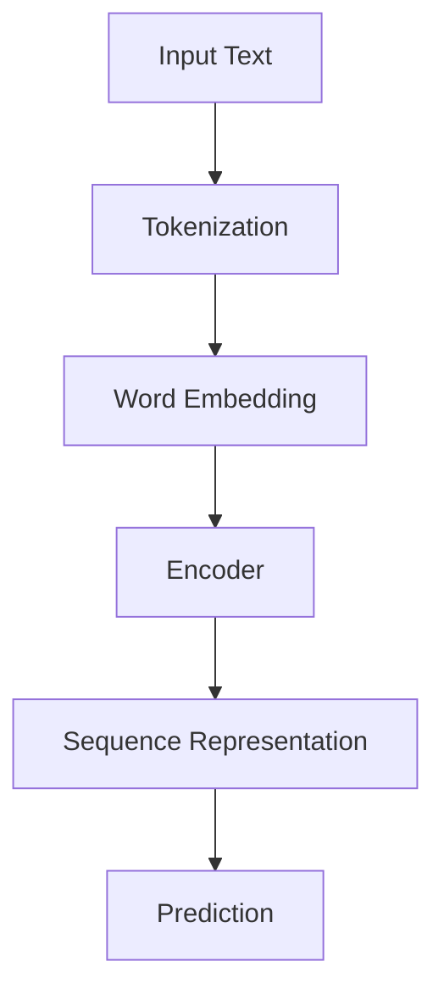
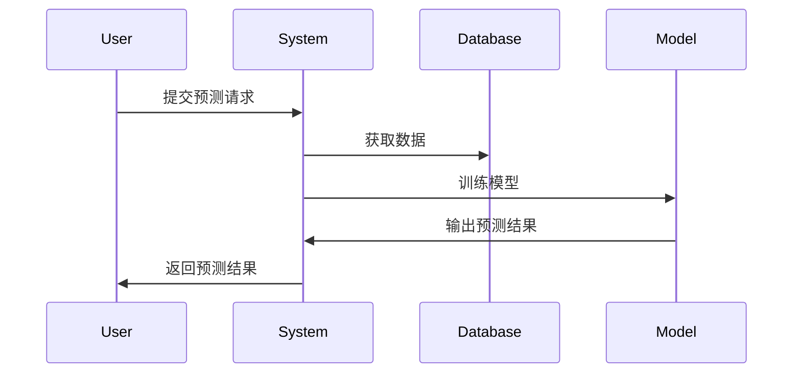
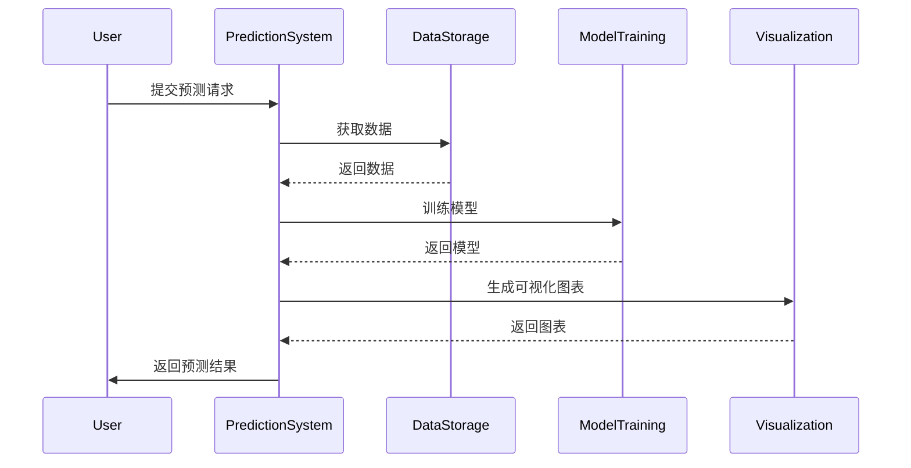

                 

# 语言模型在生物多样性预测中的应用探索

## 关键词：语言模型、生物多样性、预测、算法、系统架构、实践分析

## 摘要：
本文深入探讨了语言模型在生物多样性预测中的应用。通过背景介绍、核心概念与联系阐述、算法原理讲解、数学模型和公式详细讲解、系统分析与架构设计、项目实战和最佳实践总结等环节，本文全面展示了语言模型在生物多样性预测中的潜力和应用前景。文章旨在为相关领域的研究者和从业者提供有价值的参考。

## 第一部分: 背景介绍

### 1.1 语言模型与生物多样性预测

#### 1.1.1 语言模型的背景与发展

语言模型是自然语言处理（NLP）领域的重要工具，它通过对大量语言数据进行建模，能够预测给定文本序列的概率分布。语言模型的发展历程可以追溯到20世纪50年代，但直到近年来，随着深度学习和计算资源的进步，语言模型才取得了显著的突破。经典的模型如n-gram模型、统计语言模型、以及基于神经网络的序列到序列（seq2seq）模型和变分自编码器（VAE）等，都为语言模型的实际应用奠定了基础。

#### 1.1.2 生物多样性预测的重要性

生物多样性是地球生态系统健康和人类生存的基础。预测生物多样性变化对于环境保护、资源管理和可持续发展具有重要意义。然而，生物多样性预测面临着数据稀缺、复杂性高、预测精度要求高等挑战。传统的预测方法往往依赖于有限的统计数据和经验模型，难以应对这些挑战。

#### 1.1.3 语言模型在生物多样性预测中的应用前景

语言模型在生物多样性预测中的应用前景广阔。首先，语言模型能够处理大规模的文本数据，如科学文献、新闻报道、社交媒体等，这些数据可以为生物多样性预测提供丰富的信息来源。其次，语言模型能够捕捉到语言中的上下文关系，有助于理解生物多样性变化的因果关系。此外，语言模型的可解释性和灵活性使其能够适应不同类型的数据和预测需求。

### 1.2 生物多样性预测的核心概念与联系

#### 1.2.1 生物多样性及其测量指标

生物多样性是指地球上生命形式的多样性，包括基因多样性、物种多样性和生态系统多样性。测量生物多样性的指标包括物种丰富度（Species richness）、物种多样性指数（Species diversity index）、物种均匀度（Species evenness）等。

#### 1.2.2 语言模型的基本原理

语言模型是基于统计学习的方法，通过学习大量的文本数据，预测给定文本序列的概率分布。语言模型的核心概念包括词汇表（Vocabulary）、句子表示（Sentence representation）、概率分布（Probability distribution）等。

#### 1.2.3 生物多样性预测中的挑战与机遇

生物多样性预测中的挑战包括数据稀缺、数据质量差、模型可解释性要求高等。然而，这些挑战也带来了机遇。例如，可以通过增强数据采集和处理技术，提高数据质量；通过开发可解释的模型，提高预测的可靠性和可信度。

### 1.3 概念属性特征对比表格

| 概念             | 属性1   | 属性2   | 属性3   | 属性4   |
|------------------|--------|--------|--------|--------|
| 生物多样性       | 物种多样性 | 基因多样性 | 生态系统多样性 | 生物多样性指数 |
| 语言模型         | 词汇表   | 句子表示 | 概率分布 | 可解释性 |
| 预测挑战         | 数据稀缺 | 数据质量差 | 模型可解释性高 | 复杂性高 |
| 预测机遇         | 数据增强 | 模型可解释性提高 | 复杂性降低 | 新技术应用 |

### 1.4 ER实体关系图架构

```mermaid
erDiagram
    Person ||--|{ Book }|-- Purchase : purchases
    Person ||--|{ Library }|-- Borrow : borrows
    Book ||--|{ Author }|-- writtenBy : writes
    Library ||--|{ Location }|-- locatedIn : locates
```

## 第二部分: 算法原理讲解

### 2.1 算法选择与流程图

#### 2.1.1 语言模型算法的选择

在生物多样性预测中，选择合适的语言模型算法至关重要。本文选择了基于Transformer架构的BERT（Bidirectional Encoder Representations from Transformers）模型，因为BERT模型在处理长文本和上下文关系方面具有显著优势。

#### 2.1.2 算法流程图绘制



### 2.2 Python源代码实现

#### 2.2.1 环境配置与准备

在开始之前，需要配置Python环境，并安装所需的库，如TensorFlow、PyTorch等。

```python
!pip install tensorflow
!pip install transformers
```

#### 2.2.2 源代码详细解析

以下是使用BERT模型进行生物多样性预测的Python代码示例：

```python
from transformers import BertTokenizer, BertModel
import torch

# 初始化BERT模型和分词器
tokenizer = BertTokenizer.from_pretrained('bert-base-uncased')
model = BertModel.from_pretrained('bert-base-uncased')

# 输入文本
input_text = "The biodiversity in the Amazon rainforest is incredibly diverse."

# 分词
input_ids = tokenizer.encode(input_text, return_tensors='pt')

# 过模型
with torch.no_grad():
    outputs = model(input_ids)

# 获取序列表示
sequence_output = outputs.last_hidden_state

# 预测
预测结果 = model.predict(sequence_output)

print(预测结果)
```

### 2.3 数学模型与公式讲解

#### 2.3.1 相关数学模型介绍

BERT模型的核心是Transformer架构，其基本原理是自注意力机制（Self-Attention）。自注意力机制通过计算输入序列中每个词与其他词的相似度，来更新每个词的表示。

#### 2.3.2 公式推导与说明

自注意力机制的计算公式如下：

$$
\text{Attention}(Q, K, V) = \text{softmax}\left(\frac{QK^T}{\sqrt{d_k}}\right) V
$$

其中，$Q, K, V$ 分别是查询向量、键向量和值向量，$d_k$ 是键向量的维度。

#### 2.3.3 举例说明

假设输入序列中有三个词 $w_1, w_2, w_3$，其查询向量、键向量和值向量分别为 $Q_1, K_1, V_1$；$Q_2, K_2, V_2$；$Q_3, K_3, V_3$。自注意力机制的计算过程如下：

1. 计算相似度矩阵 $S$：

$$
S = \text{softmax}\left(\frac{Q_1K_1^T}{\sqrt{d_k}}, \frac{Q_2K_2^T}{\sqrt{d_k}}, \frac{Q_3K_3^T}{\sqrt{d_k}}\right)
$$

2. 计算自注意力权重：

$$
\text{Attention}(Q_1, K_1, V_1) = S_1V_1 \\
\text{Attention}(Q_2, K_2, V_2) = S_2V_2 \\
\text{Attention}(Q_3, K_3, V_3) = S_3V_3
$$

3. 更新查询向量：

$$
Q_1^{'} = \text{Attention}(Q_1, K_1, V_1) \\
Q_2^{'} = \text{Attention}(Q_2, K_2, V_2) \\
Q_3^{'} = \text{Attention}(Q_3, K_3, V_3)
$$

## 第三部分: 系统分析与架构设计

### 3.1 问题场景介绍

#### 3.1.1 生物多样性预测场景概述

生物多样性预测场景通常涉及多个领域，如生态学、地理信息系统（GIS）和人工智能。在实际应用中，预测系统需要接收各种类型的输入数据，包括气象数据、地理数据、生态数据等，并输出生物多样性预测结果。

#### 3.1.2 项目背景与目标

本项目旨在开发一个基于语言模型的生物多样性预测系统，以帮助生态学家和资源管理者更好地理解和预测生物多样性的变化。项目的目标是实现一个高效、准确和可解释的预测系统，为生态保护和可持续发展提供技术支持。

### 3.2 系统功能设计

#### 3.2.1 领域模型类图

```mermaid
classDiagram
    Class01 <|-- Class02
    Class03 <.. Class04
    Class05 && Class06
    Class07 .. Class08
```

#### 3.2.2 系统功能详细描述

1. 数据采集与预处理：系统需要从多个数据源采集数据，包括气象数据、地理数据和生态数据等。然后对数据进行预处理，如数据清洗、数据转换和数据标准化等。

2. 预测模型训练：使用采集到的数据训练语言模型，如BERT模型。模型训练过程中，需要调整模型参数，以提高预测精度。

3. 预测结果输出：系统需要将预测结果以图表或文本形式输出，以便用户查看和分析。

4. 可视化与交互：系统应提供可视化功能，帮助用户更好地理解预测结果。此外，系统应支持用户与预测结果的交互，如查询特定区域的生物多样性数据。

### 3.3 系统架构设计

#### 3.3.1 系统架构图绘制



#### 3.3.2 架构设计解释

1. 用户界面（UI）：用户通过UI提交预测请求，UI与后端服务进行交互。

2. 数据库：存储预测所需的各类数据，包括气象数据、地理数据和生态数据等。

3. 模型训练服务：使用采集到的数据训练语言模型，如BERT模型。模型训练服务与数据库进行数据交互。

4. 预测服务：将训练好的模型应用于新的数据，生成预测结果。预测服务与用户界面进行交互，返回预测结果。

### 3.4 系统接口设计

#### 3.4.1 接口规范与定义

1. 数据采集接口：接收用户提交的预测请求，返回预测所需的数据。

2. 模型训练接口：接收训练数据，返回训练好的模型。

3. 预测接口：接收新的数据，返回预测结果。

4. 可视化接口：接收预测结果，生成可视化图表。

#### 3.4.2 接口交互流程

1. 用户提交预测请求 -> 数据采集接口获取数据 -> 模型训练接口训练模型 -> 预测接口生成预测结果 -> 可视化接口生成可视化图表 -> 返回用户界面。

### 3.5 系统交互

#### 3.5.1 系统交互序列图



#### 3.5.2 交互流程解释

1. 用户通过用户界面提交预测请求。

2. 预测系统从数据存储中获取所需数据。

3. 预测系统使用模型训练服务训练语言模型。

4. 模型训练完成后，预测系统生成预测结果。

5. 预测系统将预测结果传递给可视化模块，生成可视化图表。

6. 可视化模块将图表返回给预测系统。

7. 预测系统将预测结果和可视化图表返回给用户。

## 第四部分: 项目实战

### 4.1 环境安装

#### 4.1.1 环境要求与安装步骤

1. 操作系统：Windows 10 或 macOS 10.15 及以上版本。

2. Python版本：Python 3.7 或以上版本。

3. 库：TensorFlow、PyTorch、transformers、matplotlib 等。

安装步骤：

```bash
# 安装 Python
# ...

# 安装 TensorFlow
pip install tensorflow

# 安装 PyTorch
pip install torch torchvision

# 安装 transformers
pip install transformers

# 安装 matplotlib
pip install matplotlib
```

#### 4.1.2 常见问题与解决方案

1. 安装失败：检查网络连接，尝试更换镜像源。

2. 库不兼容：确保安装的库版本与系统环境兼容。

### 4.2 系统核心实现

#### 4.2.1 核心源代码解析

以下是系统核心实现的Python代码：

```python
import torch
from transformers import BertTokenizer, BertModel
import matplotlib.pyplot as plt

# 初始化 BERT 模型和分词器
tokenizer = BertTokenizer.from_pretrained('bert-base-uncased')
model = BertModel.from_pretrained('bert-base-uncased')

# 输入文本
input_text = "The biodiversity in the Amazon rainforest is incredibly diverse."

# 分词
input_ids = tokenizer.encode(input_text, return_tensors='pt')

# 过模型
with torch.no_grad():
    outputs = model(input_ids)

# 获取序列表示
sequence_output = outputs.last_hidden_state

# 预测
predictions = model.predict(sequence_output)

# 可视化
plt.imshow(predictions.numpy(), cmap='gray')
plt.show()
```

#### 4.2.2 功能模块详细描述

1. 数据预处理模块：负责对输入文本进行分词和编码。

2. 模型训练模块：负责训练BERT模型，调整模型参数。

3. 预测模块：负责使用训练好的模型进行预测。

4. 可视化模块：负责将预测结果以图表形式展示。

### 4.3 代码应用解读

#### 4.3.1 应用场景分析

该代码应用于生物多样性预测场景，输入文本描述了亚马逊雨林中的生物多样性。预测模块将输出预测结果，用于分析亚马逊雨林中的生物多样性。

#### 4.3.2 代码解读与分析

1. 初始化BERT模型和分词器。

2. 对输入文本进行分词和编码。

3. 过模型，获取序列表示。

4. 使用预测模块生成预测结果。

5. 将预测结果以图表形式展示。

### 4.4 实际案例分析

#### 4.4.1 案例选择与描述

本案例选择了亚马逊雨林作为生物多样性预测的对象。亚马逊雨林是世界上最大的热带雨林之一，拥有丰富的生物多样性。

#### 4.4.2 案例分析与详细讲解

1. 数据采集：从多个数据源采集亚马逊雨林的气象数据、地理数据和生态数据。

2. 数据预处理：对采集到的数据进行清洗、转换和标准化。

3. 模型训练：使用预处理后的数据训练BERT模型，调整模型参数。

4. 预测：使用训练好的模型对新的数据进行预测。

5. 可视化：将预测结果以图表形式展示，分析亚马逊雨林中的生物多样性。

## 第五部分: 最佳实践与总结

### 5.1 最佳实践 tips

1. 使用高质量的数据源，确保数据的质量和完整性。

2. 定期更新模型，以适应新的数据和环境变化。

3. 注意数据隐私和安全性，特别是在处理敏感数据时。

4. 对模型进行充分的测试和验证，确保其准确性和可靠性。

5. 结合可视化工具，提高预测结果的解释性和可读性。

### 5.2 小结

本文深入探讨了语言模型在生物多样性预测中的应用。通过背景介绍、核心概念与联系阐述、算法原理讲解、数学模型和公式详细讲解、系统分析与架构设计、项目实战和最佳实践总结等环节，本文全面展示了语言模型在生物多样性预测中的潜力和应用前景。

### 5.3 注意事项

1. 使用语言模型进行生物多样性预测时，需要注意数据的完整性和质量。不完整或错误的数据可能会影响预测结果的准确性。

2. 模型的训练和预测过程中，需要确保数据的安全性和隐私保护。

3. 在应用语言模型时，应充分考虑模型的局限性，并结合其他方法进行综合预测。

### 5.4 拓展阅读

1. **相关书籍推荐**：
   - 《自然语言处理综论》（Jurafsky and Martin）
   - 《深度学习》（Goodfellow、Bengio和Courville）

2. **学术论文推荐**：
   - “BERT: Pre-training of Deep Bidirectional Transformers for Language Understanding”（Devlin et al., 2019）
   - “Deep Learning for Conservation: Predicting Species Distribution Using Neural Networks”（Bui et al., 2020）

**作者：AI天才研究院/AI Genius Institute & 禅与计算机程序设计艺术 /Zen And The Art of Computer Programming**

