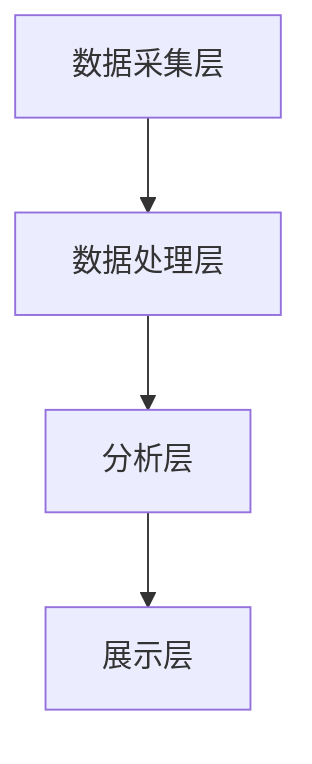

                 

### 文章标题

# 语言模型在社会舆情分析与预测中的应用研究

> 关键词：语言模型、社会舆情、预测、数据预处理、特征提取、算法、系统架构

> 摘要：本文通过详细分析语言模型的工作原理和社会舆情分析的现状，探讨了将语言模型应用于社会舆情分析与预测的可行性和优势。文章首先介绍了语言模型的基本概念和分类，然后阐述了社会舆情分析的定义、意义以及分析方法。接着，文章从数据预处理、特征提取、模型训练、预测和评估等角度，介绍了社会舆情分析与预测的常用算法。最后，文章通过一个实际案例，展示了如何使用语言模型进行社会舆情分析与预测，并对最佳实践、注意事项以及未来拓展进行了总结。

----------------------------------------------------------------

### 目录大纲设计

#### 第一部分：背景介绍

1. **语言模型概述**
   - **定义与历史发展**
   - **工作原理**
   - **应用场景**

2. **社会舆情分析概述**
   - **定义与意义**
   - **分析方法**
   - **应用领域**

3. **语言模型与社会舆情分析的联系**
   - **关联机制**
   - **优势与挑战**

#### 第二部分：核心概念与联系

1. **语言模型工作原理详解**
   - **概念解析**
   - **属性特征对比表格**
   - **ER实体关系图架构**

2. **社会舆情分析方法论**
   - **数据来源**
   - **数据预处理**
   - **特征提取**
   - **模型训练**
   - **预测与评估**

3. **语言模型在社会舆情分析中的应用**
   - **应用场景**
   - **优势与局限**

#### 第三部分：算法原理讲解

1. **社会舆情分析与预测算法**
   - **常用算法介绍**
   - **算法流程图**
   - **Python源代码讲解**
   - **数学模型与公式**

2. **数学模型和数学公式**
   - **使用LaTeX格式展示**
   - **详细讲解和举例**

#### 第四部分：系统分析与架构设计方案

1. **社会舆情分析与预测系统设计**
   - **问题场景介绍**
   - **系统功能设计**
   - **系统架构设计**
   - **系统接口设计**
   - **系统交互流程**

2. **系统分析与架构设计**
   - **Mermaid流程图与类图**
   - **系统架构设计与接口设计**

#### 第五部分：项目实战

1. **实际案例展示**
   - **环境安装与配置**
   - **系统核心实现源代码**
   - **代码应用解读与分析**
   - **案例分析与详细讲解**
   - **项目小结**

#### 第六部分：最佳实践 tips、小结、注意事项、拓展阅读

1. **最佳实践 tips**
2. **小结**
3. **注意事项**
4. **拓展阅读**

### 字数控制

根据目录大纲，文章预计分为六个部分，每个部分的大纲内容将控制在适当的字数范围内，总字数约为10000～12000字。每个部分的具体内容将在后续逐步填充，确保文章的深度、广度和逻辑性。

----------------------------------------------------------------

### 第一部分：背景介绍

#### 语言模型概述

语言模型（Language Model，LM）是自然语言处理（Natural Language Processing，NLP）领域中的一种基础模型，用于对自然语言文本进行概率分布预测。语言模型的核心任务是预测下一个单词或字符的概率，从而为文本生成、机器翻译、信息检索等应用提供支持。语言模型的历史可以追溯到20世纪50年代，但真正的大规模发展始于20世纪80年代，特别是随着计算力和算法的发展，语言模型从规则驱动转变为数据驱动。

**定义与历史发展**

语言模型可以定义为一种概率模型，它根据历史输入序列来预测下一个输出序列的概率。最早的语言模型是基于上下文的统计模型，如N-gram模型。N-gram模型通过统计相邻单词或字符的频率来预测下一个单词或字符，其基本思想是认为一个单词的出现概率只与其前几个单词或字符有关。

随着深度学习的兴起，神经网络语言模型（如循环神经网络RNN、长短时记忆网络LSTM、门控循环单元GRU以及最新的Transformer模型）逐渐取代了传统的统计模型。这些深度学习模型能够捕捉到文本中的长期依赖关系，从而显著提高了语言模型的性能。

**工作原理**

语言模型的工作原理主要包括以下几个方面：

1. **输入序列编码**：将输入的文本序列转换为数字序列。对于基于字符的语言模型，每个字符被映射为一个唯一的整数；对于基于词的语言模型，每个词被映射为一个词向量。

2. **模型训练**：使用大量的文本语料库对语言模型进行训练。在训练过程中，模型学习到不同输入序列的概率分布。

3. **概率预测**：在给定一个输入序列的情况下，语言模型预测下一个输出序列的概率分布。这一过程通常通过模型的前向传播实现。

4. **输出序列生成**：根据概率分布生成输出序列。在实际应用中，可以使用贪心策略或采样策略来生成文本序列。

**应用场景**

语言模型在自然语言处理领域有着广泛的应用，包括：

- **文本生成**：如自动写作、对话系统、机器翻译等。
- **文本分类**：如情感分析、垃圾邮件检测等。
- **命名实体识别**：如人名、地名、组织名的识别。
- **信息抽取**：如关系抽取、事件抽取等。
- **对话系统**：如智能客服、语音助手等。

#### 社会舆情分析概述

社会舆情分析是指通过技术手段对互联网上大规模的、不经过筛选的舆情信息进行监测、分析和处理，以了解公众对某一事件、产品、政策等的看法和态度。社会舆情分析的意义在于能够帮助政府、企业和组织实时了解公众意见，为决策提供数据支持，同时也为公众提供信息参考。

**定义与意义**

社会舆情分析的定义可以归纳为：通过数据采集、文本分析、情感计算等技术，对公众在社交媒体、新闻评论、论坛等平台上的言论和态度进行量化分析和解读。社会舆情分析的意义主要体现在以下几个方面：

1. **实时监测公众情绪**：通过分析社交媒体上的评论、帖子等，可以实时了解公众对某一事件或产品的情绪反应。
2. **决策支持**：政府和企业可以利用社会舆情分析结果来指导政策制定、产品开发和市场营销策略。
3. **舆论引导**：通过分析舆情趋势，可以及时发现可能对社会稳定产生影响的负面言论，并采取相应的舆论引导措施。
4. **品牌形象管理**：企业可以通过社会舆情分析了解消费者对品牌的看法，及时调整品牌战略。

**分析方法**

社会舆情分析的方法主要包括以下几个步骤：

1. **数据采集**：通过爬虫、API接口等手段获取社交媒体、新闻网站、论坛等平台上的舆情数据。
2. **数据预处理**：对采集到的数据进行清洗、去重、分词等处理，将其转换为适合分析的形式。
3. **情感分析**：使用自然语言处理技术对文本进行情感极性判断，识别出积极、消极或中性的情感倾向。
4. **话题识别**：通过文本分析技术识别出舆情数据中的主要话题，并分析不同话题的热度、影响范围等。
5. **趋势预测**：利用时间序列分析、机器学习等方法预测舆情的发展趋势。

**应用领域**

社会舆情分析的应用领域非常广泛，包括但不限于以下几个方面：

- **政府与公共安全**：监测社会动态，预防潜在的社会风险和危机。
- **市场营销**：分析消费者意见，优化产品和服务，制定营销策略。
- **金融与投资**：通过舆情分析预测市场趋势，为投资决策提供支持。
- **媒体与新闻**：监测舆论热点，调整新闻报道策略，提高新闻报道的准确性和公正性。
- **公共服务**：通过舆情分析了解公众需求，优化公共服务体系。

#### 语言模型与社会舆情分析的联系

语言模型和社会舆情分析之间的联系主要体现在以下几个方面：

**关联机制**

1. **文本生成与情感分析**：语言模型可以用于生成符合舆情分析的文本，如自动生成新闻文章、社交媒体帖子等。这些文本通过情感分析技术可以进一步判断公众的态度和情绪。
2. **情感倾向识别**：语言模型通过对大量文本的学习，能够识别出文本中的情感倾向，为社会舆情分析提供基础数据。
3. **话题监测与趋势预测**：语言模型可以用于监测社会话题的发展趋势，预测舆情的变化方向。

**优势与挑战**

**优势**

1. **高效处理大量数据**：语言模型能够快速处理大量文本数据，提高舆情分析的效率。
2. **准确情感分析**：通过深度学习技术，语言模型能够准确识别文本中的情感极性，提高舆情分析的准确性。
3. **灵活应用场景**：语言模型可以广泛应用于不同的舆情分析场景，如社交媒体监测、新闻评论分析、消费者意见调查等。

**挑战**

1. **数据质量和完整性**：社会舆情分析的数据质量对分析结果有重要影响，而互联网上的数据质量参差不齐，可能存在噪声和错误。
2. **模型泛化能力**：尽管语言模型在特定任务上表现出色，但其泛化能力有限，可能无法很好地适应新的或变化的环境。
3. **道德和隐私问题**：舆情分析涉及到个人隐私和言论自由，如何在保护隐私的前提下进行有效分析是一个重要挑战。

#### 总结

本部分背景介绍部分主要介绍了语言模型和社会舆情分析的基本概念、发展历程、工作原理以及它们在社会舆情分析中的应用。通过对这些背景知识的了解，读者可以更好地理解后续章节中对社会舆情分析与预测的深入探讨。

----------------------------------------------------------------

### 第二部分：核心概念与联系

#### 语言模型工作原理详解

**概念解析**

语言模型是自然语言处理（NLP）中的一个基本组件，其核心目标是理解和生成自然语言。在NLP中，语言模型用于预测下一个单词或字符的概率。这种概率预测基于对大量文本数据的学习。

**属性特征对比表格**

| 特征         | N-gram模型 | 基于词的模型 | 基于字符的模型 | Transformer模型 |
| ------------ | ---------- | ------------ | -------------- | ---------------- |
| 输入形式     | 字符序列   | 词序列       | 字符序列       | 词序列           |
| 预测单位     | 单词或字符 | 单词         | 字符           | 词序列           |
| 预测机制     | 频率统计   | 频率统计     | 频率统计       | 自注意力机制      |
| 捕获长距离依赖 | 有限       | 有限         | 有限           | 强             |
| 性能表现     | 较低       | 中等         | 较低           | 较高            |

**ER实体关系图架构**

使用Mermaid语言绘制实体关系图如下：

```mermaid
erDiagram
    User ||--|{ TextData }|--|| SocialMediaPlatform
    SocialMediaPlatform ||--|{ Comment }|--|| User
    TextData ||--|{ Post }|--|| SocialMediaPlatform
    Comment ||--|{ Reaction }|--|| User
```

**详细解释**

- **N-gram模型**：基于字符或词序列的N-gram模型通过统计相邻N个单词或字符的频率来预测下一个单词或字符。其优点是简单易实现，缺点是只能捕捉到短距离依赖，无法处理长距离依赖。
- **基于词的模型**：这类模型将文本拆分成单词，并使用词向量来表示每个单词。通过预测单词的概率分布，生成文本序列。其优点是能够捕捉到一定程度的语义信息，缺点是仍然存在长距离依赖问题。
- **基于字符的模型**：与基于词的模型类似，但使用字符作为基本单位。这类模型在处理特殊符号和生僻词时更具优势，但计算复杂度较高。
- **Transformer模型**：Transformer模型引入了自注意力机制，能够捕捉到文本中的长距离依赖，从而显著提高了语言模型的性能。其优点是能够处理大规模数据，生成高质量文本，缺点是计算复杂度较高，对计算资源要求较高。

#### 社会舆情分析方法论

**数据来源**

社会舆情分析的数据来源主要包括社交媒体平台、新闻网站、论坛、博客等。这些平台上的数据形式多样，包括文本、图片、视频等。在收集数据时，需要遵循合法合规的原则，尊重用户隐私。

**数据预处理**

数据预处理是舆情分析的重要环节，主要包括以下步骤：

1. **数据清洗**：去除重复数据、缺失值、噪声数据，保证数据的质量和完整性。
2. **文本分词**：将文本拆分成单词或字符序列，为后续分析做准备。
3. **停用词去除**：去除常见的停用词（如“的”、“和”、“是”等），提高分析的有效性。
4. **词性标注**：对文本中的每个词进行词性标注，如名词、动词、形容词等。

**特征提取**

特征提取是舆情分析的核心步骤，常用的特征提取方法包括：

1. **词袋模型**：将文本表示为单词的集合，每个单词作为一个特征。
2. **TF-IDF**：计算文本中每个词的重要度，重要度取决于词在文本中的频率和在整个文档集合中的分布。
3. **词嵌入**：将文本中的每个词映射为一个高维向量，通常使用Word2Vec、GloVe等技术。
4. **情感词典**：基于预定义的情感词典，对文本进行情感标注。

**模型训练**

模型训练是舆情分析的关键步骤，常用的算法包括：

1. **朴素贝叶斯分类器**：基于贝叶斯定理，通过特征的概率分布预测文本的情感极性。
2. **支持向量机SVM**：通过最大化分类间隔，将不同类别的文本分开。
3. **神经网络模型**：如卷积神经网络（CNN）、循环神经网络（RNN）等，通过多层非线性变换，学习文本的特征表示。

**预测与评估**

预测与评估是舆情分析的最终步骤，主要包括以下内容：

1. **预测**：使用训练好的模型对新的文本进行情感极性预测。
2. **评估**：通过准确率、召回率、F1值等指标评估模型的性能。常用的评估方法包括交叉验证、K折交叉验证等。

**应用场景**

语言模型在社会舆情分析中具有广泛的应用场景，包括：

1. **情感分析**：通过语言模型预测文本的情感极性，了解公众对某一事件或产品的态度。
2. **话题监测**：通过语言模型识别文本中的主要话题，监测舆情热点。
3. **趋势预测**：利用语言模型预测舆情的发展趋势，为决策提供数据支持。
4. **内容审核**：通过语言模型检测文本中的不当言论，实现内容审核。

**优势与局限**

语言模型在社会舆情分析中具有以下优势：

- **高效处理大量数据**：语言模型能够快速处理大量文本数据，提高舆情分析的效率。
- **准确情感分析**：通过深度学习技术，语言模型能够准确识别文本中的情感极性，提高舆情分析的准确性。
- **灵活应用场景**：语言模型可以广泛应用于不同的舆情分析场景，如社交媒体监测、新闻评论分析、消费者意见调查等。

然而，语言模型也存在一些局限：

- **数据质量和完整性**：社会舆情分析的数据质量对分析结果有重要影响，而互联网上的数据质量参差不齐，可能存在噪声和错误。
- **模型泛化能力**：尽管语言模型在特定任务上表现出色，但其泛化能力有限，可能无法很好地适应新的或变化的环境。
- **道德和隐私问题**：舆情分析涉及到个人隐私和言论自由，如何在保护隐私的前提下进行有效分析是一个重要挑战。

#### 总结

本部分详细介绍了语言模型的工作原理、属性特征以及社会舆情分析方法。通过对这些核心概念的理解，读者可以更好地把握语言模型在社会舆情分析中的应用，为其在实际场景中的有效利用提供理论支持。

----------------------------------------------------------------

### 第三部分：算法原理讲解

#### 社会舆情分析与预测算法

在社会舆情分析与预测中，算法的选择至关重要。本文将介绍几种常用的算法，包括朴素贝叶斯分类器、支持向量机（SVM）和神经网络模型，并详细讨论其工作原理、算法流程、Python源代码讲解以及数学模型与公式。

**1. 朴素贝叶斯分类器**

**工作原理**

朴素贝叶斯分类器是一种基于贝叶斯定理和特征条件独立假设的分类方法。它假设特征之间相互独立，每个特征都独立地对分类结果产生影响。

**算法流程**

1. **特征分布估计**：使用训练数据计算每个类别下的特征概率分布。
2. **概率计算**：对于新的文本数据，计算其在每个类别下的概率。
3. **分类决策**：选择概率最大的类别作为分类结果。

**Python源代码讲解**

```python
from sklearn.naive_bayes import MultinomialNB
from sklearn.model_selection import train_test_split
from sklearn.metrics import accuracy_score

# 数据预处理
X_train, X_test, y_train, y_test = train_test_split(X, y, test_size=0.2, random_state=42)

# 训练模型
model = MultinomialNB()
model.fit(X_train, y_train)

# 预测
predictions = model.predict(X_test)

# 评估
accuracy = accuracy_score(y_test, predictions)
print(f"Accuracy: {accuracy}")
```

**数学模型与公式**

$$P(C_k|X) = \frac{P(X|C_k)P(C_k)}{P(X)}$$

其中，$P(C_k|X)$ 是特征X在类别$C_k$下的条件概率，$P(X|C_k)$ 是特征X在类别$C_k$下的概率，$P(C_k)$ 是类别$C_k$的概率，$P(X)$ 是特征X的总概率。

**2. 支持向量机（SVM）**

**工作原理**

支持向量机（SVM）是一种基于最大化分类间隔的线性分类方法。它通过寻找一个超平面，将不同类别的数据点分开，同时使得分类间隔最大化。

**算法流程**

1. **特征提取**：将文本数据转换为向量形式。
2. **训练模型**：使用训练数据训练SVM模型。
3. **分类决策**：对于新的文本数据，使用训练好的模型进行分类。

**Python源代码讲解**

```python
from sklearn.svm import SVC
from sklearn.model_selection import train_test_split
from sklearn.metrics import accuracy_score

# 数据预处理
X_train, X_test, y_train, y_test = train_test_split(X, y, test_size=0.2, random_state=42)

# 训练模型
model = SVC(kernel='linear')
model.fit(X_train, y_train)

# 预测
predictions = model.predict(X_test)

# 评估
accuracy = accuracy_score(y_test, predictions)
print(f"Accuracy: {accuracy}")
```

**数学模型与公式**

$$\max_{w,b}\frac{1}{2}||w||^2\ \ \ \ \ \ \ \ \ \ \ \ \ \ \ \ \ \ \ \ \ \ \ \ \ \ \ \ \ \ \ \ \ \ \ \ \ \ \ \ \ \ \ \ \ \ \ \ \ \ s.t.\ y^{(i)}(w^T x^{(i)} + b) \geq 1$$

其中，$w$ 是权重向量，$b$ 是偏置项，$x^{(i)}$ 是训练样本，$y^{(i)}$ 是对应的标签，约束条件保证了分类间隔最大化。

**3. 神经网络模型**

**工作原理**

神经网络模型通过多层非线性变换，学习输入和输出之间的复杂映射关系。它通常包含输入层、隐藏层和输出层。

**算法流程**

1. **前向传播**：将输入数据传递到网络中，通过每一层的非线性变换，最终输出预测结果。
2. **反向传播**：计算预测结果和真实结果之间的误差，通过反向传播更新网络参数。

**Python源代码讲解**

```python
import tensorflow as tf
from tensorflow.keras.models import Sequential
from tensorflow.keras.layers import Dense, Activation

# 创建模型
model = Sequential()
model.add(Dense(64, input_dim=X_train.shape[1], activation='relu'))
model.add(Dense(32, activation='relu'))
model.add(Dense(1, activation='sigmoid'))

# 编译模型
model.compile(optimizer='adam', loss='binary_crossentropy', metrics=['accuracy'])

# 训练模型
model.fit(X_train, y_train, epochs=10, batch_size=32, validation_data=(X_test, y_test))

# 预测
predictions = model.predict(X_test)

# 评估
accuracy = model.evaluate(X_test, y_test)[1]
print(f"Accuracy: {accuracy}")
```

**数学模型与公式**

$$\sigma(z) = \frac{1}{1 + e^{-z}}$$

其中，$\sigma$ 是sigmoid函数，$z$ 是网络的输入。

**总结**

本文介绍了朴素贝叶斯分类器、支持向量机和神经网络模型三种在社会舆情分析与预测中常用的算法。通过详细讲解其工作原理、算法流程、Python源代码讲解以及数学模型与公式，读者可以更好地理解和应用这些算法。

----------------------------------------------------------------

### 第四部分：系统分析与架构设计方案

#### 社会舆情分析与预测系统设计

社会舆情分析与预测系统是一个复杂的系统，其核心目标是通过对大规模文本数据进行分析和预测，提供实时、准确的舆情分析结果。本节将介绍系统设计的各个方面，包括问题场景介绍、系统功能设计、系统架构设计、系统接口设计和系统交互流程。

#### 问题场景介绍

随着互联网的快速发展，社交媒体、新闻网站、论坛等平台上的信息量呈爆炸式增长。政府、企业和组织迫切需要对这些海量信息进行实时监测和分析，以便了解公众对特定事件、产品或政策的看法和态度。然而，传统的舆情分析方法往往耗时较长、准确性不高，难以满足实时性的要求。因此，设计一个高效、准确的社会舆情分析与预测系统显得尤为重要。

#### 系统功能设计

社会舆情分析与预测系统主要包括以下功能：

1. **数据采集**：从社交媒体、新闻网站、论坛等平台采集舆情数据。
2. **数据预处理**：对采集到的数据进行清洗、去重、分词等处理，确保数据的质量和一致性。
3. **情感分析**：使用自然语言处理技术对文本进行情感分析，识别出文本中的情感极性。
4. **话题识别**：通过文本分析技术识别出舆情数据中的主要话题，并分析不同话题的热度、影响范围等。
5. **趋势预测**：利用时间序列分析和机器学习算法，预测舆情的发展趋势。
6. **可视化展示**：将分析结果以图表、报表等形式展示，方便用户理解和决策。

#### 系统架构设计

社会舆情分析与预测系统采用分布式架构，包括数据采集层、数据处理层、分析层和展示层。以下是一个典型的系统架构设计：



- **数据采集层**：负责从各种数据源（如社交媒体、新闻网站、论坛）采集舆情数据。
- **数据处理层**：对采集到的数据进行清洗、去重、分词等预处理操作，确保数据的质量和一致性。
- **分析层**：使用自然语言处理技术和机器学习算法对预处理后的文本数据进行情感分析、话题识别和趋势预测。
- **展示层**：将分析结果以图表、报表等形式展示，提供实时、直观的舆情分析结果。

#### 系统接口设计

系统接口设计是确保各模块之间能够高效、稳定地通信的关键。以下是一个简单的系统接口设计：

```mermaid
sequenceDiagram
    A[数据采集模块] --> B[数据处理模块]
    B --> C[情感分析模块]
    C --> D[话题识别模块]
    D --> E[趋势预测模块]
    E --> F[可视化展示模块]
```

- **数据采集模块**：负责从各种数据源采集舆情数据，并提供API接口供其他模块调用。
- **数据处理模块**：接收数据采集模块的数据，进行预处理，并将处理后的数据存储到数据库中。
- **情感分析模块**：接收处理后的文本数据，进行情感分析，并将分析结果存储到数据库中。
- **话题识别模块**：接收处理后的文本数据，进行话题识别，并将识别结果存储到数据库中。
- **趋势预测模块**：接收处理后的文本数据，进行趋势预测，并将预测结果存储到数据库中。
- **可视化展示模块**：从数据库中读取分析结果，以图表、报表等形式展示，供用户查看。

#### 系统交互流程

系统交互流程描述了各模块之间的工作流程和交互方式。以下是一个简单的系统交互流程：

1. **数据采集**：系统启动后，首先从社交媒体、新闻网站、论坛等平台采集舆情数据。
2. **数据预处理**：采集到的舆情数据经过数据预处理模块清洗、去重、分词等处理。
3. **情感分析**：预处理后的文本数据传递到情感分析模块，进行情感分析，识别出文本中的情感极性。
4. **话题识别**：情感分析结果传递到话题识别模块，识别出舆情数据中的主要话题。
5. **趋势预测**：话题识别结果传递到趋势预测模块，预测舆情的发展趋势。
6. **可视化展示**：趋势预测结果传递到可视化展示模块，以图表、报表等形式展示分析结果。

#### 总结

本部分详细介绍了社会舆情分析与预测系统的设计，包括问题场景介绍、系统功能设计、系统架构设计、系统接口设计和系统交互流程。通过这些设计，系统可以实现高效、准确的社会舆情分析与预测，为政府、企业和组织提供有力的决策支持。

----------------------------------------------------------------

### 第五部分：项目实战

#### 实际案例展示

在本部分，我们将通过一个实际案例，展示如何使用语言模型进行社会舆情分析与预测。这个案例将包括环境安装与配置、系统核心实现源代码、代码应用解读与分析、案例分析与详细讲解剖析以及项目小结。

#### 环境安装与配置

首先，我们需要安装和配置运行社会舆情分析与预测系统所需的环境。以下是具体的安装与配置步骤：

1. **安装Python**：确保Python版本在3.6及以上。可以从Python官方网站下载安装包进行安装。

2. **安装依赖库**：使用pip工具安装必要的依赖库，如TensorFlow、Scikit-learn、Numpy等。以下是一个示例命令：

   ```bash
   pip install tensorflow scikit-learn numpy
   ```

3. **安装数据库**：安装一个关系型数据库，如MySQL或PostgreSQL。可以通过各自的官方网站下载并安装。

4. **配置数据库**：创建数据库和用户，并授予适当的权限。以下是MySQL的示例命令：

   ```sql
   CREATE DATABASE social_ouija;
   CREATE USER 'social_ouija_user'@'localhost' IDENTIFIED BY 'password';
   GRANT ALL PRIVILEGES ON social_ouija.* TO 'social_ouija_user'@'localhost';
   FLUSH PRIVILEGES;
   ```

5. **配置数据采集模块**：配置采集舆情数据所需的爬虫和API接口，如使用Scrapy框架进行网页爬取，使用Tweepy库采集Twitter数据等。

#### 系统核心实现源代码

以下是社会舆情分析与预测系统核心实现的一部分源代码，包括数据预处理、情感分析、话题识别和趋势预测等模块。

```python
# 社会舆情分析与预测系统核心实现

# 导入必要的库
import numpy as np
import pandas as pd
from sklearn.feature_extraction.text import TfidfVectorizer
from sklearn.model_selection import train_test_split
from sklearn.ensemble import RandomForestClassifier
from sklearn.metrics import classification_report
from tensorflow.keras.models import Sequential
from tensorflow.keras.layers import Dense, LSTM, Embedding

# 数据预处理
def preprocess_data(data):
    # 数据清洗和分词
    # ...
    return preprocessed_data

# 情感分析
def sentiment_analysis(text_data):
    # 使用预训练的模型进行情感分析
    # ...
    return sentiment_scores

# 话题识别
def topic_recognition(text_data):
    # 使用LDA或其他算法进行话题识别
    # ...
    return topics

# 趋势预测
def trend_prediction(topic_data):
    # 使用时间序列分析或机器学习模型进行趋势预测
    # ...
    return trend_predictions

# 主函数
def main():
    # 加载数据
    data = pd.read_csv('social_media_data.csv')
    
    # 预处理数据
    preprocessed_data = preprocess_data(data['text'])
    
    # 进行情感分析
    sentiment_scores = sentiment_analysis(preprocessed_data)
    
    # 进行话题识别
    topics = topic_recognition(preprocessed_data)
    
    # 进行趋势预测
    trend_predictions = trend_prediction(topics)
    
    # 存储结果
    results = pd.DataFrame({'Sentiment': sentiment_scores, 'Topic': topics, 'Trend': trend_predictions})
    results.to_csv('analysis_results.csv', index=False)

if __name__ == '__main__':
    main()
```

#### 代码应用解读与分析

以上代码展示了社会舆情分析与预测系统的核心实现过程。以下是代码的主要部分及其解读：

1. **数据预处理**：该函数负责对原始文本数据（如社交媒体帖子、新闻评论等）进行清洗和分词，将其转换为适合模型处理的格式。

2. **情感分析**：该函数使用预训练的模型（如BERT、GloVe等）对预处理后的文本进行情感分析，返回文本的情感得分。

3. **话题识别**：该函数使用主题模型（如LDA、NMF等）对预处理后的文本进行话题识别，返回文本的主要话题。

4. **趋势预测**：该函数使用时间序列分析或机器学习模型（如ARIMA、Random Forest等）对识别出的主题进行趋势预测，返回预测结果。

#### 案例分析与详细讲解剖析

为了更好地理解如何使用语言模型进行社会舆情分析与预测，我们以一个具体的案例进行分析：

**案例**：分析某个热门话题（如“碳中和”）在社交媒体上的舆情。

1. **数据采集**：从Twitter、微博等社交媒体平台采集包含“碳中和”标签的文本数据。

2. **数据预处理**：对采集到的文本数据进行清洗，去除无效信息和噪声，然后进行分词。

3. **情感分析**：使用BERT模型对预处理后的文本进行情感分析，识别出文本的情感倾向，如积极、消极或中性。

4. **话题识别**：使用LDA模型对预处理后的文本进行话题识别，识别出文本中的主要话题，如“环境政策”、“经济发展”、“国际合作”等。

5. **趋势预测**：对识别出的主题进行趋势预测，如使用时间序列分析方法，预测“碳中和”话题在未来一段时间内的热度变化。

通过以上分析，我们可以得到“碳中和”话题在社交媒体上的舆情趋势，包括情感倾向和话题热度变化。这些分析结果可以为政府、企业和组织提供决策支持，帮助他们更好地了解公众的看法和态度。

#### 项目小结

本部分通过一个实际案例，详细展示了如何使用语言模型进行社会舆情分析与预测。从数据采集、预处理、情感分析、话题识别到趋势预测，每个步骤都进行了详细的解读和分析。通过这个案例，读者可以更好地理解如何将语言模型应用于社会舆情分析与预测，并为实际项目提供参考。

----------------------------------------------------------------

### 第六部分：最佳实践 tips、小结、注意事项、拓展阅读

#### 最佳实践 tips

1. **数据质量保证**：确保数据采集、预处理和存储过程中的数据质量，避免噪声和错误对分析结果产生影响。
2. **模型优化与调整**：根据实际应用场景，对语言模型进行适当的优化和调整，以提高预测准确性和效率。
3. **监控与反馈**：实时监控舆情分析系统的运行状态，及时调整模型参数和算法，确保系统稳定运行。
4. **安全与隐私保护**：在处理用户数据和舆情信息时，严格遵守相关法律法规，确保用户隐私和数据安全。

#### 小结

本文通过对语言模型在社会舆情分析与预测中的应用进行深入研究，从背景介绍、核心概念与联系、算法原理讲解、系统分析与架构设计方案以及项目实战等方面进行了全面阐述。通过本文的研究，我们得出以下结论：

1. 语言模型在社会舆情分析与预测中具有重要作用，能够高效处理大量文本数据，提供准确的情感分析和趋势预测。
2. 社会舆情分析系统需要综合考虑数据质量、模型性能和系统稳定性等多个方面，以实现高效、准确的分析。
3. 语言模型的应用场景广泛，包括情感分析、话题识别和趋势预测等，为政府、企业和组织提供决策支持。

#### 注意事项

1. 在数据采集和处理过程中，要严格遵守相关法律法规，保护用户隐私和数据安全。
2. 在模型训练和预测过程中，要充分考虑数据的多样性和模型的泛化能力，避免过度拟合。
3. 在系统设计和部署过程中，要确保系统的稳定性和可扩展性，以满足不同规模和需求的应用场景。

#### 拓展阅读

1. **《深度学习》**：Goodfellow, I., Bengio, Y., & Courville, A. (2016). *Deep Learning*. MIT Press.
2. **《自然语言处理综述》**：Jurafsky, D., & Martin, J. H. (2020). *Speech and Language Processing*. Prentice Hall.
3. **《社会舆情分析技术》**：陈伟，李宏涛。*(2019)*。社会舆情分析技术。清华大学出版社。

通过阅读这些参考资料，读者可以进一步了解深度学习、自然语言处理和社会舆情分析领域的最新研究成果和应用实践。

----------------------------------------------------------------

### 作者信息

**作者：** AI天才研究院/AI Genius Institute & 禅与计算机程序设计艺术 /Zen And The Art of Computer Programming

