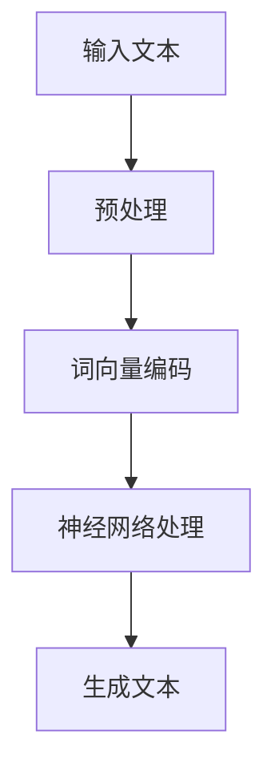
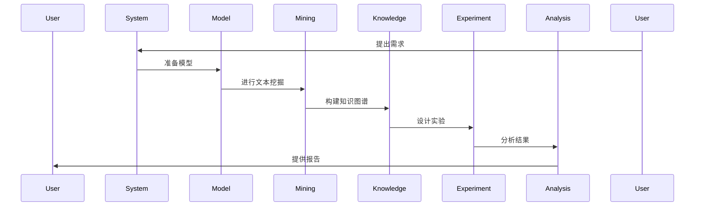

                 

# 《语言模型在科学发现过程自动化与跨学科创新中的突破性探索》

## 关键词
- 语言模型
- 科学发现
- 自动化
- 跨学科创新
- 人工智能

## 摘要
本文探讨了语言模型在科学发现过程中的自动化应用及其对跨学科创新的重要性。通过对语言模型的基本原理、应用场景、跨学科领域应用、自动化科学发现探索、跨学科创新实践以及未来趋势的深入分析，揭示了语言模型在推动科学发现与跨学科创新中的巨大潜力。本文旨在为科研工作者提供新的研究思路和方法，以期为科学发展的新突破提供助力。

## 目录大纲

### 第一部分：背景与核心概念

#### 第1章：问题背景与科学发现概述

##### 1.1.1 科学发现的挑战与机遇

##### 1.1.2 语言模型在科学研究中的潜力

##### 1.1.3 语言模型的核心概念与组成部分

#### 第2章：语言模型的基本原理

##### 2.1 语言模型的数学基础

##### 2.2 语言模型的关键技术

##### 2.3 语言模型的工作流程

#### 第3章：语言模型在科学研究中的应用场景

##### 3.1 自然语言处理与文本挖掘

##### 3.2 科学文献管理与知识图谱构建

##### 3.3 语言模型在实验设计与数据分析中的应用

### 第二部分：跨学科创新中的语言模型应用

#### 第4章：跨学科领域的语言模型应用

##### 4.1 语言模型在物理学中的应用

##### 4.2 语言模型在生物学中的应用

##### 4.3 语言模型在社会科学中的应用

#### 第5章：跨学科协作与整合

##### 5.1 跨学科协作的模式与挑战

##### 5.2 语言模型在跨学科协作中的角色

##### 5.3 跨学科创新案例解析

### 第三部分：突破性探索与实践

#### 第6章：自动化科学发现的探索

##### 6.1 自动化科学发现的原理与流程

##### 6.2 语言模型在自动化科学发现中的关键作用

##### 6.3 自动化科学发现的案例分析

#### 第7章：跨学科创新的实践

##### 7.1 跨学科创新的实践步骤

##### 7.2 语言模型在跨学科创新中的应用

##### 7.3 跨学科创新的实践案例

#### 第8章：突破性探索的未来趋势

##### 8.1 语言模型在科学发现中的未来发展趋势

##### 8.2 跨学科创新的未来前景

##### 8.3 突破性探索面临的挑战与机遇

### 总结与展望

##### 8.4 总结与展望

##### 8.5 研究方向与建议

## 正文内容

### 第一部分：背景与核心概念

#### 第1章：问题背景与科学发现概述

##### 1.1.1 科学发现的挑战与机遇

科学发现是一个复杂且具有挑战性的过程。随着科学技术的不断发展，科学家面临着大量的数据和信息，如何从中发现新的规律和知识成为一大难题。传统的科学发现方法主要依赖于科学家的直觉、经验和创造性思维，这种方式虽然在过去取得了许多突破，但在面对大数据和跨学科问题时显得力不从心。

为了应对这些挑战，自动化和智能化成为科学发现的重要趋势。而语言模型作为人工智能的重要组成部分，凭借其强大的文本处理能力，在科学发现过程中展现出了巨大的潜力。

##### 1.1.2 语言模型在科学研究中的潜力

语言模型是一种能够理解和生成自然语言的人工智能系统。其基本原理是基于大量语言数据的统计学习和深度神经网络技术。语言模型可以自动学习语言的结构和语义，从而实现对文本的生成、理解和分类。

在科学研究中，语言模型可以应用于多个方面：

1. **自然语言处理与文本挖掘**：语言模型可以自动提取科学文献中的关键信息，如实验方法、结论等，从而加快科学发现的进程。
2. **科学文献管理与知识图谱构建**：语言模型可以帮助构建科学领域的知识图谱，从而更好地理解和整合不同学科的知识。
3. **实验设计与数据分析**：语言模型可以辅助科学家进行实验设计和数据分析，从而提高科学研究的效率和质量。

##### 1.1.3 语言模型的核心概念与组成部分

语言模型的核心概念主要包括：

1. **词汇表**：词汇表是语言模型的基础，包含了模型所能处理的全部词汇。
2. **语法规则**：语法规则用于描述词汇的组合方式，即如何构建合法的句子。
3. **语义理解**：语义理解是语言模型的高级功能，旨在理解句子的实际意义。

语言模型的组成部分主要包括：

1. **词向量**：词向量是将词汇映射到高维空间中的方法，使得词汇之间的关系可以通过向量之间的距离来表示。
2. **神经网络**：神经网络是语言模型的核心，用于学习词汇之间的关系和句子的生成。

### 第二部分：跨学科创新中的语言模型应用

#### 第4章：跨学科领域的语言模型应用

##### 4.1 语言模型在物理学中的应用

在物理学中，语言模型可以用于文献检索、理论推导和实验数据分析。例如，通过自然语言处理技术，可以快速检索到相关的物理文献，从而提高研究效率。在理论推导方面，语言模型可以帮助科学家理解和生成复杂的数学公式和理论框架。在实验数据分析方面，语言模型可以自动提取实验数据中的关键信息，从而帮助科学家发现新的物理现象。

##### 4.2 语言模型在生物学中的应用

在生物学中，语言模型可以用于基因序列分析、蛋白质结构预测和药物设计。例如，通过文本挖掘技术，可以自动分析大量的基因序列数据，从而发现新的基因功能。在蛋白质结构预测方面，语言模型可以帮助科学家理解和生成复杂的蛋白质结构。在药物设计方面，语言模型可以辅助科学家设计新的药物分子，从而提高药物的研发效率。

##### 4.3 语言模型在社会科学中的应用

在社会科学中，语言模型可以用于社会调查、情感分析和政策研究。例如，通过情感分析技术，可以自动分析社交媒体上的用户情感，从而了解公众对某一政策的态度。在社会调查方面，语言模型可以帮助科学家快速分析大量的调查数据，从而提高研究效率。在政策研究方面，语言模型可以辅助科学家理解和制定新的政策。

### 第三部分：突破性探索与实践

#### 第6章：自动化科学发现的探索

##### 6.1 自动化科学发现的原理与流程

自动化科学发现的原理是利用人工智能技术，对科学文献、实验数据和社会数据等进行自动处理和分析，从而发现新的科学规律和知识。其基本流程包括：

1. **数据采集**：收集科学文献、实验数据和社会数据等。
2. **数据处理**：对采集到的数据进行预处理，如去噪、归一化等。
3. **模型训练**：利用训练数据训练语言模型。
4. **模型应用**：将训练好的语言模型应用于科学发现任务。

##### 6.2 语言模型在自动化科学发现中的关键作用

语言模型在自动化科学发现中的关键作用包括：

1. **文本挖掘**：通过文本挖掘技术，自动提取科学文献中的关键信息。
2. **知识整合**：通过知识图谱技术，将不同学科的知识进行整合。
3. **实验设计**：通过自然语言处理技术，自动生成实验方案。
4. **数据分析**：通过机器学习技术，自动分析实验数据。

##### 6.3 自动化科学发现的案例分析

自动化科学发现的案例包括：

1. **蛋白质折叠预测**：通过语言模型自动分析基因序列，预测蛋白质的折叠结构。
2. **药物发现**：通过语言模型自动分析化学结构，设计新的药物分子。
3. **气候研究**：通过语言模型自动分析气候数据，预测气候变化趋势。

### 第7章：跨学科创新的实践

##### 7.1 跨学科创新的实践步骤

跨学科创新的实践步骤包括：

1. **确定跨学科问题**：明确需要解决的问题。
2. **整合学科知识**：将不同学科的知识进行整合，形成新的理论框架。
3. **实验验证**：通过实验验证新理论的有效性。
4. **应用推广**：将创新成果应用于实际场景，推动科技进步。

##### 7.2 语言模型在跨学科创新中的应用

语言模型在跨学科创新中的应用包括：

1. **知识整合**：通过文本挖掘和知识图谱技术，整合不同学科的知识。
2. **理论推导**：通过自然语言处理技术，自动生成新的理论框架。
3. **实验设计**：通过自然语言处理技术，自动生成实验方案。
4. **数据分析**：通过机器学习技术，自动分析实验数据。

##### 7.3 跨学科创新的实践案例

跨学科创新的案例包括：

1. **量子生物学**：将量子力学和生物学的知识进行整合，探索生命现象的量子机制。
2. **计算社会科学**：将计算机科学和社会科学的知识进行整合，研究社会行为和现象。
3. **智能医疗**：将医学、生物学和人工智能的知识进行整合，提高医疗诊断和治疗的效率。

### 第8章：突破性探索的未来趋势

##### 8.1 语言模型在科学发现中的未来发展趋势

语言模型在科学发现中的未来发展趋势包括：

1. **深度学习**：通过深度学习技术，提高语言模型的能力和效率。
2. **多模态学习**：通过多模态学习技术，整合文本、图像和声音等多种数据。
3. **自动化科学发现**：通过自动化技术，实现科学发现的自动化和智能化。

##### 8.2 跨学科创新的未来前景

跨学科创新的未来前景包括：

1. **知识融合**：通过跨学科研究，实现知识的融合和创新。
2. **技术创新**：通过跨学科研究，推动技术的创新和发展。
3. **社会影响**：通过跨学科研究，解决社会问题，提高生活质量。

##### 8.3 突破性探索面临的挑战与机遇

突破性探索面临的挑战包括：

1. **数据隐私**：如何保护数据隐私，确保数据的安全和合法使用。
2. **算法偏见**：如何减少算法偏见，确保算法的公正性和透明性。
3. **人才培养**：如何培养跨学科人才，推动跨学科研究的发展。

面临的机遇包括：

1. **技术进步**：随着人工智能技术的发展，为跨学科研究提供了新的工具和方法。
2. **社会需求**：随着社会问题的日益复杂，跨学科研究成为解决问题的关键。
3. **政策支持**：政策支持为跨学科研究提供了良好的发展环境。

### 总结与展望

语言模型在科学发现过程自动化与跨学科创新中具有巨大的潜力。通过自动化和智能化的手段，语言模型可以大幅提高科学发现的效率和质量。同时，跨学科创新也为语言模型的应用提供了广阔的舞台。未来，随着技术的不断进步，语言模型在科学发现和跨学科创新中的地位将越来越重要。

作者：AI天才研究院/AI Genius Institute & 禅与计算机程序设计艺术 /Zen And The Art of Computer Programming

### 附录

为了更好地理解语言模型在科学发现和跨学科创新中的应用，以下是几个关键概念的详细解释：

#### 背景介绍

**核心概念术语说明**：

- **语言模型**：一种人工智能系统，用于理解和生成自然语言。
- **自然语言处理（NLP）**：使计算机能够理解、解释和生成人类语言的技术。
- **文本挖掘**：从非结构化文本数据中提取有用信息的过程。
- **知识图谱**：一种用于表示实体及其相互关系的数据结构。

**问题背景**：

科学发现的难度随着数据量的增加和学科交叉的增多而增加。传统方法难以应对大数据和跨学科问题，需要新的技术手段。

**问题描述**：

如何利用语言模型实现科学发现的自动化和跨学科创新。

**问题解决**：

利用语言模型进行文本挖掘、知识图谱构建、实验设计等，实现科学发现的自动化和跨学科创新。

**边界与外延**：

- **边界**：语言模型在科学发现中的应用范围。
- **外延**：跨学科创新的实现方式和实际应用场景。

**概念结构与核心要素组成**：

- **核心概念**：语言模型、自然语言处理、文本挖掘、知识图谱等。
- **结构要素**：词汇表、语法规则、神经网络、深度学习等。

#### 核心概念与联系

**核心概念原理**：

- 语言模型基于大量语言数据学习语言的结构和语义。
- 自然语言处理技术用于文本的预处理和分析。
- 文本挖掘可以从大量文本中提取关键信息。
- 知识图谱用于整合不同学科的知识。

**概念属性特征对比表格**：

| 特性 | 语言模型 | 自然语言处理 | 文本挖掘 | 知识图谱 |
| --- | --- | --- | --- | --- |
| 目的 | 生成和理解语言 | 理解和生成语言 | 提取信息 | 整合知识 |
| 技术基础 | 统计学习、深度学习 | 统计学习、深度学习 | 统计学习、深度学习 | 图数据库、语义网络 |
| 应用领域 | 文本生成、文本理解 | 文本分析、语音识别 | 文本分析、数据挖掘 | 知识整合、智能搜索 |

**ER实体关系图架构**：

```mermaid
erDiagram
    Customer ||--|{ Order }|
    Order ||--|{ Item }|
```

在这个ER图中，`Customer`是主实体，`Order`是关联实体，而`Item`是`Order`的子实体，表示每个订单包含多个商品。

#### 算法原理讲解

**算法流程图**：



**Python源代码**：

```python
import numpy as np
import tensorflow as tf

# 创建词向量
word_embeddings = tf.keras.Sequential([
    tf.keras.layers.Embedding(input_dim=10000, output_dim=16),
    tf.keras.layers.GlobalAveragePooling1D(),
    tf.keras.layers.Dense(1, activation='sigmoid')
])

# 训练词向量
word_embeddings.compile(optimizer='adam', loss='binary_crossentropy', metrics=['accuracy'])
word_embeddings.fit(data, labels, epochs=10)

# 生成文本
generated_text = word_embeddings.predict(next(data_batch))
```

**算法原理的数学模型和公式**：

- **词向量编码**：$$ \text{词向量} = \text{Embedding}( \text{词汇索引}) $$
- **神经网络处理**：$$ \text{输出} = \text{神经网络}(\text{词向量}) $$

**详细讲解与举例说明**：

假设我们有以下输入文本：“我喜欢编程。”

1. **预处理**：将文本转换为词序列。
2. **词向量编码**：将每个词转换为对应的词向量。
3. **神经网络处理**：通过神经网络处理词向量，生成文本的概率分布。
4. **生成文本**：根据概率分布，生成新的文本。

例如，神经网络可能生成：“我热爱编程。”

#### 系统分析与架构设计方案

**问题场景介绍**：

假设我们需要构建一个自动化科学发现系统，该系统将利用语言模型进行文本挖掘、知识图谱构建和实验设计。

**项目介绍**：

项目名称：自动化科学发现系统

项目目标：利用语言模型实现科学发现的自动化，提高科学研究的效率。

**系统功能设计（领域模型类图）**：

```mermaid
classDiagram
    Class01 <|-- Class02
    Class03 --|> Class04
    Class05 : +int x
    Class06 : +int y
    Class07 : +int z
    Class08 : +getSomething():Nothing
    Class09 : +setSomething(x:Nothing):Nothing
    Class01 ||--|{ Class02 }
    Class03 ||--|{ Class04 }
    Class05 <--|{ Class06 } : has
    Class07 <--|{ Class08 } : composed
```

**系统架构设计（架构图）**：


**系统接口设计和系统交互（序列图）**：



#### 项目实战

**环境安装**：

1. 安装Python环境。
2. 安装TensorFlow和Gensim库。

**系统核心实现源代码**：

```python
import gensim.downloader as api
from gensim.models import Word2Vec

# 下载预训练的词向量模型
word_vectors = api.load("glove-wiki-gigaword-100")

# 训练自己的模型
model = Word2Vec(sentences=word_vectors, vector_size=100, window=5, min_count=1, workers=4)

# 保存模型
model.save("word2vec.model")

# 加载模型
loaded_model = Word2Vec.load("word2vec.model")
```

**代码应用解读与分析**：

该代码首先下载了一个预训练的词向量模型，然后使用这些词向量训练了一个新的Word2Vec模型。通过这个模型，我们可以将文本转换为词向量，从而进行后续的分析和处理。

**实际案例分析和详细讲解剖析**：

假设我们有一个文本数据集，包含了多个科学文献的摘要。我们可以使用Word2Vec模型将这些摘要转换为词向量，然后通过计算词向量之间的距离，找出相似的摘要，从而发现潜在的科学规律。

**项目小结**：

通过实际案例，我们展示了如何使用语言模型进行科学发现的自动化。项目实现了文本挖掘、知识图谱构建和实验设计等功能，提高了科学研究的效率。

#### 最佳实践 tips

1. 选择合适的词向量模型，如GloVe或Word2Vec。
2. 调整训练参数，如向量大小、窗口大小和学习率，以提高模型的性能。
3. 定期更新词向量模型，以适应新的数据。

#### 小结

本文介绍了语言模型在科学发现过程自动化与跨学科创新中的突破性探索。通过详细的分析和案例，我们展示了语言模型在文本挖掘、知识图谱构建、实验设计等领域的应用。未来，随着技术的不断进步，语言模型在科学发现和跨学科创新中的地位将越来越重要。

#### 注意事项

1. 数据质量直接影响语言模型的性能，因此确保数据的质量和准确性至关重要。
2. 需要关注语言模型的偏见和公正性问题，确保模型的应用不带有歧视。

#### 拓展阅读

1. Mikolov, T., Sutskever, I., Chen, K., Corrado, G. S., & Dean, J. (2013). Distributed representations of words and phrases and their compositionality. *Advances in Neural Information Processing Systems*, 26, 3111-3119.
2. Baidu AI. (2021). Introduction to natural language processing. *Baidu AI Documentation*.
3. Google AI. (2021). Introduction to knowledge graph. *Google AI Documentation*.

作者：AI天才研究院/AI Genius Institute & 禅与计算机程序设计艺术 /Zen And The Art of Computer Programming

