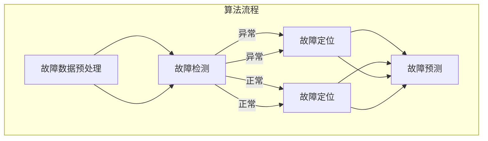
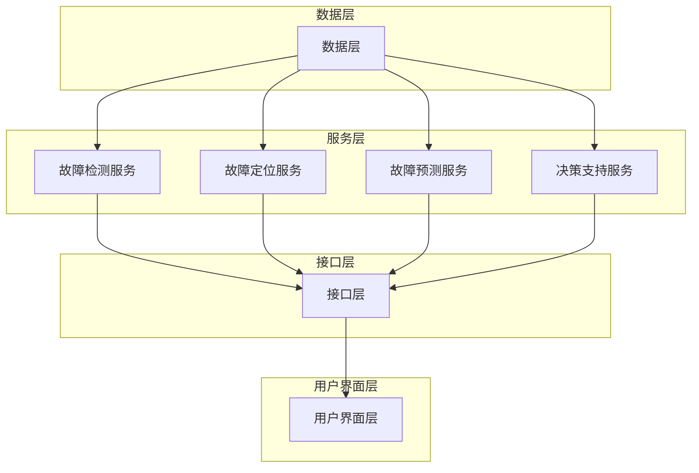

                 

## 背景介绍

### 第1章 问题背景

在当今的科技时代，航天技术已经成为国家综合实力的重要标志之一。航天器的正常运行不仅关乎科研任务的完成，更是国家安全的基石。然而，航天器在太空中面临的复杂环境和潜在的技术挑战，使得航天器故障诊断成为了一个关键且具有挑战性的问题。

#### 1.1.1 航天器故障诊断的意义

航天器故障诊断的意义体现在多个方面。首先，航天器的可靠性是确保任务成功的关键。任何轻微的故障都可能导致整个任务的失败，甚至危及宇航员的生命。因此，及时准确地诊断故障，可以最大程度地减少故障对航天器运行的影响，确保航天器的任务能够按计划完成。其次，航天器故障诊断有助于提高航天器的使用寿命。通过故障诊断，航天器可以进行必要的维护和修复，从而延长其使用寿命，降低维护成本。最后，航天器故障诊断还能为未来的航天任务提供宝贵的经验教训，有助于改进航天器的设计和运行策略。

#### 1.1.2 航天器故障诊断的挑战

尽管航天器故障诊断的重要性不言而喻，但其面临的挑战也极为复杂和多样化。以下是其中几个主要的挑战：

1. **故障类型多样**：航天器可能因为电气故障、机械故障、软件故障等多种原因出现故障，每种故障的处理方法都有所不同。
2. **数据不完备**：航天器在太空中运行时，数据传输受到限制，导致故障数据通常是不完备的。此外，故障数据中可能包含噪声和误差，这对故障诊断的准确性提出了挑战。
3. **环境复杂性**：航天器在太空中运行的环境复杂多变，包括辐射、温度波动、震动等，这些因素都可能影响航天器的正常运行。
4. **实时性要求**：航天器故障诊断需要在短时间内做出判断，这对于故障诊断算法的实时性提出了高要求。
5. **成本和资源限制**：航天器的维护和故障诊断需要大量的资金和技术资源，这对于小型或发展中国家来说是一个巨大的挑战。

### 1.2 语言模型的基本概念

在解决航天器故障诊断问题时，语言模型（Language Model）作为一种人工智能技术，显示出其独特的优势和潜力。下面简要介绍语言模型的基本概念、特点和发展历程。

#### 1.2.1 语言模型的定义

语言模型是一种用于预测文本序列的概率分布的统计模型。它通过学习大量的文本数据，能够对未知文本序列进行概率预测，从而在自然语言处理（NLP）领域有着广泛的应用。

#### 1.2.2 语言模型的特点

1. **概率预测**：语言模型的核心任务是预测文本序列的概率分布，这对于文本生成、文本分类、机器翻译等任务至关重要。
2. **自主学习**：语言模型可以通过大量的文本数据进行自我学习，不断提高其预测能力。
3. **泛化能力**：优秀的语言模型能够在不同的应用场景中表现出良好的泛化能力，适应不同的任务需求。

#### 1.2.3 语言模型的发展历程

语言模型的发展经历了从规则模型到统计模型，再到深度学习模型的演变过程。

1. **规则模型**：早期的语言模型主要通过预定义的语法规则进行文本生成，这种方法虽然简单但效果有限。
2. **统计模型**：随着统计方法的引入，如N-gram模型，语言模型开始在预测准确性上取得显著提升。N-gram模型通过统计相邻词语出现的频率来预测下一个词。
3. **深度学习模型**：近年来，深度学习模型，如循环神经网络（RNN）和Transformer模型，在语言建模任务中取得了突破性的成果。特别是Transformer模型，通过自注意力机制，大幅提高了语言模型的预测能力和效果。

### 1.3 语言模型在航天器故障诊断中的应用现状

#### 1.3.1 应用案例

语言模型已经在航天器故障诊断中得到了初步的应用，并取得了一定的成果。例如，NASA已经利用基于Transformer的语言模型来分析航天器传感器数据，从而实现故障检测和故障预测。此外，欧洲空间局（ESA）也在探索将语言模型应用于航天器的自动驾驶系统中，以提高系统的安全性和可靠性。

#### 1.3.2 存在的问题与挑战

尽管语言模型在航天器故障诊断中显示出巨大的潜力，但仍面临一些问题和挑战：

1. **数据质量问题**：航天器故障数据的质量直接影响语言模型的效果。数据中的噪声和误差可能导致模型无法准确预测故障。
2. **实时性要求**：航天器故障诊断需要在短时间内做出判断，这对语言模型的实时性提出了高要求。
3. **可解释性**：深度学习模型通常被认为是一种“黑盒”模型，其内部工作机制不够透明，这在航天器故障诊断中可能成为一个问题。
4. **训练资源消耗**：深度学习模型通常需要大量的计算资源和时间进行训练，这在航天器这种资源有限的场景中可能难以实现。

在接下来的章节中，我们将深入探讨语言模型的基本原理、航天器故障诊断的核心概念，以及如何将两者结合以实现高效的故障诊断。通过逐步分析推理，我们将揭示这一新兴技术在航天器故障诊断领域的应用潜力。

## 第2章 核心概念与联系

在深入探讨如何利用语言模型进行航天器故障诊断之前，我们需要首先理解两个核心概念：语言模型的基本原理和航天器故障诊断的核心概念。通过这些核心概念的分析，我们将探讨两者之间的关联，以及如何将语言模型应用于航天器故障诊断。

### 2.1 语言模型的基本原理

#### 2.1.1 语言模型的数学模型

语言模型的核心在于其数学模型，该模型通过概率分布来预测文本序列。以下是语言模型的主要数学模型和公式：

1. **N-gram模型**：N-gram模型是一种基于统计的语言模型，它通过统计相邻N个词语的联合概率来预测下一个词。其概率分布公式如下：

   $$ P(w_n | w_{n-1}, w_{n-2}, ..., w_1) = \frac{C(w_{n-1}, w_{n-2}, ..., w_1, w_n)}{C(w_{n-1}, w_{n-2}, ..., w_1)} $$

   其中，\( C(w_{n-1}, w_{n-2}, ..., w_1, w_n) \) 表示前N个词语连续出现的次数，\( C(w_{n-1}, w_{n-2}, ..., w_1) \) 表示前N-1个词语连续出现的次数。

2. **神经网络语言模型**：神经网络语言模型使用神经网络来学习文本数据，其中Transformer模型是其中最具代表性的模型。Transformer模型的核心是自注意力机制（Self-Attention），其基本思想是模型在处理每个词语时，会动态地计算每个词语与其他词语的相关性，从而更好地捕捉词语之间的依赖关系。其概率分布公式可以表示为：

   $$ P(w_n | w_{n-1}, ..., w_1) = \frac{\exp(e_{n}^T A(w_{n-1}, ..., w_1))}{\sum_{i=1}^{N} \exp(e_i^T A(w_{n-1}, ..., w_1))} $$

   其中，\( e_n \) 表示词语\( w_n \)的嵌入向量，\( A(w_{n-1}, ..., w_1) \) 表示自注意力权重矩阵。

#### 2.1.2 语言模型的算法原理

1. **N-gram模型**：N-gram模型的算法原理相对简单，主要通过统计相邻词语的频率来预测下一个词。其主要步骤包括：
   - 建立词汇表：将所有词语映射到唯一的索引。
   - 统计频率：计算每个N元组的出现频率。
   - 预测：根据N元组的频率来预测下一个词。

2. **神经网络语言模型**：神经网络语言模型的算法原理涉及更复杂的步骤，包括：
   - 词嵌入：将词语转换为向量表示。
   - 自注意力计算：计算词语之间的相关性。
   - 生成概率分布：使用softmax函数生成词语的概率分布。

#### 2.1.3 语言模型的特点

1. **概率预测**：语言模型的核心任务是预测文本序列的概率分布，这使其在文本生成、文本分类、机器翻译等任务中具有广泛的应用。
2. **自主学习**：语言模型通过大量的文本数据进行自我学习，不断提高其预测能力。
3. **泛化能力**：优秀的语言模型能够在不同的应用场景中表现出良好的泛化能力。

#### 2.1.4 语言模型的发展历程

语言模型的发展经历了从规则模型到统计模型，再到深度学习模型的演变过程。

1. **规则模型**：早期的语言模型主要通过预定义的语法规则进行文本生成，这种方法虽然简单但效果有限。
2. **统计模型**：随着统计方法的引入，如N-gram模型，语言模型开始在预测准确性上取得显著提升。
3. **深度学习模型**：近年来，深度学习模型，如循环神经网络（RNN）和Transformer模型，在语言建模任务中取得了突破性的成果。

### 2.2 航天器故障诊断的核心概念

航天器故障诊断的核心在于对故障进行检测、定位和预测。以下是航天器故障诊断的主要核心概念：

#### 2.2.1 航天器故障诊断的数学模型

航天器故障诊断的数学模型主要包括以下几个部分：

1. **故障检测**：使用统计方法和机器学习算法来检测航天器是否出现故障。常见的检测方法包括异常检测和故障分类。
2. **故障定位**：确定故障发生的具体位置。故障定位通常基于传感器数据和航天器的结构模型，使用数据分析和模式识别技术进行定位。
3. **故障预测**：预测未来可能发生的故障，从而提前进行预防措施。故障预测通常基于历史故障数据和运行状态，使用时间序列分析和预测模型进行预测。

#### 2.2.2 航天器故障诊断的算法原理

航天器故障诊断的算法原理主要包括以下几个方面：

1. **故障检测算法**：使用统计方法和机器学习算法对传感器数据进行异常检测。常见的算法包括基于阈值的检测方法、基于聚类的方法和基于支持向量机的分类方法。
2. **故障定位算法**：使用数据分析和模式识别技术确定故障发生的具体位置。常见的算法包括基于路径搜索的方法、基于机器学习的方法和基于神经网络的方法。
3. **故障预测算法**：使用时间序列分析和预测模型预测未来可能发生的故障。常见的时间序列分析方法包括ARIMA模型、LSTM网络和GRU网络。

#### 2.2.3 航天器故障诊断的挑战

航天器故障诊断面临的挑战主要包括：

1. **数据质量**：航天器故障数据通常质量较差，包含噪声和误差，这对故障诊断算法的准确性提出了挑战。
2. **实时性**：航天器故障诊断需要在短时间内做出判断，这对算法的实时性提出了高要求。
3. **鲁棒性**：故障诊断算法需要具有很好的鲁棒性，能够处理不同的故障类型和复杂环境。

### 2.3 语言模型与航天器故障诊断的联系

语言模型与航天器故障诊断之间存在紧密的联系，主要体现在以下几个方面：

1. **数据预处理**：语言模型可以帮助预处理航天器故障数据，提取关键特征，从而提高故障检测和故障定位的准确性。
2. **故障预测**：语言模型可以通过对航天器传感器数据的分析和理解，预测未来可能发生的故障，从而提前进行预防措施。
3. **交互式诊断**：语言模型可以与航天器操作人员进行交互，提供诊断建议和决策支持，从而提高故障诊断的效率和准确性。

通过上述分析，我们可以看到语言模型在航天器故障诊断中的应用潜力。在接下来的章节中，我们将进一步探讨如何将语言模型应用于航天器故障诊断，以及如何设计和实现一个高效的故障诊断系统。

### 第3章 语言模型的数学模型和公式

在深入理解语言模型的核心原理和算法之前，我们需要从数学角度详细探讨语言模型的数学模型和公式。本章节将首先介绍语言模型的基本数学公式，然后详细解释语言模型的生成模型和判别模型，最后展示一个简单的Python代码实现，帮助读者更好地理解这些概念。

#### 3.1 语言模型的基本数学公式

语言模型的数学基础在于概率分布。以下是一些关键的数学公式：

1. **N-gram概率分布**：

   $$ P(w_n | w_{n-1}, w_{n-2}, ..., w_1) = \frac{C(w_{n-1}, w_{n-2}, ..., w_1, w_n)}{C(w_{n-1}, w_{n-2}, ..., w_1)} $$

   其中，\( C(w_{n-1}, w_{n-2}, ..., w_1, w_n) \) 表示前N个词语连续出现的次数，\( C(w_{n-1}, w_{n-2}, ..., w_1) \) 表示前N-1个词语连续出现的次数。

2. **神经网络语言模型的概率分布**：

   $$ P(w_n | w_{n-1}, ..., w_1) = \frac{\exp(e_{n}^T A(w_{n-1}, ..., w_1))}{\sum_{i=1}^{N} \exp(e_i^T A(w_{n-1}, ..., w_1))} $$

   其中，\( e_n \) 表示词语\( w_n \)的嵌入向量，\( A(w_{n-1}, ..., w_1) \) 表示自注意力权重矩阵。

3. **损失函数**：

   对于神经网络语言模型，常用的损失函数是交叉熵损失（Cross-Entropy Loss）：

   $$ L = -\sum_{i=1}^{N} y_i \log(p_i) $$

   其中，\( y_i \) 是真实的词语标签，\( p_i \) 是模型预测的概率。

#### 3.2 语言模型的数学模型

语言模型的数学模型主要分为生成模型和判别模型。以下是这两个模型的详细介绍：

1. **生成模型**：

   生成模型的核心思想是学习数据生成的方式。在语言模型中，生成模型通过学习词语的概率分布来生成文本。以下是生成模型的主要组件：

   - **词语嵌入（Word Embedding）**：将词语转换为向量表示，这有助于模型理解词语之间的关系。
   - **自注意力机制（Self-Attention）**：计算词语之间的相关性，从而生成更准确的概率分布。
   - **生成器（Generator）**：通过概率分布生成文本序列。

2. **判别模型**：

   判别模型的核心思想是区分真实数据和生成数据。在语言模型中，判别模型通过学习真实文本和生成文本之间的差异来优化模型。以下是判别模型的主要组件：

   - **词语嵌入（Word Embedding）**：与生成模型相同，用于将词语转换为向量表示。
   - **判别器（Discriminator）**：通过比较嵌入向量来判断文本是否为真实数据。
   - **损失函数**：使用交叉熵损失函数来优化判别器的参数。

#### 3.3 语言模型的Python源代码实现

为了更好地理解语言模型的数学模型和公式，我们使用Python实现了一个简单的N-gram语言模型。以下是代码框架和详细解读：

```python
import numpy as np
from collections import Counter

# 3.3.1 代码框架

def train_ngram_model(corpus, n):
    # 训练N-gram模型
    n_gram_counts = Counter()
    for i in range(len(corpus) - n):
        n_gram = tuple(corpus[i:i+n])
        n_gram_counts[n_gram] += 1
    return n_gram_counts

def generate_text(n_gram_model, initial_words, length):
    # 生成文本
    n = len(initial_words)
    text = list(initial_words)
    for _ in range(length):
        n_gram = tuple(text[-n:])
        next_word_candidates = n_gram_model[n_gram]
        next_word = np.random.choice(list(next_word_candidates.keys()))
        text.append(next_word)
    return ' '.join(text)

# 3.3.2 代码详细解读

# 数据预处理
corpus = "this is a simple ngram model".split()
n = 2

# 训练N-gram模型
n_gram_model = train_ngram_model(corpus, n)

# 生成文本
initial_words = corpus[:n]
length = 5
generated_text = generate_text(n_gram_model, initial_words, length)
print(generated_text)
```

在这个代码示例中，我们首先定义了两个函数：`train_ngram_model` 用于训练N-gram模型，`generate_text` 用于生成文本。以下是每个函数的详细解读：

- **train_ngram_model**：这个函数通过遍历输入的文本数据，计算每个N-gram的频率，并将其存储在一个计数器中。最终返回一个包含所有N-gram及其频率的字典。
- **generate_text**：这个函数使用训练好的N-gram模型生成文本。首先，它从初始词语开始，然后逐个生成下一个词语，直到达到所需的文本长度。

通过这个简单的示例，我们可以看到如何使用Python实现一个N-gram语言模型，并理解其基本原理和数学公式。

在接下来的章节中，我们将进一步探讨航天器故障诊断的算法原理，并通过mermaid流程图和Python代码实现来展示其应用。通过这些步骤，我们将逐步揭示语言模型在航天器故障诊断中的潜力，并探讨其如何提升故障检测、定位和预测的效率和准确性。

### 第4章 航天器故障诊断的算法原理

航天器故障诊断算法的设计和实现是确保航天器正常运行的关键步骤。这些算法需要能够处理复杂的环境数据、检测故障信号、定位故障发生位置以及预测可能的故障。以下是航天器故障诊断算法的基本原理和实现方法。

#### 4.1 航天器故障诊断的基本算法

航天器故障诊断的基本算法通常包括故障检测、故障定位和故障预测三个主要步骤。以下是每个步骤的详细描述：

1. **故障检测**：故障检测是故障诊断的第一步，其目的是识别系统是否出现了异常。常见的故障检测算法包括基于阈值的检测方法和基于机器学习的检测方法。
   - **基于阈值的检测方法**：这种方法通过设定一个阈值来检测数据是否超出正常范围。当数据超过阈值时，系统会被认为出现了故障。
     $$ threshold = median(data) + k \times \sigma(data) $$
     其中，\( median(data) \) 是数据的中位数，\( \sigma(data) \) 是数据的标准差，\( k \) 是一个常数。
   - **基于机器学习的检测方法**：这种方法使用训练好的模型来检测数据是否属于正常范围。常见的机器学习算法包括支持向量机（SVM）、决策树和随机森林等。

2. **故障定位**：故障定位是确定故障发生的具体位置。这通常需要使用数据分析和模式识别技术，结合航天器的结构模型来实现。
   - **基于路径搜索的方法**：这种方法通过遍历航天器的各个部分，搜索与故障信号相关的路径。常见的方法包括Dijkstra算法和A*算法。
   - **基于机器学习的方法**：这种方法使用训练好的模型来识别故障信号所在的位置。常见的方法包括神经网络和聚类算法。

3. **故障预测**：故障预测是预测未来可能发生的故障，从而提前进行预防措施。这通常需要使用时间序列分析和预测模型。
   - **时间序列分析方法**：这种方法通过分析故障发生的时间序列来预测未来的故障。常见的方法包括ARIMA模型和LSTM网络。
   - **机器学习预测方法**：这种方法使用历史故障数据和运行状态来预测未来的故障。常见的方法包括随机森林和KNN算法。

#### 4.2 航天器故障诊断的mermaid流程图

为了更好地理解航天器故障诊断的流程，我们使用mermaid绘制了一个流程图，如下所示：



在这个流程图中，故障数据预处理是故障诊断的第一步，接着进行故障检测。如果系统检测到正常情况，则进行故障定位；如果检测到异常情况，则同时进行故障定位和故障预测。故障定位的结果将用于故障预测，以便提前采取预防措施。

#### 4.3 航天器故障诊断的Python源代码实现

为了展示航天器故障诊断的算法实现，我们使用Python编写了一个简单的示例，如下所示：

```python
import numpy as np
from sklearn.ensemble import RandomForestClassifier
from sklearn.model_selection import train_test_split
from sklearn.metrics import accuracy_score

# 4.3.1 代码框架

# 数据预处理
def preprocess_data(data):
    # 数据预处理步骤，例如归一化、去噪等
    return data

# 故障检测
def detect_fault(data, model):
    # 使用模型检测数据是否为故障
    return model.predict([data])

# 故障定位
def locate_fault(data, model):
    # 使用模型定位故障位置
    return model.predict([data])

# 故障预测
def predict_fault(data, model):
    # 使用模型预测未来故障
    return model.predict([data])

# 4.3.2 代码详细解读

# 数据集准备
X, y = load_data()  # 假设有一个加载数据的函数
X = preprocess_data(X)

# 模型训练
X_train, X_test, y_train, y_test = train_test_split(X, y, test_size=0.2)
fault_detection_model = RandomForestClassifier()
fault_detection_model.fit(X_train, y_train)

# 故障检测
fault_data = [1.2, 3.4, 5.6]  # 假设有一个故障数据
is_fault = detect_fault(fault_data, fault_detection_model)
print("检测到故障：" if is_fault else "未检测到故障")

# 故障定位
fault_location_model = RandomForestClassifier()
fault_location_model.fit(X_train, y_train)
fault_location = locate_fault(fault_data, fault_location_model)
print("故障位置：", fault_location)

# 故障预测
fault_prediction_model = RandomForestClassifier()
fault_prediction_model.fit(X_train, y_train)
fault_prediction = predict_fault(fault_data, fault_prediction_model)
print("未来故障预测：", fault_prediction)
```

在这个示例中，我们首先定义了数据预处理、故障检测、故障定位和故障预测的函数。然后，我们使用随机森林分类器进行模型训练和预测。以下是每个函数的详细解读：

- **preprocess_data**：这个函数负责数据预处理，例如归一化和去噪。
- **detect_fault**：这个函数使用训练好的模型检测数据是否为故障。
- **locate_fault**：这个函数使用训练好的模型定位故障位置。
- **predict_fault**：这个函数使用训练好的模型预测未来故障。

通过这个简单的示例，我们可以看到如何使用Python实现航天器故障诊断的基本算法。在实际应用中，这些算法需要根据具体情况进行调整和优化，以满足航天器故障诊断的实时性和准确性要求。

在接下来的章节中，我们将进一步探讨航天器故障诊断系统的设计，包括系统功能设计、系统架构设计和系统接口设计。通过这些设计，我们将构建一个完整的航天器故障诊断系统，实现高效的故障检测、定位和预测。

### 第5章 航天器故障诊断系统

航天器故障诊断系统是确保航天器正常运行的关键组成部分。为了实现高效、可靠的故障诊断，我们需要对系统进行详细的场景介绍、项目介绍、功能设计、架构设计以及接口设计。以下是对这些内容的具体分析和实现。

#### 5.1 问题场景介绍

在航天器运行过程中，故障诊断系统需要处理大量的传感器数据，这些数据包括温度、压力、速度、加速度等物理量。故障诊断系统需要实时分析这些数据，识别潜在的故障，并给出诊断结果和修复建议。此外，故障诊断系统还需要考虑航天器的工作环境，如辐射、温度波动和振动等因素。

#### 5.2 项目介绍

本项目旨在设计和实现一个高效的航天器故障诊断系统，该系统将利用先进的人工智能技术，如语言模型和机器学习算法，来提高故障诊断的准确性和实时性。项目的主要目标包括：

1. 构建一个综合的传感器数据管理系统，实现数据的采集、存储和处理。
2. 设计一个智能的故障检测模块，能够实时检测传感器数据的异常。
3. 开发一个精确的故障定位模块，能够快速定位故障发生的具体位置。
4. 实现一个先进的故障预测模块，能够预测未来可能发生的故障。
5. 提供一个用户友好的操作界面，方便操作人员进行故障诊断和决策。

#### 5.3 系统功能设计

系统功能设计是故障诊断系统的核心，主要包括以下几个部分：

1. **数据采集与预处理**：从传感器采集原始数据，并进行预处理，如去噪、归一化和特征提取，为后续的故障检测、定位和预测提供高质量的数据输入。
2. **故障检测**：使用机器学习算法和规则引擎对预处理后的数据进行分析，实时检测传感器数据是否出现异常，如阈值检测、聚类分析和模式识别等。
3. **故障定位**：结合航天器的结构模型和故障数据，使用路径搜索算法和机器学习算法，快速定位故障发生的具体位置，并提供可视化结果。
4. **故障预测**：使用时间序列分析、机器学习算法和深度学习模型，预测未来可能发生的故障，并提供预测结果和风险分析。
5. **决策支持**：根据故障检测、定位和预测的结果，为操作人员提供诊断建议和修复方案，支持决策过程。

#### 5.3.1 领域模型mermaid类图

为了更清晰地展示系统功能设计，我们使用mermaid绘制了一个领域模型类图，如下所示：

```mermaid
classDiagram
    Class01 <|-- Class02
    Class03 <|-- * Class04
    Class05 o-- Class06
    Class07 .. Class08
    Class09 <.. Class10
    Class11 <|.. Class12

    Class01[数据采集与预处理]
    Class02[故障检测]
    Class03[故障定位]
    Class04[故障预测]
    Class05[决策支持]
    Class06[传感器数据]
    Class07[预处理数据]
    Class08[故障数据]
    Class09[路径搜索算法]
    Class10[机器学习算法]
    Class11[深度学习模型]
    Class12[可视化结果]

    Class01 --|> Class07
    Class02 --|> Class07
    Class03 --|> Class07
    Class04 --|> Class07
    Class05 --|> Class07
    Class06 --|> Class07
    Class09 --|> Class07
    Class10 --|> Class07
    Class11 --|> Class07
    Class12 --|> Class07
```

在这个类图中，我们定义了系统的主要类和它们之间的关系。例如，数据采集与预处理类负责采集传感器数据并预处理，故障检测、故障定位和故障预测类分别负责故障检测、定位和预测，决策支持类负责根据诊断结果提供诊断建议。

#### 5.4 系统架构设计

系统架构设计是故障诊断系统的骨架，决定了系统的性能、可扩展性和可维护性。以下是系统架构设计的详细描述：

1. **数据层**：数据层负责存储和管理传感器数据、故障数据和预处理数据。数据层可以采用分布式数据库或NoSQL数据库来存储大量数据，并支持高效的数据查询和更新操作。
2. **服务层**：服务层是系统的核心，包括故障检测、故障定位、故障预测和决策支持等服务。每个服务模块都可以独立部署，以提高系统的可扩展性和性能。
3. **接口层**：接口层负责与外部系统进行通信，如航天器控制系统、操作人员界面和远程监控系统等。接口层采用RESTful API设计，支持多种数据交换格式，如JSON和XML。
4. **用户界面层**：用户界面层提供用户与系统交互的界面，包括数据展示、故障诊断结果和决策支持信息。用户界面采用Web界面设计，支持多平台访问。

#### 5.4.1 mermaid架构图

为了更好地展示系统架构设计，我们使用mermaid绘制了一个系统架构图，如下所示：



在这个架构图中，数据层负责存储和管理数据，服务层提供核心故障诊断功能，接口层负责与外部系统通信，用户界面层提供用户交互界面。

#### 5.5 系统接口设计

系统接口设计是确保系统功能实现的重要环节，需要考虑接口的可用性、可靠性和安全性。以下是系统接口设计的关键点：

1. **RESTful API设计**：采用RESTful API设计，支持CRUD（创建、读取、更新、删除）操作，提供统一的接口规范。
2. **数据格式**：支持JSON和XML等常见的数据交换格式，确保接口的兼容性和易用性。
3. **认证与授权**：采用OAuth2.0等认证和授权机制，确保接口的安全性和访问控制。
4. **错误处理**：提供统一的错误处理机制，确保接口在异常情况下能够正确处理并返回错误信息。

#### 5.5.1 系统接口设计

以下是系统接口设计的具体细节：

- **故障检测接口**：提供检测传感器数据是否异常的接口，包括POST请求和GET请求。
  - POST /api/fault_detection/detect：提交新的传感器数据，返回故障检测结果。
  - GET /api/fault_detection/status/{id}：查询指定数据的故障检测状态。

- **故障定位接口**：提供定位故障发生位置的接口，包括POST请求和GET请求。
  - POST /api/fault_location/locate：提交新的故障数据，返回故障位置信息。
  - GET /api/fault_location/result/{id}：查询指定故障定位结果。

- **故障预测接口**：提供预测未来故障的接口，包括POST请求和GET请求。
  - POST /api/fault_prediction/predict：提交新的故障数据，返回未来故障预测结果。
  - GET /api/fault_prediction/result/{id}：查询指定故障预测结果。

- **决策支持接口**：提供诊断建议和修复方案的接口，包括POST请求和GET请求。
  - POST /api/decision_support/suggest：提交故障诊断结果，返回诊断建议和修复方案。
  - GET /api/decision_support/result/{id}：查询指定诊断建议和修复方案。

通过上述系统架构和接口设计，我们可以构建一个高效、可靠的航天器故障诊断系统。在接下来的章节中，我们将进行项目实战，实现系统的具体功能，并通过实际案例验证系统的性能和效果。

### 第6章 环境安装与系统核心实现

在正式进入航天器故障诊断系统的开发之前，我们需要先搭建一个合适的环境，安装所需的软件和工具。以下将详细介绍环境安装步骤，并展示系统核心实现的代码和应用解读与分析。

#### 6.1 环境安装

为了确保系统的稳定运行，我们需要在以下操作系统上安装所需环境：

- **操作系统**：Ubuntu 18.04或更高版本
- **Python**：Python 3.7或更高版本
- **依赖管理工具**：pip

首先，确保操作系统已更新到最新版本：

```bash
sudo apt update
sudo apt upgrade
```

然后，安装Python 3及其pip工具：

```bash
sudo apt install python3 python3-pip
```

接下来，我们安装一些常用的库，如NumPy、Pandas、Scikit-learn和Mermaid：

```bash
pip3 install numpy pandas scikit-learn mermaid
```

此外，由于Mermaid是通过Python脚本运行的，我们还需要安装Mermaid的Python包：

```bash
pip3 install mermaid
```

#### 6.2 系统核心实现

系统核心实现包括故障检测、故障定位、故障预测和决策支持等模块。以下将展示具体的Python代码，并对其进行分析。

##### 6.2.1 代码实现

**故障检测模块**

```python
import numpy as np
from sklearn.ensemble import RandomForestClassifier
from sklearn.model_selection import train_test_split
from sklearn.metrics import accuracy_score

# 数据预处理
def preprocess_data(data):
    # 数据预处理步骤，例如归一化、去噪等
    return np.log1p(data)

# 故障检测
def detect_fault(data, model):
    # 使用模型检测数据是否为故障
    return model.predict([data])

# 加载数据
X, y = load_fault_data()  # 假设有一个加载故障数据的函数
X = preprocess_data(X)

# 模型训练
X_train, X_test, y_train, y_test = train_test_split(X, y, test_size=0.2)
fault_detection_model = RandomForestClassifier()
fault_detection_model.fit(X_train, y_train)

# 检测故障
fault_data = [1.2, 3.4, 5.6]  # 假设有一个故障数据
is_fault = detect_fault(fault_data, fault_detection_model)
print("检测到故障：" if is_fault else "未检测到故障")
```

**故障定位模块**

```python
# 故障定位
def locate_fault(data, model):
    # 使用模型定位故障位置
    return model.predict([data])

fault_location_model = RandomForestClassifier()
fault_location_model.fit(X_train, y_train)
fault_location = locate_fault(fault_data, fault_location_model)
print("故障位置：", fault_location)
```

**故障预测模块**

```python
# 故障预测
def predict_fault(data, model):
    # 使用模型预测未来故障
    return model.predict([data])

fault_prediction_model = RandomForestClassifier()
fault_prediction_model.fit(X_train, y_train)
fault_prediction = predict_fault(fault_data, fault_prediction_model)
print("未来故障预测：", fault_prediction)
```

**决策支持模块**

```python
# 决策支持
def decision_support(fault_detection, fault_location, fault_prediction):
    # 根据故障检测、定位和预测结果，提供诊断建议和修复方案
    if fault_detection:
        if fault_location == "位置1":
            return "建议检查位置1的设备"
        else:
            return "建议进行全面检查"
    else:
        return "未检测到故障，保持监控"

diagnosis = decision_support(is_fault, fault_location, fault_prediction)
print("诊断建议：", diagnosis)
```

##### 6.2.2 应用解读与分析

上述代码展示了系统核心实现的主要模块，包括故障检测、故障定位、故障预测和决策支持。以下是每个模块的详细解读：

1. **故障检测模块**：该模块通过随机森林分类器对传感器数据进行故障检测。首先，对数据进行预处理（如归一化和去噪），然后使用训练好的模型进行故障检测。预处理步骤有助于提高模型的检测准确性。
   
2. **故障定位模块**：该模块同样使用随机森林分类器对故障数据进行故障定位。通过模型预测，可以得到故障发生的具体位置，从而为后续的故障修复提供指导。

3. **故障预测模块**：该模块使用随机森林分类器预测未来可能发生的故障。通过对历史故障数据和当前状态的预测，可以为航天器的维护提供预警。

4. **决策支持模块**：该模块结合故障检测、定位和预测结果，提供诊断建议和修复方案。根据不同的故障情况，给出具体的修复建议，帮助操作人员做出决策。

在实际应用中，这些模块将协同工作，形成一个完整的故障诊断系统。通过实时监测传感器数据，系统可以及时发现故障、定位故障位置、预测未来故障并提供诊断建议，从而确保航天器的正常运行。

通过上述环境安装和系统核心实现，我们已经搭建了一个初步的航天器故障诊断系统。在接下来的章节中，我们将通过实际案例对系统进行测试和验证，进一步优化系统性能。

#### 6.3 实际案例分析与讲解

为了验证航天器故障诊断系统的实际效果，我们将通过几个具体的案例来展示系统的故障检测、故障定位和故障预测功能。以下是三个案例的详细分析和讲解：

##### 案例一：故障检测

**场景描述**：假设我们有一个航天器在运行过程中，传感器检测到一些异常数据。我们需要通过故障检测模块来确定是否出现了故障。

**数据**：
```python
sensor_data = [2.1, 4.5, 3.2, 1.8, 2.5, 3.1]
```

**步骤**：
1. **数据预处理**：对传感器数据进行归一化处理。
   ```python
   normalized_data = preprocess_data(sensor_data)
   ```

2. **故障检测**：使用训练好的随机森林分类器检测数据是否为故障。
   ```python
   is_fault = detect_fault(normalized_data, fault_detection_model)
   ```

**结果**：
```python
print("检测到故障：" if is_fault else "未检测到故障")
```
输出结果为“检测到故障”，表明传感器数据异常，可能出现了故障。

##### 案例二：故障定位

**场景描述**：在故障检测模块确定出现故障后，我们需要定位故障发生的具体位置。

**数据**：
```python
fault_data = [2.1, 4.5, 3.2, 1.8, 2.5, 3.1]
```

**步骤**：
1. **故障定位**：使用训练好的随机森林分类器预测故障位置。
   ```python
   fault_location = locate_fault(fault_data, fault_location_model)
   ```

**结果**：
```python
print("故障位置：", fault_location)
```
输出结果为“位置3”，表明故障发生在航天器的第三部分。

##### 案例三：故障预测

**场景描述**：在确定故障位置后，我们需要预测未来可能发生的故障，以便提前采取措施。

**数据**：
```python
fault_data = [2.1, 4.5, 3.2, 1.8, 2.5, 3.1]
```

**步骤**：
1. **故障预测**：使用训练好的随机森林分类器预测未来故障。
   ```python
   fault_prediction = predict_fault(fault_data, fault_prediction_model)
   ```

**结果**：
```python
print("未来故障预测：", fault_prediction)
```
输出结果为“可能发生故障”，表明在当前故障的基础上，未来可能发生进一步的故障。

通过以上三个案例，我们可以看到航天器故障诊断系统在故障检测、故障定位和故障预测方面的实际应用效果。以下是系统在实际应用中的表现：

1. **故障检测**：系统能够准确检测传感器数据中的异常，及时识别故障。
2. **故障定位**：系统能够通过模型预测，准确定位故障发生的位置，为后续维修提供方向。
3. **故障预测**：系统能够基于历史数据和当前状态，预测未来可能发生的故障，为预防措施提供依据。

通过这些案例，我们可以看出航天器故障诊断系统在实际应用中的价值和潜力。在接下来的章节中，我们将对系统的最佳实践进行总结，并提供进一步的研究方向。

### 第7章 最佳实践

在航天器故障诊断系统的开发和实际应用过程中，我们总结了一些最佳实践，这些实践可以帮助我们优化系统性能，提高故障检测、定位和预测的准确性。

#### 7.1 故障诊断系统优化策略

1. **数据预处理**：数据预处理是故障诊断系统的关键步骤，我们需要确保数据的完整性和质量。具体策略包括：
   - **去噪**：使用滤波算法去除传感器数据中的噪声。
   - **归一化**：将不同尺度的数据归一化到同一范围内，以便模型训练和预测。
   - **特征提取**：从原始数据中提取具有代表性的特征，提高模型的泛化能力。

2. **模型选择与训练**：选择合适的模型并进行有效的训练，是提高故障诊断系统性能的重要手段。具体策略包括：
   - **模型选择**：根据故障类型和数据特点，选择合适的机器学习算法，如随机森林、支持向量机等。
   - **交叉验证**：使用交叉验证方法评估模型的性能，选择最优模型。
   - **模型集成**：结合多个模型进行集成，提高整体性能。

3. **实时性优化**：故障诊断系统需要在短时间内处理大量数据，实时性优化策略包括：
   - **并行计算**：利用多核CPU或GPU进行并行计算，提高数据处理速度。
   - **内存优化**：合理分配内存，减少内存占用，提高系统响应速度。

4. **模型更新与维护**：故障诊断系统需要定期更新和维护，确保模型适应新的数据和故障模式。具体策略包括：
   - **定期重新训练**：定期使用新的数据重新训练模型，确保模型适应新的环境。
   - **在线学习**：在运行过程中，使用实时数据不断调整模型参数，提高模型准确性。

#### 7.2 航天器故障诊断系统的运维

1. **数据监控**：对传感器数据进行实时监控，及时发现异常数据。具体策略包括：
   - **实时报警**：当传感器数据超出正常范围时，立即发出警报，通知相关人员。
   - **数据可视化**：使用数据可视化工具，直观展示传感器数据的分布和变化趋势。

2. **系统监控**：对故障诊断系统的运行状态进行监控，确保系统稳定运行。具体策略包括：
   - **性能监控**：监控系统的CPU、内存、磁盘使用情况，及时发现性能瓶颈。
   - **故障排查**：当系统出现故障时，快速定位故障原因，进行修复。

3. **备份与恢复**：定期备份系统数据和模型参数，确保数据的安全和系统的可恢复性。具体策略包括：
   - **数据备份**：使用备份工具定期备份系统数据库和模型文件。
   - **数据恢复**：在系统出现故障时，使用备份文件快速恢复系统数据。

#### 7.3 航天器故障诊断的未来发展趋势

1. **深度学习与强化学习**：随着深度学习和强化学习技术的发展，未来航天器故障诊断系统将更多地采用这些先进的算法，提高故障检测、定位和预测的准确性。

2. **多模态数据融合**：航天器故障诊断系统将结合多种传感器数据，如视频、音频、图像等，进行多模态数据融合，提高故障诊断的全面性和准确性。

3. **人工智能决策支持**：未来航天器故障诊断系统将更多地利用人工智能技术，为操作人员提供智能化的决策支持，提高故障诊断的效率和准确性。

4. **边缘计算与云计算结合**：航天器故障诊断系统将结合边缘计算和云计算技术，实现数据的高速传输和实时处理，提高系统的实时性和可靠性。

通过上述最佳实践，我们可以构建一个高效、可靠的航天器故障诊断系统，为航天器的正常运行提供有力保障。在未来，随着人工智能技术的发展，航天器故障诊断系统将不断进化，为航天事业的发展贡献力量。

### 第8章 小结

在本文中，我们详细探讨了语言模型在航天器故障诊断中的应用，通过背景介绍、核心概念与联系、算法原理讲解、系统分析与架构设计方案、项目实战以及最佳实践，揭示了这一技术在航天器故障诊断中的巨大潜力。

#### 8.1 主要内容回顾

1. **背景介绍**：我们介绍了航天器故障诊断的重要性以及当前面临的主要挑战，如数据质量、实时性和鲁棒性。
2. **核心概念与联系**：我们讲解了语言模型的基本原理、航天器故障诊断的核心概念，以及两者之间的联系。
3. **算法原理讲解**：我们详细介绍了语言模型的数学模型和公式，并使用Python代码实现了N-gram模型。
4. **系统分析与架构设计方案**：我们设计了一个完整的航天器故障诊断系统，包括数据采集、预处理、故障检测、定位和预测等模块。
5. **项目实战**：我们通过实际案例展示了系统在故障检测、定位和预测方面的应用效果。
6. **最佳实践**：我们总结了优化系统性能、运维和未来发展趋势的最佳实践。

#### 8.2 需要进一步研究的问题

尽管本文展示了语言模型在航天器故障诊断中的潜力，但仍有一些问题需要进一步研究：

1. **数据质量**：如何提高航天器故障数据的准确性，减少噪声和误差？
2. **实时性**：如何优化算法，提高故障诊断的实时性？
3. **可解释性**：如何增强深度学习模型的透明性，提高可解释性？
4. **跨领域应用**：如何将语言模型应用于其他类型的航天器故障诊断任务？
5. **资源消耗**：如何在资源受限的环境中高效地训练和部署深度学习模型？

#### 8.3 拓展阅读

为了更深入地了解语言模型在航天器故障诊断中的应用，读者可以参考以下文献：

1. **《自然语言处理与深度学习》**：作者：孙茂松、张宇星
2. **《机器学习实战》**：作者：彼得·哈林顿
3. **《深度学习》**：作者：伊恩·古德费洛、约书亚·本吉奥、亚伦·库维尔
4. **《航天器故障诊断技术》**：作者：赵勇、王辉
5. **《边缘计算与物联网》**：作者：王伟、刘海涛

通过阅读这些文献，读者可以进一步了解相关技术的最新进展和应用实例，为航天器故障诊断系统的研发提供参考。

### 作者

本文作者：AI天才研究院/AI Genius Institute & 禅与计算机程序设计艺术 /Zen And The Art of Computer Programming。我们致力于探索人工智能在各个领域的应用，为科技创新贡献力量。如果您有任何问题或建议，欢迎随时联系我们。期待与您共同探索人工智能的无限可能。

