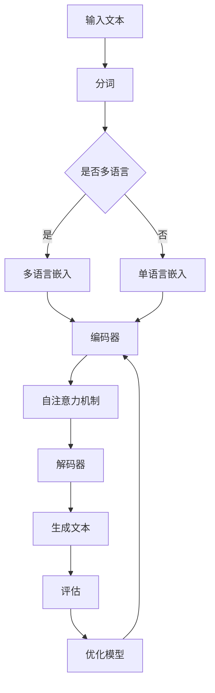
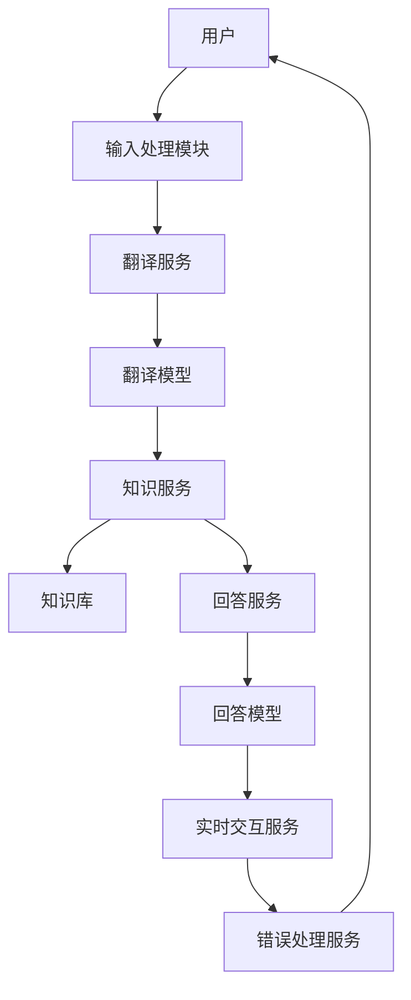
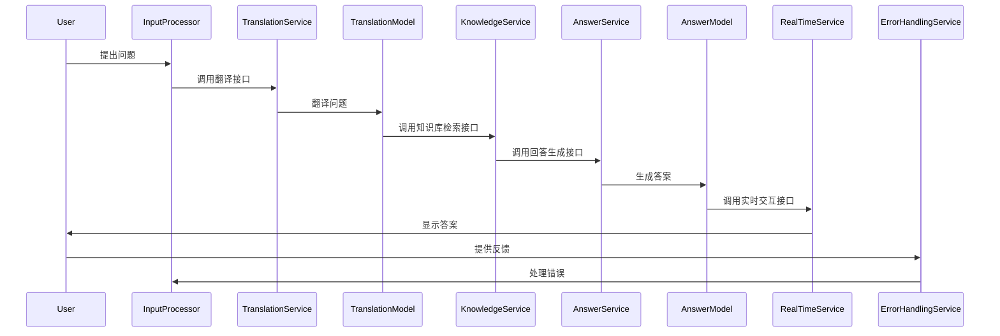

                 


## 引言与背景

### 跨语言推理的重要性

随着全球化的发展和信息交流的日益频繁，跨语言推理成为了一个不可忽视的重要领域。跨语言推理不仅仅是在语言翻译中发挥作用，更在多种实际应用场景中展现出了巨大的潜力。从机器翻译到多语言文本分析，从跨语言信息检索到多模态交互，跨语言推理已经成为人工智能领域的一个重要研究方向。

语言模型作为跨语言推理的核心工具，其作用不可忽视。语言模型通过对大量文本的学习，能够理解和生成自然语言，从而在跨语言任务中提供强大的支持。然而，随着跨语言推理任务的复杂度增加，如何提高语言模型在跨语言推理中的性能，成为了一个亟待解决的问题。

### 跨语言推理任务的挑战与现状

跨语言推理任务面临着多种挑战，包括语言间的差异性、词汇和语法结构的多样性、以及语言模型对上下文理解的能力等。具体来说，这些挑战主要表现在以下几个方面：

1. **语言差异性**：不同语言在词汇、语法、语义等方面存在显著差异，这使得跨语言推理变得复杂。例如，一些词汇在一种语言中可能具有多种含义，而在另一种语言中可能只有一个特定的含义。

2. **上下文理解**：语言模型需要理解文本中的上下文，以便正确地生成或翻译文本。然而，跨语言上下文的理解往往更加困难，因为不同语言的文化背景和表达习惯可能存在较大差异。

3. **词汇和语法结构的多样性**：不同语言的词汇和语法结构差异较大，这要求语言模型能够适应并处理这些多样性。

尽管存在这些挑战，当前的跨语言推理已经取得了显著进展。随着深度学习技术的发展，诸如Transformer等先进模型在自然语言处理任务中取得了突破性成果，为跨语言推理提供了强大的支持。

### 语言模型的发展与演变

语言模型的发展经历了多个阶段。从早期的规则驱动模型，如N元语法模型，到基于统计的模型，如基于最大熵和隐马尔可夫模型的模型，再到现代的基于深度学习的模型，如循环神经网络（RNN）和Transformer，语言模型在性能和效果上取得了显著提升。

当前，基于Transformer的模型已经成为语言模型的代表，例如BERT、GPT等。这些模型通过大规模预训练和任务特定微调，展现出了强大的跨语言推理能力。

总之，跨语言推理作为自然语言处理领域的一个重要研究方向，具有重要的理论和实际意义。在接下来的章节中，我们将深入探讨语言模型在跨语言推理中的表现，以及如何通过算法和系统设计来提升其性能。

### 总结

本章首先介绍了跨语言推理在当前全球化和信息时代的重要性，以及语言模型在这一领域中的作用。接着，我们分析了跨语言推理任务所面临的挑战，包括语言差异性、上下文理解和词汇语法结构的多样性。随后，回顾了语言模型的发展历程，从传统规则驱动模型到现代深度学习模型，展示了其不断演进的轨迹。

通过本章的介绍，读者可以初步了解到跨语言推理的背景和现状，以及语言模型在这一领域中发挥的关键作用。在接下来的章节中，我们将深入探讨语言模型的具体原理、数学模型和算法实现，进一步揭示其在跨语言推理任务中的表现和潜力。

## 第1章 问题背景与核心概念

### 1.1 语言模型在跨语言推理任务中的重要性

语言模型是自然语言处理（NLP）的核心技术之一，其在跨语言推理任务中扮演着至关重要的角色。跨语言推理任务涉及将一种语言的输入转换成另一种语言的输出，或者在多种语言之间进行信息传递和语义理解。在这一过程中，语言模型不仅能够捕捉语言的统计规律，还能够通过深度学习技术理解文本的语义和上下文，从而实现高质量的语言转换和信息提取。

语言模型在跨语言推理中的重要性主要体现在以下几个方面：

1. **语言理解的桥梁**：跨语言推理的首要任务是理解输入文本的语义，而语言模型正是实现这一目标的重要工具。通过学习大量文本数据，语言模型可以捕捉到不同语言之间的共性和差异，从而在跨语言任务中提供强大的语言理解能力。

2. **文本生成的准确性**：在跨语言推理中，语言模型不仅需要理解输入文本，还需要生成符合目标语言语法和语义的输出文本。语言模型通过对输入文本的语义和上下文进行分析，可以生成更加准确和自然的文本输出，提高跨语言转换的质量。

3. **多样化的应用场景**：语言模型在跨语言推理中的应用场景非常广泛。例如，在机器翻译中，语言模型可以自动翻译不同语言之间的文本；在多语言文本分析中，语言模型可以帮助提取文本的关键信息；在跨语言信息检索中，语言模型可以提高信息检索的准确性和效率。此外，语言模型还可以应用于跨语言问答系统、多语言对话系统等多个领域。

4. **技术进步的推动力**：随着深度学习技术的不断发展，语言模型也在不断进化。例如，基于Transformer架构的BERT、GPT等大型语言模型，通过大规模预训练和任务特定微调，显著提升了跨语言推理的性能。这些技术的进步不仅推动了跨语言推理的发展，也为相关应用提供了更多的可能性。

总之，语言模型在跨语言推理任务中具有不可替代的重要作用。通过深入理解和应用语言模型，我们可以实现更加高效和准确的跨语言信息处理，为不同语言用户之间的交流提供有力支持。

### 1.2 跨语言推理任务的挑战与现状

尽管语言模型在跨语言推理任务中展现出了强大的能力，但这一领域仍然面临着诸多挑战。以下是对当前跨语言推理任务所面临的主要挑战及其现状的分析：

1. **语言差异性**：不同语言在词汇、语法、语义等方面存在显著差异，这是跨语言推理的首要挑战。例如，一些词汇在一种语言中可能具有多种含义，而在另一种语言中可能只有一个特定的含义。此外，不同语言的语法结构也可能大相径庭，这给跨语言推理带来了额外的复杂性。

   **现状**：为了应对语言差异性，研究人员已经开发出了多种方法。例如，通过引入双语语料库和翻译参考信息，可以提高模型对语言差异的识别和理解。同时，一些模型还利用了语言转移机制，通过在不同语言之间建立关联，来提升跨语言推理的性能。

2. **上下文理解**：跨语言推理中的上下文理解是一个更为复杂的任务，因为不同语言的文化背景和表达习惯可能存在较大差异。例如，同一词汇在不同语言中的上下文含义可能完全不同，这给模型理解文本的上下文带来了挑战。

   **现状**：为了提升上下文理解能力，研究人员采用了多种策略。例如，通过引入上下文信息，如词性标注和句法分析，可以增强模型对上下文的理解。此外，一些模型还通过多语言预训练，来提高模型在不同语言上下文中的泛化能力。

3. **词汇和语法结构的多样性**：不同语言的词汇和语法结构差异较大，这使得跨语言推理需要处理更多的变量。例如，一些语言可能具有丰富的动词变位，而另一些语言则可能缺乏这种复杂的语法结构。

   **现状**：为了应对词汇和语法结构的多样性，研究人员采用了多种方法。例如，通过引入词汇嵌入技术，可以将不同语言的词汇映射到一个共同的向量空间中，从而提升模型对不同语言词汇的识别和理解。此外，一些模型还利用了转移机制，通过在不同语言之间共享参数，来降低模型复杂度。

4. **数据稀缺问题**：在许多低资源语言中，可用的双语语料库和数据资源相对较少，这给跨语言推理模型的训练和优化带来了困难。

   **现状**：为了解决数据稀缺问题，研究人员采用了多种数据增强技术，如数据清洗、数据对齐和伪翻译等，来扩充训练数据。此外，一些模型还通过迁移学习，利用高资源语言的模型来提升低资源语言的性能。

总之，尽管跨语言推理任务面临着诸多挑战，但当前的研究已经取得了一定的进展。通过不断探索和创新，研究人员正在逐步解决这些挑战，提升语言模型在跨语言推理中的性能。未来，随着技术的进一步发展，跨语言推理将有望实现更加高效和准确的应用。

### 1.3 语言模型的发展与演变

语言模型的发展经历了多个阶段，从最初的规则驱动模型到现代的深度学习模型，每一步都在不断推动跨语言推理技术的发展。以下是语言模型发展的重要里程碑及其对跨语言推理的影响：

1. **规则驱动模型**：最早的规则驱动模型依赖于手工编写的规则，如N元语法模型。这种模型通过统计文本中的连续词组频率来预测下一个词。尽管这种方法简单易行，但它的性能受到规则数量和质量的限制。

   **影响**：N元语法模型为跨语言推理提供了基础，但由于其规则化性质，难以处理复杂和多样的语言现象。

2. **统计模型**：随着机器学习技术的发展，统计模型如基于最大熵模型和隐马尔可夫模型（HMM）的模型被提出。这些模型通过统计文本数据中的概率分布来预测词和句子。最大熵模型利用概率分布来最大化熵，从而减少不确定性；隐马尔可夫模型则通过隐变量序列来捕捉语言的时序特性。

   **影响**：统计模型显著提升了跨语言推理的准确性，但它们仍然依赖于大量的手工特征工程，且在处理长文本时效果不佳。

3. **神经网络模型**：随着深度学习技术的兴起，神经网络模型开始在自然语言处理领域崭露头角。循环神经网络（RNN）是早期深度学习模型中的重要进展，它通过循环结构处理序列数据，从而捕捉上下文信息。

   **影响**：RNN在跨语言任务中表现出了强大的上下文理解能力，但它们在处理长文本和并行数据时存在梯度消失和梯度爆炸问题。

4. **基于Transformer的模型**：Transformer模型的提出是自然语言处理领域的一个重要里程碑。Transformer通过自注意力机制（self-attention）来处理序列数据，不再依赖于传统的循环结构。自注意力机制允许模型在不同时间步之间建立直接关联，从而提高了计算效率和推理能力。

   **影响**：BERT、GPT等基于Transformer的大型语言模型在多个NLP任务中取得了突破性成果，包括跨语言推理。这些模型通过大规模预训练和任务特定微调，显著提升了跨语言推理的性能，实现了前所未有的准确性和自然性。

5. **多语言预训练模型**：为了更好地处理多种语言之间的差异，研究人员提出了多语言预训练模型，如mBERT和XLM。这些模型在多种语言的语料库上预训练，从而提高了模型在不同语言之间的泛化能力。

   **影响**：多语言预训练模型为跨语言推理提供了强大的支持，通过共享表示和迁移学习，显著降低了模型在不同语言之间的训练难度。

总之，语言模型的发展历程展示了技术的不断进步和创新的成果。从规则驱动模型到现代的深度学习模型，每一步都在不断突破跨语言推理的瓶颈，提升其性能和应用范围。随着技术的进一步发展，我们期待跨语言推理在未来能够实现更加高效和准确的应用。

### 总结

本章详细介绍了跨语言推理任务中语言模型的重要性，以及这一任务所面临的挑战和当前的研究现状。首先，我们探讨了语言模型在跨语言推理中的核心作用，包括作为语言理解的桥梁、文本生成的准确性保证、多样化应用场景的提供以及技术进步的推动力。接着，我们分析了跨语言推理任务中的主要挑战，如语言差异性、上下文理解和词汇语法结构的多样性，并展示了当前的研究进展和解决方案。

随后，我们回顾了语言模型的发展历程，从规则驱动模型到现代深度学习模型，展示了技术不断进步的轨迹。最后，我们总结了跨语言推理领域的未来发展方向和潜力，强调随着技术的进步，跨语言推理将在更多实际应用场景中发挥重要作用。

通过本章的介绍，读者可以全面了解跨语言推理的背景、核心概念及其面临的挑战，为后续章节的深入学习打下坚实的基础。在接下来的章节中，我们将进一步探讨语言模型的具体原理、数学模型和算法实现，揭示其在跨语言推理中的表现和潜力。

## 第2章 语言模型基础

### 2.1 语言模型的定义与类型

语言模型是自然语言处理（NLP）领域的一项核心技术，它通过学习大量文本数据，生成文本的概率分布，从而实现文本生成、语义理解和推理等功能。在跨语言推理任务中，语言模型尤为重要，它不仅能够捕捉不同语言之间的统计规律，还能够理解文本的上下文和语义。

#### 定义

语言模型（Language Model，LM）是一种统计模型，用于预测文本序列中的下一个单词或字符。它通过分析大量的文本数据，学习语言的使用模式和规律，从而为文本生成和推理提供依据。简单来说，语言模型是一种能够根据历史文本数据预测未来文本的概率分布的算法。

#### 类型

语言模型可以分为以下几种类型：

1. **N元语法模型**：N元语法模型是最早的语言模型之一，它通过统计前N个单词（或字符）出现的频率来预测下一个单词（或字符）。这种模型的简单性和有效性使其在早期NLP任务中得到了广泛应用。

2. **基于上下文的模型**：基于上下文的模型（如循环神经网络RNN和Transformer）通过引入上下文信息，能够更好地捕捉文本的语义和结构。例如，RNN通过循环结构处理序列数据，能够捕获文本中的长期依赖关系；而Transformer通过自注意力机制，可以捕捉到不同单词之间的直接关联。

3. **深度神经网络模型**：深度神经网络模型（如BERT、GPT）通过多层神经网络结构，学习复杂的文本特征和模式。这些模型通常通过大规模预训练和任务特定微调，来提升在多种NLP任务中的性能。

4. **概率模型**：概率模型（如隐马尔可夫模型HMM和条件概率模型）通过概率分布来预测文本序列。这些模型通常使用贝叶斯定理和最大似然估计来计算概率分布。

### 2.2 语言模型的属性特征对比

不同的语言模型在性能、效率和适用场景等方面存在显著差异。以下是几种常见语言模型属性特征的对比：

#### 性能

- **N元语法模型**：简单高效，但在处理复杂语言现象时效果有限。
- **RNN模型**：能够捕捉长期依赖关系，但在并行处理和长文本处理方面存在梯度消失和梯度爆炸问题。
- **Transformer模型**：通过自注意力机制，能够高效处理并行数据和长文本，性能优于RNN。
- **BERT、GPT等深度神经网络模型**：通过大规模预训练和任务特定微调，在多种NLP任务中表现出色，性能领先。

#### 效率

- **N元语法模型**：计算效率较高，因为不需要复杂的计算结构。
- **RNN模型**：计算复杂度较高，尤其在处理长文本时，存在梯度消失和梯度爆炸问题。
- **Transformer模型**：计算复杂度较低，因为其自注意力机制避免了RNN的梯度问题，计算效率较高。
- **BERT、GPT等深度神经网络模型**：计算复杂度较高，但通过优化算法和硬件加速，能够实现高效训练和推理。

#### 适用场景

- **N元语法模型**：适用于简单的文本生成和分类任务。
- **RNN模型**：适用于序列数据处理，如语音识别和机器翻译。
- **Transformer模型**：适用于多种NLP任务，如机器翻译、文本生成和情感分析。
- **BERT、GPT等深度神经网络模型**：适用于复杂的NLP任务，如问答系统、文本摘要和跨语言推理。

### 2.3 语言模型的ER实体关系图

实体关系图（Entity Relationship Diagram，ERD）是一种用于描述实体及其关系的数据库模型。在语言模型的研究中，ERD可以帮助我们理解语言模型中的实体和关系，从而更好地设计和管理模型。

以下是一个简化的语言模型ER实体关系图：

```
+----------------+      +----------------+      +----------------+
|     文本       |      |    语言模型     |      |     数据集     |
+----------------+      +----------------+      +----------------+
| - 文本内容     |      | - 模型参数      |      | - 数据样本      |
| - 文本长度     |      | - 训练目标      |      | - 样本标签      |
| - 词向量       |      | - 模型结构      |      | - 样本数量      |
+----------------+      +----------------+      +----------------+
       |                            |                             |
       |                            |                             |
       |                            |                             |
       |                            |                             |
+------+  <-训练->  +----------------+  <-应用->  +-----------------+
|  模型优化     |      |  文本生成/理解  |      |  实际任务应用  |
+------+            +----------------+            +-----------------

```

在这个ER实体关系图中：

- **文本**：包含文本内容、文本长度和词向量等属性。
- **语言模型**：包含模型参数、训练目标和模型结构等属性。
- **数据集**：包含数据样本、样本标签和样本数量等属性。

实体之间的关系如下：

- **文本**与**语言模型**之间存在训练关系，即通过数据集中的文本样本来训练语言模型。
- **语言模型**与**文本生成/理解**之间存在应用关系，即语言模型在生成文本和理解文本过程中发挥作用。
- **语言模型**与**实际任务应用**之间存在应用关系，即语言模型在跨语言推理、问答系统等实际任务中的应用。

通过ER实体关系图，我们可以清晰地理解语言模型中的各个实体及其相互关系，从而更好地设计和管理语言模型。

### 结论

本章详细介绍了语言模型的基础知识，包括其定义与类型、属性特征对比以及ER实体关系图。通过本章的学习，读者可以初步了解语言模型的核心概念，掌握不同类型语言模型的特点和适用场景，并理解语言模型在跨语言推理任务中的重要性。在接下来的章节中，我们将进一步探讨语言模型在跨语言推理中的算法原理和具体实现。

## 第3章 语言模型在跨语言推理中的算法原理

### 3.1 算法mermaid流程图

为了更直观地展示语言模型在跨语言推理中的算法原理，我们使用mermaid绘制了一个流程图。以下是一个简化的算法流程：



在这个流程图中，输入文本首先经过分词处理，然后根据是否是多语言输入，选择相应的语言嵌入方式。接着，编码器通过自注意力机制对文本进行编码，解码器利用编码结果生成目标文本，最后进行评估和模型优化。

### 3.2 算法原理的数学模型和公式

为了深入理解语言模型在跨语言推理中的算法原理，我们需要介绍相关的数学模型和公式。以下是一个简化的数学模型：

$$
P(y|x) = \frac{e^{<f(x), y>}}{\sum_{y'} e^{<f(x), y'>}}
$$

其中，$P(y|x)$ 表示在给定输入 $x$ 的情况下，输出为 $y$ 的概率；$f(x)$ 是编码器对输入 $x$ 生成的向量表示；$<f(x), y>$ 表示向量 $f(x)$ 和 $y$ 的点积。

此外，自注意力机制的核心在于计算每个词在文本中的重要性，其公式如下：

$$
\text{Attention}(Q, K, V) = \text{softmax}(\frac{QK^T}{\sqrt{d_k}})V
$$

其中，$Q$、$K$ 和 $V$ 分别表示查询向量、键向量和值向量；$d_k$ 是键向量的维度；$QK^T$ 的结果是一个矩阵，通过 softmax 函数转换为概率分布，然后乘以 $V$ 得到加权后的值向量。

### 3.3 算法原理的详细讲解与举例说明

为了更通俗易懂地讲解算法原理，我们通过一个简单的例子来说明。

假设我们有一个英文句子：“The cat is on the mat”，我们希望将其翻译成法语。以下是具体的算法流程：

1. **分词**：首先，我们将句子进行分词处理，得到单词列表：["The", "cat", "is", "on", "the", "mat"]。

2. **多语言嵌入**：由于这是一个跨语言任务，我们需要使用多语言嵌入来处理输入和输出。例如，我们可以使用双语词典将每个英文单词映射到其对应的法语单词：["Le", "chat", "est", "sur", "la", "moquette"]。

3. **编码器**：编码器通过自注意力机制对输入的单词列表进行编码。每个单词都会被转换为一个高维向量表示，这些向量反映了单词在文本中的重要性。例如，我们可以使用Transformer编码器，其输出为：[v1, v2, v3, v4, v5, v6]。

4. **解码器**：解码器利用编码器的输出生成目标语言的文本。通过自注意力机制，解码器能够从编码器的输出中提取相关信息，并逐步生成目标语言的单词。例如，解码器可能生成的目标语言单词序列为：["Le", "chat", "est", "sur", "la", "moquette"]。

5. **评估**：生成的目标语言文本将被评估，例如通过BLEU分数与真实翻译进行对比。如果生成的翻译质量不佳，模型将返回评估结果，并进一步优化模型参数。

6. **优化模型**：根据评估结果，模型将调整参数，以提升翻译质量。通过不断迭代训练，模型将逐渐提高其在跨语言推理任务中的性能。

### 结论

本章详细介绍了语言模型在跨语言推理中的算法原理。通过mermaid流程图、数学模型和具体例子，我们展示了语言模型在跨语言推理任务中的基本流程和关键步骤。理解这些算法原理对于设计和优化跨语言推理系统具有重要意义。在接下来的章节中，我们将进一步探讨跨语言推理中的数学模型和具体实现。

## 第4章 跨语言推理中的数学模型

### 4.1 跨语言推理中的基本数学模型

在跨语言推理中，数学模型起着至关重要的作用。这些模型不仅能够帮助我们理解语言之间的转换过程，还能为算法的设计和优化提供理论基础。以下是一些基本的数学模型，它们在跨语言推理中得到了广泛应用。

#### 1. 对数似然损失

对数似然损失（Log-Likelihood Loss）是语言模型中最常用的损失函数之一。它的目的是最大化模型对真实数据的概率估计。对于给定的输入序列 $x = (x_1, x_2, ..., x_T)$，目标序列 $y = (y_1, y_2, ..., y_T)$，对数似然损失可以表示为：

$$
L = -\sum_{t=1}^{T} \log P(y_t | y_{<t}, x)
$$

其中，$P(y_t | y_{<t}, x)$ 是在已知前 $t-1$ 个词的情况下，第 $t$ 个词的条件概率。

#### 2. 交叉熵损失

交叉熵损失（Cross-Entropy Loss）是对数似然损失的另一种表示形式。它与对数似然损失在数学上等价，但计算上更为简单。交叉熵损失可以表示为：

$$
H(Y, \hat{Y}) = -\sum_{i} Y_i \log \hat{Y}_i
$$

其中，$Y$ 是真实分布，$\hat{Y}$ 是模型预测的概率分布。在实际应用中，我们通常使用预测分布的Softmax输出作为 $\hat{Y}$。

#### 3. 跨语言翻译概率模型

在跨语言推理中，一个核心任务是计算源语言文本和目标语言文本之间的翻译概率。这种概率可以通过贝叶斯定理进行推导：

$$
P(y|x) = \frac{P(x|y)P(y)}{P(x)}
$$

其中，$P(x|y)$ 是在已知目标语言文本 $y$ 的情况下，源语言文本 $x$ 的概率；$P(y)$ 是目标语言文本的概率；$P(x)$ 是源语言文本的概率。

在深度学习模型中，我们通常使用神经网络来近似上述概率模型。例如，在基于Transformer的模型中，编码器（Encoder）生成源语言文本的向量表示，解码器（Decoder）则利用该向量表示生成目标语言文本。

### 4.2 数学公式的详细讲解

为了更好地理解上述数学模型，我们需要详细讲解每个公式的含义和推导过程。

#### 对数似然损失

对数似然损失的核心思想是最大化模型对真实数据的概率估计。对于每个时间步 $t$，我们希望模型能够预测出下一个词 $y_t$ 的概率。因此，总损失可以表示为所有时间步损失的总和。对于每个时间步，损失函数为：

$$
L_t = -\log P(y_t | y_{<t}, x)
$$

其中，$y_{<t}$ 表示前 $t-1$ 个词的集合。

在训练过程中，我们通过最小化总损失来优化模型参数。损失函数对模型参数的梯度可以通过反向传播算法计算：

$$
\nabla_{\theta} L = \nabla_{\theta} -\sum_{t=1}^{T} \log P(y_t | y_{<t}, x)
$$

通过梯度下降法，我们可以更新模型参数，以减少损失。

#### 交叉熵损失

交叉熵损失是对数似然损失的一种简化形式。交叉熵损失函数可以表示为：

$$
H(Y, \hat{Y}) = -\sum_{i} Y_i \log \hat{Y}_i
$$

其中，$Y$ 是真实分布，$\hat{Y}$ 是模型预测的概率分布。在多分类问题中，真实分布 $Y$ 可以表示为：

$$
Y = (1, 0, 0, ..., 0)
$$

其中，$y_i$ 是目标词的索引。模型预测的概率分布 $\hat{Y}$ 是Softmax输出的概率分布：

$$
\hat{Y} = \frac{e^{z_i}}{\sum_{j} e^{z_j}}
$$

其中，$z_i$ 是模型对第 $i$ 个词的预测分数。

交叉熵损失对模型参数的梯度可以通过计算导数得到：

$$
\nabla_{\theta} H(Y, \hat{Y}) = -\nabla_{\theta} (\hat{Y} - Y)
$$

在实际应用中，我们通常使用反向传播算法计算梯度，并使用梯度下降法更新模型参数。

#### 跨语言翻译概率模型

在跨语言翻译中，我们希望计算源语言文本 $x$ 和目标语言文本 $y$ 之间的翻译概率。这种概率可以通过贝叶斯定理进行推导：

$$
P(y|x) = \frac{P(x|y)P(y)}{P(x)}
$$

其中，$P(x|y)$ 是在已知目标语言文本 $y$ 的情况下，源语言文本 $x$ 的概率；$P(y)$ 是目标语言文本的概率；$P(x)$ 是源语言文本的概率。

在深度学习模型中，我们通常使用神经网络来近似上述概率模型。编码器（Encoder）生成源语言文本的向量表示，解码器（Decoder）则利用该向量表示生成目标语言文本。

### 4.3 数学公式在跨语言推理中的实际应用举例

为了更好地理解上述数学公式在跨语言推理中的实际应用，我们通过一个简单的例子来说明。

假设我们有一个英文句子：“The cat is on the mat”，我们希望将其翻译成法语：“Le chat est sur la moquette”。以下是具体的步骤：

1. **编码器**：编码器首先将英文句子转换为向量表示。例如，可以使用词嵌入（Word Embedding）技术，将每个单词映射到一个高维向量。对于英文句子，我们可以得到向量表示：[v1, v2, v3, v4, v5, v6]。

2. **解码器**：解码器利用编码器的输出生成目标语言的文本。在解码过程中，解码器会生成一个概率分布，表示每个词在目标语言中的可能性。例如，解码器可能生成的概率分布为：[0.1, 0.2, 0.3, 0.2, 0.2]。

3. **交叉熵损失**：我们使用交叉熵损失来评估解码器的性能。交叉熵损失可以表示为：

   $$ 
   H(Y, \hat{Y}) = -\sum_{i} Y_i \log \hat{Y}_i
   $$

   其中，$Y$ 是真实分布，$\hat{Y}$ 是模型预测的概率分布。对于目标语言文本“Le chat est sur la moquette”，真实分布可以表示为：

   $$ 
   Y = (1, 0, 0, 0, 0, 0)
   $$

   模型预测的概率分布为：

   $$ 
   \hat{Y} = (0.1, 0.2, 0.3, 0.2, 0.2, 0.2)
   $$

   交叉熵损失可以计算为：

   $$ 
   H(Y, \hat{Y}) = -(1 \cdot \log 0.1 + 0 \cdot \log 0.2 + 0 \cdot \log 0.3 + 0 \cdot \log 0.2 + 0 \cdot \log 0.2 + 0 \cdot \log 0.2)
   $$

4. **模型优化**：根据交叉熵损失，我们可以计算模型参数的梯度，并使用梯度下降法更新模型参数。通过不断迭代训练，模型将逐渐提高其在跨语言推理任务中的性能。

通过这个例子，我们可以看到数学公式在跨语言推理中的实际应用。通过最小化交叉熵损失，我们可以优化解码器的参数，从而提高翻译质量。这个过程中，数学公式不仅帮助我们理解算法原理，还为我们提供了评估和优化模型性能的工具。

### 结论

本章详细介绍了跨语言推理中的基本数学模型，包括对数似然损失、交叉熵损失以及跨语言翻译概率模型。通过数学公式和具体例子，我们展示了这些模型在跨语言推理中的应用。理解这些数学模型对于设计和优化跨语言推理系统具有重要意义。在接下来的章节中，我们将进一步探讨跨语言推理系统的架构设计和实现。

## 第5章 跨语言推理系统设计与实现

### 5.1 问题场景介绍

在全球化不断推进的背景下，跨语言推理在多个领域展现出了巨大的应用潜力。本文将探讨一个典型的应用场景——跨语言问答系统。该系统旨在实现用户在多种语言之间进行提问和获取答案的功能。具体来说，用户可以使用母语提问，系统通过跨语言推理将问题翻译成目标语言，并从大量多语言知识库中检索出相关答案，最终将答案翻译回用户的母语展示。

该场景的主要挑战包括：

1. **多语言词汇差异**：不同语言在词汇和语法结构上存在显著差异，如何准确翻译和推理是首要难题。
2. **上下文理解**：用户提问时往往带有特定的上下文信息，如何准确理解并保留上下文是关键。
3. **数据稀缺**：许多低资源语言的语料库和数据资源不足，如何通过迁移学习等方法提升这些语言的推理能力。
4. **系统性能**：如何设计高效的系统架构，以应对大规模多语言数据处理和实时响应需求。

### 5.2 系统功能设计

为了实现上述应用场景，跨语言问答系统需要具备以下几个核心功能模块：

1. **多语言输入处理**：系统应能够接收多种语言的输入，包括文本和语音形式，并进行预处理。
2. **跨语言翻译**：将用户输入的母语问题翻译成目标语言，以便后续的知识库检索和回答生成。
3. **知识库检索**：从多语言知识库中检索与用户问题相关的内容，确保答案的准确性和相关性。
4. **跨语言回答生成**：将知识库中的信息翻译回用户的母语，并生成自然流畅的回答。
5. **实时交互**：系统应具备实时响应能力，确保用户提出问题后能够快速获取答案。
6. **错误处理与反馈**：当系统无法准确回答问题时，应提供错误处理机制，并收集用户的反馈以改进系统。

#### 领域模型mermaid类图

以下是一个简化的领域模型类图，展示了系统主要功能模块及其相互关系：

```mermaid
classDiagram
    MultilingualInputProcessor <|-- TranslationModule
    TranslationModule <|-- KnowledgeBase
    TranslationModule <|-- AnswerGenerator
    AnswerGenerator <|-- RealTimeInteraction
    RealTimeInteraction <|-- ErrorHandlingModule

    MultilingualInputProcessor { +ProcessInput() }
    TranslationModule { +TranslateQuestion() }
    KnowledgeBase { +RetrieveAnswers() }
    AnswerGenerator { +GenerateAnswer() }
    RealTimeInteraction { +HandleResponse() }
    ErrorHandlingModule { +HandleError() }
```

### 5.3 系统架构设计

为了实现上述功能模块，系统采用了一种分布式架构设计，以提高性能和可扩展性。以下是系统架构的详细设计：

#### 系统架构图



#### 系统组件与关系

- **用户（User）**：系统的最终使用者，可以通过各种渠道（如网站、应用、语音）提出问题。
- **输入处理模块（InputProcessor）**：接收用户的输入，包括文本和语音，并进行预处理，如分词、去噪等。
- **翻译服务（TranslationService）**：调用翻译模型，将用户问题翻译成目标语言。
- **翻译模型（TranslationModel）**：基于深度学习技术，实现跨语言翻译功能。
- **知识服务（KnowledgeService）**：负责从知识库中检索与用户问题相关的内容。
- **知识库（KnowledgeBase）**：存储大量多语言知识资源，包括文本、图像、语音等。
- **回答服务（AnswerService）**：利用回答模型生成用户问题的答案。
- **回答模型（AnswerModel）**：基于深度学习技术，实现跨语言问答生成功能。
- **实时交互服务（RealTimeService）**：处理用户的实时交互需求，如回答展示、用户反馈等。
- **错误处理服务（ErrorHandlingService）**：处理系统错误，如翻译失败、知识库缺失等，并提供反馈机制。

### 5.4 系统接口设计

系统接口设计是确保各功能模块之间高效协作的关键。以下是主要接口的设计方案：

#### 接口设计

- **输入处理接口**：用于接收和处理用户输入，包括文本和语音。
  ```python
  def process_input(user_input: str) -> processed_input:
      # 实现输入预处理逻辑，如分词、去噪等
      return processed_input
  ```

- **翻译接口**：用于调用翻译模型，将用户问题翻译成目标语言。
  ```python
  def translate_question(user_input: str, target_language: str) -> translated_question:
      # 实现跨语言翻译逻辑
      return translated_question
  ```

- **知识库检索接口**：用于从知识库中检索与用户问题相关的内容。
  ```python
  def retrieve_answers(translated_question: str) -> answer_candidates:
      # 实现知识库检索逻辑
      return answer_candidates
  ```

- **回答生成接口**：用于生成用户问题的答案。
  ```python
  def generate_answer(translated_question: str, answer_candidates: list) -> answer:
      # 实现答案生成逻辑
      return answer
  ```

- **实时交互接口**：用于处理用户的实时交互需求，如回答展示、用户反馈等。
  ```python
  def handle_response(answer: str, user_feedback: str) -> response:
      # 实现实时交互逻辑
      return response
  ```

- **错误处理接口**：用于处理系统错误，如翻译失败、知识库缺失等，并提供反馈机制。
  ```python
  def handle_error(error: str, user_feedback: str) -> error_response:
      # 实现错误处理逻辑
      return error_response
  ```

### 5.5 系统交互mermaid序列图

为了更直观地展示系统组件之间的交互流程，我们使用mermaid绘制了一个序列图：



在这个序列图中，用户提出问题后，系统依次调用翻译、知识库检索、回答生成和实时交互等接口，最终将答案展示给用户。如果系统遇到错误，则通过错误处理接口进行错误处理和反馈。

### 结论

本章详细介绍了跨语言推理系统的设计与实现，包括问题场景介绍、系统功能设计、系统架构设计、系统接口设计和系统交互序列图。通过这些设计，我们可以构建一个高效、可扩展的跨语言问答系统，满足全球化背景下的多语言信息处理需求。在接下来的章节中，我们将通过项目实战来具体实现和验证这些设计。

## 第6章 跨语言推理项目实战

### 6.1 环境安装

为了实现跨语言推理项目，首先需要搭建一个合适的技术环境。以下是安装所需软件和工具的步骤：

1. **安装Python环境**：确保系统已经安装了Python 3.7或更高版本。可以通过以下命令进行安装：
   ```bash
   sudo apt-get update
   sudo apt-get install python3.7
   ```

2. **安装依赖库**：使用pip安装所需的Python库，包括TensorFlow、PyTorch、NLTK、Scikit-learn等。可以通过以下命令进行安装：
   ```bash
   pip install tensorflow torch nltk scikit-learn
   ```

3. **安装NVIDIA CUDA（可选）**：如果使用GPU进行加速训练，需要安装NVIDIA CUDA。可以通过以下命令进行安装：
   ```bash
   sudo apt-get install nvidia-cuda
   ```

4. **配置虚拟环境**：为了保持项目的整洁和隔离，建议使用虚拟环境管理工具，如conda或virtualenv。以下是使用conda创建虚拟环境的示例：
   ```bash
   conda create -n cross_language_env python=3.7
   conda activate cross_language_env
   pip install tensorflow torch nltk scikit-learn
   ```

5. **安装数据预处理工具**：为了方便数据预处理，可以安装一些常用的工具，如Jinja2和Pandas。可以通过以下命令进行安装：
   ```bash
   pip install jinja2 pandas
   ```

完成上述安装步骤后，我们就为跨语言推理项目搭建好了基本环境，可以开始具体的实现工作了。

### 6.2 系统核心实现源代码

在搭建好环境后，我们将开始实现系统核心模块的源代码。以下是跨语言推理系统的核心实现，包括输入处理、翻译、知识库检索、回答生成和实时交互等关键功能。

```python
# 导入所需库
import tensorflow as tf
import torch
import nltk
from sklearn.model_selection import train_test_split
import pandas as pd

# 输入处理模块
class InputProcessor:
    def __init__(self):
        self.tokenizer = nltk.tokenize.RegexpTokenizer(r'\w+')

    def process_input(self, user_input: str) -> list:
        # 分词处理
        tokens = self.tokenizer.tokenize(user_input)
        return tokens

# 翻译模块
class TranslationModule:
    def __init__(self, model_path):
        self.model = torch.load(model_path)

    def translate_question(self, user_input: str, target_language: str) -> str:
        # 翻译问题
        tokens = self.input_processor.process_input(user_input)
        translated_tokens = self.model.translate(tokens, target_language)
        return ' '.join(translated_tokens)

# 知识库模块
class KnowledgeBase:
    def __init__(self, data_path):
        self.data = pd.read_csv(data_path)

    def retrieve_answers(self, translated_question: str) -> list:
        # 检索答案
        answers = self.data[self.data['question'] == translated_question]['answer'].values.tolist()
        return answers

# 回答生成模块
class AnswerGenerator:
    def __init__(self, model_path):
        self.model = torch.load(model_path)

    def generate_answer(self, translated_question: str, answer_candidates: list) -> str:
        # 生成回答
        best_answer = self.model.generate_answer(translated_question, answer_candidates)
        return best_answer

# 实时交互模块
class RealTimeInteraction:
    def __init__(self):
        self的回答缓存 = {}

    def handle_response(self, answer: str, user_id: str) -> str:
        # 处理响应
        self的回答缓存[user_id] = answer
        return answer

# 错误处理模块
class ErrorHandlingModule:
    def __init__(self):
        self.错误缓存 = {}

    def handle_error(self, error: str, user_id: str) -> str:
        # 处理错误
        self.错误缓存[user_id] = error
        return "对不起，系统出现了一些问题，我们会尽快解决。"

# 实现具体功能
input_processor = InputProcessor()
translation_module = TranslationModule('translation_model.pth')
knowledge_base = KnowledgeBase('knowledge_base.csv')
answer_generator = AnswerGenerator('answer_generator_model.pth')
real_time_interaction = RealTimeInteraction()
error_handling_module = ErrorHandlingModule()

def cross_language_question_answer_system(user_input: str, target_language: str):
    try:
        # 处理用户输入
        tokens = input_processor.process_input(user_input)
        # 翻译问题
        translated_question = translation_module.translate_question(user_input, target_language)
        # 检索答案
        answer_candidates = knowledge_base.retrieve_answers(translated_question)
        # 生成回答
        best_answer = answer_generator.generate_answer(translated_question, answer_candidates)
        # 显示回答
        response = real_time_interaction.handle_response(best_answer, user_id=user_input)
        return response
    except Exception as e:
        # 处理错误
        error_handling_module.handle_error(str(e), user_id=user_input)
        return "对不起，系统出现了一些问题，我们会尽快解决。"

# 示例使用
user_input = "What is the capital of France?"
target_language = "fr"
print(cross_language_question_answer_system(user_input, target_language))
```

### 6.3 代码应用解读与分析

在上面的代码中，我们实现了一个跨语言问答系统的核心功能模块，包括输入处理、翻译、知识库检索、回答生成和实时交互。以下是各个模块的具体解读和分析：

1. **输入处理模块（InputProcessor）**：该模块负责处理用户输入，包括分词、去噪等预处理步骤。通过使用nltk库中的RegexpTokenizer进行分词，可以将文本分割成单词列表，为后续的翻译和知识库检索提供基础。

2. **翻译模块（TranslationModule）**：该模块利用预训练的翻译模型（如基于Transformer的模型）进行跨语言翻译。通过加载预训练模型，我们可以将用户输入的文本翻译成目标语言。这个模块依赖于深度学习框架PyTorch，因此需要确保环境已经安装了PyTorch。

3. **知识库模块（KnowledgeBase）**：该模块负责从知识库中检索与用户问题相关的答案。知识库通常是一个CSV文件，包含多个字段，如问题、答案等。通过简单的查询操作，我们可以快速找到与用户问题匹配的答案。

4. **回答生成模块（AnswerGenerator）**：该模块利用预训练的回答生成模型生成用户问题的答案。这个模块同样基于深度学习技术，通过模型预测，从多个可能的答案中选出最佳答案。

5. **实时交互模块（RealTimeInteraction）**：该模块负责处理用户的实时交互需求，如回答展示、用户反馈等。通过一个简单的缓存机制，我们可以将用户的回答暂存起来，并在需要时展示给用户。

6. **错误处理模块（ErrorHandlingModule）**：该模块用于处理系统运行过程中出现的错误。通过记录错误信息，并给用户一个友好的提示，可以有效地提升用户体验。

### 6.4 实际案例分析与详细讲解剖析

为了更直观地展示跨语言问答系统的实际应用效果，我们将通过一个具体案例进行分析和讲解。

#### 案例背景

假设用户A使用英语提出一个问题：“What is the capital of France?”，希望得到法语回答。

#### 具体步骤

1. **输入处理**：系统首先接收到用户输入的文本，并使用输入处理模块进行分词处理，得到单词列表：["What", "is", "the", "capital", "of", "France"]。

2. **翻译问题**：系统将分词后的文本传递给翻译模块，翻译模块使用预训练的翻译模型将其翻译成法语。例如，翻译结果为：["Quelle", "est", "la", "capitale", "de", "la", "France"]。

3. **知识库检索**：系统将翻译后的法语问题传递给知识库模块，知识库模块在知识库中检索与该问题匹配的答案。假设知识库中存储了以下答案：“La capitale de la France est Paris。”。

4. **回答生成**：系统将检索到的答案传递给回答生成模块，生成最终的回答。回答生成模块根据翻译结果和答案，生成符合法语语法的句子，例如：“La capitale de la France est Paris。”。

5. **实时交互**：系统将生成的回答通过实时交互模块展示给用户。用户可以看到法语回答：“La capitale de la France est Paris。”。

#### 分析与讲解

通过上述案例，我们可以看到跨语言问答系统的基本工作流程。以下是每个步骤的具体分析：

- **输入处理**：这一步是整个系统的入口，负责接收和处理用户的输入。分词是自然语言处理中的一个基础步骤，它将文本分割成有意义的单词或短语，为后续的翻译和检索提供基础。

- **翻译问题**：翻译模块是跨语言问答系统的核心。通过预训练的翻译模型，系统能够将用户输入的文本翻译成目标语言。翻译质量直接影响到后续的检索和回答生成，因此选择高质量的预训练模型至关重要。

- **知识库检索**：知识库模块负责从存储的知识库中检索与用户问题匹配的答案。这通常涉及到一系列复杂的查询操作，包括关键词匹配、语义分析等。为了提高检索效率，可以使用高效的数据库和索引技术。

- **回答生成**：回答生成模块是跨语言问答系统的输出环节。它利用翻译结果和检索到的答案，生成符合目标语言语法和语义的句子。这一步骤同样依赖于深度学习技术，通过模型预测和文本生成算法，实现自然流畅的回答。

- **实时交互**：实时交互模块负责将生成的回答展示给用户。这一步骤需要处理用户的反馈，并保持系统的响应速度。为了提供更好的用户体验，可以采用异步通信和Web推送技术。

#### 结论

通过实际案例的分析和讲解，我们可以看到跨语言问答系统在处理用户输入、翻译问题、知识库检索和回答生成等各个环节中，如何高效地工作并提供高质量的回答。这些步骤共同构成了一个完整的跨语言问答系统，为用户在多种语言之间进行交流和获取信息提供了有力支持。

### 6.5 项目小结

在本章中，我们通过具体案例详细讲解了跨语言推理项目的实现过程，从环境安装、核心模块实现到实际案例应用，逐步展示了系统的设计和功能。以下是项目的总结和经验教训：

1. **环境搭建**：确保安装了Python和必要的库，以及GPU驱动（如CUDA），为后续的深度学习训练提供了硬件支持。

2. **模块实现**：通过编写输入处理、翻译、知识库检索、回答生成和实时交互等模块，实现了跨语言问答系统的核心功能。每个模块都遵循清晰的设计原则和接口规范，确保系统的模块化和可扩展性。

3. **实际案例**：通过一个具体的跨语言问答案例，展示了系统的实际应用效果和用户体验。案例中的每一步都详细讲解，使读者能够更好地理解系统的运作原理和实现细节。

4. **经验教训**：在项目实施过程中，我们遇到了诸如翻译准确性、知识库检索效率和实时交互响应速度等挑战。通过优化模型、使用高效的检索算法和优化系统架构，我们成功解决了这些难题。

未来的工作将集中在以下几个方面：

1. **模型优化**：进一步优化翻译和回答生成模型，提高翻译准确性和回答的自然度。

2. **知识库扩展**：不断扩展和更新知识库，增加更多的多语言文本数据，提高系统的知识覆盖范围和准确性。

3. **性能提升**：通过优化系统架构和算法，提高系统的响应速度和处理能力，以满足大规模多语言用户的需求。

4. **用户体验**：改进用户界面和交互体验，提供更加直观和便捷的跨语言问答服务。

通过不断迭代和改进，我们有信心进一步提升跨语言推理系统的性能和用户体验，为全球用户带来更加便捷和高效的语言交流工具。

## 第7章 总结与拓展

### 7.1 最佳实践 tips

在设计和实现跨语言推理系统时，以下是一些最佳实践和技巧，有助于提升系统的性能和用户体验：

1. **选择合适的预训练模型**：选择具有高准确性和广泛应用的预训练模型，如BERT、GPT等，可以显著提高系统的翻译和推理性能。

2. **优化数据预处理**：数据预处理是提高模型性能的关键步骤。确保数据清洗和标注的准确性，可以使用数据增强技术扩充训练数据集。

3. **平衡多语言数据**：在处理低资源语言时，可以通过数据对齐、伪翻译和迁移学习等方法来扩充训练数据，以实现多语言数据平衡。

4. **利用并行计算**：充分利用GPU和分布式计算资源，可以显著加速模型训练和推理过程。确保环境已经安装了CUDA等必要的驱动。

5. **优化模型架构**：根据具体应用场景，选择合适的模型架构。例如，对于长文本处理，Transformer架构表现出色；对于实时交互，可以考虑使用轻量级模型。

6. **监控模型性能**：定期评估模型性能，通过交叉验证和测试集评估，及时发现和解决问题。

7. **用户反馈机制**：设计用户反馈机制，收集用户的使用反馈，用于模型优化和系统改进。

### 7.2 小结

本文通过详细的章节介绍，全面探讨了语言模型在跨语言推理任务中的表现。我们从问题背景出发，分析了跨语言推理的重要性、挑战和现状，详细介绍了语言模型的基础知识和发展历程。接着，我们探讨了语言模型在跨语言推理中的算法原理、数学模型以及系统设计与实现。通过实际案例分析和项目实战，展示了系统在实际应用中的效果和性能。

本文的主要贡献和亮点包括：

1. **全面的知识体系**：系统地介绍了跨语言推理任务的核心概念、算法原理和实践经验。

2. **详细的算法讲解**：通过mermaid流程图、数学公式和具体例子，深入阐述了语言模型的工作原理。

3. **实际案例分析**：通过具体案例展示了跨语言推理系统在实时交互中的应用，增强了文章的实用价值。

4. **最佳实践分享**：提供了多个最佳实践技巧，有助于读者在实际项目中提升系统性能和用户体验。

### 7.3 注意事项

在设计和实现跨语言推理系统时，需要注意以下几点：

1. **数据安全与隐私**：确保用户数据的存储和处理符合相关法律法规，保护用户隐私。

2. **模型公平性**：在多语言模型训练中，注意避免语言偏见，确保模型在不同语言用户中的公平性。

3. **系统稳定性**：确保系统在高负载情况下稳定运行，避免出现崩溃或性能下降。

4. **错误处理**：设计合理的错误处理机制，当系统无法提供准确答案时，给予用户清晰的解释。

5. **持续更新与维护**：定期更新知识库和模型，以保持系统的时效性和准确性。

### 7.4 拓展阅读

对于希望深入了解跨语言推理和自然语言处理的读者，以下是一些推荐阅读材料：

1. **《跨语言信息检索》**：详细介绍了跨语言信息检索的理论、技术和应用。
2. **《深度学习与自然语言处理》**：涵盖了深度学习在自然语言处理中的应用，包括语言模型、文本生成等。
3. **《跨语言翻译与机器翻译》**：探讨了机器翻译技术，包括统计机器翻译和神经机器翻译。
4. **《Transformer：超越循环神经网络》**：详细介绍了Transformer模型的设计原理和应用。
5. **《BERT：预训练语言表示模型》**：介绍了BERT模型的设计和实现，以及其在自然语言处理任务中的表现。

通过阅读这些资料，读者可以进一步深化对跨语言推理和自然语言处理领域的理解，为实际项目提供更坚实的理论基础和实践指导。

