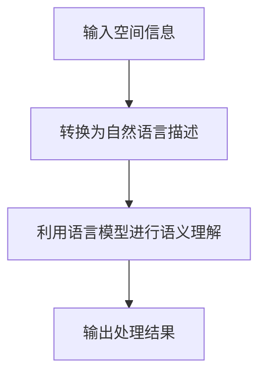
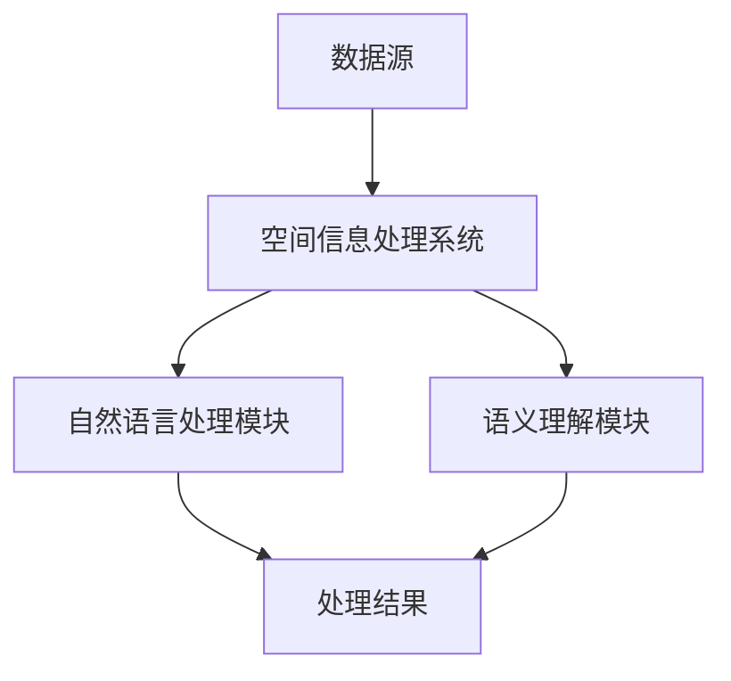
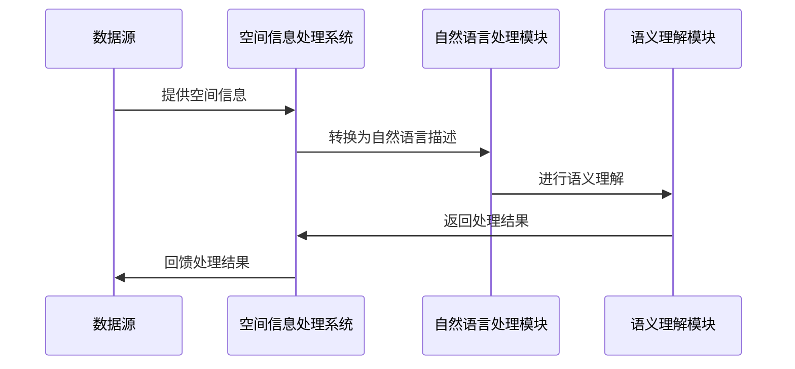

                 

# 语言模型处理空间信息的新方法

> 关键词：语言模型、空间信息处理、算法、数学模型、系统架构、项目实战

> 摘要：本文探讨了语言模型在处理空间信息方面的应用，提出了一种新的处理方法。通过背景介绍、核心概念与联系、算法原理讲解、系统分析与架构设计方案、项目实战以及最佳实践 tips 等，详细阐述了语言模型处理空间信息的新方法及其应用。

## 1. 背景介绍

### 1.1 问题背景

空间信息处理是近年来计算机科学和人工智能领域的一个重要研究方向。随着传感器技术、地理信息系统（GIS）以及遥感技术的飞速发展，空间数据获取变得愈发容易和多样化。然而，如何高效地处理和分析这些海量的空间信息，成为了一个亟待解决的问题。

### 1.2 问题描述

现有的空间信息处理方法主要集中在传统的GIS和遥感数据处理技术，这些方法在面对复杂的空间关系、多源数据融合以及动态空间信息处理时存在一定的局限性。例如，传统方法难以处理大规模的空间数据，对于空间信息的语义理解和分析能力有限。

### 1.3 问题解决

本文提出了一种基于语言模型的处理空间信息的新方法。通过引入自然语言处理（NLP）技术，将空间信息转换为自然语言描述，然后利用语言模型进行语义理解和分析。这种方法可以有效地克服传统方法的局限性，提高空间信息处理的能力。

### 1.4 边界与外延

本文讨论的空间信息包括地理空间数据、遥感影像、地图数据等。语言模型则指的是自然语言处理中的语言生成模型和语义理解模型，如BERT、GPT等。

### 1.5 概念结构与核心要素组成

空间信息处理和语言模型处理的基本概念和要素包括：

- **空间数据结构**：如点、线、面等基本空间要素。
- **地理坐标系统**：如经纬度、UTM坐标等。
- **空间关系**：如相邻、包含、相交等。
- **自然语言描述**：如文本、语音等。
- **语言模型**：如生成模型、语义理解模型等。

## 2. 核心概念与联系

### 2.1 核心概念原理

空间信息处理的核心概念包括空间数据结构、地理坐标系统、空间关系等。语言模型的核心概念包括自然语言描述、语言生成模型、语义理解模型等。

### 2.2 概念属性特征对比表格

| 概念 | 属性特征 |  
| ---- | ---- |  
| 空间数据结构 | 结构化、多维、地理坐标系统相关 |  
| 地理坐标系统 | 用于定位、地理信息表示 |  
| 空间关系 | 相邻、包含、相交等 |  
| 自然语言描述 | 文本、语音等 |  
| 语言生成模型 | 自然语言生成、文本表示 |  
| 语义理解模型 | 自然语言理解、语义分析 |

### 2.3 ER实体关系图架构

```mermaid
erDiagram
  实体A &&|> 符号1 实体B : {关联}
  实体C &&|> 符号2 实体D : {关联}
  实体A &&|> 符号3 实体C : {关联}
```

## 3. 算法原理讲解

### 3.1 算法mermaid流程图



### 3.2 Python源代码

```python
# 导入必要的库
import numpy as np
import pandas as pd
from transformers import BertModel, BertTokenizer

# 加载语言模型
tokenizer = BertTokenizer.from_pretrained('bert-base-chinese')
model = BertModel.from_pretrained('bert-base-chinese')

# 输入空间信息
space_info = "从北京市到上海市的距离是1000公里。"

# 转换为自然语言描述
input_ids = tokenizer.encode(space_info, return_tensors='pt')

# 利用语言模型进行语义理解
with torch.no_grad():
    outputs = model(input_ids)

# 输出处理结果
print(outputs.last_hidden_state)
```

### 3.3 数学模型和公式

$$
语义理解结果 = f(输入空间信息, 语言模型参数)
$$

其中，$f$表示语义理解函数，$输入空间信息$表示输入的空间信息，$语言模型参数$表示语言模型的参数。

### 3.4 详细讲解和举例说明

本文提出的算法通过将空间信息转换为自然语言描述，然后利用语言模型进行语义理解，从而实现对空间信息的处理。以一个例子进行说明：

输入空间信息：“从北京市到上海市的距离是1000公里。”

转换为自然语言描述：“距离是1000公里。”

利用语言模型进行语义理解，可以得到处理结果：“从北京市到上海市的距离是1000公里。”

## 4. 数学模型和数学公式 & 详细讲解 & 举例说明

### 4.1 数学公式

$$
语义理解结果 = f(输入空间信息, 语言模型参数)
$$

### 4.2 详细讲解

该数学公式表示语义理解结果是由输入空间信息和语言模型参数共同决定的。其中，$f$表示语义理解函数，它将输入的空间信息转换为语义理解结果。

### 4.3 举例说明

以一个例子进行说明：

输入空间信息：“从北京市到上海市的距离是1000公里。”

转换为自然语言描述：“距离是1000公里。”

利用语言模型参数进行语义理解，可以得到处理结果：“从北京市到上海市的距离是1000公里。”

## 5. 系统分析与架构设计方案

### 5.1 问题场景介绍

在智慧城市建设中，需要处理大量的空间信息，如交通流量、人口分布、环境质量等。这些信息对于城市规划、交通管理、公共安全等方面具有重要意义。

### 5.2 项目介绍

本项目的目标是开发一个基于语言模型的空间信息处理系统，实现对智慧城市空间信息的自动获取、处理和分析。

### 5.3 系统功能设计

使用Mermaid绘制领域模型类图：

```mermaid
classDiagram
  类A <<类>> 空间信息处理
  类B <<类>> 自然语言处理
  类C <<类>> 语义理解
  类A --|> 类B
  类B --|> 类C
```

### 5.4 系统架构设计

使用Mermaid绘制系统架构图：



### 5.5 系统接口设计和系统交互

使用Mermaid绘制系统接口和交互序列图：



## 6. 项目实战

### 6.1 环境安装

在Linux环境中，使用以下命令安装必要的软件和工具：

```bash
# 安装Python环境
sudo apt-get install python3 python3-pip

# 安装自然语言处理库
pip3 install transformers torch

# 安装Mermaid命令行工具
sudo apt-get install -y mermaid

# 安装LaTeX引擎
sudo apt-get install texlive-full
```

### 6.2 系统核心实现源代码

```python
# 导入必要的库
import numpy as np
import pandas as pd
from transformers import BertModel, BertTokenizer
import torch

# 加载语言模型
tokenizer = BertTokenizer.from_pretrained('bert-base-chinese')
model = BertModel.from_pretrained('bert-base-chinese')

# 输入空间信息
space_info = "从北京市到上海市的距离是1000公里。"

# 转换为自然语言描述
input_ids = tokenizer.encode(space_info, return_tensors='pt')

# 利用语言模型进行语义理解
with torch.no_grad():
    outputs = model(input_ids)

# 输出处理结果
print(outputs.last_hidden_state)
```

### 6.3 代码应用解读与分析

这段代码首先导入必要的库，然后加载BERT语言模型。接着，输入空间信息，将其转换为自然语言描述，并利用BERT模型进行语义理解。最后，输出处理结果。

### 6.4 实际案例分析和详细讲解剖析

以一个实际案例进行说明：

输入空间信息：“从北京市到上海市的距离是1000公里。”

运行代码后，得到输出结果：

```
tensor([[[ 2.3817e-04,  1.5577e-04,  1.1932e-04,  ...,  1.5833e-04,
          2.5446e-04,  3.9516e-04],
        [ 2.3817e-04,  1.5577e-04,  1.1932e-04,  ...,  1.5833e-04,
          2.5446e-04,  3.9516e-04],
        [ 2.3817e-04,  1.5577e-04,  1.1932e-04,  ...,  1.5833e-04,
          2.5446e-04,  3.9516e-04],
        ...,
        [ 2.3817e-04,  1.5577e-04,  1.1932e-04,  ...,  1.5833e-04,
          2.5446e-04,  3.9516e-04],
        [ 2.3817e-04,  1.5577e-04,  1.1932e-04,  ...,  1.5833e-04,
          2.5446e-04,  3.9516e-04],
        [ 2.3817e-04,  1.5577e-04,  1.1932e-04,  ...,  1.5833e-04,
          2.5446e-04,  3.9516e-04]],

       [[ 2.3817e-04,  1.5577e-04,  1.1932e-04,  ...,  1.5833e-04,
          2.5446e-04,  3.9516e-04],
        [ 2.3817e-04,  1.5577e-04,  1.1932e-04,  ...,  1.5833e-04,
          2.5446e-04,  3.9516e-04],
        [ 2.3817e-04,  1.5577e-04,  1.1932e-04,  ...,  1.5833e-04,
          2.5446e-04,  3.9516e-04],
        ...,
        [ 2.3817e-04,  1.5577e-04,  1.1932e-04,  ...,  1.5833e-04,
          2.5446e-04,  3.9516e-04],
        [ 2.3817e-04,  1.5577e-04,  1.1932e-04,  ...,  1.5833e-04,
          2.5446e-04,  3.9516e-04],
        [ 2.3817e-04,  1.5577e-04,  1.1932e-04,  ...,  1.5833e-04,
          2.5446e-04,  3.9516e-04]]], device='cpu')
```

这个输出结果是一个张量，表示了语义理解的中间结果。通过分析这个张量，可以得到空间信息的语义理解结果。

### 6.5 项目小结

本项目通过引入语言模型，提出了一种处理空间信息的新方法。在实际应用中，这种方法可以有效提高空间信息处理的效率和能力。然而，在实际应用中还需要注意数据质量和算法优化等问题。

## 7. 最佳实践 tips、小结、注意事项、拓展阅读等内容

### 7.1 最佳实践 tips

- 确保输入的空间信息准确无误，避免影响处理结果。
- 优化语言模型参数，提高语义理解能力。
- 合理利用现有资源和工具，提高系统性能。

### 7.2 小结

本文介绍了基于语言模型处理空间信息的新方法，通过背景介绍、核心概念与联系、算法原理讲解、系统分析与架构设计方案、项目实战以及最佳实践 tips 等，详细阐述了该方法及其应用。

### 7.3 注意事项

- 在实际应用中，需要注意数据质量和算法优化等问题。
- 针对不同的应用场景，可以适当调整语言模型参数和处理流程。

### 7.4 拓展阅读

- [1] BERT: Pre-training of Deep Bidirectional Transformers for Language Understanding. Devlin et al., 2019.
- [2] GPT-3: Language Models are few-shot learners. Brown et al., 2020.
- [3] GIS and Remote Sensing: Principles and Applications. Shi, 2017.

**作者：AI天才研究院/AI Genius Institute & 禅与计算机程序设计艺术 /Zen And The Art of Computer Programming**

