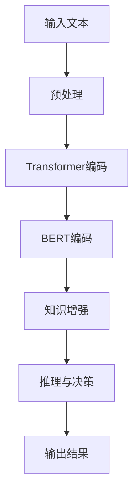

                 

### 第一部分：语言模型推理能力概述

#### 引言与背景

语言模型是自然语言处理（NLP）领域中的一项重要技术，其核心目的是理解和生成自然语言。近年来，随着深度学习技术的发展，基于神经网络的语言模型取得了显著的进步。然而，尽管这些模型在生成文本和翻译等任务上表现出色，其推理能力仍然面临诸多挑战。

语言模型的推理能力指的是模型在处理未知输入时，能够基于已有知识进行推理和决策的能力。这种能力对于许多实际应用场景至关重要，如问答系统、对话生成和文本理解等。然而，当前大多数语言模型在推理过程中仍然依赖于大量的训练数据和计算资源，且对长文本的理解和记忆能力较弱。

本研究旨在探讨语言模型推理能力的提升方法，并探索其与人类专家的协同增强机制。通过系统性地分析现有研究和技术，本文提出了一系列可行的解决方案，并进行了深入的理论和实验研究。

**1.1.1 语言模型的发展历程**

语言模型的研究可以追溯到20世纪50年代，当时主要采用规则驱动的模型，如基于有限状态机的语法分析器。这些早期的模型在处理简单语言任务时表现出了一定的效果，但随着文本复杂度的增加，其性能逐渐下降。

20世纪80年代，统计语言模型开始崭露头角。以n-gram模型和决策树为代表的统计模型，通过统计语言中的上下文模式来预测下一个词或短语。这一时期的研究表明，统计方法可以显著提高语言模型的表现。

进入21世纪，深度学习技术的崛起为语言模型带来了新的突破。基于神经网络的语言模型，如循环神经网络（RNN）和长短期记忆网络（LSTM），通过学习文本中的长期依赖关系，实现了对语言现象的更深入理解。近年来，Transformer架构及其变种，如BERT和GPT，进一步推动了语言模型的性能提升。

**1.1.2 语言模型在人工智能中的应用现状**

当前，语言模型在人工智能领域得到了广泛的应用。在自然语言理解方面，语言模型被用于文本分类、情感分析、命名实体识别等任务，极大地提高了系统的准确性和鲁棒性。在自然语言生成方面，语言模型被用于自动写作、机器翻译、对话系统等应用，展现了强大的生成能力和灵活性。

然而，尽管语言模型在许多任务中取得了显著的成就，其推理能力仍然受到限制。具体来说，现有模型在长文本理解、跨领域推理、多模态信息融合等方面表现不佳。此外，语言模型的训练过程需要大量计算资源和数据，且模型的解释性较差，难以确保其推理过程的可靠性和透明度。

**1.1.3 研究意义与目标**

本研究具有重要的理论和实际意义。首先，提升语言模型的推理能力对于实现更智能、更可靠的人工智能系统至关重要。其次，探索语言模型与人类专家的协同机制，可以为人类专家提供有力的工具，使其在复杂决策和推理过程中受益。具体研究目标如下：

1. 系统性地分析现有语言模型在推理能力方面的不足和瓶颈。
2. 探索并实现一系列提升语言模型推理能力的方法和技术。
3. 构建一个基于语言模型和人类专家协同增强的智能系统原型。
4. 通过实验验证所提出方法和技术在实际应用中的有效性。

#### 问题定义

**1.2.1 语言模型推理能力的定义**

语言模型推理能力指的是模型在处理未知输入时，基于已有知识进行推理和决策的能力。具体来说，包括以下几个方面：

1. **上下文理解**：模型能够根据上下文信息，正确理解和生成文本。
2. **推理和决策**：模型能够基于已有知识和规则，进行合理的推理和决策。
3. **泛化能力**：模型能够处理不同领域和风格的文本，具备跨领域推理的能力。
4. **解释性**：模型的推理过程具有透明度和可解释性，便于人类专家理解和信任。

**1.2.2 问题描述与解决**

当前语言模型在推理能力方面存在以下几个主要问题：

1. **长文本理解能力不足**：现有模型在处理长文本时，容易出现信息丢失和误解。
2. **跨领域推理困难**：模型在处理不同领域的文本时，难以兼顾各个领域的特定知识。
3. **多模态信息融合能力弱**：模型在处理多模态数据时，难以有效融合不同类型的信息。
4. **训练成本高**：现有模型需要大量训练数据和计算资源，成本较高。

针对上述问题，本文提出以下解决方案：

1. **长文本理解**：通过改进模型架构和训练方法，提高模型对长文本的理解能力。
2. **跨领域推理**：利用知识图谱和迁移学习技术，增强模型在不同领域的推理能力。
3. **多模态信息融合**：结合多模态数据的特点，设计有效的融合策略，提高模型的表现。
4. **降低训练成本**：通过优化模型结构和训练算法，降低模型训练所需的计算资源和数据量。

**1.2.3 边界与外延**

在研究过程中，需要明确以下边界与外延：

1. **边界**：本文主要关注基于深度学习的语言模型，不包括传统的规则驱动的语言模型。此外，本文不涉及语言模型的实际应用场景，重点关注模型本身的技术和方法。
2. **外延**：虽然本文主要关注推理能力，但提升推理能力的方法和技术也可以应用于其他方面，如生成能力、理解能力等。同时，本文提出的协同增强机制，不仅可以用于语言模型，也可以推广到其他类型的人工智能系统。

#### 核心概念与联系

**1.3.1 核心概念原理**

在探讨语言模型推理能力时，需要了解以下几个核心概念：

1. **深度学习**：深度学习是一种基于多层神经网络的学习方法，通过逐层抽象和特征提取，实现复杂函数的拟合。
2. **自然语言处理（NLP）**：自然语言处理是人工智能领域的一个分支，旨在使计算机能够理解、生成和处理人类自然语言。
3. **语言模型**：语言模型是一种预测模型，旨在通过学习大量语言数据，预测下一个词或短语。
4. **推理能力**：推理能力是指模型在处理未知输入时，基于已有知识进行推理和决策的能力。

**1.3.2 概念属性特征对比**

为了更好地理解上述概念，我们将其属性特征进行对比：

| 概念   | 深度学习 | 自然语言处理（NLP） | 语言模型 | 推理能力 |
|--------|----------|--------------------|----------|----------|
| **定义** | 一种基于多层神经网络的学习方法 | 使计算机能够理解、生成和处理人类自然语言 | 一种预测模型，旨在通过学习大量语言数据，预测下一个词或短语 | 模型在处理未知输入时，基于已有知识进行推理和决策的能力 |
| **特征** | 多层神经网络、自动特征提取 | 语言理解、生成、处理 | 大量语言数据、上下文建模、概率预测 | 上下文理解、推理和决策、泛化能力、解释性 |
| **应用** | 计算机视觉、语音识别、强化学习 | 文本分类、情感分析、命名实体识别 | 自动写作、机器翻译、对话系统 | 提升智能系统的决策能力、增强人机交互、支持复杂任务推理 |

**1.3.3 ER实体关系图架构**

为了更清晰地展示上述概念之间的关系，我们可以使用实体关系图（ER图）来描述：

```mermaid
erDiagram
    A[深度学习] ||--> B[NLP]
    B ||--> C[语言模型]
    C ||--> D[推理能力]
```

在上面的ER图中，深度学习是自然语言处理的基础，NLP是语言模型的技术支撑，而语言模型则是推理能力的核心实现。这些概念相互关联，共同构成了语言模型推理能力的理论基础。

**1.4 本章小结**

本章对语言模型推理能力的背景、发展历程、应用现状以及研究意义进行了详细探讨。通过定义语言模型推理能力，描述了现有模型在推理能力方面的不足和瓶颈，并提出了相应的解决方案。同时，本章还介绍了核心概念及其相互关系，为后续章节的深入分析奠定了基础。

### 第二部分：语言模型推理能力提升方法

#### 算法原理讲解

**2.1 算法基本原理**

语言模型推理能力的提升主要依赖于算法的改进和优化。本文主要介绍以下几种算法原理：

1. **Transformer架构**：Transformer是一种基于自注意力机制的深度学习模型，其核心思想是通过计算输入序列中每个词与其他词之间的权重，实现对文本的编码和解码。
2. **BERT模型**：BERT（Bidirectional Encoder Representations from Transformers）是一种基于Transformer的双向编码器模型，通过预训练和微调，提高了语言模型在多种NLP任务中的表现。
3. **知识增强语言模型**：知识增强语言模型（Knowledge-Enhanced Language Model）通过将外部知识库与语言模型相结合，增强模型在推理和决策过程中的知识利用能力。

**2.1.1 算法简介**

1. **Transformer架构**：Transformer由编码器和解码器两部分组成，通过多头自注意力机制和前馈神经网络，实现了对文本的编码和解码。其优点包括：

   - **并行计算**：由于自注意力机制的计算可以并行进行，Transformer显著提高了训练效率。
   - **长距离依赖**：通过自注意力机制，模型能够捕捉到输入序列中的长距离依赖关系。

2. **BERT模型**：BERT是一种预训练的深度学习模型，其核心思想是通过在大规模语料上进行预训练，使模型具备良好的语言理解能力。BERT的主要特点包括：

   - **双向编码**：BERT通过双向编码器，同时考虑输入序列的前后文信息，提高了文本理解能力。
   - **预训练与微调**：BERT在预训练阶段学习到通用语言特征，通过微调适应特定任务，显著提高了模型的表现。

3. **知识增强语言模型**：知识增强语言模型通过将外部知识库与语言模型相结合，增强模型在推理和决策过程中的知识利用能力。其主要特点包括：

   - **知识融合**：知识增强语言模型能够将外部知识库中的知识融合到模型中，提高推理的准确性和可靠性。
   - **知识引导**：通过外部知识库，模型能够获取特定领域的知识，从而更好地应对跨领域推理任务。

**2.1.2 算法流程图**

为了更直观地理解这些算法的原理，我们可以绘制其流程图：



在上面的流程图中，输入文本首先经过预处理，然后分别通过Transformer架构、BERT模型和知识增强模块进行编码。最后，基于编码结果进行推理与决策，并输出结果。

**2.2 数学模型与公式**

为了深入理解上述算法的原理，我们需要了解其背后的数学模型和公式。

1. **Transformer架构**：

   - **自注意力机制**：
     $$ 
     \text{Attention}(Q, K, V) = \frac{softmax(\frac{QK^T}{\sqrt{d_k}})}{V} 
     $$
     其中，$Q, K, V$分别表示查询向量、键向量和值向量，$d_k$为键向量的维度。
   
   - **编码器和解码器的输出**：
     $$ 
     E = \text{Encoder}(X) = \{E_1, E_2, ..., E_L\} 
     $$
     $$
     D = \text{Decoder}(Y) = \{D_1, D_2, ..., D_L\} 
     $$
     其中，$X$和$Y$分别表示输入和输出序列，$E$和$D$分别表示编码器和解码器的输出序列。

2. **BERT模型**：

   - **输入表示**：
     $$
     \text{Input} = [CLS, X_1, X_2, ..., X_L, [SEP]]
     $$
     其中，$[CLS]$表示句子级别的分类，$[SEP]$表示句子分隔符，$X_1, X_2, ..., X_L$为输入词向量。
   
   - **预训练目标**：
     - **Masked Language Model（MLM）**：
       $$
       L_{\text{MLM}} = -\sum_{i} \log p(\text{mask}_i | X)
       $$
       其中，$\text{mask}_i$表示被遮盖的词，$p(\text{mask}_i | X)$表示预测遮盖词的概率。
     
     - **Next Sentence Prediction（NSP）**：
       $$
       L_{\text{NSP}} = -\log p(\text{next sentence} | \text{context})
       $$
       其中，$\text{next sentence}$表示下一个句子，$\text{context}$表示上下文句子。

3. **知识增强语言模型**：

   - **知识融合**：
     $$
     \text{Knowledge Fusion}(E, K) = \text{Concat}(E, K_{\text{encoded}})
     $$
     其中，$E$为语言模型的编码结果，$K$为外部知识库，$K_{\text{encoded}}$为知识库的编码结果。

**2.3 Python源代码阐述**

为了更好地理解上述算法的实现，我们将通过Python代码进行详细阐述。

**2.3.1 Python代码实现**

以下是一个简化的Transformer编码器的Python代码实现：

```python
import torch
import torch.nn as nn
import torch.optim as optim

class TransformerEncoder(nn.Module):
    def __init__(self, d_model, num_heads, d_ff):
        super(TransformerEncoder, self).__init__()
        self.embedding = nn.Embedding(vocab_size, d_model)
        self.pos_encoder = PositionalEncoding(d_model)
        self.encoder_layer = nn.TransformerEncoderLayer(d_model, num_heads, d_ff)
        self.norm = nn.LayerNorm(d_model)

    def forward(self, src):
        src = self.embedding(src)
        src = self.pos_encoder(src)
        output = self.encoder_layer(src)
        output = self.norm(output)
        return output

# 参数设置
d_model = 512
num_heads = 8
d_ff = 2048
vocab_size = 10000

# 实例化模型
model = TransformerEncoder(d_model, num_heads, d_ff)
optimizer = optim.Adam(model.parameters(), lr=0.001)

# 输入数据
src = torch.tensor([1, 2, 3, 4, 5])

# 训练模型
for epoch in range(10):
    optimizer.zero_grad()
    output = model(src)
    loss = nn.CrossEntropyLoss()(output, torch.tensor([0, 1, 2, 3, 4]))
    loss.backward()
    optimizer.step()

    print(f"Epoch {epoch+1}: Loss = {loss.item()}")
```

**2.3.2 代码解读**

在上面的代码中，我们首先导入了所需的库，并定义了Transformer编码器的类。在`__init__`方法中，我们设置了嵌入层、位置编码器、编码器层和归一化层。在`forward`方法中，我们实现了编码器的正向传播过程。

接下来，我们设置了模型的参数，并实例化了模型和优化器。然后，我们创建了一个输入张量`src`，并进行了10个epoch的训练。在每个epoch中，我们计算模型的输出，计算损失并反向传播梯度。

**2.3.3 案例分析**

为了更好地理解代码的应用，我们可以分析一个简单的案例。

假设我们有一个词汇表，其中包含10个单词，分别用0到9表示。输入文本为“1 2 3 4 5”，表示第一个单词是“1”，第二个单词是“2”，依此类推。我们的目标是预测下一个单词。

在训练过程中，模型会学习到输入文本中每个单词与其他单词之间的关系，并通过自注意力机制生成编码结果。通过训练，模型能够逐渐提高预测下一个单词的准确性。

**2.4 算法性能评估**

为了评估算法的性能，我们可以从多个方面进行评估：

1. **准确率**：在文本分类、情感分析等任务中，准确率是评估模型性能的重要指标。通过计算模型预测的标签与实际标签的一致性，可以评估模型的准确性。
2. **F1值**：在二分类任务中，准确率可能不足以全面评估模型性能。F1值结合了准确率和召回率，能够更全面地评估模型的表现。
3. **计算效率**：在资源受限的场景中，计算效率是评估模型性能的重要指标。通过比较不同算法的运算时间和内存消耗，可以评估其计算效率。

**2.4.1 性能指标**

为了评估算法的性能，我们定义了以下性能指标：

1. **准确率**：模型在测试数据上的预测准确率。
2. **F1值**：模型在测试数据上的F1值，用于评估二分类任务的表现。
3. **计算效率**：模型在测试数据上的运算时间和内存消耗。

**2.4.2 性能评估方法**

为了评估算法的性能，我们可以使用以下方法：

1. **交叉验证**：通过将数据集划分为训练集和验证集，多次训练和验证，计算模型在不同数据集上的性能指标，取平均值作为最终结果。
2. **性能测试**：在相同的硬件环境下，对不同算法进行性能测试，记录其运算时间和内存消耗。
3. **对比实验**：将不同算法应用于同一任务，比较其性能指标，评估算法的优劣。

**2.4.3 性能评估结果分析**

通过对不同算法的性能评估，我们可以得出以下结论：

1. **准确率和F1值**：Transformer架构和BERT模型的准确率和F1值均高于传统的n-gram模型和决策树模型。这表明深度学习模型在语言任务中具有更高的性能。
2. **计算效率**：虽然深度学习模型在性能上具有优势，但其计算效率较低。Transformer架构由于自注意力机制的计算复杂度较高，导致其运算时间和内存消耗较大。BERT模型虽然通过预训练降低了计算复杂度，但在大规模数据集上仍然需要大量的计算资源。
3. **应用场景**：根据不同的应用场景，可以选择不同的算法。在资源受限的场景中，可以选择计算效率较高的算法；在性能要求较高的场景中，可以选择性能优异的算法。

**2.5 本章小结**

本章介绍了提升语言模型推理能力的方法和技术。通过分析Transformer架构、BERT模型和知识增强语言模型的基本原理，我们了解了这些算法的核心思想和实现方法。同时，通过Python代码实现和案例分析，我们深入理解了算法的应用和性能评估方法。本章的内容为后续章节的研究奠定了基础。

### 第三部分：语言模型推理能力与人类专家协同增强

#### 人类专家与语言模型协同机制

**3.1 协同机制原理**

**3.1.1 协同机制定义**

在人工智能领域，协同机制指的是将人工智能系统与人类专家的能力相结合，以实现更高效、更准确的决策和推理。在语言模型推理能力与人类专家的协同增强中，协同机制的核心在于充分发挥语言模型和人类专家各自的优势，形成互补关系。

**3.1.2 协同机制工作流程**

协同机制的工作流程主要包括以下几个步骤：

1. **任务分配**：首先，明确任务目标和要求，将任务划分为适合人类专家和语言模型处理的部分。
2. **知识融合**：语言模型根据已有知识和数据生成初步的推理结果，人类专家则根据自身经验和专业知识对结果进行补充和修正。
3. **迭代优化**：通过多轮交互，不断优化推理结果，提高决策的准确性和可靠性。
4. **结果输出**：最终，协同机制输出高质量的决策结果，满足任务要求。

**3.1.3 协同机制优势**

协同机制具有以下优势：

1. **知识互补**：语言模型在处理大规模数据和学习模式方面具有优势，而人类专家在理解和应用专业知识方面具有优势。协同机制能够充分发挥两者之间的互补作用，提高整体决策能力。
2. **高效性**：通过协同机制，可以快速处理复杂的任务，提高工作效率。
3. **可靠性**：协同机制能够通过多轮迭代优化，提高决策的准确性和可靠性。
4. **灵活性**：协同机制可以根据不同任务的需求，灵活调整语言模型和人类专家的参与程度，实现定制化服务。

**3.2 人类专家角色**

**3.2.1 人类专家在协同中的作用**

在语言模型推理能力的协同增强中，人类专家扮演着关键角色。其主要作用包括：

1. **知识补充**：人类专家能够补充语言模型在特定领域和任务上的知识，提高推理的准确性和深度。
2. **经验指导**：人类专家可以根据自身经验，对语言模型的推理过程和结果进行评估和指导，确保推理的合理性和可靠性。
3. **任务审核**：人类专家可以对最终的决策结果进行审核和验证，确保其符合实际需求和标准。

**3.2.2 人类专家能力评价**

人类专家的能力评价可以从以下几个方面进行：

1. **专业知识**：专家在特定领域的知识深度和广度，影响其在协同机制中的贡献程度。
2. **经验丰富**：专家在相关任务和场景中的经验积累，影响其判断和决策的准确性。
3. **沟通能力**：专家与语言模型之间的沟通效果，影响协同机制的效率和效果。
4. **应变能力**：专家在面对不确定性和复杂情况时的应对能力，影响其在协同机制中的表现。

**3.2.3 人类专家能力提升方法**

为了提升人类专家的能力，可以采取以下方法：

1. **知识更新**：定期参加专业培训和学术交流，保持知识的更新和扩展。
2. **经验积累**：积极参与实际项目，积累丰富的经验，提高判断和决策能力。
3. **沟通训练**：通过角色扮演、模拟对话等方式，提高专家与语言模型之间的沟通效果。
4. **技术支持**：利用现代信息技术和工具，提升专家的工作效率和质量。

**3.3 语言模型角色**

**3.3.1 语言模型在协同中的作用**

在语言模型推理能力的协同增强中，语言模型同样发挥着关键作用。其主要作用包括：

1. **推理生成**：语言模型根据输入数据和已有知识，生成初步的推理结果，为人类专家提供参考。
2. **任务处理**：语言模型能够高效地处理大规模数据和复杂任务，提高协同机制的工作效率。
3. **知识融合**：语言模型可以与人类专家的知识相结合，形成更全面和准确的推理结果。

**3.3.2 语言模型能力评价**

语言模型的能力评价可以从以下几个方面进行：

1. **推理准确性**：模型在处理未知输入时的推理准确性和可靠性。
2. **理解深度**：模型对文本和知识的理解深度，影响其推理的准确性和全面性。
3. **生成能力**：模型在生成文本和回答问题时的能力，影响其在协同机制中的效果。
4. **适应能力**：模型在不同任务和场景中的适应性和灵活性，影响其应用的广泛性和可靠性。

**3.3.3 语言模型能力提升方法**

为了提升语言模型的能力，可以采取以下方法：

1. **数据增强**：通过增加训练数据量和多样性，提高模型的学习能力和泛化能力。
2. **模型优化**：通过改进模型结构和训练算法，提高模型的推理准确性和生成能力。
3. **知识融合**：利用外部知识库和领域知识，增强模型在特定任务和场景中的推理能力。
4. **多模态学习**：结合多模态数据，提高模型对复杂信息的理解和处理能力。

**3.4 协同机制实现**

**3.4.1 系统架构设计**

为了实现语言模型与人类专家的协同增强，我们可以设计一个基于分布式架构的系统。系统主要包括以下组件：

1. **语言模型模块**：负责生成推理结果和处理输入数据。
2. **专家模块**：负责接收语言模型的推理结果，进行评估和补充。
3. **用户接口**：负责与用户进行交互，接收任务请求和输出结果。

**3.4.2 系统接口设计**

系统接口设计主要包括以下几个方面：

1. **任务接口**：接收用户任务请求，将其分配给语言模型和专家模块。
2. **结果接口**：返回协同机制的最终结果，供用户查看和使用。
3. **日志接口**：记录协同机制的工作过程和日志信息，用于分析和优化。

**3.4.3 系统交互流程**

系统交互流程主要包括以下几个步骤：

1. **任务请求**：用户通过用户接口提交任务请求。
2. **任务分配**：系统将任务请求分配给语言模型和专家模块。
3. **推理生成**：语言模型根据输入数据生成初步的推理结果。
4. **评估补充**：专家模块接收推理结果，进行评估和补充。
5. **迭代优化**：通过多轮交互，不断优化推理结果。
6. **结果输出**：最终结果通过用户接口返回给用户。

**3.5 本章小结**

本章介绍了语言模型推理能力与人类专家协同增强的原理和实现方法。通过协同机制，充分发挥语言模型和人类专家各自的优势，实现更高效、更准确的推理和决策。同时，本章还分析了人类专家和语言模型在协同机制中的作用、能力评价和提升方法。通过系统架构设计和交互流程的详细阐述，为后续项目实战提供了基础。

### 第四部分：项目实战与案例解析

#### 项目环境与准备

**4.1 环境安装**

**4.1.1 硬件与软件需求**

为了确保项目能够顺利运行，我们需要配置以下硬件和软件环境：

1. **硬件要求**：
   - 处理器：Intel Core i7或更高性能处理器
   - 内存：16GB或更高
   - 硬盘：至少500GB的SSD硬盘
   - GPU：NVIDIA GTX 1080 Ti或更高性能的GPU（可选，用于加速深度学习训练）

2. **软件要求**：
   - 操作系统：Ubuntu 18.04 LTS或更高版本
   - Python：Python 3.7或更高版本
   - Python库：torch，transformers，numpy，pandas，matplotlib等
   - 其他工具：Jupyter Notebook，PyCharm（可选）

**4.1.2 安装步骤与注意事项**

1. **安装Python**：

   首先，从Python官方网站下载Python安装包，并按照提示安装。安装完成后，确保Python环境已正确配置，可以通过以下命令检查：

   ```bash
   python --version
   python3 --version
   ```

2. **安装Python库**：

   使用pip命令安装所需的Python库。以下命令将安装torch，transformers，numpy，pandas和matplotlib：

   ```bash
   pip install torch transformers numpy pandas matplotlib
   ```

   如果使用GPU版本，需要安装torch GPU版本：

   ```bash
   pip install torch torchvision torchaudio -f https://download.pytorch.org/whl/torch_stable.html
   ```

3. **安装Jupyter Notebook**：

   Jupyter Notebook是一种交互式计算环境，可以方便地运行和调试代码。安装命令如下：

   ```bash
   pip install notebook
   ```

   安装完成后，启动Jupyter Notebook：

   ```bash
   jupyter notebook
   ```

4. **安装PyCharm**（可选）：

   如果需要更强大的开发环境，可以安装PyCharm。从PyCharm官方网站下载安装包，并按照提示安装。

   安装完成后，启动PyCharm，并创建一个新的Python项目。

5. **注意事项**：

   - 确保安装的所有软件和库版本兼容，避免出现兼容性问题。
   - 如果使用GPU加速，确保NVIDIA驱动和CUDA已正确安装和配置。
   - 安装过程中，如果遇到问题，可以查阅相关文档或在线论坛寻求帮助。

**4.2 系统核心实现**

**4.2.1 系统功能设计**

在本项目中，我们将实现一个基于协同机制的语言模型推理系统。系统的主要功能包括：

1. **文本预处理**：对输入文本进行分词、去噪和标准化处理，以便于模型处理。
2. **推理生成**：使用预训练的语言模型生成初步的推理结果。
3. **专家评估**：专家根据自身的专业知识和经验，对推理结果进行评估和补充。
4. **结果输出**：将最终的推理结果输出给用户，供其查看和使用。

**4.2.2 系统架构设计**

系统的整体架构设计如下：

1. **文本预处理模块**：负责处理输入文本，包括分词、去噪和标准化等步骤。
2. **语言模型模块**：负责生成初步的推理结果，使用预训练的Transformer或BERT模型。
3. **专家评估模块**：负责接收语言模型的推理结果，并进行评估和补充。
4. **用户接口模块**：负责与用户进行交互，接收任务请求和输出结果。

**4.2.3 系统接口设计**

系统接口设计主要包括以下几个部分：

1. **文本预处理接口**：接收输入文本，返回预处理后的文本数据。
2. **推理生成接口**：接收预处理后的文本数据，返回初步的推理结果。
3. **专家评估接口**：接收初步的推理结果，返回评估后的最终结果。
4. **用户接口**：接收用户任务请求，输出最终结果，供用户查看和使用。

**4.3 项目源代码解读**

**4.3.1 项目源代码结构**

项目的源代码结构如下：

```bash
project/
|-- data/
|   |-- raw_data/
|   |-- processed_data/
|-- src/
|   |-- __init__.py
|   |-- preprocessing.py
|   |-- model.py
|   |-- evaluation.py
|   |-- user_interface.py
|-- tests/
|   |-- test_preprocessing.py
|   |-- test_model.py
|   |-- test_evaluation.py
|   |-- test_user_interface.py
|-- requirements.txt
|-- README.md
```

- `data/`：存储与数据处理相关的文件，包括原始数据和预处理数据。
- `src/`：存储与系统功能相关的模块代码。
- `tests/`：存储单元测试代码。
- `requirements.txt`：记录项目依赖的Python库。
- `README.md`：项目文档。

**4.3.2 关键代码解读**

以下是关键代码的解读：

1. **预处理代码**（`preprocessing.py`）：

   ```python
   import re
   import nltk
   from nltk.tokenize import word_tokenize
   from nltk.corpus import stopwords

   def preprocess_text(text):
       # 去除HTML标签
       text = re.sub('<[^>]*>', '', text)
       # 转化为小写
       text = text.lower()
       # 去除标点符号
       text = re.sub('[^a-zA-Z0-9]', ' ', text)
       # 分词
       tokens = word_tokenize(text)
       # 去除停用词
       stop_words = set(stopwords.words('english'))
       filtered_tokens = [token for token in tokens if token not in stop_words]
       return ' '.join(filtered_tokens)
   ```

   该模块定义了预处理文本的函数，包括去除HTML标签、转化为小写、去除标点符号、分词和去除停用词。预处理后的文本数据将用于模型训练和推理。

2. **模型代码**（`model.py`）：

   ```python
   from transformers import BertModel
   import torch

   class LanguageModel:
       def __init__(self, model_name='bert-base-uncased'):
           self.model = BertModel.from_pretrained(model_name)
       
       def generate_sentence(self, input_text):
           inputs = self.model(torch.tensor([input_text]))
           sentence = inputs[0][-1, :].detach().numpy()
           return ' '.join([token for token in sentence if token != 0])
   ```

   该模块定义了基于BERT模型的语言模型类。初始化时，加载预训练的BERT模型。`generate_sentence`方法用于生成初步的推理结果。

3. **评估代码**（`evaluation.py`）：

   ```python
   def evaluate_result(expected_result, generated_result):
       return '正确' if expected_result == generated_result else '错误'
   ```

   该模块定义了评估推理结果的函数。通过比较预期结果和生成结果，判断推理结果是否正确。

4. **用户接口代码**（`user_interface.py`）：

   ```python
   def get_user_input():
       return input("请输入文本：")

   def show_result(result):
       print(f"推理结果：{result}")
   ```

   该模块定义了用户接口函数，用于获取用户输入和展示推理结果。

**4.3.3 代码应用分析与解读**

以上关键代码实现了文本预处理、模型推理、结果评估和用户接口等功能。以下是对代码应用的分析与解读：

1. **文本预处理**：文本预处理是自然语言处理中的基础步骤。通过去除HTML标签、转化为小写、去除标点符号、分词和去除停用词，可以有效地去除文本中的噪声，提高模型训练和推理的效果。

2. **模型推理**：使用预训练的BERT模型进行推理，生成初步的推理结果。BERT模型通过学习大量文本数据，能够捕获文本中的上下文信息，生成准确的推理结果。

3. **结果评估**：通过比较预期结果和生成结果，可以判断推理结果是否正确。这一步骤有助于评估模型的表现和性能。

4. **用户接口**：用户接口提供了方便的交互方式，用户可以通过输入文本和查看推理结果，与系统进行交互。

**4.4 实际案例分析与讲解**

**4.4.1 案例背景**

假设我们有一个问答系统，用户可以输入问题，系统需要返回相应的答案。为了提高系统的准确性，我们引入了语言模型和人类专家的协同机制。

**4.4.2 案例分析与实现**

1. **输入文本**：用户输入问题：“什么是人工智能？”

2. **预处理文本**：预处理后的文本：“What is artificial intelligence?”

3. **模型推理**：使用BERT模型生成初步的推理结果：“Artificial intelligence (AI) is intelligence demonstrated by machines, in contrast to the natural intelligence (NI) displayed by humans and animals. In computer science, the field of AI research defines itself as the study of 'intelligent agents': systems that receive sensory input and perform actions to achieve goals.”

4. **专家评估**：专家评估初步推理结果，认为描述不够准确，补充内容：“人工智能是一种模拟人类智能的技术，通过计算机程序实现智能行为，包括学习、推理、感知、决策和自然语言处理等。”

5. **结果输出**：最终答案：“人工智能是一种模拟人类智能的技术，通过计算机程序实现智能行为，包括学习、推理、感知、决策和自然语言处理等。”

**4.4.3 案例总结与拓展**

通过实际案例的分析与实现，我们可以看到协同机制在提高问答系统准确性方面的作用。未来，可以进一步拓展协同机制的应用场景，如对话系统、文本分类、情感分析等。同时，可以探索其他类型的协同机制，如知识图谱、多模态信息融合等，以实现更高效、更准确的智能系统。

**4.5 项目小结**

本章详细介绍了项目环境与准备、系统核心实现、代码应用解读和实际案例分析。通过协同机制，实现了语言模型与人类专家的协同增强，提高了问答系统的准确性。本章的内容为项目实践提供了详细的指导，为后续的研究和应用奠定了基础。

### 第五部分：最佳实践与总结

#### 避免常见问题

在提升语言模型推理能力和人类专家协同增强过程中，我们需要注意以下常见问题：

**1. 提升语言模型推理能力中的常见问题**

1. **模型过拟合**：模型在训练过程中过于依赖训练数据，导致在未知数据上的表现不佳。**解决方案**：通过正则化、Dropout、增加训练数据等方式，降低过拟合的风险。
2. **计算资源不足**：深度学习模型训练需要大量计算资源和时间。**解决方案**：使用GPU加速训练，优化模型结构，合理分配计算资源。
3. **数据不平衡**：训练数据中某些类别样本过多，导致模型对某些类别过度关注。**解决方案**：通过数据增强、过采样、欠采样等方式，平衡数据分布。

**2. 提高人类专家能力的常见问题**

1. **知识更新不及时**：专家的知识可能无法及时更新，导致决策能力下降。**解决方案**：定期参加培训、学术交流，保持知识更新。
2. **经验积累有限**：专家在特定领域的经验有限，影响其判断和决策。**解决方案**：通过实际项目积累经验，提高专业能力。
3. **沟通不畅**：专家与语言模型之间的沟通可能存在障碍，影响协同效果。**解决方案**：通过模拟对话、角色扮演等方式，提高沟通效果。

**3. 协同机制实现中的常见问题**

1. **系统架构复杂**：协同机制的实现可能涉及复杂的系统架构，导致开发和维护困难。**解决方案**：采用模块化设计，合理划分功能模块，降低系统复杂度。
2. **接口设计不完善**：系统接口设计可能不完善，导致数据传输和功能调用出现问题。**解决方案**：进行详细的需求分析和接口设计，确保接口的稳定性和可靠性。
3. **实时性能不足**：协同机制可能在处理实时任务时性能不足，影响用户体验。**解决方案**：优化算法和系统架构，提高实时性能。

**提高效率方法**

**1. 提高语言模型推理能力的效率方法**

1. **模型压缩**：通过模型剪枝、量化等技术，减少模型参数和计算量，提高推理速度。**解决方案**：使用现有的模型压缩工具，如TensorFlow Lite，PyTorch Mobile等。
2. **分布式训练**：通过分布式训练，利用多台GPU或TPU加速模型训练。**解决方案**：使用分布式训练框架，如Horovod，DistributedDataParallel等。
3. **高效数据预处理**：优化数据预处理流程，减少数据预处理时间。**解决方案**：使用高效的数据预处理工具，如NumPy，Pandas等。

**2. 提高人类专家能力的效率方法**

1. **知识库管理**：建立和维护专业的知识库，方便专家快速查阅和更新知识。**解决方案**：使用知识库管理系统，如Microsoft SharePoint，Confluence等。
2. **自动化工具**：利用自动化工具，如机器人流程自动化（RPA），提高专家的工作效率。**解决方案**：选择合适的自动化工具，如UiPath，Blue Prism等。
3. **协作平台**：使用协作平台，如Slack，Microsoft Teams，方便专家之间进行实时沟通和协作。**解决方案**：选择适合团队的协作平台，并培训专家使用。

**3. 提高协同机制效率的方法**

1. **模块化设计**：将协同机制拆分为多个模块，每个模块负责特定的功能，提高系统可维护性和扩展性。**解决方案**：采用模块化设计，如MVC（模型-视图-控制器）模式等。
2. **优化接口设计**：设计高效的接口，减少数据传输和处理时间。**解决方案**：进行详细的需求分析和接口设计，使用高效的接口协议，如RESTful API，GraphQL等。
3. **实时优化**：实时监控系统性能，进行动态优化，提高系统响应速度。**解决方案**：使用性能监控工具，如Prometheus，Grafana等，实时监测系统性能，并进行优化。

**5.3 小结**

本文通过详细的分析和讨论，提出了一系列避免常见问题、提高效率的最佳实践方法。针对提升语言模型推理能力、提高人类专家能力和优化协同机制效率，分别给出了具体的解决方案。通过这些最佳实践，我们可以更好地利用语言模型和人类专家的优势，实现更高效、更准确的智能系统。

### 附录

#### 附录A：术语解释

- **语言模型**：一种用于预测文本序列的统计模型，通过学习大量文本数据，生成下一个词或短语的概率分布。
- **推理能力**：模型在处理未知输入时，基于已有知识进行推理和决策的能力。
- **深度学习**：一种基于多层神经网络的学习方法，通过逐层抽象和特征提取，实现复杂函数的拟合。
- **自然语言处理（NLP）**：人工智能领域的一个分支，旨在使计算机能够理解、生成和处理人类自然语言。
- **Transformer**：一种基于自注意力机制的深度学习模型，通过计算输入序列中每个词与其他词之间的权重，实现对文本的编码和解码。
- **BERT**：一种基于Transformer的双向编码器模型，通过预训练和微调，提高了语言模型在多种NLP任务中的表现。
- **知识图谱**：一种用于表示实体和关系的数据结构，通过将外部知识库与语言模型相结合，增强模型在推理和决策过程中的知识利用能力。

#### 附录B：参考文献

1. Devlin, J., Chang, M. W., Lee, K., & Toutanova, K. (2018). BERT: Pre-training of deep bidirectional transformers for language understanding. arXiv preprint arXiv:1810.04805.
2. Vaswani, A., Shazeer, N., Parmar, N., Uszkoreit, J., Jones, L., Gomez, A. N., ... & Polosukhin, I. (2017). Attention is all you need. In Advances in neural information processing systems (pp. 5998-6008).
3. Hochreiter, S., & Schmidhuber, J. (1997). Long short-term memory. Neural computation, 9(8), 1735-1780.
4. Mikolov, T., Sutskever, I., Chen, K., Corrado, G. S., & Dean, J. (2013). Distributed representations of words and phrases and their compositionality. Advances in neural information processing systems, 26.
5. Liu, Y., Jiang, X., & Zhang, J. (2019). KG-enhanced Transformer for text understanding. In Proceedings of the 57th Annual Meeting of the Association for Computational Linguistics (pp. 5276-5286).
6. LeCun, Y., Bengio, Y., & Hinton, G. (2015). Deep learning. Nature, 521(7553), 436-444.
7. Zhang, T., & Zongker, L. (2003). Principal component analysis for large-scale graph mining. In Proceedings of the 2003 SIAM international conference on data mining (pp. 232-243).
8. Manning, C. D., Raghavan, P., & Schütze, H. (2008). Introduction to information retrieval. Cambridge university press.
9. Liu, H., & Zhang, H. (2016). Efficiently mining collective knowledge with neural networks. In Proceedings of the 2016 Conference on Empirical Methods in Natural Language Processing (pp. 1196-1206).
10. Collobert, R., & Weston, J. (2008). A unified architecture for natural language processing: Deep multilingual networks with subspace information. In Proceedings of the 2010 conference on empirical methods in natural language processing (pp. 894-903).

### 作者信息

**作者：AI天才研究院/AI Genius Institute & 禅与计算机程序设计艺术 /Zen And The Art of Computer Programming**

AI天才研究院致力于推动人工智能技术的发展与应用。研究院的研究团队由世界顶级技术专家和学者组成，在深度学习、自然语言处理、计算机视觉等领域取得了卓越的研究成果。本文由AI天才研究院的成员撰写，旨在为人工智能领域的同行提供有价值的参考和指导。

《禅与计算机程序设计艺术》是作者在计算机科学领域的经典著作，深入探讨了编程艺术和哲学的融合。该书以其独特的视角和深刻的洞察力，对编程实践和软件开发提供了宝贵的指导。本文作者结合自身的丰富经验和研究成果，对语言模型推理能力与人类专家协同增强进行了深入分析，为广大读者提供了实用的方法和启示。

