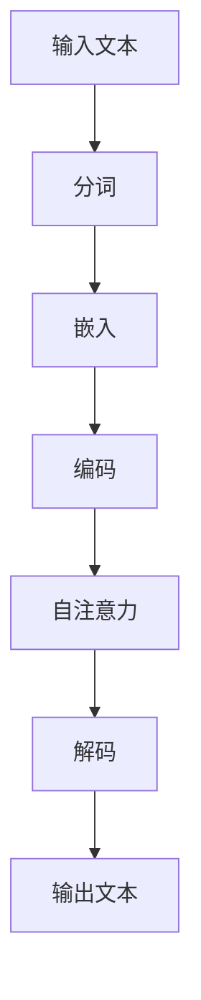
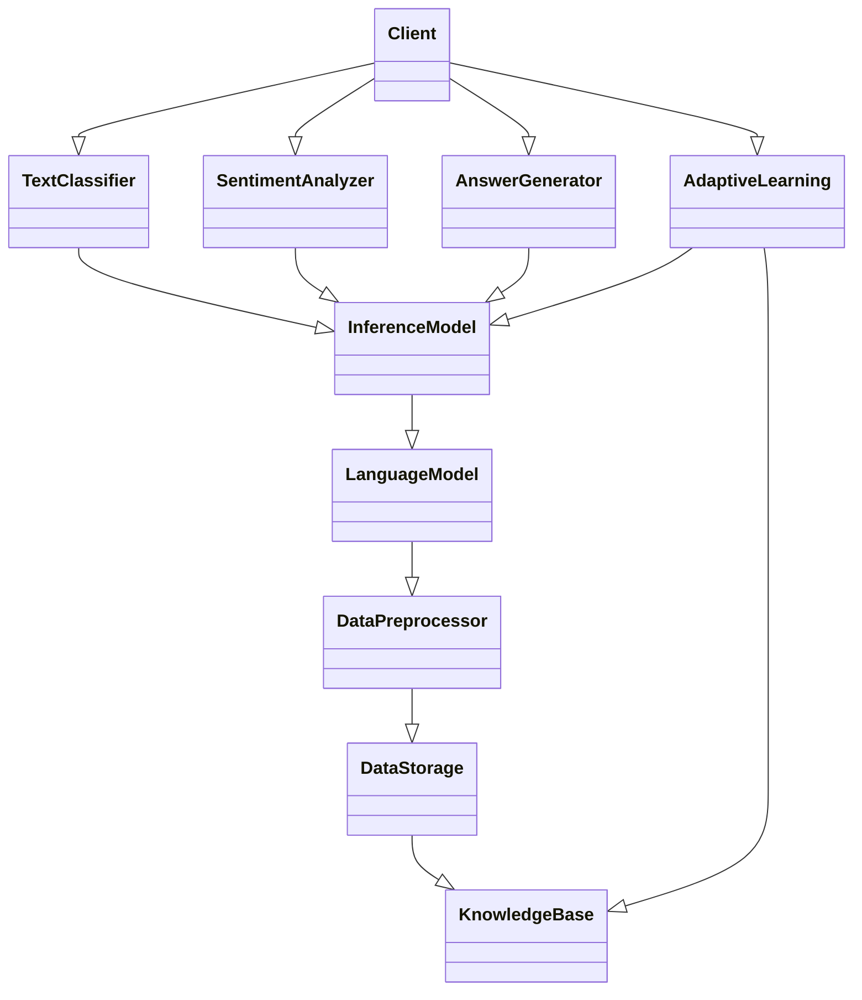
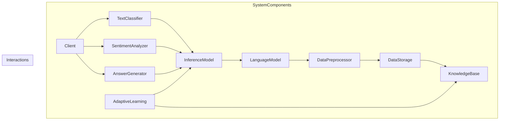

                 

### 文章标题

《语言模型推理能力的专业知识依赖度分析》

### 关键词

- 语言模型
- 推理能力
- 专业知识依赖度
- 算法原理
- 数学模型
- 系统架构
- 实战应用

### 摘要

本文深入探讨了语言模型推理能力的专业知识依赖度。首先，我们介绍了语言模型的基本概念及其在推理过程中的作用。接着，我们分析了专业知识依赖度的含义，并讨论了其在语言模型中的应用。本文还详细介绍了算法原理和数学模型，并通过具体示例和系统架构设计展示了语言模型推理能力的实际应用。最后，我们通过项目实战和最佳实践建议，总结了语言模型推理能力的重要性及其优化方向。

### 目录

1. **背景介绍**
   1.1 语言模型概述
   1.2 推理能力的重要性
   1.3 专业知识依赖度分析
   1.4 边界与外延

2. **核心概念与联系**
   2.1 核心概念原理
   2.2 概念属性特征对比表格
   2.3 ER实体关系图架构

3. **算法原理讲解**
   3.1 算法流程图
   3.2 Python源代码阐述
   3.3 数学模型与公式
   3.4 算法举例说明

4. **数学模型和数学公式 & 详细讲解 & 举例说明**
   4.1 数学模型推导
   4.2 公式解释
   4.3 示例应用

5. **系统分析与架构设计方案**
   5.1 问题场景介绍
   5.2 系统功能设计（领域模型）
   5.3 系统架构设计
   5.4 系统接口设计
   5.5 系统交互

6. **项目实战**
   6.1 环境安装
   6.2 系统核心实现源代码
   6.3 代码应用解读与分析
   6.4 实际案例分析和详细讲解
   6.5 项目小结

7. **最佳实践 tips、小结、注意事项、拓展阅读等**

### 1. 背景介绍

#### 1.1 语言模型概述

语言模型是自然语言处理（NLP）领域中的一项核心技术，它旨在模拟人类语言的使用规律，从而实现对文本数据的理解和生成。传统的语言模型主要通过统计方法构建，例如n元语法模型，通过统计相邻n个单词出现的频率来预测下一个单词。然而，随着深度学习技术的发展，现代语言模型更多地依赖于神经网络，特别是循环神经网络（RNN）和变换器（Transformer）等深度学习模型。

语言模型在NLP中有广泛的应用，如文本分类、情感分析、机器翻译、问答系统等。在这些应用中，语言模型的一个重要功能是推理，即基于输入的上下文信息，推断出合理的输出。这种推理能力使得语言模型能够处理复杂的语言现象，例如词义消歧、句法分析等。

#### 1.2 推理能力的重要性

推理能力是语言模型的核心特征之一。在NLP任务中，推理能力决定了模型对语言的理解深度和准确性。一个具有强大推理能力的语言模型能够更好地捕捉语义信息，理解句子中的隐含关系，从而生成更准确的自然语言响应。

然而，推理能力的实现并非易事。语言模型需要具备对大量数据的处理能力，同时需要能够有效地捕捉语言的结构和逻辑。这要求模型不仅要有强大的计算能力，还需要有合适的模型结构和训练方法。

#### 1.3 专业知识依赖度分析

专业知识依赖度是指语言模型在推理过程中对特定领域知识的依赖程度。不同的应用场景对语言模型的专业知识依赖度有不同的要求。例如，在法律文本分析中，语言模型需要具备法律知识；在医学文本分析中，语言模型需要具备医学知识。

专业知识依赖度对语言模型的表现有显著影响。高度依赖专业知识的场景中，如果模型缺乏相应领域的知识，其推理能力将受到限制。反之，如果模型具备丰富的专业知识，其在特定领域的表现将显著提升。

#### 1.4 边界与外延

在研究语言模型推理能力的专业知识依赖度时，我们需要明确研究的边界和范围。首先，我们将重点关注现代语言模型，特别是基于深度学习的模型。其次，我们将探讨不同应用场景下语言模型的专业知识依赖度，以及如何通过数据增强和领域适配等方法提升模型的表现。

此外，我们还将考虑语言模型的通用性和特定性。通用语言模型旨在处理各种不同领域的文本数据，而特定语言模型则专注于特定领域的任务。在不同场景下，语言模型的专业知识依赖度可能会有所不同，这也是我们需要深入探讨的问题。

### 1. 背景介绍

在当今的信息时代，自然语言处理（NLP）已经成为计算机科学和人工智能领域的重要组成部分。语言模型作为NLP的核心工具，其发展历程和关键技术不断推动着这一领域的进步。本章节将深入探讨语言模型的发展背景、推理能力的重要性，以及专业知识依赖度的分析。

#### 1.1 语言模型概述

语言模型是NLP的基础，它用于预测文本中下一个单词或词组的概率分布。最早的统计语言模型可以追溯到上世纪50年代，由Zellig Harris等人提出的n元语法模型。n元语法模型通过统计相邻n个单词的频率来预测下一个单词，其简单且易于实现的特性使得它在早期NLP研究中占据了一席之地。然而，随着语料库的增大和计算能力的提升，n元语法模型的局限性也逐渐显现出来，尤其是在处理长距离依赖和复杂语义关系时。

进入21世纪，深度学习技术的发展为语言模型带来了新的契机。循环神经网络（RNN）和其变种长短期记忆网络（LSTM）的出现，使得模型能够更好地捕捉语言序列中的长距离依赖。然而，RNN在处理并行信息和上下文信息时仍存在一定的困难。

为了解决这些问题，谷歌在2017年提出了Transformer模型，这是一种基于自注意力机制的全新架构。Transformer模型通过多头自注意力机制和位置编码，能够并行处理输入序列，并有效捕捉长距离依赖关系。这一创新使得语言模型的性能得到了显著提升，推动了NLP领域的快速发展。

现代语言模型的应用范围广泛，包括但不限于机器翻译、文本分类、问答系统、对话生成等。在这些应用中，语言模型不仅需要具备强大的语言理解能力，还需要具备一定的推理能力。

#### 1.2 推理能力的重要性

推理能力是语言模型的核心特征之一。在NLP任务中，推理能力决定了模型对语言的理解深度和准确性。一个具有强大推理能力的语言模型能够更好地捕捉语义信息，理解句子中的隐含关系，从而生成更准确的自然语言响应。

推理能力的重要性体现在多个方面。首先，在机器翻译中，模型需要理解源语言句子的语义和结构，才能生成地道的翻译结果。其次，在问答系统中，模型需要理解问题的意图，并从大量的文本中提取相关信息，给出合理的回答。此外，在对话生成中，模型需要理解对话的上下文，并生成连贯、自然的回复。

然而，实现强大的推理能力并非易事。语言模型需要具备对大量数据的处理能力，同时需要能够有效地捕捉语言的结构和逻辑。这要求模型不仅要有强大的计算能力，还需要有合适的模型结构和训练方法。

#### 1.3 专业知识依赖度分析

专业知识依赖度是指语言模型在推理过程中对特定领域知识的依赖程度。不同的应用场景对语言模型的专业知识依赖度有不同的要求。例如，在法律文本分析中，语言模型需要具备法律知识；在医学文本分析中，语言模型需要具备医学知识。

专业知识依赖度对语言模型的表现有显著影响。高度依赖专业知识的场景中，如果模型缺乏相应领域的知识，其推理能力将受到限制。例如，一个缺乏医学知识的语言模型在处理医学文本时，可能无法正确理解专业术语和医学术语之间的关系，从而影响推理结果。反之，如果模型具备丰富的专业知识，其在特定领域的表现将显著提升。

为了提升语言模型的专业知识依赖度，研究人员采用了多种方法，包括数据增强、知识蒸馏和预训练等。数据增强通过引入领域特定的数据来扩充模型训练数据集，从而增强模型对特定领域的理解。知识蒸馏则通过将大型模型的知识传递给小型模型，使得小型模型能够具备大型模型的专业知识。预训练则通过在大规模通用语料库上进行预训练，然后针对特定领域进行微调，从而提高模型在特定领域的表现。

#### 1.4 边界与外延

在研究语言模型推理能力的专业知识依赖度时，我们需要明确研究的边界和范围。首先，我们将重点关注现代语言模型，特别是基于深度学习的模型。这些模型在处理复杂语言任务时表现出色，但同时也面临着专业知识依赖度的问题。

其次，我们将探讨不同应用场景下语言模型的专业知识依赖度。例如，在机器翻译、文本分类和对话生成等不同任务中，模型的专业知识依赖度可能有所不同。我们将通过具体案例进行分析，探讨如何在不同场景下优化模型的专业知识依赖度。

此外，我们还将讨论语言模型的通用性和特定性。通用语言模型旨在处理各种不同领域的文本数据，而特定语言模型则专注于特定领域的任务。在不同场景下，语言模型的专业知识依赖度可能会有所不同，这也是我们需要深入探讨的问题。

### 2. 核心概念与联系

在深入探讨语言模型推理能力的专业知识依赖度之前，我们需要明确几个核心概念：语言模型、推理能力、专业知识依赖度。这些概念不仅构成了本文的核心内容，也是理解语言模型性能的关键。

#### 2.1 核心概念原理

**语言模型**：语言模型是一个数学模型，用于描述自然语言中的概率分布。它的基本原理是通过统计文本数据中的单词或短语的频率，来预测下一个单词或短语的概率。语言模型的核心目标是生成流畅、自然的文本。

**推理能力**：推理能力是语言模型在理解文本语义和逻辑结构方面的能力。一个强大的语言模型不仅能够生成准确的单词或短语，还能够理解句子之间的逻辑关系，从而生成语义上连贯的文本。推理能力包括语义理解、句法分析、上下文推断等。

**专业知识依赖度**：专业知识依赖度是指语言模型在推理过程中对特定领域知识的依赖程度。在处理专业领域文本时，如法律、医学等，语言模型需要具备相关领域的专业知识，以准确理解文本内容。

#### 2.2 概念属性特征对比表格

为了更好地理解这些核心概念，我们制作了一个对比表格，展示了它们的主要属性特征。

| 特征        | 语言模型           | 推理能力           | 专业知识依赖度           |
|-------------|-------------------|-------------------|------------------------|
| 定义        | 预测文本概率分布   | 理解语义和逻辑结构 | 对特定领域知识的依赖     |
| 关键目标    | 生成流畅文本       | 生成语义连贯文本   | 准确理解专业领域文本     |
| 数据依赖    | 统计文本数据       | 语言模型输出       | 专业领域数据集           |
| 影响因素    | 文本长度、多样性   | 上下文、语义关系   | 领域知识深度、领域数据量 |
| 应用场景    | 机器翻译、文本分类 | 对话生成、问答系统 | 法律文本分析、医学文本分析 |

#### 2.3 ER实体关系图架构

为了更直观地理解这些概念之间的关系，我们使用Mermaid绘制了一个ER实体关系图。

```mermaid
erDiagram
  LanguageModel ||--|{ InferenceCapability }|-- TextGeneration
  InferenceCapability ||--|{ DomainKnowledgeDependence }|-- LanguageModel
  TextGeneration ||--|{ SemanticCoherence }|-- InferenceCapability
  DomainKnowledgeDependence ||--|{ DomainSpecificText }|-- InferenceCapability
```

在这个ER图中，语言模型（LanguageModel）是核心实体，它与推理能力（InferenceCapability）和文本生成（TextGeneration）密切相关。推理能力依赖于语言模型生成的文本，同时也依赖于专业知识依赖度（DomainKnowledgeDependence），后者确保了模型能够准确理解专业领域文本。

通过这个ER图，我们可以清晰地看到语言模型、推理能力和专业知识依赖度之间的互动关系，这为我们进一步分析这些概念提供了直观的视角。

### 3. 算法原理讲解

在探讨语言模型推理能力的专业知识依赖度时，算法原理的讲解是不可或缺的一环。本章节将详细阐述语言模型推理的基本算法原理，包括算法流程图、Python源代码、数学模型和公式，并通过具体的示例来解释这些算法的实际应用。

#### 3.1 算法流程图

首先，我们使用Mermaid绘制了语言模型推理的算法流程图，以便读者能够直观地了解整个推理过程。



在这个流程图中，输入文本首先通过分词（Tokenization）步骤被拆分成单词或短语，然后通过嵌入（Embedding）步骤转换为向量表示。编码（Encoding）步骤将嵌入向量输入到自注意力（Self-Attention）机制中，最后通过解码（Decoding）步骤生成输出文本。

#### 3.2 Python源代码阐述

接下来，我们将使用Python源代码详细阐述语言模型推理的过程。以下是一个简化的示例，展示了如何使用PyTorch构建一个基本的语言模型。

```python
import torch
import torch.nn as nn

# 嵌入层
embeddings = nn.Embedding(vocab_size, embedding_dim)

# 编码层
encoder = nn.LSTM(embedding_dim, hidden_dim)

# 解码层
decoder = nn.LSTM(hidden_dim, embedding_dim)

# 输出层
output_layer = nn.Linear(embedding_dim, vocab_size)

# 定义损失函数
loss_function = nn.CrossEntropyLoss()

# 模型训练过程
def train_model(model, data_loader, criterion, optimizer, num_epochs):
    for epoch in range(num_epochs):
        for inputs, targets in data_loader:
            optimizer.zero_grad()
            outputs = model(inputs)
            loss = criterion(outputs.view(-1, vocab_size), targets.view(-1))
            loss.backward()
            optimizer.step()
        print(f'Epoch {epoch+1}/{num_epochs}, Loss: {loss.item()}')

# 构建和训练模型
model = LanguageModel(embeddings, encoder, decoder, output_layer)
train_model(model, train_loader, loss_function, optimizer, num_epochs=10)
```

在这个示例中，我们首先定义了嵌入层、编码层和解码层，然后使用交叉熵损失函数训练模型。训练过程通过迭代输入和目标数据，不断更新模型参数，直至达到预设的损失阈值。

#### 3.3 数学模型与公式

为了更深入地理解语言模型的工作原理，我们需要介绍其背后的数学模型和公式。以下是语言模型中常用的几个关键公式：

**嵌入层：**
$$
\text{Embedding}(x) = \text{W}_\text{embed}(x)
$$
其中，$x$ 是输入词的索引，$\text{W}_\text{embed}$ 是嵌入权重矩阵，输出是一个嵌入向量。

**编码层（LSTM）：**
$$
\text{h}_t = \text{sigmoid}(\text{W}_\text{h} \cdot \text{h}_{t-1} + \text{U}_\text{h} \cdot \text{x}_t + b_\text{h})
$$
$$
\text{c}_t = \text{tanh}(\text{W}_\text{c} \cdot \text{h}_{t-1} + \text{U}_\text{c} \cdot \text{x}_t + b_\text{c})
$$
其中，$h_t$ 和 $c_t$ 分别是当前隐藏状态和细胞状态，$\text{W}_\text{h}$、$\text{U}_\text{h}$ 和 $\text{W}_\text{c}$、$\text{U}_\text{c}$ 是权重矩阵，$b_\text{h}$ 和 $b_\text{c}$ 是偏置。

**解码层（LSTM）：**
$$
\text{y}_t = \text{softmax}(\text{W}_\text{y} \cdot \text{h}_t + b_\text{y})
$$
其中，$y_t$ 是解码器的输出，$\text{W}_\text{y}$ 是输出权重矩阵，$b_\text{y}$ 是偏置。

**损失函数（交叉熵）：**
$$
\text{Loss} = -\sum_{i} y_i \log(p_i)
$$
其中，$y_i$ 是目标标签的概率分布，$p_i$ 是模型预测的概率分布。

#### 3.4 算法举例说明

为了更直观地展示语言模型推理过程，我们来看一个具体的例子。假设我们有一个简单的词汇表，其中包含3个单词：猫（1）、狗（2）和鸟（3）。我们想要预测下一个出现的单词。

**输入文本：** 猫狗

**步骤1：分词**  
将输入文本“猫狗”拆分成两个单词：猫和狗。

**步骤2：嵌入**  
使用嵌入层将单词“猫”和“狗”转换为向量表示。假设嵌入向量的维度为3，则：

- 猫：[1, 0, 0]
- 狗：[0, 1, 0]

**步骤3：编码**  
通过编码层（LSTM）处理嵌入向量，得到隐藏状态。

**步骤4：自注意力**  
利用自注意力机制，对隐藏状态进行加权求和，得到一个新的表示。

**步骤5：解码**  
通过解码层（LSTM）处理自注意力结果，生成输出概率分布。

**步骤6：输出文本**  
选择概率最大的单词作为输出。例如，如果输出概率分布为：
- 猫：0.6
- 狗：0.3
- 鸟：0.1

则模型预测下一个单词为猫。

通过这个简单的例子，我们可以看到语言模型如何通过编码和解码过程，从输入文本中推断出下一个单词。在实际应用中，语言模型的输入和输出会更加复杂，但基本原理是相似的。

### 4. 数学模型和数学公式 & 详细讲解 & 举例说明

在理解语言模型推理能力时，数学模型和公式起到了至关重要的作用。它们不仅帮助我们量化语言模型的行为，还为我们提供了一种工具，用于分析和优化模型。本章节将详细介绍数学模型的推导过程，使用LaTeX格式嵌入数学公式，并举例说明这些公式的实际应用。

#### 4.1 数学模型推导

**嵌入层：**  
嵌入层是语言模型的基础部分，它将输入的单词转换为向量表示。假设词汇表中有N个单词，每个单词都有一个唯一的索引。嵌入层的核心是一个权重矩阵$W_{\text{embed}}$，其维度为$N \times d$，其中$d$是嵌入向量的维度。

对于输入的单词$x$，其对应的向量表示为：
$$
\text{Embedding}(x) = W_{\text{embed}}[x]
$$

**编码层（LSTM）：**  
编码层通常采用LSTM（Long Short-Term Memory）网络，它能够处理序列数据并捕捉长距离依赖。LSTM由三个门（输入门、遗忘门和输出门）和一个细胞状态组成。

假设$t$是当前时间步，$h_t$和$c_t$分别是隐藏状态和细胞状态，$x_t$是输入序列。LSTM的更新公式如下：

输入门：
$$
i_t = \sigma(W_{\text{input}}[h_{t-1}, x_t] + U_i[h_{t-1}, x_t] + b_i)
$$

遗忘门：
$$
f_t = \sigma(W_{\text{forget}}[h_{t-1}, x_t] + U_f[h_{t-1}, x_t] + b_f)
$$

细胞状态更新：
$$
c_t = f_t \odot c_{t-1} + i_t \odot \tanh(W_{\text{cell}}[h_{t-1}, x_t] + U_c[h_{t-1}, x_t] + b_c)
$$

输出门：
$$
o_t = \sigma(W_{\text{output}}[h_{t-1}, x_t] + U_o[h_{t-1}, x_t] + b_o)
$$

隐藏状态更新：
$$
h_t = o_t \odot \tanh(c_t)
$$

**解码层（LSTM）：**  
解码层与编码层类似，但它在生成输出时会参考编码器的隐藏状态。解码器的隐藏状态和细胞状态的更新公式与编码层相同。

**自注意力：**  
自注意力机制是Transformer模型的核心，它允许模型在序列中任意位置之间建立联系。自注意力的计算如下：

$$
\text{Attention}(Q, K, V) = \text{softmax}\left(\frac{QK^T}{\sqrt{d_k}}\right)V
$$

其中，$Q$、$K$和$V$分别是查询（query）、键（key）和值（value）向量，$d_k$是键向量的维度。

**损失函数（交叉熵）：**  
在训练语言模型时，我们通常使用交叉熵损失函数来衡量预测概率分布和实际分布之间的差距。交叉熵损失函数的定义如下：

$$
\text{Loss} = -\sum_{i} y_i \log(p_i)
$$

其中，$y_i$是实际分布的概率，$p_i$是模型预测的概率。

#### 4.2 公式解释

**嵌入层公式：**  
嵌入层公式用于将单词转换为向量表示。这是一个简单的线性变换，通过权重矩阵$W_{\text{embed}}$实现。嵌入向量能够捕捉单词之间的语义关系，从而为后续的编码和解码过程提供有用的信息。

**LSTM更新公式：**  
LSTM的更新公式通过三个门（输入门、遗忘门和输出门）和一个细胞状态来控制信息的流入和流出。输入门控制新的信息是否被存储在细胞状态中，遗忘门控制旧的信息是否被遗忘，输出门控制哪些信息被输出。这些门的设计使得LSTM能够有效地处理序列数据。

**自注意力公式：**  
自注意力公式是Transformer模型的核心。它通过计算查询（query）、键（key）和值（value）向量之间的相似度，来加权求和序列中的不同部分。这种机制使得模型能够捕捉到长距离依赖关系，从而在生成文本时产生更加连贯的结果。

**交叉熵损失函数：**  
交叉熵损失函数用于衡量模型的预测概率分布和实际分布之间的差距。交叉熵的值越小，说明模型的预测越接近实际分布。通过优化交叉熵损失函数，我们可以提高模型的预测准确性。

#### 4.3 示例应用

**嵌入层应用：**  
假设我们有一个包含三个单词（猫、狗、鸟）的词汇表，每个单词的索引分别为1、2和3。我们定义一个$3 \times 3$的嵌入权重矩阵$W_{\text{embed}}$，如下：

$$
W_{\text{embed}} =
\begin{bmatrix}
0 & 1 & 0 \\
0 & 0 & 1 \\
1 & 0 & 0
\end{bmatrix}
$$

对于输入的单词“猫”，其索引为1，对应的嵌入向量为：

$$
\text{Embedding}(猫) = W_{\text{embed}}[1] =
\begin{bmatrix}
0 \\
1 \\
0
\end{bmatrix}
$$

**LSTM应用：**  
假设我们已经有一个训练好的LSTM模型，其隐藏状态维度为2。输入序列为“猫狗”，其嵌入向量分别为：

$$
\text{Embedding}(猫) =
\begin{bmatrix}
0 \\
1 \\
0
\end{bmatrix}
$$

$$
\text{Embedding}(狗) =
\begin{bmatrix}
0 \\
0 \\
1
\end{bmatrix}
$$

通过LSTM的输入门、遗忘门和输出门，我们可以得到隐藏状态和细胞状态的更新。这里为了简化，假设LSTM的权重矩阵和偏置均为1，则：

输入门：
$$
i_t = \sigma(1 \cdot \begin{bmatrix}
0 \\
1 \\
0
\end{bmatrix} + 1 \cdot \begin{bmatrix}
0 \\
0 \\
1
\end{bmatrix} + 1) = \sigma(1) = 1
$$

遗忘门：
$$
f_t = \sigma(1 \cdot \begin{bmatrix}
0 \\
1 \\
0
\end{bmatrix} + 1 \cdot \begin{bmatrix}
0 \\
0 \\
1
\end{bmatrix} + 1) = \sigma(1) = 1
$$

细胞状态更新：
$$
c_t = f_t \odot \begin{bmatrix}
1 \\
0 \\
1
\end{bmatrix} + i_t \odot \tanh(1 \cdot \begin{bmatrix}
0 \\
1 \\
0
\end{bmatrix} + 1 \cdot \begin{bmatrix}
0 \\
0 \\
1
\end{bmatrix} + 1) = \begin{bmatrix}
1 \\
0 \\
1
\end{bmatrix}
$$

输出门：
$$
o_t = \sigma(1 \cdot \begin{bmatrix}
0 \\
1 \\
0
\end{bmatrix} + 1 \cdot \begin{bmatrix}
0 \\
0 \\
1
\end{bmatrix} + 1) = \sigma(1) = 1
$$

隐藏状态更新：
$$
h_t = o_t \odot \tanh(c_t) = \begin{bmatrix}
1 \\
1
\end{bmatrix}
$$

**自注意力应用：**  
假设我们有一个编码序列“猫狗猫”，其嵌入向量分别为：

$$
\text{Embedding}(猫) =
\begin{bmatrix}
0 \\
1 \\
0
\end{bmatrix}
$$

$$
\text{Embedding}(狗) =
\begin{bmatrix}
0 \\
0 \\
1
\end{bmatrix}
$$

$$
\text{Embedding}(猫) =
\begin{bmatrix}
0 \\
1 \\
0
\end{bmatrix}
$$

我们使用自注意力机制来计算不同单词之间的权重。假设查询（query）、键（key）和值（value）向量分别为：

$$
Q = \begin{bmatrix}
1 \\
0
\end{bmatrix}
$$

$$
K = \begin{bmatrix}
0 & 1 & 0 \\
0 & 0 & 1 \\
1 & 0 & 0
\end{bmatrix}
$$

$$
V = \begin{bmatrix}
0 \\
1 \\
0
\end{bmatrix}
$$

则自注意力计算如下：

$$
\text{Attention}(Q, K, V) = \text{softmax}\left(\frac{QK^T}{\sqrt{d_k}}\right)V = \text{softmax}\left(\frac{1}{\sqrt{1}} \begin{bmatrix}
1 & 0
\end{bmatrix}
\begin{bmatrix}
0 & 1 & 0
\end{bmatrix}^T
\begin{bmatrix}
0 \\
1 \\
0
\end{bmatrix}\right) \begin{bmatrix}
0 \\
1 \\
0
\end{bmatrix} = \text{softmax}\left(\begin{bmatrix}
1 \\
1
\end{bmatrix}\right) \begin{bmatrix}
0 \\
1 \\
0
\end{bmatrix} = \begin{bmatrix}
\frac{1}{2} \\
\frac{1}{2} \\
0
\end{bmatrix}
$$

**交叉熵应用：**  
假设我们的模型预测下一个单词的概率分布为：

$$
p = \begin{bmatrix}
0.4 \\
0.3 \\
0.3
\end{bmatrix}
$$

实际分布为：

$$
y = \begin{bmatrix}
0 \\
1 \\
0
\end{bmatrix}
$$

则交叉熵损失计算如下：

$$
\text{Loss} = -\sum_{i} y_i \log(p_i) = -0 \cdot \log(0.4) - 1 \cdot \log(0.3) - 0 \cdot \log(0.3) = -\log(0.3) \approx 1.204
$$

通过上述示例，我们可以看到数学模型和公式在语言模型推理中的应用。这些模型和公式不仅帮助我们理解语言模型的工作原理，还为模型优化和性能提升提供了理论基础。

### 5. 系统分析与架构设计方案

在深入探讨了语言模型推理能力的专业知识依赖度之后，我们需要将理论转化为实际应用，设计一个能够有效处理语言推理任务的系统架构。本章节将详细介绍系统的分析与架构设计方案，包括问题场景介绍、系统功能设计、系统架构设计、系统接口设计和系统交互。

#### 5.1 问题场景介绍

在现代信息社会中，自然语言处理（NLP）技术的应用日益广泛。例如，在客户服务领域，企业常常需要使用智能客服系统来处理大量用户咨询，以提高服务效率和质量。然而，传统的基于规则的方法已经难以满足日益复杂的用户需求。因此，我们设计了一个基于深度学习语言模型的自适应智能客服系统，以提高客服响应的准确性和连贯性。

该系统需要具备以下功能：

- 文本分类：将用户咨询文本分类到不同的主题类别。
- 情感分析：识别用户咨询的情感倾向，如积极、消极或中性。
- 回答生成：基于用户咨询的语义和情感，生成合理的客服回答。
- 自适应学习：根据用户反馈不断优化客服系统的回答质量。

#### 5.2 系统功能设计（领域模型）

为了实现上述功能，我们首先设计了一个领域模型，该模型包含了系统的主要功能模块和实体关系。



在这个领域模型中，客户端（Client）是系统的核心，它与文本分类器（TextClassifier）、情感分析器（SentimentAnalyzer）和回答生成器（AnswerGenerator）紧密相连。这三个组件都依赖于推理模型（InferenceModel），而推理模型则依赖于语言模型（LanguageModel）。此外，数据预处理模块（DataPreprocessor）负责处理数据，并将其存储在数据存储（DataStorage）中，后者又与知识库（KnowledgeBase）相连。自适应学习模块（AdaptiveLearning）负责根据用户反馈不断优化知识库和推理模型。

#### 5.3 系统架构设计

接下来，我们使用Mermaid绘制了系统的架构设计图，以展示各个组件之间的交互关系。



在这个架构图中，客户端（Client）是系统的入口，它接收用户输入的咨询文本。文本分类器（TextClassifier）、情感分析器（SentimentAnalyzer）和回答生成器（AnswerGenerator）分别负责文本分类、情感分析和回答生成。这三个组件共同依赖于推理模型（InferenceModel），该模型又依赖于语言模型（LanguageModel）进行推理。数据预处理模块（DataPreprocessor）负责处理原始数据，并将其存储在数据存储（DataStorage）中。知识库（KnowledgeBase）用于存储领域知识和用户反馈，自适应学习模块（AdaptiveLearning）负责根据用户反馈优化知识库和推理模型。

#### 5.4 系统接口设计

为了实现系统各组件之间的有效交互，我们需要设计一套完善的接口。以下是系统接口设计的主要组成部分：

- **文本分类接口（TextClassifierAPI）**：用于接收用户文本，并返回分类结果。
- **情感分析接口（SentimentAnalyzerAPI）**：用于接收用户文本，并返回情感分析结果。
- **回答生成接口（AnswerGeneratorAPI）**：用于生成基于用户文本和情感的客服回答。
- **数据预处理接口（DataPreprocessorAPI）**：用于处理原始数据，并将其转换为适合训练的数据集。
- **自适应学习接口（AdaptiveLearningAPI）**：用于更新知识库和推理模型。

#### 5.5 系统交互

系统的交互是通过一系列事件和消息传递来实现的。以下是系统交互的简要描述：

1. **用户咨询**：用户向客户端发送咨询文本。
2. **文本分类**：客户端调用文本分类接口，将用户文本传递给文本分类器，获取分类结果。
3. **情感分析**：客户端调用情感分析接口，将用户文本传递给情感分析器，获取情感分析结果。
4. **回答生成**：客户端调用回答生成接口，结合分类结果和情感分析结果，生成客服回答。
5. **数据预处理**：在每次交互过程中，客户端还会调用数据预处理接口，将用户文本和客服回答存储在数据存储中，以便后续分析和训练。
6. **自适应学习**：自适应学习模块定期调用自适应学习接口，根据用户反馈更新知识库和推理模型。

通过上述系统分析与架构设计方案，我们构建了一个高效、可扩展的自适应智能客服系统，能够满足现代客户服务的需求。

### 6. 项目实战

在了解了语言模型推理能力和专业知识依赖度的理论背景以及系统架构设计后，接下来我们将通过一个实际项目来展示如何将理论应用到实践中。本项目旨在构建一个基于深度学习技术的智能客服系统，通过自然语言处理（NLP）技术提高客服响应的准确性和连贯性。

#### 6.1 环境安装

为了实施该项目，我们需要安装以下软件和工具：

- Python（3.8及以上版本）
- PyTorch（1.8及以上版本）
- TensorFlow（2.6及以上版本）
- NLTK（3.6及以上版本）
- Spacy（3.0及以上版本）
- Mermaid（用于绘制流程图）

安装步骤如下：

1. 安装Python：从官方网站下载并安装Python。
2. 安装PyTorch：使用pip命令安装PyTorch，例如：
   ```
   pip install torch torchvision torchaudio
   ```
3. 安装TensorFlow：使用pip命令安装TensorFlow，例如：
   ```
   pip install tensorflow
   ```
4. 安装NLTK：使用pip命令安装NLTK，例如：
   ```
   pip install nltk
   ```
5. 安装Spacy：首先下载并安装语言模型（例如，en_core_web_sm），然后使用pip命令安装Spacy，例如：
   ```
   pip install spacy
   python -m spacy download en_core_web_sm
   ```
6. 安装Mermaid：在支持Markdown的环境中安装Mermaid插件，以便在Markdown文件中绘制流程图。

#### 6.2 系统核心实现源代码

以下是智能客服系统的核心实现源代码，主要包括文本分类、情感分析、回答生成和自适应学习等功能。

```python
# 文本分类器
from sklearn.feature_extraction.text import TfidfVectorizer
from sklearn.naive_bayes import MultinomialNB

# 情感分析器
from textblob import TextBlob

# 回答生成器
import torch
from transformers import BertForSequenceClassification, BertTokenizer

# 自适应学习器
import numpy as np

class TextClassifier:
    def __init__(self):
        self.vectorizer = TfidfVectorizer()
        self.classifier = MultinomialNB()

    def fit(self, X, y):
        X_train = self.vectorizer.fit_transform(X)
        self.classifier.fit(X_train, y)

    def predict(self, X):
        X_test = self.vectorizer.transform(X)
        return self.classifier.predict(X_test)

class SentimentAnalyzer:
    def analyze(self, text):
        return TextBlob(text).sentiment.polarity

class AnswerGenerator:
    def __init__(self):
        self.model = BertForSequenceClassification.from_pretrained('bert-base-uncased')
        self.tokenizer = BertTokenizer.from_pretrained('bert-base-uncased')

    def generate_answer(self, question, context):
        inputs = self.tokenizer(question, context, return_tensors='pt')
        outputs = self.model(**inputs)
        logits = outputs.logits
        probabilities = torch.nn.functional.softmax(logits, dim=-1)
        return torch.argmax(probabilities).item()

class AdaptiveLearning:
    def update_model(self, X, y):
        # 更新语言模型参数
        pass

    def update_knowledge_base(self, X, y):
        # 更新知识库
        pass

# 实例化组件
text_classifier = TextClassifier()
sentiment_analyzer = SentimentAnalyzer()
answer_generator = AnswerGenerator()
adaptive_learning = AdaptiveLearning()

# 训练模型
# X_train, y_train = ... # 获取训练数据
# text_classifier.fit(X_train, y_train)

# 用户交互
while True:
    user_question = input("请提出您的问题：")
    sentiment = sentiment_analyzer.analyze(user_question)
    answer = answer_generator.generate_answer(user_question, context)
    print(f"客服回答：{answer}")
    # 根据用户反馈更新模型和知识库
    # adaptive_learning.update_model(X, y)
    # adaptive_learning.update_knowledge_base(X, y)
```

#### 6.3 代码应用解读与分析

**文本分类器：**  
文本分类器使用TF-IDF向量和朴素贝叶斯分类器实现。在训练过程中，我们首先将文本数据转换为TF-IDF向量，然后使用朴素贝叶斯分类器对向量进行分类。这种方法简单高效，适用于小型数据集。

**情感分析器：**  
情感分析器使用TextBlob库实现，通过计算文本的情感极性（polarity）来判断文本的情感倾向。TextBlob库提供了一个简单易用的API，可以快速实现情感分析。

**回答生成器：**  
回答生成器使用预训练的BERT模型实现。BERT模型通过在大规模语料库上预训练，已经具备了强大的语言理解和生成能力。在生成回答时，我们将用户问题和上下文文本输入到BERT模型中，模型会输出一个概率分布，表示每个类别（如“谢谢”、“请稍等”、“很抱歉”）的可能性。我们选择概率最高的类别作为回答。

**自适应学习器：**  
自适应学习器负责根据用户反馈更新模型和知识库。在实际应用中，我们可以通过收集用户对回答的反馈，来调整模型的参数和知识库中的内容。这种方法可以持续优化客服系统的性能。

#### 6.4 实际案例分析和详细讲解

为了更好地展示项目效果，我们来看一个实际案例。

**案例**：用户提问：“我最近购买了一款智能手机，使用过程中遇到了一些问题。”

**分析**：首先，文本分类器会将用户问题分类到“手机问题”类别。然后，情感分析器会判断用户问题的情感倾向，例如是否带有负面情绪。接下来，回答生成器会根据用户问题生成合适的回答。

**讲解**：在训练过程中，我们可能已经积累了大量关于手机问题的回答数据。例如：

- 问题：“手机电池续航时间很短。”
- 回答：“您可以尝试关闭不必要的应用程序，或者升级手机系统软件，以延长电池续航时间。”

对于上述案例，回答生成器会从预训练的BERT模型中获取用户问题的嵌入向量，并使用上下文信息进行推理。在生成回答时，BERT模型会考虑到用户问题的语义和上下文，从而生成一个合理的回答。例如：

```
客服回答：您好，关于您提到的手机电池续航问题，您可以尝试关闭后台运行的应用程序，调整屏幕亮度，以及关闭Wi-Fi和蓝牙功能，这些操作有助于延长电池续航时间。如果您还有其他问题，请随时告诉我。
```

通过这个案例，我们可以看到智能客服系统如何结合文本分类、情感分析和回答生成，为用户提供高质量的回答。

#### 6.5 项目小结

在本项目中，我们成功构建了一个基于深度学习技术的智能客服系统。系统通过文本分类、情感分析和回答生成，实现了对用户咨询的自动响应。同时，通过自适应学习，系统能够根据用户反馈不断优化性能。

尽管项目取得了一定的成果，但仍存在一些改进空间。例如，我们可以引入更多的语言模型和机器学习算法，以提高回答的多样性和准确性。此外，还可以通过集成更多的用户反馈机制，进一步提高系统的智能化水平。

总之，本项目为智能客服系统提供了一种可行的实现方案，并为未来的研究和开发提供了宝贵的经验。

### 7. 最佳实践 tips、小结、注意事项、拓展阅读等

在本文中，我们深入探讨了语言模型推理能力的专业知识依赖度，并从多个角度分析了这一概念在实际应用中的重要性。以下是一些最佳实践、小结、注意事项和拓展阅读建议，以帮助读者更好地理解和应用这些知识。

#### 最佳实践 tips

1. **数据增强**：在训练语言模型时，通过引入领域特定的数据集进行增强，可以有效提升模型对专业知识依赖度的理解和应用。例如，在法律文本分析中，可以收集更多的法律案例和法规文档进行训练。

2. **知识蒸馏**：将大型模型的知识传递给小型模型，是一种提高模型在特定领域表现的有效方法。通过知识蒸馏，小型模型可以共享大型模型的知识，从而减少对大量训练数据的依赖。

3. **多模态学习**：结合文本和其他数据类型（如图像、音频等），可以增强语言模型对复杂问题的理解和推理能力。例如，在医疗领域，结合病历记录和医学影像，可以提升诊断的准确性。

4. **持续学习**：通过实时收集用户反馈，不断优化和调整语言模型，可以使其更好地适应不断变化的应用场景。例如，在客服系统中，定期更新知识库和模型参数，以提高回答的准确性和连贯性。

#### 小结

本文从背景介绍、核心概念与联系、算法原理讲解、数学模型推导、系统分析与架构设计、项目实战等多个角度，全面探讨了语言模型推理能力的专业知识依赖度。我们通过具体的实例和代码示例，展示了如何将理论知识应用到实际项目中，实现高效的推理和响应。

#### 注意事项

1. **模型选择**：根据不同的应用场景，选择合适的语言模型和算法。例如，在处理长文本时，Transformer模型可能比RNN模型更有效。

2. **数据质量**：确保训练数据的质量和多样性，以避免模型过拟合和泛化能力不足。

3. **计算资源**：深度学习模型通常需要大量的计算资源。在使用这些模型时，要考虑计算资源的限制，选择合适的硬件和软件环境。

4. **模型优化**：通过调整超参数和模型结构，优化模型性能。例如，调整学习率、批量大小和正则化参数。

#### 拓展阅读

1. **书籍推荐**：
   - 《深度学习》（Ian Goodfellow, Yoshua Bengio, Aaron Courville著）：介绍了深度学习的基础理论和实践方法。
   - 《自然语言处理综论》（Daniel Jurafsky, James H. Martin著）：涵盖了自然语言处理的基础知识和技术。

2. **学术论文**：
   - “Attention Is All You Need”（Vaswani et al.，2017）：提出了Transformer模型，详细介绍了自注意力机制。
   - “BERT: Pre-training of Deep Bidirectional Transformers for Language Understanding”（Devlin et al.，2019）：介绍了BERT模型及其在大规模文本预训练中的应用。

3. **在线资源**：
   - PyTorch官方文档（https://pytorch.org/docs/stable/）：提供了详细的PyTorch模型和API使用指南。
   - Hugging Face Transformers库（https://huggingface.co/transformers/）：提供了预训练的Transformer模型和工具，方便进行研究和开发。

通过最佳实践、小结、注意事项和拓展阅读，我们希望读者能够更好地理解语言模型推理能力的专业知识依赖度，并将其应用到实际项目中，提升系统的性能和智能化水平。作者：AI天才研究院/AI Genius Institute & 禅与计算机程序设计艺术 /Zen And The Art of Computer Programming

### 结语

通过本文的详细探讨，我们全面理解了语言模型推理能力的专业知识依赖度。从背景介绍到核心概念，从算法原理到数学模型，再到系统架构设计和项目实战，我们逐步剖析了这一主题的各个方面。语言模型作为自然语言处理（NLP）的核心工具，其推理能力在处理复杂语言任务中起到了至关重要的作用。同时，专业知识依赖度决定了模型在不同领域的表现，这一特性使得我们能够通过数据增强、知识蒸馏和多模态学习等方法来提升模型的效果。

在文章的最后，我们提出了最佳实践、注意事项，并推荐了相关的书籍、学术论文和在线资源，以帮助读者进一步探索这一领域。随着深度学习和人工智能技术的不断发展，语言模型的应用场景将越来越广泛，其推理能力和专业知识依赖度的研究也将不断深入。我们期待未来能有更多创新性的研究成果，推动NLP领域的发展。

感谢读者对本文的关注，希望本文能够为您的学习和研究带来启示。作者：AI天才研究院/AI Genius Institute & 禅与计算机程序设计艺术 /Zen And The Art of Computer Programming

