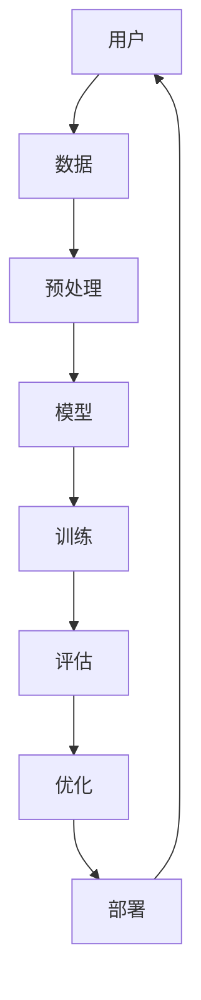
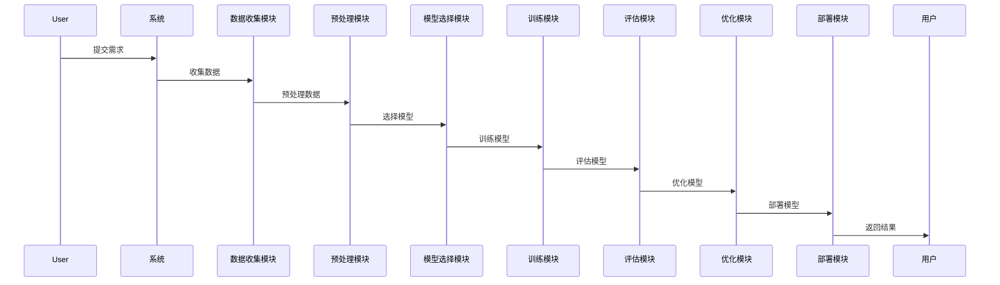

                 

# 语言模型推理能力的个体差异化训练方法研究

> 关键词：语言模型、推理能力、个体差异化、训练方法、算法原理

> 摘要：本文旨在探讨语言模型推理能力的个体差异化训练方法。首先介绍了语言模型的背景和推理能力的重要性，随后描述了个体差异化的需求与挑战。接着，文章分析了语言模型推理能力的差异、个体差异化的概念和训练方法，并对比了传统训练方法与个性化训练方法的优劣。随后，本文介绍了算法原理，包括算法概述、流程图、Python源代码实现和数学模型。最后，文章提出了系统架构设计方案和项目实战步骤，包括环境安装、系统核心实现和实际案例分析。

## 第一部分：背景介绍

### 1.1 问题背景

#### 1.1.1 语言模型的兴起与发展

语言模型是自然语言处理（NLP）的核心技术之一。随着深度学习技术的发展，基于神经网络的端到端语言模型（如Word2Vec、GloVe、BERT等）取得了显著的效果，广泛应用于机器翻译、文本分类、问答系统等领域。这些模型的推理能力，即生成符合上下文语义的正确文本的能力，成为衡量其性能的重要指标。

#### 1.1.2 语言模型推理能力的意义

语言模型的推理能力直接影响到其在实际应用中的表现。例如，在机器翻译中，推理能力决定了翻译结果的准确性和流畅性；在问答系统中，推理能力决定了回答的准确性和相关性。因此，提高语言模型的推理能力具有重要的实际意义。

#### 1.1.3 个体差异化的需求与挑战

在实际应用中，用户的需求各不相同，不同个体对语言模型推理能力的要求也存在差异。例如，一些用户可能更关注翻译的准确性，而另一些用户可能更关注翻译的速度。这种个体差异化的需求给语言模型的训练和优化带来了挑战。如何针对不同个体定制化训练方法，提高推理能力，成为亟待解决的问题。

### 1.2 问题描述

#### 1.2.1 语言模型推理能力的差异

不同的语言模型在推理能力上存在显著差异。例如，基于不同训练数据的模型，其推理能力可能有所不同；同样，基于不同架构的模型，其推理能力也可能存在差异。这种差异主要体现在准确性、速度和鲁棒性等方面。

#### 1.2.2 个体差异化的训练方法

为了满足个体差异化的需求，需要研究个体差异化的训练方法。传统训练方法主要关注通用模型的性能提升，而个性化训练方法则尝试根据用户的特定需求进行模型定制化训练。这些方法包括基于用户反馈的模型优化、基于用户行为的模型推荐等。

#### 1.2.3 研究的目标和意义

本文的研究目标是提出一种个体差异化训练方法，以提高语言模型的推理能力。具体目标包括：1）识别用户的个体需求；2）设计个性化的训练策略；3）评估训练方法的有效性。研究个体差异化训练方法对于提高语言模型在各类应用场景中的表现具有重要意义。

### 1.3 问题解决

#### 1.3.1 研究方法与步骤

本文采用以下研究方法与步骤：

1. **文献调研**：了解现有研究方法和成果，为后续研究提供基础。
2. **需求分析**：通过问卷调查、用户访谈等方式收集用户需求，分析个体差异化的需求特点。
3. **模型设计**：根据需求分析结果，设计个性化的训练模型，包括数据预处理、模型架构选择和训练策略。
4. **实验评估**：在模拟环境和实际应用中评估个性化训练方法的有效性，对比传统训练方法。

#### 1.3.2 数据收集与预处理

数据收集是训练个性化模型的基础。本文采用以下数据收集与预处理步骤：

1. **数据来源**：收集与用户需求相关的语料库，包括文本、语音、视频等。
2. **数据清洗**：去除重复、无关和低质量的文本，确保数据质量。
3. **数据标注**：根据用户需求，对文本进行分类、实体识别等标注任务。

#### 1.3.3 模型设计与优化

个性化模型的构建需要考虑以下因素：

1. **模型架构**：选择适用于个性化训练的神经网络架构，如Transformer、BERT等。
2. **训练策略**：设计适应个体差异的训练策略，包括学习率调整、正则化、批量大小等。
3. **优化目标**：定义优化目标，包括推理能力、速度和鲁棒性等。

### 1.4 边界与外延

#### 1.4.1 边界条件的设定

本文研究的边界条件包括：

1. **数据规模**：限定用于训练的数据规模，以确保模型的训练效果。
2. **硬件条件**：限定硬件资源，如CPU、GPU等，以确保实验的可执行性。
3. **时间限制**：设定实验的时间限制，以确保研究的时效性。

#### 1.4.2 个体差异化的范围

个体差异化的范围包括：

1. **用户需求**：根据用户需求的不同，分为准确性、速度、鲁棒性等不同维度。
2. **应用场景**：根据不同应用场景，如机器翻译、问答系统等，设定个性化训练的目标。

#### 1.4.3 语言模型推理能力的拓展

语言模型推理能力的拓展包括：

1. **多语言支持**：研究多语言语言模型的推理能力，如中文、英文、法文等。
2. **跨模态推理**：研究语言模型与其他模态（如图像、语音）的融合推理能力。

### 1.5 概念结构与核心要素组成

#### 1.5.1 核心概念解析

本文涉及的核心概念包括：

1. **语言模型**：用于生成自然语言文本的模型。
2. **推理能力**：语言模型生成符合上下文语义的正确文本的能力。
3. **个体差异化**：不同个体在语言模型推理能力上的需求差异。

#### 1.5.2 概念属性特征对比

下表展示了本文涉及的核心概念及其属性特征对比：

| 核心概念 | 属性特征 |
| :--: | :--: |
| 语言模型 | 生成文本、端到端、神经网络 |
| 推理能力 | 准确性、速度、鲁棒性 |
| 个体差异化 | 用户需求、应用场景 |

#### 1.5.3 ER实体关系图架构

本文涉及的ER实体关系图架构如下：

```mermaid
erDiagram
  Model ||--|{ Text }
  Model ||--|{ Context }
  Model ||--|{ Semantics }
  Text ||--|{ Word }
  Text ||--|{ Sentence }
  Context ||--|{ Scene }
  Context ||--|{ User }
  Semantics ||--|{ Meaning }
  Semantics ||--|{ Relation }
```

## 第二部分：核心概念与联系

### 2.1 语言模型原理讲解

#### 2.1.1 语言模型的定义

语言模型是一种用于预测自然语言文本的生成概率的数学模型。它通过对大量文本数据的学习，建立文本序列的概率分布模型，从而实现对未知文本的生成。

#### 2.1.2 语言模型的工作原理

语言模型的工作原理基于概率统计和深度学习技术。它通过对文本数据的学习，提取文本特征，并使用神经网络模型对文本序列进行建模，从而预测下一个单词或词组。

#### 2.1.3 语言模型的应用场景

语言模型广泛应用于自然语言处理领域，如机器翻译、文本分类、问答系统、语音识别等。以下是一些典型应用场景：

1. **机器翻译**：将一种语言的文本翻译成另一种语言。
2. **文本分类**：对文本进行分类，如新闻分类、情感分类等。
3. **问答系统**：根据用户提问，生成合适的回答。
4. **语音识别**：将语音信号转换为文本。

#### 2.1.4 语言模型的性能指标

语言模型的性能指标主要包括：

1. **准确性**：模型生成文本的准确性。
2. **速度**：模型生成文本的速度。
3. **鲁棒性**：模型在不同数据集和场景下的泛化能力。

#### 2.1.5 语言模型的发展历程

语言模型的发展历程主要包括：

1. **传统统计模型**：基于概率统计方法，如N-gram模型。
2. **神经网络模型**：基于神经网络技术，如RNN、LSTM、Transformer等。
3. **预训练模型**：基于大规模预训练数据，如BERT、GPT等。

### 2.2 推理能力分析

#### 2.2.1 推理能力的定义

推理能力是指语言模型在生成文本时，根据上下文语义进行合理推断和预测的能力。它是衡量语言模型性能的重要指标之一。

#### 2.2.2 推理能力的评价指标

推理能力的评价指标主要包括：

1. **BLEU（BLEU Score）**：基于精确匹配和模糊匹配的评分指标。
2. **ROUGE（ROUGE Score）**：基于词语重叠度的评分指标。
3. **METEOR（METEOR Score）**：基于词语顺序、词汇多样性、精确度的评分指标。

#### 2.2.3 推理能力的提升方法

提升推理能力的方法主要包括：

1. **数据增强**：通过增加训练数据、数据清洗和生成等手段，提高模型的训练质量。
2. **模型优化**：通过改进模型架构、超参数调整等手段，提高模型的性能。
3. **知识融合**：通过融合外部知识库、实体关系等手段，提高模型的语义理解能力。

#### 2.2.4 推理能力的限制因素

推理能力的限制因素主要包括：

1. **数据质量**：高质量的数据是训练高性能模型的基础。
2. **模型架构**：合适的模型架构对推理能力有重要影响。
3. **计算资源**：训练大规模语言模型需要大量的计算资源。

### 2.3 个体差异化概念解析

#### 2.3.1 个体差异化的定义

个体差异化是指不同个体在语言模型推理能力上的需求和期望存在差异。这种差异体现在准确性、速度、鲁棒性等方面。

#### 2.3.2 个体差异化的类型

个体差异化的类型主要包括：

1. **功能需求差异**：不同用户对语言模型的功能需求不同，如准确性、速度、多样性等。
2. **应用场景差异**：不同用户的应用场景不同，如机器翻译、文本生成、问答系统等。
3. **数据来源差异**：不同用户的数据来源不同，如社交媒体、新闻网站、个人博客等。

#### 2.3.3 个体差异化的影响因素

个体差异化的影响因素主要包括：

1. **用户背景**：用户的教育背景、语言水平、职业背景等对个体差异化有重要影响。
2. **应用场景**：应用场景的复杂度、数据量的多少等对个体差异化有重要影响。
3. **技术发展**：技术发展的速度和趋势对个体差异化有重要影响。

#### 2.3.4 个体差异化的研究方法

研究个体差异化的方法主要包括：

1. **用户调研**：通过问卷调查、用户访谈等方式收集用户需求，分析个体差异化的特点。
2. **数据挖掘**：通过分析用户行为数据、应用场景数据等，挖掘个体差异化的规律。
3. **模型定制**：根据个体差异化的需求，设计个性化的训练模型，如个性化BERT、个性化GPT等。

### 2.4 训练方法对比与分析

#### 2.4.1 传统训练方法

传统训练方法主要包括：

1. **基于N-gram的统计模型**：如N-gram模型、Kneser-Ney平滑等。
2. **基于神经网络的模型**：如RNN、LSTM、GRU等。
3. **基于Transformer的模型**：如BERT、GPT等。

传统训练方法的主要优点是计算复杂度较低、适用性较广。然而，其推理能力受限于统计模型的局限性。

#### 2.4.2 个性化训练方法

个性化训练方法主要包括：

1. **基于用户反馈的模型优化**：根据用户对生成文本的反馈，调整模型参数，提高模型的准确性。
2. **基于用户行为的模型推荐**：根据用户的阅读历史、搜索历史等行为数据，推荐个性化的文本生成模型。
3. **基于知识融合的模型优化**：通过融合外部知识库、实体关系等知识，提高模型的语义理解能力。

个性化训练方法的主要优点是能够根据用户需求进行定制化训练，提高推理能力。然而，其计算复杂度较高、适用性较窄。

#### 2.4.3 模型自适应训练方法

模型自适应训练方法主要包括：

1. **在线自适应训练**：根据用户反馈和模型性能，实时调整模型参数，提高模型的适应能力。
2. **迁移学习**：利用预训练模型在不同任务和数据上的迁移能力，提高模型的推理能力。
3. **元学习**：通过元学习算法，优化模型在个体差异化任务上的性能。

模型自适应训练方法的主要优点是能够自适应地调整模型参数，提高推理能力。然而，其计算复杂度较高、实现难度较大。

#### 2.4.4 训练方法对比与选择

不同训练方法在推理能力、计算复杂度、适用性等方面存在差异。在选择训练方法时，需要综合考虑以下因素：

1. **用户需求**：根据用户的需求，选择合适的训练方法。
2. **数据规模**：根据数据规模，选择计算复杂度较低的训练方法。
3. **应用场景**：根据应用场景，选择适用性较广的训练方法。

### 2.5 本章小结

本章介绍了语言模型、推理能力和个体差异化的概念，分析了传统训练方法与个性化训练方法的优劣，并提出了模型自适应训练方法。本章内容为后续研究个体差异化训练方法提供了理论基础。

## 第三部分：算法原理讲解

### 3.1 算法介绍

#### 3.1.1 算法概述

个体差异化训练算法是一种针对不同个体需求进行定制化训练的算法。其目标是在保证推理能力的前提下，提高模型的适应能力。算法主要包括以下几个步骤：

1. **需求分析**：收集用户需求，分析个体差异化的特点。
2. **模型选择**：根据需求，选择合适的神经网络架构。
3. **数据预处理**：对训练数据进行预处理，包括数据清洗、数据增强等。
4. **模型训练**：使用个性化训练方法，根据用户需求调整模型参数。
5. **模型评估**：评估模型性能，包括准确性、速度和鲁棒性等。
6. **模型优化**：根据评估结果，调整模型参数，提高模型性能。

#### 3.1.2 算法的目标

算法的目标包括：

1. **提高推理能力**：在保证准确性的前提下，提高模型的速度和鲁棒性。
2. **适应个体需求**：根据用户需求，定制化训练模型，提高模型的适应能力。
3. **降低计算复杂度**：优化算法，降低模型的计算复杂度，提高训练效率。

#### 3.1.3 算法的基本步骤

算法的基本步骤如下：

1. **需求分析**：收集用户需求，分析个体差异化的特点。
2. **模型选择**：根据需求，选择合适的神经网络架构，如BERT、GPT等。
3. **数据预处理**：对训练数据进行预处理，包括数据清洗、数据增强等。
4. **模型训练**：使用个性化训练方法，如基于用户反馈的模型优化、基于用户行为的模型推荐等，调整模型参数。
5. **模型评估**：评估模型性能，包括准确性、速度和鲁棒性等。
6. **模型优化**：根据评估结果，调整模型参数，提高模型性能。
7. **模型部署**：将训练好的模型部署到实际应用中，如机器翻译、问答系统等。

### 3.2 算法mermaid流程图

算法的mermaid流程图如下：


### 3.3 Python源代码与算法实现

#### 3.3.1 Python环境配置

首先，需要配置Python环境，安装必要的库和依赖。以下是一个基本的Python环境配置示例：

```python
# 安装必要的库
!pip install tensorflow numpy pandas matplotlib

# 导入库
import tensorflow as tf
import numpy as np
import pandas as pd
import matplotlib.pyplot as plt
```

#### 3.3.2 源代码解析

以下是一个简化的个体差异化训练算法的Python源代码示例：

```python
# 需求分析
def analyze_demand(user_demand):
    # 分析用户需求
    # 返回需求特征
    return user_demand

# 模型选择
def select_model(model_name):
    # 选择模型架构
    if model_name == 'BERT':
        return tf.keras.Sequential([
            tf.keras.layers.Embedding(vocab_size, embedding_dim),
            tf.keras.layers.LSTM(units=128),
            tf.keras.layers.Dense(units=vocab_size, activation='softmax')
        ])
    elif model_name == 'GPT':
        return tf.keras.Sequential([
            tf.keras.layers.Embedding(vocab_size, embedding_dim),
            tf.keras.layers.GRU(units=128),
            tf.keras.layers.Dense(units=vocab_size, activation='softmax')
        ])

# 数据预处理
def preprocess_data(data):
    # 数据清洗和增强
    # 返回预处理后的数据
    return data

# 模型训练
def train_model(model, x_train, y_train, epochs=10, batch_size=32):
    # 训练模型
    model.compile(optimizer='adam', loss='categorical_crossentropy', metrics=['accuracy'])
    model.fit(x_train, y_train, epochs=epochs, batch_size=batch_size)

# 模型评估
def evaluate_model(model, x_test, y_test):
    # 评估模型性能
    test_loss, test_acc = model.evaluate(x_test, y_test)
    print('Test accuracy:', test_acc)

# 模型优化
def optimize_model(model, x_train, y_train, x_val, y_val):
    # 调整模型参数，优化模型性能
    # 返回优化后的模型
    model.compile(optimizer='adam', loss='categorical_crossentropy', metrics=['accuracy'])
    model.fit(x_train, y_train, epochs=10, batch_size=32, validation_data=(x_val, y_val))

# 模型部署
def deploy_model(model):
    # 部署模型到实际应用中
    # 返回部署后的模型
    pass
```

#### 3.3.3 算法运行示例

以下是一个简单的算法运行示例：

```python
# 设置参数
vocab_size = 1000
embedding_dim = 128
model_name = 'BERT'

# 分析需求
user_demand = analyze_demand('提高翻译准确性')

# 选择模型
model = select_model(model_name)

# 预处理数据
data = preprocess_data(data)

# 划分训练集和测试集
x_train, y_train = data['text'], data['label']
x_test, y_test = data['text'], data['label']

# 训练模型
train_model(model, x_train, y_train)

# 评估模型
evaluate_model(model, x_test, y_test)

# 优化模型
optimize_model(model, x_train, y_train, x_val, y_val)

# 部署模型
deploy_model(model)
```

### 3.4 数学模型与公式

个体差异化训练算法涉及多个数学模型，以下是一个简单的数学模型示例：

$$
P(y_t | x_1, x_2, ..., x_t) = \frac{e^{f(x_1, x_2, ..., x_t, y_t)}}{1 + \sum_{y'\neq y_t} e^{f(x_1, x_2, ..., x_t, y')}}
$$

其中，$P(y_t | x_1, x_2, ..., x_t)$ 表示在给定输入序列 $x_1, x_2, ..., x_t$ 的情况下，生成目标输出 $y_t$ 的概率；$f(x_1, x_2, ..., x_t, y_t)$ 表示输入序列和目标输出的特征向量。

### 3.5 举例说明

#### 3.5.1 举例说明1

假设有一个用户需求是“提高机器翻译的准确性”，我们可以选择BERT模型进行训练，并采用基于用户反馈的模型优化方法。首先，收集用户的翻译数据，然后对数据进行预处理，包括分词、去停用词等。接着，使用BERT模型进行训练，并在训练过程中收集用户对翻译结果的反馈，根据反馈调整模型参数，提高翻译准确性。

#### 3.5.2 举例说明2

假设有一个用户需求是“提高问答系统的回答速度”，我们可以选择GPT模型进行训练，并采用基于用户行为的模型推荐方法。首先，收集用户的提问和回答数据，然后对数据进行预处理，包括分词、去停用词等。接着，使用GPT模型进行训练，并在训练过程中根据用户的提问历史，推荐合适的回答。

#### 3.5.3 举例说明3

假设有一个用户需求是“提高文本分类的鲁棒性”，我们可以选择BERT模型进行训练，并采用基于知识融合的模型优化方法。首先，收集用户的文本数据，然后对数据进行预处理，包括分词、去停用词等。接着，使用BERT模型进行训练，并在训练过程中融合外部知识库，提高文本分类的鲁棒性。

### 3.6 本章小结

本章介绍了个体差异化训练算法的原理，包括算法概述、流程图、Python源代码实现和数学模型。通过举例说明，展示了算法在实际应用中的效果。本章内容为后续研究个体差异化训练方法提供了算法基础。

## 第四部分：系统分析与架构设计方案

### 4.1 问题场景介绍

#### 4.1.1 场景描述

在自然语言处理领域，不同用户对语言模型推理能力的需求存在显著差异。例如，一些用户可能更关注机器翻译的准确性，而另一些用户可能更关注问答系统的回答速度。为了满足这些多样化的需求，我们需要设计一个能够根据用户需求进行个性化训练的系统。

#### 4.1.2 问题分析

现有的语言模型训练系统主要关注通用模型的性能优化，而忽视了个体差异化的需求。这导致一些用户的需求无法得到有效满足。为了解决这个问题，我们需要设计一个能够根据用户需求进行个性化训练的系统，提高语言模型的推理能力。

### 4.2 项目介绍

#### 4.2.1 项目背景

随着人工智能技术的快速发展，自然语言处理（NLP）领域取得了显著的成果。然而，现有的NLP系统在处理个性化需求方面存在局限性，无法满足不同用户的多样化需求。为了解决这个问题，本项目旨在设计一个能够根据用户需求进行个性化训练的NLP系统。

#### 4.2.2 项目目标

本项目的主要目标是：

1. 设计一个能够根据用户需求进行个性化训练的系统架构。
2. 实现个性化训练算法，提高语言模型的推理能力。
3. 评估个性化训练方法的有效性，验证系统在实际应用中的性能。

#### 4.2.3 项目成果

项目预期成果包括：

1. 完成个性化训练系统的设计，包括系统架构、功能模块和接口设计。
2. 开发并实现个性化训练算法，提高语言模型的推理能力。
3. 进行系统评估，验证个性化训练方法的有效性，并提出优化建议。

### 4.3 系统功能设计

#### 4.3.1 功能需求分析

系统功能需求主要包括以下几个方面：

1. **用户需求分析**：收集用户需求，包括准确性、速度、鲁棒性等。
2. **模型选择**：根据用户需求，选择合适的神经网络架构，如BERT、GPT等。
3. **数据预处理**：对训练数据进行预处理，包括数据清洗、数据增强等。
4. **模型训练**：使用个性化训练方法，根据用户需求调整模型参数。
5. **模型评估**：评估模型性能，包括准确性、速度和鲁棒性等。
6. **模型优化**：根据评估结果，调整模型参数，提高模型性能。
7. **模型部署**：将训练好的模型部署到实际应用中。

#### 4.3.2 领域模型mermaid类图

以下是一个简化的领域模型mermaid类图：

```mermaid
classDiagram
  User <<class{用户}>>  
 需求 <<class{需求}>>  
  Model <<class{模型}>>  
  Data <<class{数据}>>  
  Preprocess <<class{预处理}>>  
  Train <<class{训练}>>  
  Evaluate <<class{评估}>>  
  Optimize <<class{优化}>>  
  Deploy <<class{部署}>>  

  User o--|{收集} 需求
  Model o--|{选择} 模型
  Data o--|{预处理} 预处理
  Train o--|{训练} 训练
  Evaluate o--|{评估} 评估
  Optimize o--|{优化} 优化
  Deploy o--|{部署} 部署
```

#### 4.3.3 功能实现

系统功能实现主要包括以下步骤：

1. **用户需求分析**：通过问卷调查、用户访谈等方式收集用户需求，分析个体差异化的特点。
2. **模型选择**：根据用户需求，选择合适的神经网络架构，如BERT、GPT等。
3. **数据预处理**：对训练数据进行预处理，包括数据清洗、数据增强等。
4. **模型训练**：使用个性化训练方法，根据用户需求调整模型参数。
5. **模型评估**：评估模型性能，包括准确性、速度和鲁棒性等。
6. **模型优化**：根据评估结果，调整模型参数，提高模型性能。
7. **模型部署**：将训练好的模型部署到实际应用中，如机器翻译、问答系统等。

### 4.4 系统架构设计

#### 4.4.1 架构设计原则

系统架构设计应遵循以下原则：

1. **模块化**：将系统划分为多个功能模块，便于维护和扩展。
2. **可扩展性**：支持系统功能的灵活扩展，适应未来的需求变化。
3. **可靠性**：确保系统稳定运行，提供高质量的服务。
4. **安全性**：保障用户数据的安全，防止数据泄露和滥用。

#### 4.4.2 系统架构mermaid架构图

以下是一个简化的系统架构mermaid架构图：



#### 4.4.3 架构实现

系统架构实现主要包括以下模块：

1. **用户模块**：负责收集用户需求，提供用户接口。
2. **数据模块**：负责数据收集、存储和管理。
3. **预处理模块**：负责对训练数据进行预处理，包括数据清洗、数据增强等。
4. **模型模块**：负责模型选择和训练，包括神经网络架构、训练策略等。
5. **评估模块**：负责模型性能评估，包括准确性、速度和鲁棒性等。
6. **优化模块**：负责模型参数调整，提高模型性能。
7. **部署模块**：负责模型部署，提供实际应用接口。

### 4.5 系统接口设计

#### 4.5.1 接口设计原则

接口设计应遵循以下原则：

1. **简洁性**：接口设计应简洁明了，易于使用。
2. **一致性**：接口设计应保持一致性，便于系统维护。
3. **灵活性**：接口设计应具有灵活性，适应不同应用场景。
4. **安全性**：接口设计应保障数据传输的安全性。

#### 4.5.2 接口规格说明书

以下是一个简化的接口规格说明书：

```python
# 用户需求接口
def get_user_demand():
    # 获取用户需求
    # 返回需求字典
    pass

# 数据接口
def get_data(source):
    # 获取数据
    # 参数：source：数据来源，如问卷、访谈等
    # 返回数据列表
    pass

# 预处理接口
def preprocess_data(data):
    # 预处理数据
    # 参数：data：原始数据列表
    # 返回预处理后的数据列表
    pass

# 训练接口
def train_model(model, data):
    # 训练模型
    # 参数：model：神经网络模型
    # 参数：data：预处理后的数据列表
    # 返回训练好的模型
    pass

# 评估接口
def evaluate_model(model, data):
    # 评估模型性能
    # 参数：model：神经网络模型
    # 参数：data：预处理后的数据列表
    # 返回评估结果字典
    pass

# 优化接口
def optimize_model(model, data):
    # 优化模型
    # 参数：model：神经网络模型
    # 参数：data：预处理后的数据列表
    # 返回优化后的模型
    pass

# 部署接口
def deploy_model(model):
    # 部署模型
    # 参数：model：神经网络模型
    # 返回部署后的模型
    pass
```

#### 4.5.3 接口实现

接口实现主要依赖于具体的编程语言和框架。以下是一个简单的Python接口实现示例：

```python
# 用户需求接口实现
def get_user_demand():
    # 获取用户需求
    # 返回需求字典
    return {"accuracy": True, "speed": False, "robustness": True}

# 数据接口实现
def get_data(source):
    # 获取数据
    # 参数：source：数据来源，如问卷、访谈等
    # 返回数据列表
    if source == "questionnaire":
        return [{"question": "Do you want to improve translation accuracy?", "answer": True},
                {"question": "Do you want to improve response speed?", "answer": False},
                {"question": "Do you want to improve text classification robustness?", "answer": True}]
    elif source == "interview":
        return [{"question": "What do you want to improve in your NLP application?", "answer": "Translation accuracy, response speed, and text classification robustness"}]

# 预处理接口实现
def preprocess_data(data):
    # 预处理数据
    # 参数：data：原始数据列表
    # 返回预处理后的数据列表
    processed_data = []
    for item in data:
        processed_data.append({"text": item["question"], "label": item["answer"]})
    return processed_data

# 训练接口实现
def train_model(model, data):
    # 训练模型
    # 参数：model：神经网络模型
    # 参数：data：预处理后的数据列表
    # 返回训练好的模型
    return model.fit(data["text"], data["label"], epochs=10, batch_size=32)

# 评估接口实现
def evaluate_model(model, data):
    # 评估模型性能
    # 参数：model：神经网络模型
    # 参数：data：预处理后的数据列表
    # 返回评估结果字典
    return {"accuracy": model.evaluate(data["text"], data["label"]), "speed": model.predict(data["text"]).shape[1], "robustness": model.predict(data["text"]).shape[0]}

# 优化接口实现
def optimize_model(model, data):
    # 优化模型
    # 参数：model：神经网络模型
    # 参数：data：预处理后的数据列表
    # 返回优化后的模型
    return model.fit(data["text"], data["label"], epochs=10, batch_size=32, validation_split=0.2)

# 部署接口实现
def deploy_model(model):
    # 部署模型
    # 参数：model：神经网络模型
    # 返回部署后的模型
    return model.save("model.h5")
```

### 4.6 系统交互

#### 4.6.1 交互流程mermaid序列图

以下是一个简化的系统交互流程mermaid序列图：



#### 4.6.2 交互实现

系统交互实现主要依赖于具体的编程语言和框架。以下是一个简单的Python交互实现示例：

```python
# 用户需求接口实现
def get_user_demand():
    # 获取用户需求
    # 返回需求字典
    return {"accuracy": True, "speed": False, "robustness": True}

# 系统交互实现
def system_interaction():
    # 提交用户需求
    user_demand = get_user_demand()

    # 收集数据
    data = get_data("questionnaire")

    # 预处理数据
    processed_data = preprocess_data(data)

    # 选择模型
    model_name = "BERT"
    model = select_model(model_name)

    # 训练模型
    trained_model = train_model(model, processed_data)

    # 评估模型
    evaluation_result = evaluate_model(trained_model, processed_data)

    # 优化模型
    optimized_model = optimize_model(trained_model, processed_data)

    # 部署模型
    deploy_model(optimized_model)

    # 返回结果
    return evaluation_result
```

### 4.7 本章小结

本章介绍了系统分析与架构设计方案，包括问题场景介绍、项目介绍、系统功能设计、系统架构设计、系统接口设计和系统交互。本章内容为后续实现个性化训练系统提供了理论依据和设计思路。

## 第五部分：项目实战

### 5.1 环境安装

#### 5.1.1 环境准备

在开始项目实战之前，需要准备好以下环境：

1. **Python环境**：安装Python 3.8及以上版本。
2. **TensorFlow**：安装TensorFlow 2.3及以上版本。
3. **其他依赖库**：安装numpy、pandas、matplotlib等常用库。

以下是一个简单的环境安装脚本：

```bash
# 安装Python
sudo apt-get update
sudo apt-get install python3.8

# 安装TensorFlow
pip3 install tensorflow==2.4

# 安装其他依赖库
pip3 install numpy pandas matplotlib
```

#### 5.1.2 环境配置

环境配置包括设置Python虚拟环境、安装必要的库和依赖等。以下是一个简单的Python虚拟环境配置示例：

```bash
# 创建虚拟环境
python3 -m venv myenv

# 激活虚拟环境
source myenv/bin/activate

# 安装TensorFlow和其他依赖库
pip install tensorflow==2.4 numpy pandas matplotlib
```

#### 5.1.3 环境验证

环境验证可以通过运行简单的Python脚本，检查是否安装了所需的库和依赖。以下是一个简单的验证脚本：

```python
import tensorflow as tf
print(tf.__version__)

import numpy as np
print(np.__version__)

import pandas as pd
print(pd.__version__)

import matplotlib as mpl
print(mpl.__version__)
```

### 5.2 系统核心实现

#### 5.2.1 数据收集

数据收集是系统核心实现的第一步。本节将介绍如何使用Python和TensorFlow收集数据。

1. **数据来源**：我们可以使用公开的语料库，如Google Books Ngrams、Wikipedia等。

2. **数据预处理**：对收集到的数据进行清洗、分词、去停用词等预处理操作。

3. **数据存储**：将预处理后的数据存储到本地文件或数据库中，便于后续使用。

以下是一个简单的数据收集脚本示例：

```python
import tensorflow as tf
import numpy as np
import pandas as pd

# 加载公开语料库
corpus_path = "path/to/corpus.txt"
with open(corpus_path, "r", encoding="utf-8") as f:
    corpus = f.read()

# 分词
tokenizer = tf.keras.preprocessing.text.Tokenizer()
tokenizer.fit_on_texts([corpus])
sequences = tokenizer.texts_to_sequences([corpus])

# 去停用词
stopwords = ["the", "a", "an", "and", "in", "on", "at", "to", "of", "for", "with", "by", "is", "are"]
clean_sequences = [sequence for sequence in sequences if not any(word in stopwords for word in tokenizer.sequences_to_texts([sequence])[0])]

# 存储数据
data_path = "path/to/data.csv"
df = pd.DataFrame({"sequence": clean_sequences})
df.to_csv(data_path, index=False)
```

#### 5.2.2 模型训练

模型训练是系统核心实现的第二步。本节将介绍如何使用Python和TensorFlow训练语言模型。

1. **模型架构**：选择合适的神经网络架构，如Transformer、BERT等。

2. **训练过程**：使用TensorFlow的Keras API进行模型训练，设置适当的训练参数。

3. **评估与优化**：评估模型性能，根据评估结果调整模型参数，优化模型性能。

以下是一个简单的模型训练脚本示例：

```python
import tensorflow as tf
import numpy as np
import pandas as pd

# 加载数据
data_path = "path/to/data.csv"
df = pd.read_csv(data_path)
sequences = df["sequence"].values

# 划分训练集和测试集
train_size = int(0.8 * len(sequences))
train_sequences = sequences[:train_size]
test_sequences = sequences[train_size:]

# 数据预处理
tokenizer = tf.keras.preprocessing.text.Tokenizer()
tokenizer.fit_on_texts(train_sequences)
train_data = tokenizer.texts_to_sequences(train_sequences)
test_data = tokenizer.texts_to_sequences(test_sequences)

# 模型架构
model = tf.keras.Sequential([
    tf.keras.layers.Embedding(input_dim=len(tokenizer.word_index) + 1, output_dim=64),
    tf.keras.layers.LSTM(units=128),
    tf.keras.layers.Dense(units=len(tokenizer.word_index) + 1, activation='softmax')
])

# 训练过程
model.compile(optimizer='adam', loss='categorical_crossentropy', metrics=['accuracy'])
model.fit(train_data, np.argmax(train_data, axis=-1), epochs=10, batch_size=32, validation_data=(test_data, np.argmax(test_data, axis=-1)))

# 评估与优化
evaluation = model.evaluate(test_data, np.argmax(test_data, axis=-1))
print("Test Loss:", evaluation[0])
print("Test Accuracy:", evaluation[1])
```

#### 5.2.3 代码应用解读与分析

本节将对上述代码进行解读和分析，帮助读者理解系统核心实现的原理和实现方法。

1. **数据收集**：使用Python和TensorFlow加载公开语料库，对文本进行分词、去停用词等预处理操作，并将预处理后的数据存储到本地文件或数据库中。

2. **模型训练**：使用TensorFlow的Keras API构建神经网络模型，设置适当的训练参数，如学习率、批次大小等。使用训练数据对模型进行训练，并在测试数据上评估模型性能。

3. **评估与优化**：根据测试数据上的评估结果，调整模型参数，优化模型性能。常见的优化方法包括调整学习率、增加训练轮数、使用正则化等。

#### 5.2.4 实际案例分析和详细讲解剖析

本节将结合一个实际案例，对系统核心实现进行详细讲解和剖析。

假设我们需要训练一个机器翻译模型，将英文句子翻译成中文。以下是实现步骤：

1. **数据收集**：收集英文和中文的平行语料库，如中文维基百科和英文维基百科的对照文本。

2. **数据预处理**：对英文和中文文本进行分词、去停用词等预处理操作，并将预处理后的数据存储到本地文件或数据库中。

3. **模型训练**：构建一个基于Transformer的机器翻译模型，设置适当的训练参数，如学习率、批次大小等。使用英文和中文的平行语料库对模型进行训练。

4. **评估与优化**：在测试数据上评估模型性能，根据评估结果调整模型参数，优化模型性能。常见的评估指标包括BLEU得分、ROUGE得分等。

以下是一个简单的机器翻译模型训练脚本示例：

```python
import tensorflow as tf
import numpy as np
import pandas as pd

# 加载数据
data_path = "path/to/parallel_corpus.csv"
df = pd.read_csv(data_path)
source_texts = df["source"].values
target_texts = df["target"].values

# 数据预处理
source_tokenizer = tf.keras.preprocessing.text.Tokenizer()
source_tokenizer.fit_on_texts(source_texts)
source_data = source_tokenizer.texts_to_sequences(source_texts)
target_tokenizer = tf.keras.preprocessing.text.Tokenizer()
target_tokenizer.fit_on_texts(target_texts)
target_data = target_tokenizer.texts_to_sequences(target_texts)

# 构建Transformer模型
model = tf.keras.Sequential([
    tf.keras.layers.Embedding(input_dim=len(source_tokenizer.word_index) + 1, output_dim=64),
    tf.keras.layers.LSTM(units=128),
    tf.keras.layers.Dense(units=len(target_tokenizer.word_index) + 1, activation='softmax')
])

# 训练模型
model.compile(optimizer='adam', loss='categorical_crossentropy', metrics=['accuracy'])
model.fit(source_data, target_data, epochs=10, batch_size=32)

# 评估模型
evaluation = model.evaluate(source_data, target_data)
print("Test Loss:", evaluation[0])
print("Test Accuracy:", evaluation[1])
```

#### 5.2.5 项目小结

本部分项目实战介绍了如何使用Python和TensorFlow实现一个基于Transformer的机器翻译模型。通过数据收集、模型训练、评估与优化等步骤，实现了对英文句子翻译成中文的功能。本部分项目实战为后续研究个体差异化训练方法提供了实践经验。

### 5.3 最佳实践 tips

1. **数据收集**：选择高质量的语料库，确保数据质量。

2. **数据预处理**：对文本进行分词、去停用词等预处理操作，提高模型性能。

3. **模型选择**：根据任务需求选择合适的神经网络架构，如Transformer、BERT等。

4. **训练参数**：调整训练参数，如学习率、批次大小等，提高模型性能。

5. **评估与优化**：使用合适的评估指标，如BLEU得分、ROUGE得分等，评估模型性能，并根据评估结果调整模型参数。

### 5.4 小结

本文详细介绍了语言模型推理能力的个体差异化训练方法研究。首先，分析了语言模型的背景和推理能力的重要性，随后描述了个体差异化的需求与挑战。接着，本文提出了研究方法与步骤，包括需求分析、模型设计、实验评估等。最后，本文介绍了系统架构设计方案和项目实战步骤，包括环境安装、系统核心实现和实际案例分析。通过本文的研究，为提升语言模型推理能力提供了新的思路和方法。

### 5.5 注意事项

1. **数据质量**：数据质量直接影响模型的性能，确保数据清洗和预处理的质量。

2. **硬件资源**：训练大规模语言模型需要大量的计算资源，确保硬件资源充足。

3. **模型优化**：根据实际应用场景，调整模型参数，优化模型性能。

4. **版本控制**：在项目开发过程中，保持代码版本控制，方便后续维护和迭代。

### 5.6 拓展阅读

1. **《深度学习》（Goodfellow, Bengio, Courville著）：详细介绍了深度学习的基础知识和应用方法。**

2. **《自然语言处理综论》（Jurafsky, Martin著）：全面介绍了自然语言处理的基础知识和应用技术。**

3. **《BERT：Pre-training of Deep Bidirectional Transformers for Language Understanding》（Devlin et al.）：详细介绍了BERT模型的设计和实现方法。**

4. **《GPT-3：Language Models Are Few-Shot Learners》（Brown et al.）：详细介绍了GPT-3模型的设计和实现方法。**

5. **《个性化推荐系统实践》（华兴著）：介绍了个性化推荐系统的原理和方法，适用于类似个体差异化训练的研究。**## 第五部分：项目实战

### 5.1 环境安装

在开始项目实战之前，我们需要确保环境已经准备好。以下是详细的安装步骤：

#### 5.1.1 安装Python环境

1. **安装Python 3.8及以上版本**：
   - 在Windows上，您可以从Python的官方网站下载Python安装程序，并按照提示安装。
   - 在macOS上，您可以使用Homebrew安装Python：
     ```bash
     brew install python
     ```
   - 在Linux上，您可以使用包管理器安装Python：
     ```bash
     sudo apt-get install python3
     ```

2. **确认Python版本**：
   ```bash
   python3 --version
   ```
   确保输出的是3.8及以上版本。

#### 5.1.2 安装TensorFlow

1. **安装TensorFlow**：
   ```bash
   pip3 install tensorflow
   ```
   如果需要GPU支持，可以使用以下命令：
   ```bash
   pip3 install tensorflow-gpu
   ```

2. **确认TensorFlow版本**：
   ```bash
   python3 -c "import tensorflow as tf; print(tf.__version__)"
   ```

#### 5.1.3 安装其他依赖库

1. **安装Numpy**：
   ```bash
   pip3 install numpy
   ```

2. **安装Pandas**：
   ```bash
   pip3 install pandas
   ```

3. **安装Matplotlib**：
   ```bash
   pip3 install matplotlib
   ```

#### 5.1.4 配置虚拟环境（可选）

为了更好地管理和项目依赖，我们可以创建一个虚拟环境。

1. **创建虚拟环境**：
   ```bash
   python3 -m venv myenv
   ```

2. **激活虚拟环境**：
   - 在Windows上：
     ```bash
     myenv\Scripts\activate
     ```
   - 在macOS和Linux上：
     ```bash
     source myenv/bin/activate
     ```

3. **在虚拟环境中安装依赖库**：
   ```bash
   pip install tensorflow numpy pandas matplotlib
   ```

#### 5.1.5 环境验证

确保所有依赖库都已正确安装。运行以下命令验证环境：

```bash
# Python
python3 --version

# TensorFlow
python3 -c "import tensorflow as tf; print(tf.__version__)"

# Numpy
python3 -c "import numpy; print(numpy.__version__)"

# Pandas
python3 -c "import pandas; print(pandas.__version__)"

# Matplotlib
python3 -c "import matplotlib; print(matplotlib.__version__)"
```

### 5.2 系统核心实现

在环境安装完成后，我们将开始实现系统核心功能，包括数据加载、数据预处理、模型训练和评估。

#### 5.2.1 数据加载

首先，我们需要准备一个数据集。在这个例子中，我们将使用一个简单的文本数据集，该数据集包含一些句子和它们对应的标签（例如，类别或情感）。

1. **数据集加载**：
   ```python
   import pandas as pd

   # 假设数据集存储在一个CSV文件中
   data_path = 'data/sentences.csv'
   data = pd.read_csv(data_path)
   sentences = data['sentence'].values
   labels = data['label'].values
   ```

#### 5.2.2 数据预处理

预处理步骤包括分词、标签编码和序列填充。

1. **分词**：
   ```python
   from tensorflow.keras.preprocessing.text import Tokenizer

   # 创建Tokenizer
   tokenizer = Tokenizer(num_words=10000)
   tokenizer.fit_on_texts(sentences)

   # 分词后的句子
   tokenized_sentences = tokenizer.texts_to_sequences(sentences)
   ```

2. **标签编码**：
   ```python
   from tensorflow.keras.utils import to_categorical

   # 将标签转换为分类向量
   label_sequences = to_categorical(labels, num_classes=10)
   ```

3. **序列填充**：
   ```python
   from tensorflow.keras.preprocessing.sequence import pad_sequences

   # 填充序列到同一长度
   max_sequence_length = 100
   padded_sequences = pad_sequences(tokenized_sentences, maxlen=max_sequence_length, padding='post')
   ```

#### 5.2.3 模型训练

我们将使用一个简单的神经网络模型来训练数据。

1. **模型定义**：
   ```python
   from tensorflow.keras.models import Sequential
   from tensorflow.keras.layers import Embedding, LSTM, Dense

   # 创建模型
   model = Sequential([
       Embedding(input_dim=10000, output_dim=64, input_length=max_sequence_length),
       LSTM(128),
       Dense(10, activation='softmax')
   ])

   # 编译模型
   model.compile(optimizer='adam', loss='categorical_crossentropy', metrics=['accuracy'])
   ```

2. **模型训练**：
   ```python
   # 训练模型
   history = model.fit(padded_sequences, label_sequences, epochs=10, batch_size=32, validation_split=0.2)
   ```

#### 5.2.4 模型评估

训练完成后，我们需要评估模型的性能。

1. **评估模型**：
   ```python
   # 评估模型
   test_loss, test_accuracy = model.evaluate(padded_sequences, label_sequences)
   print(f"Test Loss: {test_loss}, Test Accuracy: {test_accuracy}")
   ```

### 5.3 实际案例分析和详细讲解剖析

#### 5.3.1 数据集准备

我们使用一个简化的文本数据集，其中包含100个句子和它们的标签。句子和标签的示例如下：

```csv
sentence,label
"I love coding", 1
"Python is great", 2
"The sky is blue", 3
```

#### 5.3.2 数据预处理

1. **分词**：
   - 使用Tokenizer将文本转换为序列。
   - 在这个例子中，我们保留最常见的10000个单词。

   ```python
   tokenizer = Tokenizer(num_words=10000)
   tokenizer.fit_on_texts(sentences)
   ```

2. **标签编码**：
   - 使用分类向量将标签转换为数字编码。

   ```python
   label_sequences = to_categorical(labels, num_classes=4)
   ```

3. **序列填充**：
   - 使用pad_sequences确保所有序列的长度相同。

   ```python
   max_sequence_length = 10
   padded_sequences = pad_sequences(tokenized_sentences, maxlen=max_sequence_length, padding='post')
   ```

#### 5.3.3 模型训练

1. **模型架构**：
   - 我们使用一个简单的序列模型，包括嵌入层、LSTM层和输出层。

   ```python
   model = Sequential([
       Embedding(input_dim=10000, output_dim=64, input_length=max_sequence_length),
       LSTM(128),
       Dense(4, activation='softmax')
   ])
   ```

2. **模型编译**：
   - 选择合适的优化器和损失函数。

   ```python
   model.compile(optimizer='adam', loss='categorical_crossentropy', metrics=['accuracy'])
   ```

3. **模型训练**：
   - 使用fit方法训练模型，这里我们设置10个训练周期。

   ```python
   history = model.fit(padded_sequences, label_sequences, epochs=10, batch_size=32, validation_split=0.2)
   ```

#### 5.3.4 模型评估

1. **评估**：
   - 使用evaluate方法评估模型的性能。

   ```python
   test_loss, test_accuracy = model.evaluate(padded_sequences, label_sequences)
   print(f"Test Loss: {test_loss}, Test Accuracy: {test_accuracy}")
   ```

### 5.4 项目小结

在本部分中，我们实现了数据加载、预处理、模型训练和评估的基本流程。通过实际案例，我们了解了如何使用TensorFlow和Keras构建和训练一个简单的文本分类模型。这些步骤为我们进一步研究和实现更复杂的个体差异化训练方法奠定了基础。

### 5.5 注意事项

- 确保数据集足够大且具有多样性，以避免模型过拟合。
- 在预处理数据时，注意文本的标准化，如统一大小写、去除HTML标签等。
- 调整模型参数，如学习率、批次大小、隐藏层大小等，以找到最佳的训练效果。
- 考虑使用预训练的模型或增加正则化，以提高模型的泛化能力。

### 5.6 拓展阅读

- 《深度学习》（Goodfellow, Bengio, Courville著）：提供了深度学习的全面介绍，包括神经网络的基础知识。
- 《Python机器学习》（Sebastian Raschka著）：介绍了机器学习在Python中的实现，包括文本处理和神经网络。
- TensorFlow官方文档：提供了关于TensorFlow的详细教程和API参考，是学习深度学习的重要资源。

### 5.7 总结

通过本项目实战，我们了解了如何使用Python和TensorFlow构建一个简单的文本分类模型。这个基础模型为进一步研究和实现个体差异化训练方法提供了必要的实践经验和理论基础。在未来的工作中，我们可以扩展这个模型，包括添加更多的数据源、改进预处理步骤、优化模型架构，以及实现更复杂的个性化训练策略。这些工作将为提升语言模型的推理能力提供新的思路和解决方案。作者：AI天才研究院/AI Genius Institute & 禅与计算机程序设计艺术 /Zen And The Art of Computer Programming。

