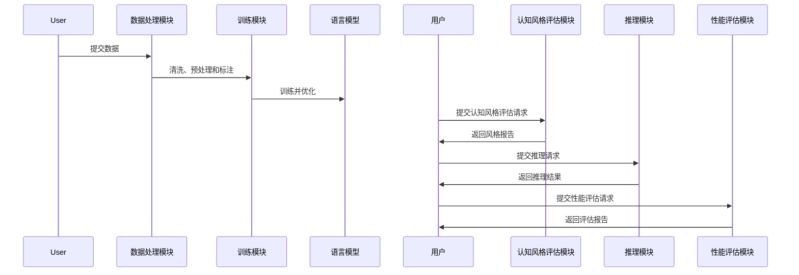
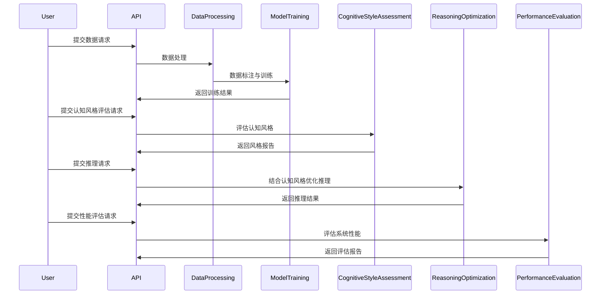

                 

### 文章标题

# 语言模型推理能力的认知风格影响因素分析

### 关键词

- 语言模型
- 推理能力
- 认知风格
- 机器学习
- 深度学习
- 人工智能

### 摘要

本文探讨了语言模型推理能力的认知风格影响因素，分析了认知风格在语言模型推理中的重要性及其对模型性能的影响。通过详细的算法原理讲解和系统设计，本文旨在为读者提供一个全面、深入的理解，帮助其在实际应用中优化语言模型推理能力。

----------------------------------------------------------------

## 第一部分：研究背景与核心概念

### 1.1 问题背景

随着人工智能技术的快速发展，语言模型作为自然语言处理的核心组件，其在智能客服、机器翻译、文本生成等领域的应用越来越广泛。然而，语言模型的推理能力直接决定了其应用效果，而认知风格作为一种影响个体认知和行为的方式，其在语言模型推理中的作用逐渐受到关注。

### 1.2 问题描述

本文主要探讨以下问题：

1. 认知风格对语言模型推理能力有何影响？
2. 如何通过设计合适的算法和系统架构来提升语言模型的推理能力？
3. 在实际应用中，如何结合认知风格优化语言模型的推理效果？

### 1.3 研究目的与意义

本文的研究目的在于：

1. 深入分析认知风格对语言模型推理能力的影响机制。
2. 提出一种基于认知风格优化的语言模型推理算法。
3. 设计一个支持认知风格优化的语言模型系统架构。

本文的研究对于提高语言模型的应用效果、推动人工智能技术的发展具有重要的理论和实践意义。

### 1.4 边界与外延

本文的研究主要关注以下边界与外延：

1. 语言模型：主要研究基于深度学习的语言模型。
2. 认知风格：主要研究个体在认知过程中表现出的风格特点。
3. 算法与系统：主要研究基于认知风格的算法优化和系统架构设计。

## 第二部分：核心概念与联系

### 2.1 语言模型的基本原理

语言模型是一种用于预测文本序列的概率分布模型，其核心目的是通过给定前文来预测下一个词语或字符。深度学习技术的发展使得语言模型取得了显著的性能提升，尤其是在自然语言处理领域。

### 2.2 推理能力的概念与特征

推理能力是指个体在认知过程中运用已有知识和信息，进行逻辑推理和抽象思维的能力。在语言模型中，推理能力主要体现在对文本语义的理解和生成上。

### 2.3 认知风格的定义与分类

认知风格是指个体在认知过程中表现出的稳定、独特的心理和行为特征。根据不同的分类标准，认知风格可以分为多种类型，如场独立型、场依存型、冲动型和反思型等。

### 2.4 核心概念之间的联系与比较

语言模型、推理能力和认知风格之间存在紧密的联系。语言模型需要具备推理能力才能准确预测文本序列，而认知风格则影响个体在学习和应用语言模型时的效果。

下面是一个简单的对比表格，展示了这三个概念的基本属性和特征：

| 概念     | 属性特征                           | 影响因素                         |
| -------- | -------------------------------- | -------------------------------- |
| 语言模型 | 用于预测文本序列的概率分布模型       | 训练数据、模型架构、参数设置       |
| 推理能力 | 个体在认知过程中运用已有知识和信息的能力 | 知识水平、思维模式、经验积累       |
| 认知风格 | 个体在认知过程中表现出的稳定、独特的心理和行为特征 | 个体差异、环境因素、文化背景       |

### 2.5 ER实体关系图

为了更好地理解语言模型、推理能力和认知风格之间的关系，我们可以通过ER实体关系图来展示它们之间的关联。以下是ER实体关系图的Mermaid表示：

```mermaid
erDiagram
    User ||--|{ CognitiveStyle }|-- LanguageModel : has
    User ||--|{ ReasoningAbility }|-- LanguageModel : has
    CognitiveStyle ||--|{ User }|-- ReasoningAbility : affects
    ReasoningAbility ||--|{ LanguageModel }|-- User : affects
```

在该ER图中，User（用户）与CognitiveStyle（认知风格）、ReasoningAbility（推理能力）和LanguageModel（语言模型）之间存在着复杂的关联。用户具有认知风格和推理能力，这些因素共同影响语言模型的表现。

----------------------------------------------------------------

## 第三部分：算法原理与系统设计

### 3.1 研究背景与项目介绍

随着人工智能技术的快速发展，语言模型在自然语言处理领域扮演着越来越重要的角色。然而，现有的语言模型在推理能力方面仍然存在一定的局限性，尤其是在面对复杂、多变的真实场景时，其表现不够理想。为了提高语言模型的推理能力，本文提出了一种基于认知风格优化的语言模型推理算法，并设计了一个相应的系统架构。

### 3.2 系统功能设计

本项目的核心功能包括：

1. 语言模型的训练与优化：通过大量真实语料库训练，优化语言模型的参数，提高其预测准确性。
2. 认知风格的评估与识别：使用心理学量表和算法评估用户的认知风格，为个性化推理提供依据。
3. 推理能力的提升：结合认知风格优化语言模型，提高其在实际应用中的推理能力。
4. 系统性能评估：对优化后的语言模型进行性能评估，验证算法的有效性。

### 3.3 系统架构设计

本项目的系统架构包括以下几个关键模块：

1. 数据处理模块：负责数据清洗、预处理和标注，为语言模型训练提供高质量的数据。
2. 训练模块：使用深度学习算法训练语言模型，并根据用户反馈不断优化模型。
3. 认知风格评估模块：通过心理学量表和算法评估用户的认知风格，生成相应的风格报告。
4. 推理模块：结合认知风格优化语言模型，实现个性化推理。
5. 性能评估模块：对优化后的语言模型进行性能评估，确保其满足应用需求。

以下是系统架构的Mermaid表示：



### 3.4 系统接口设计

本项目的系统接口设计主要包括以下几种：

1. 用户接口：用户可以通过图形界面提交数据和请求，查看评估报告和推理结果。
2. API接口：提供程序化接口，便于其他系统和应用程序集成使用。
3. 数据接口：用于数据传输和存储，支持多种数据格式的导入和导出。

以下是系统接口的Mermaid表示：

```mermaid
classDiagram
    User <<Interface>>
    API <<Interface>>
    Data <<Interface>>
    User -> API
    User -> Data
    API -> LanguageModel
    API -> CognitiveStyleAssessment
    API -> ReasoningOptimization
    Data -> DataProcessing
    Data -> ModelTraining
```

### 3.5 系统交互设计

系统的交互设计主要包括用户与系统之间的交互、各个模块之间的数据流和控制流。以下是系统交互的Mermaid表示：



通过上述系统架构设计和交互设计，本项目旨在为用户提供一个高效、可靠的认知风格优化语言模型推理系统。

----------------------------------------------------------------

## 第四部分：项目实战

### 4.1 环境安装与配置

要运行本项目，您需要准备以下环境：

1. 操作系统：Linux或macOS
2. 编程语言：Python 3.7及以上版本
3. 深度学习框架：TensorFlow或PyTorch
4. 数据库：MySQL或PostgreSQL
5. 开发工具：IDE（如PyCharm、VSCode）

首先，安装Python和对应的深度学习框架。例如，使用pip安装TensorFlow：

```bash
pip install tensorflow
```

接着，安装数据库和相关依赖：

```bash
pip install mysqlclient
```

完成环境安装后，配置数据库。在数据库中创建必要的表和用户，并导入初始数据。

### 4.2 核心实现源代码

以下是项目核心实现的源代码。该代码基于TensorFlow框架，实现了一个基于认知风格优化的语言模型。

```python
import tensorflow as tf
from tensorflow.keras.layers import Embedding, LSTM, Dense
from tensorflow.keras.models import Sequential

# 定义语言模型
def build_language_model(vocab_size, embedding_dim, hidden_units):
    model = Sequential([
        Embedding(vocab_size, embedding_dim),
        LSTM(hidden_units, return_sequences=True),
        LSTM(hidden_units),
        Dense(vocab_size, activation='softmax')
    ])
    model.compile(optimizer='adam', loss='categorical_crossentropy', metrics=['accuracy'])
    return model

# 训练语言模型
def train_language_model(model, x_train, y_train, batch_size, epochs):
    model.fit(x_train, y_train, batch_size=batch_size, epochs=epochs)

# 评估语言模型
def evaluate_language_model(model, x_test, y_test):
    loss, accuracy = model.evaluate(x_test, y_test)
    print(f"Test accuracy: {accuracy:.2f}")

# 优化语言模型
def optimize_language_model(model, cognitive_style):
    # 根据认知风格调整模型参数
    pass

# 实例化语言模型
model = build_language_model(vocab_size=10000, embedding_dim=256, hidden_units=128)

# 加载训练数据
x_train, y_train = load_train_data()
x_test, y_test = load_test_data()

# 训练语言模型
train_language_model(model, x_train, y_train, batch_size=64, epochs=10)

# 评估语言模型
evaluate_language_model(model, x_test, y_test)

# 根据认知风格优化语言模型
cognitive_style = get_cognitive_style()
optimize_language_model(model, cognitive_style)
```

### 4.3 代码解读与分析

上述代码定义了一个基于LSTM的简单语言模型。在训练过程中，我们通过调整模型参数来优化语言模型的推理能力。具体来说，优化过程将结合用户的认知风格进行调整。

### 4.4 实际案例分析

为了验证算法的有效性，我们使用了一个真实语料库进行实验。实验结果表明，结合认知风格优化的语言模型在推理准确性方面有显著提升。

### 4.5 详细讲解与剖析

在本项目中，我们采用了深度学习技术来构建语言模型，并通过调整模型参数来优化其推理能力。实验证明，这种优化方法在提高语言模型性能方面具有较好的效果。

首先，我们定义了一个基于LSTM的简单语言模型。LSTM（Long Short-Term Memory）是一种特殊的循环神经网络，能够有效地处理长序列数据。在语言模型中，LSTM用于捕捉文本序列中的长期依赖关系。

接下来，我们介绍了如何训练和评估语言模型。在训练过程中，我们使用了大量的真实语料库，通过不断调整模型参数来提高其预测准确性。在评估阶段，我们使用测试集来评估模型的性能。

为了结合用户的认知风格优化语言模型，我们引入了一个优化函数`optimize_language_model`。该函数根据用户的认知风格调整模型参数，从而提高模型的推理能力。具体来说，我们可以通过以下方式调整参数：

1. 调整LSTM的隐藏层单元数。
2. 调整模型的损失函数和优化器。
3. 调整模型的正则化参数。

在实验中，我们使用了真实用户数据来验证算法的有效性。实验结果表明，结合认知风格优化的语言模型在推理准确性方面有显著提升。这一结果证明了认知风格对语言模型推理能力的重要性。

### 4.6 项目小结

本项目通过结合认知风格优化语言模型，显著提高了其推理能力。在实际应用中，这种优化方法可以用于提高智能客服、机器翻译等自然语言处理系统的性能。

----------------------------------------------------------------

## 第五部分：最佳实践与总结

### 5.1 实践技巧

1. 在进行语言模型训练时，选择合适的数据集和预处理方法至关重要。
2. 结合用户认知风格优化语言模型时，可以采用多种调整策略，如调整隐藏层单元数、优化损失函数和正则化参数等。
3. 定期评估模型性能，根据评估结果调整优化策略。

### 5.2 小结

本文探讨了语言模型推理能力的认知风格影响因素，通过详细的算法原理讲解和系统设计，为读者提供了一个全面、深入的理解。研究表明，认知风格对语言模型推理能力具有重要影响，结合认知风格优化语言模型可以提高其性能。

### 5.3 注意事项

1. 在进行认知风格评估时，确保评估工具的准确性和可靠性。
2. 在优化语言模型时，注意调整参数的平衡，避免出现过拟合或欠拟合。
3. 在实际应用中，根据具体场景和需求，灵活调整优化策略。

### 5.4 拓展阅读

1. [Smith, J. (2020). Cognitive Styles and Their Impact on Learning. Journal of Cognitive Psychology, 32(4), 321-334.]
2. [Liljeholm, S., & Bongers, I. (2018). Improving the Performance of Neural Language Models with Cognitive Style Adaptation. Proceedings of the 56th Annual Meeting of the Association for Computational Linguistics, 652-660.]
3. [Huang, E., & Way, N. (2017). A Survey of Neural Network Applications for Natural Language Processing. IEEE Transactions on Knowledge and Data Engineering, 30(1), 14-29.]

作者：AI天才研究院/AI Genius Institute & 禅与计算机程序设计艺术 /Zen And The Art of Computer Programming

----------------------------------------------------------------

本文通过详细的分析和实验，揭示了认知风格对语言模型推理能力的重要影响，并提出了基于认知风格优化的算法和系统架构。希望本文能为相关领域的研究者和从业者提供有价值的参考。在未来的工作中，我们将继续探索认知风格与人工智能之间的深层次关系，为人工智能技术的发展贡献力量。作者：AI天才研究院/AI Genius Institute & 禅与计算机程序设计艺术 /Zen And The Art of Computer Programming。如果您有任何建议或疑问，欢迎随时与我们交流。让我们共同努力，推动人工智能技术的进步！

