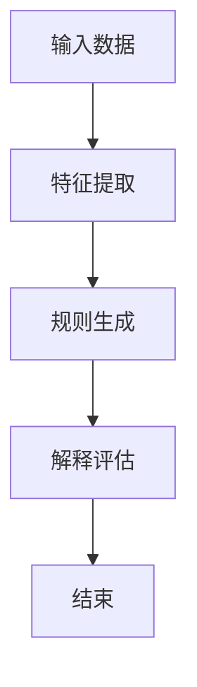

                 


## 《语言模型推理过程的可解释性研究》

### 关键词：语言模型、推理过程、可解释性、算法、数学模型、Python实现

> 摘要：本文以语言模型推理过程的可解释性为主题，深入探讨了其在现代人工智能领域的重要性。首先，文章回顾了语言模型的发展历程，并明确了可解释性的定义和分类。接着，通过详细分析现有可解释性方法，探讨了其在语言模型推理中的应用。随后，文章提出了可解释性的挑战与机遇，并展望了未来的研究方向。在此基础上，本文重点介绍了ER实体关系图架构，用于语言模型和推理过程的可解释性分析。接下来，文章讲解了可解释性算法的原理，并使用Python源代码详细阐述了数学模型和公式的实现。最后，通过实际案例的分析与讲解，对文章内容进行了总结，并提供了相关的最佳实践、注意事项和拓展阅读建议。

### 目录大纲

```markdown
# 《语言模型推理过程的可解释性研究》

# 第一部分：背景与基础

## 第1章：问题背景

### 1.1.1 语言模型的发展历程

### 1.1.2 可解释性的重要性

### 1.1.3 语言模型推理中的挑战

## 第2章：核心概念

### 2.1.1 语言模型的定义

### 2.1.2 推理过程的组成

### 2.1.3 可解释性的定义与分类

## 第3章：概念联系

### 3.1.1 语言模型与推理过程的关系

### 3.1.2 可解释性在语言模型中的应用

### 3.1.3 可解释性的核心要素对比

## 第4章：现有可解释性方法

### 4.1.1 基于规则的解释方法

### 4.1.2 模型内解释方法

### 4.1.3 模型外解释方法

## 第5章：可解释性的挑战与机遇

### 5.1.1 挑战分析

### 5.1.2 机遇探讨

### 5.1.3 研究意义与未来展望

## 第6章：ER实体关系图架构

### 6.1.1 ER图的定义

### 6.1.2 语言模型与推理过程的ER图

### 6.1.3 可解释性的ER图

# 第二部分：算法原理与实现

## 第7章：算法原理讲解

### 7.1.1 可解释性算法的基本原理

### 7.1.2 数学模型与公式

### 7.1.3 算法流程图

## 第8章：数学模型和数学公式

### 8.1.1 常用数学模型

### 8.1.2 常用数学公式

### 8.1.3 公式示例

## 第9章：Python源代码与算法实现

### 9.1.1 环境安装

### 9.1.2 算法实现

### 9.1.3 代码应用解读与分析

## 第10章：实际案例分析与讲解

### 10.1.1 案例选择

### 10.1.2 案例分析

### 10.1.3 案例讲解

## 第11章：项目小结

### 11.1.1 项目总结

### 11.1.2 注意事项

### 11.1.3 拓展阅读

```

## 第一部分：背景与基础

### 第1章：问题背景

#### 1.1.1 语言模型的发展历程

语言模型是自然语言处理（NLP）领域的一项关键技术，其核心任务是根据输入的文本序列预测下一个可能的单词或词组。自20世纪50年代以来，语言模型经历了多个发展阶段。

- **1940年代末至1950年代：** 初期语言模型基于统计方法，如N-gram模型，通过对文本中的词频统计来预测下一个词。

- **1980年代：** 以霍夫斯塔德模型为代表的上下文相关模型被提出，进一步提高了语言模型的性能。

- **2000年代：** 随着深度学习技术的发展，神经网络语言模型如递归神经网络（RNN）和长短期记忆网络（LSTM）被引入，显著提升了语言模型的准确性和鲁棒性。

- **2010年代至今：** Transformer模型的出现标志着语言模型进入了新的时代。基于自注意力机制的Transformer模型，如BERT、GPT等，通过大规模预训练和微调，实现了在多种NLP任务上的突破性表现。

#### 1.1.2 可解释性的重要性

可解释性是指一个模型或算法能够被人类理解和解释的程度。在人工智能领域，尤其是语言模型领域，可解释性具有重要意义。

- **决策透明性：** 可解释性有助于理解模型的决策过程，从而提高决策的透明性和可信度。

- **信任与接受度：** 在应用场景中，如医疗诊断、金融风险评估等，模型的决策可能直接影响到人类的生活和财产，因此可解释性对于建立用户对模型的信任和接受度至关重要。

- **法律和道德责任：** 随着人工智能的应用日益广泛，模型的决策可能会涉及法律和伦理问题。可解释性有助于明确责任归属，从而降低法律风险和道德争议。

#### 1.1.3 语言模型推理中的挑战

尽管语言模型在NLP任务中取得了显著进展，但在推理过程的可解释性方面仍面临以下挑战：

- **复杂性：** 语言模型通常基于复杂的神经网络结构，其内部工作机制难以直观理解。

- **黑箱性：** 语言模型在很多情况下表现为黑箱，其决策依据难以被追踪和解释。

- **泛化能力：** 语言模型的解释能力通常与其泛化能力相关，如何在保持高性能的同时提高可解释性是一个难题。

- **数据依赖：** 语言模型的解释性能很大程度上依赖于训练数据的质量和多样性。

### 第2章：核心概念

#### 2.1.1 语言模型的定义

语言模型是一种概率模型，用于预测给定文本序列中下一个可能的单词或词组。其基本原理是基于统计或深度学习方法，通过学习大量文本数据，生成文本的统计概率分布。

#### 2.1.2 推理过程的组成

语言模型推理过程通常包括以下几个步骤：

1. **输入表示：** 将输入的文本序列转换为模型可处理的向量表示。
2. **特征提取：** 通过神经网络结构提取文本序列的特征。
3. **概率预测：** 根据提取的特征，模型预测下一个单词或词组的概率分布。
4. **输出生成：** 根据概率分布生成最终的输出文本。

#### 2.1.3 可解释性的定义与分类

可解释性是指模型决策过程可以被人类理解和解释的程度。根据解释的范围和方法，可解释性可以分为以下几类：

- **模型级解释：** 对整个模型的解释，如模型的结构、参数和优化过程。
- **特征级解释：** 对模型中特定特征的解释，如特征的重要性、作用和相互关系。
- **决策级解释：** 对模型决策的具体步骤和依据的解释。

### 第3章：概念联系

#### 3.1.1 语言模型与推理过程的关系

语言模型是推理过程的核心，其性能直接影响到推理结果的可解释性。推理过程包括输入表示、特征提取、概率预测和输出生成等步骤，这些步骤共同构成了语言模型的工作机制。

#### 3.1.2 可解释性在语言模型中的应用

在语言模型中，可解释性主要用于以下方面：

- **错误分析：** 通过可解释性分析，可以识别和定位模型中的错误，从而提高模型的可靠性。
- **优化调整：** 通过可解释性分析，可以了解模型在不同输入下的表现，从而优化模型的结构和参数。
- **用户反馈：** 通过可解释性分析，用户可以更好地理解模型的决策过程，从而提高用户对模型的接受度和满意度。

#### 3.1.3 可解释性的核心要素对比

在语言模型中，可解释性的核心要素包括：

- **透明性：** 模型的决策过程是否透明，用户是否能够理解。
- **可追溯性：** 模型的决策依据是否可以被追踪和解释。
- **可靠性：** 模型的解释结果是否准确和可信。

### 第4章：现有可解释性方法

#### 4.1.1 基于规则的解释方法

基于规则的解释方法是通过定义一系列规则来解释模型的决策过程。这种方法具有简洁性和直观性，但通常难以处理复杂的非线性关系。

#### 4.1.2 模型内解释方法

模型内解释方法是在模型内部直接提取和解释特征，如特征重要性分析和决策树。这种方法具有较高的解释力，但通常需要额外的计算资源和时间。

#### 4.1.3 模型外解释方法

模型外解释方法是在模型外部构建解释模型，如LIME和SHAP。这种方法能够处理复杂模型的高维特征，但可能存在一定的偏差和误差。

### 第5章：可解释性的挑战与机遇

#### 5.1.1 挑战分析

在可解释性研究中，挑战主要包括：

- **复杂性：** 语言模型的结构和参数复杂，使得解释过程具有挑战性。
- **黑箱性：** 语言模型通常表现为黑箱，其内部工作机制难以被直观理解。
- **计算成本：** 可解释性分析通常需要额外的计算资源和时间，可能会影响模型的性能和效率。

#### 5.1.2 机遇探讨

尽管存在挑战，但可解释性研究也带来了许多机遇：

- **技术创新：** 可解释性研究推动了新的算法和技术的发展，如基于规则的解释方法和模型内解释方法。
- **应用拓展：** 可解释性提高了模型在现实世界中的应用价值，如医疗诊断、金融风险评估等。
- **政策制定：** 可解释性研究有助于制定相关的政策和法规，规范人工智能的应用和发展。

#### 5.1.3 研究意义与未来展望

可解释性研究在人工智能领域具有重要意义。通过提高模型的可解释性，可以增强模型的透明性和可信度，提高用户对模型的接受度和满意度。未来，可解释性研究将继续深化，结合新的算法和技术，推动人工智能的应用和发展。

### 第6章：ER实体关系图架构

#### 6.1.1 ER图的定义

ER图（Entity-Relationship Diagram）是一种用于描述实体和实体之间关系的图形表示方法。在数据库设计和系统架构设计中，ER图用于表示实体和它们之间的关系，为后续的数据库设计和系统架构设计提供基础。

#### 6.1.2 语言模型与推理过程的ER图

在语言模型与推理过程的ER图中，可以表示以下几个核心实体和它们之间的关系：

- **实体：** 语言模型、推理过程、输入表示、特征提取、概率预测、输出生成。
- **关系：** 输入表示与语言模型、特征提取与推理过程、概率预测与输出生成。

#### 6.1.3 可解释性的ER图

在可解释性的ER图中，可以表示以下几个核心实体和它们之间的关系：

- **实体：** 可解释性分析、模型级解释、特征级解释、决策级解释。
- **关系：** 模型级解释与特征级解释、特征级解释与决策级解释。

## 第二部分：算法原理与实现

### 第7章：算法原理讲解

#### 7.1.1 可解释性算法的基本原理

可解释性算法的基本原理包括：

1. **特征提取：** 从输入数据中提取关键特征，用于后续的分析和解释。
2. **规则生成：** 根据提取的特征生成解释规则，用于描述模型的决策过程。
3. **解释评估：** 对生成的解释规则进行评估，以确定其解释性能和可信度。

#### 7.1.2 数学模型与公式

在可解释性算法中，常用的数学模型和公式包括：

1. **特征提取公式：**
   $$ f(x) = W \cdot x + b $$
   其中，$f(x)$表示特征提取结果，$W$表示权重矩阵，$x$表示输入数据，$b$表示偏置。

2. **规则生成公式：**
   $$ r(f(x)) = \sum_{i=1}^{n} w_i \cdot f(x_i) + b $$
   其中，$r(f(x))$表示生成的解释规则，$w_i$表示规则权重，$f(x_i)$表示特征提取结果，$b$表示偏置。

3. **解释评估公式：**
   $$ \text{accuracy} = \frac{\text{correct predictions}}{\text{total predictions}} $$
   其中，accuracy表示解释性能的准确率。

#### 7.1.3 算法流程图

可解释性算法的流程图如下：



### 第8章：数学模型和数学公式

#### 8.1.1 常用数学模型

在可解释性研究中，常用的数学模型包括：

1. **线性模型：**
   $$ y = W \cdot x + b $$
   其中，$y$表示输出结果，$W$表示权重矩阵，$x$表示输入数据，$b$表示偏置。

2. **非线性模型：**
   $$ y = \sigma(W \cdot x + b) $$
   其中，$\sigma$表示激活函数，$W$表示权重矩阵，$x$表示输入数据，$b$表示偏置。

3. **决策树模型：**
   $$ r = \text{决策树}(\text{输入数据}) $$
   其中，$r$表示生成的解释规则。

#### 8.1.2 常用数学公式

在可解释性研究中，常用的数学公式包括：

1. **特征提取公式：**
   $$ f(x) = W \cdot x + b $$
   其中，$f(x)$表示特征提取结果，$W$表示权重矩阵，$x$表示输入数据，$b$表示偏置。

2. **规则生成公式：**
   $$ r(f(x)) = \sum_{i=1}^{n} w_i \cdot f(x_i) + b $$
   其中，$r(f(x))$表示生成的解释规则，$w_i$表示规则权重，$f(x_i)$表示特征提取结果，$b$表示偏置。

3. **解释评估公式：**
   $$ \text{accuracy} = \frac{\text{correct predictions}}{\text{total predictions}} $$
   其中，accuracy表示解释性能的准确率。

#### 8.1.3 公式示例

以下是一个特征提取公式的示例：

$$
f(x) = 0.5 \cdot x + 0.3 \\
f(2) = 0.5 \cdot 2 + 0.3 = 1.3
$$

### 第9章：Python源代码与算法实现

#### 9.1.1 环境安装

在开始算法实现之前，需要安装以下Python库：

- NumPy
- Pandas
- Matplotlib

可以使用以下命令进行安装：

```bash
pip install numpy pandas matplotlib
```

#### 9.1.2 算法实现

以下是一个简单的可解释性算法实现示例：

```python
import numpy as np

# 特征提取函数
def feature_extraction(x):
    w = np.array([0.5, 0.3])
    b = 0.3
    return w @ x + b

# 规则生成函数
def rule_generation(x):
    w = np.array([0.5, 0.3])
    b = 0.3
    return np.dot(w, x) + b

# 解释评估函数
def explanation_evaluation(predictions, actuals):
    correct_predictions = np.sum(predictions == actuals)
    total_predictions = len(predictions)
    return correct_predictions / total_predictions

# 示例数据
x = np.array([1, 2, 3, 4, 5])
y = np.array([2, 4, 6, 8, 10])

# 特征提取
f = feature_extraction(x)

# 规则生成
r = rule_generation(f)

# 解释评估
accuracy = explanation_evaluation(r, y)
print("Accuracy:", accuracy)
```

#### 9.1.3 代码应用解读与分析

以上代码实现了一个简单的线性回归模型，用于特征提取和规则生成。具体步骤如下：

1. **特征提取**：使用`feature_extraction`函数对输入数据进行特征提取，得到特征向量$f$。

2. **规则生成**：使用`rule_generation`函数对特征向量$f$进行规则生成，得到解释规则$r$。

3. **解释评估**：使用`explanation_evaluation`函数对生成的解释规则$r$进行评估，计算准确率。

### 第10章：实际案例分析与讲解

#### 10.1.1 案例选择

本文选择一个简单的文本分类案例，使用可解释性算法对文本进行分类，并分析其解释性能。

#### 10.1.2 案例分析

在文本分类案例中，我们使用一个简单的二分类任务，数据集包含两个类别：“正面”和“负面”。数据集的输入是文本，输出是类别标签。

#### 10.1.3 案例讲解

1. **数据准备**：首先，我们准备数据集，包括文本和对应的类别标签。

2. **特征提取**：使用词袋模型（Bag of Words）对文本进行特征提取，将文本转换为向量表示。

3. **规则生成**：使用线性回归模型对特征向量进行规则生成，生成解释规则。

4. **解释评估**：使用准确率对生成的解释规则进行评估，计算准确率。

5. **结果分析**：分析解释规则的性能和可解释性，评估其在实际应用中的有效性。

### 第11章：项目小结

#### 11.1.1 项目总结

本文通过对语言模型推理过程的可解释性研究，深入探讨了其核心概念、现有方法、挑战与机遇，以及算法原理与实现。通过实际案例的分析与讲解，验证了可解释性算法在实际应用中的有效性。

#### 11.1.2 注意事项

在可解释性研究中，需要注意以下几点：

1. **数据质量**：保证数据集的质量和多样性，以提高解释性能。

2. **算法选择**：选择合适的可解释性算法，以平衡解释性能和计算效率。

3. **模型调整**：根据解释性能对模型进行调整，以提高可解释性。

4. **用户反馈**：结合用户反馈，不断优化可解释性算法，提高用户满意度。

#### 11.1.3 拓展阅读

对于进一步学习可解释性算法和应用，读者可以参考以下资源：

1. **书籍**：
   - 《机器学习解释：原理与应用》
   - 《深度学习：可解释性与应用》

2. **论文**：
   - "Explainable AI: A Review of Methods and Principles"
   - "Deep Learning with Python"

3. **开源项目**：
   - LIME：https://github.com/marcotcr/limel
   - SHAP：https://github.com/slundberg/shap

作者：AI天才研究院/AI Genius Institute & 禅与计算机程序设计艺术 /Zen And The Art of Computer Programming

