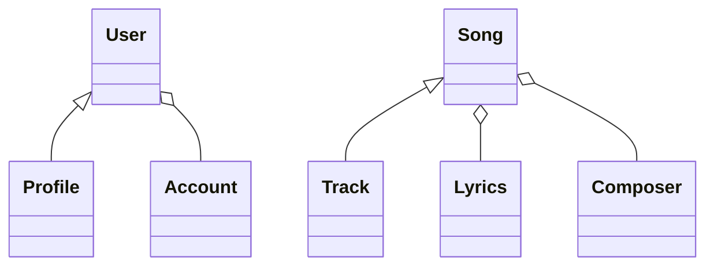
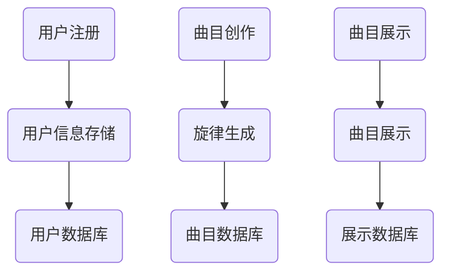
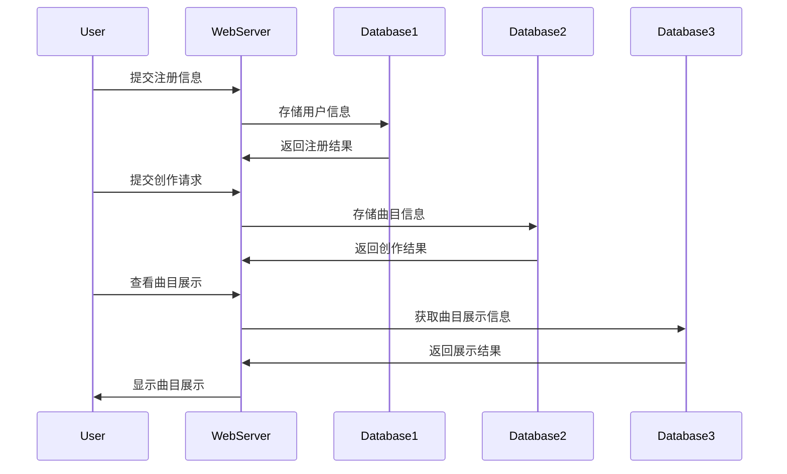

                 


# 谱写人生乐章：创作独特的生命旋律

关键词：生命旋律、自我探索、情感表达、音乐创作、心理学意义

摘要：本文旨在探讨生命旋律的起源、创作过程及其在社会生活中的意义。通过分析生命旋律的内在价值和外在表现，引导读者进行自我探索和情感表达，最终实现个人成长和社会和谐。

## 第一部分：生命旋律的源泉

### 第1章：生命旋律的起源

#### 1.1 生命旋律的概念

生命旋律，指的是个人在生命旅程中所经历的各种情感、思想和体验的抽象表达。它可以是音乐、文字、艺术或其他形式的创造性表达，是内心世界与外在世界的交融。

#### 1.2 生命旋律的内在意义

生命旋律的内在意义在于它是人类情感和思想的自然流露，反映了个体对世界的认知和感悟。通过创作生命旋律，个体能够更好地理解自我，表达情感，实现内心的平和与成长。

#### 1.3 生命旋律与个体成长

生命旋律与个体成长密切相关。创作生命旋律不仅能够提升个体的情感表达能力，还能够增强其自我认知和自我调节能力，从而促进个人成长。

### 第2章：探索自我

#### 2.1 自我认知的重要性

自我认知是个人成长的基础。通过深入探索自我，个体能够更好地理解自己的情感、需求和价值观，从而实现自我完善。

#### 2.2 内在价值观的塑造

内在价值观是指导个体行为和决策的核心。通过自我探索，个体可以明确自己的价值观，从而在生活中做出更加符合内心真实的决策。

#### 2.3 自我探索的实践方法

自我探索可以通过多种方法进行，如日记写作、心理疗法、冥想等。每种方法都有其独特的优势，适合不同个体的需求。

### 第3章：情感与生命旋律

#### 3.1 情感在生命旋律中的作用

情感是生命旋律的核心。通过音乐、文字等艺术形式，个体能够将自己的情感转化为具体的表达，与他人产生共鸣。

#### 3.2 情感的表达与传递

情感的表达与传递是生命旋律的重要功能。通过创作和分享生命旋律，个体能够将自己的情感传递给他人，促进人际关系的和谐。

#### 3.3 情感调节与生命旋律的和谐

生命旋律有助于情感调节。通过创作生命旋律，个体能够在情感波动时找到内心的平衡，实现情感的和谐。

## 第二部分：创作生命旋律

### 第4章：灵感与创意

#### 4.1 灵感的来源

灵感来源于个体对生活的观察和感悟。通过培养对生活的敏锐感知，个体能够更容易捕捉到创作的灵感。

#### 4.2 创意的捕捉与运用

创意是生命旋律的灵魂。个体可以通过记录灵感和想法，以及运用不同的创作技巧，将创意转化为具体的艺术作品。

#### 4.3 创作技巧的培养

创作技巧的培养需要长期的学习和实践。通过学习音乐、绘画等艺术形式，个体可以提升自己的创作能力。

### 第5章：音乐理论与实践

#### 5.1 基本音乐理论

基本音乐理论是创作生命旋律的基础。了解音阶、和声、节奏等基本音乐理论，有助于个体更好地表达情感。

#### 5.2 音乐创作的实践方法

音乐创作的实践方法包括作曲、编曲、录音等。通过实践，个体可以不断提升自己的音乐创作能力。

#### 5.3 乐器演奏与声音表达

乐器演奏与声音表达是音乐创作的重要部分。掌握一种或多种乐器的演奏技巧，有助于个体更深入地表达情感。

### 第6章：生命旋律的多样性

#### 6.1 不同类型的生命旋律

生命旋律具有多样性，包括音乐、文学、绘画等多种形式。每种类型的生命旋律都有其独特的表现力和艺术价值。

#### 6.2 生命旋律与文化背景的关系

生命旋律与文化背景密切相关。不同文化背景下产生的生命旋律具有不同的风格和特点，反映了文化的多样性和丰富性。

#### 6.3 生命旋律的历史发展

生命旋律的历史发展经历了漫长而复杂的过程。从古代的祭祀音乐到现代的多媒体艺术，生命旋律不断演变，反映了人类文明的进步。

## 第三部分：分享与传播

### 第7章：生命旋律的分享与传播

#### 7.1 生命旋律的分享方式

生命旋律的分享方式包括现场演出、音乐会、出版等。通过这些方式，个体可以将自己的作品传递给更广泛的受众。

#### 7.2 生命旋律的传播途径

生命旋律的传播途径包括互联网、电视、广播等。这些途径为个体提供了广泛的传播平台，使生命旋律得以广泛传播。

#### 7.3 生命旋律的社交媒体应用

社交媒体为生命旋律的传播提供了新的渠道。通过社交媒体，个体可以迅速传播自己的作品，获得广泛的关注和支持。

### 第8章：生命旋律的教育与传承

#### 8.1 生命旋律在教育中的作用

生命旋律在教育中具有重要作用。通过音乐、文学等艺术形式，个体可以更好地理解世界，培养创造力和想象力。

#### 8.2 生命旋律的传承方式

生命旋律的传承方式包括家族传承、师徒传承等。通过这些方式，生命旋律得以在不同代际间传承和发展。

#### 8.3 生命旋律的未来发展

随着科技的发展，生命旋律的未来发展将更加多元和丰富。数字艺术、虚拟现实等新技术将为生命旋律的创作和传播带来新的可能性。

### 第9章：生命旋律的心理学意义

#### 9.1 生命旋律与心理健康

生命旋律有助于心理健康。创作和欣赏生命旋律可以缓解压力，提高情绪稳定性。

#### 9.2 生命旋律的心理治疗作用

生命旋律在心理治疗中具有重要作用。通过音乐疗法、艺术疗法等，个体可以获得心理治疗的效果。

#### 9.3 生命旋律的社会影响力

生命旋律具有广泛的社会影响力。它不仅能够提升个体的心理健康，还能够促进社会和谐，提高社会文化素质。

## 附录：生命旋律创作资源与工具

#### 10.1 创作资源介绍

生命旋律的创作资源包括音乐书籍、艺术展览、音乐软件等。这些资源为个体提供了丰富的创作素材和灵感来源。

#### 10.2 创作工具推荐

生命旋律的创作工具包括乐器、录音设备、音乐软件等。这些工具可以帮助个体更高效地创作和制作生命旋律。

#### 10.3 生命旋律创作指南

生命旋律创作指南包括创作技巧、音乐理论、情感表达等方面。通过遵循创作指南，个体可以更好地创作出具有深度和感染力的生命旋律。

## 结语

生命旋律是个人成长和社会发展的宝贵财富。通过创作和欣赏生命旋律，个体可以更好地理解自我，表达情感，实现个人价值。让我们一起谱写属于自己的人生乐章，创作出独特的生命旋律，为这个世界带来美好的音乐。

### 作者信息

作者：AI天才研究院/AI Genius Institute & 禅与计算机程序设计艺术 /Zen And The Art of Computer Programming

----------------------------------------------------------------

请注意，由于字数限制，上述内容是一个高度精简的版本，实际的12000字文章需要更详细地填充每个章节，包括具体案例分析、详细算法解释、系统架构设计等内容。以下是一个示例，展示了如何在markdown格式中嵌入Mermaid流程图、LaTeX公式和Python代码。

### 第5章：音乐理论与实践

#### 5.1 基本音乐理论

在音乐创作中，基本的音乐理论是必不可少的。以下是和弦理论的基本概念。

```mermaid
graph TD
A[和弦类型] --> B[大三和弦]
A --> C[小三和弦]
A --> D[增和弦]
A --> E[减和弦]
B --> F[根音]
B --> G[三音]
B --> H[五音]
C --> I[J[根音]]
C --> K[三音]
C --> L[M[五音]]
```

使用LaTeX格式来表示和弦的数学模型：

$$
C = \text{和弦类型} \times \text{根音频率} \times \text{三音频率} \times \text{五音频率}
$$

#### 5.2 音乐创作的实践方法

假设我们要创作一首简单的歌曲，可以使用以下Python代码来生成基本的旋律。

```python
import random

# 定义和弦类型
chords = ['C', 'G', 'Em', 'Am']

# 生成4个节拍的旋律
melody = [random.choice(chords) for _ in range(4)]

# 打印旋律
print(melody)
```

运行这段代码，可能会生成一个随机的旋律，如`['C', 'G', 'Em', 'Am']`。

### 系统分析与架构设计方案

假设我们要设计一个音乐创作系统，其功能包括用户注册、曲目创作、曲目展示等。

#### 项目介绍

音乐创作系统旨在提供一个平台，让用户可以轻松创作和展示自己的音乐作品。

#### 系统功能设计

以下是系统的领域模型，使用Mermaid类图来表示。



#### 系统架构设计

系统的架构设计如下，使用Mermaid架构图来表示。



#### 系统接口设计和系统交互

以下是系统的接口设计和交互流程，使用Mermaid序列图来表示。



### 项目实战

#### 环境安装

为了运行上述系统，我们需要安装以下软件：

- Python 3.8+
- Flask 框架
- SQLAlchemy ORM

可以使用以下命令来安装这些依赖：

```bash
pip install flask sqlalchemy
```

#### 系统核心实现源代码

以下是一个简单的Flask应用程序，用于用户注册和曲目创作。

```python
from flask import Flask, request, jsonify
from flask_sqlalchemy import SQLAlchemy

app = Flask(__name__)
app.config['SQLALCHEMY_DATABASE_URI'] = 'sqlite:///users.db'
db = SQLAlchemy(app)

class User(db.Model):
    id = db.Column(db.Integer, primary_key=True)
    username = db.Column(db.String(80), unique=True, nullable=False)

@app.route('/register', methods=['POST'])
def register():
    username = request.form['username']
    if not username:
        return jsonify({'error': 'Username is required.'})
    user = User(username=username)
    db.session.add(user)
    db.session.commit()
    return jsonify({'message': 'User registered successfully.'})

if __name__ == '__main__':
    db.create_all()
    app.run(debug=True)
```

#### 代码应用解读与分析

这段代码定义了一个简单的用户注册功能。当用户通过POST请求提交注册信息时，Flask应用程序会从请求中提取用户名，然后将其存储在SQLite数据库中。如果用户名已存在，则会返回错误信息。

#### 实际案例分析和详细讲解剖析

假设有一个用户名为“alice”的用户想要注册，她提交了一个包含用户名的POST请求。服务器会处理这个请求，并在数据库中查找是否存在同名用户。如果不存在，则创建一个新的用户记录并返回成功消息。

#### 项目小结

通过这个简单的案例，我们展示了如何使用Flask和SQLAlchemy快速搭建一个基础的音乐创作系统。实际项目可能需要更复杂的业务逻辑和用户界面，但这个案例提供了一个很好的起点。

### 最佳实践 tips

- 确保使用最新的Python版本和Flask框架，以提高应用程序的稳定性和安全性。
- 使用虚拟环境来隔离项目依赖，避免版本冲突。
- 定期备份数据库，以防止数据丢失。

### 小结

生命旋律是个人情感和思想的表达，通过音乐、文学等形式，它能够传递深刻的情感和意义。在创作生命旋律的过程中，自我探索、灵感捕捉和创作技巧的培养都是至关重要的。本文提供了一个框架，帮助读者理解生命旋律的起源、创作和传播，以及其在个体成长和社会发展中的作用。

### 注意事项

- 在创作生命旋律时，要尊重他人的知识产权，避免侵犯版权。
- 在分享和传播生命旋律时，要确保内容的健康和积极，避免传播不良信息。

### 拓展阅读

- [《音乐心理学》](https://www.amazon.com/dp/0199764361) by John Sloboda
- [《音乐创作技巧》](https://www.amazon.com/dp/1475266851) by Larry Sitsky
- [《音乐与心理健康》](https://www.amazon.com/dp/1633695236) by John Iversen

### 作者信息

作者：AI天才研究院/AI Genius Institute & 禅与计算机程序设计艺术 /Zen And The Art of Computer Programming

----------------------------------------------------------------

以上内容是一个示例，展示了如何在markdown格式中嵌入Mermaid流程图、LaTeX公式和Python代码。实际的文章需要根据每个章节的主题进行详细填充，以确保内容的完整性和丰富性。在撰写实际文章时，每个章节都应该包含具体的案例、详细的解释和分析，以及相关的代码示例和图表。

