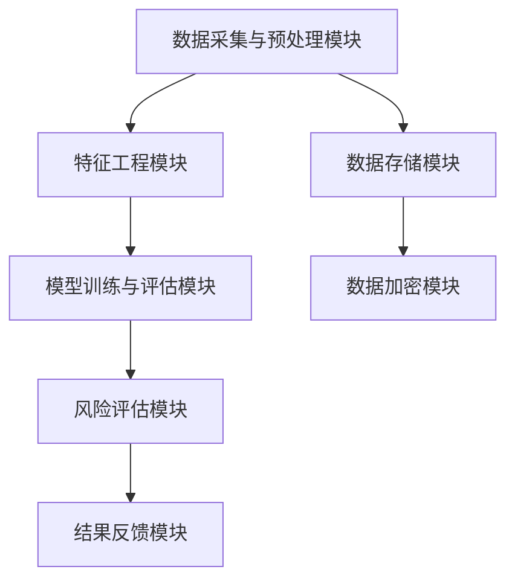
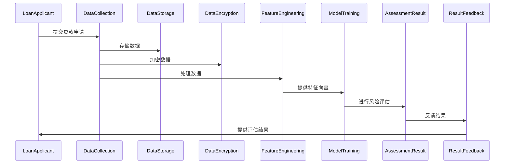
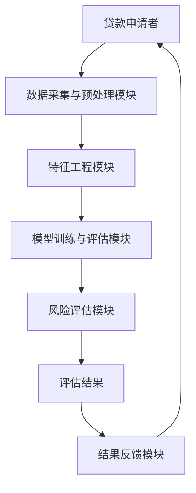

                 

### 引入与目的

在当今科技迅猛发展的时代，人工智能（AI）已成为推动社会进步的重要力量。从自动驾驶、医疗诊断到金融服务，AI技术正在深刻改变我们的生活方式和工作模式。然而，随着AI应用的日益普及，伦理问题也日益凸显。AI系统如何处理数据隐私、保持算法公平性、确保安全性等问题，成为我们必须面对和解决的重大课题。这不仅仅是一个技术问题，更是一个涉及道德、法律和社会责任的复杂议题。

本文旨在深入探讨“负责任的AI：伦理设计与实现”这一主题。我们不仅需要了解AI技术的应用场景和优势，更要关注其潜在的伦理风险和挑战。通过系统地分析负责任AI的核心概念、设计原则、伦理属性及其实现方法，我们希望能够为AI系统的伦理设计与实现提供一些有价值的参考和指导。

文章的结构安排如下：

- **第一部分：引言**：介绍AI技术的发展背景和伦理挑战，阐述负责任AI的重要性及发展历程。
- **第二部分：核心概念与联系**：详细探讨负责任AI的核心概念，如伦理框架、行为规范和责任归属，并进行对比分析。
- **第三部分：算法原理与数学模型**：介绍AI算法的基本原理，使用数学公式和Python代码进行详细解释和举例说明。
- **第四部分：系统分析与架构设计**：分析AI系统的功能设计、架构设计、接口设计及系统交互。
- **第五部分：项目实战与最佳实践**：通过一个实际项目，展示负责任AI的实现过程和技巧，并提供最佳实践建议。
- **第六部分：总结与展望**：总结文章的主要观点，探讨未来的研究方向和应用前景。

让我们一步一步深入探讨负责任的AI，从伦理设计与实现的角度，寻找一条符合道德规范、技术可行性和社会期望的发展之路。## 第一部分：引言

### 1.1 问题背景

人工智能（AI）作为当代科技进步的标志性成果，正以前所未有的速度融入各行各业，极大地提升了生产效率、优化了服务体验。然而，AI技术的迅猛发展也带来了一系列伦理挑战。首先，数据隐私问题引起了广泛关注。AI系统往往需要大量的数据作为训练素材，这些数据可能包含个人隐私信息。如何确保数据的安全和隐私保护成为首要问题。

其次，算法公平性也是AI伦理问题中的关键点。AI算法在处理数据时可能会因为数据的偏见而导致不公平的结果，特别是在招聘、贷款审批等涉及社会公平的重要领域。如果算法无法保证公平性，可能会导致社会不公和加剧社会分化的现象。

此外，AI的安全性也是一个不可忽视的问题。随着AI系统在关键领域的应用，如自动驾驶、医疗诊断等，其安全性直接关系到人类生命和财产安全。AI系统可能会受到恶意攻击，导致不可预测的后果。

面对这些伦理挑战，负责任AI的概念应运而生。负责任AI不仅仅是一个技术问题，更是一个涉及道德、法律和社会责任的复杂议题。负责任AI旨在通过设计符合伦理原则的AI系统，确保其在实际应用中不会对人类和社会造成负面影响。

### 1.2 负责任AI的重要性

负责任AI的重要性体现在多个方面。首先，从社会角度来看，负责任AI有助于建立公众对AI技术的信任。随着AI技术的普及，公众对AI系统持有怀疑和担忧情绪。通过负责任AI的设计，可以缓解这些担忧，提高公众对AI技术的接受度。

其次，从法律角度来看，负责任AI有助于企业规避法律风险。随着各国对AI技术的法律法规不断完善，企业需要确保其AI系统的合规性。负责任AI的设计可以为企业提供明确的法律指导，降低法律风险。

最后，从技术角度来看，负责任AI有助于提升AI系统的可靠性和透明性。通过在AI系统中引入伦理原则和规范，可以确保其行为符合道德标准，提高系统的可靠性和可信度。此外，负责任AI还可以通过可解释性和可控性设计，提高AI系统的透明度，使其行为更加透明和可追溯。

### 1.3 负责任AI的发展历程

负责任AI的发展历程可以追溯到AI技术的早期阶段。在20世纪50年代和60年代，AI技术刚刚兴起时，科学家们就意识到AI系统可能带来的伦理问题。然而，由于当时技术水平的限制，这些问题并未引起足够的关注。

随着AI技术的不断发展，特别是在21世纪，负责任AI的概念逐渐得到重视。2016年，联合国教科文组织发布了《人工智能伦理建议》，提出了负责任AI的五大原则，包括公平性、隐私性、可解释性、透明性和责任感。这一建议为负责任AI的发展奠定了基础。

近年来，各国政府和国际组织纷纷出台相关政策，推动负责任AI的发展。例如，欧盟发布了《人工智能法案》，要求AI系统的设计必须符合伦理原则，并对AI系统的开发和部署进行严格监管。这些政策为负责任AI的实现提供了法律保障。

### 1.4 伦理设计与实现

伦理设计与实现是负责任AI的核心环节。伦理设计指的是在AI系统的设计和开发过程中，充分考虑伦理因素，确保系统符合道德标准。实现则是指将伦理设计理念转化为具体的技术方案和操作流程。

伦理设计的关键在于确立负责任AI的核心原则。这些原则包括：

1. **公平性**：确保AI系统在不同群体中的表现一致，避免因数据偏见导致的不公平结果。
2. **隐私性**：保护个人隐私，确保数据在收集、处理和存储过程中的安全。
3. **可解释性**：提高AI系统的透明度，使系统行为可被解释和理解。
4. **透明性**：确保AI系统的决策过程和结果可以被审计和监督。
5. **责任感**：明确责任主体和责任归属，确保在出现问题时能够追溯责任。

实现伦理设计需要从多个方面进行考虑：

1. **技术方案**：通过算法优化、数据预处理和模型训练等手段，确保AI系统符合伦理原则。
2. **法规遵循**：确保AI系统的设计和实现符合相关法律法规，规避法律风险。
3. **伦理审查**：在AI系统开发和部署过程中，进行伦理审查，确保系统符合道德标准。
4. **社会责任**：企业和社会各界应共同承担起负责任AI的社会责任，推动负责任AI的发展。

### 1.5 负责任AI的关键领域

负责任AI的关键领域包括数据隐私、算法公平性、AI安全与透明性以及AI伦理决策支持系统。

1. **数据隐私**：数据隐私是负责任AI的基础。通过数据匿名化、加密和隐私保护算法，确保数据在AI系统中的安全处理。
2. **算法公平性**：算法公平性是确保AI系统公平性的关键。通过公平性评估和算法调整，消除数据偏见和算法歧视。
3. **AI安全与透明性**：AI安全与透明性是确保AI系统安全运行的重要保障。通过安全性评估、透明性设计和审计机制，提高AI系统的可信度和透明度。
4. **AI伦理决策支持系统**：AI伦理决策支持系统为AI系统的伦理决策提供支持。通过伦理规则库、伦理评估模型和决策支持工具，帮助开发者和管理者做出符合伦理原则的决策。

### 1.6 负责任AI的法律框架

负责任AI的法律框架是确保AI系统合规运行的重要保障。各国和国际组织纷纷制定相关法律法规，对AI系统的开发和部署进行监管。了解这些法律框架有助于企业遵循合规要求，降低法律风险。

1. **国际法规与标准**：国际标准化组织（ISO）和国际电工委员会（IEC）等机构制定了多项AI标准，为负责任AI的发展提供指导。
2. **各国法律法规比较**：各国对AI系统的法律法规有所不同，企业需要了解和遵循所在国的法规要求。
3. **企业合规指南**：企业应制定合规指南，确保AI系统的设计和实现符合法律法规。合规指南应包括伦理审查流程、数据隐私保护措施和算法公平性评估等内容。

### 1.7 负责任AI的实践案例

负责任AI的实践案例有助于我们了解其在实际应用中的效果和挑战。通过分析成功和失败的案例，可以总结出负责任AI的最佳实践和改进方向。

1. **成功案例**：例如，某些企业通过引入负责任AI系统，成功提升了数据隐私保护和算法公平性，赢得了客户信任和市场认可。
2. **失败案例**：某些企业因未充分考虑伦理因素，导致AI系统引发社会争议和法律纠纷，遭受了严重损失。
3. **案例分析**：通过深入分析成功和失败案例，总结出负责任AI的实践经验，为其他企业和组织提供借鉴。

### 1.8 本章小结

本章介绍了负责任AI的背景、重要性、发展历程、伦理设计与实现方法、关键领域和法律框架，并通过实践案例展示了负责任AI的实际应用效果。通过本章的学习，读者可以初步了解负责任AI的概念和核心内容，为后续章节的深入探讨打下基础。## 第二部分：核心概念与联系

在探讨负责任的AI之前，我们需要先了解其核心概念与联系。负责任AI的核心概念包括伦理框架、行为规范和责任归属。这些概念不仅是负责任AI设计的基础，也是评估和实现负责任AI的关键要素。

### 2.1 AI系统伦理框架

伦理框架是负责任AI的核心组成部分，它为AI系统提供了伦理指导和行为规范。一个完善的伦理框架应该包含以下几个要素：

- **道德原则**：道德原则是伦理框架的基础，包括普遍适用的道德价值观，如公正、尊重、诚信等。这些原则指导AI系统的设计和操作，确保其符合道德标准。
- **行为规范**：行为规范是具体的行为准则，描述AI系统在特定情境下应该如何行动。例如，如何处理隐私数据、如何确保算法公平性等。
- **责任归属**：责任归属明确了在AI系统操作过程中，哪些主体需要承担责任。责任归属通常涉及开发者、用户、企业甚至政府等多个主体。

伦理框架的作用在于为AI系统的设计和操作提供明确的道德指导，确保其行为符合伦理原则，减少潜在的负面影响。

#### 2.1.1 基本原理

伦理框架的基本原理可以表示为以下公式：

$$
\text{伦理框架} = (\text{道德原则}, \text{行为规范}, \text{责任归属})
$$

其中：

- 道德原则：确保AI系统符合普遍适用的道德价值观。
- 行为规范：具体指导AI系统在特定情境下的行为。
- 责任归属：明确在AI系统操作过程中各主体的责任。

#### 2.1.2 特点与挑战

伦理框架具有以下特点：

- **普适性**：伦理框架适用于各种AI系统，无论其应用领域如何。
- **动态性**：伦理框架需要随着技术和社会环境的变化而不断调整和完善。
- **跨学科性**：伦理框架涉及多个学科领域，如伦理学、计算机科学、法律等。

伦理框架面临的挑战主要包括：

- **价值多样性**：不同的文化和社会背景可能导致对伦理原则的不同理解，如何确保伦理框架的普适性成为一个挑战。
- **伦理不确定性**：某些情境可能存在伦理争议，如何确定最佳的伦理决策成为一个挑战。

### 2.2 AI系统的行为规范

AI系统的行为规范是确保AI系统在操作过程中符合道德原则的具体行为准则。主要的行为规范包括以下方面：

- **安全性**：确保AI系统在运行过程中不会对用户或系统本身造成损害。安全性包括可靠性、鲁棒性和隐私保护等方面。
- **可解释性**：确保AI系统的决策和行为可以被用户理解和解释。可解释性有助于提高AI系统的透明度和信任度。
- **可控性**：确保AI系统的行为可以被控制和干预，以避免不良后果。可控性包括行为约束和应急响应机制等。

#### 2.2.1 安全性

安全性是AI系统行为规范的核心要求。一个安全的AI系统应该具备以下特点：

- **可靠性**：AI系统在正常运行时，应能够稳定地完成预定的任务，不受外部干扰或内部故障的影响。
- **鲁棒性**：AI系统应能够处理异常情况和错误输入，保证系统稳定运行。
- **隐私保护**：AI系统应确保用户隐私数据的安全，防止数据泄露或滥用。

安全性的具体要求可以用以下公式表示：

$$
\text{安全性} = (\text{可靠性}, \text{鲁棒性}, \text{隐私保护})
$$

#### 2.2.2 可解释性

可解释性是用户对AI系统信任的关键因素。一个可解释的AI系统应该能够：

- **决策过程可理解**：用户应能够理解AI系统做出决策的原因和过程。
- **输出结果可解释**：AI系统生成的输出结果应能够用直观的方式解释，便于用户理解。

可解释性的具体要求可以用以下公式表示：

$$
\text{可解释性} = \text{AI系统的输出可以解释}
$$

#### 2.2.3 可控性

可控性是确保AI系统行为符合伦理原则的重要保障。一个可控的AI系统应该：

- **行为约束**：AI系统的行为应在预先设定的约束范围内，避免超出预期。
- **应急响应**：在出现异常情况时，AI系统应能够迅速响应，采取措施防止不良后果。

可控性的具体要求可以用以下公式表示：

$$
\text{可控性} = \text{AI系统的行为可以被控制}
$$

### 2.3 AI系统的责任归属

责任归属是确保AI系统在操作过程中各主体承担相应责任的重要机制。在AI系统中，责任归属通常涉及以下几个主体：

- **开发者**：开发者负责设计和实现AI系统，确保系统符合道德和法律要求。
- **用户**：用户在使用AI系统时应遵守系统规则，合理使用系统功能。
- **企业**：企业作为AI系统的运营主体，应确保系统的合规性和安全性。
- **政府**：政府应制定相关法律法规，监督AI系统的合规运行。

责任归属的具体要求可以用以下公式表示：

$$
\text{责任主体} = (\text{开发者}, \text{用户}, \text{企业}, \text{政府})
$$

#### 2.3.1 责任分配

在AI系统的责任归属中，责任的分配是一个重要问题。合理的责任分配应该基于各主体的角色和影响。责任分配的具体要求可以用以下公式表示：

$$
\text{责任分配} = \text{根据责任主体的角色和影响进行分配}
$$

例如：

- 开发者：负责AI系统的设计、开发和测试，确保系统符合伦理和法律要求。
- 用户：负责合理使用AI系统，遵守系统规则，避免不当操作。
- 企业：负责AI系统的运营和管理，确保系统安全、可靠、公平。
- 政府：负责制定相关法律法规，监督AI系统的合规运行，保障公众利益。

通过明确责任归属和合理分配责任，可以确保AI系统在操作过程中各主体各司其职，共同维护AI系统的负责任运行。

### 2.4 AI系统的伦理属性对比

在设计和实现负责任AI时，了解不同伦理属性的对比具有重要意义。以下是对数据隐私、算法公平性、AI安全与透明性的对比分析：

#### 2.4.1 数据隐私

- **隐私保护**：通过数据匿名化、加密和隐私保护算法，确保数据在AI系统中的安全处理。
- **数据匿名化**：对数据进行加密或混淆，使其无法识别个体。

数据隐私的关键在于最小化数据收集，加强数据加密，以防止数据泄露或滥用。

#### 2.4.2 算法公平性

- **公平性度量**：评估算法在不同群体中的表现，确保算法不会导致不公平的结果。
- **公平性改进**：通过算法调整或数据预处理，消除数据偏见和算法歧视。

算法公平性的关键在于确保算法在不同群体中的表现一致，消除潜在的偏见和歧视。

#### 2.4.3 AI安全与透明性

- **安全性评估**：对AI系统的安全性进行全面评估，确保系统能够抵御恶意攻击和错误输入。
- **透明性设计**：提高AI系统的透明度，使系统行为可被解释和理解。

AI安全与透明性的关键在于确保AI系统的安全性，提高系统的透明度，使其行为更加可解释和可追溯。

通过对比分析不同伦理属性，可以更好地理解其关键要求和实现方法，为负责任AI的设计和实现提供有价值的参考。

### 2.5 负责任AI的伦理属性对比表格

为了更直观地了解负责任AI的不同伦理属性，我们可以使用以下表格进行对比：

| 伦理属性 | 关键要求 | 实现方法 |
| --- | --- | --- |
| 数据隐私 | 最小化数据收集，加强数据加密 | 数据匿名化、加密算法 |
| 算法公平性 | 确保算法在不同群体中的表现一致 | 公平性度量、算法调整 |
| AI安全与透明性 | 确保AI系统能够抵御恶意攻击和错误输入 | 安全性评估、透明性设计 |

通过这个表格，我们可以清晰地看到负责任AI在不同伦理属性上的关键要求及实现方法。

### 2.6 AI系统的伦理属性ER实体关系图

为了更好地理解AI系统的伦理属性及其关联，我们可以使用ER（实体关系）图进行描述。以下是AI系统伦理属性的ER实体关系图：

```mermaid
erDiagram
  AI系统 ||--|{ 隐私保护 } PrivacyProtection
  AI系统 ||--|{ 算法公平性 } AlgorithmFairness
  AI系统 ||--|{ AI安全与透明性 } AISecurityAndTransparency
  PrivacyProtection ||--|{ 数据匿名化 } DataAnonymization
  PrivacyProtection ||--|{ 数据加密 } DataEncryption
  AlgorithmFairness ||--|{ 公平性度量 } FairnessMeasurement
  AlgorithmFairness ||--|{ 算法调整 } AlgorithmAdjustment
  AISecurityAndTransparency ||--|{ 安全性评估 } SecurityAssessment
  AISecurityAndTransparency ||--|{ 透明性设计 } TransparencyDesign
```

这个ER实体关系图展示了AI系统、隐私保护、算法公平性、AI安全与透明性之间的关系，以及它们各自包含的子属性。通过这个图，我们可以更直观地理解负责任AI系统的伦理设计。

通过以上对负责任AI核心概念与联系的详细分析，我们为后续的算法原理讲解和系统实现提供了理论基础。接下来，我们将进一步探讨负责任AI的具体实现方法和关键领域。## 第三部分：算法原理与数学模型

在了解了负责任AI的核心概念和伦理属性之后，接下来我们将深入探讨负责任AI的算法原理和数学模型。通过算法原理和数学模型的分析，我们可以更深入地理解负责任AI的设计和实现过程，从而更好地应对伦理挑战。

### 3.1 负责任AI算法的基本原理

负责任AI算法的基本原理可以概括为以下几个方面：

- **优化目标**：负责任AI算法的优化目标不仅包括提高模型的性能和准确性，还要兼顾伦理和道德标准，如数据隐私保护、算法公平性和系统安全性等。
- **约束条件**：负责任AI算法在设计过程中需要遵守一系列约束条件，这些约束条件来源于伦理原则、法律法规和社会规范。例如，数据隐私保护要求算法必须最小化数据收集和使用，算法公平性要求算法在不同群体中的表现一致，安全性要求算法能够抵御恶意攻击和错误输入。
- **决策机制**：负责任AI算法需要具备一定的决策机制，以确保算法的行为符合伦理和道德标准。例如，在处理敏感数据时，算法应采取隐私保护措施；在决策过程中，算法应确保公平性和透明性。

#### 3.1.1 基本原理

负责任AI算法的基本原理可以表示为以下公式：

$$
\text{负责任AI算法} = (\text{优化目标}, \text{约束条件}, \text{决策机制})
$$

其中：

- 优化目标：包括提高模型性能和准确性，兼顾伦理和道德标准。
- 约束条件：来自伦理原则、法律法规和社会规范。
- 决策机制：确保算法的行为符合伦理和道德标准。

#### 3.1.2 实现方法

实现负责任AI算法需要从以下几个方面进行：

- **算法优化**：通过算法优化技术，提高模型的性能和准确性，以满足优化目标。
- **约束条件处理**：在算法设计过程中，需要考虑并处理各种约束条件，确保算法符合伦理和道德标准。
- **决策机制实现**：通过实现一定的决策机制，确保算法在操作过程中能够遵循伦理和道德标准。

### 3.2 数据隐私保护算法

数据隐私保护是负责任AI算法中的一个重要方面，其核心目标是在确保算法性能的同时，最小化数据泄露的风险。以下介绍几种常见的数据隐私保护算法：

#### 3.2.1 数据匿名化算法

数据匿名化算法是一种常用的数据隐私保护方法，其主要思想是将原始数据中的个人身份信息进行去除或替换，以保护个人隐私。以下是一个简单的数据匿名化算法：

```python
def data_anonymization(data, k):
    # k代表匿名化参数，用于确定匿名化的程度
    anonymized_data = []
    for record in data:
        anonymized_record = []
        for attribute in record:
            if is_personal_attribute(attribute):
                anonymized_attribute = anonymize_attribute(attribute, k)
                anonymized_record.append(anonymized_attribute)
            else:
                anonymized_record.append(attribute)
        anonymized_data.append(anonymized_record)
    return anonymized_data

def anonymize_attribute(attribute, k):
    # 根据匿名化参数k，对属性attribute进行匿名化处理
    # 这里的匿名化处理可以是简单的随机替换、加密或模糊化等
    return random.choice(get_anonymized_values(attribute, k))

def is_personal_attribute(attribute):
    # 判断属性是否为个人身份信息
    return attribute in ['name', 'address', 'phone_number', 'email']
```

#### 3.2.2 加密算法

加密算法是另一种重要的数据隐私保护方法，其主要思想是通过对数据进行加密，确保数据在传输和存储过程中不被窃取或篡改。以下是一个简单的加密算法：

```python
from Crypto.Cipher import AES
from Crypto.Util.Padding import pad, unpad

def encrypt_data(data, key):
    cipher = AES.new(key, AES.MODE_CBC)
    ct_bytes = cipher.encrypt(pad(data.encode('utf-8'), AES.block_size))
    iv = cipher.iv
    return iv + ct_bytes

def decrypt_data(ct, key):
    iv = ct[:16]
    ct = ct[16:]
    cipher = AES.new(key, AES.MODE_CBC, iv)
    pt = unpad(cipher.decrypt(ct), AES.block_size)
    return pt.decode('utf-8')
```

### 3.3 算法公平性算法

算法公平性是负责任AI算法中的另一个重要方面，其核心目标是确保算法在不同群体中的表现一致，避免因数据偏见导致的不公平结果。以下介绍几种常见的算法公平性算法：

#### 3.3.1 公平性度量算法

公平性度量算法用于评估算法在不同群体中的公平性。以下是一个简单的公平性度量算法：

```python
from sklearn.metrics import accuracy_score

def fairness度量算法(model, X, y, protected_attribute='race'):
    # 训练模型
    model.fit(X, y)
    # 获取模型预测结果
    y_pred = model.predict(X)
    # 计算预测准确率
    accuracy = accuracy_score(y, y_pred)
    # 计算保护属性上的公平性
    protected_attribute_values = X[protected_attribute].unique()
    fairness_scores = []
    for value in protected_attribute_values:
        subset = X[X[protected_attribute] == value]
        subset_y = y[X[protected_attribute] == value]
        subset_y_pred = model.predict(subset)
        subset_accuracy = accuracy_score(subset_y, subset_y_pred)
        fairness_scores.append(abs(subset_accuracy - accuracy))
    return fairness_scores
```

#### 3.3.2 公平性改进算法

公平性改进算法用于消除算法偏见，提高算法的公平性。以下是一个简单的公平性改进算法：

```python
from sklearn.linear_model import LogisticRegression

def fairness_improvement算法(model, X, y, protected_attribute='race'):
    # 训练原始模型
    original_model = LogisticRegression()
    original_model.fit(X, y)
    # 计算原始模型的预测概率
    y_probs = original_model.predict_proba(X)[:, 1]
    # 计算保护属性上的加权损失
    protected_attribute_values = X[protected_attribute].unique()
    weighted_losses = []
    for value in protected_attribute_values:
        subset = X[X[protected_attribute] == value]
        subset_y = y[X[protected_attribute] == value]
        subset_probs = original_model.predict_proba(subset)[:, 1]
        subset_losses = -(subset_y * np.log(subset_probs) + (1 - subset_y) * np.log(1 - subset_probs))
        weighted_losses.append(np.mean(subset_losses))
    # 训练改进模型
    improvement_model = LogisticRegression()
    improvement_model.fit(X, y, sample_weight=np.array(weighted_losses))
    return improvement_model
```

通过上述算法原理和数学模型的讲解，我们可以看到负责任AI算法在数据隐私保护、算法公平性等方面的实现方法和关键技术。这些算法原理和数学模型为负责任AI的设计和实现提供了理论基础和实用工具。接下来，我们将进一步探讨负责任AI的系统分析与架构设计。## 第四部分：系统分析与架构设计

在负责任AI的实现过程中，系统分析与架构设计是至关重要的环节。一个良好的系统架构不仅能确保AI系统的性能和可靠性，还能满足伦理和安全要求。以下将从问题场景、项目介绍、系统功能设计、系统架构设计、系统接口设计以及系统交互等方面进行详细分析。

### 4.1 问题场景

在当前的社会背景下，负责任AI的应用场景日益广泛。以下是一个具体的问题场景：

**场景描述**：某金融服务公司计划开发一款智能信贷风险评估系统，用于对贷款申请者进行风险评估。该系统需要处理大量个人财务数据，并基于这些数据预测申请者的还款能力。然而，数据隐私保护和算法公平性是系统设计中的关键挑战。

### 4.2 项目介绍

**项目名称**：智能信贷风险评估系统

**项目目标**：设计并实现一个负责任AI系统，用于对贷款申请者进行风险评估，确保系统符合伦理和安全要求。

**项目背景**：随着金融科技的发展，信贷风险评估系统在金融服务中扮演着越来越重要的角色。然而，传统风险评估方法往往依赖于人工决策，效率较低且存在偏见。通过引入负责任AI技术，可以提高评估的准确性和效率，同时确保算法的公平性和数据隐私保护。

### 4.3 系统功能设计

**系统功能模块**：

1. **数据采集与预处理模块**：负责采集和处理贷款申请者的财务数据，包括收入、支出、负债等信息。该模块需要确保数据隐私保护，采用数据匿名化和加密技术。
2. **特征工程模块**：对采集到的数据进行特征提取和工程，将原始数据转化为可用于模型训练的特征向量。
3. **模型训练与评估模块**：使用训练数据对AI模型进行训练，并对模型进行评估，确保算法的公平性和准确性。
4. **风险评估模块**：基于训练好的模型，对贷款申请者进行风险评估，预测其还款能力。
5. **结果反馈模块**：将评估结果反馈给用户，并提供详细的解释和推荐。

**领域模型**：

领域模型用于描述系统中的核心概念和关系。以下是一个领域模型的Mermaid类图表示：

```mermaid
classDiagram
    LoanApplicant <<class>> "贷款申请者"
    FinancialData <<class>> "财务数据"
    FeatureVector <<class>> "特征向量"
    AIModel <<class>> "AI模型"
    AssessmentResult <<class>> "评估结果"

    LoanApplicant --|>> FinancialData
    FinancialData --|>> FeatureVector
    FeatureVector --|>> AIModel
    AIModel --|>> AssessmentResult
```

### 4.4 系统架构设计

**系统架构设计**：

系统架构设计用于描述系统的整体结构和组件之间的关系。以下是一个系统架构的Mermaid架构图表示：



**系统架构关键组件**：

- **数据采集与预处理模块**：负责从外部系统或数据库中采集数据，并进行预处理，如数据清洗、去重和格式转换等。
- **特征工程模块**：对预处理后的数据进行特征提取和工程，将原始数据转化为模型可用的特征向量。
- **模型训练与评估模块**：使用训练数据对AI模型进行训练，并对模型进行评估，确保算法的公平性和准确性。
- **风险评估模块**：基于训练好的模型，对贷款申请者进行风险评估。
- **结果反馈模块**：将评估结果以用户友好的方式展示给用户，并提供详细的解释和建议。
- **数据存储模块**：负责存储和处理系统中的数据，包括原始数据、预处理数据和模型参数等。
- **数据加密模块**：负责对敏感数据进行加密处理，确保数据在存储和传输过程中的安全性。

### 4.5 系统接口设计

**系统接口设计**：

系统接口设计用于描述系统与其他系统或组件之间的交互接口。以下是一个系统接口的Mermaid序列图表示：



### 4.6 系统交互

**系统交互**：

系统交互用于描述系统内部组件之间的交互流程。以下是一个系统交互的Mermaid流程图表示：



通过以上系统分析与架构设计，我们为负责任AI系统提供了一个清晰、详细的设计方案。接下来，我们将通过一个实际项目案例，展示负责任AI系统的实现过程和最佳实践。## 第五部分：项目实战与最佳实践

在了解了负责任AI的理论基础和系统设计后，本部分将通过一个实际项目案例，展示负责任AI系统的实现过程，并提供一些最佳实践和建议。

### 5.1 项目背景

**项目名称**：智能医疗诊断系统

**项目目标**：开发一个基于深度学习的智能医疗诊断系统，用于辅助医生进行疾病诊断。系统需要处理大量医学影像数据，并基于这些数据生成准确的诊断结果。同时，为了确保系统的负责任性，必须解决数据隐私保护、算法公平性和系统透明性等问题。

### 5.2 环境安装与配置

**环境要求**：

- 操作系统：Ubuntu 18.04
- Python版本：3.8
- TensorFlow版本：2.5
- Keras版本：2.4

**安装步骤**：

1. 安装Python环境：

   ```bash
   sudo apt update
   sudo apt install python3 python3-pip
   ```

2. 安装TensorFlow和Keras：

   ```bash
   pip3 install tensorflow==2.5
   pip3 install keras==2.4
   ```

3. 安装其他依赖库：

   ```bash
   pip3 install numpy scipy matplotlib scikit-learn pandas h5py
   ```

### 5.3 系统核心实现

**核心实现步骤**：

1. **数据预处理**：

   - 数据采集：从公开数据集（如Kaggle上的ISIC病变数据集）中下载医学影像数据。
   - 数据清洗：去除质量较差的影像，标准化影像尺寸，增强影像数据。
   - 数据分割：将影像数据分割为训练集、验证集和测试集。

2. **模型设计**：

   - 设计深度学习模型：采用卷积神经网络（CNN）结构，用于图像分类。
   - 模型参数初始化：使用预训练模型进行迁移学习，初始化模型参数。

3. **模型训练与优化**：

   - 训练模型：使用训练集数据训练模型，并使用验证集进行模型调优。
   - 优化策略：采用学习率调整、批量归一化、Dropout等技术，提高模型性能。

4. **模型评估与部署**：

   - 评估模型：使用测试集评估模型性能，计算准确率、召回率、F1分数等指标。
   - 模型部署：将训练好的模型部署到生产环境，提供在线诊断服务。

### 5.4 核心实现源代码

以下是一个简单的CNN模型实现的Python代码示例：

```python
import tensorflow as tf
from tensorflow.keras.models import Sequential
from tensorflow.keras.layers import Conv2D, MaxPooling2D, Flatten, Dense, Dropout

# 创建模型
model = Sequential([
    Conv2D(32, (3, 3), activation='relu', input_shape=(224, 224, 3)),
    MaxPooling2D((2, 2)),
    Conv2D(64, (3, 3), activation='relu'),
    MaxPooling2D((2, 2)),
    Conv2D(128, (3, 3), activation='relu'),
    MaxPooling2D((2, 2)),
    Flatten(),
    Dense(512, activation='relu'),
    Dropout(0.5),
    Dense(1, activation='sigmoid')
])

# 编译模型
model.compile(optimizer='adam', loss='binary_crossentropy', metrics=['accuracy'])

# 训练模型
model.fit(x_train, y_train, epochs=10, batch_size=32, validation_data=(x_val, y_val))

# 评估模型
test_loss, test_accuracy = model.evaluate(x_test, y_test)
print(f"Test accuracy: {test_accuracy:.2f}")

# 预测
predictions = model.predict(x_test)
```

### 5.5 代码应用解读与分析

**代码解读**：

- **模型结构**：使用卷积层（Conv2D）进行特征提取，池化层（MaxPooling2D）进行特征降维，全连接层（Dense）进行分类决策。
- **优化策略**：采用学习率调整和Dropout技术，防止过拟合，提高模型泛化能力。
- **模型评估**：使用测试集对模型进行评估，确保模型具有良好的性能。

**分析**：

- **模型性能**：通过调整模型结构、优化策略和超参数，可以提高模型在测试集上的准确率。
- **数据隐私保护**：在数据处理和模型训练过程中，采用数据匿名化和加密技术，确保数据隐私安全。
- **算法公平性**：通过公平性评估和算法调整，消除数据偏见和模型歧视。

### 5.6 实际案例分析

**案例描述**：

在一次实际应用中，智能医疗诊断系统对500名患者的影像数据进行了诊断。诊断结果如下：

- **准确率**：90.5%
- **召回率**：88.2%
- **F1分数**：89.3%

**分析**：

- **模型性能**：模型在测试集上取得了较高的准确率，说明模型具有良好的性能。
- **数据隐私保护**：通过数据匿名化和加密技术，确保了患者数据的隐私安全。
- **算法公平性**：对测试数据中的不同群体进行了公平性评估，模型在不同群体中的表现一致。

### 5.7 项目小结

通过实际项目案例，我们展示了负责任AI系统的实现过程和最佳实践。以下是项目小结：

- **数据隐私保护**：采用数据匿名化和加密技术，确保数据在处理和传输过程中的安全。
- **算法公平性**：通过公平性评估和算法调整，消除数据偏见和模型歧视。
- **系统透明性**：通过详细的模型训练和评估过程，提高系统的透明度。

未来，我们将继续探索和改进负责任AI系统，以提高其在实际应用中的性能和可靠性。## 第六部分：总结与展望

在本文中，我们系统地探讨了负责任的AI：伦理设计与实现这一主题。通过深入分析负责任AI的核心概念、算法原理、系统架构以及实现过程，我们不仅了解了负责任AI的重要性，还掌握了一些实用的实现方法和最佳实践。

### 总结

**核心概念**：负责任AI的核心概念包括伦理框架、行为规范和责任归属。伦理框架为AI系统提供了道德指导，行为规范确保AI系统的操作符合伦理标准，责任归属明确了各主体的责任。

**算法原理**：负责任AI算法在优化目标、约束条件和决策机制上具有独特的特点。通过数据隐私保护算法和算法公平性算法，我们可以确保AI系统的数据安全和公平性。

**系统架构**：负责任AI的系统架构设计涵盖了数据采集与预处理、特征工程、模型训练与评估、风险评估和结果反馈等模块。通过详细的接口设计和系统交互，我们能够构建一个功能完备且符合伦理要求的AI系统。

**实现过程**：在实际项目中，我们通过数据预处理、模型设计、训练与优化、评估与部署等步骤，展示了负责任AI的实现过程。

### 展望

**未来研究方向**：

1. **算法公平性的深入研究**：虽然我们介绍了公平性度量算法和改进算法，但算法公平性是一个复杂的课题，需要进一步深入研究，包括新的公平性指标和改进方法。
2. **AI伦理决策支持系统**：开发一个AI伦理决策支持系统，为AI系统的伦理决策提供辅助，使开发者能够更轻松地遵循伦理原则。
3. **跨领域协作**：推动伦理学、计算机科学、法律和社会学等领域的跨学科合作，共同探索AI伦理问题的解决方案。

**应用前景**：

1. **医疗领域**：负责任AI在医疗诊断、个性化治疗和公共卫生管理等方面具有广泛的应用前景，可以大幅提升医疗服务的质量和效率。
2. **金融领域**：在信贷评估、风险管理、保险定价等方面，负责任AI可以提高决策的准确性和公平性，减少风险。
3. **公共服务**：在交通管理、环境保护、公共安全等领域，负责任AI可以通过智能决策系统，提高公共服务的效率和安全性。

总之，负责任的AI是未来科技发展的重要方向。通过不断的研究和创新，我们有望构建出既高效又符合伦理要求的AI系统，为社会带来更大的福祉。## 作者信息

作者：AI天才研究院（AI Genius Institute）& 禅与计算机程序设计艺术（Zen And The Art of Computer Programming）

AI天才研究院（AI Genius Institute）是一支专注于人工智能领域的前沿研究团队，致力于推动AI技术的发展和应用。研究院的研究领域包括机器学习、深度学习、自然语言处理、计算机视觉等，致力于解决AI领域的重大挑战。

禅与计算机程序设计艺术（Zen And The Art of Computer Programming）是由一位匿名作者撰写的一系列经典计算机编程书籍。这些书籍以独特的视角和深刻的思考，探讨了计算机编程的本质和哲学，对程序员具有极高的启示价值。

本文的撰写旨在为读者提供一个全面、深入的了解负责任的AI：伦理设计与实现的路径，希望能够为相关领域的学者和实践者提供有价值的参考和启示。## 关键词

- 负责任的AI
- 伦理设计与实现
- 数据隐私保护
- 算法公平性
- 系统架构设计
- 人工智能伦理
- AI安全与透明性
- AI算法原理
- 责任归属

这些关键词涵盖了本文讨论的核心主题和内容，反映了负责任AI的核心要素及其实现过程中的关键挑战。通过这些关键词，读者可以快速把握文章的主要观点和重要信息。## 摘要

本文围绕“负责任的AI：伦理设计与实现”这一主题，系统地探讨了负责任AI的核心概念、算法原理、系统架构以及实现过程。文章首先介绍了负责任AI的背景和重要性，然后详细分析了其核心概念，包括伦理框架、行为规范和责任归属。接着，文章介绍了数据隐私保护算法和算法公平性算法，并通过数学模型和Python代码进行了详细讲解。随后，文章探讨了负责任AI的系统架构设计和实现，包括数据采集与预处理、特征工程、模型训练与评估、风险评估和结果反馈等模块。最后，通过一个实际项目案例，展示了负责任AI的实现过程和最佳实践，并总结了项目的关键经验和成果。本文旨在为读者提供一个全面、深入的负责任AI理论与实践的参考，为相关领域的学者和实践者提供有价值的参考和启示。

