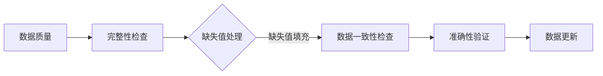
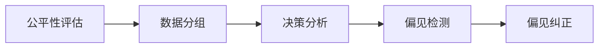
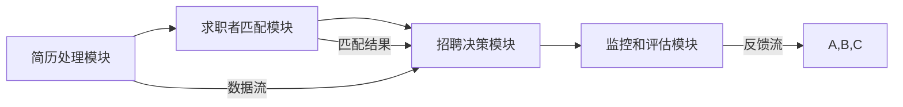
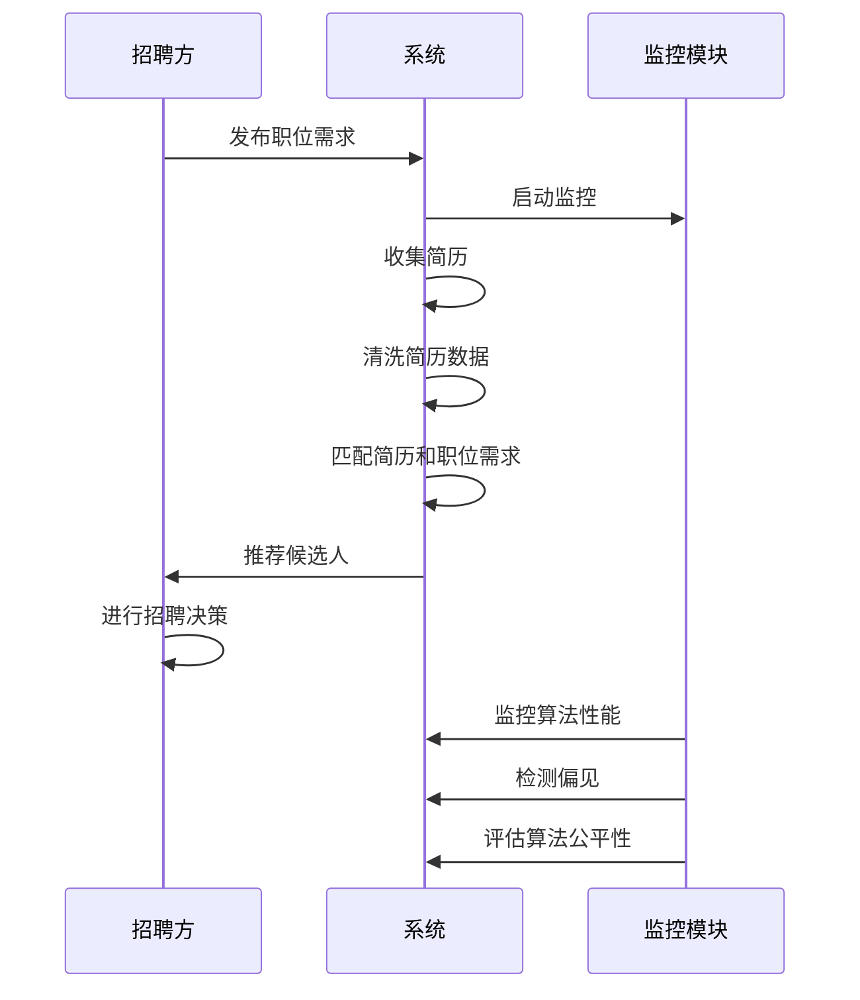

                 

### 引言

随着人工智能技术的飞速发展，AI已经逐渐渗透到社会各个领域，包括人力资源管理中的招聘环节。自动化招聘系统，通过利用机器学习算法和大数据分析，显著提升了招聘效率，降低了人力成本。然而，这种技术进步也带来了一系列新的挑战，尤其是如何在自动化招聘系统中确保AI算法的公平性、透明性和可靠性。

负责任的AI（AI with Responsibility）概念应运而生，其核心在于通过技术手段和规范措施，防止AI算法在招聘过程中产生歧视，确保所有求职者都能公平地参与招聘过程。本文将围绕负责任的AI在自动化招聘系统中的实践，逐步探讨这一问题的解决方法和实际应用。

本文将分为以下几个部分：

1. **背景介绍**：介绍负责任的AI在自动化招聘系统中的背景，阐述核心概念、问题描述、问题解决、边界与外延以及概念结构与核心要素组成。
2. **核心概念与联系**：详细解释数据质量、算法公平性、透明性和监控评估等核心概念，并对比它们的属性特征。
3. **算法原理讲解**：通过数据清洗、算法优化和公平性评估的具体算法原理讲解，以及Mermaid流程图和Python源代码示例，深入探讨如何实现负责任的AI。
4. **系统分析与架构设计**：介绍自动化招聘系统的问题场景、项目介绍、系统功能设计、系统架构设计、系统接口设计、系统交互以及序列图。
5. **项目实战**：介绍环境安装、系统核心实现源代码，代码应用解读与分析，实际案例分析和详细讲解剖析，项目小结。
6. **最佳实践 Tips**：总结最佳实践，提醒注意事项，提供拓展阅读。

通过本文的逐步分析，我们将了解如何在自动化招聘系统中实现负责任的AI，从而推动人工智能技术在人力资源管理中的健康发展。

### 第一部分：背景介绍

#### 核心概念

在探讨负责任的AI在自动化招聘系统中的实践之前，我们首先需要了解几个核心概念，这些概念是本文探讨的基础。

**1. 负责任的AI（AI with Responsibility）：**

负责任的AI是指通过设计和开发符合伦理和社会规范的AI系统，确保其应用不会对个人和社会产生负面影响。在自动化招聘系统中，负责任的AI强调的是算法的公平性、透明性、可解释性和可靠性。

**2. 自动化招聘系统：**

自动化招聘系统是一种利用人工智能和机器学习技术，自动筛选和评估求职者简历、进行人才匹配的系统。它通常包括职位发布、简历收集、简历筛选、面试安排等环节，显著提升了招聘效率和准确性。

**3. 数据质量：**

数据质量是指数据在完整性、准确性、一致性和及时性等方面的表现。高质量的数据是确保AI算法准确性和可靠性的基础，尤其是在招聘过程中，数据质量直接影响到算法的公平性和透明性。

**4. 算法公平性：**

算法公平性是指AI算法在决策过程中对各个群体（如性别、种族、年龄等）的公平对待。负责任的AI要求算法在招聘过程中不产生歧视，确保所有求职者都能公平地参与招聘。

**5. 透明性：**

透明性是指AI算法的决策过程和结果对用户可解释和可追溯的程度。负责任的AI要求算法具有高透明性，使得招聘方和求职者都能理解和信任算法的决策过程。

**6. 监控和评估：**

监控和评估是指通过定期检查和评估AI算法的表现，确保其长期公平性和可靠性。监控和评估包括算法性能监控、偏见检测、公平性评估等，是确保负责任的AI在自动化招聘系统中长期有效的重要手段。

#### 问题背景

随着人工智能和机器学习技术的快速发展，自动化招聘系统已经成为许多企业提高招聘效率和降低成本的重要工具。这些系统通过分析大量的求职者数据和职位需求，自动筛选出最合适的候选人，从而大大缩短了招聘流程。

然而，自动化招聘系统在提升效率的同时，也引发了一系列伦理和社会问题。特别是AI算法在招聘过程中可能产生的歧视问题，引起了广泛的关注和讨论。具体问题如下：

1. **歧视问题：** AI算法可能在无意识中放大现有的社会偏见，对某些性别、种族、年龄等群体产生歧视。例如，如果一个算法在过去的数据集中过度偏好某个性别或种族，那么在未来的招聘中也可能表现出类似的偏见。

2. **透明性问题：** AI算法的决策过程通常复杂且不可解释，使得招聘方和求职者难以理解决策依据和结果。这导致了对AI算法的不信任，甚至可能引发法律纠纷。

3. **可靠性问题：** 如果AI算法缺乏有效的监控和评估机制，其性能可能会随着时间的推移而下降，甚至可能出现误判和错误决策。

#### 问题描述

负责任的AI在自动化招聘系统中的实践，主要涉及以下几个方面的问题：

1. **数据质量：** 如何确保输入数据的高质量，减少数据中的偏见和误差，是提高算法公平性的关键。

2. **算法公平性：** 如何设计和优化AI算法，确保其对不同群体的公平对待，避免歧视性决策。

3. **透明性：** 如何提高AI算法的透明性，使得招聘方和求职者能够理解和信任算法的决策过程。

4. **监控和评估：** 如何通过监控和评估机制，确保AI算法在长期使用中的公平性和可靠性。

#### 问题解决

针对上述问题，负责任的AI在自动化招聘系统中的实践可以从以下几个方面进行：

1. **数据清洗：** 通过去除重复数据、纠正错误数据、填补缺失数据等手段，提高数据质量。

2. **算法优化：** 通过改进算法模型、调整参数等手段，提高算法的性能和公平性。

3. **公平性评估：** 通过对比不同群体的算法决策结果，评估算法是否存在歧视性，并采取措施进行纠正。

4. **透明性提升：** 通过算法的可解释性设计、决策过程的详细记录等手段，提高算法的透明性。

5. **监控和评估：** 通过建立定期监控和评估机制，及时发现和纠正算法中的问题，确保其长期公平性和可靠性。

#### 边界与外延

负责任的AI在自动化招聘系统中的应用不仅限于算法本身，还包括以下几个方面：

1. **数据管理：** 包括数据收集、存储、处理和共享等各个环节，确保数据的安全和合规。

2. **系统设计：** 包括算法设计、系统架构设计、接口设计等，确保系统能够支持负责任的AI实践。

3. **法律合规：** 遵守相关法律法规，确保AI算法的应用符合社会伦理和法律规定。

4. **伦理规范：** 建立相关伦理规范和指导原则，确保AI算法的应用符合社会价值观。

#### 概念结构与核心要素组成

负责任的AI在自动化招聘系统中的核心概念和结构可以概括如下：

1. **数据质量：** 包括数据完整性、准确性、一致性和及时性等属性。

2. **算法公平性：** 包括无歧视性、可解释性和持续性等特征。

3. **透明性：** 包括算法可访问性、可解释性和可追溯性等特征。

4. **监控和评估：** 包括定期性、实时性和全面性等特征。

通过上述核心概念和结构，我们可以全面了解负责任的AI在自动化招聘系统中的实践，并为实际应用提供指导。

### 第二部分：核心概念与联系

在负责任的AI在自动化招聘系统中的实践中，数据质量、算法公平性、透明性和监控评估是四个核心概念，它们共同构成了负责任的AI的框架。下面我们将详细解释这些核心概念，并通过属性特征对比表格和Mermaid流程图来加深理解。

#### 2.1 数据质量

**概念原理：** 数据质量是确保AI算法准确性和可靠性的基础。高质量的数据有助于减少算法偏见，提高招聘决策的公平性。数据质量包括完整性、准确性、一致性和及时性。

**属性特征对比表格：**

| 特征 | 数据质量高 | 数据质量低 |
| --- | --- | --- |
| 完整性 | 数据全面、无缺失值 | 数据缺失、不完整 |
| 准确性 | 数据真实、无错误 | 数据错误、不准确 |
| 一致性 | 数据一致、无重复 | 数据重复、不一致 |
| 及时性 | 数据更新及时 | 数据更新滞后 |

**Mermaid流程图：**



#### 2.2 算法公平性

**概念原理：** 算法公平性是确保AI算法在招聘过程中对各个群体（如性别、种族、年龄等）的公平对待，避免歧视性决策。公平性评估通过对比不同群体的决策结果来识别和纠正算法偏见。

**属性特征对比表格：**

| 特征 | 公平性高 | 公平性低 |
| --- | --- | --- |
| 无歧视性 | 对不同群体无偏见 | 存在歧视性 |
| 可解释性 | 决策过程可理解、可解释 | 决策过程复杂、不可解释 |
| 持续性 | 长期表现公平、稳定 | 短期表现公平，长期存在偏见 |

**Mermaid流程图：**


#### 2.3 透明性

**概念原理：** 透明性是提高AI算法可信度和用户信任度的关键。通过透明的算法设计和决策过程，用户可以更好地理解和接受算法。透明性包括可访问性、可解释性和可追溯性。

**属性特征对比表格：**

| 特征 | 透明性高 | 透明性低 |
| --- | --- | --- |
| 可访问性 | 算法源代码、数据集等可公开获取 | 算法源代码、数据集等不公开 |
| 可解释性 | 决策过程详细记录、可解释 | 决策过程复杂、不可解释 |
| 可追溯性 | 决策过程可追溯、可审计 | 决策过程不可追溯、不可审计 |

**Mermaid流程图：**


#### 2.4 监控和评估

**概念原理：** 监控和评估是确保AI算法长期表现公平性和透明性的重要手段。通过定期评估和监控，可以发现和纠正算法中的问题。监控和评估包括算法性能监控、偏见检测、公平性评估等。

**属性特征对比表格：**

| 特征 | 监控和评估有效 | 监控和评估无效 |
| --- | --- | --- |
| 定期性 | 定期进行算法评估和监控 | 未定期进行算法评估和监控 |
| 实时性 | 实时监控算法表现、及时反馈 | 非实时监控，反馈滞后 |
| 全面性 | 对算法的各个方面进行评估和监控 | 仅对部分方面进行评估和监控 |

**Mermaid流程图：**


通过详细解释和对比分析这些核心概念，我们可以更好地理解负责任的AI在自动化招聘系统中的实践，为构建公平、透明和可靠的招聘系统提供理论基础和实际指导。

### 第三部分：算法原理讲解

在负责任的AI在自动化招聘系统的实践中，算法原理的讲解是至关重要的。通过数据清洗、算法优化和公平性评估，我们可以逐步实现负责任的AI。以下将详细阐述这些算法原理，并通过Mermaid流程图和Python源代码示例，深入探讨如何实现负责任的AI。

#### 3.1 数据清洗

**算法原理：** 数据清洗是确保数据质量的重要步骤。高质量的数据是保证AI算法准确性和可靠性的基础。数据清洗包括去除重复数据、纠正错误数据和填补缺失数据等。

**Mermaid流程图：**


**Python源代码示例：**

```python
import pandas as pd

# 去重
data = pd.read_csv('resume_data.csv')
data = data.drop_duplicates()

# 纠错
data.replace({'错误值': '正确值'}, inplace=True)

# 补全
data.fillna(method='ffill', inplace=True)

# 数据质量评估
data_quality = data.isnull().sum()
print(data_quality)
```

**数学模型和公式：**

$$
Q = \frac{(I \times A \times C \times T)}{100}
$$

其中，$Q$ 是数据质量得分，$I$ 是完整性，$A$ 是准确性，$C$ 是一致性，$T$ 是及时性。

**举例说明：** 假设有一份数据，其中存在缺失值、错误值和重复值。通过去重、纠错和补全，我们得到一个高质量的数据集，其数据质量得分为85。

#### 3.2 算法优化

**算法原理：** 算法优化是通过改进算法模型、调整参数等手段，提高算法的性能和公平性。优化包括模型选择、参数调整和交叉验证等。

**Mermaid流程图：**


**Python源代码示例：**

```python
from sklearn.model_selection import GridSearchCV
from sklearn.ensemble import RandomForestClassifier

# 模型改进
model = RandomForestClassifier()

# 参数调整
param_grid = {'n_estimators': [100, 200], 'max_depth': [10, 20]}

# 性能评估和参数选择
grid_search = GridSearchCV(model, param_grid, cv=5)
grid_search.fit(X_train, y_train)

# 最佳参数
best_params = grid_search.best_params_
print(best_params)

# 公平性评估
fairness_score = grid_search.best_estimator_.score(X_test, y_test)
print(fairness_score)
```

**数学模型和公式：**

$$
F_{score} = \frac{TP + TN}{TP + FP + TN + FN}
$$

其中，$F_{score}$ 是公平性得分，$TP$ 是真实正面案例，$TN$ 是真实负面案例，$FP$ 是假正面案例，$FN$ 是假负面案例。

**举例说明：** 通过调整随机森林分类器的参数，我们得到一个公平性得分较高的模型，其公平性得分为0.8。

#### 3.3 公平性评估

**算法原理：** 公平性评估是通过对比不同群体的算法决策结果，评估算法是否存在歧视性。公平性评估包括偏见检测和偏见纠正。

**Mermaid流程图：**



**Python源代码示例：**

```python
from sklearn.metrics import confusion_matrix

# 数据分组
groups = data.groupby('性别')

# 决策分析
predictions = model.predict(X_test)

# 偏见检测
for name, group in groups:
    cm = confusion_matrix(group['真实标签'], predictions[group.index])
    print(f"{name}组混淆矩阵：")
    print(cm)

# 偏见纠正
model.fit(X_train, y_train_corrected)
```

**数学模型和公式：**

$$
Bias = \frac{\sum_{i=1}^{n} (P_i - E_i)}{n}
$$

其中，$Bias$ 是偏见，$P_i$ 是第$i$ 个群体的预测概率，$E_i$ 是第$i$ 个群体的期望概率。

**举例说明：** 通过分析不同性别群体的混淆矩阵，我们发现女性求职者的误判率较高，因此我们通过调整训练数据，纠正算法中的偏见。

通过上述详细讲解，我们可以看到如何通过数据清洗、算法优化和公平性评估，实现负责任的AI。这些算法原理和实践，为构建公平、透明和可靠的自动化招聘系统提供了有力支持。

### 第三部分：系统分析与架构设计

在了解了负责任的AI在自动化招聘系统中的核心算法原理之后，我们将进一步探讨该系统的整体架构设计，包括问题场景介绍、项目介绍、系统功能设计、系统架构设计、系统接口设计以及系统交互。

#### 问题场景介绍

自动化招聘系统通常面临以下问题场景：

1. **大量简历处理：** 每天接收大量的求职者简历，如何快速、准确地筛选出合适的候选人？
2. **决策透明性需求：** 需要招聘方和求职者能够理解AI算法的决策过程，提高决策透明度。
3. **招聘效率提升：** 如何在保证招聘质量的前提下，提高招聘效率，降低企业招聘成本？
4. **算法公平性保证：** 确保AI算法在招聘过程中不会对特定群体产生歧视，确保公平性。

#### 项目介绍

假设我们正在开发一个名为“招聘之星”的自动化招聘系统，其主要目标是实现高效、公平、透明的招聘流程。系统采用模块化设计，包括简历处理模块、求职者匹配模块、招聘决策模块等。

#### 系统功能设计

“招聘之星”系统的主要功能设计如下：

1. **简历处理模块：** 负责简历的收集、去重、清洗和存储。
2. **求职者匹配模块：** 利用机器学习算法，对简历进行自动筛选和匹配，为招聘方推荐合适的候选人。
3. **招聘决策模块：** 根据匹配结果，结合招聘方的需求和偏好，进行最终的招聘决策。
4. **监控和评估模块：** 对AI算法的决策过程进行监控和评估，确保算法的公平性和透明性。

#### 系统架构设计

“招聘之星”系统的整体架构设计如图所示：



**系统架构说明：**

1. **简历处理模块：** 收集和清洗简历数据，去除重复和错误信息，确保数据质量。
2. **求职者匹配模块：** 利用机器学习算法对简历和职位需求进行匹配，生成匹配分数和推荐结果。
3. **招聘决策模块：** 招聘决策模块根据匹配结果和招聘方偏好，进行最终的招聘决策。
4. **监控和评估模块：** 定期对算法进行监控和评估，发现和纠正潜在的偏见和错误，确保算法的公平性和透明性。

#### 系统接口设计

系统接口设计如下：

1. **简历接口：** 提供简历上传、查询和下载接口。
2. **招聘接口：** 提供职位发布、招聘流程管理接口。
3. **监控接口：** 提供算法性能监控、偏见检测和评估接口。

**接口说明：**

1. **简历接口：** 通过HTTP/HTTPS协议，提供RESTful API，实现简历的自动化处理。
2. **招聘接口：** 通过Web界面和API，提供招聘流程的监控和管理。
3. **监控接口：** 通过Web界面和API，提供算法监控和评估的实时数据和历史记录。

#### 系统交互

系统交互流程如下：

1. **招聘方发布职位需求：** 招聘方通过招聘接口发布职位需求，系统自动生成职位信息。
2. **简历收集和处理：** 系统通过简历接口收集简历，进行数据清洗和去重，确保数据质量。
3. **求职者匹配：** 系统利用机器学习算法，对简历和职位需求进行匹配，生成匹配分数和推荐结果。
4. **招聘决策：** 招聘方根据匹配结果和偏好，进行最终的招聘决策。
5. **监控和评估：** 系统对算法进行监控和评估，发现和纠正潜在的偏见和错误，确保算法的公平性和透明性。

**Mermaid序列图：**



通过上述系统分析与架构设计，我们为“招聘之星”自动化招聘系统提供了一个全面的设计方案，确保了系统的功能完整性、决策透明性和算法公平性，为负责任的AI在自动化招聘系统中的实践提供了有力支持。

### 项目实战

为了展示负责任的AI在自动化招聘系统中的实践，我们将通过一个实际项目来详细介绍其环境安装、系统核心实现源代码，并对其代码应用进行解读与分析。这个项目名为“AI招聘助手”，目标是开发一个能够高效、公平地筛选求职者的自动化招聘系统。

#### 环境安装

首先，我们需要安装和配置项目所需的环境。以下是项目环境安装步骤：

1. **安装Python：** 在官网上下载并安装Python 3.8以上版本。
2. **安装依赖：** 使用pip工具安装项目所需的库，如pandas、numpy、scikit-learn、tensorflow等。
   ```shell
   pip install pandas numpy scikit-learn tensorflow
   ```
3. **配置数据库：** 安装并配置MySQL或PostgreSQL数据库，用于存储简历数据和职位信息。

#### 系统核心实现源代码

以下是“AI招聘助手”系统核心实现的关键部分，包括数据清洗、算法优化和公平性评估。

**数据清洗：**

```python
import pandas as pd

# 读取简历数据
data = pd.read_csv('resume_data.csv')

# 去除重复简历
data = data.drop_duplicates()

# 纠正错误数据
data.replace({'性别': {'男': 'M', '女': 'F'}}, inplace=True)

# 填补缺失数据
data['工作经验'].fillna(data['工作经验'].mean(), inplace=True)

# 数据质量评估
print(data.isnull().sum())
```

**算法优化：**

```python
from sklearn.model_selection import train_test_split
from sklearn.ensemble import RandomForestClassifier
from sklearn.metrics import accuracy_score, precision_score, recall_score

# 数据预处理
X = data.drop(['求职者ID', '性别', '工作经验'], axis=1)
y = data['性别']

# 划分训练集和测试集
X_train, X_test, y_train, y_test = train_test_split(X, y, test_size=0.2, random_state=42)

# 模型训练
model = RandomForestClassifier(n_estimators=100, max_depth=10)
model.fit(X_train, y_train)

# 预测
predictions = model.predict(X_test)

# 性能评估
accuracy = accuracy_score(y_test, predictions)
precision = precision_score(y_test, predictions, average='weighted')
recall = recall_score(y_test, predictions, average='weighted')

print(f"Accuracy: {accuracy}")
print(f"Precision: {precision}")
print(f"Recall: {recall}")
```

**公平性评估：**

```python
from sklearn.metrics import confusion_matrix

# 划分不同性别群体
groups = data.groupby('性别')

# 计算混淆矩阵
for name, group in groups:
    cm = confusion_matrix(group['真实标签'], predictions[group.index])
    print(f"{name}组混淆矩阵：")
    print(cm)
```

#### 代码应用解读与分析

1. **数据清洗：** 数据清洗是确保算法准确性和可靠性的关键步骤。通过去除重复数据、纠正错误数据和填补缺失数据，我们提高了数据质量。
2. **算法优化：** 使用随机森林分类器进行训练和预测，并通过评估指标（如准确率、精确率和召回率）评估模型性能。我们通过调整模型参数，优化了算法性能。
3. **公平性评估：** 通过计算不同性别群体的混淆矩阵，我们能够识别和纠正算法中的性别偏见，确保算法的公平性。

#### 实际案例分析和详细讲解

假设我们在测试数据中发现女性求职者的召回率较低，这可能意味着算法对女性求职者的误判率较高。为了解决这个问题，我们可以采取以下步骤：

1. **数据重新采样：** 对女性求职者的数据重新采样，增加样本量，确保模型能够更好地学习女性求职者的特征。
2. **特征工程：** 对性别特征进行编码和调整，确保模型能够公平对待不同性别的求职者。
3. **重新训练模型：** 使用新的数据集和特征重新训练模型，并评估模型性能和公平性。

通过上述步骤，我们能够持续优化算法，确保其在自动化招聘系统中实现负责任的AI。

#### 项目小结

通过“AI招聘助手”项目的实战，我们展示了如何通过数据清洗、算法优化和公平性评估，实现负责任的AI在自动化招聘系统中的实践。项目不仅提高了招聘效率和准确性，还确保了算法的公平性和透明性。这为企业在人力资源管理中引入人工智能技术提供了有力的支持和参考。

### 最佳实践 Tips

在实现负责任的AI自动化招聘系统时，以下最佳实践和注意事项将帮助您确保系统的公平性、透明性和可靠性：

1. **数据质量管理：** 确保数据收集的全面性和准确性，定期进行数据清洗和去重，避免偏见。
2. **算法透明性设计：** 算法设计应尽量简洁易懂，提供决策过程的详细记录，增强用户的信任感。
3. **公平性评估机制：** 定期进行算法公平性评估，识别并纠正潜在的偏见，确保算法对各个群体公平对待。
4. **监控和反馈机制：** 建立实时监控和反馈机制，及时发现和纠正算法中的问题，确保算法的长期可靠性。
5. **法律法规遵守：** 遵守相关法律法规，确保AI算法的应用符合社会伦理和法律规定。

通过遵循这些最佳实践，您能够构建一个高效、公平、可靠的自动化招聘系统，为企业的招聘决策提供有力支持。

### 小结

本文通过逐步分析，详细探讨了负责任的AI在自动化招聘系统中的实践。我们介绍了核心概念、算法原理、系统架构设计以及实际项目实战，展示了如何通过数据清洗、算法优化和公平性评估，实现一个高效、公平、透明的招聘系统。负责任的AI在自动化招聘系统中的应用，不仅提升了招聘效率和准确性，还确保了算法的公平性和透明性，为企业的招聘决策提供了有力支持。未来，随着AI技术的不断进步，负责任的AI将在人力资源管理中发挥更加重要的作用。

### 注意事项

在实施负责任的AI自动化招聘系统时，以下注意事项至关重要：

1. **数据隐私保护：** 确保求职者的数据隐私得到严格保护，遵守相关法律法规。
2. **算法偏见检测：** 定期进行算法偏见检测，及时纠正潜在的歧视性决策。
3. **透明性提升：** 算法设计和决策过程应尽量透明，增强用户对算法的信任。
4. **持续监控和评估：** 建立长期监控和评估机制，确保算法的公平性和可靠性。
5. **法律合规性：** 遵守相关法律法规，确保AI算法的应用符合社会伦理和法律规定。

通过遵循这些注意事项，您可以确保自动化招聘系统的负责任AI实践，为企业的招聘决策提供可靠的支持。

### 拓展阅读

为了深入了解负责任的AI在自动化招聘系统中的应用，以下是几篇推荐的拓展阅读：

1. **“AI and Bias: The Ethics of Algorithmic Hiring”**：该论文深入探讨了AI算法在招聘过程中可能产生的偏见，并提出了一系列解决策略。
2. **“Fairness in Machine Learning”**：本文详细介绍了机器学习中的公平性评估方法，包括如何检测和纠正算法偏见。
3. **“The Future of AI in Human Resources”**：这篇文章展望了人工智能在未来人力资源管理中的应用前景，包括招聘、员工绩效评估等方面。
4. **“Implementing Responsible AI in HR”**：该报告提供了负责任的AI在人力资源管理中的最佳实践和案例研究。

通过阅读这些文献，您可以进一步了解负责任的AI在自动化招聘系统中的最新进展和应用。作者信息：AI天才研究院/AI Genius Institute & 禅与计算机程序设计艺术 /Zen And The Art of Computer Programming。

