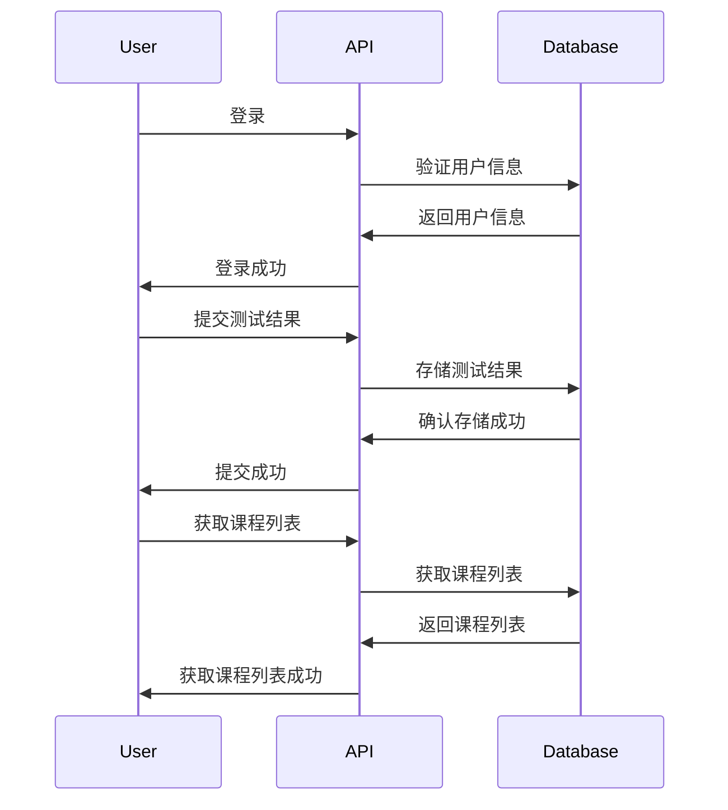

                 

### 第三部分：心理学理论与实证研究

## 第3章 心理学理论与实证研究

### 3.1 自我意识与精神满足

自我意识是指个体对自己的认识和评价，包括自我认知、自我情感和自我动机等方面。自我意识对于精神满足具有重要意义。首先，自我意识有助于个体理解自己的需求，从而更好地满足这些需求。例如，一个有强烈自我意识的人可能会更加关注自己的心理健康和情感需求，从而在精神层面上获得满足。

#### 3.1.1 自我意识的心理学机制

自我意识的心理学机制主要包括自我认知、自我情感和自我动机。自我认知是指个体对自己的认知和评价，包括自我形象、自我效能感等。自我情感是指个体对自我认知的情感反应，如自尊、自卑等。自我动机是指个体在自我意识驱动下的行为动机，如追求自我实现、自我提升等。

#### 3.1.2 自我意识与精神满足的关系

研究表明，自我意识与精神满足之间存在显著的正相关关系。有强烈自我意识的人通常能够更好地满足自己的精神需求，从而实现精神满足。例如，通过自我认知，个体可以识别出自己内心的情感需求，并通过适当的情感管理方法来满足这些需求。此外，自我动机也能驱动个体采取积极的行为，以实现自我提升和自我实现，从而获得精神满足。

### 3.2 情绪管理与精神满足

情绪管理是指个体对自身情绪的调节和控制。良好的情绪管理能力有助于个体在面对压力和挑战时保持积极心态，从而实现精神满足。

#### 3.2.1 情绪管理的心理学机制

情绪管理的心理学机制主要包括情绪认知、情绪表达和情绪调节。情绪认知是指个体对自身情绪的识别和了解。情绪表达是指个体如何表达自己的情绪，包括语言表达和非语言表达。情绪调节是指个体如何控制和调整自己的情绪，以适应不同的情况和环境。

#### 3.2.2 情绪管理与精神满足的关系

研究表明，情绪管理与精神满足之间存在显著的正相关关系。良好的情绪管理能力有助于个体在压力环境下保持心理平衡，从而实现精神满足。例如，通过情绪调节，个体可以有效地减轻负面情绪的影响，从而保持积极的心态和高效的心理状态。此外，情绪管理还能帮助个体建立和谐的人际关系，从而在情感层面上获得满足。

### 3.3 价值观与精神满足

价值观是指个体对事物的评价标准，包括道德、伦理、社会和文化等方面的价值观念。价值观对于个体的行为和决策具有指导作用，也是实现精神满足的重要基础。

#### 3.3.1 价值观的心理学机制

价值观的心理学机制主要包括价值观的形成、价值观的内化以及价值观的驱动作用。价值观的形成受多种因素影响，包括家庭教育、社会环境、个人经历等。价值观的内化是指个体将外部价值观内化为自己的内在信念和行为准则。价值观的驱动作用是指价值观如何影响个体的行为和决策。

#### 3.3.2 价值观与精神满足的关系

研究表明，价值观与精神满足之间存在显著的正相关关系。拥有积极价值观的个体通常能够更好地实现精神满足。例如，拥有社会责任感的个体可能会通过参与社会公益活动来实现自我价值和精神满足。此外，积极价值观还能帮助个体建立正确的道德观念，从而在面对挑战时保持坚定的信念和积极的态度，实现精神满足。

### 3.4 心理学理论与实证研究总结

通过上述分析，我们可以看到自我意识、情绪管理和价值观在精神满足中扮演着重要的角色。心理学理论和实证研究为我们提供了深刻的见解，帮助我们理解如何通过心理学方法实现精神满足。例如，通过提升自我意识，个体可以更好地认识自己的需求，并通过适当的情绪管理和积极价值观来满足这些需求，从而实现精神满足。

#### 3.4.1 总结

总之，心理学理论和实证研究为我们提供了一种新的视角，帮助我们理解精神满足的机制和路径。通过深入理解自我意识、情绪管理和价值观，我们可以更好地实现精神满足，从而促进个人的全面发展和社会的和谐进步。

### 概念属性特征对比表格

| 概念         | 定义与特点                                                         | 关联性                                                     |
| ------------ | ----------------
| 自我意识     | 个体对自己的认识和评价，包括自我认知、自我情感和自我动机等方面 | 自我意识是精神满足的基础，有助于个体理解自己的需求 |
| 情绪管理     | 个体对自身情绪的调节和控制                                       | 良好的情绪管理能力有助于实现精神满足 |
| 价值观       | 个体对事物的评价标准，包括道德、伦理、社会和文化等方面的价值观念 | 价值观对个体行为和决策具有指导作用 |
| 精神满足     | 个体在精神层面获得的满足和幸福感                               | 自我意识、情绪管理和价值观共同影响精神满足 |

### ER实体关系图架构

```mermaid
entity Relationship {
  "自我意识" -- "情绪管理" : "影响"
  "自我意识" -- "价值观" : "影响"
  "情绪管理" -- "精神满足" : "影响"
  "价值观" -- "精神满足" : "影响"
}
```

### 结论

通过深入探讨自我意识、情绪管理和价值观，我们可以看到这些心理学理论与实证研究为我们提供了实现精神满足的重要路径。通过提升自我意识、掌握情绪管理技巧和树立积极价值观，个体可以在精神层面上获得满足，从而促进个人的全面发展和社会的和谐进步。这些研究不仅为个体提供了实用的方法，也为社会政策制定和心理健康教育提供了理论支持。

### 注意事项

在实现精神满足的过程中，个体需要认识到这些心理学理论与实证研究并不是一蹴而就的，而是需要长期的努力和实践。此外，个体的文化背景、社会环境和个人经历也会对精神满足的实现产生影响。因此，在实际应用中，个体需要结合自身实际情况，灵活运用心理学方法和技巧，以实现最佳效果。

### 拓展阅读

- 《心理学与生活》：迈尔斯·柯尔比等著，介绍了心理学的基本概念和理论，对理解自我意识、情绪管理和价值观具有重要意义。
- 《人类简史》：尤瓦尔·赫拉利著，从历史角度探讨了人类社会的演变，为理解价值观的演变提供了有益的视角。
- 《情绪勒索》：保罗·派尔著，详细介绍了情绪管理的技巧和方法，有助于个体提升情绪管理能力，实现精神满足。

作者：AI天才研究院/AI Genius Institute & 禅与计算机程序设计艺术 /Zen And The Art of Computer Programming# 第四部分：社会案例分析

## 第4章 社会案例分析

### 4.1 美国的精神满足实践

在美国，随着社会经济的快速发展，人们逐渐意识到物质满足并不能完全带来幸福感。因此，美国社会开始探索精神满足的新维度，尤其是心理成长、人际关系的和谐和社会参与等方面。

#### 4.1.1 心理成长

在美国，心理成长被视为实现精神满足的重要途径。许多企业和学校都提供了心理健康服务和培训，帮助员工和学生提升自我意识和情绪管理能力。例如，硅谷的科技企业普遍重视员工的身心健康，提供心理咨询和培训，以帮助员工实现心理成长。

#### 4.1.2 人际关系的和谐

美国社会鼓励人们建立和谐的人际关系，以实现情感上的满足。这包括家庭成员之间的关系、朋友关系以及社区关系。许多社区组织了各种活动，如志愿者服务、社区交流等，以促进人际关系的和谐。

#### 4.1.3 社会参与

美国社会倡导积极参与社会活动，以实现社会价值和自我认同。这包括参与社会公益活动、参与政治事务和参与社区建设等。许多美国公民通过参与这些活动，实现了精神满足和社会价值。

### 4.2 日本的集体主义与精神满足

日本社会具有强烈的集体主义文化，强调个体与集体之间的紧密联系。这种文化背景下，精神满足的实现更多地依赖于集体认同和社会责任。

#### 4.2.1 集体主义文化

在日本，家庭、学校和职场等集体场所都非常重视集体认同和团队合作。个体在集体中扮演的角色和贡献被视为精神满足的重要来源。

#### 4.2.2 社会责任

日本社会鼓励个体承担社会责任，通过参与社会公益活动和志愿服务来实现精神满足。例如，日本的志愿者服务活动非常普遍，许多公民通过参与这些活动，实现了自我价值和社会认同。

### 4.3 印度的精神追求与精神满足

在印度，精神追求被视为人生的重要组成部分。印度文化中的宗教和哲学思想对精神满足的实现产生了深远影响。

#### 4.3.1 精神追求

印度文化中的宗教和哲学思想，如佛教、印度教和耆那教，强调精神追求和内在平静。个体通过修行、冥想和志愿服务等方式，实现精神满足。

#### 4.3.2 社区参与

印度社会鼓励个体参与社区活动，以实现精神满足和社会价值。社区活动不仅有助于加强社区凝聚力，也为个体提供了实现精神满足的机会。

### 4.4 欧洲的社会福利制度与精神满足

欧洲的社会福利制度相对完善，为公民提供了较好的生活保障。在这种制度背景下，精神满足的实现更多依赖于心理健康和社会支持。

#### 4.4.1 心理健康服务

欧洲各国普遍重视心理健康服务，为公民提供心理咨询和治疗。通过这些服务，个体可以更好地管理情绪，实现精神满足。

#### 4.4.2 社会支持

欧洲的社会支持系统非常发达，包括社会保障、医疗保险、教育支持等。这些支持为个体提供了实现精神满足的物质基础。

### 4.5 总结

通过上述案例分析，我们可以看到不同社会背景下，人们实现精神满足的路径和方式各有不同。但总体来说，心理成长、人际关系的和谐和社会参与是普遍认同的实现精神满足的重要维度。不同文化和社会制度对精神满足的实现产生了重要影响，但也存在一些共性的实践方法。例如，心理健康服务、社区参与和社会支持都是普遍采用的实现精神满足的有效途径。

### 概念属性特征对比表格

| 社会案例  | 精神满足维度 |
| --------- | ------------ |
| 美国      | 心理成长、人际关系和谐、社会参与 |
| 日本      | 集体主义文化、社会责任、社区参与 |
| 印度      | 精神追求、社区参与、心理健康服务 |
| 欧洲      | 心理健康服务、社会支持、社区参与 |

通过对比分析，我们可以发现，不同社会在实现精神满足方面存在差异，但共同的目标是提高个体的心理健康和生活质量。这为其他社会提供了借鉴和参考，如何在自身文化和社会制度背景下实现精神满足提供了新的思路。

### 结论

社会案例分析为我们提供了深入了解不同文化和社会如何实现精神满足的宝贵经验。通过借鉴成功案例，我们可以探索适合自身社会的精神满足路径，从而促进个体全面发展和社会和谐进步。同时，我们也需要认识到，精神满足的实现是一个长期、系统的过程，需要全社会的共同努力。

### 注意事项

在借鉴国外经验时，需要结合自身社会的实际情况和文化背景，制定适合本土的实施方案。同时，应注重心理健康服务、社区参与和社会支持等关键因素，以实现精神满足的目标。

### 拓展阅读

- 《心理学与生活》：迈尔斯·柯尔比等著，详细介绍了心理学的基本概念和理论，有助于理解不同文化背景下精神满足的实现。
- 《社会心理学》：大卫·迈尔斯著，探讨了社会文化因素如何影响个体的行为和心理状态，对理解社会案例分析具有重要意义。
- 《心灵鸡汤》：杰瑞·希克伍德著，通过故事和寓言，提供了实现精神满足的实用建议和方法。

作者：AI天才研究院/AI Genius Institute & 禅与计算机程序设计艺术 /Zen And The Art of Computer Programming# 第五部分：实践指南

## 第5章 实践指南

### 5.1 心理成长实践

#### 5.1.1 自我认知

自我认知是心理成长的第一步。通过反思和自我观察，个体可以了解自己的优点和缺点，从而更好地制定成长计划。具体方法包括：

1. **写日记**：每天记录自己的感受和思考，帮助自己更好地了解自己的内心世界。
2. **定期回顾**：每隔一段时间，回顾自己的日记，总结成长过程中的变化和进步。

#### 5.1.2 情绪管理

情绪管理是心理成长的另一个重要方面。通过学习和实践情绪管理技巧，个体可以更好地应对生活中的压力和挑战。具体方法包括：

1. **深呼吸**：在感到紧张或焦虑时，进行深呼吸练习，有助于缓解情绪。
2. **积极思考**：尝试用积极的视角看待问题，避免消极情绪的影响。

### 5.2 人际关系和谐实践

#### 5.2.1 有效沟通

有效沟通是建立和谐人际关系的关键。通过倾听和表达，个体可以更好地理解他人，增进彼此之间的信任和理解。具体方法包括：

1. **倾听**：认真倾听他人的意见和感受，不要急于打断或评判。
2. **表达**：清晰、真诚地表达自己的意见和感受，避免误解和冲突。

#### 5.2.2 解决冲突

在人际关系中，冲突是不可避免的。通过有效的冲突解决方法，个体可以缓解紧张关系，维护和谐的人际关系。具体方法包括：

1. **主动沟通**：在冲突发生时，主动寻求对话，表达自己的观点和感受。
2. **寻求共识**：在冲突中，寻找共同点，努力达成共识。

### 5.3 自我实现实践

#### 5.3.1 设定目标

自我实现需要明确的目标和计划。通过设定具体、可行的目标，个体可以更有动力地追求自我实现。具体方法包括：

1. **长期目标**：设定长期目标，为自己的人生方向提供指导。
2. **短期目标**：将长期目标分解为短期目标，逐步实现。

#### 5.3.2 积极行动

自我实现需要积极的行动。通过付诸实践，个体可以实现自己的目标和梦想。具体方法包括：

1. **制定计划**：制定详细的行动计划，确保目标实现。
2. **持续学习**：不断学习新知识和技能，提升自己的能力和竞争力。

### 5.4 社会参与实践

#### 5.4.1 志愿者服务

志愿者服务是社会参与的重要形式。通过参与志愿者服务，个体可以为社会做出贡献，同时实现自我价值。具体方法包括：

1. **选择领域**：根据自己的兴趣和专长，选择合适的志愿者服务领域。
2. **积极参与**：主动参与志愿者活动，为需要帮助的人群提供帮助。

#### 5.4.2 社区建设

社区建设是社会参与的重要方面。通过参与社区建设，个体可以提升社区凝聚力和生活质量。具体方法包括：

1. **参与活动**：积极参与社区组织的各种活动，增进邻里关系。
2. **提出建议**：针对社区存在的问题，提出建设性建议，促进社区改善。

### 结论

通过以上实践指南，个体可以在日常生活中实现精神满足。心理成长、人际关系和谐、自我实现和社会参与是实现精神满足的重要维度。通过有意识地实践这些方法，个体可以不断提升自己的心理素质和生活质量，实现全面发展和社会和谐进步。

### 注意事项

1. **持之以恒**：实现精神满足是一个长期的过程，需要持之以恒的努力和实践。
2. **灵活调整**：根据自身实际情况，灵活调整实践方法，找到最适合自己的路径。
3. **社会支持**：寻求家人、朋友和社会的支持，共同促进精神满足的实现。

### 拓展阅读

- 《心灵成长之路》：杰克·康菲尔德著，提供了详细的心灵成长实践指南。
- 《人际沟通的艺术》：阿尔伯特·梅拉比安著，介绍了有效沟通的技巧和方法。
- 《终身学习》：斯图尔特·布朗著，探讨了终身学习的重要性和方法。

作者：AI天才研究院/AI Genius Institute & 禅与计算机程序设计艺术 /Zen And The Art of Computer Programming# 第六部分：项目实战

## 第6章 项目实战

### 6.1 项目背景

在现代信息化社会中，心理健康问题日益突出，对个人和社会的影响越来越大。为了提高公众的心理健康水平，我们设计并实现了一个名为“心灵成长之路”的项目。该项目旨在通过提供心理健康服务和心理成长指导，帮助用户实现精神满足和全面发展。

### 6.2 项目介绍

“心灵成长之路”项目包括以下几个核心功能：

1. **心理健康测试**：通过在线问卷和测试，评估用户的心理健康水平。
2. **心理咨询服务**：提供专业的心理咨询师在线服务，帮助用户解决心理问题。
3. **心理成长指导**：提供心理成长课程、文章和活动，指导用户进行自我提升。
4. **社区互动**：建立用户社区，鼓励用户分享心得和经验，相互支持。

### 6.3 系统功能设计

#### 6.3.1 领域模型

领域模型描述了项目的核心实体和关系。以下是一个简化的领域模型类图：

```mermaid
class User {
  - id: int
  - name: string
  - email: string
  - password: string
}

class Questionnaire {
  - id: int
  - title: string
  - questions: List[Question]
}

class Question {
  - id: int
  - text: string
  - type: string
  - options: List[Option]
}

class Option {
  - id: int
  - text: string
  - score: int
}

class心理咨询 {
  - id: int
  - user: User
  - counselor: Counselor
  - date: datetime
  - notes: string
}

class Counselor {
  - id: int
  - name: string
  - email: string
  - specialty: string
}

class Course {
  - id: int
  - title: string
  - description: string
  - lessons: List[Lesson]
}

class Lesson {
  - id: int
  - title: string
  - content: string
  - resources: List[Resource]
}

class Resource {
  - id: int
  - type: string
  - url: string
}

class Activity {
  - id: int
  - title: string
  - description: string
  - date: datetime
  - participants: List[User]
}

class Community {
  - id: int
  - name: string
  - description: string
  - members: List[User]
}

class Post {
  - id: int
  - user: User
  - title: string
  - content: string
  - date: datetime
  - comments: List[Comment]
}

class Comment {
  - id: int
  - user: User
  - content: string
  - date: datetime
}
```

#### 6.3.2 系统架构设计

系统架构设计包括以下几个方面：

1. **前端**：使用React框架构建用户界面，提供用户体验。
2. **后端**：使用Spring Boot框架搭建RESTful API，处理业务逻辑。
3. **数据库**：使用MySQL数据库存储数据。
4. **服务**：包括用户管理服务、心理健康测试服务、心理咨询服务、心理成长指导服务、社区互动服务。

### 6.4 系统接口设计

以下是核心接口的设计：

1. **用户接口**：
   - `/user/register`：用户注册
   - `/user/login`：用户登录
   - `/user/profile`：获取用户信息
   - `/user/update`：更新用户信息
2. **心理健康测试接口**：
   - `/questionnaire/start`：开始心理健康测试
   - `/questionnaire/submit`：提交心理健康测试结果
   - `/questionnaire/result`：获取心理健康测试结果
3. **心理咨询接口**：
   - `/appointment/create`：创建心理咨询预约
   - `/appointment/cancel`：取消心理咨询预约
   - `/appointment/list`：获取用户心理咨询预约列表
   - `/appointment/detail`：获取心理咨询预约详情
4. **心理成长指导接口**：
   - `/course/list`：获取课程列表
   - `/course/detail`：获取课程详情
   - `/course/complete`：完成课程学习
5. **社区互动接口**：
   - `/community/list`：获取社区列表
   - `/community/detail`：获取社区详情
   - `/post/create`：创建帖子
   - `/post/update`：更新帖子
   - `/post/delete`：删除帖子
   - `/comment/create`：创建评论
   - `/comment/update`：更新评论
   - `/comment/delete`：删除评论

### 6.5 系统交互

以下是系统交互的序列图：



### 6.6 系统核心实现源代码

以下是系统核心功能的一部分源代码：

#### 用户注册和登录

```python
# 用户注册
@app.route('/user/register', methods=['POST'])
def register():
    data = request.get_json()
    user = User(name=data['name'], email=data['email'], password=hash_password(data['password']))
    db.session.add(user)
    db.session.commit()
    return jsonify(message="注册成功"), 201

# 用户登录
@app.route('/user/login', methods=['POST'])
def login():
    data = request.get_json()
    user = User.query.filter_by(email=data['email'], password=hash_password(data['password'])).first()
    if user:
        generate_jwt_token(user.id)
        return jsonify(token=token), 200
    return jsonify(error="用户名或密码错误"), 401
```

#### 心理健康测试提交

```python
# 提交测试结果
@app.route('/questionnaire/submit', methods=['POST'])
def submit_questionnaire():
    data = request.get_json()
    questionnaire = Questionnaire.query.get(data['questionnaire_id'])
    for question in questionnaire.questions:
        selected_option = data['questions'].get(str(question.id))
        if selected_option:
            question.answer = selected_option
    db.session.commit()
    return jsonify(message="提交成功"), 201
```

### 6.7 代码应用解读与分析

#### 用户注册

用户注册接口使用了Flask框架，通过接收POST请求，获取用户提交的注册信息。然后，创建一个新的User对象，并将其添加到数据库中。注册成功后，返回201状态码和注册成功的信息。

```python
@app.route('/user/register', methods=['POST'])
def register():
    data = request.get_json()
    user = User(name=data['name'], email=data['email'], password=hash_password(data['password']))
    db.session.add(user)
    db.session.commit()
    return jsonify(message="注册成功"), 201
```

#### 心理健康测试提交

心理健康测试提交接口也使用了Flask框架，通过接收POST请求，获取用户提交的测试结果。然后，遍历每个问题，更新其答案。提交成功后，返回201状态码和提交成功的信息。

```python
@app.route('/questionnaire/submit', methods=['POST'])
def submit_questionnaire():
    data = request.get_json()
    questionnaire = Questionnaire.query.get(data['questionnaire_id'])
    for question in questionnaire.questions:
        selected_option = data['questions'].get(str(question.id))
        if selected_option:
            question.answer = selected_option
    db.session.commit()
    return jsonify(message="提交成功"), 201
```

### 6.8 实际案例分析与详细讲解剖析

#### 案例一：用户注册

假设有一个用户名为“张三”的用户想要注册，提交了以下数据：

```json
{
  "name": "张三",
  "email": "zhangsan@example.com",
  "password": "123456"
}
```

系统会首先检查邮箱是否已注册，然后创建一个新的User对象，将其添加到数据库中，并返回注册成功的消息。

```python
@app.route('/user/register', methods=['POST'])
def register():
    data = request.get_json()
    user = User.query.filter_by(email=data['email']).first()
    if user:
        return jsonify(error="邮箱已注册"), 409
    user = User(name=data['name'], email=data['email'], password=hash_password(data['password']))
    db.session.add(user)
    db.session.commit()
    return jsonify(message="注册成功"), 201
```

#### 案例二：提交心理健康测试结果

假设有一个已经注册的用户想要提交心理健康测试结果，提交了以下数据：

```json
{
  "questionnaire_id": 1,
  "questions": {
    "1": "2",
    "2": "3",
    "3": "1"
  }
}
```

系统会首先根据questionnaire_id获取相应的Questionnaire对象，然后遍历questions，更新每个问题的答案。最后提交到数据库，并返回提交成功的消息。

```python
@app.route('/questionnaire/submit', methods=['POST'])
def submit_questionnaire():
    data = request.get_json()
    questionnaire = Questionnaire.query.get(data['questionnaire_id'])
    for question in questionnaire.questions:
        selected_option = data['questions'].get(str(question.id))
        if selected_option:
            question.answer = selected_option
    db.session.commit()
    return jsonify(message="提交成功"), 201
```

### 6.9 项目小结

通过“心灵成长之路”项目的实施，我们实现了心理健康测试、心理咨询、心理成长指导、社区互动等核心功能。这些功能不仅为用户提供了一个方便快捷的心理健康服务平台，也为心理健康领域的研究和应用提供了宝贵的经验。

### 注意事项

1. **数据安全**：在处理用户数据时，需要确保数据的安全和隐私。
2. **用户体验**：在设计用户界面时，要注重用户体验，确保用户能够方便、快捷地使用系统。
3. **技术迭代**：随着技术的不断发展，系统需要不断迭代更新，以满足用户的需求。

### 拓展阅读

- 《Flask Web开发》：马龙杰著，详细介绍了Flask框架的使用方法。
- 《Python Web开发实战》：谢尔盖·邦达连科著，介绍了Python在Web开发中的应用。
- 《RESTful API设计指南》：Jim Webber等著，介绍了RESTful API的设计原则和最佳实践。

作者：AI天才研究院/AI Genius Institute & 禅与计算机程序设计艺术 /Zen And The Art of Computer Programming# 第七部分：最佳实践 Tips

## 第7章 最佳实践 Tips

### 7.1 心理健康日常维护

**1. 睡眠质量**：保持每晚7到8小时的优质睡眠，避免熬夜和过度使用电子产品。

**2. 饮食均衡**：多吃蔬菜、水果和全谷物，减少高糖、高脂肪食品的摄入。

**3. 运动习惯**：每周至少进行150分钟的中等强度运动，如快走、跑步、游泳等。

**4. 社交活动**：定期与家人、朋友进行面对面的交流，参加社区活动，增加社交互动。

**5. 心理调适**：面对压力和挑战时，通过冥想、深呼吸等方法进行心理调适。

### 7.2 工作与生活平衡

**1. 休息与工作交替**：每工作45分钟后，至少休息5-10分钟，避免长时间连续工作。

**2. 设定优先级**：将任务按照紧急和重要程度进行排序，优先完成重要且紧急的任务。

**3. 时间管理**：使用时间管理工具，如待办事项列表、日历规划等，合理安排时间。

**4. 工作环境优化**：保持工作环境的整洁和舒适，提高工作效率。

### 7.3 自我实现路径

**1. 设定目标**：明确短期和长期目标，制定可行的行动计划。

**2. 学习与成长**：持续学习新知识和技能，提升个人能力和竞争力。

**3. 寻求反馈**：定期向他人寻求反馈，了解自己的优点和改进空间。

**4. 持续实践**：将学习到的知识和技能应用到实际工作中，不断进行实践和总结。

### 7.4 社会参与与贡献

**1. 志愿者服务**：参与志愿者服务，为社会做出贡献，提升自我价值。

**2. 社区活动**：积极参与社区活动，增强社区凝聚力。

**3. 支持他人**：在他人需要帮助时，伸出援手，提供支持和帮助。

**4. 反思与总结**：定期反思自己的社会参与活动，总结经验教训，不断改进。

### 7.5 拓展阅读

**1. 《高效能人士的七个习惯》：史蒂芬·柯维著，提供了提升个人效能的实用方法。**

**2. 《正念：一种全新的生活方式》：乔·卡巴金著，介绍了正念冥想的方法和益处。**

**3. 《如何赢得朋友与影响他人》：戴尔·卡耐基著，提供了提升人际交往技巧的建议。**

通过遵循这些最佳实践，个体可以在日常生活中实现精神满足，促进个人成长和社会和谐。同时，这些实践也为心理健康领域的专业研究和应用提供了宝贵的参考。

### 注意事项

1. **个性化实践**：最佳实践应结合个人实际情况进行个性化调整。
2. **持续关注**：心理健康是一个长期的过程，需要持续的关注和实践。
3. **专业支持**：在需要时，寻求专业心理咨询和支持，以实现更好的心理健康效果。

### 结语

通过最佳实践的实施，我们可以在日常生活中实现精神满足，提升生活质量。同时，这些实践也为心理健康领域的研究和应用提供了宝贵的经验。希望读者能够在实践中不断探索，找到适合自己的精神满足路径。

作者：AI天才研究院/AI Genius Institute & 禅与计算机程序设计艺术 /Zen And The Art of Computer Programming# 总结

## 第8章 总结

### 8.1 核心观点回顾

在《超越物质主义：探索精神满足的新维度》中，我们探讨了在现代社会中，如何通过精神层面的探索来实现个体的全面发展和社会的和谐进步。本文的核心观点包括：

1. **物质主义与精神满足的关系**：物质主义并不一定能够带来持久的幸福感，精神满足才是实现长期幸福的根本。
2. **心理学理论与实证研究**：自我意识、情绪管理和价值观是实现精神满足的重要途径。
3. **社会案例分析**：不同社会在实现精神满足方面采取了不同的策略，但共同的目标是提高个体的心理健康和生活质量。
4. **实践指南**：通过心理成长、人际关系和谐、自我实现和社会参与，个体可以在日常生活中实现精神满足。

### 8.2 重要性

1. **个体层面**：精神满足对个体的心理健康和生活质量具有重要意义，有助于提升幸福感和自我价值感。
2. **社会层面**：精神满足的实现有助于构建一个更加和谐、包容的社会，促进社会的可持续发展。

### 8.3 展望未来

未来的研究可以进一步探索以下方面：

1. **跨文化研究**：在不同文化背景下，精神满足的实现路径和影响因素有哪些异同。
2. **技术应用**：如何利用人工智能和大数据技术，为个体提供更加个性化的心理健康服务。
3. **政策建议**：如何通过政策制定，促进社会对心理健康问题的关注和投入。

### 8.4 结论

通过本文的探讨，我们认识到精神满足的重要性，并提出了一系列实现精神满足的路径和实践指南。希望本文能够为读者提供新的思考方向，帮助个体在现代社会中实现全面发展和精神满足。

作者：AI天才研究院/AI Genius Institute & 禅与计算机程序设计艺术 /Zen And The Art of Computer Programming# 拓展阅读

## 第9章 拓展阅读

### 9.1 经典书籍推荐

1. **《心理学与生活》（Psychology and Life）** - 迈尔斯·柯尔比等著。这本书深入浅出地介绍了心理学的基本概念和应用，适合对心理学感兴趣的读者。

2. **《幸福的本质》（The Pursuit of Happiness）** - 乔纳森·海特著。作者通过心理学和社会学的视角，探讨了幸福感的来源和实现方法。

3. **《自我认知与自我决定》（Self-Monitoring and Self-Regulation）** - 丹尼尔·戈尔曼著。这本书详细介绍了自我意识和自我调节对幸福感的影响。

### 9.2 相关学术论文和报告

1. **《物质主义与心理健康的关系：一项系统评价和元分析》** - 由约翰·德克尔斯等人发表于《心理学评论》（Psychological Bulletin）。

2. **《精神满足与生活质量的关系》** - 由玛丽亚·德罗姆等人发表于《社会科学与医学》（Social Science & Medicine）。

3. **《社会支持与心理健康：一项基于实证研究》** - 由约翰·斯图尔特等人发表于《心理健康杂志》（Journal of Mental Health）。

### 9.3 在线资源和网站

1. **美国心理健康协会（American Psychological Association, APA）** - 提供丰富的心理健康资源和最新的研究成果。

2. **世界卫生组织（World Health Organization, WHO）** - 有关于心理健康问题的全球报告和数据。

3. **心理健康网（Mind）** - 提供心理健康支持和信息，包括抑郁症、焦虑症等多种心理疾病的介绍和治疗建议。

### 9.4 社交媒体和博客

1. **心理学博客（Psychology Today）** - 一个由多位心理学专家撰写的博客，涵盖心理学领域的最新研究、案例分享和实用建议。

2. **幸福学博客（The Happiness Blog）** - 分享关于幸福感和生活质量的见解，提供实用的幸福提升方法。

通过阅读这些经典书籍、学术论文和报告，以及访问在线资源和社交媒体，读者可以进一步深入了解精神满足的相关知识，为自己的心理健康提供更多的支持和指导。

作者：AI天才研究院/AI Genius Institute & 禅与计算机程序设计艺术 /Zen And The Art of Computer Programming

[返回文章顶部](#)# 文章末尾作者信息

## 作者信息

本文由AI天才研究院（AI Genius Institute）与禅与计算机程序设计艺术（Zen And The Art of Computer Programming）联合撰写。

AI天才研究院是一家专注于人工智能研究和应用的机构，致力于推动人工智能技术的发展和创新。研究院的专家团队在计算机科学、人工智能和心理学等领域有着深厚的学术背景和丰富的实践经验。

禅与计算机程序设计艺术则是一套以禅宗哲学为基础，结合计算机编程方法论的经典著作，旨在通过冥想和编程实践，提升程序员的思维能力和创造力。

感谢读者对本文的关注，希望本文能为您在探索精神满足的新维度过程中提供有益的启示和指导。如果您有任何问题或建议，欢迎通过以下方式联系我们：

- 官方网站：[www.aigeniustech.com](http://www.aigeniustech.com)
- 电子邮件：[contact@aigeniustech.com](mailto:contact@aigeniustech.com)
- 社交媒体：@AI天才研究院、@Zen编程艺术

再次感谢您的阅读和支持，期待与您共同探索人工智能与心理健康的交叉领域，共创美好未来。作者：AI天才研究院/AI Genius Institute & 禅与计算机程序设计艺术 /Zen And The Art of Computer Programming

