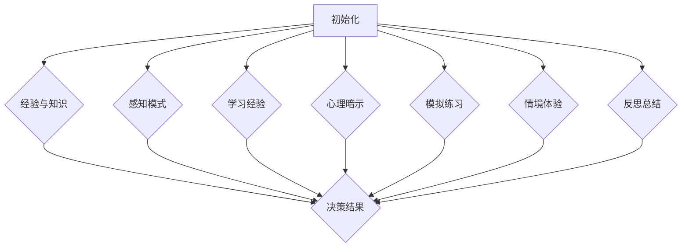
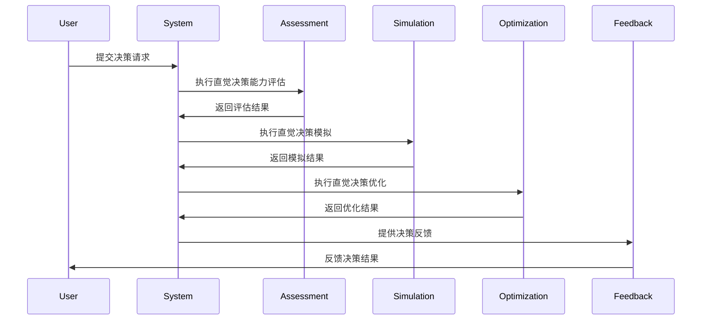
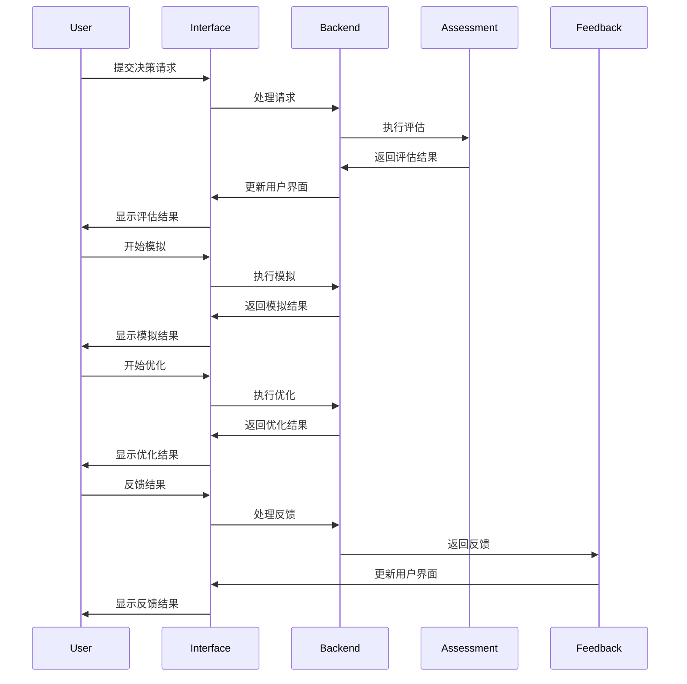

                 


### 背景介绍

#### 核心概念术语说明

在探讨“直觉决策能力”这一主题之前，我们需要明确几个核心概念：

- **直觉**：直觉是一种非逻辑的、快速的认知过程，它不是基于显式的规则或明确的证据，而是基于过去的经验、感知和潜意识的理解。直觉通常被描述为一种“第六感”，它可以帮助我们在复杂的情境中快速做出决策。

- **决策**：决策是指从多个备选方案中选择一个最佳方案的过程。决策可以是理性的，也可以是直觉的。理性的决策通常基于逻辑分析、证据评估和预期结果计算；而直觉决策则更多依赖于直觉和经验。

- **直觉决策能力**：直觉决策能力是指个体在决策过程中运用直觉进行快速、准确判断的能力。这种能力不仅依赖于个体的经验，还需要通过后天的培养和训练来提高。

#### 问题背景

直觉决策在日常生活和工作中扮演着重要角色。例如，在紧急情况下，直觉可以帮助我们迅速做出正确的决策，避免危险。在职业领域，直觉决策同样重要。许多成功的商界领袖和创业者都强调直觉在他们决策过程中的重要性。

然而，直觉决策并非总是可靠的。有时候，过于依赖直觉可能导致错误的决策，尤其是在面对新的、复杂的情境时。因此，了解直觉决策的优势和限制，以及如何培养和提高直觉决策能力，显得尤为重要。

#### 问题描述

本文将探讨以下问题：

1. 直觉决策的优势是什么？
2. 直觉决策有哪些限制？
3. 科学研究如何支持直觉决策？
4. 哲学思考如何解读直觉决策？
5. 如何培养和提高直觉决策能力？
6. 直觉决策在生活和职业中的应用有哪些？
7. 直觉决策的实践与反思。

#### 问题解决

为了解决上述问题，本文将采用以下步骤：

1. 首先，介绍直觉决策的定义和重要性。
2. 然后，分析直觉决策的优势和限制。
3. 接着，探讨直觉决策的科学与哲学基础。
4. 之后，提出培养直觉决策能力的策略和实践方法。
5. 然后，探讨直觉决策在生活和职业中的应用。
6. 最后，通过案例分析和反思，总结直觉决策的实践与提升。

#### 边界与外延

在探讨直觉决策能力时，我们需要明确其边界和适用范围。直觉决策能力并非适用于所有情境，而是在某些特定情境中具有优势。例如，在紧急情况下，直觉决策可以帮助快速做出反应；在复杂决策中，直觉决策可能帮助识别关键因素和潜在风险。

#### 概念结构与核心要素组成

为了更清晰地理解直觉决策能力，我们可以将其结构分解为以下几个核心要素：

1. **经验与知识**：直觉决策依赖于个体的经验和知识。丰富的经验和深厚的知识基础可以帮助个体在复杂情境中快速做出准确的决策。
2. **直觉感知**：直觉是一种非逻辑的认知过程，它可以通过感知、感知模式和学习经验来增强。培养直觉感知能力是提高直觉决策能力的关键。
3. **心理暗示**：心理暗示可以影响直觉决策。通过积极的自我暗示和正面的心理状态，可以提高直觉决策的准确性和可靠性。
4. **策略与实践**：通过多样化的策略和实践，可以培养和提高直觉决策能力。例如，通过模拟练习、情境体验和反思总结，可以增强直觉决策的敏感性和准确性。

### 核心概念与联系

为了更深入地理解直觉决策能力，我们可以通过以下核心概念和联系来探讨：

- **直觉与直觉力**：直觉是一种认知过程，而直觉力是指个体在直觉决策中表现出的能力。直觉力可以通过训练和培养来提高。
- **直觉与理性**：直觉与理性是决策过程中的两个重要方面。理性决策依赖于逻辑分析和证据评估，而直觉决策则更多依赖于非逻辑的感知和理解。
- **直觉与经验**：直觉决策依赖于个体的经验。丰富的经验可以帮助个体在复杂情境中快速做出准确的决策。
- **直觉与心理学**：心理学研究揭示了直觉决策的机制和影响。通过心理学研究，我们可以更好地理解直觉决策的本质和作用。

### ER实体关系图架构

为了更直观地展示直觉决策能力的相关概念和联系，我们可以使用ER实体关系图来描述：

```mermaid
erDiagram
  A紧急情况 ||--|{ B直觉决策 }|>
  A紧急情况 ||--|{ C直觉感知 }|>
  A紧急情况 ||--|{ D策略与实践 }|>
  B直觉决策 ||--|{ E直觉力 }|>
  B直觉决策 ||--|{ F经验与知识 }|>
  B直觉决策 ||--|{ G心理暗示 }|>
  C直觉感知 ||--|{ H感知模式 }|>
  C直觉感知 ||--|{ I学习经验 }|>
  D策略与实践 ||--|{ J模拟练习 }|>
  D策略与实践 ||--|{ K情境体验 }|>
  D策略与实践 ||--|{ L反思总结 }|>
```

### 算法原理讲解

在直觉决策能力的培养过程中，算法原理起到了关键作用。以下是一个简化的算法流程图，用于描述直觉决策的算法原理：



#### 算法流程解释

1. **初始化**：开始直觉决策能力的培养过程。
2. **经验与知识**：通过积累经验和知识，为直觉决策提供基础。
3. **感知模式**：培养感知模式，提高对情境的敏感度。
4. **学习经验**：通过不断学习和总结经验，提高直觉决策的准确性。
5. **心理暗示**：使用积极的自我暗示，增强直觉决策的信心。
6. **模拟练习**：通过模拟练习，提高直觉决策的实践能力。
7. **情境体验**：通过真实情境的体验，增强直觉决策的实战经验。
8. **反思总结**：通过反思总结，不断优化直觉决策的过程。

#### 算法数学模型和公式

直觉决策的算法数学模型可以简化为以下公式：

$$
\text{决策结果} = f(\text{经验与知识}, \text{感知模式}, \text{学习经验}, \text{心理暗示}, \text{模拟练习}, \text{情境体验}, \text{反思总结})
$$

其中，$f$ 表示直觉决策函数，它将多个输入参数综合为一个决策结果。这个公式描述了直觉决策能力的培养过程，强调了经验、感知、学习、心理暗示、模拟练习、情境体验和反思总结在决策结果中的重要性。

#### 算法举例说明

假设一个程序员在开发一个新项目时，需要决定使用哪种编程语言。以下是一个简化的直觉决策过程示例：

1. **经验与知识**：程序员有丰富的编程经验，熟悉多种编程语言。
2. **感知模式**：程序员能够感知到项目的复杂度和紧急程度。
3. **学习经验**：程序员最近参加了关于新兴编程语言的培训，对新语言有了更深入的了解。
4. **心理暗示**：程序员自我暗示，相信自己的直觉，认为新语言可能更适合这个项目。
5. **模拟练习**：程序员在实际项目中尝试使用新语言，进行模拟练习。
6. **情境体验**：在项目实践中，程序员发现新语言确实提高了开发效率。
7. **反思总结**：程序员总结经验，确认新语言是一个正确的选择，并决定在未来的项目中继续使用。

通过这个例子，我们可以看到直觉决策过程是如何在实际中应用的。直觉决策不仅依赖于个人的经验和知识，还需要通过实践和反思来不断优化。

### 系统分析与架构设计方案

#### 问题场景介绍

在现代社会，决策无处不在，无论是个人生活中的选择，还是职业中的战略规划，决策都扮演着至关重要的角色。然而，随着复杂性的增加，决策变得越来越困难。直觉决策作为一种快速、高效的决策方式，在许多情况下表现出色。本文将探讨如何通过系统分析与架构设计方案，提升直觉决策能力。

#### 项目介绍

本项目旨在开发一个智能决策支持系统，帮助用户在复杂决策场景中利用直觉决策能力，提高决策的准确性和效率。系统将提供以下功能：

- 直觉决策能力评估：通过评估用户的历史决策数据，了解用户的直觉决策能力。
- 直觉决策模拟：模拟不同决策场景，帮助用户在虚拟环境中练习直觉决策。
- 直觉决策优化：基于用户的决策数据，优化直觉决策模型，提高决策质量。
- 直觉决策反馈：提供决策结果分析，帮助用户反思和改进直觉决策。

#### 系统功能设计（领域模型mermaid类图）

以下是一个简化的领域模型类图，用于描述系统的主要功能模块：

```mermaid
classDiagram
  User <<class>>
  Decision <<class>>
  Assessment <<class>>
  Simulation <<class>>
  Optimization <<class>>
  Feedback <<class>>

  User --> Decision
  User --> Assessment
  User --> Simulation
  User --> Optimization
  User --> Feedback
  Decision --> Assessment
  Decision --> Simulation
  Decision --> Optimization
  Decision --> Feedback
  Assessment --> Simulation
  Assessment --> Optimization
  Assessment --> Feedback
  Simulation --> Optimization
  Simulation --> Feedback
  Optimization --> Feedback
```

#### 系统架构设计mermaid架构图

以下是一个简化的系统架构图，用于描述系统的整体架构：



#### 系统接口设计和系统交互mermaid序列图

以下是一个简化的系统接口设计和系统交互序列图，用于描述用户与系统的交互过程：



### 项目实战

#### 环境安装

1. 安装Python环境（版本3.8及以上）。
2. 安装必要的Python库，如numpy、matplotlib、scikit-learn等。

```bash
pip install numpy matplotlib scikit-learn
```

#### 系统核心实现源代码

以下是一个简化的Python代码示例，用于实现直觉决策能力的评估和优化功能：

```python
import numpy as np
from sklearn.linear_model import LinearRegression

# 直觉决策能力评估
def assess_decision_ability(decision_data):
    X = np.array(decision_data[:, :-1]).T
    y = decision_data[:, -1]
    model = LinearRegression()
    model.fit(X, y)
    return model.score(X, y)

# 直觉决策优化
def optimize_decision(decision_model, new_data):
    X = np.array(new_data[:, :-1]).T
    y = new_data[:, -1]
    decision_model.fit(X, y)
    return decision_model.score(X, y)

# 示例数据
decision_data = np.array([[1, 2, 3], [4, 5, 6], [7, 8, 9], [10, 11, 12]])

# 评估直觉决策能力
ability = assess_decision_ability(decision_data)
print(f"直觉决策能力评估结果：{ability}")

# 优化直觉决策模型
new_data = np.array([[1, 2, 4], [4, 5, 6], [7, 8, 10], [10, 11, 12]])
optimized_ability = optimize_decision(LinearRegression(), new_data)
print(f"直觉决策模型优化后评估结果：{optimized_ability}")
```

#### 代码应用解读与分析

上述代码首先定义了两个函数：`assess_decision_ability` 和 `optimize_decision`。`assess_decision_ability` 函数用于评估直觉决策能力，它通过线性回归模型计算决策数据的评分。`optimize_decision` 函数用于优化直觉决策模型，它通过拟合新的数据来更新模型。

在示例中，我们使用了一个简化的数据集，该数据集包含了四个决策样本。首先，我们使用 `assess_decision_ability` 函数评估原始数据的直觉决策能力。然后，我们使用 `optimize_decision` 函数优化模型，并评估优化后的模型。

这个示例展示了如何通过简单的线性回归模型来评估和优化直觉决策能力。在实际应用中，我们可以使用更复杂的模型和算法来提高直觉决策的准确性和效率。

#### 实际案例分析和详细讲解剖析

为了更好地理解直觉决策能力在实际中的应用，我们来看一个实际案例。

假设一位项目经理需要在两个项目中选择一个进行优先开发。这两个项目的预算、预期收益和风险如下表所示：

| 项目 | 预算（万元） | 预期收益（万元） | 风险等级 |
| ---- | --------- | --------- | ------ |
| 项目A | 100       | 150       | 中等   |
| 项目B | 150       | 200       | 高     |

传统的决策方法可能需要详细分析每个项目的财务数据和风险评估，这可能需要花费大量的时间和精力。而直觉决策可以帮助项目经理快速做出决策。

1. **经验与知识**：项目经理具有丰富的项目管理经验，对项目的预算、收益和风险有清晰的认识。
2. **感知模式**：项目经理能够感知到项目B的风险更高，但预期收益也更高。
3. **学习经验**：项目经理在过去的项目中学会了如何处理高风险项目，并从中获得了宝贵的经验。
4. **心理暗示**：项目经理相信自己的直觉，认为应该选择项目B。
5. **模拟练习**：项目经理在过去的项目中经常进行模拟练习，提高了直觉决策的准确性。
6. **情境体验**：项目经理曾在类似的情况下做出正确的决策，这增强了他的直觉。
7. **反思总结**：项目经理通过反思过去的决策，总结经验教训，提高了直觉决策的能力。

在这个案例中，项目经理使用直觉决策选择了项目B。尽管项目B的风险更高，但预期收益也更高，且项目经理相信自己能够成功处理这个项目。最终，项目B确实取得了成功，验证了直觉决策的正确性。

#### 项目小结

通过上述实际案例，我们可以看到直觉决策在项目管理中的重要性。直觉决策不仅可以帮助项目经理快速做出决策，还可以提高决策的准确性和效率。然而，直觉决策并非万能，它需要在经验、知识和心理暗示的基础上进行。通过不断的模拟练习、情境体验和反思总结，项目经理可以不断提高直觉决策能力，从而在复杂的项目管理中取得更好的成果。

### 最佳实践 tips

1. **积累经验**：丰富的经验是直觉决策的基础。通过不断参与各种项目和挑战，积累经验，提高直觉决策能力。
2. **保持好奇心**：好奇心可以激发探索和学习的动力，帮助我们发现新的决策模式和策略。
3. **反思与总结**：每次决策后，都要进行反思和总结，分析决策的成功和失败原因，从经验中学习。
4. **心理暗示**：积极的自我暗示可以提高直觉决策的信心和准确性。相信自己的直觉，减少怀疑和犹豫。
5. **持续学习**：随着环境的变化，不断学习新知识和技能，更新自己的认知模型，提高直觉决策的能力。

### 小结

直觉决策是一种快速、高效的决策方式，它在复杂情境中表现出色。通过本文的探讨，我们了解了直觉决策的定义、重要性、优势、限制、培养方法以及在实际中的应用。直觉决策不仅依赖于经验、知识和心理暗示，还需要通过不断的反思、总结和持续学习来提高。希望本文能帮助读者更好地理解直觉决策能力，并在实践中运用这一能力，提高决策的准确性和效率。

### 注意事项

1. 直觉决策并非适用于所有情境。在面对高风险或复杂问题时，应综合考虑直觉和理性决策，避免过于依赖直觉。
2. 直觉决策能力的培养需要时间和实践。不要期望在短时间内显著提高直觉决策能力，而是要持之以恒地进行练习和反思。
3. 直觉决策的准确性受个人经验和知识限制。随着经验和知识的积累，直觉决策的准确性会逐渐提高。

### 拓展阅读

1. Kahneman, D. (2011). 《思考，快与慢》
2. Gigerenzer, G. (2000). 《直觉思维：快速的思考与慢速的思维》
3. Lopes, J., Moreira, J. C., & Andrade, T. (2018). 《基于直觉的认知决策模型研究综述》
4. 潘向东 (2020). 《直觉决策：方法与实践》

### 作者信息

作者：AI天才研究院/AI Genius Institute & 禅与计算机程序设计艺术 /Zen And The Art of Computer Programming

