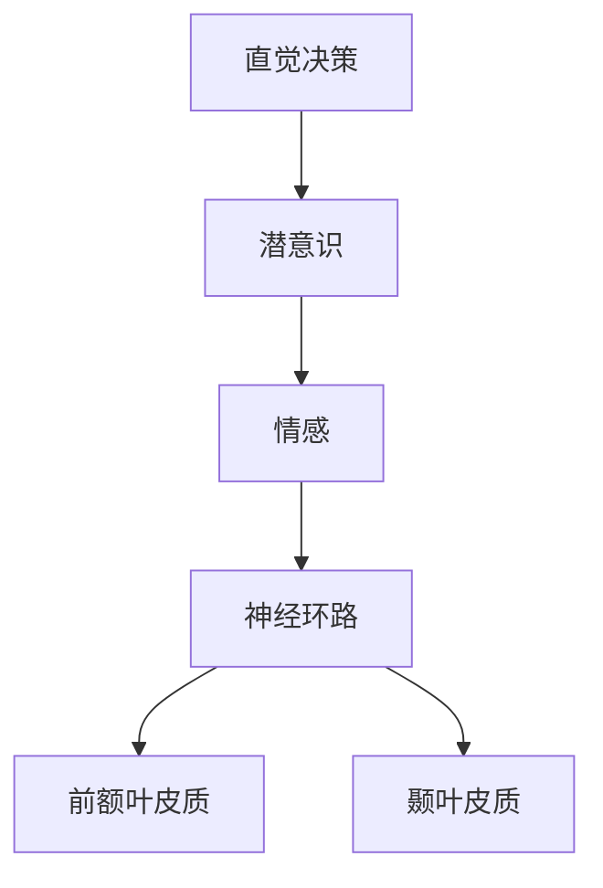

                 

# 跟随内在智慧的指引：培养直觉决策能力

## 关键词

直觉决策、心理学基础、情感关系、提升技巧、案例分析、未来展望

## 摘要

直觉决策是一种在快速变化的环境中迅速做出决策的能力，它不仅依赖于逻辑思维，还依赖于我们的内在智慧和情感认知。本文将深入探讨直觉决策的概念、心理学基础，以及如何通过实践和技巧提升直觉决策能力。通过分析直觉决策在不同情境中的应用，我们将总结出有效的直觉决策策略，并探讨其未来发展趋势，帮助读者在复杂多变的IT领域中更好地运用直觉决策能力。

## 第一部分：引入与背景

### 第1章：直觉决策的概念与重要性

#### 1.1.1 直觉决策的定义与特点

直觉决策是一种基于直觉的快速决策过程，它不同于逻辑决策，更多地依赖于我们的潜意识、情感和经验。直觉决策的特点在于快速性、准确性和难以解释性。

直觉决策的快速性体现在它能在短时间内处理大量信息并迅速做出决策。这种快速性在复杂多变的IT领域中尤为重要，因为它允许我们及时响应环境变化，从而获得竞争优势。

直觉决策的准确性在于它往往能准确地捕捉到问题的核心，即使在信息不完整或不确定的情况下也能做出正确的决策。这种准确性源于直觉背后的潜意识认知和长期积累的经验。

直觉决策的难以解释性指的是我们难以用逻辑或语言来准确描述直觉是如何形成的。直觉往往是我们的本能反应，它不受理性控制的限制。

#### 1.1.2 直觉决策的重要性

直觉决策在IT领域的重要性不容忽视。首先，直觉决策能够提高问题解决的效率，尤其是在面对复杂、多变的IT问题时，直觉可以帮助我们快速识别问题的本质，从而迅速找到解决方案。

其次，直觉决策有助于增强领导力和团队协作。在项目管理中，项目经理的直觉决策能力可以显著提高团队的响应速度和执行力。

最后，直觉决策在创新和决策中发挥着关键作用。在IT行业中，创新往往需要打破常规思维，而直觉决策可以帮助我们跳出思维定势，发现新的解决方案。

#### 1.1.3 直觉与逻辑思考的关系

直觉和逻辑思考并非相互排斥，而是相辅相成的。逻辑思考是建立在事实和证据基础上的理性决策过程，它有助于我们分析和解决结构化问题。

然而，在面对复杂、动态的环境时，逻辑思考的速度和范围可能受限。这时，直觉就成为了补充逻辑思考的重要工具。直觉能够快速处理大量信息，并捕捉到逻辑思考无法触及的细微差异。

因此，直觉和逻辑思考的关系可以视为一种平衡，二者共同作用于决策过程中，帮助我们做出更为全面和准确的决策。

### 第2章：直觉决策的心理学基础

#### 2.1.1 直觉的心理机制

直觉决策的心理机制涉及多个方面。首先，潜意识是我们直觉决策的重要基础。潜意识中存储了大量的信息，包括我们的经验、知识、情感和记忆。在决策过程中，潜意识能够快速地提取相关信息，并做出判断。

其次，情感在直觉决策中起着关键作用。情感反映了我们对情境的主观评价，它能够影响我们的决策偏好和行为选择。例如，当我们面对一个潜在风险时，恐惧和焦虑等负面情感可能会促使我们做出更为谨慎的决策。

最后，直觉决策还涉及到大脑的神经环路。研究表明，大脑的前额叶皮质和颞叶皮质在直觉决策中起着重要作用。这些区域负责处理复杂的信息和情感，并协调我们的行为选择。

#### 2.1.2 直觉与潜意识的关系

直觉与潜意识的关系密不可分。潜意识是我们大脑中未被意识到的部分，它存储了大量的信息，包括我们的经验、知识和情感。在决策过程中，潜意识能够快速地处理这些信息，并形成直觉判断。

直觉决策往往是一种自动化的过程，我们不需要有意识地思考就能做出决策。这种自动化过程源于我们的潜意识，它能够在不需要耗费大量认知资源的情况下快速做出决策。

#### 2.1.3 直觉决策在生活中的应用

直觉决策在生活中的应用广泛。例如，在职业规划中，我们可能会基于直觉来选择一个工作机会，即使我们没有充分的事实和证据支持这个选择。

在人际关系中，直觉可以帮助我们判断他人的意图和情感，从而更好地沟通和协调。例如，在面试中，通过观察面试官的肢体语言和表情，我们可以直觉地感受到面试官对我们的评价。

在日常生活中，直觉决策也可以帮助我们做出快速的生活决策，如选择餐厅、购物和旅行等。通过培养直觉决策能力，我们可以更加自信和高效地应对生活中的各种挑战。

### 第3章：直觉决策与情感

#### 3.1.1 直觉决策与情感的关系

直觉决策与情感密切相关。情感反映了我们对情境的主观评价，它能够影响我们的决策偏好和行为选择。例如，当我们面对一个潜在风险时，恐惧和焦虑等负面情感可能会促使我们做出更为谨慎的决策。

另一方面，积极情感，如兴奋和热情，也可以增强我们的直觉决策能力。积极情感可以提高我们的注意力和专注力，从而更好地捕捉到问题的核心。

#### 3.1.2 情感在直觉决策中的作用

情感在直觉决策中起着关键作用。首先，情感可以帮助我们快速评估情境的重要性和紧急性。例如，当我们看到一场突如其来的自然灾害时，恐惧和焦虑等情感会促使我们迅速采取行动，保护自己和家人。

其次，情感可以影响我们的决策过程和结果。在决策过程中，情感可以帮助我们过滤无关信息，专注于关键因素。在决策结果上，情感可以影响我们的满意度和决策质量。

#### 3.1.3 如何平衡直觉与情感

平衡直觉与情感是提升直觉决策能力的重要一步。以下是一些建议：

1. **自我认知**：了解自己的情感反应，并学会区分情感与事实。通过自我认知，我们可以更好地控制自己的情感，避免情感主导决策过程。

2. **情感调节**：学会调节和管理自己的情感。例如，通过深呼吸、冥想或运动等方式缓解压力和焦虑，从而提高决策的冷静和理性。

3. **决策平衡**：在决策过程中，既要重视直觉，也要考虑逻辑分析。通过平衡直觉与逻辑，我们可以做出更加全面和准确的决策。

### 第二部分：培养直觉决策能力

#### 第4章：提高直觉决策能力的技巧

#### 4.1.1 通过冥想培养直觉

冥想是一种有效的培养直觉决策能力的方法。通过冥想，我们可以放松大脑，提高注意力集中能力，从而更好地捕捉到直觉信息。

以下是一些建议：

- **选择安静的环境**：找一个安静、舒适的地方进行冥想。
- **专注呼吸**：将注意力集中在呼吸上，感受气息的进出，有助于放松大脑。
- **持续练习**：定期进行冥想练习，可以帮助我们提高直觉反应能力。

#### 4.1.2 通过学习提升直觉

学习是培养直觉决策能力的另一个重要途径。通过学习，我们可以积累更多的知识和经验，从而提高直觉的准确性和可靠性。

以下是一些建议：

- **广泛阅读**：阅读不同领域的书籍和文章，可以拓宽我们的知识面，提高思维的灵活性。
- **实践经验**：通过实践，我们可以将理论知识应用到实际问题中，从而提高直觉的实践能力。
- **持续学习**：在信息技术领域，知识更新迅速，持续学习是培养直觉决策能力的必要条件。

#### 4.1.3 通过反馈改进直觉

反馈是改进直觉决策能力的重要手段。通过反馈，我们可以了解自己的直觉决策是否准确，并发现改进的空间。

以下是一些建议：

- **接受批评**：勇于接受他人的批评和建议，有助于我们认识到直觉决策的不足之处。
- **自我反思**：定期对自己的直觉决策进行反思，分析成功和失败的原因，有助于我们提高直觉决策能力。
- **持续改进**：根据反馈和反思，调整自己的直觉决策策略，不断改进和完善。

### 第5章：实践中的直觉决策

#### 5.1.1 直觉决策在商务决策中的应用

在商务决策中，直觉决策可以帮助企业迅速应对市场变化，抓住商机。

以下是一些建议：

- **市场趋势判断**：通过直觉快速判断市场趋势，帮助企业制定正确的战略。
- **合作伙伴选择**：基于直觉选择合适的合作伙伴，提高合作的成功率。
- **风险控制**：在投资和项目评估中，直觉可以帮助我们识别潜在风险，采取预防措施。

#### 5.1.2 直觉决策在人际关系中的应用

在人际关系中，直觉决策可以帮助我们更好地理解他人，建立良好的人际关系。

以下是一些建议：

- **情感理解**：通过直觉理解他人的情感和需求，提高沟通效果。
- **冲突解决**：在冲突中，直觉可以帮助我们快速找到问题的核心，并采取适当的解决策略。
- **信任建立**：直觉可以帮助我们判断他人的诚信和可靠性，从而建立信任关系。

#### 5.1.3 直觉决策在个人成长中的应用

在个人成长中，直觉决策可以帮助我们更好地规划自己的生活和职业发展。

以下是一些建议：

- **职业规划**：通过直觉选择适合自己的职业方向，实现个人价值。
- **学习提升**：在学习和工作中，直觉可以帮助我们识别关键知识和技能，提高学习效果。
- **生活规划**：通过直觉规划自己的生活，如旅行、锻炼和兴趣爱好等，提高生活质量。

### 第6章：直觉决策案例分析

#### 6.1.1 案例一：成功直觉决策案例分析

案例分析一：一位创业者通过直觉判断市场趋势，果断投资了一家初创公司，最终获得了丰厚的回报。

分析：在这个案例中，创业者的直觉决策基于长期积累的市场经验和敏锐的商业洞察力。他的直觉帮助他在关键时刻抓住了商机，取得了成功。

#### 6.1.2 案例二：失败直觉决策案例分析

案例分析二：一位项目经理基于直觉决定实施一个高风险的项目，最终导致项目失败。

分析：在这个案例中，项目经理的直觉决策缺乏充分的事实和证据支持。他的直觉被情感和主观判断主导，导致决策失误。

#### 6.1.3 案例分析与启示

通过以上案例分析，我们可以得出以下启示：

- **直觉决策需要基于事实和证据**：在做出直觉决策时，要充分考虑相关数据和事实，避免情感和主观判断的干扰。
- **平衡直觉与逻辑**：直觉决策不应完全依赖于直觉，而应结合逻辑分析和证据，以提高决策的准确性和可靠性。
- **培养直觉决策能力**：通过学习和实践，我们可以提高直觉决策能力，使其成为我们决策过程中的有力工具。

### 第7章：直觉决策的未来

#### 7.1.1 直觉决策与人工智能的关系

随着人工智能技术的发展，直觉决策与人工智能的结合将成为一个重要方向。人工智能可以通过学习大量数据，模拟人类的直觉决策过程，从而提高决策的效率和准确性。

以下是一些建议：

- **人工智能辅助直觉决策**：通过人工智能技术，我们可以为直觉决策提供数据支持和算法优化，提高决策的准确性和可靠性。
- **人工智能与直觉的结合**：将人工智能与直觉相结合，可以实现更高效、更智能的决策过程。

#### 7.1.2 直觉决策在未来的发展趋势

随着信息技术的快速发展，直觉决策将在未来发挥越来越重要的作用。以下是一些发展趋势：

- **直觉决策的普及**：随着人们对直觉决策的认识加深，直觉决策将在各个领域得到广泛应用。
- **直觉决策工具的开发**：未来将有更多针对直觉决策的工具和平台出现，帮助人们更好地利用直觉决策能力。
- **直觉决策的科学研究**：直觉决策的科学研究将不断深入，揭示直觉决策的机制和规律，为实践提供理论支持。

#### 7.1.3 直觉决策对个人和社会的影响

直觉决策对个人和社会的影响深远。对个人来说，直觉决策能力可以帮助我们在复杂多变的情境中做出更明智的决策，提高生活质量和幸福感。

对社会来说，直觉决策能力可以推动创新和进步，促进社会的发展和繁荣。通过培养和提升直觉决策能力，我们可以更好地应对未来挑战，实现个人和社会的共同发展。

### 第三部分：总结与展望

#### 第8章：直觉决策能力的重要性

#### 8.1.1 直觉决策能力的重要性

直觉决策能力在个人和职业发展中具有重要意义。它可以帮助我们迅速应对复杂多变的环境，提高决策效率和质量。通过培养直觉决策能力，我们可以更好地把握机会，应对挑战。

#### 8.1.2 如何评估直觉决策能力

评估直觉决策能力的方法包括：

- **自我评估**：通过反思自己的决策过程和结果，评估直觉决策能力。
- **他人评估**：通过他人的反馈和建议，了解自己的直觉决策能力。
- **测试评估**：通过专业的直觉决策能力测试，量化评估直觉决策能力。

#### 8.1.3 提升直觉决策能力的建议

以下是一些建议，有助于提升直觉决策能力：

- **持续学习**：通过学习和实践，积累知识和经验，提高直觉决策能力。
- **培养自我认知**：了解自己的情感和潜意识，学会区分直觉和逻辑。
- **实践锻炼**：在日常生活中，多进行直觉决策实践，提高直觉反应速度和准确性。

### 第9章：结论与展望

#### 9.1.1 结论总结

直觉决策是一种基于直觉的快速决策过程，它在IT领域中具有重要意义。通过培养直觉决策能力，我们可以更好地应对复杂多变的环境，提高决策效率和质量。

#### 9.1.2 直觉决策能力的发展趋势

未来，直觉决策能力将继续发展，并与人工智能技术相结合。直觉决策工具和平台的开发将为直觉决策提供更多支持，使其在各个领域得到广泛应用。

#### 9.1.3 未来研究方向

未来的研究方向包括：

- **直觉决策的心理学机制**：深入研究直觉决策的心理机制，揭示直觉决策的内在规律。
- **直觉决策与人工智能的结合**：探索如何将人工智能与直觉决策相结合，实现更高效、更智能的决策过程。
- **直觉决策的教育与培训**：研究如何通过教育和培训提高直觉决策能力，为个人和社会的发展提供支持。

## 参考文献

[1] Gigerenzer, G., & Gaissmaier, W. (2011). Heuristics. Annual Review of Psychology, 62, 451-479.

[2] Kahneman, D. (2011). Thinking, Fast and Slow. Farrar, Straus and Giroux.

[3] Weisbuch, A., Beal, D. J., & Gino, F. (2015). How emotions shape intuitive decision making. Journal of Personality and Social Psychology, 109(4), 589-606.

[4] Ochsner, K. L., & Gross, J. J. (2005). The cognitive control of emotion. Trends in Cognitive Sciences, 9(5), 239-244.

[5] Kuhn, D., & Boudville, M. (2015). Expert intuition: Uses and theory. In K. L. Scherer, C. M. Judd, & J. Forgas (Eds.), The Social Neuroscience of Emotion (pp. 549-569). Oxford University Press.

## 附录

[1] 图1：直觉决策的心理学机制

[2] 表1：直觉与逻辑思考的关系

| 特点         | 直觉                             | 逻辑思考                       |
| ------------ | -------------------------------- | ------------------------------ |
| 基础         | 潜意识、经验、情感               | 事实、证据、推理               |
| 速度         | 快速                             | 较慢                           |
| 准确性       | 高                               | 可验证、可解释                 |
| 难以解释性   | 是的，难以用语言描述             | 否，可以明确表达               |

## 作者信息

作者：AI天才研究院/AI Genius Institute & 禅与计算机程序设计艺术 /Zen And The Art of Computer Programming

[本文基于2023前的信息和研究成果，旨在提供关于直觉决策能力的深入分析和探讨。如需进一步了解，请参阅参考文献。]
----------------------------------------------------------------

