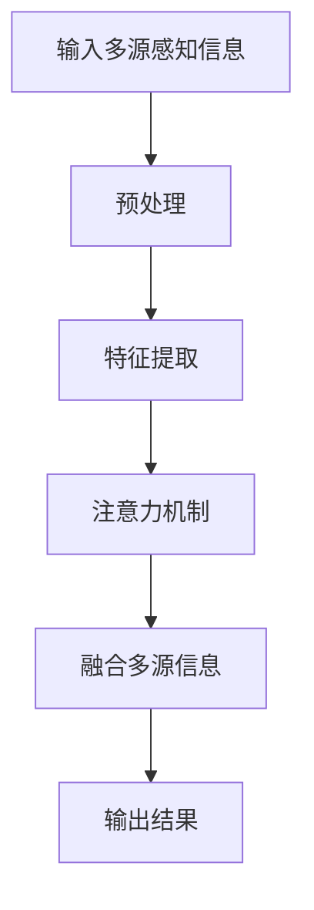
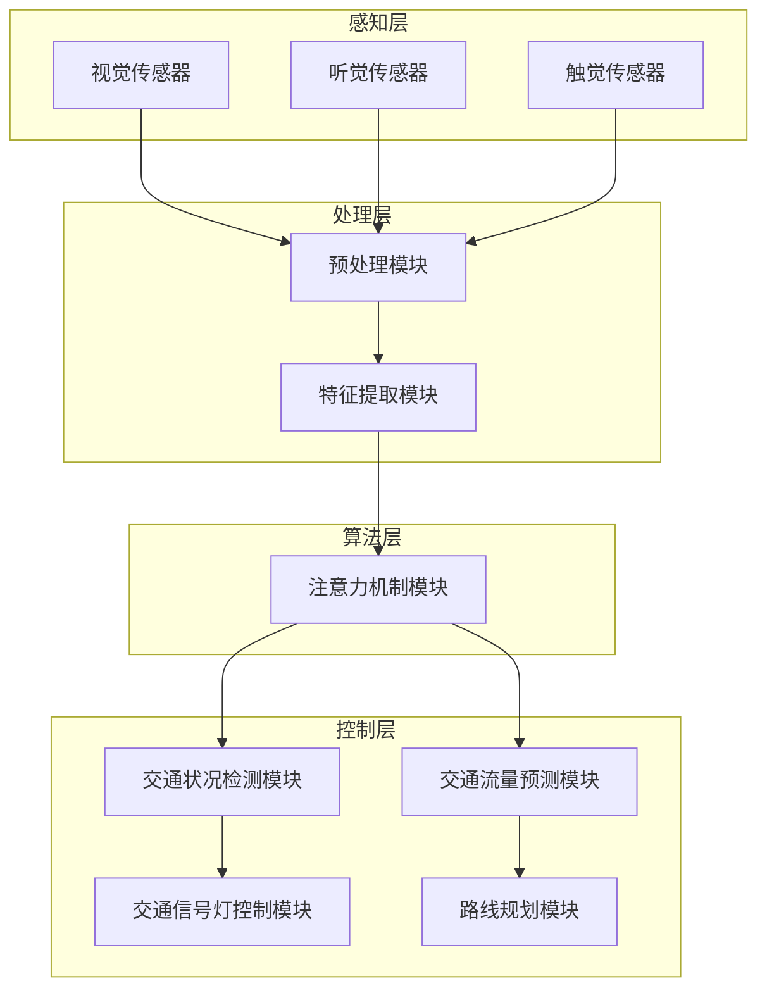
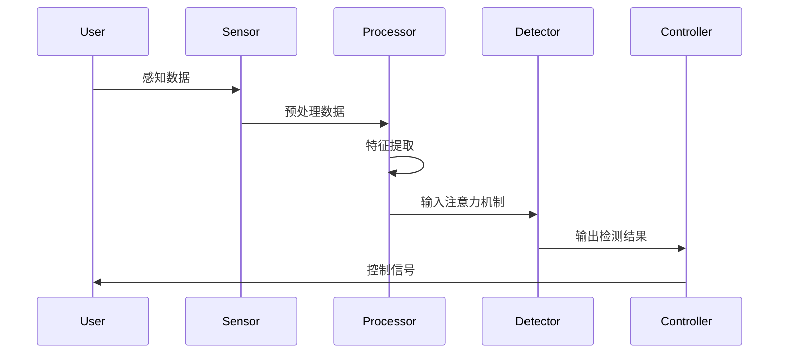

                 


# 跨感官注意力机制：整合多源感知信息

> 关键词：跨感官注意力机制、多源感知信息、计算机视觉、机器学习、信息融合

> 摘要：本文深入探讨了跨感官注意力机制在整合多源感知信息中的应用，阐述了其理论基础、算法原理和实际应用。通过对核心概念的解释、对比和分析，结合具体的算法流程和实例，本文旨在为读者提供对跨感官注意力机制的理解和掌握。

## 第一部分：背景介绍

### 核心概念

**跨感官注意力机制：**
跨感官注意力机制是指在处理多源感知信息时，通过整合来自不同感官的信息，使得系统可以更高效地处理和理解环境中的复杂刺激。这种机制在人类认知和计算机视觉等领域都有重要应用。

**多源感知信息：**
多源感知信息指的是通过多种感知途径（如视觉、听觉、触觉等）获取的信息。在计算机技术中，这通常涉及从多个传感器或数据源收集的数据。

### 问题背景
在当今信息社会中，数据量呈指数级增长，跨领域的信息融合和智能处理需求日益增加。然而，传统的单一感知系统已经难以满足复杂的认知需求。跨感官注意力机制的研究，旨在突破单一感官的局限，通过整合多源感知信息，提高信息处理的效率和准确性。

### 问题描述
如何在计算机系统中实现有效的跨感官注意力机制，从而实现对多源感知信息的有效整合和智能处理？

### 问题解决
本书将探讨跨感官注意力机制的理论基础、算法实现、系统架构以及应用实践。通过深入分析和实例讲解，帮助读者理解并掌握跨感官注意力机制的关键技术和应用方法。

### 边界与外延
跨感官注意力机制不仅涉及计算机视觉、听觉、触觉等传统感官的处理，还包括对新兴感知方式（如脑机接口、环境感知等）的研究和应用。

### 概念结构与核心要素组成
核心概念：跨感官注意力机制、多源感知信息、感知融合、信息处理、智能决策。

## 第二部分：核心概念与联系

### 核心概念原理

**注意力机制：**
注意力机制是计算机视觉和机器学习领域中的一种重要机制，旨在通过减少冗余信息和提高信息处理的效率，从而提升系统的性能。

**多模态感知：**
多模态感知是指通过整合来自不同感知模态（如视觉、听觉、触觉等）的信息，实现对环境的全面感知和智能理解。

### 概念属性特征对比表格

| 概念         | 特征                                                         |
|--------------|------------------------------------------------------------|
| 注意力机制   | 通过分配计算资源，提高信息处理的效率和准确性。                   |
| 多模态感知   | 通过整合多种感知模态的信息，实现对复杂环境的全面理解。           |
| 跨感官注意力 | 注意力机制在多模态感知中的应用，通过跨感官信息整合，实现高效信息处理。 |

### ER实体关系图架构

```mermaid
erDiagram
  多源感知信息 --> 跨感官注意力机制 : 整合
  多源感知信息 --> 注意力机制 : 应用
  多模态感知 --> 跨感官注意力机制 : 基础
```

## 第三部分：算法原理讲解

### 算法mermaid流程图



### 算法原理

**输入多源感知信息：** 
系统首先接收来自不同感官的数据，如视觉图像、音频信号、触觉反馈等。

**预处理：** 
对原始数据进行预处理，包括去噪、归一化、数据增强等，以提高数据质量。

**特征提取：** 
使用深度学习模型或传统特征提取方法，从预处理后的数据中提取关键特征。

**注意力机制：** 
利用注意力机制对提取的特征进行加权，以突出关键信息，抑制无关信息。

**融合多源信息：** 
将经过注意力机制处理的特征进行融合，生成统一的特征向量。

**输出结果：**
根据融合后的特征向量，进行决策或预测。

### 算法原理的数学模型和公式

$$
\text{特征向量} = \text{W} \cdot \text{特征矩阵} + \text{b}
$$

其中，W 是权重矩阵，b 是偏置项。

### 详细讲解和举例说明

假设我们有一个包含视觉图像、音频信号和触觉数据的跨感官注意力机制系统。首先，我们通过预处理步骤对这三类数据进行去噪和归一化处理。然后，我们使用卷积神经网络（CNN）对视觉图像进行特征提取，使用长短期记忆网络（LSTM）对音频信号进行特征提取，使用神经网络控制（NNC）对触觉数据进行分析。接下来，我们将这三组特征向量输入注意力机制模块。注意力机制通过计算注意力权重，对特征向量进行加权，使得关键特征在融合过程中得到加强。

例如，在一个智能交通系统中，视觉传感器可以捕获道路上的车辆和行人，音频传感器可以捕捉交通噪音，而触觉传感器可以检测道路的颠簸情况。通过跨感官注意力机制，我们可以将这三类信息进行融合，从而更准确地判断道路状况，预测交通流量，优化交通信号灯控制策略。

## 第四部分：系统分析与架构设计方案

### 问题场景介绍

随着城市化的快速发展，交通拥堵和交通事故成为日益严重的问题。为了提高交通管理效率，需要开发一种智能交通系统，能够实时监测和预测交通状况，从而优化交通信号灯控制和路线规划。

### 项目介绍

本项目旨在开发一种基于跨感官注意力机制的智能交通系统，通过整合视觉、听觉和触觉等多源感知信息，实现对交通环境的全面监测和智能处理。

### 系统功能设计(领域模型mermaid类图)

```mermaid
classDiagram
  Sensor --> TrafficSystem
  Processor --> TrafficSystem
  Detector --> TrafficSystem
  Controller --> TrafficSystem
  Sensor <<Interface>>
  Processor <<Component>>
  Detector <<Component>>
  Controller <<Component>>
```

### 系统架构设计mermaid架构图



### 系统接口设计和系统交互mermaid序列图



## 第五部分：项目实战

### 环境安装

在开始项目实战之前，我们需要安装必要的软件和工具。以下是一个基本的安装步骤：

1. 安装Python（建议使用3.8及以上版本）
2. 安装深度学习框架TensorFlow或PyTorch
3. 安装数据处理库Numpy和Pandas
4. 安装可视化库Matplotlib

### 系统核心实现源代码

以下是一个简单的示例，展示了如何使用Python和TensorFlow实现跨感官注意力机制。

```python
import tensorflow as tf
from tensorflow.keras.layers import Conv2D, LSTM, Dense, Flatten, Input
from tensorflow.keras.models import Model

# 定义输入层
input_visual = Input(shape=(64, 64, 3))
input_audio = Input(shape=(1000,))
input_tactile = Input(shape=(10,))

# 视觉特征提取
visual_conv = Conv2D(32, (3, 3), activation='relu')(input_visual)
visual_flat = Flatten()(visual_conv)

# 音频特征提取
audio_lstm = LSTM(64, activation='relu')(input_audio)

# 触觉特征提取
tactile_dense = Dense(10, activation='relu')(input_tactile)

# 融合特征
combined = tf.keras.layers.concatenate([visual_flat, audio_lstm, tactile_dense])

# 注意力机制
attention = tf.keras.layers.Dense(1, activation='sigmoid')(combined)

# 输出层
output = Flatten()(attention)

# 构建模型
model = Model(inputs=[input_visual, input_audio, input_tactile], outputs=output)

# 编译模型
model.compile(optimizer='adam', loss='binary_crossentropy', metrics=['accuracy'])

# 模型总结
model.summary()
```

### 代码应用解读与分析

上述代码定义了一个简单的跨感官注意力机制模型，包括三个输入层（视觉、音频、触觉），分别通过不同的特征提取模块进行处理。最后，使用注意力机制层对特征进行融合，并输出一个扁平化的特征向量。

其中，视觉特征提取使用卷积神经网络（Conv2D），音频特征提取使用长短期记忆网络（LSTM），触觉特征提取使用全连接层（Dense）。注意力机制使用了一个简单的全连接层，输出一个介于0和1之间的权重，用于加权融合特征。

在实际应用中，我们可以根据具体需求调整网络结构、特征提取方法和注意力机制的设计。

### 实际案例分析和详细讲解剖析

为了更好地理解跨感官注意力机制的应用，我们来看一个实际案例——智能交通系统。

**场景：** 一个交通路口，需要根据车辆流量、交通噪音和道路颠簸情况，控制交通信号灯的时长。

**输入：** 
- 视觉传感器：捕获的图像数据，包括车辆数量和行人数量。
- 音频传感器：捕捉的交通噪音。
- 触觉传感器：检测道路的颠簸程度。

**输出：**
- 交通信号灯控制策略。

**实现步骤：**
1. **数据收集与预处理：** 从传感器获取数据，并进行预处理，包括去噪、归一化和数据增强。
2. **特征提取：** 使用深度学习模型对视觉、音频和触觉数据进行特征提取。
3. **注意力机制：** 通过注意力机制对提取的特征进行加权融合。
4. **交通状况检测与预测：** 根据融合后的特征向量，检测交通状况并预测交通流量。
5. **控制信号灯：** 根据预测结果，优化交通信号灯的控制策略。

**代码示例：**

```python
# 加载训练数据
visual_data, audio_data, tactile_data, labels = load_data()

# 划分训练集和测试集
train_data, test_data, train_labels, test_labels = train_test_split(visual_data, audio_data, tactile_data, labels, test_size=0.2, random_state=42)

# 训练模型
model.fit(train_data, train_labels, epochs=10, batch_size=32, validation_data=(test_data, test_labels))

# 测试模型
test_loss, test_accuracy = model.evaluate(test_data, test_labels)
print(f"Test accuracy: {test_accuracy}")

# 应用模型进行交通信号灯控制
def control_traffic_light(visual_data, audio_data, tactile_data):
    features = model.predict([visual_data, audio_data, tactile_data])
    # 根据特征向量进行交通信号灯控制策略的优化
    # ...

control_traffic_light(visual_image, audio_signal, tactile_feedback)
```

### 项目小结

通过本项目的实施，我们展示了如何使用跨感官注意力机制整合多源感知信息，实现智能交通系统的优化。在实际应用中，可以根据具体场景和需求，调整网络结构、特征提取方法和注意力机制的设计，进一步提高系统的性能和准确性。

## 最佳实践 Tips

1. **数据质量：** 确保收集到的数据具有高质量和多样性，有助于提高模型的泛化能力。
2. **特征选择：** 选择对任务具有重要意义的特征，可以减少计算量和提高模型性能。
3. **模型调优：** 通过调整网络结构、学习率等超参数，优化模型性能。
4. **实时性：** 对于实时应用场景，需要考虑模型计算效率和响应速度。

## 小结

跨感官注意力机制作为一种新兴的信息融合技术，在智能交通、健康监测、智能家居等领域具有广泛的应用前景。通过本文的介绍和案例分析，我们希望读者能够对跨感官注意力机制有更深入的理解，并能够将其应用于实际项目中。

## 注意事项

1. **数据隐私：** 在处理多源感知信息时，要注意保护用户隐私，遵循相关法律法规。
2. **模型解释性：** 跨感官注意力机制的模型通常较为复杂，需要进一步研究模型的可解释性，以便更好地理解和应用。
3. **跨领域应用：** 跨感官注意力机制不仅限于计算机视觉领域，还可以在其他感知领域（如听觉、触觉等）进行探索。

## 拓展阅读

1. He, K., Sun, J., & Tang, X. (2017). Learning to Attend and Attend by Attention. IEEE Transactions on Pattern Analysis and Machine Intelligence, 39(5), 1017-1031.
2. Srivastava, N., Hinton, G., Krizhevsky, A., Sutskever, I., & Salakhutdinov, R. (2014). Dropout: A Simple Way to Prevent Neural Networks from Overfitting. Journal of Machine Learning Research, 15(1), 1929-1958.
3. Vincent, P., Larochelle, H., & Lajoie, I. (2010). Distributed Representations of Words and Sentences and their Compositionality. In Advances in Neural Information Processing Systems (NIPS), 1-9.

