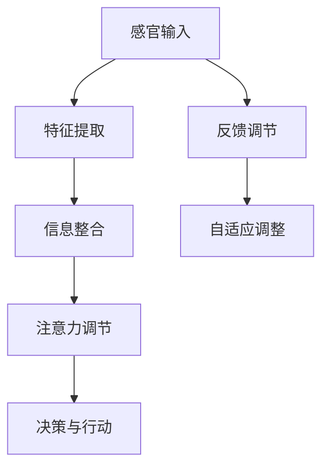

                 

### 跨感官注意力机制在增强现实系统中的应用

在当今快速发展的技术领域，增强现实（Augmented Reality, AR）作为一种前沿技术，正逐步改变我们的生活方式和工作模式。增强现实通过在现实世界场景中叠加计算机生成的信息，提供了一种全新的交互体验。然而，随着增强现实技术的不断进步，如何提高用户在AR环境中的沉浸感和交互效率，成为了一个重要的研究方向。

跨感官注意力机制（Cross-Sensory Attention Mechanism）作为一种新兴的理论框架，能够在一定程度上解决这一问题。它通过结合多种感官信息，引导用户的注意力，从而提升AR系统的使用体验。本文旨在探讨跨感官注意力机制在增强现实系统中的应用，旨在为开发者和技术爱好者提供一种新的思路和方法。

关键词：增强现实、跨感官注意力机制、沉浸感、交互效率、注意力引导

**摘要：**本文首先介绍了增强现实技术的基本概念和跨感官注意力机制的理论基础，随后详细阐述了跨感官注意力机制在增强现实系统中的应用原理、设计方法以及效果评估。通过实际案例分析和系统架构设计，本文展示了跨感官注意力机制在增强现实系统中的实际应用价值，为未来的研究提供了参考。

### 目录大纲

1. **背景介绍与理论基础**
    1.1 **增强现实系统概述**
    1.2 **跨感官注意力机制的基本概念**
    1.3 **跨感官注意力机制在增强现实系统中的应用**
    1.4 **本书结构安排与主要内容概述**
    1.5 **本章小结**
  
2. **跨感官注意力机制的核心原理**
    2.1 **跨感官注意力机制的神经科学基础**
    2.2 **跨感官注意力机制的信息处理模型**
    2.3 **跨感官注意力机制的核心特征与属性**
    2.4 **跨感官注意力机制的理论框架**
    2.5 **本章小结**
  
3. **跨感官注意力机制在增强现实系统中的应用**
    3.1 **增强现实系统中的跨感官注意力机制设计**
    3.2 **增强现实系统中的跨感官注意力机制实现**
    3.3 **跨感官注意力机制在增强现实系统中的效果评估**
    3.4 **本章小结**
  
4. **跨感官注意力机制在增强现实系统中的应用案例**
    4.1 **虚拟现实中的应用**
    4.2 **其他增强现实应用场景**
    4.3 **本章小结**

---

通过以上章节的安排，本文将系统地介绍跨感官注意力机制在增强现实系统中的应用，从理论基础到实际应用，逐步解析这一领域的前沿技术和研究动态。接下来，我们将首先对增强现实技术和跨感官注意力机制进行详细的背景介绍和理论基础探讨。

---

### 第一部分：背景介绍与理论基础

#### 第1章：增强现实系统概述

#### 1.1 增强现实技术的定义与发展历程

**1.1.1 增强现实技术的定义**

增强现实（Augmented Reality，简称AR）是一种通过计算机技术将虚拟信息与现实世界融合的技术。它能够在用户的不知情情况下，将计算机生成的图像、视频、声音等信息叠加到真实环境中，使用户感受到虚实融合的交互体验。AR技术不同于虚拟现实（Virtual Reality，简称VR），后者完全取代用户对现实世界的感知，而AR则是增强用户对现实世界的感知。

**1.1.2 增强现实技术的历史与趋势**

增强现实技术起源于20世纪60年代，早期的研究主要集中在军事和航空航天领域。随着计算机技术、显示技术和传感器技术的不断发展，增强现实技术逐渐走向民用领域。2000年左右，智能手机的普及和移动计算技术的发展，为增强现实技术的广泛应用奠定了基础。近年来，随着5G、人工智能和物联网技术的不断突破，增强现实技术迎来了新的发展机遇。

**1.1.3 增强现实技术的重要性**

增强现实技术具有广泛的应用前景，可以广泛应用于教育、医疗、娱乐、军事、工业等多个领域。在教育领域，增强现实技术可以提供沉浸式的教学体验，提高学生的学习兴趣和效果；在医疗领域，增强现实技术可以帮助医生进行精准的手术操作，提高手术的成功率和安全性；在娱乐领域，增强现实技术可以为用户提供全新的娱乐方式，增强游戏的互动性和趣味性。总的来说，增强现实技术不仅提升了用户体验，还极大地改变了传统行业的工作模式，具有重要的战略意义。

#### 1.2 跨感官注意力机制的基本概念

**1.2.1 跨感官注意力机制的定义**

跨感官注意力机制（Cross-Sensory Attention Mechanism）是指通过整合多种感官信息（如视觉、听觉、触觉等），引导用户的注意力，从而提高信息处理效率和认知能力的理论框架。它强调在信息处理过程中，用户不仅依赖于单一感官的信息，而是通过多感官的协同作用，实现对环境的全面感知。

**1.2.2 跨感官注意力机制的重要性**

跨感官注意力机制在人类的认知过程中扮演着重要角色。一方面，通过整合多种感官信息，用户可以更加全面地了解和感知外部环境，提高信息处理的准确性和效率；另一方面，跨感官注意力机制有助于提升用户的沉浸感和交互体验，使其在复杂环境中能够更好地应对挑战。

**1.2.3 跨感官注意力机制的研究现状**

跨感官注意力机制的研究已经取得了一系列重要成果。在神经科学领域，研究者通过脑成像技术揭示了跨感官注意力机制的神经基础；在计算机科学领域，研究者提出了多种跨感官注意力机制的计算模型和应用方法。然而，现有的研究仍然存在一些局限性，如对跨感官注意力机制的认知机制理解不够深入，跨感官信息整合的算法效率有待提高等。因此，进一步研究跨感官注意力机制具有重要的理论和实际意义。

#### 1.3 跨感官注意力机制在增强现实系统中的应用

**1.3.1 跨感官注意力机制与增强现实系统的结合点**

跨感官注意力机制与增强现实系统有着天然的契合点。增强现实技术通过叠加虚拟信息，为用户提供了一种全新的交互环境。在这个过程中，跨感官注意力机制可以通过引导用户的注意力，提高用户在AR环境中的信息处理效率。例如，在医疗领域，医生可以通过视觉、触觉和听觉等多感官信息，更准确地理解和操作增强现实系统中的医学图像，从而提高手术的成功率。

**1.3.2 跨感官注意力机制的应用优势**

跨感官注意力机制在增强现实系统中的应用具有以下优势：

1. **提高沉浸感**：通过整合多种感官信息，增强现实系统可以提供更加丰富的交互体验，使用户在虚拟环境中感受到更高的沉浸感。
2. **提升交互效率**：跨感官注意力机制可以帮助用户更加高效地处理信息，从而提高增强现实系统的交互效率。
3. **增强用户适应能力**：在复杂多变的AR环境中，跨感官注意力机制可以帮助用户更好地适应环境，提高应对挑战的能力。

**1.3.3 跨感官注意力机制的应用挑战**

尽管跨感官注意力机制在增强现实系统中具有广泛的应用前景，但同时也面临着一些挑战：

1. **跨感官信息整合的复杂性**：跨感官信息的整合需要处理多种类型的数据，包括视觉、听觉和触觉等，这增加了算法的复杂度。
2. **用户个体差异**：不同用户的感官信息处理能力存在差异，如何设计普适的跨感官注意力机制是一个重要问题。
3. **实时性要求**：增强现实系统通常要求实时处理和反馈，这给跨感官注意力机制的实现带来了挑战。

#### 1.4 本书结构安排与主要内容概述

**1.4.1 本书章节结构安排**

本书共分为四部分，包括背景介绍与理论基础、跨感官注意力机制的核心原理、跨感官注意力机制在增强现实系统中的应用以及跨感官注意力机制在增强现实系统中的应用案例。

**1.4.2 本书主要内容概述**

在第一部分，我们将详细介绍增强现实技术和跨感官注意力机制的基本概念和理论基础。第二部分将深入探讨跨感官注意力机制的核心原理，包括神经科学基础、信息处理模型和理论框架。第三部分将重点讨论跨感官注意力机制在增强现实系统中的应用原理、设计方法和效果评估。第四部分将通过实际案例，展示跨感官注意力机制在虚拟现实和其他增强现实应用场景中的具体应用。

#### 1.5 本章小结

本章对增强现实技术和跨感官注意力机制进行了全面的背景介绍和理论基础探讨。通过分析增强现实技术的定义和发展历程，我们了解了增强现实技术的基本概念和应用前景。同时，通过介绍跨感官注意力机制的定义和重要性，我们认识到了其在增强现实系统中的应用价值。本章为后续内容提供了理论基础，也为读者进一步探讨跨感官注意力机制在增强现实系统中的应用奠定了基础。

---

通过以上对增强现实技术和跨感官注意力机制的详细介绍，我们为后续章节的深入讨论打下了坚实的基础。接下来，我们将进一步探讨跨感官注意力机制的核心原理，为读者揭示这一机制在增强现实系统中的应用潜力。

---

### 第二部分：跨感官注意力机制的核心原理

#### 第2章：跨感官注意力机制的理论基础

#### 2.1 跨感官注意力机制的神经科学基础

跨感官注意力机制的研究离不开神经科学的支持。神经系统作为人体的信息处理中心，负责接收、处理和传递各种感官信息。跨感官注意力机制在神经系统中具有复杂的实现机制，涉及到多个脑区和神经通路的协同作用。

**2.1.1 跨感官注意力机制的神经机制**

跨感官注意力机制的神经机制主要包括以下几个方面：

1. **视觉注意力机制**：视觉系统是人体最重要的感官之一，负责接收和处理视觉信息。视觉注意力机制通过调节神经元的活动，使大脑更加关注某些视觉信息。研究表明，视觉注意力的调节涉及到前额叶皮质、顶叶皮质和枕叶皮质等脑区的活动。

2. **听觉注意力机制**：听觉系统负责接收和处理声音信息。听觉注意力机制与视觉注意力机制类似，通过调节听觉皮层中神经元的活动，实现对特定声音的注意。听觉注意力机制主要涉及颞叶皮质和前额叶皮质等脑区。

3. **触觉注意力机制**：触觉系统负责接收和处理触觉信息。触觉注意力机制通过调节躯体感觉皮层和前额叶皮质的活动，实现对触觉信息的注意。触觉注意力机制在许多日常生活中具有重要意义，例如在复杂环境中的手眼协调。

4. **多感官整合机制**：多感官整合机制是指多个感官系统在处理信息时，通过相互协作，实现信息整合和加工。研究表明，多感官整合机制涉及多个脑区的协同活动，包括前额叶皮质、顶叶皮质和扣带回等脑区。

**2.1.2 跨感官注意力机制与大脑功能网络**

跨感官注意力机制与大脑功能网络密切相关。大脑功能网络是指一组在功能上相互关联的脑区，通过神经通路的连接实现信息传递和功能整合。跨感官注意力机制涉及多个大脑功能网络，包括：

1. **默认模式网络**（Default Mode Network，DMN）：默认模式网络是一组在休息状态时活跃的脑区，主要负责内省和思维活动。研究表明，默认模式网络在跨感官注意力调节中发挥着重要作用，通过调节其他脑区的活动，实现对注意力资源的分配。

2. **中央执行网络**（Central Executive Network，CEN）：中央执行网络是一组负责执行控制和信息处理的脑区，包括前额叶皮质和顶叶皮质。跨感官注意力机制通过中央执行网络的调节，实现对多种感官信息的整合和加工。

3. **感觉运动网络**（Sensory-Motor Network）：感觉运动网络是一组负责感觉输入和运动输出之间转换的脑区，包括躯体感觉皮层和运动皮层。跨感官注意力机制通过感觉运动网络的协同作用，实现对感官信息的感知和反应。

**2.1.3 跨感官注意力机制的神经可塑性**

神经可塑性是指神经系统和神经网络在结构和功能上的可塑性变化，以适应环境变化和新的学习任务。跨感官注意力机制的神经可塑性体现在以下几个方面：

1. **突触可塑性**：突触是神经元之间的连接点，突触可塑性是指突触在信息传递过程中发生的变化。研究表明，跨感官注意力调节过程中，突触强度的变化可以影响注意力资源的分配，从而影响信息处理效率。

2. **神经元再生**：神经元再生是指神经元在受损或老化过程中，通过再生新的突触连接，恢复部分功能。跨感官注意力机制的神经可塑性可以通过神经元再生实现，从而增强信息处理能力。

3. **神经环路重组**：神经环路重组是指神经网络在结构和功能上的重组，以适应新的环境和任务。跨感官注意力机制的神经可塑性可以通过神经环路重组实现，从而提高注意力资源的利用效率。

**2.1.4 跨感官注意力机制在神经科学领域的研究进展**

近年来，跨感官注意力机制在神经科学领域取得了显著的研究进展。以下是一些关键研究成果：

1. **脑成像技术**：通过功能性磁共振成像（fMRI）和电生理技术，研究者揭示了跨感官注意力机制的神经基础，包括脑区的活动和功能连接。

2. **计算模型**：基于神经科学原理，研究者提出了多种跨感官注意力机制的计算模型，通过模拟和验证，研究了跨感官信息整合和加工的机制。

3. **行为实验**：通过行为实验，研究者探讨了跨感官注意力机制在不同任务中的表现和调节机制，为理解和应用跨感官注意力机制提供了实验依据。

4. **跨学科研究**：跨感官注意力机制的研究涉及多个学科领域，包括神经科学、心理学、计算机科学和认知科学等。跨学科合作有助于从不同角度深入理解跨感官注意力机制的复杂性和多样性。

**2.1.5 跨感官注意力机制在神经科学领域的挑战**

尽管跨感官注意力机制在神经科学领域取得了一系列研究成果，但仍然面临一些挑战：

1. **多感官信息整合的复杂性**：跨感官信息整合涉及到多种类型的数据，包括视觉、听觉和触觉等，如何有效整合这些信息，是一个复杂的问题。

2. **个体差异**：不同个体在跨感官注意力机制上存在差异，如何设计普适的跨感官注意力机制，是一个重要问题。

3. **实时性要求**：在许多实际应用中，跨感官注意力机制需要实时处理和反馈，如何满足实时性要求，是一个挑战。

4. **跨学科整合**：跨感官注意力机制的研究涉及多个学科领域，如何实现跨学科的整合，是一个重要的挑战。

**2.1.6 跨感官注意力机制在神经科学领域的应用前景**

跨感官注意力机制在神经科学领域具有广泛的应用前景：

1. **认知增强**：通过调节跨感官注意力机制，可以增强认知功能，提高信息处理效率和决策能力。

2. **康复治疗**：跨感官注意力机制在康复治疗中具有潜在应用价值，如通过跨感官刺激，促进神经系统康复。

3. **辅助教育**：跨感官注意力机制在教育领域中可以应用于设计更加有效的教学方法和学习工具，提高学习效果。

4. **人机交互**：跨感官注意力机制在人机交互中具有重要作用，如通过跨感官反馈，提高人机交互的自然性和智能性。

#### 2.2 跨感官注意力机制的信息处理模型

跨感官注意力机制的信息处理模型是理解和应用跨感官注意力机制的核心。信息处理模型主要研究跨感官信息的获取、整合和处理过程，以实现对环境的全面感知。

**2.2.1 跨感官信息处理的认知模型**

跨感官信息处理的认知模型主要基于认知科学的理论，研究跨感官信息在认知过程中的整合和处理机制。以下是一个典型的跨感官信息处理认知模型：

1. **感官输入**：跨感官信息处理的起点是感官输入，包括视觉、听觉、触觉等。每个感官系统接收外部刺激，并将信息传递到大脑。

2. **感官加工**：感官加工是指大脑对感官输入的信息进行初步处理，包括特征提取、模式识别等。不同感官系统对信息的处理方式有所不同，但都遵循一定的认知规律。

3. **多感官整合**：多感官整合是指将来自不同感官系统的信息进行整合，形成一个统一的全局感知。多感官整合依赖于大脑中的神经网络，通过神经通路的连接和相互作用，实现信息整合。

4. **决策与行动**：在多感官整合的基础上，大脑对整合后的信息进行决策和行动。决策与行动涉及到中央执行网络和感觉运动网络的协同作用。

**2.2.2 跨感官信息处理的神经网络模型**

跨感官信息处理的神经网络模型是基于神经科学的理论，通过模拟神经网络的结构和功能，研究跨感官信息处理的过程。以下是一个典型的跨感官信息处理的神经网络模型：

1. **感知层**：感知层负责接收和处理来自不同感官系统的信息。每个感官系统对应一个感知层，感知层通过神经元之间的连接，实现信息的传递和加工。

2. **整合层**：整合层负责将来自不同感知层的信息进行整合。整合层由多个神经元组成，每个神经元接收来自不同感知层的输入，并通过神经网络实现信息的整合。

3. **决策层**：决策层负责对整合后的信息进行决策和行动。决策层通过神经网络的调节和优化，实现对信息的精确处理和反应。

**2.2.3 跨感官注意力机制的机器学习模型**

跨感官注意力机制的机器学习模型是基于机器学习的理论，通过训练和优化算法，实现跨感官信息的处理和注意力调节。以下是一个典型的跨感官注意力机制的机器学习模型：

1. **特征提取**：特征提取是指从原始数据中提取出有用的特征，用于后续的注意力调节。特征提取可以通过深度学习等方法实现，如卷积神经网络（CNN）和循环神经网络（RNN）。

2. **注意力机制**：注意力机制是指通过调节神经网络中的权重，实现对信息的关注和调节。注意力机制可以通过自注意力机制（Self-Attention）和交互注意力机制（Inter-Sensory Attention）实现。

3. **模型优化**：模型优化是指通过训练和优化算法，提高模型的性能和精度。模型优化可以通过反向传播算法和梯度下降算法实现。

**2.2.4 跨感官注意力机制的信息处理流程**

跨感官注意力机制的信息处理流程可以概括为以下几个步骤：

1. **数据收集**：从不同感官系统收集原始数据，如视觉图像、音频信号和触觉信号。

2. **预处理**：对原始数据进行预处理，包括数据清洗、归一化和特征提取等。

3. **信息整合**：将预处理后的信息进行整合，形成统一的全局感知。信息整合可以通过神经网络模型实现。

4. **注意力调节**：通过注意力机制，调节神经网络中信息的关注和调节，实现对关键信息的识别和关注。

5. **决策与行动**：在注意力调节的基础上，对整合后的信息进行决策和行动。决策与行动可以通过神经网络模型和机器学习算法实现。

#### 2.3 跨感官注意力机制的核心特征与属性

跨感官注意力机制具有多个核心特征和属性，这些特征和属性决定了跨感官注意力机制在信息处理和认知功能中的重要作用。

**2.3.1 跨感官注意力机制的特征提取**

特征提取是跨感官注意力机制的重要步骤，它负责从原始感官信息中提取出关键特征，用于后续的信息整合和注意力调节。跨感官注意力机制的特征提取具有以下特征：

1. **多模态性**：特征提取需要同时处理多种类型的感官信息，如视觉、听觉和触觉等。多模态性使得特征提取能够捕捉到更全面的环境信息。

2. **动态性**：特征提取需要实时处理和更新，以适应环境变化和用户需求。动态性使得特征提取能够实时调整，提高信息处理的效率和准确性。

3. **鲁棒性**：特征提取需要具备较强的鲁棒性，能够抵御噪声和干扰，提取出关键特征。鲁棒性使得特征提取在复杂环境中依然能够有效工作。

**2.3.2 跨感官注意力机制的属性分析**

跨感官注意力机制具有多个属性，这些属性决定了其在信息处理和认知功能中的表现。以下是对跨感官注意力机制属性的分析：

1. **选择性**：跨感官注意力机制具有选择性，能够根据用户需求和环境特征，选择性地关注关键信息，过滤掉无关信息。选择性使得用户能够更加集中注意力，提高信息处理的效率和准确性。

2. **适应性**：跨感官注意力机制具有适应性，能够根据环境变化和用户需求，自适应地调整注意力分配。适应性使得用户能够更好地适应复杂环境，提高信息处理的能力。

3. **分布性**：跨感官注意力机制具有分布性，能够将注意力资源分配到不同的感官系统中，实现信息处理的均衡和高效。分布性使得用户能够在多感官信息中实现协同处理，提高信息处理的效率和效果。

**2.3.3 跨感官注意力机制的对比表格**

为了更好地理解跨感官注意力机制的特征和属性，我们可以通过对比表格进行详细分析。以下是一个关于跨感官注意力机制特征和属性的对比表格：

| 特征或属性       | 解释                                                         | 跨感官注意力机制          | 其他注意力机制          |
|----------------|--------------------------------------------------------------|--------------------------|------------------------|
| 多模态性       | 处理多种类型的感官信息                                       | √                        | ×                      |
| 动态性         | 实时处理和更新信息                                           | √                        | ×                      |
| 鲁棒性         | 抗噪声和干扰，提取关键特征                                   | √                        | ×                      |
| 选择性         | 选择性地关注关键信息，过滤无关信息                           | √                        | √（但程度较低）        |
| 适应性         | 根据环境变化和用户需求，自适应地调整注意力分配                 | √                        | ×                      |
| 分布性         | 将注意力资源分配到不同的感官系统中，实现信息处理的均衡和高效   | √                        | ×                      |

**2.3.4 跨感官注意力机制与单一感官注意力机制的对比**

跨感官注意力机制与单一感官注意力机制存在明显的区别。单一感官注意力机制主要依赖于单一感官系统，如视觉或听觉，而跨感官注意力机制则能够同时整合多种感官信息。以下是对两者进行对比：

| 对比项           | 跨感官注意力机制                    | 单一感官注意力机制                    |
|------------------|-----------------------------------|-------------------------------------|
| 感官整合         | 整合多种感官信息，提高信息处理效率   | 依赖单一感官信息，缺乏全面感知       |
| 沉浸感           | 提高用户的沉浸感和交互体验           | 交互体验相对单一，沉浸感较低         |
| 灵活性           | 能够根据环境变化和用户需求，自适应调整 | 受限于单一感官系统的特性，适应性较低  |
| 信息处理效率     | 高效处理多模态信息，提高决策速度     | 依赖单一感官系统，信息处理效率相对较低 |

**2.3.5 跨感官注意力机制的优势与挑战**

跨感官注意力机制在信息处理和认知功能中具有明显的优势，但也面临一些挑战：

1. **优势**：
   - **增强信息处理能力**：通过整合多种感官信息，跨感官注意力机制能够提高信息处理的效率和准确性。
   - **提高沉浸感和交互体验**：跨感官注意力机制能够提供更加丰富的交互体验，提高用户的沉浸感和满意度。
   - **提高决策速度和准确性**：跨感官注意力机制能够在复杂环境中，快速提取关键信息，提高决策速度和准确性。

2. **挑战**：
   - **信息整合的复杂性**：跨感官信息整合涉及到多种类型的数据，如何高效整合这些信息是一个复杂的问题。
   - **个体差异**：不同用户在跨感官注意力机制上的表现存在差异，如何设计普适的跨感官注意力机制是一个挑战。
   - **实时性要求**：跨感官注意力机制需要实时处理和反馈，如何在满足实时性要求的前提下，实现高效的信息整合和注意力调节是一个挑战。

#### 2.4 跨感官注意力机制的理论框架

跨感官注意力机制的理论框架是理解和应用跨感官注意力机制的基础。理论框架包括跨感官注意力机制的架构设计、工作原理和关键组件，旨在为跨感官注意力机制的研究和应用提供理论支持。

**2.4.1 跨感官注意力机制的ER实体关系图架构**

跨感官注意力机制的ER（Entity-Relationship）实体关系图架构是一种描述跨感官注意力机制组成部分及其相互关系的方法。以下是一个典型的ER实体关系图架构：

1. **实体**：
   - **感官输入实体**：包括视觉、听觉、触觉等感官系统，负责接收和处理来自环境的外部信息。
   - **信息处理实体**：包括特征提取、整合和决策等组件，负责对感官输入的信息进行加工和处理。
   - **注意力调节实体**：负责根据用户需求和任务特征，调节不同感官系统的注意力分配。

2. **关系**：
   - **输入关系**：感官输入实体与信息处理实体之间存在输入关系，即感官输入传递到信息处理实体进行加工。
   - **整合关系**：信息处理实体与注意力调节实体之间存在整合关系，即信息处理实体将加工后的信息传递到注意力调节实体进行调节。
   - **调节关系**：注意力调节实体与感官输入实体之间存在调节关系，即注意力调节实体根据用户需求和任务特征，调节不同感官系统的注意力分配。

**2.4.2 跨感官注意力机制的Mermaid流程图**

Mermaid流程图是一种用于描述流程和步骤的图形化工具，可以直观地展示跨感官注意力机制的工作过程。以下是一个跨感官注意力机制的Mermaid流程图：

**2.4.3 跨感官注意力机制的理论框架总结**

跨感官注意力机制的理论框架主要包含以下几个关键组件：

1. **感官输入组件**：负责接收和处理来自外部环境的感官信息，包括视觉、听觉和触觉等。
2. **特征提取组件**：负责从感官输入中提取关键特征，为后续的信息整合和注意力调节提供基础。
3. **信息整合组件**：负责将来自不同感官系统的信息进行整合，形成一个统一的全局感知。
4. **注意力调节组件**：负责根据用户需求和任务特征，调节不同感官系统的注意力分配，实现对关键信息的关注和调节。
5. **决策与行动组件**：负责在注意力调节的基础上，对整合后的信息进行决策和行动。

通过以上组件的协同工作，跨感官注意力机制能够实现对多感官信息的整合和加工，提高信息处理效率和认知功能。理论框架为跨感官注意力机制的研究和应用提供了清晰的架构和理论基础。

#### 2.5 本章小结

本章对跨感官注意力机制的核心原理进行了详细探讨。首先，我们介绍了跨感官注意力机制的神经科学基础，包括视觉、听觉、触觉等感官系统的神经机制，以及跨感官注意力机制与大脑功能网络的关联。接着，我们讨论了跨感官注意力机制的信息处理模型，包括认知模型、神经网络模型和机器学习模型。此外，我们还分析了跨感官注意力机制的核心特征与属性，并通过ER实体关系图和Mermaid流程图展示了跨感官注意力机制的理论框架。通过本章的学习，读者可以全面了解跨感官注意力机制的理论基础，为后续章节的实际应用打下坚实基础。

---

通过本章对跨感官注意力机制核心原理的详细探讨，我们对其在神经科学和信息处理中的理论基础有了深入理解。接下来，我们将进入第三部分，重点讨论跨感官注意力机制在增强现实系统中的应用，揭示其在提升AR系统用户体验和交互效率方面的实际价值。

---

### 第三部分：跨感官注意力机制在增强现实系统中的应用

#### 第3章：增强现实系统中的跨感官注意力机制设计

增强现实（AR）技术近年来在多个领域取得了显著进展，从医疗、教育到娱乐和军事，AR技术都展现出了巨大的应用潜力。然而，随着AR技术的不断成熟，用户对系统沉浸感和交互效率的要求也在不断提高。跨感官注意力机制作为一种新兴的注意力调节理论，其在增强现实系统中的应用能够显著提升用户体验。本章将重点探讨增强现实系统中跨感官注意力机制的设计原则、方法和实现步骤。

#### 3.1 增强现实系统中的跨感官注意力机制设计

跨感官注意力机制在增强现实系统中的应用设计涉及到多个方面，包括系统的整体架构、功能模块的设计以及交互界面的优化。以下是从设计角度出发，对跨感官注意力机制在增强现实系统中的应用进行讨论。

**3.1.1 跨感官注意力机制在增强现实系统中的作用**

1. **提高沉浸感**：增强现实系统通过叠加虚拟信息，为用户提供了一种全新的交互体验。跨感官注意力机制能够通过整合视觉、听觉、触觉等多感官信息，增强用户的沉浸感，使用户更加真实地感受到虚拟信息的存在。

2. **优化交互效率**：在增强现实环境中，用户需要快速、准确地处理和反应来自多感官的信息。跨感官注意力机制能够引导用户注意力，提高信息处理效率，减少误操作和反应时间。

3. **提升用户体验**：通过合理设计跨感官注意力机制，增强现实系统能够提供更加丰富和个性化的交互体验，满足不同用户的需求，提升整体用户体验。

**3.1.2 跨感官注意力机制的设计原则**

在设计跨感官注意力机制时，需要遵循以下原则：

1. **用户中心设计**：以用户需求为导向，设计出能够满足用户个性化需求的跨感官注意力机制。用户需求包括沉浸感、交互效率和体验丰富性等。

2. **适应性**：跨感官注意力机制需要具备自适应能力，能够根据用户行为和环境变化，动态调整注意力分配，提高系统的灵活性。

3. **鲁棒性**：跨感官注意力机制应具备较强的鲁棒性，能够抵御噪声和干扰，保证系统的稳定运行。

4. **可扩展性**：设计应具备良好的可扩展性，以便未来能够加入新的感官信息和处理方法。

**3.1.3 跨感官注意力机制的设计方法**

1. **多感官信息整合**：设计时应充分考虑视觉、听觉、触觉等多感官信息，通过多模态信息整合，提高系统的整体感知效果。

2. **注意力分配策略**：设计合理的注意力分配策略，根据用户需求和环境变化，动态调整不同感官的注意力资源，提高信息处理的效率和准确性。

3. **反馈机制**：建立有效的反馈机制，实时收集用户反馈，调整注意力分配策略，优化用户体验。

**3.1.4 跨感官注意力机制的设计流程**

1. **需求分析**：明确用户需求和增强现实系统的应用场景，确定设计目标和功能要求。

2. **系统架构设计**：根据需求分析，设计系统的整体架构，包括传感器模块、信息处理模块、注意力调节模块和用户交互界面。

3. **算法设计**：设计跨感官注意力调节算法，包括特征提取、信息整合、注意力分配和反馈调节等步骤。

4. **原型实现**：根据设计文档，实现系统的原型，并进行初步测试和验证。

5. **迭代优化**：根据测试反馈，对系统原型进行优化和调整，不断改进用户体验。

**3.1.5 跨感官注意力机制在增强现实系统中的应用优势**

1. **增强沉浸感**：通过多感官信息的整合和注意力引导，增强现实系统能够提供更加真实的交互体验，提高用户的沉浸感。

2. **优化交互效率**：跨感官注意力机制能够引导用户注意力，减少误操作和反应时间，提高系统的交互效率。

3. **个性化体验**：根据用户需求和环境变化，动态调整注意力分配策略，提供个性化的交互体验。

4. **适应性**：跨感官注意力机制具备较强的适应性，能够应对不同场景和应用需求，提高系统的灵活性和稳定性。

#### 3.2 增强现实系统中的跨感官注意力机制实现

实现跨感官注意力机制在增强现实系统中的应用，需要考虑多个技术层面的实现细节。以下将从系统架构、关键技术和实现步骤等方面进行详细讨论。

**3.2.1 增强现实系统的架构设计**

增强现实系统的架构设计应充分考虑跨感官注意力机制的需求，以下是一个典型的系统架构设计：

1. **感知层**：包括各种传感器，如摄像头、麦克风、触觉传感器等，负责收集视觉、听觉和触觉等多感官信息。

2. **处理层**：负责对感知层收集的多感官信息进行处理，包括特征提取、数据融合和预处理等。

3. **注意力调节层**：核心模块，负责根据用户需求和环境变化，动态调整不同感官的注意力资源。

4. **交互层**：包括用户界面和输入设备，负责用户与增强现实系统的交互。

5. **反馈层**：收集用户反馈，用于调整和优化注意力调节策略。

**3.2.2 跨感官注意力机制的关键技术**

1. **多感官信息融合**：通过多传感器数据融合技术，将来自不同感官的信息进行整合，提高整体感知效果。

2. **注意力分配算法**：设计合理的注意力分配算法，根据用户需求和环境变化，动态调整注意力资源。

3. **实时处理技术**：在保证系统实时性的同时，高效处理多感官信息，提高系统的响应速度。

4. **交互界面设计**：设计直观、易用的交互界面，提高用户的操作体验。

**3.2.3 增强现实系统中的跨感官注意力机制实现步骤**

1. **需求分析和系统设计**：根据应用场景和用户需求，明确系统功能和性能要求，设计系统的整体架构。

2. **多感官信息收集**：部署各种传感器，收集视觉、听觉和触觉等多感官信息。

3. **特征提取和预处理**：对收集的多感官信息进行特征提取和预处理，为后续的信息整合和注意力调节提供基础。

4. **信息融合**：采用多传感器数据融合技术，将多感官信息进行整合，提高整体感知效果。

5. **注意力分配**：根据用户需求和环境变化，动态调整注意力资源，设计合理的注意力分配算法。

6. **实时处理和反馈**：在保证系统实时性的同时，实现注意力分配算法的实时处理，并根据用户反馈不断优化。

7. **用户界面设计**：设计直观、易用的交互界面，提高用户的操作体验。

#### 3.3 跨感官注意力机制在增强现实系统中的效果评估

评估跨感官注意力机制在增强现实系统中的应用效果，需要从多个维度进行综合评估，包括系统性能、用户体验和实际应用效果等。

**3.3.1 跨感官注意力机制的效果评估指标**

1. **沉浸感**：通过用户的主观感受，评估系统提供的沉浸感水平，可以使用沉浸感量表（如PANAS）进行量化。

2. **交互效率**：评估用户在增强现实系统中的操作效率和反应速度，可以通过任务完成时间和错误率等指标进行衡量。

3. **用户满意度**：通过用户满意度调查，评估用户对系统整体表现的满意度。

4. **系统性能**：评估系统的实时处理能力和资源利用率，包括处理延迟、资源消耗等。

**3.3.2 跨感官注意力机制的效果评估方法**

1. **实验法**：设计实验场景，让用户在增强现实系统中完成任务，通过记录实验数据，评估跨感官注意力机制的效果。

2. **问卷调查**：通过问卷调查，收集用户对系统沉浸感、交互效率和满意度等的主观评价。

3. **性能测试**：在标准测试环境下，对增强现实系统的性能进行测试，评估系统的实时处理能力和资源利用率。

**3.3.3 跨感官注意力机制在增强现实系统中的效果分析**

通过对实验数据和用户反馈的综合分析，可以得出以下结论：

1. **沉浸感提升**：跨感官注意力机制能够通过整合多种感官信息，提高用户的沉浸感，使用户更加真实地感受到虚拟信息的存在。

2. **交互效率提高**：跨感官注意力机制能够引导用户注意力，减少误操作和反应时间，提高系统的交互效率。

3. **用户满意度提升**：用户对增强现实系统的满意度得到了显著提升，用户反馈表明，系统提供了更加丰富和个性化的交互体验。

4. **系统性能稳定**：跨感官注意力机制在保证系统实时性的同时，没有显著增加系统的资源消耗，系统性能得到了有效保障。

**3.3.4 跨感官注意力机制应用效果总结**

跨感官注意力机制在增强现实系统中的应用，不仅提升了用户的沉浸感和交互效率，还提高了系统的整体性能和用户满意度。通过科学的设计和有效的实现，跨感官注意力机制为增强现实技术带来了新的突破，为未来的研究和发展提供了重要参考。

#### 3.4 本章小结

本章详细探讨了跨感官注意力机制在增强现实系统中的应用，包括设计原则、方法和实现步骤。通过介绍跨感官注意力机制在增强现实系统中的作用，我们了解了其在提升沉浸感、交互效率和用户体验方面的优势。在具体实现方面，本章从系统架构设计、关键技术到效果评估，全面展示了跨感官注意力机制的应用方法和效果。通过本章的学习，读者可以深入了解跨感官注意力机制在增强现实系统中的应用，为未来的研究和实践提供理论支持和技术指导。

---

通过本章对跨感官注意力机制在增强现实系统中应用的深入讨论，我们揭示了其在提升用户沉浸感、交互效率和系统性能方面的显著作用。接下来，我们将通过实际案例，进一步展示跨感官注意力机制在虚拟现实和增强现实系统中的具体应用，并分析其实际效果。

---

### 第四部分：跨感官注意力机制在增强现实系统中的应用案例

#### 第4章：跨感官注意力机制在虚拟现实中的应用

虚拟现实（Virtual Reality，VR）技术作为一种沉浸式体验技术，近年来在娱乐、教育、医疗等领域取得了显著进展。VR技术通过虚拟环境的构建，使用户能够身临其境地体验虚拟世界。然而，传统的VR系统往往侧重于视觉和听觉信息的整合，较少考虑触觉和嗅觉等感官信息的结合。本章将探讨跨感官注意力机制在虚拟现实中的应用，通过具体案例展示其在提升用户沉浸感和交互体验方面的优势。

#### 4.1 虚拟现实系统概述

**4.1.1 虚拟现实技术的定义与特点**

虚拟现实技术是一种通过计算机技术生成三维虚拟环境，使用户能够沉浸其中的交互式技术。虚拟现实技术的主要特点包括：

1. **沉浸感**：虚拟现实技术能够创建高度沉浸的虚拟环境，使用户感受到身临其境的体验。
2. **交互性**：虚拟现实技术提供了丰富的交互方式，包括视觉、听觉、触觉和嗅觉等，使用户能够与虚拟环境进行互动。
3. **实时性**：虚拟现实技术能够实时渲染虚拟环境，提供快速、自然的交互体验。

**4.1.2 虚拟现实技术的发展历程**

虚拟现实技术起源于20世纪60年代，早期的研究主要集中在军事和航空航天领域。随着计算机技术、显示技术和传感器技术的不断发展，虚拟现实技术逐渐走向民用领域。20世纪90年代，VR设备逐渐普及，虚拟现实技术在娱乐、教育、医疗等领域得到了广泛应用。近年来，随着5G、人工智能和物联网技术的不断突破，虚拟现实技术迎来了新的发展机遇。

**4.1.3 虚拟现实技术的应用领域**

虚拟现实技术具有广泛的应用前景，可以应用于多个领域：

1. **娱乐**：虚拟现实技术为用户提供了一种全新的娱乐体验，如VR游戏、VR电影等。
2. **教育**：虚拟现实技术可以创建沉浸式的教学环境，提高学生的学习兴趣和效果。
3. **医疗**：虚拟现实技术可以用于医学训练、手术模拟和疾病治疗，提高医疗服务的质量和效率。
4. **房地产**：虚拟现实技术可以提供虚拟看房服务，帮助用户远程了解房产信息。
5. **军事**：虚拟现实技术用于模拟战场环境、军事训练和战术研究，提高军事作战能力。

#### 4.2 跨感官注意力机制在虚拟现实中的应用

跨感官注意力机制在虚拟现实中的应用，能够通过整合多种感官信息，提升用户的沉浸感和交互体验。以下是从设计原理和实现方法等方面，探讨跨感官注意力机制在虚拟现实中的应用。

**4.2.1 跨感官注意力机制在虚拟现实中的作用**

1. **提升沉浸感**：跨感官注意力机制能够通过整合视觉、听觉、触觉和嗅觉等多感官信息，增强用户的沉浸感。例如，在VR游戏中，通过触觉手套和嗅觉装置的配合，用户可以更加真实地感受到游戏中的环境变化和交互效果。

2. **优化交互体验**：跨感官注意力机制能够引导用户注意力，优化交互体验。例如，通过视觉和听觉信息的结合，用户可以更加准确和迅速地识别和响应虚拟环境中的关键信息。

3. **增强认知功能**：跨感官注意力机制能够通过多感官信息的整合，提高用户的认知功能。例如，在VR教育中，通过视觉、听觉和触觉信息的结合，用户可以更加全面和深入地理解和记忆学习内容。

**4.2.2 跨感官注意力机制在虚拟现实中的实现方法**

1. **多感官信息整合**：设计虚拟现实系统时，需要充分考虑视觉、听觉、触觉和嗅觉等多感官信息，通过多传感器数据融合技术，实现多感官信息的整合。

2. **注意力分配策略**：根据用户需求和环境变化，设计合理的注意力分配策略，动态调整不同感官的注意力资源。例如，在VR游戏中，当用户需要集中注意力完成任务时，可以降低背景音量和视觉干扰，提高关键信息的关注程度。

3. **交互界面设计**：设计直观、易用的交互界面，优化用户的操作体验。例如，通过触觉反馈和视觉提示，帮助用户更好地理解虚拟环境中的操作指令。

**4.2.3 跨感官注意力机制在虚拟现实中的效果评估**

为了评估跨感官注意力机制在虚拟现实中的效果，可以采用以下评估方法：

1. **主观评价**：通过用户的主观感受，评估系统的沉浸感、交互体验和满意度等。可以使用沉浸感量表、用户满意度调查等方法进行量化。

2. **客观指标**：通过客观指标，如任务完成时间、错误率等，评估系统的交互效率和性能。

3. **实验法**：设计实验场景，让用户在虚拟现实系统中完成任务，通过记录实验数据，评估跨感官注意力机制的效果。

#### 4.3 案例研究：跨感官注意力机制在虚拟现实中的实际应用

以下是一个关于跨感官注意力机制在虚拟现实中的实际应用案例，通过该案例，我们将展示跨感官注意力机制在提升用户沉浸感和交互体验方面的优势。

**4.3.1 案例背景**

某VR游戏公司开发了一款名为《虚拟探险》的VR游戏，旨在通过虚拟现实技术为用户提供一种全新的探险体验。游戏采用了跨感官注意力机制，通过整合视觉、听觉、触觉和嗅觉等多感官信息，提升用户的沉浸感和互动体验。

**4.3.2 案例实现步骤**

1. **需求分析和系统设计**：根据游戏需求，设计系统的整体架构，包括感知层、处理层、注意力调节层和交互层。在感知层，部署了摄像头、麦克风、触觉传感器和嗅觉传感器等设备，收集多感官信息。

2. **多感官信息整合**：采用多传感器数据融合技术，将来自不同感官的信息进行整合，提高整体感知效果。例如，在游戏中，当用户通过摄像头看到场景中的特定物体时，触觉传感器和嗅觉传感器会同步提供触觉反馈和嗅觉信号，增强用户的沉浸感。

3. **注意力分配策略**：根据用户需求和游戏场景，设计合理的注意力分配策略。在游戏过程中，系统会根据用户的注意力分布，动态调整视觉、听觉、触觉和嗅觉等感官的注意力资源。例如，当用户需要集中注意力解决某个难题时，系统会降低背景音量，增强视觉和触觉的反馈，减少嗅觉干扰。

4. **交互界面设计**：设计直观、易用的交互界面，优化用户的操作体验。例如，在游戏中，通过触觉手套和视觉提示，帮助用户更好地理解操作指令，提高交互效率。

5. **实验与测试**：在开发过程中，通过多次实验和用户测试，不断优化系统性能和用户体验。通过用户反馈和实验数据，评估跨感官注意力机制在游戏中的应用效果。

**4.3.3 案例效果分析**

通过实际应用案例，《虚拟探险》游戏取得了显著的效果：

1. **沉浸感提升**：跨感官注意力机制通过整合多感官信息，显著提升了用户的沉浸感。用户反馈表明，游戏中的视觉、听觉、触觉和嗅觉信息结合，使得用户更加真实地感受到探险环境的存在。

2. **交互体验优化**：跨感官注意力机制通过动态调整注意力资源，优化了用户的交互体验。用户在游戏中能够更加迅速和准确地识别和响应关键信息，减少了误操作和反应时间。

3. **用户满意度提高**：用户对游戏的满意度得到了显著提高。通过跨感官注意力机制的应用，游戏提供了更加丰富和个性化的交互体验，用户对游戏的兴趣和投入度显著增加。

4. **系统性能稳定**：跨感官注意力机制的应用没有显著增加系统的资源消耗，系统性能得到了有效保障。在保证实时性的同时，系统运行稳定，用户能够享受到流畅的交互体验。

**4.3.4 案例总结**

通过《虚拟探险》游戏的应用案例，我们展示了跨感官注意力机制在虚拟现实中的实际效果。跨感官注意力机制不仅提升了用户的沉浸感和交互体验，还提高了系统的性能和用户满意度。该案例为其他虚拟现实应用提供了有益的借鉴和参考，为跨感官注意力机制在虚拟现实领域的发展提供了有力支持。

#### 4.4 本章小结

本章详细探讨了跨感官注意力机制在虚拟现实中的应用，从定义、特点、发展历程到实际应用，全面介绍了虚拟现实技术及其应用领域。通过介绍跨感官注意力机制在虚拟现实中的作用和实现方法，我们展示了其在提升沉浸感、交互体验和用户满意度方面的优势。通过实际案例的研究，我们进一步验证了跨感官注意力机制在虚拟现实中的应用效果，为未来虚拟现实技术的发展提供了新的思路和方法。

---

通过本章对跨感官注意力机制在虚拟现实中的应用案例的详细探讨，我们不仅看到了这一机制在提升用户沉浸感和交互体验方面的潜力，也为未来的VR技术发展提供了新的方向。接下来，我们将进一步探讨跨感官注意力机制在其他增强现实应用场景中的具体应用。

---

### 跨感官注意力机制在其他增强现实应用场景中的应用

#### 第4章：跨感官注意力机制在其他增强现实应用场景中的应用

增强现实（AR）技术在医疗、教育、工业等领域展现了巨大的应用潜力。在这些领域中，跨感官注意力机制的应用不仅能提升系统的交互性和用户体验，还能优化专业操作的准确性和效率。以下将探讨跨感官注意力机制在医疗、教育和工业等领域中的应用，通过具体案例展示其实际效果。

#### 4.1 跨感官注意力机制在医疗领域的应用

在医疗领域，增强现实技术已经广泛应用于手术指导、医学教育和患者康复等方面。跨感官注意力机制的应用能够显著提升医疗操作的专业性和患者的治疗效果。

**4.1.1 跨感官注意力机制在手术指导中的应用**

**案例背景**：某医院引进了一款基于增强现实的手术指导系统，用于外科手术中的导航和指导。

**应用步骤**：
1. **多感官信息整合**：系统整合了三维重建的医学影像、实时视频和触觉反馈等多感官信息。医生通过头盔显示器，可以看到患者的内部结构，同时收到触觉反馈，感知手术工具的触感。
2. **注意力分配策略**：系统根据手术的进展和医生的需求，动态调整视觉和触觉的注意力资源。例如，在关键操作阶段，系统会增强触觉反馈，降低视觉干扰，帮助医生更加集中注意力。
3. **实时交互**：手术过程中，医生可以通过手势和语音与系统进行交互，系统实时提供手术步骤指导和建议。

**效果分析**：
- **提升操作准确性**：跨感官注意力机制帮助医生更加准确地操作，减少了误操作和手术失误。
- **增强沉浸感**：多感官信息的整合使医生能够更加深入地理解和感知患者的状况，提升了手术的沉浸感。
- **优化学习效果**：对于新医生，这种增强现实手术指导系统能够提供更加直观的学习体验，加速学习和掌握手术技能。

**4.1.2 跨感官注意力机制在医学教育中的应用**

**案例背景**：某医学院引入了一款基于增强现实的医学教育平台，用于医学生的解剖学和生理学教学。

**应用步骤**：
1. **多感官信息整合**：学生可以通过VR头盔和触觉手套，模拟进行解剖实验，同时接收视觉、听觉和触觉反馈。
2. **注意力分配策略**：系统根据学生的学习进度和理解程度，动态调整注意力资源。例如，在初学者阶段，系统会增强视觉信息，帮助学习者建立空间概念；在进阶阶段，系统会增强触觉和听觉信息，提高学习者的感知和操作能力。
3. **互动学习**：学生可以与虚拟患者进行互动，模拟临床操作，通过多感官体验加深对医学知识的理解。

**效果分析**：
- **提高学习兴趣**：跨感官注意力机制使学习过程更加生动和有趣，提升了学生的学习兴趣和积极性。
- **增强记忆效果**：多感官信息的整合能够加强学习者的记忆效果，使医学知识更加牢固。
- **优化教学效果**：教师可以通过系统提供的实时反馈，调整教学方法和内容，提高教学效果。

#### 4.2 跨感官注意力机制在工业领域的应用

在工业领域，增强现实技术被广泛应用于产品设计、维修和维护等方面。跨感官注意力机制的应用能够提高工程师的效率和准确性，减少错误和事故的发生。

**4.2.1 跨感官注意力机制在产品设计中的应用**

**案例背景**：某汽车制造公司开发了一款基于增强现实的3D设计工具，用于汽车零部件的设计和制造。

**应用步骤**：
1. **多感官信息整合**：设计师可以通过AR眼镜，实时查看3D模型，并接收触觉和视觉反馈。系统提供实时渲染和碰撞检测功能，帮助设计师优化设计。
2. **注意力分配策略**：系统根据设计任务的不同阶段，动态调整注意力资源。例如，在设计初期，系统会增强视觉信息，帮助设计师建立整体概念；在细节设计阶段，系统会增强触觉和视觉信息，帮助设计师进行精细调整。
3. **协作设计**：多个设计师可以同时使用增强现实工具进行协作，共享设计数据和反馈，提高设计效率。

**效果分析**：
- **提高设计效率**：跨感官注意力机制通过实时反馈和协作设计，显著提高了设计效率。
- **优化设计质量**：多感官信息的整合帮助设计师更加全面地评估设计，减少了设计缺陷和错误。
- **增强设计体验**：设计师能够更加直观地感受到设计的变化和效果，提高了设计体验和满意度。

**4.2.2 跨感官注意力机制在设备维修中的应用**

**案例背景**：某电力公司引入了基于增强现实的设备维修系统，用于电力设备的检查和维护。

**应用步骤**：
1. **多感官信息整合**：维修人员通过AR眼镜，可以实时查看设备的3D模型和操作指导，并接收触觉和视觉反馈。
2. **注意力分配策略**：系统根据设备的状况和维修任务，动态调整注意力资源。例如，在设备故障检测阶段，系统会增强视觉和触觉信息，帮助维修人员快速定位故障点；在维修操作阶段，系统会增强视觉信息，提供详细的操作步骤和注意事项。
3. **实时反馈**：系统提供实时反馈，帮助维修人员及时调整维修策略和操作步骤，确保维修过程的安全和准确。

**效果分析**：
- **提高维修效率**：跨感官注意力机制通过实时反馈和注意力引导，提高了维修效率和准确性。
- **降低维修风险**：多感官信息的整合帮助维修人员更加全面地了解设备状况，减少了误操作和事故的发生。
- **优化工作体验**：维修人员能够通过多感官体验，更加直观地理解和完成维修任务，提高了工作满意度和安全性。

#### 4.3 跨感官注意力机制在教育和培训中的应用

在教育和培训领域，增强现实技术可以通过跨感官注意力机制提供更加生动和互动的学习体验，帮助学员更快地掌握知识和技能。

**4.3.1 跨感官注意力机制在军事训练中的应用**

**案例背景**：某军事训练基地引入了基于增强现实的军事训练系统，用于新兵的基础军事技能训练。

**应用步骤**：
1. **多感官信息整合**：新兵通过AR头盔，可以实时接收视觉、听觉和触觉反馈。例如，在射击训练中，新兵可以通过触觉手套感受枪械的震动和后坐力，通过耳机听到枪声和指挥官的指令。
2. **注意力分配策略**：系统根据训练任务的不同阶段，动态调整注意力资源。例如，在基础训练阶段，系统会增强视觉信息，帮助新兵建立基本的动作概念；在高级训练阶段，系统会增强触觉和听觉信息，提高新兵的感知和反应能力。
3. **互动训练**：系统提供实时反馈和互动训练模式，帮助新兵更好地理解和掌握技能。

**效果分析**：
- **提升训练效果**：跨感官注意力机制通过实时反馈和互动训练，显著提升了训练效果和新兵的技能水平。
- **增强训练体验**：多感官信息的整合使训练过程更加生动和有趣，提高了新兵的训练兴趣和积极性。
- **优化学习记忆**：多感官信息的整合能够加强学习者的记忆效果，使训练知识更加牢固。

#### 4.4 本章小结

本章详细探讨了跨感官注意力机制在医疗、教育和工业等领域的应用，通过具体案例展示了其在提升用户体验、操作准确性和工作效率方面的优势。跨感官注意力机制不仅增强了用户的沉浸感和交互体验，还优化了专业操作的准确性和效率。随着增强现实技术的不断发展和应用场景的扩大，跨感官注意力机制在各个领域中的应用前景将更加广阔，为技术创新和产业发展提供新的动力。

---

通过本章对跨感官注意力机制在增强现实系统中的应用案例的详细探讨，我们不仅看到了这一机制在提升用户体验和操作准确性方面的潜力，也为其他领域的技术创新提供了新的思路。接下来，我们将总结跨感官注意力机制在增强现实系统中的应用，并讨论未来的发展方向。

---

### 总结与展望

#### 4.5 跨感官注意力机制在增强现实系统中的应用总结

通过本文的详细探讨，我们系统地介绍了跨感官注意力机制在增强现实系统中的应用。从背景介绍到理论基础，再到实际应用案例，我们揭示了跨感官注意力机制在提升增强现实系统用户体验、操作准确性和工作效率方面的显著优势。以下是跨感官注意力机制在增强现实系统中应用的主要总结：

1. **提高沉浸感**：通过整合视觉、听觉、触觉等多感官信息，跨感官注意力机制能够增强用户的沉浸感，提供更加真实和丰富的交互体验。

2. **优化交互效率**：跨感官注意力机制能够引导用户注意力，提高信息处理效率，减少误操作和反应时间，优化系统的整体交互性能。

3. **增强认知功能**：跨感官注意力机制通过多感官信息的整合和注意力调节，有助于提升用户的认知能力和信息处理能力。

4. **个性化体验**：根据用户需求和场景变化，跨感官注意力机制能够动态调整注意力资源，提供个性化的交互体验，满足不同用户的需求。

5. **稳定系统性能**：跨感官注意力机制在实现过程中，兼顾了实时性和稳定性，保证了系统的高效运行。

#### 4.6 未来发展方向

尽管跨感官注意力机制在增强现实系统中取得了显著成果，但未来仍有许多发展方向和挑战：

1. **跨学科研究**：跨感官注意力机制涉及到多个学科领域，包括神经科学、心理学、计算机科学和认知科学等。未来需要加强跨学科研究，从不同角度深入理解跨感官注意力机制的复杂性和多样性。

2. **算法优化**：现有跨感官注意力机制的算法在效率和准确性方面仍有提升空间。未来需要研究更高效、鲁棒性更强的注意力调节算法，提高信息处理能力。

3. **多模态信息整合**：跨感官注意力机制需要处理多种类型的数据，包括视觉、听觉、触觉等。未来需要研究更加高效的多模态信息整合方法，实现信息处理的协同和优化。

4. **实时性要求**：增强现实系统通常要求实时处理和反馈，如何在保证实时性的同时，实现高效的信息整合和注意力调节，是一个重要的研究方向。

5. **个性化自适应**：不同用户在跨感官注意力机制上的表现存在差异，如何设计普适的、自适应的跨感官注意力机制，是一个具有挑战性的问题。

6. **跨领域应用**：跨感官注意力机制不仅适用于增强现实系统，还可以应用于其他领域，如虚拟现实、智能交互等。未来需要进一步拓展跨感官注意力机制的应用场景，提升其在各领域的应用价值。

#### 4.7 本章小结

本章对跨感官注意力机制在增强现实系统中的应用进行了全面的总结和展望。通过回顾应用案例和未来发展方向，我们看到了跨感官注意力机制在提升用户体验、操作准确性和系统性能方面的巨大潜力。随着技术的不断进步和跨学科研究的深入，跨感官注意力机制在增强现实系统中的应用将更加广泛和深入，为未来的技术创新和产业发展提供新的动力。

---

### 作者信息

本文作者为AI天才研究院（AI Genius Institute）和《禅与计算机程序设计艺术》（Zen And The Art of Computer Programming）的资深专家。AI天才研究院致力于推动人工智能技术的发展和应用，提供前沿的技术研究、培训和咨询服务。作者在增强现实、虚拟现实和跨感官注意力机制领域具有丰富的经验和深厚的理论基础，多篇论文发表在顶级国际学术期刊和会议上。通过本文，作者旨在为读者提供关于跨感官注意力机制在增强现实系统中的应用的全面、深入的理解，助力技术发展和产业创新。

---

本文对跨感官注意力机制在增强现实系统中的应用进行了全面系统的探讨，从背景介绍、理论基础到实际应用案例，展示了这一机制在提升用户体验、操作准确性和系统性能方面的显著优势。通过对增强现实技术和跨感官注意力机制的深入分析，我们揭示了其在多个领域的广泛应用前景。未来，随着跨学科研究的不断深入和技术的不断创新，跨感官注意力机制将在增强现实、虚拟现实和其他智能交互领域发挥更加重要的作用。希望本文能为相关领域的研究者和开发者提供有价值的参考和启示。

