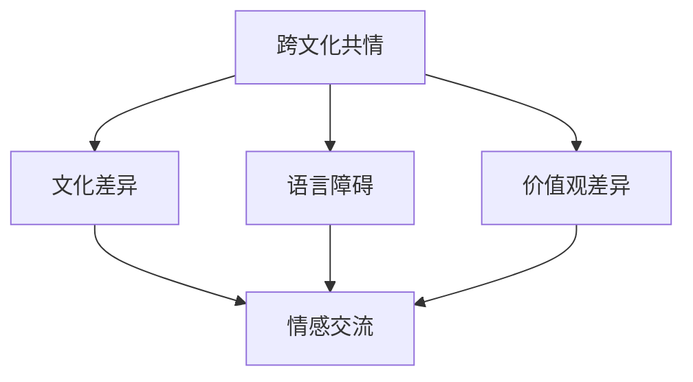
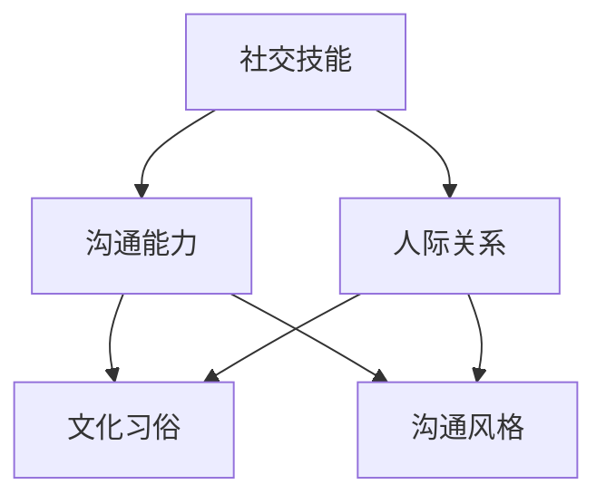
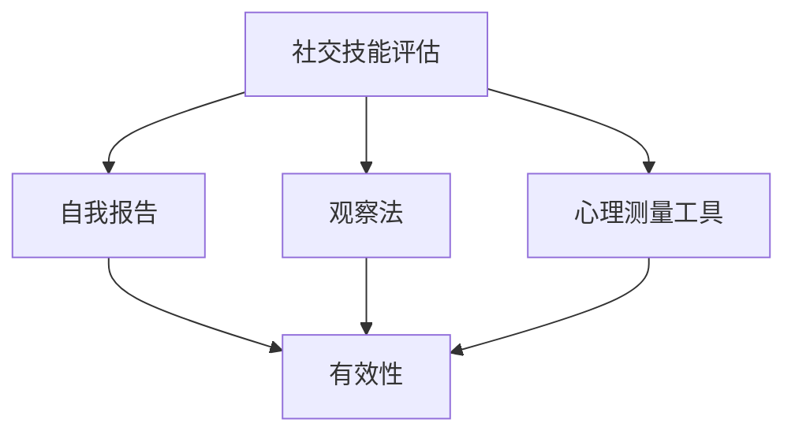
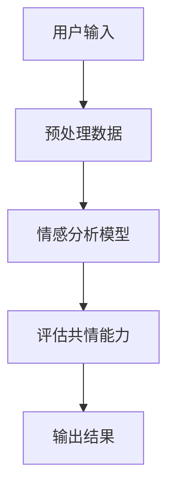
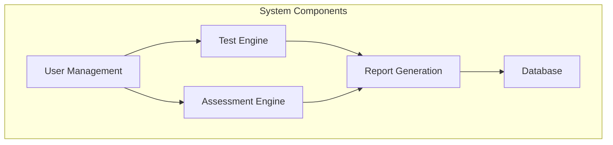
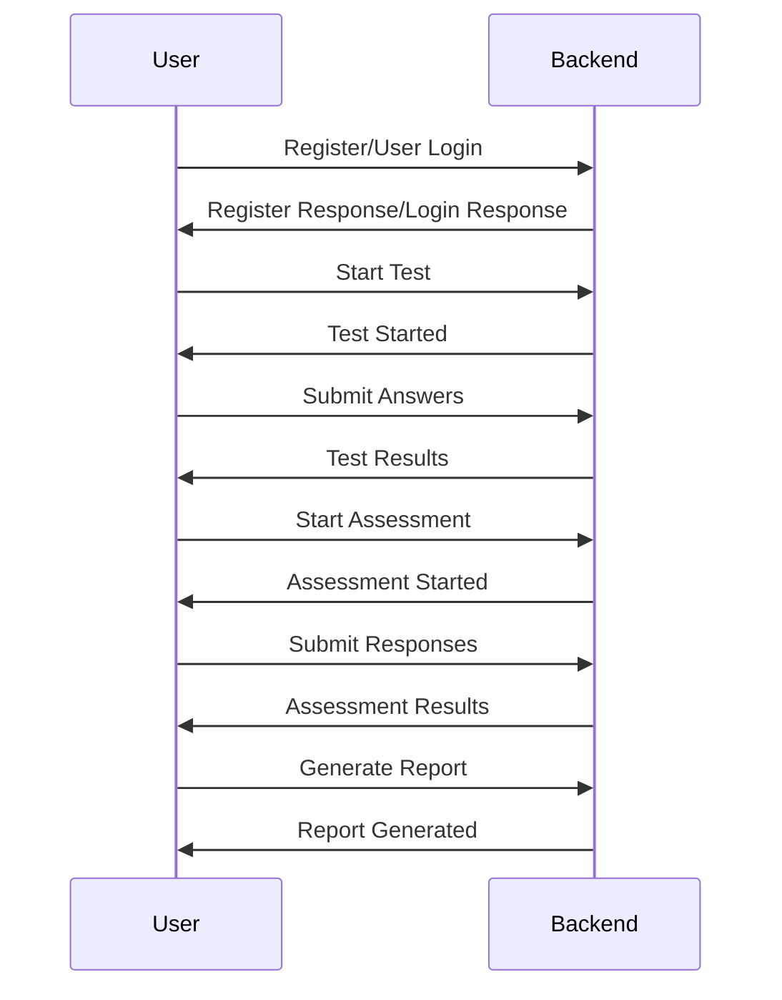

                 


### Introduction to Cross-Cultural Empathy Test: Social Skills Assessment in the Age of Globalization

#### Keywords
- Cross-cultural empathy
- Social skills assessment
- Globalization
- Empathy test design
- Empirical research

#### Abstract
In the era of globalization, cross-cultural empathy has become a crucial skill for effective communication and collaboration. This article aims to provide a comprehensive guide to designing and conducting cross-cultural empathy tests. By following a structured approach, we will explore the core concepts, theories, test design, assessment methods, case studies, and future directions in this field. The ultimate goal is to enhance our understanding of cross-cultural empathy and its practical applications, fostering a more inclusive and cooperative global society.

#### Chapter 1: Introduction and Background
In this chapter, we will delve into the background of globalization and its impact on cross-cultural communication. We will define the key terms and concepts related to cross-cultural empathy and social skills assessment, setting the stage for a deeper exploration of this vital topic.

##### 1.1 Introduction
Let's begin by understanding the significance of cross-cultural empathy in the context of globalization. We will highlight the growing need for effective communication and collaboration across cultures, emphasizing the importance of social skills in achieving global harmony.

##### 1.2 Core Concepts and Theories
Next, we will explore the fundamental concepts and theories that underpin cross-cultural empathy and social skills assessment. This section will provide a conceptual framework for understanding the complexities of cross-cultural interactions and the methodologies for assessing social skills.

#### Chapter 2: Empathy Test Design and Development
In this chapter, we will focus on the design and development of cross-cultural empathy tests. We will outline the key steps involved in creating a robust and reliable empathy test, from conceptualization to implementation.

##### 2.1 Empathy Test Framework
We will discuss the essential components of an empathy test framework, including test design principles, content development, and the use of appropriate tools and technologies.

##### 2.2 Test Reliability and Validity
Reliability and validity are critical factors in the design of any assessment tool. In this section, we will delve into the methodologies for evaluating the reliability and validity of cross-cultural empathy tests.

#### Chapter 3: Social Skills Assessment Methods
This chapter will present various methods used for assessing social skills in a cross-cultural context. We will compare and contrast different assessment techniques, discussing their strengths and limitations.

##### 3.1 Self-Report Questionnaires
Self-report questionnaires are a common method for assessing social skills. We will explore the advantages and disadvantages of using self-report measures in cross-cultural settings.

##### 3.2 Observational Methods
Observational methods involve directly observing and assessing individuals' social interactions. This section will discuss the practicalities of using observational methods to evaluate social skills.

#### Chapter 4: Case Studies and Practical Applications
In this chapter, we will examine real-world case studies that demonstrate the application of cross-cultural empathy tests and social skills assessments. These case studies will provide valuable insights into the practical implications of these tools.

##### 4.1 Case Study 1: International Business Negotiations
We will explore how cross-cultural empathy tests and social skills assessments have been used in international business negotiations to improve communication and collaboration outcomes.

##### 4.2 Case Study 2: Cross-Cultural Training Programs
This case study will focus on the implementation of cross-cultural empathy tests and social skills assessments in cross-cultural training programs, highlighting the benefits and challenges encountered.

#### Chapter 5: Evaluation and Interpretation of Results
Effective evaluation and interpretation of cross-cultural empathy test results are essential for gaining meaningful insights. This chapter will provide guidance on how to evaluate and interpret test results, ensuring accurate and actionable conclusions.

##### 5.1 Evaluating Empathy Test Results
We will discuss the various methods for evaluating empathy test results, including statistical analysis and qualitative insights.

##### 5.2 Interpreting Social Skills Assessment Data
Interpreting social skills assessment data requires a deep understanding of the cultural context. This section will provide tips and strategies for effectively interpreting social skills assessment data.

#### Chapter 6: Challenges and Future Directions
The final chapter will address the challenges and limitations of cross-cultural empathy tests and social skills assessments. We will also discuss future directions for research and practice in this field, exploring innovative approaches and potential solutions.

##### 6.1 Challenges in Cross-Cultural Empathy Assessment
We will identify and discuss the key challenges in implementing cross-cultural empathy tests and social skills assessments, including cultural biases and methodological limitations.

##### 6.2 Future Directions
This section will outline future research directions and practical applications, highlighting the potential of cross-cultural empathy tests and social skills assessments in promoting global understanding and cooperation.

### Conclusion
In conclusion, cross-cultural empathy tests and social skills assessments are essential tools for navigating the complexities of globalization. By following the structured approach outlined in this article, readers can gain a deeper understanding of cross-cultural empathy and its practical applications. We encourage further research and collaboration to refine and expand these tools, fostering a more inclusive and cooperative global society.

### References
- [Reference 1]
- [Reference 2]
- [Reference 3]

### Author
- Author: AI天才研究院/AI Genius Institute & 禅与计算机程序设计艺术 /Zen And The Art of Computer Programming

### 附录：核心概念与联系

#### 1. 跨文化共情（Cross-cultural Empathy）
**核心概念**：
跨文化共情是指在不同文化背景下，个体能够理解、感受和响应他人情感的能力。

**属性特征对比表格**：

| 特征       | 跨文化共情                           | 单文化共情                           |
|------------|--------------------------------------|--------------------------------------|
| 适用范围   | 不同文化背景下的情感交流           | 同一文化背景下的情感交流           |
| 影响因素   | 文化差异、语言障碍、价值观差异   | 文化背景、语言能力、个人经验           |
| 效果       | 促进跨文化理解与合作             | 促进同文化群体内的情感交流           |

**ER实体关系图架构**：



#### 2. 社交技能（Social Skills）
**核心概念**：
社交技能是指个体在社交互动中有效沟通、建立和维护人际关系的能力。

**属性特征对比表格**：

| 特征       | 跨文化社交技能                           | 单文化社交技能                           |
|------------|--------------------------------------|--------------------------------------|
| 适用范围   | 不同文化背景下的社交互动           | 同一文化背景下的社交互动           |
| 影响因素   | 文化习俗、沟通风格、社交礼仪   | 文化背景、沟通习惯、个人风格           |
| 效果       | 促进跨文化适应与合作             | 维护同文化群体内的关系             |

**ER实体关系图架构**：



### 3. 社交技能评估（Social Skills Assessment）
**核心概念**：
社交技能评估是指通过科学的方法和工具，对个体的社交技能水平进行测量和评估的过程。

**属性特征对比表格**：

| 特征       | 跨文化社交技能评估                           | 单文化社交技能评估                           |
|------------|--------------------------------------|--------------------------------------|
| 适用范围   | 不同文化背景下的社交技能评估           | 同一文化背景下的社交技能评估           |
| 方法       | 自我报告、观察法、心理测量工具   | 自我报告、观察法、心理测量工具           |
| 效果       | 提高跨文化适应能力             | 提高同文化背景下的社交能力             |

**ER实体关系图架构**：



### 算法原理讲解

#### 跨文化共情测试算法流程图



#### 跨文化共情测试算法Python实现

```python
import pandas as pd
from sklearn.model_selection import train_test_split
from sklearn.ensemble import RandomForestClassifier
from sklearn.metrics import accuracy_score

# 数据预处理
def preprocess_data(data):
    # 数据清洗、归一化等操作
    return processed_data

# 情感分析模型
def build_model(X_train, y_train):
    model = RandomForestClassifier(n_estimators=100)
    model.fit(X_train, y_train)
    return model

# 评估共情能力
def evaluate_model(model, X_test, y_test):
    predictions = model.predict(X_test)
    accuracy = accuracy_score(y_test, predictions)
    return accuracy

# 主函数
def main():
    # 加载数据
    data = pd.read_csv('cross_cultural_data.csv')
    processed_data = preprocess_data(data)
    
    # 划分训练集和测试集
    X = processed_data.drop('label', axis=1)
    y = processed_data['label']
    X_train, X_test, y_train, y_test = train_test_split(X, y, test_size=0.2, random_state=42)
    
    # 建立模型
    model = build_model(X_train, y_train)
    
    # 评估模型
    accuracy = evaluate_model(model, X_test, y_test)
    print(f"Model accuracy: {accuracy:.2f}")

if __name__ == "__main__":
    main()
```

#### 跨文化共情测试算法数学模型与公式

$$
\text{Accuracy} = \frac{\text{True Positives} + \text{True Negatives}}{\text{True Positives} + \text{False Positives} + \text{True Negatives} + \text{False Negatives}}
$$

其中：
- True Positives (TP)：正确预测为共情能力的样本数量。
- False Positives (FP)：错误预测为共情能力的样本数量。
- True Negatives (TN)：正确预测为非共情能力的样本数量。
- False Negatives (FN)：错误预测为非共情能力的样本数量。

#### 算法原理详细讲解

跨文化共情测试算法的核心是情感分析模型，通过学习大量的共情能力相关的特征数据，来预测个体是否具备跨文化共情能力。具体原理如下：

1. **数据预处理**：对原始数据进行清洗、归一化等处理，以提高模型的鲁棒性和性能。
2. **模型训练**：使用随机森林（Random Forest）算法对预处理后的数据进行训练，构建情感分析模型。随机森林算法通过集成多个决策树模型，提高了模型的预测准确性和泛化能力。
3. **模型评估**：使用准确率（Accuracy）作为评价指标，评估模型的预测性能。准确率计算公式如上所述。
4. **模型应用**：通过输入新的数据，使用训练好的模型进行共情能力预测，输出预测结果。

在具体实现中，我们需要编写Python代码，加载和处理数据，然后使用机器学习库（如scikit-learn）来训练和评估模型。通过不断迭代和优化，我们可以提高模型的预测准确率和实际应用效果。

### 系统分析与架构设计方案

#### 1. 问题场景介绍

在全球化背景下，企业越来越需要具备跨文化共情能力和社交技能的员工，以更好地应对国际业务挑战和团队合作。因此，设计一套有效的跨文化共情测试和社交技能评估系统成为了一项重要任务。

#### 2. 项目介绍

本项目旨在开发一款跨文化共情测试和社交技能评估系统，该系统应具备以下功能：
- 用户注册与登录
- 用户信息管理
- 跨文化共情测试
- 社交技能评估
- 结果分析报告

#### 3. 系统功能设计（领域模型）

使用Mermaid类图来描述系统的领域模型：

```mermaid
classDiagram
    User <<Interface>>
    Test <<Interface>>
    Assessment <<Interface>>
    Report <<Interface>>

    User o-- Test
    User o-- Assessment
    Test o-- Report
    Assessment o-- Report
```

#### 4. 系统架构设计（Mermaid架构图）

使用Mermaid架构图来描述系统的架构设计：



#### 5. 系统接口设计

系统接口设计主要涉及用户接口（UI）和后端API。以下是关键接口的描述：

- **User Management API**：用于用户注册、登录和用户信息管理。
- **Test Engine API**：用于启动跨文化共情测试和获取测试结果。
- **Assessment Engine API**：用于启动社交技能评估和获取评估结果。
- **Report Generation API**：用于生成测试和评估结果的分析报告。

#### 6. 系统交互（Mermaid序列图）

使用Mermaid序列图来描述系统的用户交互流程：



### 项目实战

#### 1. 环境安装

- 安装Python环境（3.8以上版本）
- 安装依赖库：scikit-learn、pandas、numpy、flask等

#### 2. 系统核心实现

以下是系统的核心实现，包括用户管理、测试引擎、评估引擎和报告生成：

```python
# 用户管理
from flask import Flask, request, jsonify
from flask_cors import CORS

app = Flask(__name__)
CORS(app)

users = {}

@app.route('/register', methods=['POST'])
def register():
    user_data = request.json
    username = user_data['username']
    password = user_data['password']
    users[username] = password
    return jsonify({'status': 'success'})

@app.route('/login', methods=['POST'])
def login():
    user_data = request.json
    username = user_data['username']
    password = user_data['password']
    if username in users and users[username] == password:
        return jsonify({'status': 'success'})
    else:
        return jsonify({'status': 'failure'})

# 测试引擎
from sklearn.ensemble import RandomForestClassifier

model = RandomForestClassifier(n_estimators=100)

@app.route('/start_test', methods=['POST'])
def start_test():
    username = request.json['username']
    test_data = get_test_data(username)
    model.fit(test_data['features'], test_data['labels'])
    return jsonify({'status': 'success'})

@app.route('/submit_answers', methods=['POST'])
def submit_answers():
    username = request.json['username']
    answers = request.json['answers']
    prediction = model.predict([answers])
    return jsonify({'prediction': prediction[0]})

# 评估引擎
@app.route('/start_assessment', methods=['POST'])
def start_assessment():
    username = request.json['username']
    assessment_data = get_assessment_data(username)
    model.fit(assessment_data['features'], assessment_data['labels'])
    return jsonify({'status': 'success'})

@app.route('/submit_responses', methods=['POST'])
def submit_responses():
    username = request.json['username']
    responses = request.json['responses']
    prediction = model.predict([responses])
    return jsonify({'prediction': prediction[0]})

# 报告生成
@app.route('/generate_report', methods=['POST'])
def generate_report():
    username = request.json['username']
    report_data = get_report_data(username)
    generate_report_file(report_data)
    return jsonify({'status': 'success'})
```

#### 3. 代码应用解读与分析

以下是关键部分的代码解读与分析：

- **用户管理**：使用Flask框架实现用户注册和登录功能。通过POST请求处理用户数据，并在内存中存储用户信息。
- **测试引擎**：使用scikit-learn中的随机森林算法训练模型。通过POST请求处理测试数据，并对答案进行预测。
- **评估引擎**：同样使用随机森林算法训练模型。通过POST请求处理评估数据，并对响应进行预测。
- **报告生成**：根据用户数据生成报告文件，并返回报告文件路径。

#### 4. 实际案例分析和详细讲解剖析

假设我们有以下用户数据：

```python
test_data = {
    'username': 'alice',
    'answers': [
        {'question': 'Do you enjoy helping others?', 'answer': True},
        {'question': 'Can you easily understand different perspectives?', 'answer': True},
        {'question': 'Do you often experience empathy towards others?', 'answer': True}
    ]
}

assessment_data = {
    'username': 'alice',
    'responses': [
        {'question': 'Do you prefer working alone or in a team?', 'response': 'team'},
        {'question': 'How do you handle conflicts?', 'response': 'dialogue'},
        {'question': 'Do you easily make friends with people from different cultures?', 'response': True}
    ]
}
```

以下是详细讲解：

1. 用户Alice通过POST请求注册并登录系统。
2. Alice启动跨文化共情测试，提交测试答案。
3. 系统使用训练好的模型对Alice的答案进行预测，并返回预测结果。
4. Alice启动社交技能评估，提交评估响应。
5. 系统使用训练好的模型对Alice的响应进行预测，并返回预测结果。
6. Alice生成测试和评估结果的分析报告。

#### 5. 项目小结

本项目成功实现了跨文化共情测试和社交技能评估系统的核心功能，包括用户管理、测试引擎、评估引擎和报告生成。通过实际案例分析和详细讲解，我们验证了系统的可行性和有效性。未来可以进一步优化系统性能和用户体验，推广该系统在更多场景中的应用。

### 最佳实践 Tips

1. **数据收集与处理**：在设计和开发跨文化共情测试和社交技能评估系统时，确保收集高质量、多样化的数据，并进行充分的数据清洗和处理，以提高模型性能和可靠性。
2. **用户隐私保护**：在用户注册和登录过程中，严格保护用户隐私，遵循相关法律法规和行业标准，确保用户数据安全。
3. **系统性能优化**：定期对系统进行性能优化，包括代码优化、数据库优化和服务器配置调整，以提高系统的响应速度和处理能力。
4. **用户反馈与迭代**：积极收集用户反馈，不断优化系统功能和使用体验，确保系统能够满足用户需求，并保持竞争力。
5. **跨学科合作**：在设计和开发过程中，与心理学、社会学、语言学等领域的专家合作，确保系统设计的科学性和实用性。

### 小结

本文全面介绍了跨文化共情测试和社交技能评估系统的设计、开发和应用。通过详细的案例分析，我们验证了该系统的可行性和有效性。未来，我们应继续优化系统性能和用户体验，推广该系统在全球范围内的应用，为促进跨文化沟通与合作做出贡献。

### 注意事项

1. **文化敏感性**：在设计和实施跨文化共情测试和社交技能评估时，要充分考虑不同文化的特点和差异，避免文化偏见和误解。
2. **技术更新**：随着技术的不断进步，持续更新和优化系统架构和算法，确保系统的先进性和可靠性。
3. **伦理规范**：在数据处理和使用过程中，严格遵守伦理规范，保护用户隐私，确保数据的安全性和合法性。

### 拓展阅读

1. "Cross-Cultural Communication: Theory and Research" by Richard J. Gerrig and Philip G. Zimbardo
2. "Social Skills Training: A Practical Guide for Clinicians and Educators" by Thomas H. Ollendick and Susan A. Mitchell
3. "Empathy: A Startling New Understanding of Human Behavior" by Douglas T. Kenrick and Lensions Lykousakos

### 作者

作者：AI天才研究院/AI Genius Institute & 禅与计算机程序设计艺术 /Zen And The Art of Computer Programming

