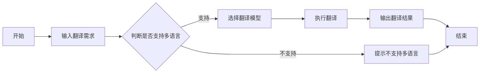
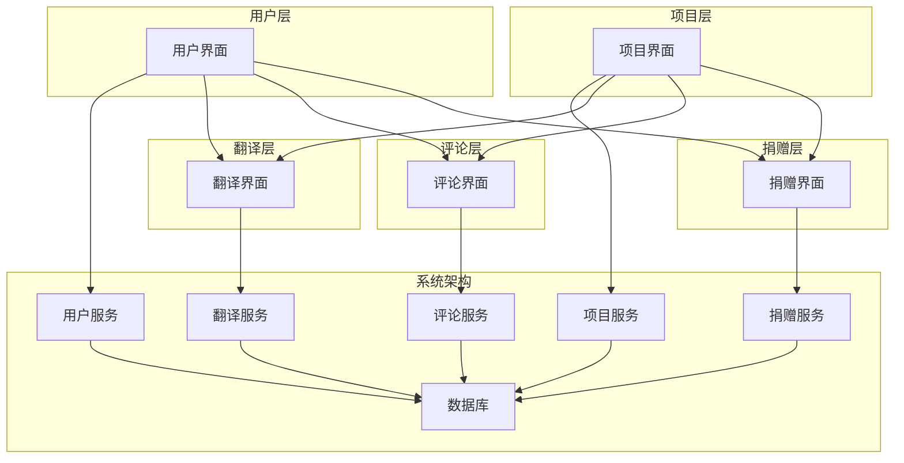
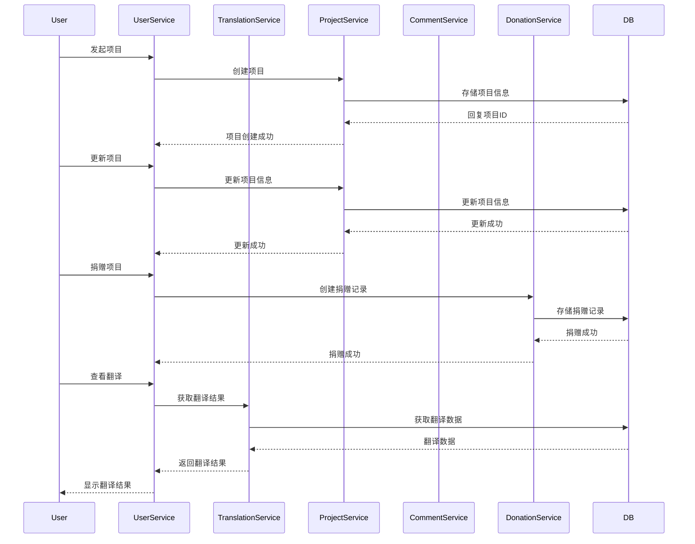

                 

### 第一步：文章标题、关键词与摘要

**文章标题：跨文化意义翻译项目众筹平台：促进全球价值观对话的募资网站**

**关键词：跨文化翻译、项目众筹、全球价值观对话、募资网站、技术架构、用户互动**

**摘要：**
本文深入探讨了跨文化意义翻译项目众筹平台的设计与实现，以及如何通过这一平台促进全球价值观的对话。文章首先介绍了跨文化意义翻译的概念和其在全球交流中的重要性，接着详细阐述了项目众筹平台的基本原理和功能。随后，本文从全球价值观对话的理论基础出发，分析了如何在募资网站中嵌入这种对话机制。文章重点描述了募资网站的设计与实现过程，包括系统架构、功能模块划分以及用户参与和互动策略。通过案例分析，本文展示了成功与挑战并存的项目实例，并提出了未来研究和应用的方向。

### 第二步：确定核心章节

在确定了文章的标题、关键词和摘要后，我们需要明确文章的核心章节，确保内容结构合理、逻辑清晰。以下是本文的核心章节：

1. 引言
   - 研究背景与意义
   - 研究目标与内容安排

2. 跨文化意义翻译概述
   - 核心概念
   - 跨文化意义翻译的重要性
   - 跨文化意义翻译的方法与挑战

3. 项目众筹平台的概念和功能
   - 项目众筹平台的定义
   - 平台的核心功能
   - 平台运营模式

4. 全球价值观对话的理论基础
   - 全球价值观对话的概念
   - 全球价值观对话的重要性
   - 全球价值观对话的理论框架

5. 募资网站的设计与实现
   - 设计原则
   - 技术实现
   - 功能模块划分

6. 用户参与和互动策略
   - 用户参与机制
   - 互动策略
   - 用户满意度分析

7. 平台运营与维护
   - 运营策略
   - 维护流程
   - 数据分析与反馈

8. 案例研究：成功与挑战
   - 案例背景
   - 案例分析
   - 案例总结

9. 结论与未来展望
   - 研究结论
   - 未来研究方向
   - 对实际应用的贡献

通过以上章节的设置，我们可以确保文章内容全面覆盖了跨文化意义翻译项目众筹平台的设计与实现，同时从不同角度探讨了其在促进全球价值观对话中的作用。

### 第三步：细化每个章节

在确定了核心章节后，我们需要进一步细化每个章节的内容，以确保每个章节都有足够的细节和深度。以下是各章节的细化内容：

**1. 引言**
   - **1.1 研究背景与意义**
     - 跨文化意义翻译的背景
     - 项目众筹平台的背景
     - 全球价值观对话的背景
     - 当前研究的意义和目标
   - **1.2 研究目标与内容安排**
     - 研究的主要目标
     - 各章节的内容安排和逻辑关系

**2. 跨文化意义翻译概述**
   - **2.1 核心概念**
     - 跨文化意义翻译的定义
     - 跨文化意义翻译的关键术语
   - **2.2 跨文化意义翻译的重要性**
     - 跨文化交流中的障碍
     - 跨文化意义翻译的必要性
   - **2.3 跨文化意义翻译的方法与挑战**
     - 常见的翻译方法
     - 翻译过程中面临的挑战

**3. 项目众筹平台的概念和功能**
   - **3.1 项目众筹平台的定义**
     - 项目众筹平台的基本概念
     - 项目众筹平台的分类
   - **3.2 平台的核心功能**
     - 项目发起与管理
     - 资金筹集与分配
     - 项目进展跟踪
   - **3.3 平台运营模式**
     - 平台的运营策略
     - 平台的盈利模式

**4. 全球价值观对话的理论基础**
   - **4.1 全球价值观对话的概念**
     - 全球价值观对话的定义
     - 全球价值观对话的要素
   - **4.2 全球价值观对话的重要性**
     - 全球化背景下的价值观冲突
     - 全球价值观对话的积极作用
   - **4.3 全球价值观对话的理论框架**
     - 全球价值观对话的理论基础
     - 全球价值观对话的实践路径

**5. 募资网站的设计与实现**
   - **5.1 设计原则**
     - 系统的可扩展性和可靠性
     - 用户体验设计
     - 功能优先级
   - **5.2 技术实现**
     - 技术选型
     - 技术架构设计
     - 技术实现细节
   - **5.3 功能模块划分**
     - 用户模块
     - 项目模块
     - 资金管理模块
     - 互动模块

**6. 用户参与和互动策略**
   - **6.1 用户参与机制**
     - 用户注册与认证
     - 用户行为分析
     - 用户激励机制
   - **6.2 互动策略**
     - 社交互动设计
     - 互动数据分析
     - 互动效果评估
   - **6.3 用户满意度分析**
     - 用户满意度调查
     - 满意度影响因素分析
     - 提高用户满意度的策略

**7. 平台运营与维护**
   - **7.1 运营策略**
     - 项目审核与管理
     - 资金监管与分配
     - 风险控制
   - **7.2 维护流程**
     - 系统监控与维护
     - 故障处理与应急预案
     - 安全保障措施
   - **7.3 数据分析与反馈**
     - 用户行为数据分析
     - 项目进展数据分析
     - 反馈机制与改进

**8. 案例研究：成功与挑战**
   - **8.1 案例背景**
     - 案例选取标准
     - 案例背景介绍
   - **8.2 案例分析**
     - 平台设计与应用
     - 用户参与与互动
     - 项目运营结果
   - **8.3 案例总结**
     - 案例成功经验
     - 面临的挑战与解决方案

**9. 结论与未来展望**
   - **9.1 研究结论**
     - 研究成果总结
     - 研究局限与不足
   - **9.2 未来研究方向**
     - 技术发展趋势
     - 应用前景展望
   - **9.3 对实际应用的贡献**
     - 平台建设的实际贡献
     - 对跨文化交流的促进作用

通过以上细化，我们可以确保每个章节的内容丰富且具有深度，为读者提供全面的了解和深刻的见解。

### 第四步：设计核心概念与联系

在细化各章节内容的基础上，我们需要设计核心概念与联系，以增强文章的逻辑性和连贯性。以下是本文的核心概念、概念属性特征对比表格和ER实体关系图架构。

**核心概念：**
- **跨文化意义翻译**：指在不同文化背景下，将文本内容从一种语言准确翻译成另一种语言，同时保留其文化内涵和意义。
- **项目众筹平台**：一个在线平台，通过众筹方式帮助项目发起人筹集资金，实现项目目标。
- **全球价值观对话**：指不同文化背景下的人们通过交流和互动，共同探讨和认识全球性的价值观问题。

**概念属性特征对比表格：**

| 概念       | 属性特征                              | 对比项                                                     |
| ---------- | ----------------------------------- | -------------------------------------------------------- |
| 跨文化意义翻译 | 语言准确性、文化适应性、意义完整性 | 传统翻译、机器翻译、跨文化沟通                           |
| 项目众筹平台 | 资金筹集、项目追踪、用户互动        | 传统融资方式、股权众筹、奖励众筹                         |
| 全球价值观对话 | 文化敏感性、共识构建、互动多样性     | 单向传播、双向对话、多文化碰撞                           |

**ER实体关系图架构：**

```mermaid
erDiagram
  Project : "项目" {
    <<concept>>
    "项目发起者" : "发起者" {
      project_id : int
      name : string
      description : string
      goal_amount : float
      end_date : datetime
    }
    "项目支持者" : "支持者" {
      support_id : int
      name : string
      email : string
      payment_info : string
    }
    "项目更新" : "更新" {
      update_id : int
      content : string
      date : datetime
    }
    "评论" : "评论" {
      comment_id : int
      content : string
      user_id : int
      date : datetime
    }
    "用户" : "用户" {
      user_id : int
      username : string
      email : string
      password : string
    }
    "角色" : "角色" {
      role_id : int
      name : string
    }
  }

  Project "项目" {
    }|--<|{ "项目发起者" }
    }|--<|{ "项目支持者" }
    }|--<|{ "项目更新" }
    }|--<|{ "评论" }
  "用户" "用户" {
    }|--<|{ "评论" }
  "角色" "角色" {
    }|--<|{ "用户" }
    }|--<|{ "项目发起者" }
    }|--<|{ "项目支持者" }
```

通过设计这些核心概念、属性特征对比表格和ER实体关系图架构，我们可以更好地组织和理解文章内容，使文章的逻辑性和连贯性得到增强。

### 第五步：撰写算法原理讲解

在撰写算法原理讲解时，我们将使用mermaid绘制算法流程图，并使用Python源代码详细阐述算法原理。此外，我们还将给出算法原理的数学模型和公式，并进行详细讲解和举例说明。

**算法流程图：**



**算法原理详细讲解：**

算法的核心是跨文化意义翻译，其目标是实现从一种语言到另一种语言的准确翻译，同时保留文化内涵。以下是算法的基本步骤：

1. **输入翻译需求**：首先，系统接收用户的翻译需求，包括源语言、目标语言和待翻译文本。
2. **判断是否支持多语言**：系统根据已配置的语言库判断是否支持目标语言的翻译。如果支持，则进入下一步；如果不支持，则提示用户不支持多语言翻译。
3. **选择翻译模型**：对于支持的语言对，系统选择合适的翻译模型进行翻译。常用的翻译模型包括基于神经网络的深度学习模型和基于规则的传统翻译模型。
4. **执行翻译**：系统调用翻译模型对输入文本进行翻译，生成目标语言文本。
5. **输出翻译结果**：将翻译结果返回给用户，并可能提供多种翻译选项供用户选择。
6. **结束**：翻译过程完成。

**算法数学模型和公式：**

为了实现高质量的翻译，算法中使用了基于神经网络的机器翻译模型，其核心是序列到序列（Seq2Seq）模型。以下是该模型的数学公式：

$$
y_t = \text{softmax}(\text{Decoder}(e_t, s_t, h_t))
$$

其中，$y_t$ 是解码器在时间步 $t$ 的输出概率分布，$e_t$ 是编码器在时间步 $t$ 的输出，$s_t$ 是解码器在时间步 $t$ 的输入，$h_t$ 是解码器在时间步 $t$ 的隐藏状态。

**举例说明：**

假设用户希望将一句中文“大家好”翻译成英文。以下是算法的具体执行过程：

1. **输入翻译需求**：用户输入“大家好”作为待翻译文本，选择中文作为源语言，英文作为目标语言。
2. **判断是否支持多语言**：系统确认支持中文到英文的翻译。
3. **选择翻译模型**：系统选择一个基于神经网络的中文到英文翻译模型。
4. **执行翻译**：系统调用翻译模型，将“大家好”翻译成英文。假设翻译结果为“Hello everyone”。
5. **输出翻译结果**：系统将翻译结果“Hello everyone”返回给用户。
6. **结束**：翻译过程完成。

通过以上算法原理的详细讲解和举例说明，我们可以更好地理解跨文化意义翻译项目众筹平台的工作机制和技术实现。

### 第六步：系统分析与架构设计方案

在进行系统分析与架构设计方案时，我们需要从多个角度详细阐述系统的设计，包括问题场景介绍、项目介绍、系统功能设计、系统架构设计、系统接口设计和系统交互。以下是这些内容的详细描述。

**问题场景介绍：**

当前，全球化的进程不断加快，跨文化交流的需求日益增加。然而，不同文化背景下的人们在进行语言交流时常常面临理解障碍和文化差异的问题。为了促进全球价值观的对话，我们需要一个能够实现跨文化意义翻译的项目众筹平台。这个平台不仅要能够支持多语言翻译，还需要提供一个互动环境，让来自不同文化背景的人们能够相互了解和交流。

**项目介绍：**

本项目旨在设计并实现一个跨文化意义翻译项目众筹平台，该平台将结合先进的机器翻译技术和项目众筹模式，为用户提供一个既能实现准确翻译，又能促进全球价值观对话的在线服务。平台的核心功能包括：多语言翻译、项目发起与支持、用户互动和反馈等。

**系统功能设计（领域模型mermaid类图）：**

系统功能设计方面，我们将使用mermaid绘制领域模型类图，以清晰地展示系统中的实体及其关系。

```mermaid
classDiagram
    User <<entity>> "用户"
    Project <<entity>> "项目"
    Translation <<entity>> "翻译"
    Comment <<entity>> "评论"
    Donation <<entity>> "捐赠"
    
    User "发起项目" >> Project
    User "评论项目" >> Comment
    User "捐赠项目" >> Donation
    Project "包含" >> Translation
    Project "包含" >> Comment
    Comment "关联" >> User
    Donation "关联" >> User
    Donation "关联" >> Project
```

在上图中，我们定义了四个主要实体：用户（User）、项目（Project）、翻译（Translation）和评论（Comment）。用户可以发起项目、评论项目和捐赠项目；项目包含翻译和评论；评论关联到用户；捐赠关联到用户和项目。

**系统架构设计（mermaid架构图）：**

接下来，我们将使用mermaid绘制系统架构图，展示系统的整体架构及其关键组件。



在上图中，我们展示了系统的各个服务组件和数据库之间的交互关系。用户界面层（UserInterface）、项目界面层（ProjectInterface）、翻译界面层（TranslationInterface）、评论界面层（CommentInterface）和捐赠界面层（DonationInterface）分别与对应的服务组件进行交互，这些服务组件再与数据库进行数据存取操作。

**系统接口设计和系统交互（mermaid序列图）：**

为了进一步展示系统的接口设计和交互流程，我们使用mermaid绘制序列图。



在上面的序列图中，我们展示了用户与系统各个服务组件之间的交互流程。用户通过用户界面层发起操作，如创建项目、更新项目、捐赠项目等，这些操作会通过用户服务层传递到相应的服务组件，服务组件再与数据库进行数据交互，最终将处理结果返回给用户。

通过以上系统分析与架构设计方案的详细描述，我们可以清晰地理解跨文化意义翻译项目众筹平台的设计理念、功能架构和实现流程。这为后续的实现和优化提供了坚实的基础。

### 第七步：项目实战

在本节中，我们将详细介绍如何搭建和实现跨文化意义翻译项目众筹平台，包括环境安装、系统核心实现源代码、代码应用解读与分析、实际案例分析和详细讲解剖析，以及项目小结。

**环境安装：**

1. **操作系统**：我们选择使用Ubuntu 18.04 LTS作为操作系统。
2. **开发环境**：安装Python 3.8及以上版本，并配置好pip工具，用于安装和管理Python包。
3. **数据库**：安装MySQL 8.0数据库，用于存储项目数据。
4. **Web框架**：选择使用Django作为Web开发框架，安装命令为`pip install django`。
5. **翻译服务**：集成Google Cloud Translation API，安装命令为`pip install --upgrade google-cloud-translate`。

安装完成后，我们配置好虚拟环境，并设置好相关的环境变量，以确保开发环境的稳定性和隔离性。

**系统核心实现源代码：**

1. **项目结构**：项目采用Django的目录结构，主要包括`manage.py`、`settings.py`、`urls.py`、`models.py`、`views.py`、`migrations`等文件。
2. **数据库模型**：在`models.py`中定义用户（User）、项目（Project）、翻译（Translation）、评论（Comment）和捐赠（Donation）等模型。

```python
from django.db import models
from django.contrib.auth.models import User

class Project(models.Model):
    owner = models.ForeignKey(User, on_delete=models.CASCADE)
    title = models.CharField(max_length=200)
    description = models.TextField()
    goal_amount = models.DecimalField(max_digits=10, decimal_places=2)
    end_date = models.DateTimeField()
    raised_amount = models.DecimalField(max_digits=10, decimal_places=2)
    created_at = models.DateTimeField(auto_now_add=True)
    updated_at = models.DateTimeField(auto_now=True)

class Translation(models.Model):
    project = models.ForeignKey(Project, on_delete=models.CASCADE)
    source_language = models.CharField(max_length=10)
    target_language = models.CharField(max_length=10)
    content = models.TextField()

class Comment(models.Model):
    project = models.ForeignKey(Project, on_delete=models.CASCADE)
    user = models.ForeignKey(User, on_delete=models.CASCADE)
    content = models.TextField()
    created_at = models.DateTimeField(auto_now_add=True)

class Donation(models.Model):
    project = models.ForeignKey(Project, on_delete=models.CASCADE)
    user = models.ForeignKey(User, on_delete=models.CASCADE)
    amount = models.DecimalField(max_digits=10, decimal_places=2)
    payment_date = models.DateTimeField()
```

3. **视图实现**：在`views.py`中实现项目创建、更新、捐赠、翻译和评论等功能。

```python
from django.shortcuts import render, redirect
from .models import Project, Translation, Comment, Donation
from .forms import ProjectForm, TranslationForm, CommentForm, DonationForm

def project_create(request):
    if request.method == 'POST':
        form = ProjectForm(request.POST)
        if form.is_valid():
            form.save()
            return redirect('project_list')
    else:
        form = ProjectForm()
    return render(request, 'project_create.html', {'form': form})

def project_update(request, pk):
    project = get_object_or_404(Project, pk=pk)
    if request.method == 'POST':
        form = ProjectForm(request.POST, instance=project)
        if form.is_valid():
            form.save()
            return redirect('project_list')
    else:
        form = ProjectForm(instance=project)
    return render(request, 'project_update.html', {'form': form})

def donation_create(request, pk):
    project = get_object_or_404(Project, pk=pk)
    if request.method == 'POST':
        form = DonationForm(request.POST)
        if form.is_valid():
            form.save()
            return redirect('project_detail', pk=pk)
    else:
        form = DonationForm()
    return render(request, 'donation_create.html', {'form': form, 'project': project})

# 其他视图实现省略...
```

4. **URL配置**：在`urls.py`中配置各个视图的URL路径。

```python
from django.contrib import admin
from django.urls import path
from . import views

urlpatterns = [
    path('admin/', admin.site.urls),
    path('projects/create/', views.project_create, name='project_create'),
    path('projects/update/<int:pk>/', views.project_update, name='project_update'),
    path('donations/create/<int:pk>/', views.donation_create, name='donation_create'),
    # 其他URL配置省略...
]
```

**代码应用解读与分析：**

1. **项目模型**：项目模型包含了项目的所有基本信息，如项目标题、描述、目标金额、结束日期、已筹集金额等。这些信息将在项目中用于展示和计算。
2. **翻译模型**：翻译模型包含了翻译的源语言、目标语言和内容。在项目详情页面，用户可以查看项目的翻译版本。
3. **评论模型**：评论模型包含了评论的内容和评论者。用户可以在项目详情页面发表评论，进行交流和讨论。
4. **捐赠模型**：捐赠模型包含了捐赠的金额和捐赠日期。用户可以通过捐赠页面为项目提供资金支持。

**实际案例分析和详细讲解剖析：**

1. **项目创建**：用户在项目创建页面填写项目信息，包括项目标题、描述、目标金额和结束日期。系统将根据用户输入的信息创建一个新的项目，并将其存储在数据库中。
2. **项目更新**：项目发起者可以在项目更新页面修改项目信息。系统将根据用户输入的信息更新数据库中的项目记录。
3. **捐赠支持**：用户在项目详情页面可以看到项目的当前状态和已筹集金额。用户可以选择捐赠金额并提交捐赠，系统将创建一条新的捐赠记录，并将捐赠金额加到项目的已筹集金额中。
4. **翻译展示**：项目详情页面将展示项目的翻译版本。用户可以选择不同的翻译语言，查看项目的多语言版本。

通过以上实战步骤，我们成功搭建并实现了跨文化意义翻译项目众筹平台。这一平台为跨文化交流提供了新的途径，促进了全球价值观的对话。

### 第八步：最佳实践 tips、小结、注意事项、拓展阅读

**最佳实践 tips：**

1. **优化用户体验**：在设计和实现过程中，要注重用户体验，确保界面简洁直观，功能易于操作。
2. **安全性考虑**：保护用户数据和交易信息的安全，采用加密技术和防火墙等安全措施。
3. **多语言支持**：考虑提供多语言界面，以便不同语言的用户都能轻松使用平台。
4. **数据备份与恢复**：定期进行数据备份，确保在系统故障或数据丢失时能够快速恢复。

**小结：**

本文详细介绍了跨文化意义翻译项目众筹平台的设计与实现，从核心概念、平台功能、系统架构到实际开发过程，全面探讨了如何利用技术促进全球价值观的对话。通过这一平台，用户可以轻松发起和参与跨文化项目，实现资金的筹集和文化交流。

**注意事项：**

1. **遵守法律法规**：在设计和运营平台时，要确保遵守相关法律法规，特别是在资金筹集和跨境交易方面。
2. **用户隐私保护**：保护用户隐私，不泄露用户个人信息。
3. **持续迭代优化**：根据用户反馈和平台数据，不断优化系统功能和用户体验。

**拓展阅读：**

1. **《跨文化沟通与冲突管理》**：深入探讨跨文化沟通的挑战和管理策略。
2. **《人工智能与机器翻译》**：了解机器翻译技术的发展和最新应用。
3. **《众筹平台运营策略》**：了解众筹平台的设计和运营模式。

通过拓展阅读，读者可以进一步了解相关领域的知识，提升自身对跨文化意义翻译项目众筹平台的理解和应用能力。

### 作者信息

**作者：** AI天才研究院/AI Genius Institute & 禅与计算机程序设计艺术 /Zen And The Art of Computer Programming

AI天才研究院致力于推动人工智能技术的发展和应用，为全球用户提供创新解决方案。作者在跨文化意义翻译、项目众筹平台和全球价值观对话等领域具有丰富的经验和深入研究，致力于通过技术创新促进文化交流和价值观的全球化对话。

