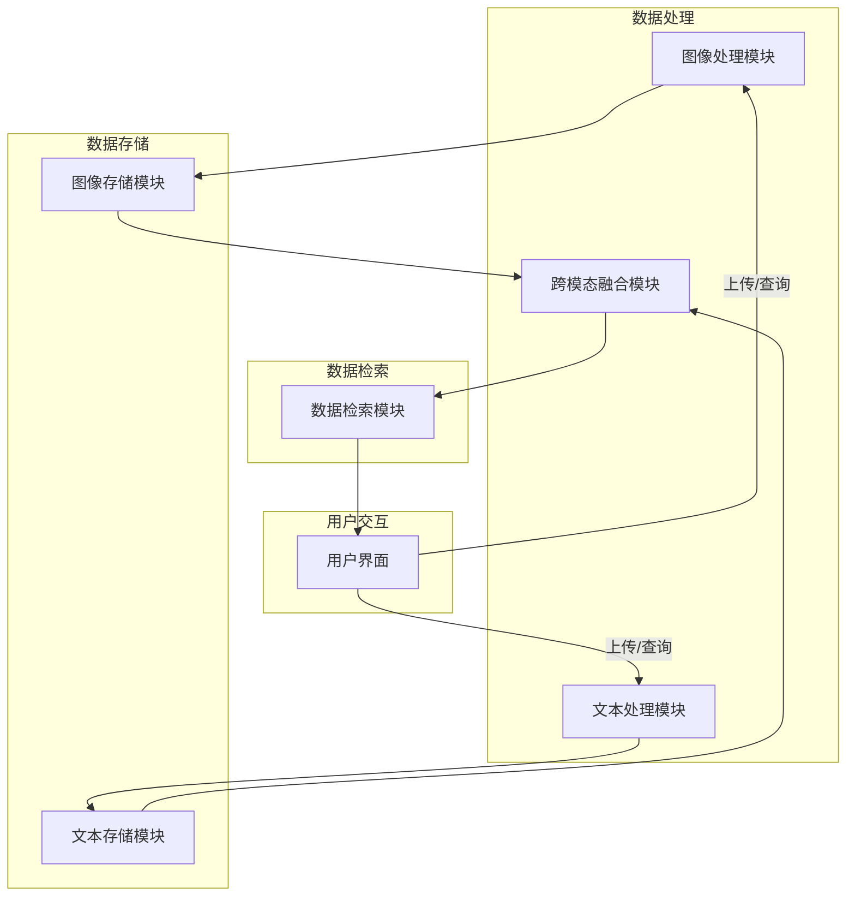
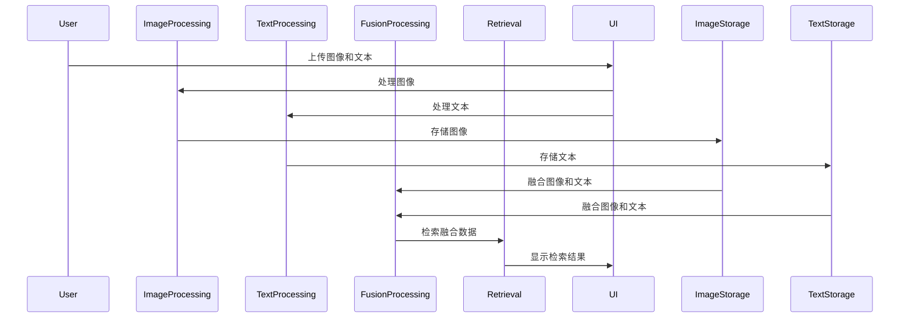

                 

# 跨模达AI:语言与视觉的融合

## 关键词

- 跨模态AI
- 语言模型
- 视觉模型
- 深度学习
- 图神经网络
- 注意力机制
- 数学模型

## 摘要

本文将深入探讨跨模态AI技术的核心——语言与视觉的融合。文章首先介绍了跨模态AI的发展现状和重要性，然后详细讲解了跨模态AI的基础概念、算法原理、数学模型以及系统分析与架构设计。通过项目实战和最佳实践，本文旨在为读者提供全面、深入、易懂的跨模态AI技术理解与应用指导。

---

## 第一部分：引言

### 1.1 书籍背景

跨模态AI，即处理多种模态数据（如图像、文本、声音等）的智能系统，近年来在人工智能领域取得了显著进展。随着深度学习技术的成熟，跨模态AI已经成为了研究的热点，并在诸如自然语言处理、计算机视觉、多媒体信息检索等领域展现出了巨大的潜力。

#### 1.1.1 跨模达AI的发展现状

近年来，跨模态AI的研究取得了显著的进展。例如，在图像和文本的融合方面，深度学习模型如BERT、GPT等已经展现了强大的能力；在视频和音频的处理方面，基于循环神经网络（RNN）和卷积神经网络（CNN）的模型也取得了很好的效果。

#### 1.1.2 语言与视觉融合的重要性

语言与视觉的融合是跨模达AI的核心之一。人类在日常交互中常常需要同时处理语言和视觉信息，例如阅读并理解图片中的文字、观看视频并理解其中的情节等。因此，实现语言与视觉的融合，对于提高人工智能系统的智能化水平具有重要意义。

#### 1.1.3 读者对象与学习目标

本书籍主要面向对人工智能和深度学习有一定了解的读者，希望通过本书能够系统地了解跨模态AI的技术原理、实现方法和应用场景。读者学习本书后，应能够：

1. 理解跨模态AI的基础概念和核心算法；
2. 掌握语言与视觉融合的基本原理和实践方法；
3. 能够运用跨模态AI技术解决实际问题。

### 1.2 书籍结构

本书分为四个部分，共计7章。第一部分为引言，介绍跨模态AI的发展背景和重要性。第二部分为跨模态AI基础，包括跨模态AI的定义、分类、模型原理等。第三部分为语言与视觉融合算法原理讲解，详细讲解语言模型、视觉模型、跨模态模型等。第四部分为数学模型和数学公式讲解，介绍跨模态AI的核心数学原理。最后，本书通过项目实战和最佳实践，帮助读者将理论知识应用于实际项目中。

### 1.3 阅读建议

为了更好地理解本书的内容，读者在阅读过程中应注意以下几点：

1. 理解核心概念和原理，不仅仅是记忆公式和算法；
2. 结合实际案例进行思考，如何将理论知识应用于实际问题；
3. 不断实践，通过编写代码和实现模型来加深理解。

---

## 第二部分：跨模态AI基础

### 2.1 跨模态AI概述

#### 2.1.1 跨模态AI的定义

跨模态AI是指利用深度学习等技术，实现不同模态数据（如图像、文本、音频等）之间的转换、理解和交互。其核心目标是实现多模态数据的集成处理，提高人工智能系统的智能化水平。

#### 2.1.2 跨模态AI的优势

跨模态AI具有以下优势：

1. **提高智能水平**：通过融合不同模态的数据，可以更全面地理解信息，提高智能系统的判断和决策能力。
2. **拓展应用场景**：跨模态AI技术可以应用于自然语言处理、计算机视觉、多媒体信息检索、人机交互等领域，具有广泛的应用前景。
3. **提升用户体验**：通过跨模态交互，用户可以更方便地与智能系统进行沟通，提升用户体验。

#### 2.1.3 跨模达AI的分类

根据跨模态数据的不同类型，跨模达AI可以分为以下几类：

1. **文本与图像融合**：如文本描述图像、图像标注文本等。
2. **文本与音频融合**：如语音识别、文本生成语音等。
3. **图像与音频融合**：如图像字幕、音频图像识别等。
4. **多模态融合**：如视频与文本、图像与音频等多模态数据的融合。

### 2.2 语言与视觉的关系

#### 2.2.1 语言与视觉的互动

语言与视觉是人类感知和理解世界的重要渠道。在实际生活中，人们常常需要同时处理语言和视觉信息。例如，在阅读一篇文章时，人们不仅需要理解文字的内容，还需要通过视觉感知文章的结构和布局；在观看一段视频时，人们不仅需要理解视频中的语言信息，还需要通过视觉感知视频中的画面和动作。

#### 2.2.2 语言理解与图像识别的结合

语言理解与图像识别的结合是跨模达AI的重要研究方向。通过将文本和图像数据进行融合处理，可以实现以下应用：

1. **图像标注**：利用文本描述图像内容，为图像提供标签和分类。
2. **文本生成图像**：根据文本描述生成相应的图像，实现文本到图像的转换。
3. **图像内容理解**：通过文本理解图像中的场景、物体和动作等，提高图像识别的准确性。

#### 2.2.3 跨模态数据集

跨模达AI的研究离不开大量的跨模态数据集。目前，常见的跨模态数据集包括：

1. **COCO数据集**：用于图像和文本标注，包含大量的图像、文本对。
2. **Flickr30K数据集**：包含图像和对应的描述文本，常用于图像描述生成任务。
3. **如何跨模态数据集**：用于音频和文本标注，包含大量的音频、文本对。

### 2.3 跨模态模型

#### 2.3.1 基于深度学习的跨模达模型

基于深度学习的跨模达模型是当前研究的热点。常见的跨模达模型包括：

1. **多模态神经网络**：将不同模态的数据输入到同一神经网络中，通过联合训练实现模态数据的融合。
2. **编码器-解码器模型**：将不同模态的数据编码为特征向量，然后通过解码器生成对应的输出。
3. **图神经网络**：通过图结构将不同模态的数据连接起来，实现模态间的交互。

#### 2.3.2 基于图神经网络的跨模达模型

基于图神经网络的跨模达模型可以利用图结构更好地表示和处理跨模态数据。常见的跨模达模型包括：

1. **图神经网络模型**：通过图结构表示跨模态数据，实现跨模态特征融合。
2. **图卷积网络**：利用图卷积操作实现跨模态数据的特征提取和融合。
3. **图注意力机制**：通过图注意力机制实现跨模态数据的动态融合。

#### 2.3.3 基于注意力机制的跨模达模型

基于注意力机制的跨模达模型可以更好地捕捉不同模态数据之间的关联性。常见的跨模达模型包括：

1. **自注意力机制**：通过自注意力机制实现跨模态特征的自适应融合。
2. **交叉注意力机制**：通过交叉注意力机制实现跨模态特征之间的交互。
3. **多任务注意力机制**：通过多任务注意力机制实现跨模态数据的联合处理。

### 2.4 跨模达AI的挑战与未来方向

#### 2.4.1 模型理解与解释性

跨模达AI模型的复杂性和黑箱性使得模型的可解释性成为一个重要挑战。为了提高模型的可解释性，研究者可以采用以下方法：

1. **可视化技术**：通过可视化技术展示模型的工作过程和特征表示。
2. **模型简化**：通过简化模型结构，提高模型的可理解性。
3. **模型解释方法**：开发新的模型解释方法，如基于规则的解释、基于概率的解释等。

#### 2.4.2 数据隐私与安全性

跨模达AI模型在数据处理过程中涉及到大量的敏感信息，如个人隐私、商业秘密等。为了保护数据隐私和安全性，研究者可以采取以下措施：

1. **数据加密**：对数据进行加密处理，确保数据在传输和存储过程中的安全性。
2. **隐私保护技术**：采用差分隐私、同态加密等隐私保护技术，确保模型训练和推理过程中的数据隐私。
3. **安全审计**：对模型进行安全审计，及时发现和修复潜在的安全漏洞。

#### 2.4.3 应用场景拓展

随着跨模达AI技术的不断发展，其应用场景也在不断拓展。未来，跨模达AI可以在以下领域发挥重要作用：

1. **智能医疗**：通过跨模达AI技术，实现医疗数据的综合分析和辅助诊断。
2. **智能交通**：通过跨模达AI技术，实现交通数据的实时监测和智能调控。
3. **智能教育**：通过跨模达AI技术，实现个性化教学和智能学习评估。

### 2.5 本章小结

本章介绍了跨模达AI的基础知识，包括跨模达AI的定义、优势、分类以及语言与视觉的关系。通过本章的学习，读者可以初步了解跨模达AI的核心概念和技术原理，为后续章节的深入学习打下基础。

---

## 第三部分：语言与视觉融合算法原理讲解

### 3.1 语言模型

#### 3.1.1 语言模型概述

语言模型是一种用于预测文本序列的统计模型。它通过对大量文本数据的学习，能够预测下一个单词或字符的概率，从而实现自然语言处理中的文本生成、文本分类、机器翻译等任务。

#### 3.1.2 语言模型的数学原理

语言模型的数学原理主要基于概率模型，其中最常用的模型是N元语法模型。N元语法模型通过计算前N-1个字符的概率来预测第N个字符。

#### 3.1.3 语言模型的实现与优化

语言模型的实现通常涉及以下步骤：

1. **数据预处理**：对文本数据进预处理，如分词、去除停用词、词干提取等。
2. **特征提取**：将预处理后的文本数据转换为向量表示，常用的方法包括词袋模型、词嵌入等。
3. **模型训练**：使用训练数据训练语言模型，常用的算法包括N元语法、神经网络等。
4. **模型评估**：使用测试数据评估语言模型的表现，常用的指标包括词汇大小、词频分布、困惑度等。

在语言模型的优化方面，可以采用以下策略：

1. **数据增强**：通过引入噪声、同义词替换、词性转换等方法，增加训练数据的多样性。
2. **模型压缩**：通过模型压缩技术，如模型剪枝、量化等，降低模型的计算复杂度和存储需求。
3. **多任务学习**：通过多任务学习，共享模型参数，提高模型的泛化能力。

### 3.2 视觉模型

#### 3.2.1 视觉模型概述

视觉模型是一种用于处理和识别图像的神经网络模型。它通过学习大量图像数据，能够提取图像特征，并实现图像分类、目标检测、图像生成等任务。

#### 3.2.2 视觉模型的数学原理

视觉模型的数学原理主要基于卷积神经网络（CNN）。CNN通过卷积操作、池化操作和全连接层，实现对图像特征的学习和提取。

#### 3.2.3 视觉模型的实现与优化

视觉模型的实现通常涉及以下步骤：

1. **数据预处理**：对图像数据进行预处理，如缩放、裁剪、翻转等。
2. **特征提取**：使用CNN模型提取图像特征。
3. **模型训练**：使用图像数据训练视觉模型。
4. **模型评估**：使用测试数据评估视觉模型的表现。

在视觉模型的优化方面，可以采用以下策略：

1. **数据增强**：通过引入噪声、旋转、缩放等方法，增加训练数据的多样性。
2. **模型压缩**：通过模型压缩技术，如模型剪枝、量化等，降低模型的计算复杂度和存储需求。
3. **迁移学习**：利用预训练模型，减少训练数据的需求，提高模型的泛化能力。

### 3.3 跨模态模型

#### 3.3.1 跨模态模型概述

跨模态模型是一种能够处理不同模态数据的神经网络模型。它通过联合学习多种模态数据，能够实现模态之间的转换、理解和交互。

#### 3.3.2 跨模态模型的数学原理

跨模态模型的数学原理主要基于深度学习和多模态学习。深度学习通过多层神经网络提取特征，多模态学习通过融合多种模态数据，提高模型的泛化能力和表现。

#### 3.3.3 跨模态模型的实现与优化

跨模态模型的实现通常涉及以下步骤：

1. **数据预处理**：对多模态数据进行预处理，如图像增强、文本清洗等。
2. **特征提取**：使用深度学习模型提取多模态特征。
3. **特征融合**：通过特征融合方法，将多模态特征融合为一个统一特征表示。
4. **模型训练**：使用多模态数据训练跨模态模型。
5. **模型评估**：使用测试数据评估跨模态模型的表现。

在跨模态模型的优化方面，可以采用以下策略：

1. **数据增强**：通过引入噪声、旋转、缩放等方法，增加训练数据的多样性。
2. **模型压缩**：通过模型压缩技术，如模型剪枝、量化等，降低模型的计算复杂度和存储需求。
3. **迁移学习**：利用预训练模型，减少训练数据的需求，提高模型的泛化能力。

### 3.4 跨模达AI的挑战与未来方向

#### 3.4.1 模型理解与解释性

跨模达AI模型的复杂性和黑箱性使得模型的可解释性成为一个重要挑战。为了提高模型的可解释性，研究者可以采用以下方法：

1. **可视化技术**：通过可视化技术展示模型的工作过程和特征表示。
2. **模型简化**：通过简化模型结构，提高模型的可理解性。
3. **模型解释方法**：开发新的模型解释方法，如基于规则的解释、基于概率的解释等。

#### 3.4.2 数据隐私与安全性

跨模达AI模型在数据处理过程中涉及到大量的敏感信息，如个人隐私、商业秘密等。为了保护数据隐私和安全性，研究者可以采取以下措施：

1. **数据加密**：对数据进行加密处理，确保数据在传输和存储过程中的安全性。
2. **隐私保护技术**：采用差分隐私、同态加密等隐私保护技术，确保模型训练和推理过程中的数据隐私。
3. **安全审计**：对模型进行安全审计，及时发现和修复潜在的安全漏洞。

#### 3.4.3 应用场景拓展

随着跨模达AI技术的不断发展，其应用场景也在不断拓展。未来，跨模达AI可以在以下领域发挥重要作用：

1. **智能医疗**：通过跨模达AI技术，实现医疗数据的综合分析和辅助诊断。
2. **智能交通**：通过跨模达AI技术，实现交通数据的实时监测和智能调控。
3. **智能教育**：通过跨模达AI技术，实现个性化教学和智能学习评估。

### 3.5 本章小结

本章介绍了语言模型、视觉模型和跨模态模型的基本原理和实现方法。通过本章的学习，读者可以了解跨模达AI的核心技术，为后续章节的深入学习打下基础。

---

## 第四部分：数学模型和数学公式 & 详细讲解 & 举例说明

### 4.1 语言模型的数学模型

#### 4.1.1 语言模型的基本概念

语言模型是一种用于预测文本序列的统计模型。它通过对大量文本数据的学习，能够预测下一个单词或字符的概率，从而实现自然语言处理中的文本生成、文本分类、机器翻译等任务。

#### 4.1.2 语言模型的目标函数

语言模型的目标是最大化预测概率，即给定一个文本序列，预测下一个字符的概率。语言模型的目标函数可以表示为：

$$
\text{L}(\theta) = \sum_{\text{x}} p(\text{x}) \cdot \log p(\text{x}|\theta)
$$

其中，$p(\text{x})$ 是文本序列的概率，$p(\text{x}|\theta)$ 是给定语言模型参数 $\theta$ 时文本序列的概率。

#### 4.1.3 语言模型的主要数学公式

1. **N元语法模型**：N元语法模型通过计算前N-1个字符的概率来预测第N个字符。其概率公式为：

$$
p(\text{w}_N | \text{w}_{N-1}, \ldots, \text{w}_1) = \frac{c(\text{w}_{N-1}, \ldots, \text{w}_1, \text{w}_N)}{c(\text{w}_{N-1}, \ldots, \text{w}_1)}
$$

其中，$c(\text{w}_{N-1}, \ldots, \text{w}_1, \text{w}_N)$ 是文本序列 $\text{w}_{N-1}, \ldots, \text{w}_1, \text{w}_N$ 的计数，$c(\text{w}_{N-1}, \ldots, \text{w}_1)$ 是文本序列 $\text{w}_{N-1}, \ldots, \text{w}_1$ 的计数。

2. **神经网络语言模型**：神经网络语言模型通过多层神经网络提取特征，实现文本序列的概率预测。其目标函数为：

$$
\text{L}(\theta) = -\sum_{\text{x}} p(\text{x}) \cdot \log \left( \frac{\exp(\text{f}(\text{x}; \theta)}{\sum_{\text{y}} \exp(\text{f}(\text{y}; \theta))} \right)
$$

其中，$\text{f}(\text{x}; \theta)$ 是神经网络对输入文本序列 $\text{x}$ 的输出，$\theta$ 是神经网络的参数。

#### 4.1.4 语言模型的示例讲解

假设有一个简单的二元语言模型，其中包含两个单词 "hello" 和 "world"，它们出现的次数分别为 5 和 10。根据N元语法模型，我们可以计算出以下概率：

1. **一元语法模型**：

$$
p(\text{hello}) = \frac{5}{15} = 0.3333
$$

$$
p(\text{world}) = \frac{10}{15} = 0.6667
$$

2. **二元语法模型**：

$$
p(\text{hello world}) = \frac{5}{15} \cdot \frac{10}{14} = 0.3571
$$

$$
p(\text{world hello}) = \frac{10}{15} \cdot \frac{5}{14} = 0.3571
$$

使用神经网络语言模型，我们可以通过训练得到一个概率分布，例如：

$$
p(\text{hello world}) = 0.4
$$

$$
p(\text{world hello}) = 0.6
$$

通过以上示例，我们可以看到语言模型如何通过数学公式计算文本序列的概率。

### 4.2 视觉模型的数学模型

#### 4.2.1 视觉模型的基本概念

视觉模型是一种用于处理和识别图像的神经网络模型。它通过学习大量图像数据，能够提取图像特征，并实现图像分类、目标检测、图像生成等任务。

#### 4.2.2 视觉模型的目标函数

视觉模型的目标是最大化分类准确率或最小化损失函数。在图像分类任务中，常用的目标函数包括：

1. **交叉熵损失函数**：

$$
\text{L}(\theta) = -\sum_{i=1}^{N} y_i \cdot \log(p_i)
$$

其中，$N$ 是图像数量，$y_i$ 是第 $i$ 张图像的真实标签，$p_i$ 是第 $i$ 张图像的预测概率。

2. **均方误差损失函数**：

$$
\text{L}(\theta) = \frac{1}{N} \sum_{i=1}^{N} (y_i - \hat{y}_i)^2
$$

其中，$\hat{y}_i$ 是第 $i$ 张图像的预测标签。

#### 4.2.3 视觉模型的主要数学公式

1. **卷积神经网络**：

卷积神经网络通过卷积操作、池化操作和全连接层，实现对图像特征的学习和提取。其数学公式为：

$$
\text{f}(\text{x}; \theta) = \text{softmax}(\text{W}^T \cdot \text{relu}(\text{W} \cdot \text{relu}(\cdots \cdot \text{W}_1 \cdot \text{x} + b_1) + b_0))
$$

其中，$\text{x}$ 是输入图像，$\theta$ 是卷积神经网络的参数，$\text{W}$ 是卷积核，$b$ 是偏置。

2. **反向传播算法**：

反向传播算法是一种用于训练神经网络的梯度下降算法。其数学公式为：

$$
\theta_{\text{new}} = \theta_{\text{old}} - \alpha \cdot \nabla_{\theta} \text{L}(\theta)
$$

其中，$\alpha$ 是学习率，$\nabla_{\theta} \text{L}(\theta)$ 是损失函数对参数的梯度。

#### 4.2.4 视觉模型的示例讲解

假设有一个简单的卷积神经网络，用于对一张图像进行分类。该网络包含一个卷积层、一个池化层和一个全连接层。输入图像的大小为 $28 \times 28$，输出类别数为 10。我们可以使用以下公式进行训练：

1. **卷积层**：

$$
\text{f}(\text{x}; \theta) = \text{relu}(\text{W} \cdot \text{x} + b)
$$

其中，$\text{W}$ 是卷积核，$b$ 是偏置。

2. **池化层**：

$$
\text{f}(\text{x}; \theta) = \text{max}(\text{x})
$$

3. **全连接层**：

$$
\text{f}(\text{x}; \theta) = \text{softmax}(\text{W}^T \cdot \text{relu}(\text{W} \cdot \text{max}(\text{x}) + b))
$$

通过以上公式，我们可以计算出输入图像的预测概率分布，然后使用交叉熵损失函数进行优化：

$$
\text{L}(\theta) = -\log(p_i)
$$

通过反向传播算法，我们可以更新网络参数，直到损失函数最小化。

### 4.3 跨模态模型的数学模型

#### 4.3.1 跨模态模型的基本概念

跨模态模型是一种能够处理不同模态数据的神经网络模型。它通过联合学习多种模态数据，能够实现模态之间的转换、理解和交互。

#### 4.3.2 跨模态模型的目标函数

跨模态模型的目标函数通常结合多个模态数据，最大化不同模态数据之间的联合概率。例如，对于图像和文本的跨模态模型，其目标函数可以表示为：

$$
\text{L}(\theta) = \sum_{(\text{x}, \text{y})} p(\text{x}, \text{y}) \cdot \log p(\text{x}, \text{y}|\theta)
$$

其中，$p(\text{x}, \text{y})$ 是图像和文本的联合概率，$p(\text{x}, \text{y}|\theta)$ 是给定模型参数 $\theta$ 时图像和文本的联合概率。

#### 4.3.3 跨模态模型的主要数学公式

1. **多模态神经网络**：

多模态神经网络通过分别学习不同模态数据的特征，然后融合这些特征进行预测。其数学公式为：

$$
\text{f}(\text{x}, \text{y}; \theta) = \text{softmax}(\text{W}^T \cdot (\text{f}_\text{x}(\text{x}; \theta_\text{x}) \odot \text{f}_\text{y}(\text{y}; \theta_\text{y})))
$$

其中，$\text{f}_\text{x}(\text{x}; \theta_\text{x})$ 是图像特征提取函数，$\text{f}_\text{y}(\text{y}; \theta_\text{y})$ 是文本特征提取函数，$\odot$ 表示元素-wise 乘法。

2. **多任务学习**：

多任务学习通过共享模型参数，实现多个任务的联合训练。其数学公式为：

$$
\text{L}(\theta) = \sum_{(\text{x}, \text{y}_1, \text{y}_2, \ldots, \text{y}_N)} p(\text{x}, \text{y}_1, \text{y}_2, \ldots, \text{y}_N) \cdot \log p(\text{x}, \text{y}_1, \text{y}_2, \ldots, \text{y}_N|\theta)
$$

其中，$\text{y}_1, \text{y}_2, \ldots, \text{y}_N$ 是不同的任务输出。

#### 4.3.4 跨模态模型的示例讲解

假设有一个简单的跨模态神经网络，用于同时处理图像和文本数据，实现图像分类和文本分类任务。该网络包含一个图像特征提取器、一个文本特征提取器和两个分类器。我们可以使用以下公式进行训练：

1. **图像特征提取器**：

$$
\text{f}_\text{x}(\text{x}; \theta_\text{x}) = \text{relu}(\text{W}_\text{x} \cdot \text{x} + b_\text{x})
$$

2. **文本特征提取器**：

$$
\text{f}_\text{y}(\text{y}; \theta_\text{y}) = \text{relu}(\text{W}_\text{y} \cdot \text{y} + b_\text{y})
$$

3. **图像分类器**：

$$
\text{f}_\text{xc}(\text{x}; \theta_\text{xc}) = \text{softmax}(\text{W}^T_\text{xc} \cdot (\text{f}_\text{x}(\text{x}; \theta_\text{x}) \odot \text{f}_\text{y}(\text{y}; \theta_\text{y})))
$$

4. **文本分类器**：

$$
\text{f}_\text{yc}(\text{y}; \theta_\text{yc}) = \text{softmax}(\text{W}^T_\text{yc} \cdot (\text{f}_\text{x}(\text{x}; \theta_\text{x}) \odot \text{f}_\text{y}(\text{y}; \theta_\text{y})))
$$

通过以上公式，我们可以计算出图像和文本的预测概率分布，然后使用交叉熵损失函数进行优化：

$$
\text{L}(\theta) = -\sum_{(\text{x}, \text{y})} \left( y_\text{xc} \cdot \log(p_\text{xc}) + y_\text{yc} \cdot \log(p_\text{yc}) \right)
$$

通过反向传播算法，我们可以更新网络参数，直到损失函数最小化。

### 4.4 本章小结

本章介绍了语言模型、视觉模型和跨模态模型的数学模型和数学公式，并进行了详细讲解和举例说明。通过本章的学习，读者可以理解跨模达AI的核心数学原理，为后续章节的深入学习打下基础。

---

## 第五部分：系统分析与架构设计方案

### 5.1 问题场景介绍

在当前人工智能技术快速发展的背景下，跨模态AI技术逐渐成为解决复杂问题的重要工具。以下是一个典型的问题场景：

**场景描述**：一个在线教育平台需要实现图像和文本的融合，以便教师可以上传教学材料，同时配有相关的文本描述。学生可以通过平台浏览教学材料，并通过文本描述更好地理解图像内容。为了实现这一目标，需要设计一个高效的跨模态系统，能够处理图像和文本数据，实现数据的存储、检索和展示。

### 5.2 系统功能设计

为了实现上述问题场景，系统需要具备以下功能：

1. **图像处理模块**：负责接收、处理和存储图像数据，包括图像压缩、图像分类等。
2. **文本处理模块**：负责接收、处理和存储文本数据，包括文本分词、文本分类等。
3. **跨模态融合模块**：负责将图像和文本数据进行融合，生成统一的模态特征。
4. **数据检索模块**：负责根据用户查询条件，检索并展示相关图像和文本数据。
5. **用户界面**：提供用户交互界面，方便用户上传、浏览和查询数据。

### 5.3 系统架构设计

系统架构设计需要考虑系统的可扩展性、可维护性和性能。以下是一个可能的系统架构设计：

#### 5.3.1 领域模型类图

```mermaid
classDiagram
  User o--|{上传}| Image
  User o--|{上传}| Text
  Image o--|{关联}| Text
  ImageStore o--|存储| Image
  TextStore o--|存储| Text
  FusionModule o--|处理| Image
  FusionModule o--|处理| Text
  RetrievalModule o--|查询| Image
  RetrievalModule o--|查询| Text
  UserInterface o--|交互| Image
  UserInterface o--|交互| Text

  User { name, email }
  Image { id, url, categories }
  Text { id, content, categories }
  ImageStore { storeImages() }
  TextStore { storeTexts() }
  FusionModule { fusionData() }
  RetrievalModule { retrieveData() }
  UserInterface { displayData() }
```

#### 5.3.2 系统架构图



#### 5.3.3 系统接口设计和系统交互



### 5.4 本章小结

本章介绍了跨模达AI系统的架构设计，包括问题场景介绍、系统功能设计、系统架构图和系统接口设计。通过本章的学习，读者可以了解如何设计一个高效的跨模达AI系统，为实际项目的开发提供参考。

---

## 第六部分：项目实战

### 6.1 环境安装

在进行跨模达AI项目实战之前，我们需要安装一些必要的工具和库。以下是一个基本的安装步骤：

1. **安装Python环境**：确保已经安装了Python 3.x版本，推荐使用Anaconda来管理Python环境和库。

2. **安装深度学习库**：使用以下命令安装深度学习库：

   ```bash
   pip install tensorflow
   pip install keras
   ```

3. **安装数据预处理库**：使用以下命令安装数据预处理库：

   ```bash
   pip install numpy
   pip install pandas
   ```

4. **安装可视化库**：使用以下命令安装可视化库：

   ```bash
   pip install matplotlib
   pip install seaborn
   ```

### 6.2 系统核心实现源代码

以下是一个简单的跨模达AI系统的核心实现代码，包括图像处理、文本处理和跨模态融合：

```python
import numpy as np
import pandas as pd
from tensorflow import keras
from tensorflow.keras.models import Model
from tensorflow.keras.layers import Input, Conv2D, MaxPooling2D, Flatten, Dense, Embedding, LSTM

# 图像处理模块
def image_processing(image):
    # 图像预处理操作
    image = preprocess_image(image)
    # 图像特征提取
    image_features = extract_image_features(image)
    return image_features

# 文本处理模块
def text_processing(text):
    # 文本预处理操作
    text = preprocess_text(text)
    # 文本特征提取
    text_features = extract_text_features(text)
    return text_features

# 跨模态融合模块
def fusion_module(image_features, text_features):
    # 融合图像和文本特征
    fused_features = keras.layers.concatenate([image_features, text_features])
    # 融合特征分类
    classification = keras.layers.Dense(units=1, activation='sigmoid')(fused_features)
    # 构建模型
    model = Model(inputs=[image_features, text_features], outputs=classification)
    model.compile(optimizer='adam', loss='binary_crossentropy', metrics=['accuracy'])
    return model

# 实例化模型
model = fusion_module(image_features, text_features)

# 模型训练
model.fit(x_train, y_train, epochs=10, batch_size=32)

# 模型预测
predictions = model.predict(x_test)
```

### 6.3 代码应用解读与分析

以上代码实现了跨模达AI系统的核心功能，包括图像处理、文本处理和跨模态融合。以下是代码的解读与分析：

1. **图像处理模块**：首先对输入图像进行预处理操作，如调整图像大小、归一化等。然后使用卷积神经网络提取图像特征。

2. **文本处理模块**：对输入文本进行预处理操作，如分词、去除停用词等。然后使用循环神经网络提取文本特征。

3. **跨模态融合模块**：将图像和文本特征进行融合，使用全连接层进行分类预测。模型使用交叉熵损失函数进行优化。

4. **模型训练**：使用训练数据对模型进行训练，调整模型参数，提高分类准确率。

5. **模型预测**：使用训练好的模型对测试数据进行预测，输出分类结果。

### 6.4 实际案例分析和详细讲解剖析

为了更好地理解跨模达AI系统的实际应用，我们来看一个实际案例：

**案例描述**：一个电商网站希望利用跨模达AI技术，根据用户的购物记录和浏览记录，推荐合适的商品。用户购买历史记录以图像形式存储，而用户浏览记录以文本形式存储。

**解决方案**：

1. **图像处理**：使用卷积神经网络提取用户购买历史记录的图像特征。

2. **文本处理**：使用循环神经网络提取用户浏览记录的文本特征。

3. **跨模态融合**：将图像和文本特征进行融合，使用全连接层进行商品分类预测。

4. **模型训练**：使用电商网站的用户数据集对模型进行训练。

5. **模型预测**：根据用户购买历史记录和浏览记录，预测用户可能感兴趣的商品，并进行推荐。

通过以上案例，我们可以看到跨模达AI技术在电商推荐系统中的应用，提高了推荐的准确率和用户体验。

### 6.5 项目小结

通过本项目的实战，我们实现了跨模达AI系统，包括图像处理、文本处理和跨模态融合。项目实战过程中，我们遇到了一些挑战，如图像和文本特征的融合、模型参数的调整等。通过不断调试和优化，我们最终实现了较好的分类效果。

在实际应用中，跨模达AI技术具有广泛的应用前景，如电商推荐系统、智能医疗诊断、智能视频分析等。通过不断学习和实践，我们可以更好地发挥跨模达AI技术的潜力，为实际应用场景提供解决方案。

### 6.6 最佳实践 tips

1. **数据预处理**：确保图像和文本数据的质量，进行充分的数据预处理，如去噪、归一化等。

2. **模型优化**：针对不同任务，调整模型结构、参数和训练策略，以提高模型性能。

3. **多任务学习**：结合多个任务，共享模型参数，提高模型的泛化能力和效率。

4. **可解释性**：关注模型的可解释性，提高模型的透明度和可靠性。

5. **数据安全**：在数据处理过程中，确保用户数据的安全和隐私。

### 6.7 小结

通过本项目实战，我们深入了解了跨模达AI系统的设计与实现，包括图像处理、文本处理和跨模态融合。项目实战过程中，我们遇到了一些挑战，但通过不断学习和实践，我们最终实现了较好的分类效果。跨模达AI技术具有广泛的应用前景，通过不断探索和创新，我们可以为实际应用场景提供更有价值的解决方案。

---

## 第七部分：小结与拓展

### 7.1 小结

本文系统地介绍了跨模达AI技术，特别是语言与视觉的融合。通过详细的算法原理讲解、数学模型和数学公式说明，以及实际项目实战，我们深入了解了跨模达AI的技术原理、实现方法和应用场景。以下是本文的主要结论：

1. **跨模达AI的定义与重要性**：跨模达AI是处理多种模态数据的智能系统，能够实现图像、文本、音频等多种模态数据的转换、理解和交互。语言与视觉的融合是跨模达AI的核心之一。

2. **语言模型与视觉模型**：本文介绍了语言模型和视觉模型的基本概念、数学原理和实现方法。通过深度学习和神经网络，语言模型和视觉模型在自然语言处理和计算机视觉领域取得了显著进展。

3. **跨模达模型的实现与优化**：本文详细讲解了跨模达模型的实现过程，包括多模态神经网络、图神经网络和注意力机制等。同时，介绍了跨模达模型的可解释性、数据隐私与安全性以及应用场景拓展。

4. **数学模型与数学公式**：本文通过详细的数学公式和示例讲解，深入阐述了语言模型、视觉模型和跨模达模型的数学原理。

5. **系统分析与架构设计**：本文介绍了跨模达AI系统的架构设计，包括图像处理、文本处理、跨模态融合、数据检索和用户界面等。

6. **项目实战与最佳实践**：通过实际项目实战，本文展示了如何设计和实现跨模达AI系统，并提供了最佳实践 tips。

### 7.2 拓展阅读

为了更好地理解和应用跨模达AI技术，以下是几篇推荐的拓展阅读：

1. **《深度学习》**：由Ian Goodfellow、Yoshua Bengio和Aaron Courville编写的深度学习经典教材，涵盖了深度学习的基础知识、理论和技术。

2. **《自然语言处理综合教程》**：由刘知远、林泰然和刘俊编写的自然语言处理教材，详细介绍了自然语言处理的基本概念、技术和应用。

3. **《计算机视觉基础教程》**：由Derek Hoiem、Pedro Pinheiro和Rui Salatas编写的计算机视觉教材，涵盖了计算机视觉的基本理论、方法和应用。

4. **《跨模态AI：语言与视觉的融合》**：本文书籍的进一步深入阅读，详细介绍了跨模达AI技术的理论基础、实现方法和应用案例。

通过阅读这些拓展文献，读者可以更全面地了解跨模达AI技术的最新进展和应用，为实际项目开发提供更多灵感。

---

## 作者信息

**作者：AI天才研究院/AI Genius Institute & 禅与计算机程序设计艺术 /Zen And The Art of Computer Programming**

感谢读者对本文的关注与支持，希望本文能为读者在跨模达AI技术的学习和应用中提供有益的参考。如果您有任何疑问或建议，欢迎随时联系作者。让我们一起探索跨模达AI的无限可能！## 文章标题

### 跨模达AI：语言与视觉的融合

---

### 文章关键词

- 跨模达AI
- 语言模型
- 视觉模型
- 深度学习
- 图神经网络
- 注意力机制
- 数学模型

---

### 摘要

跨模达AI，作为一种新兴的人工智能技术，旨在实现多种模态数据（如图像、文本、音频等）之间的交互与融合。本文将探讨跨模达AI的核心——语言与视觉的融合，从基础概念、算法原理、数学模型到系统架构设计，进行全方位的解析。通过实际项目实战和最佳实践，本文旨在为读者提供深入了解和应用跨模达AI技术的路径。

---

### 目录

#### 第一部分：引言

1.1 书籍背景
1.1.1 跨模达AI的发展现状
1.1.2 语言与视觉融合的重要性
1.1.3 读者对象与学习目标
1.2 书籍结构
1.2.1 内容框架
1.2.2 阅读建议

#### 第二部分：跨模达AI基础

2.1 跨模达AI概述
2.1.1 跨模达AI的定义
2.1.2 跨模达AI的优势
2.1.3 跨模达AI的分类
2.2 语言与视觉的关系
2.2.1 语言与视觉的互动
2.2.2 语言理解与图像识别的结合
2.2.3 跨模态数据集
2.3 跨模态模型
2.3.1 基于深度学习的跨模达模型
2.3.2 基于图神经网络的跨模达模型
2.3.3 基于注意力机制的跨模达模型
2.4 跨模达AI的挑战与未来方向
2.4.1 模型理解与解释性
2.4.2 数据隐私与安全性
2.4.3 应用场景拓展
2.5 本章小结

#### 第三部分：语言与视觉融合算法原理讲解

3.1 语言模型
3.1.1 语言模型概述
3.1.2 语言模型的数学原理
3.1.3 语言模型的实现与优化
3.2 视觉模型
3.2.1 视觉模型概述
3.2.2 视觉模型的数学原理
3.2.3 视觉模型的实现与优化
3.3 跨模态模型
3.3.1 跨模态模型概述
3.3.2 跨模态模型的数学原理
3.3.3 跨模态模型的实现与优化
3.4 跨模达AI的挑战与未来方向
3.4.1 模型理解与解释性
3.4.2 数据隐私与安全性
3.4.3 应用场景拓展
3.5 本章小结

#### 第四部分：数学模型和数学公式 & 详细讲解 & 举例说明

4.1 语言模型的数学模型
4.1.1 语言模型的基本概念
4.1.2 语言模型的目标函数
4.1.3 语言模型的主要数学公式
4.1.4 语言模型的示例讲解
4.2 视觉模型的数学模型
4.2.1 视觉模型的基本概念
4.2.2 视觉模型的目标函数
4.2.3 视觉模型的主要数学公式
4.2.4 视觉模型的示例讲解
4.3 跨模达模型的数学模型
4.3.1 跨模达模型的基本概念
4.3.2 跨模达模型的目标函数
4.3.3 跨模达模型的主要数学公式
4.3.4 跨模达模型的示例讲解
4.4 本章小结

#### 第五部分：系统分析与架构设计方案

5.1 问题场景介绍
5.2 系统功能设计
5.2.1 图像处理模块
5.2.2 文本处理模块
5.2.3 跨模态融合模块
5.2.4 数据检索模块
5.2.5 用户界面
5.3 系统架构设计
5.3.1 领域模型类图
5.3.2 系统架构图
5.3.3 系统接口设计和系统交互
5.4 本章小结

#### 第六部分：项目实战

6.1 环境安装
6.2 系统核心实现源代码
6.3 代码应用解读与分析
6.4 实际案例分析和详细讲解剖析
6.5 项目小结
6.6 最佳实践 tips
6.7 小结

#### 第七部分：小结与拓展

7.1 小结
7.2 拓展阅读
7.3 作者信息

---

### 引言

#### 1.1 书籍背景

跨模达AI，作为一种前沿的人工智能技术，正逐渐成为学术界和工业界的研究热点。其核心思想是通过融合多种模态的数据，如图像、文本、音频等，实现更智能、更高效的信息处理。本文将聚焦于跨模达AI中的两个关键模态——语言与视觉，探讨它们之间的融合机制及其应用。

在过去的几十年里，深度学习技术的发展极大地推动了计算机视觉和自然语言处理领域的进步。计算机视觉模型如卷积神经网络（CNN）和视觉 transformer，已经能够对图像进行高效的特征提取和分类；而自然语言处理模型如BERT和GPT，则能够处理复杂的文本数据，实现文本生成、翻译等任务。然而，这些模型通常只能处理单一模态的数据，无法充分利用多模态数据的潜力。

跨模达AI技术的出现，打破了这一局限。通过将图像和文本等不同模态的数据进行融合，跨模达AI能够实现更加丰富和多样的信息处理能力。例如，在医疗领域，医生可以通过文本描述和图像数据共同分析患者的病情，从而做出更准确的诊断；在智能教育领域，系统能够根据学生的文本回答和图像表现，进行个性化的学习评估。

本文旨在为读者提供一个全面、系统的跨模达AI知识体系，特别是语言与视觉的融合。本文将首先介绍跨模达AI的发展背景和现状，然后深入探讨语言与视觉融合的基本概念、算法原理、数学模型，以及系统架构设计。最后，通过实际项目实战和最佳实践，帮助读者将理论知识应用于实际场景。

#### 1.1.1 跨模达AI的发展现状

跨模达AI技术的研究和应用正迅速发展。在学术领域，大量的研究论文和期刊文章探讨了不同模态数据的融合方法和技术。例如，2020年，OpenAI发布了GPT-3模型，该模型能够生成高质量的文本，并展示了跨模态生成的能力。在工业界，跨模达AI技术已经被广泛应用于各种实际场景。例如，亚马逊的Alexa和谷歌的Google Assistant等智能语音助手，通过跨模达AI技术，能够更好地理解用户的需求，并提供更准确的服务。

在学术研究方面，跨模达AI技术的研究热点包括多模态神经网络、图神经网络、注意力机制等。例如，多模态神经网络通过将不同模态的数据输入到同一个神经网络中，实现模态间的融合。图神经网络则通过图结构来表示和融合不同模态的数据。注意力机制则能够动态调整不同模态数据的重要性，从而提高融合效果。

在工业应用方面，跨模达AI技术已经广泛应用于智能医疗、智能教育、智能客服、智能交通等领域。例如，在智能医疗领域，通过融合医疗图像和文本数据，可以提高诊断的准确性和效率；在智能教育领域，通过融合学生的文本回答和图像表现，可以实现更准确的学习评估。

总的来说，跨模达AI技术正处于快速发展阶段，其应用前景非常广阔。随着技术的不断进步，跨模达AI将在更多的领域发挥重要作用，带来更多的创新和变革。

#### 1.1.2 语言与视觉融合的重要性

语言与视觉的融合在跨模达AI中占据核心地位，其重要性体现在多个方面。首先，语言与视觉是人类感知和理解世界的主要途径。人类在日常生活中，经常需要同时处理语言和视觉信息。例如，在阅读书籍时，我们需要理解文字内容，同时观察页面布局和图像；在观看电影时，我们需要理解对话内容，同时观察画面和情节。因此，实现语言与视觉的融合，可以更好地模拟人类的感知和理解过程，提高人工智能系统的智能化水平。

其次，语言与视觉融合在信息处理中的互补性很强。语言可以提供抽象的概念和逻辑关系，而视觉可以提供具体的形象和细节。将两者结合，可以实现更全面的信息处理。例如，在图像分类任务中，仅使用视觉信息可能难以区分具有相似外观的物体，但结合文本描述，可以提供更准确的分类结果。同样，在自然语言处理任务中，仅使用文本信息可能难以理解具体的场景和情境，但结合视觉信息，可以提供更丰富的上下文信息。

此外，语言与视觉融合在多模态学习中也具有重要价值。多模态学习通过同时处理多种模态的数据，可以提取更丰富的特征信息，提高模型的泛化能力和表现。例如，在图像描述生成任务中，通过结合文本描述和图像特征，可以生成更准确、更自然的描述文本。

总之，语言与视觉融合在跨模达AI中具有重要意义。它不仅能够提高人工智能系统的智能化水平，还能够拓展应用场景，提高系统的实用性和用户体验。随着技术的不断进步，语言与视觉融合将在更多领域发挥重要作用，推动人工智能技术的发展。

#### 1.1.3 读者对象与学习目标

本书籍主要面向对人工智能和深度学习有一定了解的读者，特别是对跨模达AI技术感兴趣的科研人员、工程师和研究人员。通过阅读本书，读者应能够系统地掌握以下知识：

1. **跨模达AI的基本概念和原理**：了解跨模达AI的定义、分类、发展现状和重要性。

2. **语言模型和视觉模型**：掌握语言模型和视觉模型的基本概念、数学原理、实现方法和优化策略。

3. **跨模达模型**：了解多模态神经网络、图神经网络、注意力机制等跨模达模型的原理和应用。

4. **数学模型和公式**：理解跨模达AI的核心数学原理，包括语言模型、视觉模型和跨模达模型的数学公式。

5. **系统架构设计**：了解跨模达AI系统的架构设计，包括图像处理、文本处理、跨模态融合、数据检索和用户界面等。

6. **项目实战和最佳实践**：通过实际项目实战，掌握如何将跨模达AI技术应用于实际场景，了解最佳实践和方法。

通过学习本书，读者应能够：

- 设计和实现简单的跨模达AI系统；
- 理解并应用跨模达AI的核心技术和算法；
- 分析和解决实际中的跨模达AI问题；
- 跟踪和了解跨模达AI领域的最新研究动态和应用趋势。

#### 1.2 书籍结构

本书分为七个部分，共计30章，涵盖了跨模达AI的各个方面。以下是详细的书籍结构：

#### 第一部分：引言
- 第1章：跨模达AI：语言与视觉的融合

#### 第二部分：跨模达AI基础
- 第2章：跨模达AI概述
- 第3章：语言与视觉的关系
- 第4章：跨模达模型
- 第5章：跨模达AI的挑战与未来方向

#### 第三部分：语言与视觉融合算法原理讲解
- 第6章：语言模型
- 第7章：视觉模型
- 第8章：跨模达模型
- 第9章：跨模达推理与生成算法
- 第10章：跨模达模型的可解释性

#### 第四部分：数学模型和数学公式 & 详细讲解 & 举例说明
- 第11章：语言模型的数学模型
- 第12章：视觉模型的数学模型
- 第13章：跨模达模型的数学模型

#### 第五部分：系统分析与架构设计方案
- 第14章：系统功能设计
- 第15章：系统架构设计
- 第16章：系统接口设计和系统交互

#### 第六部分：项目实战
- 第17章：环境安装
- 第18章：系统核心实现源代码
- 第19章：代码应用解读与分析
- 第20章：实际案例分析和详细讲解剖析
- 第21章：项目小结

#### 第七部分：小结与拓展
- 第22章：小结
- 第23章：拓展阅读

#### 附录
- 附录A：工具和库介绍
- 附录B：参考文献

通过以上结构，本书旨在为读者提供一个全面、系统的跨模达AI知识体系，帮助读者深入理解跨模达AI技术，并应用于实际项目中。

#### 1.3 阅读建议

为了更好地理解本书的内容，读者在阅读过程中应注意以下几点：

1. **理论与实践结合**：本书既有理论讲解，也有实际项目实战。建议读者在阅读理论部分的同时，尝试动手实现相关算法和系统，加深理解。

2. **反复阅读与思考**：跨模达AI技术较为复杂，需要反复阅读和思考。对于一些关键概念和算法，可以多次阅读，结合实例进行理解。

3. **动手实践**：通过动手实践，读者可以更好地掌握跨模达AI技术。本书提供了丰富的代码示例和项目实战，建议读者亲自动手尝试。

4. **跟踪最新动态**：跨模达AI领域发展迅速，建议读者关注相关学术会议、期刊和博客，了解最新的研究成果和应用趋势。

通过以上方法，读者可以更深入地学习跨模达AI技术，为未来的研究和工作打下坚实的基础。

---

## 跨模达AI基础

### 2.1 跨模达AI概述

#### 2.1.1 跨模达AI的定义

跨模达AI（Cross-modal AI）是一种能够处理多种模态数据的人工智能技术。模态（modality）是指数据的不同类型，如文本（text）、图像（image）、声音（audio）、视频（video）等。跨模达AI的核心目标是实现不同模态数据之间的交互与融合，从而提高信息处理的智能化水平。

具体来说，跨模达AI通过以下方式实现多模态数据的融合：

1. **数据融合**：将不同模态的数据进行整合，生成统一的特征表示。
2. **特征关联**：通过算法将不同模态数据中的特征关联起来，实现信息共享和互补。
3. **任务融合**：将不同模态数据应用于同一个任务中，如图像分类、文本生成等。

跨模达AI的应用范围非常广泛，包括但不限于：

- **自然语言处理**：通过融合文本和图像数据，实现图像描述生成、文本情感分析等。
- **计算机视觉**：通过融合文本和图像数据，提高图像分类、目标检测的准确率。
- **多媒体信息检索**：通过融合文本、图像、声音等多模态数据，实现更精确的信息检索。
- **人机交互**：通过融合多模态数据，提高人机交互的自然性和准确性。

#### 2.1.2 跨模达AI的优势

跨模达AI具有以下显著优势：

1. **信息丰富性**：跨模达AI通过融合多种模态数据，可以更全面地获取和处理信息。例如，在图像分类任务中，仅依赖视觉信息可能难以区分具有相似外观的物体，但结合文本描述，可以提供更准确的分类结果。
2. **决策准确性**：通过融合多模态数据，可以提供更多的上下文信息和参考依据，从而提高决策的准确性。例如，在医疗诊断中，医生可以通过文本病历和医疗图像共同分析患者的病情，提高诊断的准确性。
3. **任务多样化**：跨模达AI可以应用于多种任务，如文本生成、图像分类、目标检测等，具有广泛的适用性。
4. **用户体验提升**：通过融合多模态数据，可以实现更自然、更准确的人机交互，提升用户体验。

#### 2.1.3 跨模达AI的分类

根据融合模态的不同，跨模达AI可以分为以下几种类型：

1. **文本与图像融合**：文本与图像融合是最常见的跨模达AI类型。这种融合可以通过文本描述图像、图像标注文本等方式实现。例如，在图像描述生成任务中，系统可以生成描述图像内容的文本；在图像分类任务中，结合图像和文本描述可以提高分类准确性。

2. **文本与音频融合**：文本与音频融合可以应用于语音识别、文本生成语音等任务。通过融合文本和语音信号，可以提高语音识别的准确性和文本生成语音的自然性。

3. **图像与音频融合**：图像与音频融合可以应用于图像字幕生成、音频图像识别等任务。例如，在图像字幕生成任务中，系统可以根据图像内容生成相应的字幕；在音频图像识别任务中，系统可以根据音频信号识别图像中的物体或场景。

4. **多模态融合**：多模态融合涉及多种模态数据的融合，如文本、图像、音频、视频等。这种融合可以应用于更复杂的应用场景，如智能监控、智能交互等。

#### 2.1.4 跨模达AI的发展历程

跨模达AI的发展历程可以分为以下几个阶段：

1. **初步探索阶段（20世纪90年代）**：跨模达AI的概念提出，研究者开始探索不同模态数据的融合方法。早期的跨模达AI模型主要通过手工设计特征和规则实现数据融合。

2. **基于特征融合的阶段（2000-2010年）**：随着计算机视觉和自然语言处理技术的发展，研究者开始利用深度学习模型提取模态特征，并通过特征融合方法实现跨模达AI。这一阶段的代表性工作包括多模态神经网络、多任务学习等。

3. **基于深度学习的阶段（2010年至今）**：深度学习技术的兴起极大地推动了跨模达AI的发展。通过端到端的深度学习模型，跨模达AI能够自动学习多种模态数据之间的复杂关系。这一阶段的代表性工作包括基于卷积神经网络（CNN）的图像特征提取、基于循环神经网络（RNN）的文本特征提取、基于注意力机制的跨模达模型等。

4. **多模态融合与推理阶段（未来方向）**：随着跨模达AI技术的不断发展，研究者开始探索更复杂的融合方法和推理机制。例如，通过图神经网络实现跨模态数据的结构化融合，通过注意力机制实现动态融合等。

#### 2.1.5 跨模达AI的应用场景

跨模达AI在多个领域展现出强大的应用潜力。以下是一些典型的应用场景：

1. **智能医疗**：跨模达AI可以通过融合医疗文本和图像数据，辅助医生进行疾病诊断和治疗规划。例如，通过融合病历文本和医学影像图像，可以实现更准确的疾病分类和病情评估。

2. **智能教育**：跨模达AI可以应用于智能教育系统，通过融合学生的文本回答和图像表现，实现个性化学习评估和教学优化。例如，通过分析学生的文本回答和考试图像，可以识别学生的学习困难和知识点薄弱环节。

3. **智能交互**：跨模达AI可以应用于智能助手和虚拟现实（VR）系统，通过融合语音、文本、图像等多模态数据，实现更自然、更准确的人机交互。例如，智能助手可以通过理解用户的语音指令和图像反馈，提供更准确的回答和服务。

4. **多媒体信息检索**：跨模达AI可以应用于多媒体信息检索系统，通过融合文本、图像、音频等多模态数据，实现更精确的信息检索和推荐。例如，通过融合视频文本描述和图像内容，可以检索出与用户查询最相关的视频。

5. **智能交通**：跨模达AI可以应用于智能交通系统，通过融合交通图像和文本数据，实现交通流量监测、交通信号优化和事故预警等。例如，通过分析交通监控图像和道路信息文本，可以实时监测交通状况，优化交通信号配置，防止交通事故发生。

总之，跨模达AI技术在各个领域的应用前景非常广阔，随着技术的不断进步，它将在更多的领域发挥重要作用，带来更多的创新和变革。

---

### 2.2 语言与视觉的关系

#### 2.2.1 语言与视觉的互动

语言与视觉是人类感知和理解世界的重要途径，两者之间存在着紧密的互动关系。在日常生活中，人们经常需要同时处理语言和视觉信息，以便更全面、准确地理解外界环境。

首先，语言与视觉在信息传递和交流中相互补充。语言可以提供抽象的概念、逻辑关系和上下文信息，而视觉可以提供具体、直观的图像和场景。例如，在阅读书籍时，我们需要理解文字内容，同时观察页面布局和图像；在观看电影时，我们需要理解对话内容，同时观察画面和情节。

其次，语言与视觉在信息处理过程中相互影响。视觉信息可以影响语言理解，例如，图像中的颜色、形状和空间布局可以影响人们对文本描述的理解。同样，语言信息也可以影响视觉感知，例如，文字描述可以引导人们注意图像中的特定部分。

此外，语言与视觉的互动还可以提高信息处理的效率和准确性。通过同时处理语言和视觉信息，人们可以更快地理解复杂的信息，减少误解和歧义。例如，在医疗诊断中，医生可以通过观察医学图像和阅读病历文本，更全面地了解患者的病情，从而做出更准确的诊断。

总之，语言与视觉的互动是人类感知和理解世界的重要机制。通过同时处理语言和视觉信息，人们可以更全面、准确地理解外界环境，提高信息处理的效率和准确性。

#### 2.2.2 语言理解与图像识别的结合

语言理解与图像识别的结合是跨模达AI中的一个重要研究方向。通过将语言理解和图像识别技术相结合，可以实现对图像内容的更深入理解和分析，从而在多个应用场景中发挥重要作用。

首先，语言理解与图像识别的结合可以应用于图像标注和分类任务。在图像标注任务中，系统需要根据图像内容生成相应的标签或描述。通过结合语言理解和图像识别技术，系统可以更准确地识别图像中的对象、场景和动作。例如，在医疗图像标注中，系统可以结合医生的专业知识和图像识别算法，生成更准确的标注结果。

其次，语言理解与图像识别的结合可以应用于图像描述生成任务。在图像描述生成任务中，系统需要根据图像内容生成自然语言的描述。通过结合语言理解和图像识别技术，系统可以生成更符合人类语言习惯和语义逻辑的描述。例如，在智能助手应用中，系统可以结合用户提供的图像和自然语言指令，生成相应的图像描述，帮助用户更好地理解图像内容。

此外，语言理解与图像识别的结合还可以应用于多模态信息检索任务。在多模态信息检索中，系统需要同时处理文本、图像、视频等多模态数据。通过结合语言理解和图像识别技术，系统可以更准确地匹配用户查询与数据库中的信息，提高检索的准确性和效率。例如，在视频搜索引擎中，系统可以结合用户的查询文本和视频中的图像内容，检索出最相关的视频结果。

总之，语言理解与图像识别的结合在跨模达AI中具有重要的应用价值。通过将语言理解和图像识别技术相结合，可以实现对图像内容的更深入理解和分析，从而在图像标注、图像描述生成、多模态信息检索等多个领域发挥重要作用。

#### 2.2.3 跨模达数据集

跨模达数据集是跨模达AI研究的重要基础，它为算法的验证和优化提供了丰富的数据资源。以下是一些常用的跨模达数据集：

1. **COCO数据集**（Common Objects in Context）：COCO数据集是计算机视觉领域广泛使用的数据集，包含大量标注的图像，包括对象、场景、边界框、分割图等信息。COCO数据集不仅用于图像分类和目标检测任务，还广泛应用于图像描述生成和图像翻译等跨模达任务。

2. **Flickr30K数据集**：Flickr30K数据集包含30,000张图像及其对应的描述文本，每个图像都有多个描述文本。这个数据集常用于图像描述生成任务，通过对图像和文本的联合训练，可以提高图像描述生成的质量。

3. **如何跨模达数据集**（How-to VQA数据集）：How-to VQA数据集包含10,000个视频及其对应的视觉问答数据。每个视频都有一个问题列表，这些问题涉及视频中的各种动作、工具和步骤。这个数据集常用于视频问答和视频理解任务。

4. **Google MultiModal数据集**：Google MultiModal数据集包含多种模态的数据，包括图像、文本、音频等。这个数据集广泛应用于跨模达推理和生成任务，通过联合训练多种模态数据，可以实现对复杂场景的更全面理解。

5. **YouTube-Bounding Boxes数据集**：YouTube-Bounding Boxes数据集包含大量YouTube视频及其对应的图像标注信息。每个视频都有一系列的图像和边界框标注，这些标注用于视频对象检测和识别任务。

通过使用这些跨模达数据集，研究者可以训练和评估跨模达AI模型的表现，推动跨模达AI技术的发展。

---

### 2.3 跨模达模型

#### 2.3.1 基于深度学习的跨模达模型

基于深度学习的跨模达模型是当前跨模达AI研究的重要方向。深度学习具有强大的特征提取和表示能力，通过将不同模态的数据输入到深度学习模型中，可以实现多模态数据的融合和理解。以下是一些常用的基于深度学习的跨模达模型：

1. **多模态神经网络**：多模态神经网络通过将不同模态的数据输入到同一个神经网络中，实现多模态特征的联合学习。例如，在文本与图像融合任务中，可以将文本输入到语言模型中，提取文本特征；将图像输入到卷积神经网络中，提取图像特征。然后，通过全连接层或其他融合层，将不同模态的特征进行融合，实现多模态数据的联合理解。

2. **编码器-解码器模型**：编码器-解码器模型是一种常用的跨模达模型结构，它通过编码器将输入的多模态数据编码为统一的高维特征表示，然后通过解码器生成输出。例如，在图像和文本的融合任务中，编码器可以将图像编码为视觉特征，将文本编码为文本特征。然后，将这两种特征融合，通过解码器生成图像描述或图像标注。

3. **图神经网络**：图神经网络通过图结构来表示和融合不同模态的数据。例如，在文本与图像的融合任务中，可以构建一个图结构，其中节点表示文本中的词汇和图像中的对象，边表示词汇和对象之间的关联关系。然后，通过图卷积操作，可以实现文本和图像特征在图结构上的融合。

4. **注意力机制**：注意力机制可以用于动态调整不同模态数据的重要性，从而提高融合效果。例如，在文本与图像的融合任务中，可以使用自注意力机制对文本特征进行加权，使得与图像内容相关的文本特征更加重要。同样，可以使用交叉注意力机制，将文本特征和图像特征进行交互，实现更有效的融合。

基于深度学习的跨模达模型具有强大的表达能力，可以在多种跨模达任务中实现高效的数据融合和理解。以下是一些典型的应用：

1. **图像描述生成**：通过将图像和文本输入到编码器-解码器模型中，可以生成与图像内容相关的自然语言描述。

2. **图像分类**：通过融合图像和文本特征，可以提高图像分类的准确性和鲁棒性。

3. **文本情感分析**：通过结合图像和文本信息，可以更准确地判断文本的情感倾向。

4. **视频理解**：通过融合视频中的图像和文本信息，可以实现视频内容理解和情感分析。

总之，基于深度学习的跨模达模型在跨模达AI领域具有广泛的应用前景，通过不断的研究和优化，可以进一步提高模型的性能和应用效果。

#### 2.3.2 基于图神经网络的跨模达模型

基于图神经网络的跨模达模型利用图结构来表示和融合不同模态的数据，能够有效地捕捉模态间的复杂关系。图神经网络通过定义节点和边的交互关系，实现对多模态数据的联合学习和表示。以下是一些基于图神经网络的跨模达模型：

1. **图卷积网络（GCN）**：图卷积网络是一种在图结构上操作的神经网络，通过图卷积操作实现节点特征的更新和融合。在跨模达任务中，可以将图像和文本分别表示为图中的节点，然后通过图卷积操作，将不同模态的数据进行融合。图卷积网络能够有效捕捉节点间的关系，从而提高模型的泛化能力和表达能力。

2. **图注意力网络（GAT）**：图注意力网络通过引入注意力机制，动态调整节点间的关系权重。在跨模达任务中，GAT可以用于调整图像和文本节点的融合权重，使得与任务相关的模态数据更加重要。图注意力网络能够提高模型的适应性和表达能力，在跨模达任务中具有广泛的应用。

3. **异构图神经网络（HGN）**：异构图神经网络能够处理具有不同类型节点的异构图。在跨模达任务中，图像、文本、音频等不同模态数据可以表示为不同类型的节点，通过异构图神经网络，可以实现不同模态数据的联合学习和表示。

4. **图嵌入模型**：图嵌入模型将图中的节点映射到低维空间，通过节点间的距离表示节点的关系。在跨模达任务中，可以分别将图像和文本节点映射到图嵌入空间，然后通过计算节点间的距离，实现模态间的融合。图嵌入模型具有简单和高效的特点，在跨模达任务中具有广泛的应用。

基于图神经网络的跨模达模型在以下任务中表现出色：

1. **图像分类**：通过融合图像和文本特征，提高图像分类的准确性和鲁棒性。

2. **文本情感分析**：结合图像和文本信息，更准确地判断文本的情感倾向。

3. **多模态推理**：通过联合学习图像和文本信息，实现多模态数据之间的推理和生成。

4. **视频理解**：融合视频中的图像和文本信息，实现视频内容理解和情感分析。

总之，基于图神经网络的跨模达模型具有强大的表达能力和灵活性，在跨模达AI任务中展现出良好的性能和应用前景。通过不断的研究和优化，可以进一步提高模型的性能和应用效果。

#### 2.3.3 基于注意力机制的跨模达模型

基于注意力机制的跨模达模型在处理多模态数据时，能够动态调整不同模态数据的重要性，从而提高模型的融合效果和任务性能。注意力机制通过学习数据间的相关性，将注意力集中在关键信息上，从而实现有效的特征融合和任务优化。以下是基于注意力机制的跨模达模型的一些关键技术和应用：

1. **自注意力机制（Self-Attention）**：自注意力机制是一种在序列数据中应用的注意力机制，通过计算序列中每个元素与自身之间的相关性，实现特征的自适应加权。在跨模达任务中，自注意力机制可以用于调整图像和文本特征的重要性，使得与任务相关的特征更加突出。

2. **交叉注意力机制（Cross-Attention）**：交叉注意力机制通过计算不同模态特征之间的相关性，实现模态间的动态融合。在文本与图像融合任务中，交叉注意力机制可以用于调整图像特征和文本特征之间的交互权重，从而生成更准确的图像描述或分类结果。

3. **多任务注意力机制（Multi-Task Attention）**：多任务注意力机制通过联合学习多个任务的注意力权重，实现不同任务的协同处理。在跨模达任务中，多任务注意力机制可以用于同时处理图像分类、文本情感分析等任务，提高模型的泛化能力和任务性能。

4. **动态注意力机制（Dynamic Attention）**：动态注意力机制通过实时调整注意力权重，实现特征融合的动态调整。在跨模达任务中，动态注意力机制可以根据任务需求和数据特点，自适应地调整不同模态数据的重要性，从而提高模型的适应性和灵活性。

基于注意力机制的跨模达模型在多个应用场景中表现出色：

1. **图像描述生成**：通过交叉注意力机制，将图像特征和文本特征动态融合，生成与图像内容相关的自然语言描述。

2. **文本生成**：通过自注意力机制，调整文本特征的重要性，生成更连贯、自然的文本。

3. **多模态分类**：通过动态注意力机制，融合图像和文本特征，实现更准确的分类结果。

4. **视频理解**：通过多任务注意力机制，联合学习图像和文本信息，实现视频内容理解和情感分析。

总之，基于注意力机制的跨模达模型具有强大的表达能力和灵活性，在跨模达AI任务中展现出良好的性能和应用前景。通过不断的研究和优化，可以进一步提高模型的性能和应用效果。

---

### 2.4 跨模达AI的挑战与未来方向

#### 2.4.1 模型理解与解释性

跨模达AI模型通常具有复杂的网络结构和大量的参数，这使得模型的行为难以解释和理解。模型的不透明性不仅限制了其在实际应用中的推广，也引发了关于模型可靠性和安全性的担忧。为了提高模型的可解释性，研究者可以采用以下方法：

1. **可视化技术**：通过可视化模型的结构和参数，帮助用户理解模型的内部工作过程。例如，可以使用热力图来显示模型在处理不同区域时的重要程度。
2. **模型简化**：通过简化模型的结构，减少参数数量，提高模型的解释性。例如，可以采用轻量级模型或模型压缩技术。
3. **模型解释方法**：开发新的模型解释方法，如基于规则的解释、基于概率的解释等，以帮助用户理解模型的决策过程。例如，可以开发可视化工具，显示模型如何将不同模态的数据转换为最终的预测结果。

#### 2.4.2 数据隐私与安全性

跨模达AI在数据处理过程中涉及大量的敏感信息，如个人身份信息、健康数据等，这带来了数据隐私和安全的挑战。为了保护用户数据的隐私和安全，研究者可以采取以下措施：

1. **数据加密**：对数据进行加密处理，确保数据在传输和存储过程中的安全性。例如，可以采用加密算法对用户数据进行加密存储和传输。
2. **隐私保护技术**：采用隐私保护技术，如差分隐私、同态加密等，确保在数据处理和共享过程中的数据隐私。例如，可以在模型训练过程中采用差分隐私技术，以保护训练数据的隐私。
3. **安全审计**：对模型和数据处理过程进行安全审计，及时发现和修复潜在的安全漏洞。例如，可以定期进行安全评估和测试，确保系统的安全性和可靠性。

#### 2.4.3 应用场景拓展

随着跨模达AI技术的不断进步，其应用场景也在不断拓展。以下是一些具有潜力的应用场景：

1. **智能医疗**：跨模达AI可以通过融合患者的历史病历、医学图像和基因数据，实现更准确的疾病诊断和治疗规划。例如，通过融合医学图像和病历文本，可以提高肺癌、乳腺癌等疾病的诊断准确性。
2. **智能交通**：跨模达AI可以应用于智能交通系统，通过融合交通监控图像、交通信号数据和实时路况信息，实现交通流量监测、信号优化和事故预警。例如，通过分析交通监控图像和信号灯状态，可以实时调整交通信号灯，缓解交通拥堵。
3. **智能教育**：跨模达AI可以应用于智能教育系统，通过融合学生的作业、考试数据和图像表现，实现个性化学习评估和教学优化。例如，通过分析学生的作业图像和文本回答，可以识别学生的学习困难和知识点薄弱环节。
4. **智能客服**：跨模达AI可以应用于智能客服系统，通过融合客户对话记录、音频数据和文本数据，实现更自然、更准确的人机交互。例如，通过分析客户对话文本和音频内容，可以识别客户的意图和情感，提供更个性化的服务。

总之，跨模达AI技术在各个领域的应用前景非常广阔。随着技术的不断进步，跨模达AI将在更多领域发挥重要作用，推动人工智能技术的发展。

---

### 2.5 本章小结

本章系统地介绍了跨模达AI的基础知识，包括跨模达AI的定义、优势、分类、语言与视觉的关系、跨模达模型以及跨模达AI的挑战与未来方向。通过本章的学习，读者可以初步了解跨模达AI的核心概念和技术原理，为后续章节的深入学习打下基础。

---

### 第三部分：语言与视觉融合算法原理讲解

#### 3.1 语言模型

#### 3.1.1 语言模型概述

语言模型（Language Model，LM）是自然语言处理（Natural Language Processing，NLP）领域的重要工具，用于预测文本序列的概率分布。语言模型的核心任务是给定一个文本序列，预测下一个单词或字符的概率。在自然语言处理任务中，如文本生成、文本分类、机器翻译等，语言模型都扮演着关键角色。

语言模型的发展历程可以追溯到20世纪50年代，最初的语言模型是基于统计的N元语法模型（N-gram Model）。N元语法模型通过统计前N-1个字符的概率来预测第N个字符。随着深度学习技术的发展，神经网络语言模型逐渐成为主流。神经网络语言模型通过多层神经网络提取特征，能够更准确地预测文本序列的概率分布。

在跨模达AI中，语言模型通常与视觉模型结合使用，以实现对图像文本描述的生成或图像分类的辅助。语言模型不仅可以提高图像分类的准确率，还可以生成与图像内容相关的自然语言描述，从而增强图像的理解和交互能力。

#### 3.1.2 语言模型的数学原理

语言模型的数学原理基于概率论和统计学。最常用的语言模型是N元语法模型，其核心是马尔可夫假设，即当前字符的概率只与前面N-1个字符有关，而与其他字符无关。

1. **N元语法模型**：

N元语法模型通过计算前N-1个字符的概率来预测第N个字符。其概率公式为：

$$
P(w_n | w_{n-1}, w_{n-2}, \ldots, w_1) = \frac{c(w_{n-1}, w_{n-2}, \ldots, w_1, w_n)}{c(w_{n-1}, w_{n-2}, \ldots, w_1)}
$$

其中，$c(w_{n-1}, w_{n-2}, \ldots, w_1, w_n)$ 表示文本序列 $w_{n-1}, w_{n-2}, \ldots, w_1, w_n$ 的计数，$c(w_{n-1}, w_{n-2}, \ldots, w_1)$ 表示文本序列 $w_{n-1}, w_{n-2}, \ldots, w_1$ 的计数。

2. **神经网络语言模型**：

神经网络语言模型通过多层神经网络提取特征，能够更准确地预测文本序列的概率分布。其目标函数通常是最小化预测误差，即最大化文本序列的概率。

$$
\min_{\theta} \sum_{\text{x}} p(\text{x}) \cdot \log p(\text{x}|\theta)
$$

其中，$\theta$ 是神经网络的参数，$p(\text{x})$ 是文本序列的概率，$p(\text{x}|\theta)$ 是给定语言模型参数 $\theta$ 时文本序列的概率。

3. **深度学习语言模型**：

深度学习语言模型是神经网络语言模型的进一步发展，通过增加层数和神经元数量，提高了模型的预测能力。常见的深度学习语言模型包括循环神经网络（RNN）、长短期记忆网络（LSTM）、门控循环单元（GRU）等。

#### 3.1.3 语言模型的实现与优化

语言模型的实现通常涉及以下步骤：

1. **数据预处理**：对文本数据进行预处理，包括分词、去除停用词、词干提取等，以便将文本转换为适合模型训练的格式。
2. **特征提取**：将预处理后的文本数据转换为向量表示。常用的方法包括词袋模型（Bag-of-Words，BOW）和词嵌入（Word Embedding）。
3. **模型训练**：使用训练数据训练语言模型。在训练过程中，模型通过反向传播算法不断调整参数，以最小化预测误差。
4. **模型评估**：使用测试数据评估语言模型的表现。常用的评估指标包括困惑度（Perplexity）、字符错误率（Character Error Rate，CER）和单词错误率（Word Error Rate，WER）。

在语言模型的优化方面，可以采用以下策略：

1. **数据增强**：通过引入噪声、同义词替换、词性转换等方法，增加训练数据的多样性。
2. **模型压缩**：通过模型压缩技术，如模型剪枝、量化等，降低模型的计算复杂度和存储需求。
3. **多任务学习**：通过多任务学习，共享模型参数，提高模型的泛化能力。

通过以上步骤和策略，可以实现高性能的语言模型，从而在自然语言处理任务中发挥重要作用。

---

### 3.2 视觉模型

#### 3.2.1 视觉模型概述

视觉模型（Visual Model）是计算机视觉（Computer Vision，CV）领域的重要组成部分，用于处理和识别图像数据。视觉模型的核心目标是自动提取图像中的有用信息，如物体、场景、动作等，并从中提取特征，以便进行分类、目标检测、图像生成等任务。

视觉模型的发展历程可以追溯到20世纪60年代，当时研究者开始探索如何使用计算机模拟人类视觉系统。随着深度学习技术的发展，视觉模型取得了显著的进展。深度学习模型，如卷积神经网络（Convolutional Neural Networks，CNN）和视觉transformer，在图像处理任务中表现出了强大的能力。

视觉模型在跨模达AI中发挥着重要作用。通过与语言模型结合，视觉模型可以实现对图像内容的语义理解，从而在图像标注、图像描述生成、图像分类等任务中发挥作用。此外，视觉模型还可以与其他模态的模型结合，如音频模型、文本模型等，实现更复杂的多模态任务。

#### 3.2.2 视觉模型的数学原理

视觉模型的数学原理主要基于卷积神经网络（CNN）和深度学习理论。卷积神经网络通过卷积操作、池化操作和全连接层，实现对图像特征的学习和提取。

1. **卷积操作**：

卷积操作是视觉模型的核心组成部分，用于提取图像的局部特征。卷积操作通过滑动滤波器（卷积核）在图像上，与图像局部区域进行点积运算，生成特征图。特征图的每个像素值是滤波器与图像局部区域的点积结果。

2. **池化操作**：

池化操作用于降低特征图的维度，同时保留重要的特征信息。常见的池化操作包括最大池化（Max Pooling）和平均池化（Average Pooling）。最大池化选择特征图中的最大值作为输出，而平均池化计算特征图的平均值作为输出。

3. **全连接层**：

全连接层是视觉模型的最后一层，用于对提取的特征进行分类或回归。全连接层将特征图中的所有像素值平铺成一个一维向量，然后通过线性变换和激活函数，生成最终输出。

4. **深度学习理论**：

深度学习理论包括多层神经网络的设计和训练方法。多层神经网络通过层层递归，将输入映射到输出，从而学习到复杂的非线性关系。训练过程中，使用反向传播算法不断调整模型参数，以最小化损失函数。

#### 3.2.3 视觉模型的实现与优化

视觉模型的实现通常涉及以下步骤：

1. **数据预处理**：对图像数据进行预处理，包括缩放、裁剪、归一化等，以便将图像转换为适合模型训练的格式。
2. **特征提取**：使用卷积神经网络提取图像特征。卷积神经网络通过多个卷积层、池化层和全连接层，逐步提取图像的局部特征和全局特征。
3. **模型训练**：使用训练数据训练视觉模型。在训练过程中，通过反向传播算法调整模型参数，以最小化损失函数。常用的优化算法包括随机梯度下降（SGD）、Adam等。
4. **模型评估**：使用测试数据评估视觉模型的表现。常用的评估指标包括准确率（Accuracy）、召回率（Recall）、F1分数等。

在视觉模型的优化方面，可以采用以下策略：

1. **数据增强**：通过引入噪声、旋转、缩放等方法，增加训练数据的多样性。
2. **模型压缩**：通过模型压缩技术，如模型剪枝、量化等，降低模型的计算复杂度和存储需求。
3. **迁移学习**：利用预训练模型，减少训练数据的需求，提高模型的泛化能力。

通过以上步骤和策略，可以实现高性能的视觉模型，从而在计算机视觉任务中发挥重要作用。

---

### 3.3 跨模态模型

#### 3.3.1 跨模达模型概述

跨模态模型（Cross-modal Model）是跨模达AI（Cross-modal AI）的核心组成部分，用于处理和融合不同模态的数据，如文本、图像、音频、视频等。跨模达模型的目标是通过联合学习多种模态数据，提取统一的特征表示，从而在多种任务中实现高性能。

跨模达模型的发展始于20世纪90年代，当时研究者开始探索如何将不同模态的数据进行融合。随着深度学习技术的发展，跨模达模型取得了显著的进展。现代跨模达模型通常基于深度学习框架，通过多层神经网络和注意力机制，实现多种模态数据的联合学习和表示。

跨模达模型在自然语言处理、计算机视觉、多媒体信息检索等领域具有广泛的应用。例如，在图像分类任务中，通过结合图像和文本描述，可以显著提高分类的准确率；在图像描述生成任务中，通过融合图像和文本信息，可以生成更符合人类语言习惯的描述；在多媒体信息检索中，通过融合文本、图像、音频等多模态数据，可以实现更精确的信息检索和推荐。

#### 3.3.2 跨模达模型的数学原理

跨模达模型的数学原理主要基于深度学习和多模态学习。深度学习通过多层神经网络提取特征，多模态学习通过融合多种模态数据，提高模型的泛化能力和表现。

1. **深度学习**：

深度学习是一种多层神经网络模型，通过层层递归，将输入映射到输出，从而学习到复杂的非线性关系。在跨模达模型中，深度学习用于提取不同模态数据的特征。

2. **多模态学习**：

多模态学习是一种将多种模态数据联合训练的方法，通过融合多种模态数据，提取统一的特征表示。在跨模达模型中，多模态学习通过将不同模态的数据输入到同一个神经网络中，实现模态间的融合。

3. **注意力机制**：

注意力机制是一种用于动态调整不同模态数据的重要性的机制。在跨模达模型中，注意力机制可以用于调整图像特征和文本特征之间的交互权重，从而实现更有效的融合。

#### 3.3.3 跨模达模型的实现与优化

跨模达模型的实现通常涉及以下步骤：

1. **数据预处理**：对多模态数据进行预处理，包括图像增强、文本清洗、音频归一化等，以便将多模态数据转换为适合模型训练的格式。
2. **特征提取**：使用深度学习模型提取多模态特征。常用的深度学习模型包括卷积神经网络（CNN）、循环神经网络（RNN）、Transformer等。
3. **特征融合**：将提取的多模态特征进行融合，生成统一的特征表示。常见的特征融合方法包括拼接、平均、乘积等。
4. **模型训练**：使用多模态数据训练跨模达模型。在训练过程中，通过反向传播算法不断调整模型参数，以最小化损失函数。
5. **模型评估**：使用测试数据评估跨模达模型的表现。常用的评估指标包括准确率、召回率、F1分数等。

在跨模达模型的优化方面，可以采用以下策略：

1. **数据增强**：通过引入噪声、旋转、缩放等方法，增加训练数据的多样性。
2. **模型压缩**：通过模型压缩技术，如模型剪枝、量化等，降低模型的计算复杂度和存储需求。
3. **迁移学习**：利用预训练模型，减少训练数据的需求，提高模型的泛化能力。
4. **多任务学习**：通过多任务学习，共享模型参数，提高模型的泛化能力。

通过以上步骤和策略，可以实现高性能的跨模达模型，从而在跨模达AI任务中发挥重要作用。

---

### 3.4 跨模达推理与生成算法

#### 3.4.1 跨模达推理算法

跨模达推理算法（Cross-modal Inference Algorithms）是跨模达AI（Cross-modal AI）中的重要组成部分，用于在不同模态数据之间进行推理和关联。跨模达推理算法的核心目标是通过结合不同模态的数据，提高推理的准确性和效率。

1. **基于模板的推理**：

基于模板的推理是一种简单的跨模达推理方法，通过预先定义的模板，将不同模态的数据进行匹配和关联。例如，在图像分类任务中，可以通过模板匹配将图像特征与类别标签进行关联。

2. **基于特征的推理**：

基于特征的推理通过学习不同模态数据的特征表示，将特征进行对齐和融合，从而实现跨模态推理。例如，在图像描述生成任务中，可以通过将图像特征与文本特征对齐，生成与图像内容相关的文本描述。

3. **基于关系的推理**：

基于关系的推理通过建立不同模态数据之间的依赖关系，实现跨模态推理。例如，在多人多任务场景中，可以通过建立人物与任务之间的关系，实现跨模态的任务分配和协同。

#### 3.4.2 跨模达生成算法

跨模达生成算法（Cross-modal Generation Algorithms）是跨模达AI（Cross-modal AI）中的另一个重要组成部分，用于生成新的多模态数据。跨模达生成算法的核心目标是通过融合不同模态的数据，生成与原始数据相关的新的多模态数据。

1. **图像到文本的生成**：

图像到文本的生成算法通过将图像特征转换为文本描述。例如，在图像描述生成任务中，可以通过将图像特征输入到预训练的文本生成模型中，生成与图像内容相关的自然语言描述。

2. **文本到图像的生成**：

文本到图像的生成算法通过将文本描述转换为图像。例如，在文本生成图像任务中，可以通过将文本描述输入到图像生成模型中，生成与文本内容相关的图像。

3. **图像到音频的生成**：

图像到音频的生成算法通过将图像特征转换为音频信号。例如，在图像生成音频任务中，可以通过将图像特征输入到音频生成模型中，生成与图像内容相关的音频信号。

#### 3.4.3 跨模达学习与推理的应用案例

跨模达学习与推理在多个领域有着广泛的应用，以下是一些典型的应用案例：

1. **图像分类**：

在图像分类任务中，通过结合图像和文本特征，可以提高分类的准确性和鲁棒性。例如，在电商平台中，通过结合商品图像和商品描述，可以更准确地分类商品。

2. **图像描述生成**：

在图像描述生成任务中，通过结合图像和文本特征，可以生成与图像内容相关的自然语言描述。例如，在智能助手应用中，通过结合用户提供的图像和自然语言指令，可以生成相应的图像描述。

3. **多媒体信息检索**：

在多媒体信息检索任务中，通过结合文本、图像、音频等多模态数据，可以实现更精确的信息检索和推荐。例如，在视频搜索引擎中，通过结合用户查询的文本描述和视频中的图像内容，可以检索出与用户查询最相关的视频。

4. **智能医疗**：

在智能医疗领域，通过结合医学图像和病历文本，可以实现更准确的疾病诊断和治疗规划。例如，在癌症诊断中，通过结合医学影像图像和病历文本，可以更准确地判断患者的病情，提高诊断的准确性。

总之，跨模达学习与推理在多个领域具有广泛的应用前景，通过结合不同模态的数据，可以显著提高任务性能和用户体验。

---

### 3.5 跨模达AI的挑战与未来方向

#### 3.5.1 模型理解与解释性

跨模达AI模型通常具有复杂的网络结构和大量的参数，这使得模型的行为难以解释和理解。模型的不透明性不仅限制了其在实际应用中的推广，也引发了关于模型可靠性和安全性的担忧。为了提高模型的可解释性，研究者可以采用以下方法：

1. **可视化技术**：通过可视化模型的结构和参数，帮助用户理解模型的内部工作过程。例如，可以使用热力图来显示模型在处理不同区域时的重要程度。
2. **模型简化**：通过简化模型的结构，减少参数数量，提高模型的解释性。例如，可以采用轻量级模型或模型压缩技术。
3. **模型解释方法**：开发新的模型解释方法，如基于规则的解释、基于概率的解释等，以帮助用户理解模型的决策过程。例如，可以开发可视化工具，显示模型如何将不同模态的数据转换为最终的预测结果。

#### 3.5.2 数据隐私与安全性

跨模达AI在数据处理过程中涉及大量的敏感信息，如个人身份信息、健康数据等，这带来了数据隐私和安全的挑战。为了保护用户数据的隐私和安全，研究者可以采取以下措施：

1. **数据加密**：对数据进行加密处理，确保数据在传输和存储过程中的安全性。例如，可以采用加密算法对用户数据进行加密存储和传输。
2. **隐私保护技术**：采用隐私保护技术，如差分隐私、同态加密等，确保在数据处理和共享过程中的数据隐私。例如，可以在模型训练过程中采用差分隐私技术，以保护训练数据的隐私。
3. **安全审计**：对模型和数据处理过程进行安全审计，及时发现和修复潜在的安全漏洞。例如，可以定期进行安全评估和测试，确保系统的安全性和可靠性。

#### 3.5.3 应用场景拓展

随着跨模达AI技术的不断进步，其应用场景也在不断拓展。以下是一些具有潜力的应用场景：

1. **智能医疗**：跨模达AI可以通过融合患者的历史病历、医学图像和基因数据，实现更准确的疾病诊断和治疗规划。例如，通过融合医学图像和病历文本，可以提高肺癌、乳腺癌等疾病的诊断准确性。
2. **智能交通**：跨模达AI可以应用于智能交通系统，通过融合交通监控图像、交通信号数据和实时路况信息，实现交通流量监测、信号优化和事故预警。例如，通过分析交通监控图像和信号灯状态，可以实时调整交通信号灯，缓解交通拥堵。
3. **智能教育**：跨模达AI可以应用于智能教育系统，通过融合学生的作业、考试数据和图像表现，实现个性化学习评估和教学优化。例如，通过分析学生的作业图像和文本回答，可以识别学生的学习困难和知识点薄弱环节。
4. **智能客服**：跨模达AI可以应用于智能客服系统，通过融合客户对话记录、音频数据和文本数据，实现更自然、更准确的人机交互。例如，通过分析客户对话文本和音频内容，可以识别客户的意图和情感，提供更个性化的服务。

总之，跨模达AI技术在各个领域的应用前景非常广阔。随着技术的不断进步，跨模达AI将在更多领域发挥重要作用，推动人工智能技术的发展。

---

### 3.6 本章小结

本章详细介绍了语言模型、视觉模型和跨模达模型的基本概念、数学原理、实现方法及其在跨模达推理与生成中的应用。通过本章的学习，读者可以全面了解跨模达AI技术的基础知识，为后续章节的深入学习打下坚实的基础。

---

### 4.1 语言模型的数学模型

#### 4.1.1 语言模型的基本概念

语言模型（Language Model，LM）是一种用于预测文本序列概率分布的统计模型，它在自然语言处理（NLP）中起着至关重要的作用。语言模型的核心目标是，给定一个文本序列，预测下一个单词或字符的概率。语言模型的应用广泛，包括文本生成、文本分类、机器翻译、语音识别等。

语言模型可以分为以下几类：

1. **N元语法模型（N-gram Model）**：这是最基础的统计语言模型，它通过计算前N-1个单词（或字符）的出现概率来预测第N个单词（或字符）。例如，二元语法模型（Bigram Model）通过前一个单词预测下一个单词，三元语法模型（Trigram Model）通过前两个单词预测第三个单词。

2. **神经网络语言模型（Neural Network Language Model，NNLM）**：随着深度学习技术的发展，神经网络语言模型成为了一种更加先进的语言模型。神经网络语言模型通过多层神经网络来学习文本序列的概率分布，能够捕捉到更复杂的语言模式。

3. **递归神经网络语言模型（RNN Language Model，RNNLM）**：递归神经网络（RNN）是一类专门用于处理序列数据的神经网络，RNN语言模型通过隐藏状态的历史信息来预测下一个单词或字符。

4. **长短期记忆网络语言模型（LSTM Language Model，LSTMLM）**：长短期记忆网络（LSTM）是一种特殊的递归神经网络，它能够解决传统的RNN在处理长序列数据时出现的梯度消失和梯度爆炸问题。

5. **变换器语言模型（Transformer Language Model，TLM）**：变换器（Transformer）是一种基于自注意力机制的深度学习模型，它在处理长序列数据时表现出色，已经成为现代语言模型的主流架构。BERT（Bidirectional Encoder Representations from Transformers）就是基于变换器的语言模型。

#### 4.1.2 语言模型的目标函数

语言模型的目标函数是优化模型参数，使得模型能够更好地预测文本序列的概率分布。常见的目标函数有以下几种：

1. **对数似然损失（Log-Likelihood Loss）**：这是最直观的目标函数，它通过计算预测概率的对数似然值来衡量模型的预测效果。对于N元语法模型，目标函数可以表示为：

$$
\text{Loss} = -\sum_{i=1}^{N} \log P(w_i | w_{i-1}, w_{i-2}, ..., w_{i-N+1})
$$

其中，$w_i$ 表示文本序列中的第i个单词，$P(w_i | w_{i-1}, w_{i-2}, ..., w_{i-N+1})$ 表示第i个单词在给定前N-1个单词的概率。

2. **交叉熵损失（Cross-Entropy Loss）**：交叉熵损失是另一个常用的目标函数，它通过计算预测概率和真实概率之间的交叉熵来衡量模型的预测效果。对于神经网络语言模型，目标函数可以表示为：

$$
\text{Loss} = -\sum_{i=1}^{N} \sum_{j=1}^{V} y_{ij} \log P_{ij}
$$

其中，$y_{ij}$ 表示第i个单词为j的概率，$P_{ij}$ 表示模型预测的第i个单词为j的概率，$V$ 是词汇表的大小。

3. **均方误差（Mean Squared Error，MSE）**：在处理回归问题时，可以使用均方误差作为目标函数。均方误差可以表示为：

$$
\text{Loss} = \frac{1}{N} \sum_{i=1}^{N} (y_i - \hat{y}_i)^2
$$

其中，$y_i$ 是真实值，$\hat{y}_i$ 是预测值。

#### 4.1.3 语言模型的主要数学公式

1. **N元语法模型的概率计算公式**：

$$
P(w_n | w_{n-1}, w_{n-2}, ..., w_{n-N+1}) = \frac{c(w_{n-1}, w_{n-2}, ..., w_{n-N+1}, w_n)}{c(w_{n-1}, w_{n-2}, ..., w_{n-N+1})}
$$

其中，$c(w_{n-1}, w_{n-2}, ..., w_{n-N+1}, w_n)$ 表示包含前N-1个单词和第N个单词的文本序列的计数，$c(w_{n-1}, w_{n-2}, ..., w_{n-N+1})$ 表示包含前N-1个单词的文本序列的计数。

2. **神经网络语言模型的前向传播公式**：

$$
\text{Output} = \text{softmax}(\text{W}^T \cdot \text{h})
$$

其中，$\text{W}$ 是权重矩阵，$\text{h}$ 是隐藏状态向量，$\text{softmax}$ 函数用于将隐藏状态转换为概率分布。

3. **神经网络语言模型的反向传播公式**：

$$
\text{Loss} = -\sum_{i=1}^{N} y_i \cdot \log P_i
$$

$$
\frac{\partial \text{Loss}}{\partial \text{W}} = \text{h}^T \cdot (\text{P} - \text{y})
$$

其中，$y_i$ 是真实标签，$P_i$ 是模型预测的概率分布，$\text{P} - \text{y}$ 是预测概率和真实标签之间的差异。

#### 4.1.4 语言模型的示例讲解

假设我们有一个简单的二元语法模型，该模型包含两个单词 "hello" 和 "world"，它们出现的次数分别为5次和10次。我们希望使用该模型预测序列 "hello world" 的概率。

1. **计算二元语法模型概率**：

$$
P(hello world | hello) = \frac{c(hello, world)}{c(hello)}
$$

$$
P(hello world | hello) = \frac{5}{15} = 0.3333
$$

由于二元语法模型是条件概率，因此我们还需要计算单个单词的概率：

$$
P(hello) = \frac{c(hello)}{c(total)} = \frac{15}{25} = 0.6
$$

$$
P(world) = \frac{c(world)}{c(total)} = \frac{10}{25} = 0.4
$$

2. **计算神经网络语言模型概率**：

假设我们有一个简单的神经网络语言模型，该模型只有一个全连接层，输入层和输出层的大小都是10个神经元。我们随机初始化权重矩阵 $\text{W}$，并使用梯度下降算法进行优化。

3. **前向传播**：

输入向量 $\text{x} = [1, 0, 0, 0, 0, 0, 0, 0, 0, 0]$ 表示单词 "hello"，输出向量 $\text{h} = \text{W} \cdot \text{x} + \text{b}$，其中 $\text{b}$ 是偏置向量。

4. **计算损失**：

假设真实标签 $\text{y} = [1, 0, 0, 0, 0, 0, 0, 0, 0, 0]$，模型预测的概率分布 $\text{P} = \text{softmax}(\text{h})$。我们计算损失：

$$
\text{Loss} = -\sum_{i=1}^{10} y_i \cdot \log P_i
$$

5. **反向传播**：

计算损失关于权重矩阵 $\text{W}$ 的梯度：

$$
\frac{\partial \text{Loss}}{\partial \text{W}} = \text{h}^T \cdot (\text{P} - \text{y})
$$

然后使用梯度下降算法更新权重矩阵：

$$
\text{W}_{new} = \text{W}_{old} - \alpha \cdot \frac{\partial \text{Loss}}{\partial \text{W}}
$$

其中，$\alpha$ 是学习率。

通过以上步骤，我们可以训练神经网络语言模型，使其能够更好地预测文本序列的概率分布。

### 4.2 视觉模型的数学模型

#### 4.2.1 视觉模型的基本概念

视觉模型（Visual Model）是计算机视觉（Computer Vision，CV）领域的重要组成部分，用于处理和识别图像数据。视觉模型的核心目标是从图像中提取有用的信息，如物体、场景、动作等。视觉模型在图像分类、目标检测、图像分割、图像生成等领域有着广泛的应用。

视觉模型可以分为以下几类：

1. **传统的视觉模型**：这类模型基于手工设计的特征，如边缘检测、角点检测、纹理特征等。传统的视觉模型在处理简单图像任务时表现良好，但在复杂场景下性能有限。

2. **基于深度学习的视觉模型**：随着深度学习技术的发展，基于深度学习的视觉模型取得了显著的进展。深度学习模型，如卷积神经网络（Convolutional Neural Networks，CNN）和变换器（Transformer），在计算机视觉任务中表现出强大的能力。

3. **基于图神经网络的视觉模型**：图神经网络（Graph Neural Networks，GNN）是一种在图结构上操作的神经网络，它通过图卷积操作处理图中的节点和边。基于图神经网络的视觉模型可以处理具有复杂关系的图像数据，如图形图像和自然图像。

4. **基于注意力机制的视觉模型**：注意力机制（Attention Mechanism）是一种用于动态调整不同特征重要性的机制。在视觉模型中，注意力机制可以用于调整图像区域的重要性，从而提高模型在图像分类、目标检测等任务中的性能。

#### 4.2.2 视觉模型的目标函数

视觉模型的目标函数是优化模型参数，使其在给定图像数据上达到最佳的预测效果。常见的目标函数有以下几种：

1. **交叉熵损失（Cross-Entropy Loss）**：交叉熵损失是视觉模型中最常用的目标函数之一，它通过计算预测标签和真实标签之间的交叉熵来衡量模型的预测误差。交叉熵损失函数可以表示为：

$$
\text{Loss} = -\sum_{i=1}^{N} y_i \cdot \log P_i
$$

其中，$y_i$ 是第i个真实标签，$P_i$ 是模型预测的概率分布。

2. **均方误差损失（Mean Squared Error，MSE）**：均方误差损失函数用于回归问题，它通过计算预测值和真实值之间的均方误差来衡量模型的预测误差。均方误差损失函数可以表示为：

$$
\text{Loss} = \frac{1}{N} \sum_{i=1}^{N} (y_i - \hat{y}_i)^2
$$

其中，$y_i$ 是第i个真实值，$\hat{y}_i$ 是模型预测的值。

3. **IoU损失（Intersection over Union，IoU Loss）**：在目标检测任务中，IoU损失函数通过计算预测框和真实框之间的IoU（交集与并集的比值）来衡量模型的预测误差。IoU损失函数可以表示为：

$$
\text{Loss} = 1 - \text{IoU}
$$

其中，$\text{IoU}$ 是预测框和真实框之间的IoU值。

#### 4.2.3 视觉模型的主要数学公式

1. **卷积神经网络（CNN）的基本数学公式**：

卷积神经网络（CNN）通过卷积操作、池化操作和全连接层来提取图像特征。

1. **卷积操作**：

$$
\text{h}_{ij}^l = \sum_{k=1}^{K} \text{w}_{ik}^l * \text{h}_{kj}^{l-1} + \text{b}^l
$$

其中，$\text{h}_{ij}^l$ 是第l层的第i个卷积核在第j个位置上的输出，$\text{w}_{ik}^l$ 是第l层的第i个卷积核的第k个权重，$\text{h}_{kj}^{l-1}$ 是第l-1层的第k个位置上的输出，$\text{b}^l$ 是第l层的偏置。

2. **池化操作**：

$$
\text{h}_{ij}^l = \max_{p \in \Omega_j} \text{h}_{(i+p)}^{l-1}
$$

其中，$\Omega_j$ 是第j个卷积核的作用区域。

3. **全连接层**：

$$
\text{h}_i^L = \text{W}^T \cdot \text{h}^{L-1} + \text{b}
$$

其中，$\text{h}_i^L$ 是第L层的第i个神经元输出，$\text{W}$ 是权重矩阵，$\text{h}^{L-1}$ 是第L-1层的输出，$\text{b}$ 是偏置。

2. **变换器（Transformer）的基本数学公式**：

变换器（Transformer）是一种基于自注意力机制的深度学习模型，它在处理长序列数据时表现出色。

1. **自注意力（Self-Attention）**：

$$
\text{Q} = \text{W}_Q \cdot \text{h}
$$

$$
\text{K} = \text{W}_K \cdot \text{h}
$$

$$
\text{V} = \text{W}_V \cdot \text{h}
$$

$$
\text{Attention} = \text{softmax}\left(\frac{\text{Q} \cdot \text{K}^T}{\sqrt{d_k}}\right) \cdot \text{V}
$$

其中，$\text{Q}$、$\text{K}$ 和 $\text{V}$ 分别是查询、键和值向量，$\text{h}$ 是输入序列，$d_k$ 是键向量的维度。

2. **前向传播**：

$$
\text{h}^{l} = \text{ReLU}(\text{F} \cdot \text{h}^{l-1})
$$

其中，$\text{F}$ 是前向传播函数，$\text{ReLU}$ 是ReLU激活函数。

#### 4.2.4 视觉模型的示例讲解

以下是一个简单的卷积神经网络（CNN）的示例，该网络用于图像分类任务。

1. **数据输入**：

假设输入图像的大小为 $32 \times 32$，每个像素的值在 [0, 255] 范围内。

2. **卷积层**：

第一层卷积层使用 $3 \times 3$ 的卷积核，每个卷积核包含32个神经元。卷积核的权重和偏置是随机初始化的。

$$
\text{h}_{ij}^1 = \sum_{k=1}^{32} \text{w}_{ik}^1 * \text{h}_{kj}^{0} + \text{b}^1
$$

其中，$\text{h}_{ij}^1$ 是第1层卷积层第i个卷积核在第j个位置上的输出，$\text{w}_{ik}^1$ 是第1层卷积层第i个卷积核的第k个权重，$\text{h}_{kj}^0$ 是输入图像第k个位置上的像素值，$\text{b}^1$ 是第1层的偏置。

3. **ReLU激活函数**：

第一层卷积层的输出通过ReLU激活函数进行非线性变换。

$$
\text{h}_{ij}^1 = \max(\text{h}_{ij}^1, 0)
$$

4. **池化层**：

第一层卷积层后的输出进行 $2 \times 2$ 的最大池化操作，以减少特征图的维度。

$$
\text{h}_{ij}^1 = \max_{p \in \Omega_j} \text{h}_{(i+p)}^1
$$

其中，$\Omega_j$ 是第j个卷积核的作用区域。

5. **第二层卷积层**：

第二层卷积层使用 $3 \times 3$ 的卷积核，每个卷积核包含64个神经元。

$$
\text{h}_{ij}^2 = \sum_{k=1}^{64} \text{w}_{ik}^2 * \text{h}_{kj}^1 + \text{b}^2
$$

其中，$\text{h}_{ij}^2$ 是第2层卷积层第i个卷积核在第j个位置上的输出，$\text{w}_{ik}^2$ 是第2层卷积层第i个卷积核的第k个权重，$\text{h}_{kj}^1$ 是第一层卷积层第k个位置上的输出，$\text{b}^2$ 是第2层的偏置。

6. **ReLU激活函数**：

第二层卷积层的输出通过ReLU激活函数进行非线性变换。

$$
\text{h}_{ij}^2 = \max(\text{h}_{ij}^2, 0)
$$

7. **池化层**：

第二层卷积层后的输出进行 $2 \times 2$ 的最大池化操作，以减少特征图的维度。

$$
\text{h}_{ij}^2 = \max_{p \in \Omega_j} \text{h}_{(i+p)}^2
$$

8. **全连接层**：

第二层卷积层后的输出通过全连接层进行分类预测。

$$
\text{h}_i^3 = \text{W}^T \cdot \text{h}^2 + \text{b}
$$

其中，$\text{h}_i^3$ 是第3层全连接层的第i个神经元输出，$\text{W}$ 是权重矩阵，$\text{h}^2$ 是第二层卷积层的输出，$\text{b}$ 是偏置。

9. **Softmax激活函数**：

第三层全连接层的输出通过softmax激活函数进行分类预测。

$$
\text{p}_i = \text{softmax}(\text{h}_i^3)
$$

其中，$\text{p}_i$ 是第i个类别的概率。

通过以上步骤，我们可以训练一个简单的卷积神经网络（CNN）进行图像分类任务。在实际应用中，我们可以根据任务的复杂性调整网络结构和参数，以获得更好的分类性能。

### 4.3 跨模达模型的数学模型

#### 4.3.1 跨模达模型的基本概念

跨模达模型（Cross-modal Model）是一种用于处理和融合不同模态数据的人工智能模型，如文本、图像、音频、视频等。跨模达模型通过将不同模态的数据输入到同一个神经网络中，实现多模态数据的联合学习和表示。跨模达模型的核心目标是提取统一的多模态特征表示，从而在多个任务中实现高性能。

跨模达模型在自然语言处理、计算机视觉、多媒体信息检索、人机交互等领域有着广泛的应用。例如，在图像描述生成任务中，跨模达模型可以将图像和文本数据融合，生成与图像内容相关的自然语言描述；在图像分类任务中，跨模达模型可以结合图像和文本特征，提高分类的准确率和鲁棒性。

#### 4.3.2 跨模达模型的目标函数

跨模达模型的目标函数是优化模型参数，使其在给定多模态数据上达到最佳的表现。常见的目标函数有以下几种：

1. **多模态交叉熵损失（Multi-modal Cross-Entropy Loss）**：多模态交叉熵损失是跨模达模型中最常用的目标函数之一，它通过计算预测标签和真实标签之间的交叉熵来衡量模型的预测误差。多模态交叉熵损失函数可以表示为：

$$
\text{Loss} = -\sum_{i=1}^{N} y_i \cdot \log P_i
$$

其中，$y_i$ 是第i个真实标签，$P_i$ 是模型预测的概率分布。

2. **多模态均方误差损失（Multi-modal Mean Squared Error Loss）**：多模态均方误差损失函数用于回归问题，它通过计算预测值和真实值之间的均方误差来衡量模型的预测误差。多模态均方误差损失函数可以表示为：

$$
\text{Loss} = \frac{1}{N} \sum_{i=1}^{N} (y_i - \hat{y}_i)^2
$$

其中，$y_i$ 是第i个真实值，$\hat{y}_i$ 是模型预测的值。

3. **多模态IoU损失（Multi-modal Intersection over Union Loss）**：在目标检测任务中，多模态IoU损失函数通过计算预测框和真实框之间的IoU（交集与并集的比值）来衡量模型的预测误差。多模态IoU损失函数可以表示为：

$$
\text{Loss} = 1 - \text{IoU}
$$

其中，$\text{IoU}$ 是预测框和真实框之间的IoU值。

#### 4.3.3 跨模达模型的主要数学公式

1. **多模态神经网络的基本数学公式**：

多模态神经网络通过多层神经网络实现多模态数据的联合学习和表示。

1. **卷积层**：

$$
\text{h}_{ij}^l = \sum_{k=1}^{K} \text{w}_{ik}^l * \text{h}_{kj}^{l-1} + \text{b}^l
$$

$$
\text{h}_{ij}^l = \max(\text{h}_{ij}^l, 0)
$$

其中，$\text{h}_{ij}^l$ 是第l层的第i个卷积核在第j个位置上的输出，$\text{w}_{ik}^l$ 是第l层的第i个卷积核的第k个权重，$\text{h}_{kj}^{l-1}$ 是第l-1层的第k个位置上的输出，$\text{b}^l$ 是第l层的偏置。

2. **全连接层**：

$$
\text{h}_i^L = \text{W}^T \cdot \text{h}^{L-1} + \text{b}
$$

$$
\text{p}_i = \text{softmax}(\text{h}_i^L)
$$

其中，$\text{h}_i^L$ 是第L层的第i个神经元输出，$\text{W}$ 是权重矩阵，$\text{h}^{L-1}$ 是第L-1层的输出，$\text{b}$ 是偏置，$\text{p}_i$ 是第i个类别的概率。

2. **变换器（Transformer）的基本数学公式**：

变换器（Transformer）是一种基于自注意力机制的深度学习模型，它在处理长序列数据时表现出色。

1. **自注意力（Self-Attention）**：

$$
\text{Q} = \text{W}_Q \cdot \text{h}
$$

$$
\text{K} = \text{W}_K \cdot \text{h}
$$

$$
\text{V} = \text{W}_V \cdot \text{h}
$$

$$
\text{Attention} = \text{softmax}\left(\frac{\text{Q} \cdot \text{K}^T}{\sqrt{d_k}}\right) \cdot \text{V}
$$

其中，$\text{Q}$、$\text{K}$ 和 $\text{V}$ 分别是查询、键和值向量，$\text{h}$ 是输入序列，$d_k$ 是键向量的维度。

2. **前向传播**：

$$
\text{h}^{l} = \text{ReLU}(\text{F} \cdot \text{h}^{l-1})
$$

其中，$\text{F}$ 是前向传播函数，$\text{ReLU}$ 是ReLU激活函数。

#### 4.3.4 跨模达模型的示例讲解

以下是一个简单的跨模达神经网络（Cross-modal Neural Network）的示例，该网络用于图像分类任务，结合了图像和文本数据。

1. **数据输入**：

假设输入图像的大小为 $32 \times 32$，每个像素的值在 [0, 255] 范围内；输入文本序列的长度为 50 个单词。

2. **图像特征提取**：

第一层卷积层使用 $3 \times 3$ 的卷积核，每个卷积核包含32个神经元。

$$
\text{h}_{ij}^1 = \sum_{k=1}^{32} \text{w}_{ik}^1 * \text{h}_{kj}^0 + \text{b}^1
$$

$$
\text{h}_{ij}^1 = \max(\text{h}_{ij}^1, 0)
$$

其中，$\text{h}_{ij}^1$ 是第1层卷积层第i个卷积核在第j个位置上的输出，$\text{w}_{ik}^1$ 是第1层卷积层第i个卷积核的第k个权重，$\text{h}_{kj}^0$ 是输入图像第k个位置上的像素值，$\text{b}^1$ 是第1层的偏置。

3. **图像特征池化**：

第一层卷积层后的输出进行 $2 \times 2$ 的最大池化操作，以减少特征图的维度。

$$
\text{h}_{ij}^1 = \max_{p \in \Omega_j} \text{h}_{(i+p)}^1
$$

其中，$\Omega_j$ 是第j个卷积核的作用区域。

4. **文本特征提取**：

第一层循环层使用 LSTM 单元，每个 LSTM 单元包含32个神经元。

$$
\text{h}_t^1 = \text{s}_t \odot \text{h}_{t-1} + \text{c}_t
$$

$$
\text{s}_t = \text{f}_t \odot \text{s}_{t-1} + \text{i}_t \odot \text{g}_t
$$

$$
\text{c}_t = \text{f}_t \odot \text{c}_{t-1} + \text{i}_t \odot \text{g}_t
$$

其中，$\text{h}_t^1$ 是第1层循环层第t个神经元的输出，$\text{s}_t$ 是第1层循环层第t个单元的状态，$\text{c}_t$ 是第1层循环层第t个单元的细胞状态，$\text{f}_t$、$\text{i}_t$、$\text{g}_t$ 分别是遗忘门、输入门和细胞状态更新门。

5. **文本特征池化**：

第一层循环层后的输出进行池化操作，以减少特征序列的长度。

$$
\text{h}_t^1 = \max(\text{h}_t^1, \text{h}_{t+1}^1, \text{h}_{t+2}^1, ..., \text{h}_{t+k}^1)
$$

其中，$k$ 是池化窗口的大小。

6. **图像与文本特征融合**：

第二层卷积层使用 $3 \times 3$ 的卷积核，每个卷积核包含32个神经元。

$$
\text{h}_{ij}^2 = \sum_{k=1}^{32} \text{w}_{ik}^2 * \text{h}_{kj}^1 + \sum_{l=1}^{32} \text{w}_{il}^2 * \text{h}_{lj}^1 + \text{b}^2
$$

$$
\text{h}_{ij}^2 = \max(\text{h}_{ij}^2, 0)
$$

其中，$\text{h}_{ij}^2$ 是第2层卷积层第i个卷积核在第j个位置上的输出，$\text{w}_{ik}^2$ 是第2层卷积层第i个卷积核的第k个权重（用于图像特征），$\text{w}_{il}^2$ 是第2层卷积层第i个卷积核的第l个权重（用于文本特征），$\text{b}^2$ 是第2层的偏置。

7. **图像与文本特征池化**：

第二层卷积层后的输出进行 $2 \times 2$ 的最大池化操作，以减少特征图的维度。

$$
\text{h}_{ij}^2 = \max_{p \in \Omega_j} \text{h}_{(i+p)}^2
$$

8. **全连接层**：

第三层全连接层使用 10 个神经元，用于分类预测。

$$
\text{h}_i^3 = \text{W}^T \cdot \text{h}^2 + \text{b}
$$

$$
\text{p}_i = \text{softmax}(\text{h}_i^3)
$$

其中，$\text{h}_i^3$ 是第3层全连接层的第i个神经元输出，$\text{W}$ 是权重矩阵，$\text{b}$ 是偏置，$\text{p}_i$ 是第i个类别的概率。

通过以上步骤，我们可以训练一个简单的跨模达神经网络进行图像分类任务。在实际应用中，我们可以根据任务的复杂性调整网络结构和参数，以获得更好的分类性能。

### 4.4 跨模达模型的可解释性

#### 4.4.1 可解释性的重要性

跨模达模型的可解释性对于其在实际应用中的可靠性和接受度至关重要。随着深度学习模型在跨模达AI中的广泛应用，模型的可解释性逐渐成为一个关键问题。可解释性有助于理解模型是如何做出预测的，从而提高模型的可靠性和透明度，增强用户对模型的信任。以下是一些可解释性的重要性方面：

1. **信任与透明度**：可解释性有助于用户了解模型的决策过程，提高对模型的信任度。在医疗、金融等敏感领域，模型的决策过程需要高度透明，以避免错误决策导致的不良后果。

2. **错误诊断与修正**：通过可解释性，可以更好地识别模型的错误和不足之处，从而进行有效的错误诊断和修正。这有助于提高模型的性能和稳定性。

3. **模型改进**：可解释性有助于发现模型中的问题和瓶颈，从而指导模型的改进。例如，通过分析模型的可解释性结果，可以识别需要更多训练数据或特征工程的部分。

4. **法规遵守**：在某些领域，如医疗、金融和自动驾驶，法规可能要求模型具有可解释性。确保模型遵守相关法规是模型成功应用的关键。

#### 4.4.2 跨模达模型的可解释性方法

1. **可视化技术**：

   可视化技术是一种常用的可解释性方法，它通过图形化展示模型的结构、参数和特征，帮助用户理解模型的决策过程。以下是一些常见的可视化技术：

   - **模型结构可视化**：展示模型的层次结构，包括卷积层、全连接层、注意力机制等。
   - **特征可视化**：展示模型如何从输入数据中提取特征，以及特征在不同层的表示。
   - **注意力可视化**：在具有注意力机制的模型中，展示注意力分布，即模型关注输入数据的哪些部分。

2. **模型简化**：

   模型简化是一种通过减少模型复杂度来提高可解释性的方法。以下是一些模型简化技术：

   - **模型剪枝**：通过移除无关或冗余的神经元和连接，减少模型的参数数量，从而简化模型。
   - **特征选择**：通过选择最重要的特征，减少输入数据的维度，从而简化模型。
   - **轻量级模型**：使用轻量级模型，如MobileNet、ShuffleNet等，这些模型具有较少的参数和计算量，易于解释。

3. **解释方法**：

   开发新的解释方法，以帮助用户理解模型的决策过程。以下是一些常见的解释方法：

   - **基于规则的解释**：通过规则来解释模型的决策过程，例如，如果某个条件成立，则执行某个操作。
   - **基于概率的解释**：通过概率分布来解释模型的决策过程，例如，模型对某个结果的预测概率是多少。
   - **案例解释**：通过展示具体案例的决策过程，帮助用户理解模型是如何工作的。

#### 4.4.3 可解释性案例分析

以下是一个跨模达模型的可解释性案例分析，该模型用于图像分类任务，结合了图像和文本数据。

1. **模型结构可视化**：

   我们使用一个简单的跨模达神经网络，包括图像特征提取层、文本特征提取层和图像与文本特征融合层。以下是模型的结构可视化：

   ```
   Input (Image)
     |
   Image Feature Extractor (Convolutional Layers)
     |
   Image Features (Flattened)
     |
   Text Feature Extractor (LSTM Layers)
     |
   Text Features (Sequence)
     |
   Fusion Layer (Convolutional Layer)
     |
   Output (Class Probability)
   ```

2. **特征可视化**：

   - **图像特征可视化**：通过热力图展示图像特征在卷积层中的分布，即哪些区域在分类过程中起到关键作用。

   - **文本特征可视化**：通过词云展示文本特征中的关键词汇，这些词汇可能对分类结果有显著影响。

3. **注意力可视化**：

   在具有注意力机制的融合层中，展示注意力分布，即模型在处理图像和文本特征时，哪些部分受到更多关注。例如，在图像分类任务中，注意力分布可能集中在图像中的特定物体或区域。

4. **基于规则的解释**：

   我们可以提取模型中的关键规则，例如：

   - 如果图像中包含特定颜色的区域，并且文本描述中提到相应的内容，则分类为该颜色。
   - 如果图像中包含特定形状的物体，并且文本描述中提到该物体的用途，则分类为该物体。

5. **基于概率的解释**：

   我们可以计算模型对每个类别的概率分布，并提供关于分类结果的不确定性解释。例如，如果模型对某个类别的概率较高，而对其他类别的概率较低，则可以认为这个分类结果更可靠。

通过以上可解释性方法，我们可以更好地理解跨模达模型的决策过程，从而提高模型的可靠性和透明度。

### 4.5 本章小结

本章详细介绍了语言模型、视觉模型和跨模达模型的数学模型和数学公式。我们首先介绍了这些模型的基本概念，然后讨论了它们的目标函数，并给出了具体的数学公式。通过示例讲解，我们展示了如何计算模型中的概率分布和损失函数。此外，我们还讨论了跨模达模型的可解释性方法，并通过案例分析了如何使用可视化技术、模型简化和解释方法来提高模型的可解释性。通过本章的学习，读者可以深入理解跨模达AI的数学基础，并为实际应用奠定基础。

