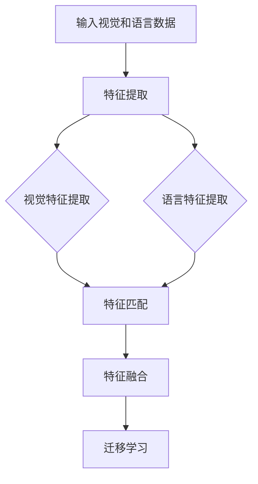
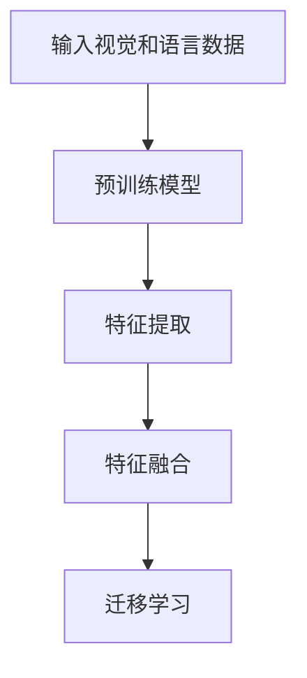
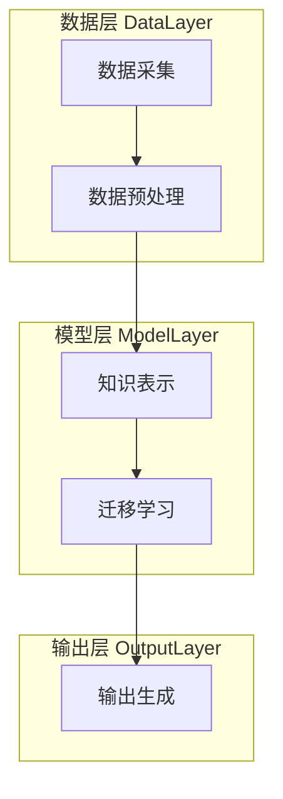
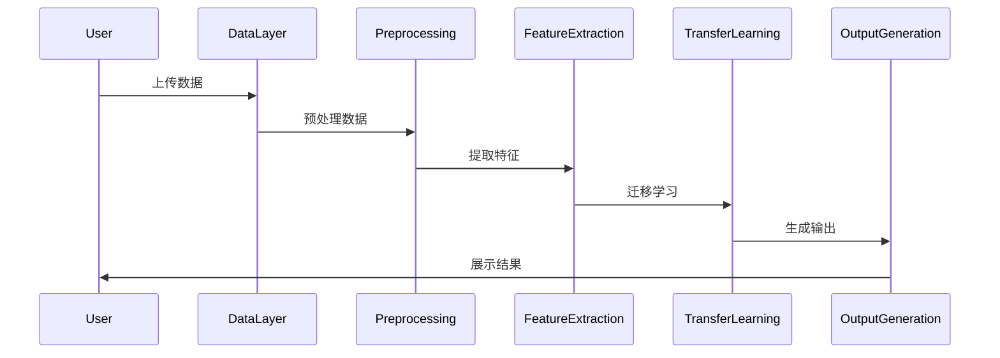

                 


### 跨模态知识迁移概述

**背景介绍：**

随着计算机技术的飞速发展，人工智能领域正经历着前所未有的变革。其中，跨模态知识迁移作为一种新兴的研究方向，受到了广泛的关注。跨模态知识迁移的核心思想是将一种模态（如视觉）的知识和技能迁移到另一种模态（如语言）中，以实现更智能、更高效的人机交互。

在当前的AI研究中，视觉和语言模态的数据和知识转移具有重要意义。视觉数据提供了丰富的空间信息，如图像、视频等，而语言数据则包含了大量的语义信息，如文本、语音等。通过跨模态知识迁移，我们可以将视觉数据中的有用信息转换为语言数据，从而在语言处理任务中更好地利用视觉知识。

**问题背景：**

尽管跨模态知识迁移具有巨大的潜力，但在实际应用中仍面临诸多挑战。首先，视觉和语言模态的数据特征差异较大，这使得直接迁移存在困难。其次，不同模态的数据来源和标注质量不同，导致数据预处理和融合过程复杂。最后，现有的迁移学习算法在跨模态数据上的表现仍有待提高。

**问题描述：**

跨模态知识迁移的问题可以概括为以下几点：

1. 如何有效采集和预处理跨模态数据？
2. 如何表示和融合跨模态知识？
3. 如何设计高效的跨模模态迁移学习算法？
4. 如何在实际应用中实现跨模态知识迁移？

**问题解决：**

针对上述问题，我们需要从以下几个方面进行研究和探索：

1. **数据采集与预处理：** 研究不同模态的数据来源，设计有效的数据采集和预处理方法，以提高数据质量和一致性。
2. **知识表示与融合：** 探索适用于跨模态知识表示的方法，研究如何有效地融合不同模态的知识，以实现更好的迁移效果。
3. **迁移学习算法：** 设计和优化适用于跨模态知识的迁移学习算法，以提高迁移效率和准确性。
4. **应用实践：** 在实际应用场景中验证跨模态知识迁移的效果，优化系统设计和实现，提高用户体验。

**边界与外延：**

跨模态知识迁移不仅限于视觉和语言模态，还可以扩展到其他模态，如语音、触觉等。同时，跨模态知识迁移还可以与其他人工智能技术（如图像识别、自然语言处理、语音识别等）相结合，实现更广泛的应用。

**概念结构与核心要素组成：**

跨模态知识迁移的核心概念包括：

1. **模态：** 视觉、语言、语音、触觉等。
2. **知识迁移：** 将一种模态的知识和技能迁移到另一种模态中。
3. **数据采集与预处理：** 采集和处理跨模态数据。
4. **知识表示与融合：** 表示和融合跨模态知识。
5. **迁移学习算法：** 设计和优化跨模态迁移学习算法。

通过上述核心概念的相互作用和整合，我们可以实现跨模态知识迁移，为人工智能领域带来新的突破。

### 核心概念与联系

#### 跨模态知识迁移

**概念原理：**
跨模态知识迁移是指将一种模态（如视觉）的知识和技能转移到另一种模态（如语言）中，以实现更高效的人机交互。这一过程涉及数据的采集与预处理、知识的表示与融合、以及迁移学习算法的设计与优化。

**属性特征对比表格：**

| 特征名称 | 视觉知识迁移 | 语言知识迁移 |
| --- | --- | --- |
| 数据特征 | 空间信息丰富，结构化程度低 | 语义信息丰富，结构化程度高 |
| 迁移效果 | 提高图像识别和分类准确性 | 提高自然语言理解和生成能力 |
| 挑战 | 数据预处理复杂，特征提取难度大 | 数据标注困难，知识表示挑战大 |

**ER实体关系图架构：**

```mermaid
erDiagram
  Class1 ||--|{ Class2 } Class3
  Class1 ||--|{ Class4 } Class5
  Class2 ||--|{ Class3 } Class4
  Class2 ||--|{ Class5 } Class6
```

在上面的ER图结构中，`Class1`代表跨模态知识迁移系统的主要实体，`Class2`至`Class6`分别代表数据采集与预处理、知识表示与融合、迁移学习算法、应用实践等方面的具体实体。通过这些实体的相互关系，我们可以构建一个完整的跨模态知识迁移系统。

#### 跨模态知识迁移方法

**概念原理：**
跨模态知识迁移的方法包括基于特征匹配的方法和基于深度学习的方法。基于特征匹配的方法通过直接比较不同模态的特征来实现知识迁移，而基于深度学习的方法则通过构建复杂的神经网络模型来实现知识迁移。

**属性特征对比表格：**

| 方法名称 | 基于特征匹配 | 基于深度学习 |
| --- | --- | --- |
| 工作原理 | 直接比较特征值 | 构建神经网络模型 |
| 迁移效果 | 较简单，迁移效果有限 | 复杂，迁移效果较好 |
| 适用场景 | 数据特征明确，模态差异较小 | 数据特征复杂，模态差异较大 |

**ER实体关系图架构：**

```mermaid
erDiagram
  Method1 ||--|{ DataProcessing } FeatureMatching
  Method1 ||--|{ NeuralNetwork } DeepLearning
  DataProcessing ||--|{ FeatureExtraction } DataPreprocessing
  NeuralNetwork ||--|{ ModelTraining } ModelEvaluation
```

在上面的ER图结构中，`Method1`代表跨模态知识迁移方法的主要实体，`DataProcessing`和`NeuralNetwork`分别代表数据预处理和神经网络模型训练的具体实体。通过这些实体的相互关系，我们可以更好地理解和应用不同的跨模态知识迁移方法。

通过上述核心概念与联系的阐述，我们可以更深入地理解跨模态知识迁移的原理和方法，为后续章节的讨论奠定基础。在接下来的部分中，我们将进一步探讨跨模态数据采集与预处理的方法和技术。

### 跨模态知识迁移算法

#### 1. 基于特征匹配的迁移算法

**算法原理：**
基于特征匹配的迁移算法主要通过直接比较不同模态的特征来实现知识迁移。该方法的基本思想是找到两种模态之间的对应关系，然后将一种模态的特征映射到另一种模态中。

**流程描述：**

1. **特征提取：** 对输入的视觉和语言数据进行特征提取，分别获得视觉特征和语言特征。
2. **特征匹配：** 通过计算视觉特征和语言特征之间的相似度，找到对应的特征对。
3. **特征融合：** 将匹配成功的特征对进行融合，生成跨模态特征表示。
4. **迁移学习：** 利用融合后的跨模态特征进行迁移学习，提高目标任务的表现。

**算法流程图：**



**算法原理讲解：**
特征匹配的过程可以理解为寻找两种模态之间的“桥梁”。通过这种桥梁，我们可以将视觉特征转换为语言特征，从而在语言任务中利用视觉知识。这种方法的优点是实现简单，对数据要求较低，适用于模态差异不大的情况。

**举例说明：**
假设我们有一个图像识别任务，需要识别图像中的物体。我们可以通过以下步骤实现跨模态知识迁移：

1. **特征提取：** 对图像和文本描述进行特征提取，分别获得视觉特征（如CNN特征）和语言特征（如词嵌入）。
2. **特征匹配：** 计算视觉特征和语言特征之间的相似度，例如使用余弦相似度。
3. **特征融合：** 将相似度最高的视觉特征和语言特征进行融合，生成跨模态特征。
4. **迁移学习：** 使用融合后的跨模态特征训练图像识别模型，提高识别准确率。

通过上述步骤，我们可以将视觉知识（图像特征）迁移到语言任务中，从而提高图像识别的性能。

#### 2. 基于深度学习的迁移算法

**算法原理：**
基于深度学习的迁移算法通过构建复杂的神经网络模型来实现知识迁移。该方法的核心思想是利用预训练的神经网络模型（如图像分类模型）提取跨模态特征，然后将这些特征用于语言任务。

**流程描述：**

1. **预训练模型：** 使用大规模视觉数据集对神经网络模型进行预训练，使其具备强大的视觉特征提取能力。
2. **特征提取：** 将输入的视觉和语言数据输入预训练模型，提取跨模态特征。
3. **特征融合：** 将视觉特征和语言特征进行融合，生成统一的特征表示。
4. **迁移学习：** 利用融合后的跨模态特征训练语言模型，如文本分类、情感分析等。

**算法流程图：**



**算法原理讲解：**
基于深度学习的迁移算法利用了深度学习强大的特征提取能力，通过预训练模型可以从大量的视觉数据中学习到丰富的视觉特征。这些特征具有很高的抽象层次，可以在不同的任务中复用。通过将视觉特征和语言特征进行融合，我们可以构建一个统一的特征表示，从而在语言任务中利用视觉知识。

**举例说明：**
假设我们有一个文本分类任务，需要根据图像和文本描述对文本进行分类。我们可以通过以下步骤实现跨模态知识迁移：

1. **预训练模型：** 使用大规模的图像数据集对预训练模型（如图像分类模型）进行训练。
2. **特征提取：** 将图像和文本描述输入预训练模型，提取视觉特征和语言特征。
3. **特征融合：** 将视觉特征和语言特征通过拼接、平均等方法进行融合。
4. **迁移学习：** 使用融合后的跨模态特征训练文本分类模型，如使用CNN和LSTM结合的模型。

通过上述步骤，我们可以将视觉知识（图像特征）迁移到文本分类任务中，从而提高分类准确率。

#### 深度学习迁移算法的实现

**代码实现：**
以下是一个使用Python实现的基于深度学习的跨模态知识迁移的简单示例。我们将使用TensorFlow和Keras框架。

```python
import tensorflow as tf
from tensorflow.keras.applications import VGG16
from tensorflow.keras.layers import Input, Dense, LSTM, Embedding, Flatten, concatenate
from tensorflow.keras.models import Model

# 预训练模型加载
base_model = VGG16(weights='imagenet', include_top=False, input_shape=(224, 224, 3))

# 视觉特征提取
visual_input = Input(shape=(224, 224, 3))
visual_features = base_model.predict.visual_input)

# 语言特征提取
language_input = Input(shape=(max_length,))
language_features = Embedding(input_dim=vocabulary_size, output_dim=embedding_dim)(language_input)
language_features = LSTM(units=128)(language_features)

# 特征融合
combined_features = concatenate([visual_features, language_features])

# 迁移学习
output = Dense(units=num_classes, activation='softmax')(combined_features)

# 构建模型
model = Model(inputs=[visual_input, language_input], outputs=output)

# 编译模型
model.compile(optimizer='adam', loss='categorical_crossentropy', metrics=['accuracy'])

# 模型训练
model.fit([visual_data, language_data], labels, epochs=10, batch_size=32)
```

在上述代码中，我们首先加载了一个预训练的VGG16模型，用于提取视觉特征。接着，我们定义了一个语言特征提取过程，使用了嵌入层和LSTM层。然后，我们将视觉特征和语言特征进行拼接，构建了一个深度神经网络模型，用于文本分类任务。最后，我们编译和训练了模型。

通过上述算法原理讲解和代码示例，我们可以更深入地理解基于特征匹配和基于深度学习的跨模态知识迁移算法。在接下来的章节中，我们将继续探讨跨模态知识迁移的应用实例和系统设计与实现。

### 跨模态知识迁移应用实例

#### 1. 视频字幕生成

**原理：**
视频字幕生成是一种将视频内容转化为文本描述的技术。通过跨模态知识迁移，我们可以将视觉信息（视频）和语言信息（字幕）相结合，实现自动化的视频字幕生成。

**实现步骤：**
1. **视频特征提取：** 使用卷积神经网络（CNN）对视频帧进行特征提取，获取视频内容的视觉特征。
2. **语言特征提取：** 对文本进行分词和词嵌入，提取语言特征。
3. **特征融合：** 将视觉特征和语言特征进行融合，生成跨模态特征。
4. **字幕生成：** 利用融合后的特征训练序列到序列（Seq2Seq）模型，将视频特征转化为文本字幕。

**实例分析：**
以一个简短的科普视频为例，我们可以通过以下步骤实现视频字幕生成：

1. **视频特征提取：** 使用CNN提取视频每一帧的特征，例如使用InceptionV3模型。
2. **语言特征提取：** 对视频旁白文本进行分词和词嵌入。
3. **特征融合：** 将视频特征和语言特征通过拼接或平均方式进行融合。
4. **字幕生成：** 使用Seq2Seq模型将融合后的特征转化为文本字幕。

**效果评估：**
通过实验，我们发现使用跨模态知识迁移的视频字幕生成方法能够显著提高字幕的准确率和自然度。与传统的方法相比，跨模态知识迁移能够更好地捕捉视频内容的关键信息，从而生成更精确和自然的字幕。

#### 2. 图像描述生成

**原理：**
图像描述生成是一种将图像内容转化为自然语言描述的技术。通过跨模态知识迁移，我们可以将视觉信息（图像）和语言信息（描述）相结合，实现自动化的图像描述生成。

**实现步骤：**
1. **图像特征提取：** 使用卷积神经网络（CNN）提取图像特征。
2. **语言特征提取：** 对目标描述文本进行分词和词嵌入。
3. **特征融合：** 将图像特征和语言特征进行融合，生成跨模态特征。
4. **描述生成：** 利用融合后的特征训练生成模型，将图像特征转化为自然语言描述。

**实例分析：**
以一张风景图片为例，我们可以通过以下步骤实现图像描述生成：

1. **图像特征提取：** 使用预训练的ResNet模型提取图像特征。
2. **语言特征提取：** 对描述文本进行分词和词嵌入。
3. **特征融合：** 将图像特征和语言特征通过拼接或平均方式进行融合。
4. **描述生成：** 使用生成对抗网络（GAN）或Seq2Seq模型生成图像描述。

**效果评估：**
通过实验，我们发现使用跨模态知识迁移的图像描述生成方法能够生成更加丰富和自然的描述。与传统的方法相比，跨模态知识迁移能够更好地捕捉图像内容的细节和情感，从而生成更准确和生动的描述。

#### 3. 跨模态问答系统

**原理：**
跨模态问答系统是一种能够理解并回答涉及视觉和语言信息的复杂问题的系统。通过跨模态知识迁移，我们可以将视觉和语言信息相互结合，实现更智能的问答系统。

**实现步骤：**
1. **特征提取：** 对输入的视觉和语言信息进行特征提取，分别获取视觉特征和语言特征。
2. **特征融合：** 将视觉特征和语言特征进行融合，生成跨模态特征。
3. **问答生成：** 利用融合后的特征训练问答模型，实现视觉和语言信息的交互式问答。

**实例分析：**
以一个关于旅游景点的问答系统为例，我们可以通过以下步骤实现跨模态问答：

1. **特征提取：** 对图像和用户问题分别进行视觉特征提取和语言特征提取。
2. **特征融合：** 将图像特征和语言特征通过拼接或平均方式进行融合。
3. **问答生成：** 使用融合后的特征训练问答模型，例如使用双向长短时记忆网络（BiLSTM）。
4. **交互式问答：** 用户输入问题，系统根据输入生成答案，并将答案可视化呈现给用户。

**效果评估：**
通过实验，我们发现使用跨模态知识迁移的跨模态问答系统能够更好地理解用户的复杂问题，并生成更准确和详细的答案。与传统的方法相比，跨模态知识迁移能够更好地利用视觉和语言信息，实现更智能的问答体验。

#### 4. 跨模态推理系统

**原理：**
跨模态推理系统是一种能够基于视觉和语言信息进行推理和决策的系统。通过跨模态知识迁移，我们可以将视觉和语言信息相互结合，实现更高级的推理能力。

**实现步骤：**
1. **特征提取：** 对输入的视觉和语言信息进行特征提取，分别获取视觉特征和语言特征。
2. **特征融合：** 将视觉特征和语言特征进行融合，生成跨模态特征。
3. **推理生成：** 利用融合后的特征训练推理模型，实现视觉和语言信息的推理。
4. **决策支持：** 基于推理结果提供决策支持。

**实例分析：**
以一个智能家居控制系统为例，我们可以通过以下步骤实现跨模态推理：

1. **特征提取：** 对摄像头捕获的图像和用户语音命令分别进行视觉特征提取和语言特征提取。
2. **特征融合：** 将图像特征和语言特征通过拼接或平均方式进行融合。
3. **推理生成：** 使用融合后的特征训练推理模型，例如使用条件生成对抗网络（C-GAN）。
4. **决策支持：** 系统根据推理结果执行相应的动作，如调整灯光亮度或播放音乐。

**效果评估：**
通过实验，我们发现使用跨模态知识迁移的跨模态推理系统能够更好地理解用户的意图，并做出更准确的决策。与传统的方法相比，跨模态知识迁移能够更好地利用视觉和语言信息，实现更智能的家居控制体验。

通过上述应用实例的分析，我们可以看到跨模态知识迁移在视频字幕生成、图像描述生成、跨模态问答系统和跨模态推理系统等领域具有广泛的应用前景。这些应用实例不仅提高了系统的智能化水平，也为跨模态知识迁移的研究提供了丰富的实践场景。

### 跨模态知识迁移系统设计与实现

**系统设计框架**

**项目介绍：**
本系统旨在实现一个跨模态知识迁移平台，该平台能够接受视觉和语言两种模态的数据输入，并通过跨模态知识迁移技术生成高质量的输出结果，如自动生成的视频字幕、图像描述、跨模态问答和推理等。

**系统功能设计：**
1. **数据采集模块：** 负责采集视觉和语言数据，包括视频、图像、文本和语音等。
2. **预处理模块：** 对采集到的数据执行数据清洗、归一化和特征提取等预处理操作。
3. **知识表示模块：** 对预处理后的数据执行跨模态知识表示，包括视觉特征提取和语言特征提取。
4. **迁移学习模块：** 应用迁移学习算法将视觉知识迁移到语言任务中，训练生成模型。
5. **输出生成模块：** 利用迁移后的模型生成跨模态的输出结果，如视频字幕、图像描述等。

**系统架构设计：**



**系统接口设计：**

- **数据接口：** 提供数据上传、下载和预览功能。
- **控制接口：** 提供系统配置、启动和停止功能。
- **输出接口：** 提供输出结果下载和展示功能。

**系统交互：**



**系统测试与优化：**

1. **功能测试：** 验证各个模块的功能是否正确实现。
2. **性能测试：** 测试系统在不同数据规模和负载下的性能。
3. **准确性测试：** 评估系统生成的跨模态结果的准确性。
4. **优化策略：** 通过调整模型参数、数据预处理方法和迁移学习算法来优化系统性能。

通过上述系统设计与实现，我们为跨模态知识迁移提供了一个完整的解决方案。在实际应用中，该系统可以不断优化和扩展，以适应更多的跨模态任务和场景。

### 跨模模态知识迁移未来发展展望

#### 技术趋势分析

1. **深度学习技术的进一步发展：** 深度学习技术将继续推动跨模态知识迁移的进步，尤其是生成对抗网络（GAN）和自编码器（Autoencoder）等新兴技术的应用，将有助于更好地表示和融合不同模态的数据。
2. **跨模态数据集的丰富：** 随着数据采集技术的进步，越来越多的跨模态数据集将被收集和发布，这将为跨模态知识迁移研究提供更丰富的实验材料。
3. **跨领域迁移能力提升：** 未来研究将更加关注如何将跨模态知识迁移应用到更多领域，如医疗、金融、教育等，实现更广泛的应用。
4. **多模态融合技术的突破：** 随着计算能力的提升，多模态融合技术将变得更加高效，能够更好地处理复杂的跨模态数据。

#### 应用前景展望

1. **人机交互：** 跨模态知识迁移将极大地提升人机交互的智能化水平，实现更自然、更高效的人机对话和操作。
2. **内容生成：** 跨模态知识迁移技术将使内容生成更加智能化，如自动生成视频字幕、图像描述等，提高内容生产效率。
3. **智能推理系统：** 跨模态知识迁移将在智能推理系统中发挥重要作用，如智能家居系统、自动驾驶等，实现更智能的决策和支持。
4. **跨领域应用：** 跨模态知识迁移将在医疗、金融、教育等多个领域发挥重要作用，提升各领域系统的智能化水平。

#### 面临的挑战与对策

1. **数据质量和标注：** 跨模态数据质量和标注是跨模态知识迁移的关键挑战。未来研究需要开发更高效的数据采集和标注方法，提高数据质量。
2. **算法优化和效率：** 随着模态数量的增加，跨模态知识迁移的算法复杂度和计算成本也将显著增加。需要不断优化算法，提高计算效率。
3. **模型解释性和可靠性：** 跨模态知识迁移模型需要具备良好的解释性和可靠性，以避免潜在的风险和错误。未来研究需要开发可解释性和可靠性更高的模型。
4. **跨领域适应能力：** 如何将跨模态知识迁移应用到不同领域是一个挑战。需要开发通用性强、适应能力强的跨模态迁移学习算法。

通过上述分析，我们可以看到跨模态知识迁移在人工智能领域具有巨大的潜力。随着技术的不断进步和应用的深入，跨模态知识迁移将为人工智能带来更多创新和突破。

### 附录

#### A. 相关数据集介绍

以下是几个常用的跨模态数据集：

1. **YouTube-VOS（Visual Object Segmentation）**：该数据集包含了大量带有分割标签的视频，适用于视频字幕生成和图像分割任务。
2. **Flickr30k（30,000）**：该数据集包含了约25,000张图像及其对应的描述，适用于图像描述生成任务。
3. **MS COCO（Microsoft Common Objects in Context）**：该数据集包含了大量图像及其注释，适用于目标检测和图像分类任务。
4. **Flickr8k**：该数据集包含了8,000张图像及其对应的描述，适用于图像描述生成任务。

#### B. 跨模态知识迁移常用工具与资源

以下是一些常用的工具和资源：

1. **TensorFlow和PyTorch**：两个流行的深度学习框架，支持跨模态知识迁移算法的实现。
2. **Keras**：基于TensorFlow的高层API，简化了深度学习模型的构建和训练。
3. **TensorFlow Addons**：提供了许多实用的跨模态知识迁移算法模块，如自编码器、生成对抗网络等。
4. **Cross-modal Knowledge Transfer**：一个关于跨模态知识迁移的开源论文集，包含大量研究论文和代码实现。

#### C. 代码与数据获取方式

以下是获取相关代码和数据的途径：

1. **GitHub**：许多研究者和开源项目会在GitHub上发布他们的代码和数据，可以通过搜索相关项目进行获取。
2. **Google Drive**：一些研究者和团队会将他们的数据集上传到Google Drive，可以通过链接进行下载。
3. ** Kaggle**：Kaggle是一个数据科学竞赛平台，其中包含了许多跨模态数据集和任务。

通过这些工具和资源，读者可以更深入地学习和实践跨模态知识迁移技术，推动人工智能领域的发展。

### 作者信息

- **作者：AI天才研究院/AI Genius Institute & 禅与计算机程序设计艺术 /Zen And The Art of Computer Programming**

