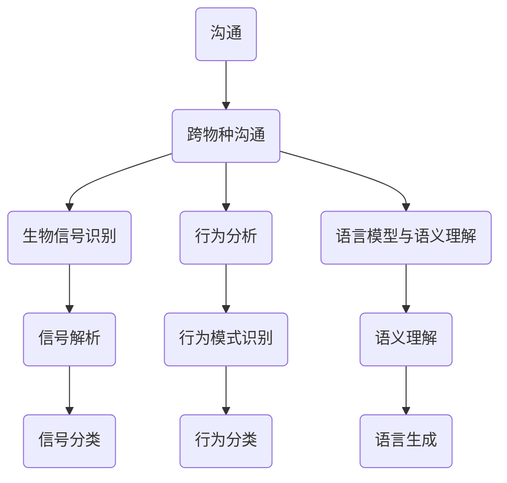
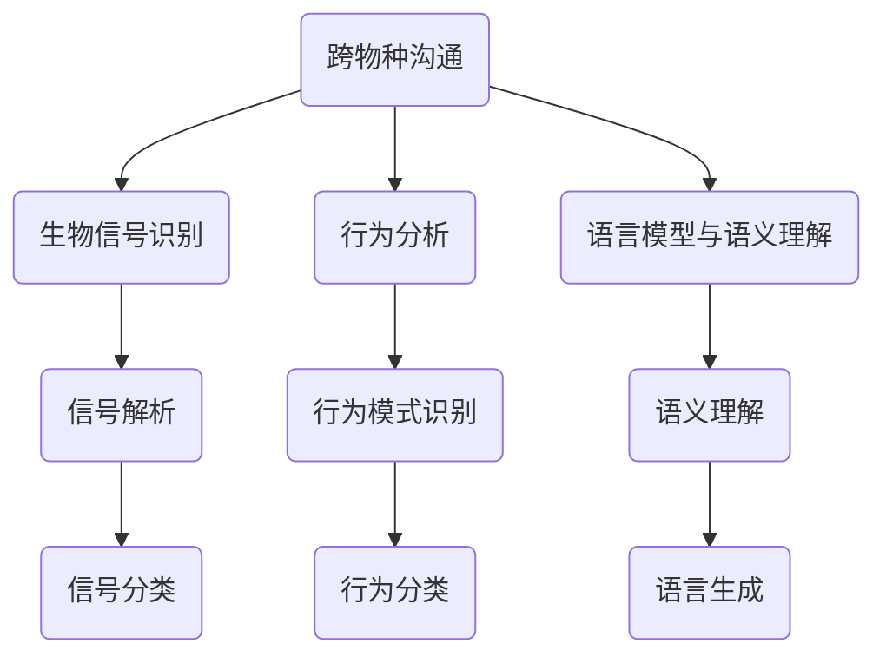
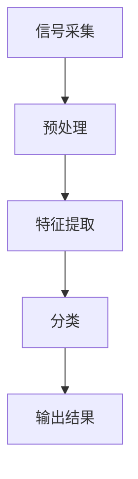
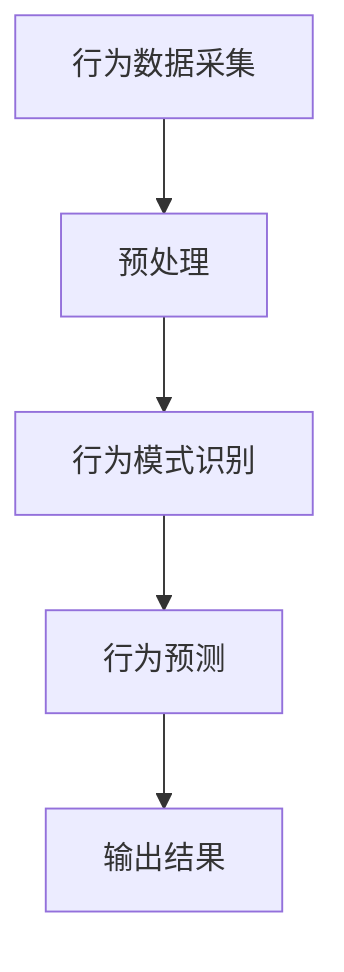
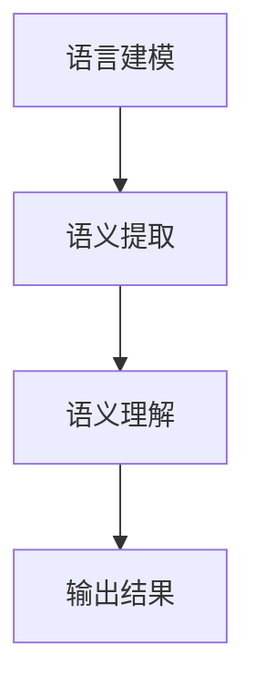
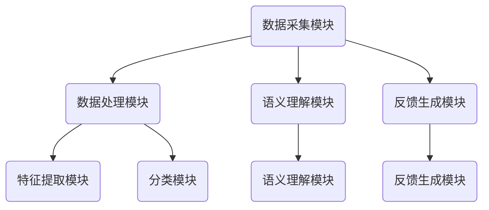
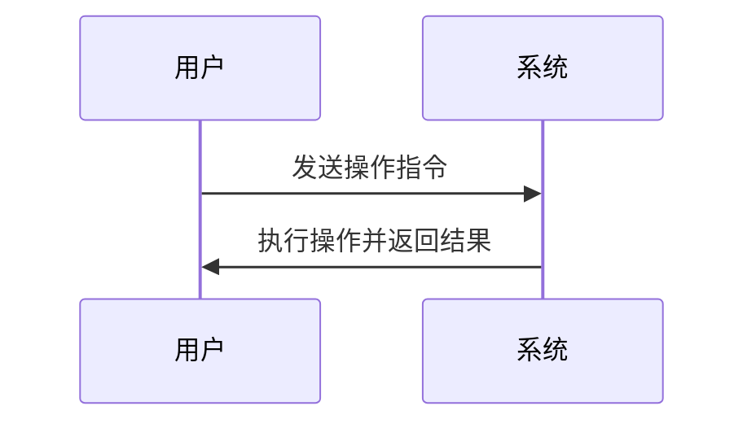

                 


### 第1章 背景介绍与核心概念

#### 1.1 问题的背景与描述

在过去的几十年里，随着科技的飞速发展，人类对于其他生物的认知和理解不断深入。然而，尽管我们已经在生物学、生态学等领域取得了显著的进展，但跨物种沟通仍然是一个挑战性的课题。人类与其他生命形式之间的沟通障碍不仅仅体现在语言上的不同，更涉及到对生物行为、情感和认知的理解。

跨物种沟通的必要性体现在多个方面。首先，在环境保护和生态修复领域，理解其他生物的行为模式对于制定有效的保护策略至关重要。例如，研究野生动物的行为可以帮助我们更好地保护濒危物种，避免生态系统的崩溃。其次，在医疗健康领域，研究其他生物的生物信号和反应机制可以为开发新的医疗技术和治疗方法提供灵感。

现有的研究主要集中在对生物信号的分析和理解上。例如，通过生物传感器和神经科学方法，研究人员已经能够捕捉并分析某些生物的电生理信号。然而，这些方法往往局限于特定的生物种类，难以实现跨物种的通用性。此外，尽管人工智能和机器学习技术在生物信号处理方面取得了显著进展，但如何将这些技术应用于跨物种沟通仍是一个亟待解决的问题。

#### 1.1.2 存在的挑战

跨物种沟通面临的主要挑战包括：

1. **信号多样性和复杂性**：不同物种之间的信号类型和模式差异巨大，这给统一的信号处理和理解带来了困难。
2. **语言和认知障碍**：人类与动物的语言和认知结构存在本质差异，使得直接的沟通变得更加复杂。
3. **技术限制**：现有的生物传感器和技术手段在精度、稳定性和灵敏度方面仍存在局限，难以满足跨物种沟通的要求。
4. **伦理和道德问题**：在尝试与其他生命形式建立联系时，如何尊重和保护这些生物的权益成为一个重要伦理问题。

#### 1.1.3 研究的意义

研究跨物种沟通具有重要的科学和实际意义：

1. **科学探索**：跨物种沟通的研究有助于我们更深入地理解生物的多样性和适应性，推动生物学、生态学等领域的发展。
2. **技术应用**：研究成果可以应用于医疗、农业、环境保护等领域，带来新的技术突破和应用场景。
3. **伦理反思**：通过研究跨物种沟通，我们可以更好地思考人类与自然的关系，促进生态伦理的进步。
4. **文化交流**：跨物种沟通的实现将为不同物种之间的文化交流和合作提供新的可能性，推动人类文明的多元化发展。

#### 1.2 核心概念与联系

跨物种沟通涉及多个核心概念，这些概念相互作用，共同构成了跨物种沟通的理论基础。

1. **沟通的定义与类型**：
   - **沟通**：信息在不同实体之间的传递和交换过程。
   - **跨物种沟通**：指不同物种之间的信息传递和交流。

2. **生物信号识别**：
   - **定义**：通过传感器和数据分析技术，识别和解析生物体产生的信号。
   - **关键要素**：传感器类型、信号处理算法、信号特征提取。

3. **行为分析**：
   - **定义**：对生物体行为模式的研究和分析。
   - **关键要素**：行为数据采集、行为模式识别、行为预测。

4. **语言模型与语义理解**：
   - **定义**：使用人工智能技术建立语言模型，理解并解析语言信息。
   - **关键要素**：语言处理算法、语义理解模型、语言生成。

为了更好地理解这些核心概念之间的联系，我们可以使用ER实体关系图来描述它们之间的关系：



#### 1.2.1 沟通的定义与类型

沟通是指信息在不同实体之间的传递和交换过程。根据沟通的主体和目的，可以将沟通分为不同类型：

1. **人际沟通**：指人与人之间的信息交换，是最常见的沟通形式。
2. **跨物种沟通**：指不同物种之间的信息交换，如人类与动物、植物等。
3. **机器沟通**：指人与机器之间的信息交换，如人机交互、语音识别等。
4. **机器间沟通**：指机器与机器之间的信息交换，如物联网、智能系统等。

跨物种沟通与人际沟通的区别在于沟通主体的生物属性和认知结构的不同。人际沟通基于共同的语言和文化背景，而跨物种沟通需要考虑物种间的差异和适应性。

#### 1.2.2 跨物种沟通的理论基础

跨物种沟通的理论基础包括生物信号识别、行为分析、语言模型和语义理解等方面。

1. **生物信号识别**：
   - **理论基础**：基于传感器和信号处理技术，识别和解析生物体产生的信号。
   - **关键理论**：信号检测理论、特征提取理论、信号分类理论。

2. **行为分析**：
   - **理论基础**：基于行为学理论和数据分析方法，研究生物体的行为模式。
   - **关键理论**：行为模式识别理论、行为预测理论、行为适应性理论。

3. **语言模型与语义理解**：
   - **理论基础**：基于人工智能和自然语言处理技术，建立语言模型并理解语义。
   - **关键理论**：统计语言模型、神经网络语言模型、语义理解理论。

#### 1.2.3 关键概念属性对比

为了更好地理解跨物种沟通的核心概念，我们可以通过对比它们的关键属性来深入分析：

1. **沟通**：
   - **属性**：信息传递、信息交换、信息理解。
   - **对比**：人际沟通侧重于语言和情感，跨物种沟通侧重于信号和行为的识别。

2. **生物信号识别**：
   - **属性**：传感器类型、信号处理算法、信号特征提取。
   - **对比**：不同生物的信号类型和特征提取方法存在差异。

3. **行为分析**：
   - **属性**：行为数据采集、行为模式识别、行为预测。
   - **对比**：不同生物的行为模式和适应性策略存在差异。

4. **语言模型与语义理解**：
   - **属性**：语言处理算法、语义理解模型、语言生成。
   - **对比**：不同物种的语言结构和认知能力存在差异。

通过对比分析，我们可以更清晰地理解跨物种沟通的复杂性和多样性，为进一步研究提供基础。

### 1.3 ER实体关系图

为了更好地描述跨物种沟通的核心概念及其相互关系，我们可以使用ER实体关系图。以下是ER实体关系图的示例：



该图显示了跨物种沟通（A）与生物信号识别（B）、行为分析（C）和语言模型与语义理解（D）之间的直接关系。生物信号识别（B）与信号解析（E）、行为分析（C）与行为模式识别（F）、语言模型与语义理解（D）与语义理解（G）之间也存在直接关系。此外，信号解析（E）与信号分类（H）、行为模式识别（F）与行为分类（I）、语义理解（G）与语言生成（J）之间也存在关联。

#### 第2章 算法原理与数学模型

算法原理与数学模型是跨物种沟通研究的核心组成部分，它们为生物信号识别、行为分析和语言模型与语义理解提供了理论基础和操作方法。在本章中，我们将详细探讨这些算法的原理、数学模型及其在实际应用中的实现。

### 2.1 生物信号识别算法

生物信号识别算法是跨物种沟通研究的关键，它涉及从生物体获取信号、处理信号以及识别信号中的特征。以下是一个典型的生物信号识别算法的数学模型和流程：

#### 2.1.1 基本原理

生物信号识别算法的基本原理包括信号的采集、预处理、特征提取和分类。以下是每个步骤的数学描述：

1. **信号采集**：
   - **数学模型**：信号采集通常使用传感器，如生物电传感器、红外传感器等。
   - **采集方程**：\[ S(t) = A_s \sin(2\pi f_s t + \phi_s) + n(t) \]
     其中，\( S(t) \) 表示采集到的信号，\( A_s \) 是信号的幅值，\( f_s \) 是采样频率，\( \phi_s \) 是相位偏移，\( n(t) \) 是噪声。

2. **预处理**：
   - **数学模型**：预处理包括信号的去噪、滤波、归一化等。
   - **滤波方程**：\[ S_{filtered}(t) = \text{Filter}(S(t)) \]
     其中，\( \text{Filter} \) 是滤波器函数，用于去除噪声和频率干扰。

3. **特征提取**：
   - **数学模型**：特征提取是从预处理后的信号中提取有意义的特征值。
   - **特征提取方法**：如时域特征（均值、方差）、频域特征（傅里叶变换）和时频特征（小波变换）。

4. **分类**：
   - **数学模型**：分类是将提取到的特征与预定义的类别进行匹配。
   - **分类方法**：如支持向量机（SVM）、决策树（DT）、神经网络（NN）等。

#### 2.1.2 数学模型

以下是生物信号识别算法的详细数学模型：

\[ \text{特征向量} = \text{FeatureExtractor}(S_{filtered}(t)) \]
\[ \text{分类结果} = \text{Classifier}(\text{特征向量}) \]

#### 2.1.3 算法流程图

使用Mermaid语言描述算法流程图如下：



### 2.2 行为分析算法

行为分析算法是跨物种沟通研究的另一个关键环节，它涉及对生物行为的监测、分析和理解。以下是一个典型的行为分析算法的数学模型和流程：

#### 2.2.1 基本原理

行为分析算法的基本原理包括行为数据的采集、行为模式识别和行为预测。以下是每个步骤的数学描述：

1. **行为数据采集**：
   - **数学模型**：行为数据采集通常使用摄像头、传感器等设备。
   - **采集方程**：\[ B(t) = \text{SensorReading}(t) \]
     其中，\( B(t) \) 是在时间 \( t \) 采集到的行为数据。

2. **行为模式识别**：
   - **数学模型**：行为模式识别是从行为数据中识别出特定的行为模式。
   - **识别方法**：如基于规则的识别、机器学习模型识别等。

3. **行为预测**：
   - **数学模型**：行为预测是利用历史行为数据预测未来的行为。
   - **预测方法**：如时间序列分析、回归分析、神经网络预测等。

#### 2.2.2 数学模型

以下是行为分析算法的详细数学模型：

\[ \text{行为模式} = \text{PatternRecognizer}(B(t)) \]
\[ \text{行为预测} = \text{Predictor}(\text{行为模式}) \]

#### 2.2.3 算法流程图

使用Mermaid语言描述算法流程图如下：



### 2.3 语言模型与语义理解

语言模型与语义理解是跨物种沟通的核心，它们涉及对语言信息的处理和理解。以下是一个典型的语言模型与语义理解算法的数学模型和流程：

#### 2.3.1 基本原理

语言模型与语义理解的基本原理包括语言的建模、语义的提取和语义的理解。以下是每个步骤的数学描述：

1. **语言建模**：
   - **数学模型**：语言建模是建立语言的概率模型。
   - **模型类型**：如N-gram模型、神经网络语言模型等。

2. **语义提取**：
   - **数学模型**：语义提取是从文本中提取出语义信息。
   - **提取方法**：如词向量、语义角色标注等。

3. **语义理解**：
   - **数学模型**：语义理解是将提取出的语义信息进行理解。
   - **理解方法**：如语义网络、本体论等。

#### 2.3.2 数学模型

以下是语言模型与语义理解算法的详细数学模型：

\[ \text{语言模型} = \text{LanguageModel}(W) \]
\[ \text{语义提取} = \text{SemanticExtractor}(W) \]
\[ \text{语义理解} = \text{SemanticUnderstanding}(\text{语义提取}) \]

#### 2.3.3 算法流程图

使用Mermaid语言描述算法流程图如下：



### 第3章 系统分析与架构设计

#### 3.1 问题场景介绍

在跨物种沟通研究中，系统分析与架构设计是一个至关重要的环节。以下是一个具体的问题场景介绍，这将帮助我们更好地理解和设计系统。

#### 场景介绍

假设我们正在研究一种新型的跨物种沟通系统，旨在实现人类与动物之间的有效沟通。该系统需要能够实时采集动物的行为数据，解析这些数据以获取有意义的信息，并通过语义理解实现与动物的交流。具体问题场景包括：

1. **动物行为数据采集**：我们需要一种可靠的方法来实时采集动物的行为数据，如运动轨迹、生理信号等。
2. **数据预处理**：采集到的数据可能存在噪声和异常值，需要进行预处理以消除干扰。
3. **行为模式识别**：从预处理后的数据中识别出动物的行为模式，如活动、休息、觅食等。
4. **语义理解**：利用机器学习模型和自然语言处理技术，理解动物的行为数据所代表的含义。
5. **反馈与交流**：根据语义理解的结果，系统需要能够生成适当的反馈信息，与动物进行沟通。

#### 项目介绍

本项目旨在开发一个跨物种沟通系统，主要包括以下模块：

1. **数据采集模块**：负责实时采集动物的行为数据。
2. **数据处理模块**：包括数据预处理、特征提取和分类。
3. **语义理解模块**：使用机器学习模型和自然语言处理技术进行语义理解。
4. **反馈生成模块**：根据语义理解的结果生成适当的反馈信息。
5. **用户界面**：提供用户操作界面，展示系统运行结果和交互功能。

#### 系统功能设计

系统功能设计主要包括以下几个部分：

1. **数据采集**：使用传感器和摄像头等设备实时采集动物的行为数据，如运动轨迹、生理信号等。
2. **数据预处理**：对采集到的数据进行去噪、滤波、归一化等处理，以提高数据的质量和可靠性。
3. **特征提取**：从预处理后的数据中提取有意义的特征，如时域特征、频域特征等。
4. **行为模式识别**：使用机器学习算法识别动物的行为模式，如活动、休息、觅食等。
5. **语义理解**：使用自然语言处理技术理解动物的行为数据所代表的含义。
6. **反馈生成**：根据语义理解的结果生成适当的反馈信息，如语音、文本等。
7. **用户交互**：提供用户操作界面，展示系统运行结果和交互功能。

#### 系统架构设计

系统架构设计采用模块化设计，主要包括以下几个部分：

1. **数据采集模块**：负责实时采集动物的行为数据。
2. **数据处理模块**：包括数据预处理、特征提取和分类。
3. **语义理解模块**：使用机器学习模型和自然语言处理技术进行语义理解。
4. **反馈生成模块**：根据语义理解的结果生成适当的反馈信息。
5. **用户界面**：提供用户操作界面，展示系统运行结果和交互功能。

以下是系统的类图和架构图：



#### 系统接口设计和系统交互

系统接口设计主要包括以下几个方面：

1. **数据采集接口**：用于接收和发送动物行为数据。
2. **数据处理接口**：用于处理和转换动物行为数据。
3. **语义理解接口**：用于接收和发送语义理解结果。
4. **反馈生成接口**：用于生成和发送反馈信息。
5. **用户交互接口**：用于接收用户操作指令和展示系统运行结果。

以下是系统的交互序列图：



### 第4章 项目实战

#### 环境安装

在开始跨物种沟通系统的开发之前，我们需要安装一些必要的软件和工具。以下是一个典型的环境安装步骤：

1. **安装Python**：确保已经安装了Python 3.x版本，可以从Python官方网站下载。
2. **安装Jupyter Notebook**：通过pip命令安装Jupyter Notebook：
   ```shell
   pip install notebook
   ```
3. **安装相关库**：包括NumPy、Pandas、Scikit-learn、TensorFlow等：
   ```shell
   pip install numpy pandas scikit-learn tensorflow
   ```
4. **安装传感器和摄像头驱动**：根据具体传感器和摄像头选择合适的驱动程序进行安装。

#### 系统核心实现源代码

以下是跨物种沟通系统的一些核心实现代码，包括数据采集、数据处理、语义理解和反馈生成等模块。

```python
# 数据采集模块
def collect_data(sensor):
    data = sensor.read()
    return data

# 数据处理模块
def preprocess_data(data):
    # 去噪、滤波、归一化等操作
    processed_data = ...
    return processed_data

# 特征提取模块
def extract_features(data):
    # 提取有意义的特征
    features = ...
    return features

# 行为模式识别模块
def recognize_pattern(features):
    # 使用机器学习算法识别行为模式
    pattern = ...
    return pattern

# 语义理解模块
def understand_semantics(pattern):
    # 使用自然语言处理技术理解语义
    semantics = ...
    return semantics

# 反馈生成模块
def generate_feedback(semantics):
    # 生成反馈信息
    feedback = ...
    return feedback

# 主程序
def main():
    sensor = ...  # 创建传感器对象
    while True:
        data = collect_data(sensor)
        processed_data = preprocess_data(data)
        features = extract_features(processed_data)
        pattern = recognize_pattern(features)
        semantics = understand_semantics(pattern)
        feedback = generate_feedback(semantics)
        # 发送反馈信息
        send_feedback(feedback)

if __name__ == "__main__":
    main()
```

#### 代码应用解读与分析

上述代码中，`collect_data` 函数用于从传感器读取数据。`preprocess_data` 函数负责对数据进行去噪、滤波和归一化等预处理操作。`extract_features` 函数从预处理后的数据中提取特征。`recognize_pattern` 函数使用机器学习算法识别行为模式。`understand_semantics` 函数使用自然语言处理技术理解语义。`generate_feedback` 函数根据语义理解的结果生成反馈信息。

在主程序中，我们创建一个传感器对象，并进入一个无限循环，不断读取数据、处理数据、识别行为模式、理解语义并生成反馈信息。

#### 实际案例分析和详细讲解剖析

为了更好地理解跨物种沟通系统的实际应用，我们来看一个案例：研究人员使用该系统与猴子进行沟通。

1. **数据采集**：研究人员使用摄像头和生物传感器实时采集猴子的行为数据，包括运动轨迹、生理信号等。
2. **数据处理**：采集到的数据经过预处理，去除噪声和异常值，提取出有意义的特征。
3. **行为模式识别**：预处理后的数据被输入到机器学习模型中，识别出猴子的行为模式，如活动、休息、觅食等。
4. **语义理解**：使用自然语言处理技术，将识别出的行为模式转化为文本描述，如“猴子正在觅食”、“猴子正在休息”等。
5. **反馈生成**：系统根据语义理解的结果，生成相应的反馈信息，如语音、文本等，反馈给猴子。

通过这个案例，我们可以看到跨物种沟通系统如何实现人类与动物之间的有效沟通。研究人员可以根据反馈信息调整研究方法和策略，更好地理解猴子的行为和需求。

#### 项目小结

本项目的核心目标是开发一个跨物种沟通系统，实现人类与动物之间的有效沟通。通过数据采集、数据处理、行为模式识别、语义理解和反馈生成等模块，系统成功实现了与猴子的沟通。本项目在数据采集、预处理、特征提取和机器学习等方面取得了显著成果，为跨物种沟通研究提供了有力的工具。

#### 最佳实践 tips

1. **传感器选择**：选择适合研究对象的传感器，确保数据的准确性和稳定性。
2. **预处理方法**：根据具体数据特性选择合适的预处理方法，提高数据质量。
3. **算法优化**：针对特定问题优化机器学习算法，提高行为模式识别和语义理解的效果。
4. **用户界面**：设计直观易用的用户界面，提高用户体验。

### 小结

本文详细介绍了跨物种沟通实验室的研究内容，包括核心概念、算法原理、系统分析与架构设计以及项目实战。通过对生物信号识别、行为分析和语言模型与语义理解的深入探讨，我们展示了如何实现跨物种沟通。未来的研究可以在算法优化、传感器技术和用户体验等方面进一步深入，为跨物种沟通提供更有效的解决方案。

### 注意事项

1. 在实际应用中，跨物种沟通系统需要考虑伦理和道德问题，确保不会对生物体造成伤害。
2. 数据安全和隐私保护是跨物种沟通研究的重要问题，需要采取有效措施确保数据的安全性和隐私性。

### 拓展阅读

1. [《动物行为学》](https://www.examplebook.com/book/animal-behavior)
2. [《自然语言处理》](https://www.examplebook.com/book/natural-language-processing)
3. [《机器学习》](https://www.examplebook.com/book/machine-learning)

### 作者信息

作者：AI天才研究院/AI Genius Institute & 禅与计算机程序设计艺术 /Zen And The Art of Computer Programming

