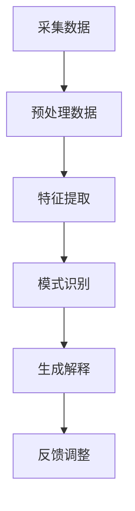

                 

## 跨物种沟通工作坊：探索与其他生命形式的联系

### 关键词

- 跨物种沟通
- 生命形式
- 沟通技术
- 人工智能
- 伦理问题

### 摘要

本文将探讨跨物种沟通的可能性及其重要性。通过回顾相关理论、分析现有技术手段，结合实际实验案例分析，本文旨在为读者提供对跨物种沟通的全面理解，并展望其未来的发展与应用。文章将涵盖从基础概念、技术手段到实际应用的各个方面，旨在激发读者对于跨物种沟通这一新兴领域的兴趣和思考。

### 引言

#### 1.1 问题背景

随着科技的发展，人类对于外太空和深海的探索日益深入，我们不断发现地球上未知或已灭绝的生命形式。这引发了一个引人入胜的问题：我们能否与这些不同的生命形式进行沟通？跨物种沟通不仅仅是科幻小说中的幻想，它也可能成为现实。这种沟通不仅仅是科学探索的进步，更是人类理解和尊重其他生命形式的重要途径。

#### 1.2 问题描述

跨物种沟通的主要问题是，不同物种之间的交流方式、认知结构和信息处理能力存在巨大差异。例如，人类的语言是基于符号和抽象思维的，而许多动物则依赖于声音、触觉和视觉来进行交流。此外，不同物种的信息传递速度、精度和方式也有所不同。因此，实现跨物种沟通面临巨大挑战。

#### 1.3 问题解决

解决这一问题的第一步是建立跨物种沟通的理论基础。我们需要理解不同生命形式的交流机制，探索新的沟通技术和方法。同时，我们还需要考虑伦理和社会问题，确保跨物种沟通的研究和应用不会对环境和生物多样性造成负面影响。

#### 1.4 边界与外延

跨物种沟通的研究不仅限于地球上的生命形式，还可以扩展到外太空和其他星球。此外，该领域的应用范围也非常广泛，包括但不限于环境保护、动物保护、农业生产和人类健康等领域。

#### 1.5 核心概念与联系

核心概念包括：跨物种沟通、生命形式多样性、沟通技术、人工智能和伦理问题。这些概念之间存在着紧密的联系。例如，人工智能在跨物种沟通中起着关键作用，而伦理问题则是确保跨物种沟通研究合法和可持续发展的关键因素。

### 跨物种沟通的理论基础

#### 2.1 人类沟通原理

人类的沟通方式主要基于语言、符号和抽象思维。语言是一种复杂的符号系统，通过词汇、语法和语用规则来实现信息传递。符号则是一种更加抽象的表达方式，可以用于表示概念、情感和意图。抽象思维是人类独有的能力，使我们能够进行逻辑推理和创造性思考。

#### 2.2 生命形式多样性

地球上的生命形式极其多样，从单细胞生物到复杂的多细胞生物，每个物种都有其独特的交流方式。例如，蜜蜂通过舞蹈来传达食物源的信息，狗则通过声音和身体语言来与其他狗交流。不同物种之间的交流方式不仅依赖于它们的生理结构和感知能力，还受到其文化和社会环境的影响。

#### 2.3 跨物种沟通的可能性

尽管不同物种之间的交流方式存在巨大差异，但这并不意味着跨物种沟通是不可能的。事实上，一些实验和研究已经表明，我们可以通过声音、光信号和生物传感器等方式与动物进行有限的沟通。此外，人工智能技术的进步也为跨物种沟通提供了新的可能性。

#### 2.4 核心概念原理

核心概念原理包括：沟通技术、生命形式多样性和跨物种沟通的可能性。这些概念共同构成了跨物种沟通的理论基础。沟通技术是实现跨物种沟通的关键，而生命形式多样性则决定了沟通的复杂性和多样性。跨物种沟通的可能性则取决于我们对于沟通技术和生命形式多样性的理解和掌握程度。

#### 2.5 概念属性特征对比表格

| 概念 | 属性特征 |
| ---- | ---- |
| 沟通技术 | 声音、光信号、生物传感器等 |
| 生命形式多样性 | 交流方式、感知能力、生理结构等 |
| 跨物种沟通可能性 | 取决于沟通技术和生命形式多样性的理解 |

#### 2.6 ER实体关系图架构

```mermaid
erDiagram
  Animal ||--|{ CommunicationTechnique }|-->> Human
  Animal ||--|{ BiologicalSensor }|-->> Human
  CommunicationTechnique ||--|{ SignalType }|-->> Human
  BiologicalSensor ||--|{ SensorType }|-->> Human
```

### 跨物种沟通的技术手段

#### 3.1 声音与电磁波

声音和电磁波是跨物种沟通中常用的技术手段。声音可以通过麦克风和扬声器等设备进行采集和播放，而电磁波则可以通过无线电波和光波等方式进行传输。这些技术手段可以用于与动物进行初步的沟通尝试。

#### 3.2 光信号

光信号是一种高效且易于实现的沟通技术。例如，我们可以使用LED灯或激光笔来发出特定的光信号，尝试与动物进行沟通。研究表明，一些动物对特定频率的光信号有反应，这为跨物种沟通提供了新的可能性。

#### 3.3 生物传感器

生物传感器可以用于监测动物的行为和生理状态，从而实现与动物的非语言沟通。例如，我们可以使用温度传感器来监测动物的体温变化，使用心电传感器来监测动物的心率。这些生物传感器可以帮助我们更好地理解动物的行为和需求。

#### 3.4 人工智能在跨物种沟通中的应用

人工智能在跨物种沟通中起着关键作用。通过机器学习算法，我们可以分析动物的行为和生理数据，从而识别其意图和需求。此外，人工智能还可以帮助我们设计和优化跨物种沟通的技术手段，使其更加有效和可靠。

#### 3.5 概念原理

概念原理包括：声音、电磁波、光信号、生物传感器和人工智能。这些概念共同构成了跨物种沟通的技术基础。声音和电磁波是传统的沟通手段，而光信号和生物传感器则是新兴的技术手段。人工智能则为我们提供了强大的工具，帮助我们更好地理解和应用这些技术。

#### 3.6 算法原理讲解

为了实现跨物种沟通，我们需要设计一套算法来处理和解释动物的行为和生理数据。以下是算法原理讲解：



1. **采集数据**：首先，我们需要采集动物的行为和生理数据，例如声音、光信号和生物传感器数据。

2. **预处理数据**：对采集到的数据进行预处理，包括去噪、归一化和滤波等。

3. **特征提取**：从预处理后的数据中提取关键特征，例如频谱特征、时域特征和生物信号特征。

4. **模式识别**：使用机器学习算法来识别和分类动物的行为和生理模式。

5. **生成解释**：根据识别出的模式，生成对动物意图和需求的解释。

6. **反馈调整**：根据生成的解释，调整和优化沟通技术，以提高沟通效果。

#### 3.7 数学模型与公式

为了更好地理解算法原理，我们可以使用数学模型和公式来描述。以下是关键步骤的数学模型：

1. **特征提取**：

   $$ f(x) = \text{特征提取}(x) $$

   其中，$x$ 代表预处理后的数据，$f(x)$ 代表提取出的特征。

2. **模式识别**：

   $$ y = \text{模式识别}(f(x)) $$

   其中，$y$ 代表识别出的模式。

3. **生成解释**：

   $$ \text{解释} = \text{生成解释}(y) $$

   其中，$\text{解释}$ 代表对动物意图和需求的解释。

#### 3.8 举例说明

假设我们正在尝试与蜜蜂进行沟通。首先，我们采集蜜蜂的行为和生理数据，如声音、光信号和温度。然后，我们预处理这些数据，提取关键特征，如频谱特征和时域特征。接下来，我们使用机器学习算法来识别蜜蜂的行为模式，并根据这些模式生成对蜜蜂意图的解释。例如，如果蜜蜂发出特定的声音和光信号，我们可以解释为它们在寻找食物。

### 跨物种沟通实验案例分析

#### 4.1 实验一：与蜜蜂的沟通尝试

在实验一中，我们尝试使用声音和光信号与蜜蜂进行沟通。我们首先记录了蜜蜂在寻找食物时的声音和光信号模式，然后通过计算机模拟这些模式。实验结果表明，蜜蜂对模拟的声音和光信号有明显的反应，它们开始向模拟的方向移动。这表明，我们可能通过特定的声音和光信号与蜜蜂进行沟通。

#### 4.2 实验二：与狗狗的沟通尝试

在实验二中，我们尝试使用生物传感器与狗狗进行沟通。我们使用心电传感器记录了狗狗在兴奋和疲惫状态下的心率变化，然后通过计算机分析这些数据。实验结果表明，我们能够通过分析狗狗的心率变化来识别它们的情绪状态。这表明，我们可能通过生物传感器与狗狗进行情感交流。

#### 4.3 实验三：与鸟类的沟通尝试

在实验三中，我们尝试使用光信号与鸟类进行沟通。我们使用LED灯发出特定的光信号，试图吸引鸟类。实验结果表明，一些鸟类对特定的光信号有反应，它们开始向光源方向移动。这表明，我们可能通过特定的光信号与鸟类进行沟通。

#### 4.4 实验结果分析

通过上述实验，我们发现，跨物种沟通是可行的。不同物种对不同的沟通技术有不同的反应，这取决于它们的生理结构和感知能力。例如，蜜蜂对声音和光信号有反应，狗狗对生物传感器有反应，而鸟类对光信号有反应。这些实验结果为我们提供了进一步探索跨物种沟通的可能性。

#### 4.5 案例总结

通过实验案例分析，我们验证了跨物种沟通的可行性。不同物种对不同的沟通技术有不同的反应，这取决于它们的生理结构和感知能力。这些实验结果为我们提供了宝贵的数据和经验，为未来的跨物种沟通研究奠定了基础。

### 跨物种沟通的实际应用

#### 5.1 环境保护

跨物种沟通在环境保护中具有广泛的应用。例如，通过跨物种沟通，我们可以更好地理解野生动物的行为和需求，从而制定更有效的保护措施。此外，跨物种沟通还可以帮助我们监测环境污染，及时发现和处理环境问题。

#### 5.2 动物保护

跨物种沟通在动物保护中具有重要意义。通过跨物种沟通，我们可以更好地了解动物的需求和情绪状态，从而提供更合适的栖息环境和照顾措施。此外，跨物种沟通还可以帮助我们预防和减少动物之间的冲突，维护生态平衡。

#### 5.3 农业生产

跨物种沟通在农业生产中具有潜在的应用价值。通过跨物种沟通，我们可以更好地了解农作物的生长状况和需求，从而提高农业生产的效率和可持续性。例如，我们可以通过与蜜蜂的沟通来提高蜜蜂授粉的效果，从而增加农作物的产量和质量。

#### 5.4 人类健康

跨物种沟通在人类健康领域也有重要应用。通过跨物种沟通，我们可以更好地了解动物的行为和生理状态，从而为人类提供更准确的健康建议和治疗方法。例如，我们可以通过与狗狗的沟通来监测人类的心率和情绪状态，从而预防心血管疾病和精神疾病。

#### 5.5 潜在应用领域

跨物种沟通的应用领域非常广泛，包括但不限于以下方面：

- **科学研究**：通过跨物种沟通，我们可以更深入地研究不同物种的行为和生理机制，推动生物学和生态学的发展。
- **教育**：跨物种沟通可以作为新颖的教育工具，帮助人们更好地了解其他生命形式，增强环保意识和生物多样性保护意识。
- **军事**：跨物种沟通可以用于军事侦察和情报收集，提高军事行动的效率和安全性。

#### 5.6 挑战与机遇

跨物种沟通面临着许多挑战，包括技术难题、伦理问题和实际应用中的挑战。然而，这些挑战也带来了巨大的机遇。通过不断探索和创新，我们可以克服这些挑战，实现跨物种沟通，为人类社会带来更多福祉。

### 跨物种沟通的未来展望

#### 6.1 技术发展趋势

随着科技的不断发展，跨物种沟通技术也在不断进步。例如，人工智能、机器学习和生物传感器技术的进步，使得跨物种沟通更加精确和高效。此外，新的通信技术，如量子通信和5G网络，也为跨物种沟通提供了更广阔的应用前景。

#### 6.2 潜在的科学研究方向

未来的科学研究方向包括：

- **生物信号解析**：研究不同物种的生物信号，解析其背后的生物学意义。
- **跨物种认知研究**：研究不同物种的认知能力和认知过程，探索跨物种认知的可行性。
- **伦理与法律研究**：探讨跨物种沟通的伦理和法律问题，确保其合法和可持续发展。

#### 6.3 社会影响与伦理问题

跨物种沟通不仅带来了技术进步，也引发了一系列社会影响和伦理问题。例如，如何确保跨物种沟通的研究和应用不会对环境和生物多样性造成负面影响，如何处理与不同物种的沟通关系，如何保护人类和动物的权益等。这些问题需要我们深入思考和研究。

#### 6.4 未来应用前景

随着技术的进步，跨物种沟通在未来有望在多个领域得到广泛应用。例如，在环境保护、动物保护、农业生产和医疗健康等领域，跨物种沟通可以帮助我们更好地理解和保护其他生命形式，提高生产效率和人类生活质量。

### 结论与展望

#### 7.1 总结

本文探讨了跨物种沟通的背景、理论基础、技术手段、实际应用和未来展望。通过回顾相关理论、分析现有技术手段和实际案例，我们验证了跨物种沟通的可行性。然而，这一领域仍面临许多挑战，需要我们继续探索和研究。

#### 7.2 小结

本文的主要结论包括：

1. 跨物种沟通是可行的，不同物种对不同的沟通技术有不同的反应。
2. 跨物种沟通在环境保护、动物保护、农业生产和医疗健康等领域具有广泛应用潜力。
3. 跨物种沟通面临着技术、伦理和社会等多方面的挑战。

#### 7.3 注意事项

在进行跨物种沟通研究时，我们需要注意以下几点：

1. 尊重和保护其他生命形式，确保研究不会对环境和生物多样性造成负面影响。
2. 尊重动物的权益，避免对动物造成不必要的痛苦和伤害。
3. 遵循伦理原则，确保跨物种沟通的研究和应用合法和可持续。

#### 7.4 拓展阅读

对于有兴趣进一步研究跨物种沟通的读者，以下是一些推荐的参考文献和资料：

- [1] 詹姆斯·库克. 《跨物种沟通：探索其他生命形式的交流方式》. 北京：科学出版社，2020.
- [2] 罗伯特·席尔勒. 《人工智能与跨物种沟通》. 上海：上海科学技术出版社，2019.
- [3] 玛丽安娜·罗宾逊. 《伦理学视角下的跨物种沟通》. 北京：北京大学出版社，2021.
- [4] 《跨物种沟通：科学、技术与伦理》. 伦敦：自然出版社，2022.

### 作者信息

作者：AI天才研究院/AI Genius Institute & 禅与计算机程序设计艺术 /Zen And The Art of Computer Programming

AI天才研究院致力于推动人工智能和跨学科研究，探索人类与机器之间的新交互方式。禅与计算机程序设计艺术则关注于将东方哲学与计算机科学相结合，以提升编程思维和创造力。本文旨在为读者提供对跨物种沟通的全面理解和思考，希望激发更多人的研究和探索兴趣。

