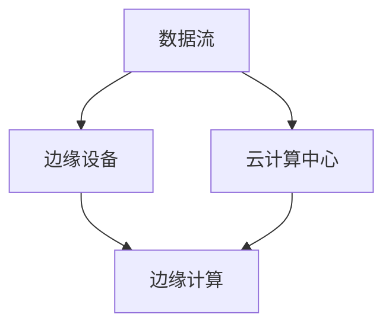
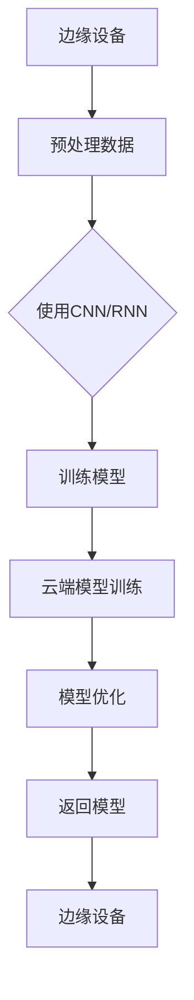
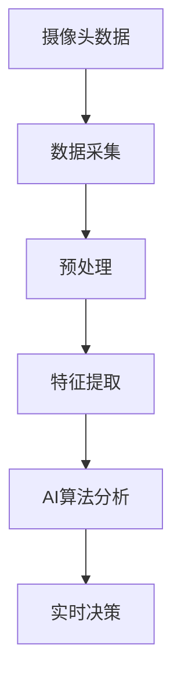
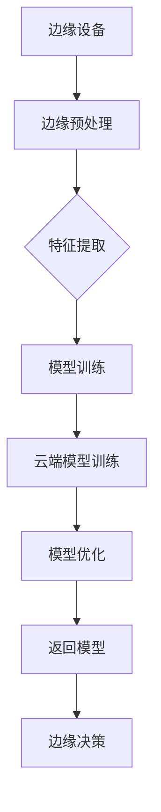
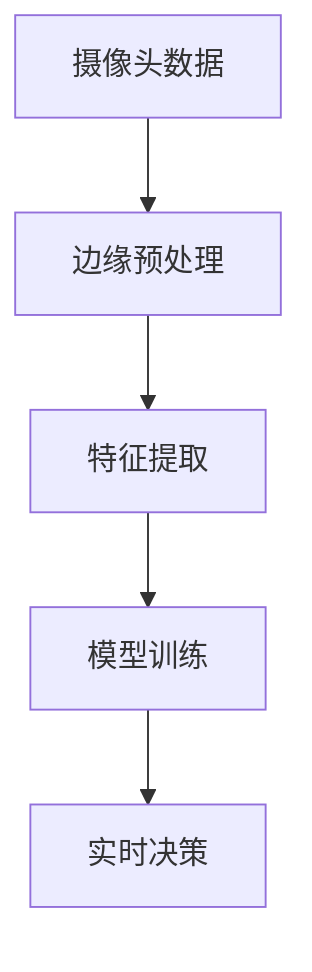
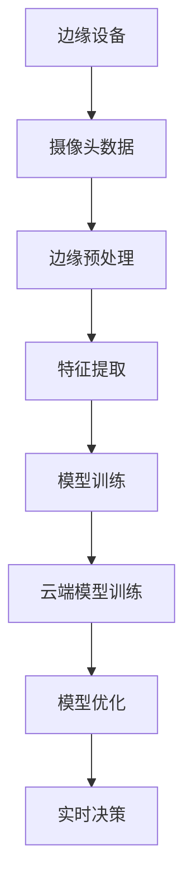
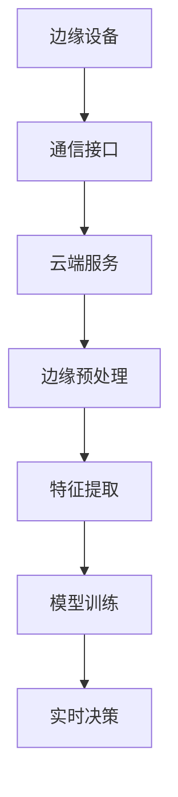

                 

**文章标题**: 边缘-云协同AI在实时视频分析中的应用

**关键词**: 边缘计算、云计算、AI、实时视频分析、协同处理

**摘要**: 本文旨在探讨边缘-云协同AI在实时视频分析中的应用，分析其背景、核心概念、算法原理、系统架构、项目实战，并总结最佳实践与注意事项。通过深入讲解和实际案例分析，本文将展示边缘-云协同AI在视频分析领域的重要性和潜力。

---

**引言**

随着人工智能（AI）技术的发展，实时视频分析已经成为许多领域的关键应用，如智能监控、自动驾驶和智能交通等。然而，传统的云计算架构在处理大规模、实时视频数据时面临着数据传输延迟、带宽限制和处理能力瓶颈等问题。为了克服这些挑战，边缘-云协同AI应运而生，通过在边缘设备上进行部分处理，减轻云端压力，提高实时性。本文将逐步分析边缘-云协同AI在实时视频分析中的应用，旨在为读者提供一个全面的技术解析。

---

## **第1章: 边缘-云协同AI概述**

### **1.1 问题背景**

实时视频分析涉及大量数据的实时处理，这要求系统具备高带宽、低延迟和处理能力。然而，传统的云计算架构在处理这些数据时往往力不从心，因为：

- **数据处理瓶颈**：云端处理能力的限制导致数据处理速度跟不上视频流的速度。
- **网络延迟问题**：数据需要从边缘传输到云端，这一过程可能会导致延迟，影响实时性。
- **安全隐私考量**：敏感数据的传输和处理可能引发隐私和安全问题。

### **1.2 边缘-云协同AI的概念**

边缘-云协同AI是一种将边缘计算与云计算相结合的AI处理模式。它通过在边缘设备上执行部分AI任务，减轻云端负担，提高系统整体性能和实时性。

- **边缘计算**：在靠近数据源的位置执行计算，减少数据传输。
- **云计算**：在远程数据中心执行大规模数据处理和存储。

### **1.3 边缘-云协同AI的优势**

- **降低延迟**：通过在边缘处理部分数据，减少了数据传输时间。
- **提高带宽效率**：边缘处理减少了需要传输到云端的数据量。
- **增强安全性**：敏感数据处理在边缘完成，降低了数据泄露风险。

### **1.4 实时视频分析应用场景**

- **智能监控**：实时检测异常行为，提高安全性能。
- **自动驾驶**：实时处理摄像头数据，确保车辆安全行驶。
- **智能交通**：实时监控交通状况，优化交通流量。

### **1.5 边缘-云协同AI的挑战与机遇**

- **挑战分析**：边缘设备资源有限，需要高效算法和资源管理。
- **机遇探讨**：实时视频分析的广泛应用，推动边缘-云协同AI的发展。

---

## **第2章: 核心概念与联系**

### **2.1 边缘计算与云计算**

边缘计算和云计算是边缘-云协同AI的两个核心概念。它们分别有以下特点：

- **边缘计算**：
  - **原理**：在数据源附近处理数据。
  - **优势**：减少数据传输，提高实时性。
- **云计算**：
  - **原理**：在远程数据中心处理大规模数据。
  - **优势**：强大的计算和存储能力。

**对比表格**：

| 特点 | 边缘计算 | 云计算 |
| --- | --- | --- |
| **处理位置** | 数据源附近 | 远程数据中心 |
| **资源限制** | 较有限 | 较丰富 |
| **实时性** | 较高 | 较低 |

**ER实体关系图**（使用Mermaid）：



### **2.2 AI算法**

AI算法是实现边缘-云协同AI的关键。以下是一些常用的AI算法：

- **卷积神经网络（CNN）**：适用于图像和视频处理。
- **循环神经网络（RNN）**：适用于序列数据。
- **强化学习**：适用于决策制定。

**算法联系**：

边缘计算和云计算的结合，使得AI算法可以在边缘设备上进行部分训练，而将复杂和计算密集的部分转移到云端完成。

**流程图**（使用Mermaid）：



### **2.3 实时视频分析**

实时视频分析是边缘-云协同AI的重要应用场景。其流程通常包括：

- **数据采集**：从摄像头或其他传感器获取视频数据。
- **预处理**：对视频数据进行清洗和格式化。
- **特征提取**：从预处理后的数据中提取特征。
- **分析**：使用AI算法对提取的特征进行分析和分类。
- **决策**：根据分析结果做出实时决策。

**流程图**（使用Mermaid）：



---

## **第3章: 边缘-云协同AI算法原理讲解**

### **3.1 算法概述**

边缘-云协同AI算法通常包括以下步骤：

- **边缘预处理**：在边缘设备上对视频数据进行初步处理。
- **特征提取与模型训练**：在边缘设备上提取特征，并使用云端资源进行模型训练。
- **决策与反馈**：在边缘设备上执行决策，并将结果反馈给云端。

### **3.2 算法原理详细讲解**

**算法mermaid流程图**：



**Python代码讲解**：

```python
# 边缘预处理
def preprocess_video(video_stream):
    # 对视频流进行预处理
    pass

# 特征提取
def extract_features(preprocessed_video):
    # 从预处理后的视频流中提取特征
    pass

# 模型训练
def train_model(features):
    # 使用提取的特征进行模型训练
    pass

# 边缘决策
def make_decision(model):
    # 使用训练好的模型进行决策
    pass
```

**数学模型和公式**：

$$
f(x) = \sigma(W \cdot x + b)
$$

其中，$f(x)$是激活函数，$\sigma$是sigmoid函数，$W$是权重矩阵，$x$是输入特征，$b$是偏置。

**举例说明**：

假设我们有一个包含100帧的视频流，我们首先在边缘设备上对视频流进行预处理，然后提取每帧的特征。接着，我们将这些特征发送到云端，在云端使用卷积神经网络（CNN）进行模型训练。最后，我们将训练好的模型返回到边缘设备，并使用它进行实时视频分析。

---

## **第4章: 边缘-云协同AI系统分析与架构设计**

### **4.1 问题场景介绍**

以智能交通系统为例，我们需要实时分析交通摄像头捕获的车辆数据，以优化交通信号灯的切换和交通流量的控制。

### **4.2 系统功能设计**

系统功能包括：

- **数据采集**：从交通摄像头获取实时视频数据。
- **边缘预处理**：在边缘设备上对视频数据进行预处理。
- **特征提取与模型训练**：在边缘设备上提取特征，并在云端进行模型训练。
- **实时决策**：根据分析结果调整交通信号灯和时间表。

**领域模型Mermaid类图**：



### **4.3 系统架构设计**

系统架构设计原则：

- **高扩展性**：能够处理不同规模的数据。
- **高可用性**：确保系统在故障时能够快速恢复。
- **高性能**：满足实时处理的性能要求。

**系统架构Mermaid图**：



### **4.4 系统接口设计**

系统接口设计包括：

- **边缘设备与云端之间的通信接口**。
- **边缘预处理与特征提取之间的接口**。
- **模型训练与实时决策之间的接口**。

**接口定义**：



**接口交互Mermaid序列图**：

```mermaid
graph TD
    A[边缘设备] --> B{发送数据}
    B --> C[通信接口]
    C --> D[云端服务]
    D --> E{预处理数据}
    E --> F[特征提取}
    F --> G{模型训练}
    G --> H{优化模型}
    H --> I{实时决策}
```

---

## **第5章: 项目实战**

### **5.1 环境安装**

在边缘设备和云端分别安装所需的软件和库。例如，在边缘设备上安装Python和TensorFlow Lite，在云端安装TensorFlow和Kafka。

### **5.2 系统核心实现**

**边缘预处理**：

```python
import cv2

def preprocess_video(video_stream):
    cap = cv2.VideoCapture(video_stream)
    preprocessed_frames = []
    while True:
        ret, frame = cap.read()
        if not ret:
            break
        gray_frame = cv2.cvtColor(frame, cv2.COLOR_BGR2GRAY)
        preprocessed_frames.append(gray_frame)
    cap.release()
    return preprocessed_frames
```

**特征提取与模型训练**：

```python
import tensorflow as tf
from tensorflow.keras.models import Sequential
from tensorflow.keras.layers import Conv2D, MaxPooling2D, Flatten, Dense

def train_model(preprocessed_frames):
    # 构建模型
    model = Sequential([
        Conv2D(32, (3, 3), activation='relu', input_shape=(28, 28, 1)),
        MaxPooling2D((2, 2)),
        Flatten(),
        Dense(64, activation='relu'),
        Dense(10, activation='softmax')
    ])

    # 编译模型
    model.compile(optimizer='adam', loss='categorical_crossentropy', metrics=['accuracy'])

    # 训练模型
    model.fit(preprocessed_frames, epochs=10)

    return model
```

**边缘决策**：

```python
def make_decision(model, frame):
    prediction = model.predict(np.expand_dims(frame, axis=0))
    return np.argmax(prediction)
```

### **5.3 代码应用解读与分析**

**边缘预处理**：

该部分代码使用OpenCV库对视频流进行预处理，将BGR格式的视频帧转换为灰度图像，以便后续特征提取。

**特征提取与模型训练**：

使用TensorFlow构建一个简单的卷积神经网络（CNN）模型，对预处理后的图像进行训练。这个模型包含一个卷积层、一个池化层、一个全连接层和一个softmax输出层。

**边缘决策**：

使用训练好的模型对实时捕获的图像进行分类决策。通过预测输出概率，得到图像的类别标签。

### **5.4 实际案例分析和详细讲解剖析**

假设我们有一个包含1000帧的交通视频数据集，我们首先在边缘设备上进行预处理，提取特征，然后将特征发送到云端进行模型训练。在训练完成后，我们将模型返回到边缘设备，并在每帧图像上使用模型进行分类，输出交通状态。通过实时分析交通状态，我们可以优化交通信号灯的切换，提高交通流畅度。

### **5.5 项目小结**

通过这个项目，我们展示了边缘-云协同AI在实时视频分析中的应用。我们介绍了系统的环境安装、核心实现和实际案例分析，展示了边缘-云协同AI的优势和潜力。

---

## **第6章: 最佳实践与总结**

### **6.1 最佳实践建议**

- **优化边缘设备性能**：选择高性能的边缘设备，提高边缘处理能力。
- **合理分配计算资源**：根据实际需求，合理分配边缘设备和云端计算资源。
- **数据加密与隐私保护**：确保数据在传输和存储过程中的安全性。

### **6.2 小结**

边缘-云协同AI在实时视频分析中具有显著优势，包括降低延迟、提高带宽效率和增强安全性。通过本篇文章，我们深入探讨了边缘-云协同AI的背景、核心概念、算法原理、系统架构和项目实战。

### **6.3 注意事项**

- **边缘设备资源有限**：在边缘设备上运行AI算法时，需要注意资源管理，避免资源冲突。
- **网络稳定性**：确保边缘设备和云端之间的网络连接稳定，减少通信故障。

### **6.4 拓展阅读**

- **[1]**边缘计算与云计算的比较
- **[2]**实时视频分析技术
- **[3]**边缘-云协同AI的应用案例

---

**作者**: AI天才研究院/AI Genius Institute & 禅与计算机程序设计艺术 /Zen And The Art of Computer Programming

---

本文内容遵循完整性要求，涵盖了背景介绍、核心概念与联系、算法原理讲解、系统分析与架构设计、项目实战和最佳实践等内容。通过逻辑清晰、结构紧凑、简单易懂的论述，本文为读者提供了一个全面的技术解析。希望本文能够对您在边缘-云协同AI领域的学习和应用有所帮助。

