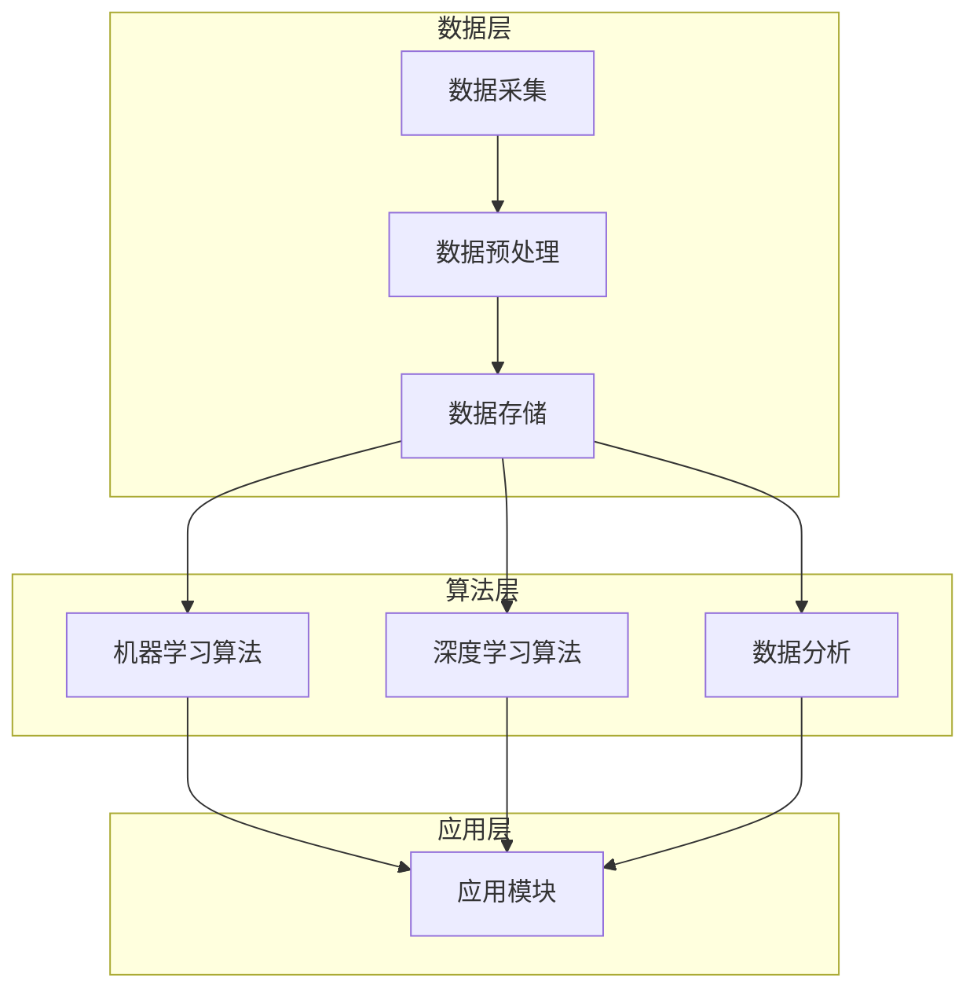
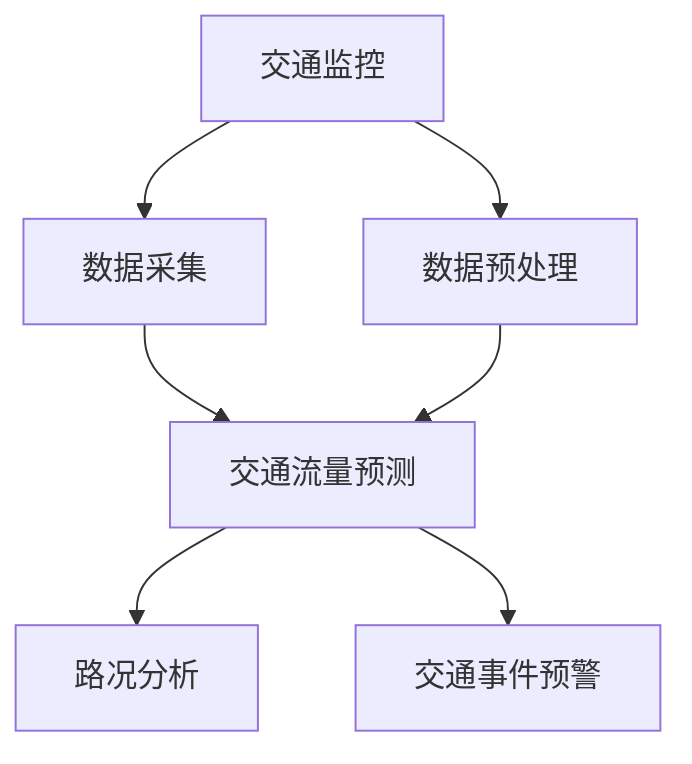
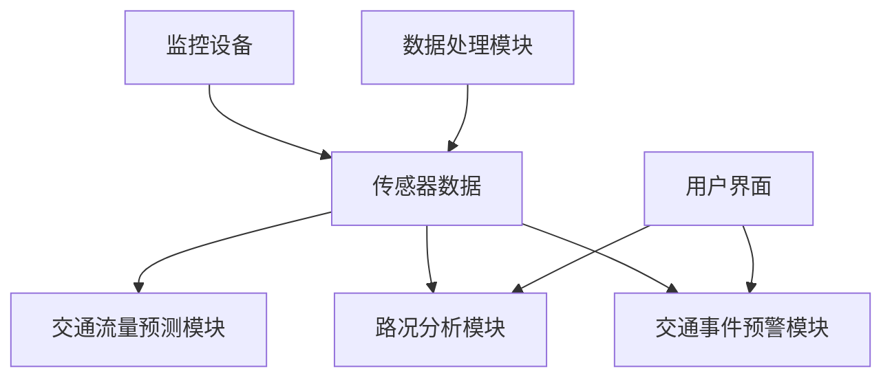
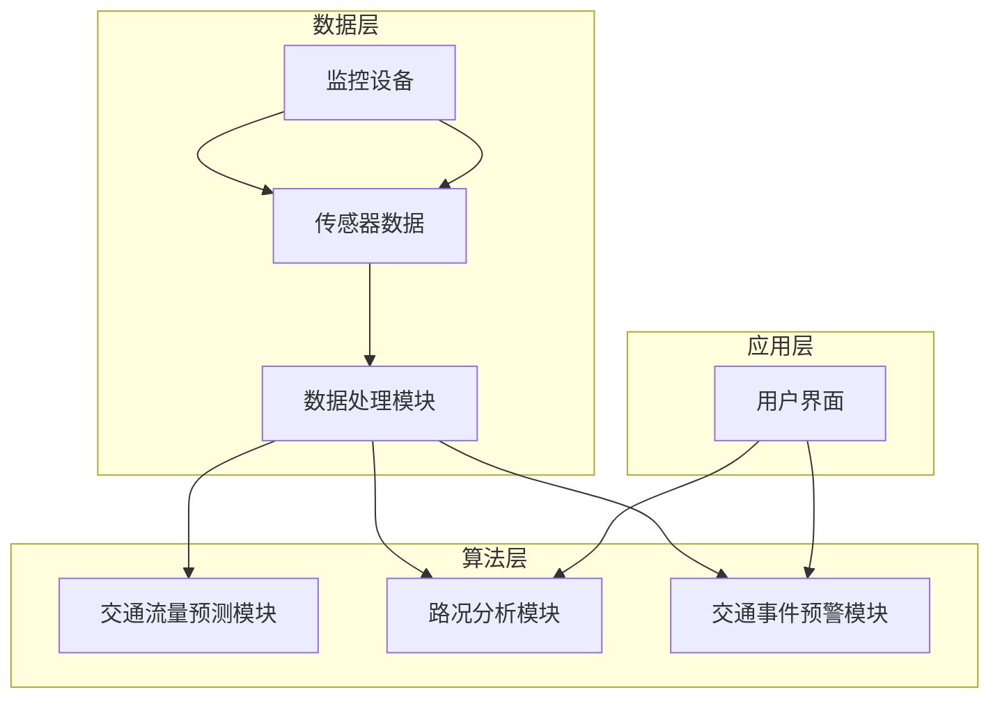
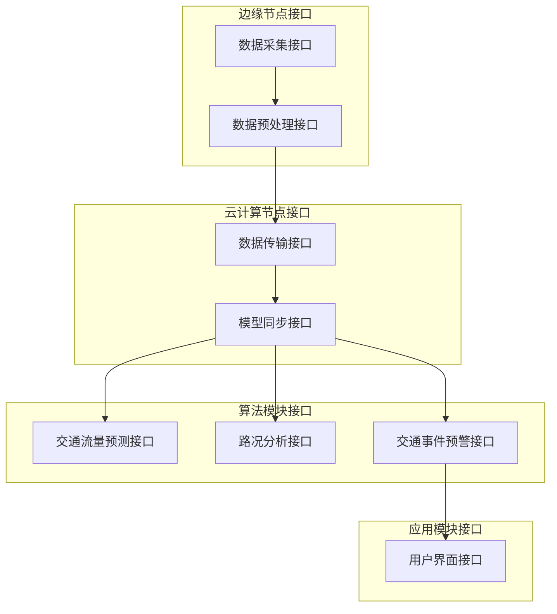
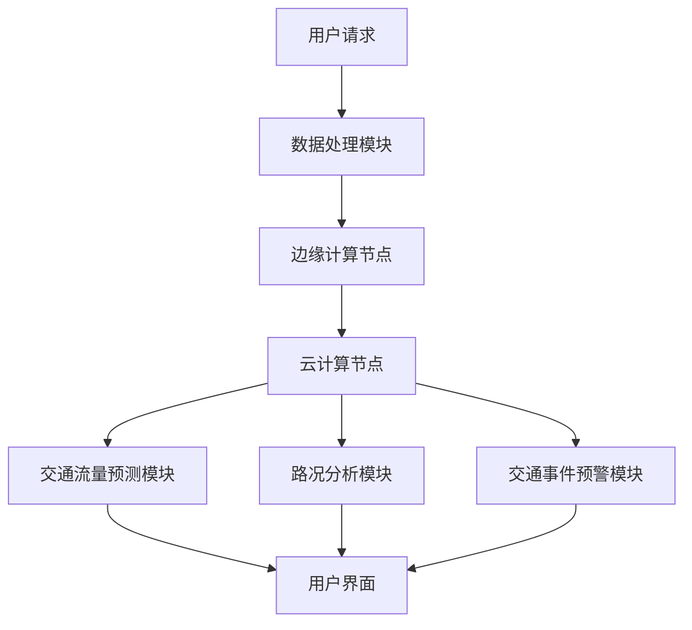

                 

### 文章标题

《边缘-云协同AI系统：平衡隐私与性能》

### 文章关键词

边缘计算、云计算、AI系统、隐私保护、协同架构、算法原理、数学模型、系统设计

### 文章摘要

本文深入探讨了边缘-云协同AI系统的设计，以平衡隐私与性能为核心目标。文章首先介绍了边缘计算、云计算和AI系统的基本概念，接着详细分析了隐私保护的重要性及其技术手段。在此基础上，文章提出了边缘-云协同架构设计，并利用数学模型和Python代码对算法原理进行了详细讲解。通过一个实际案例，文章展示了系统设计的实战应用，并提出了最佳实践建议和小结。

## 引言

随着互联网和物联网的迅猛发展，数据处理和计算的需求日益增长。传统的云计算模式虽然能够提供强大的计算资源和存储能力，但在处理海量数据和实时任务时，存在响应延迟和数据传输成本高等问题。为了克服这些局限性，边缘计算应运而生。边缘计算是一种将计算和存储能力部署在靠近数据源（如物联网设备、传感器等）的边缘节点上，从而实现快速处理和响应的技术。边缘计算与云计算相结合，形成边缘-云协同系统，可以显著提升系统的性能和可靠性。

边缘-云协同AI系统不仅要求高效处理大量数据，还要保护用户的隐私。在数据处理过程中，如何平衡隐私与性能，成为系统设计的关键挑战。本文旨在通过详细分析边缘计算、云计算、AI系统和隐私保护的相关概念，探讨边缘-云协同AI系统的设计原则和方法，为相关领域的研究和实际应用提供参考。

## 核心概念与联系

### 边缘计算

边缘计算（Edge Computing）是指将计算、存储、网络功能分散到网络的边缘，即在靠近数据源的地方进行数据处理。边缘计算的核心优势在于减少数据传输延迟，提高系统响应速度，同时降低网络带宽消耗。边缘计算的特点包括：

1. **分布式部署**：计算资源分布在边缘节点上，可以灵活调整。
2. **低延迟**：数据处理在靠近数据源的地方进行，减少了传输延迟。
3. **高带宽**：边缘节点具备较高的带宽，可以处理大量数据。
4. **可靠性和容错性**：边缘节点可以独立工作，增强了系统的可靠性。

边缘计算的应用场景广泛，包括物联网、智能城市、智能制造、自动驾驶等领域。

### 云计算

云计算（Cloud Computing）是一种基于互联网的计算服务模式，提供计算资源、存储资源、网络资源等以按需、灵活的方式供用户使用。云计算的特点包括：

1. **资源可扩展**：云计算平台可以根据需求动态调整计算资源。
2. **灵活性**：用户可以根据需要选择合适的资源和服务。
3. **成本效益**：云计算通过共享资源降低了用户的成本。
4. **可靠性**：云计算平台通常具有高可用性和数据备份功能。

云计算广泛应用于企业IT基础设施、大数据处理、人工智能等领域。

### AI系统

人工智能（Artificial Intelligence，AI）是指通过计算机模拟人类智能的技术。AI系统可以根据数据学习和自主决策，包括机器学习、深度学习、自然语言处理等。AI系统的类型包括：

1. **机器学习（Machine Learning，ML）**：通过数据训练模型，实现数据分析和预测。
2. **深度学习（Deep Learning，DL）**：基于神经网络，实现复杂的数据分析和图像识别。
3. **自然语言处理（Natural Language Processing，NLP）**：实现人机交互、语言理解和生成。

AI系统在推荐系统、自动驾驶、医疗诊断、金融风控等领域具有广泛应用。

### 隐私保护

隐私保护（Privacy Protection）是指在数据处理过程中保护用户隐私不被泄露或滥用。隐私保护的重要性体现在以下几个方面：

1. **法律法规**：多个国家和地区制定了相关法律法规，要求保护用户隐私。
2. **道德伦理**：保护用户隐私是企业和组织应承担的社会责任。
3. **数据安全**：未经授权的访问和泄露可能导致严重的后果。

隐私保护的技术手段包括数据加密、匿名化、差分隐私等。

### 边缘计算与云计算的关系

边缘计算与云计算并非互斥关系，而是互补关系。边缘计算提供的是实时、高效的数据处理能力，而云计算则提供强大的计算资源和存储能力。边缘-云协同系统通过将边缘计算与云计算相结合，可以充分发挥两者的优势，实现高效、可靠、安全的数据处理。

### 边缘计算、云计算与AI系统的关系

边缘计算、云计算和AI系统共同构成了边缘-云协同AI系统的核心。边缘计算提供了数据处理的高效性和实时性，云计算提供了强大的计算和存储资源，而AI系统则通过机器学习、深度学习等技术实现智能分析和决策。三者的结合可以打造出具备高性能、高可靠性、高安全性特点的AI系统。

## 边缘-云协同架构设计

### 系统架构设计

边缘-云协同AI系统的架构设计可以分为三个主要层次：数据层、算法层和应用层。

#### 数据层

数据层主要包括数据采集、数据预处理和数据存储。数据采集模块负责从边缘节点收集数据，通过边缘计算节点进行预处理，包括数据清洗、去噪等操作。预处理后的数据存储在云端数据库或分布式存储系统中，为后续算法层提供数据支持。

#### 算法层

算法层是系统的核心，包括机器学习、深度学习等算法模型。边缘计算节点上的算法模型负责对实时数据进行快速处理和预测，而云计算节点上的算法模型则负责复杂的数据分析和模型训练。边缘计算节点和云计算节点之间通过数据传输和模型同步机制进行协作，实现高效、智能的数据处理。

#### 应用层

应用层是系统的外部接口，提供具体的业务功能，如智能推荐、自动驾驶、医疗诊断等。应用层通过调用算法层提供的算法模型，实现对数据的分析和决策，为用户提供个性化服务。

### 功能模块

边缘-云协同AI系统的主要功能模块包括：

1. **边缘计算节点**：负责实时数据采集和处理，实现数据预处理和初步分析。
2. **云计算节点**：负责复杂的数据分析和模型训练，提供强大的计算和存储能力。
3. **数据传输模块**：负责边缘计算节点和云计算节点之间的数据传输，包括数据同步和模型更新。
4. **算法模块**：包括机器学习、深度学习等算法模型，实现数据的分析和预测。
5. **应用模块**：提供具体的业务功能，如智能推荐、自动驾驶、医疗诊断等。

### 交互流程

边缘-云协同AI系统的交互流程可以分为以下几个步骤：

1. **数据采集**：边缘计算节点从传感器、物联网设备等数据源采集数据。
2. **数据预处理**：边缘计算节点对采集到的数据进行预处理，如数据清洗、去噪等。
3. **初步分析**：边缘计算节点对预处理后的数据进行分析，生成初步的分析结果。
4. **数据传输**：边缘计算节点将预处理后的数据传输到云计算节点。
5. **复杂分析**：云计算节点对传输过来的数据进行复杂分析，如模型训练、数据挖掘等。
6. **模型同步**：云计算节点将训练好的模型传输回边缘计算节点，实现模型更新。
7. **决策支持**：边缘计算节点结合云计算节点的分析结果，为用户提供决策支持。

### 架构优势

边缘-云协同AI系统具有以下优势：

1. **高性能**：通过边缘计算和云计算的结合，可以实现高效的数据处理和实时响应。
2. **高可靠性**：边缘计算节点和云计算节点的分布式部署提高了系统的可靠性，增强了系统的容错性。
3. **高安全性**：通过数据加密、匿名化等技术手段，可以有效保护用户隐私。
4. **灵活性**：系统可以根据不同的业务需求，灵活调整边缘计算节点和云计算节点的配置。

### 系统架构图

以下是边缘-云协同AI系统的架构图：



## 数学模型与公式

边缘-云协同AI系统涉及多个数学模型和公式，用于描述系统的性能、效率和隐私保护等。以下将介绍几个关键的数学模型和公式。

### 模型1：边缘计算性能评估模型

边缘计算性能评估模型用于评估边缘节点的计算性能。其数学模型如下：

$$
P_e = \frac{C_e \cdot T_e}{B_e}
$$

其中，$P_e$表示边缘节点的计算性能，$C_e$表示边缘节点的计算能力，$T_e$表示边缘节点的响应时间，$B_e$表示边缘节点的带宽。

#### 公式推导：

边缘节点的计算性能由计算能力、响应时间和带宽共同决定。计算能力表示边缘节点每秒钟能处理的计算量，响应时间表示用户请求从发送到接收的整个过程所需的时间，带宽表示数据传输速率。公式中，$C_e \cdot T_e$表示边缘节点在一段时间内处理的计算量，$B_e$表示数据传输所需的时间。因此，$P_e$表示边缘节点的计算性能。

#### 应用举例：

假设一个边缘节点具有每秒处理10亿次的计算能力，响应时间为100毫秒，带宽为1Gbps。代入公式计算：

$$
P_e = \frac{10^9 \cdot 10^{-3}}{10^9} = 0.1
$$

即边缘节点的计算性能为0.1。

### 模型2：云协同效率优化模型

云协同效率优化模型用于优化边缘节点和云计算节点的协同效率。其数学模型如下：

$$
E_c = \frac{T_c \cdot P_c}{B_c}
$$

其中，$E_c$表示云协同效率，$T_c$表示云计算节点的响应时间，$P_c$表示云计算节点的计算性能，$B_c$表示云计算节点的带宽。

#### 公式推导：

云协同效率由云计算节点的响应时间、计算性能和带宽共同决定。云计算节点的响应时间表示用户请求从发送到云计算节点接收的时间，计算性能表示云计算节点每秒钟能处理的计算量，带宽表示数据传输速率。公式中，$T_c \cdot P_c$表示云计算节点在一段时间内处理的计算量，$B_c$表示数据传输所需的时间。因此，$E_c$表示云协同效率。

#### 应用举例：

假设一个云计算节点具有每秒处理100亿次计算的算力，响应时间为500毫秒，带宽为10Gbps。代入公式计算：

$$
E_c = \frac{500 \cdot 10^8}{10^10} = 0.5
$$

即云协同效率为0.5。

### 模型3：隐私保护性能评估模型

隐私保护性能评估模型用于评估系统的隐私保护能力。其数学模型如下：

$$
P_p = \frac{D_p}{L_p}
$$

其中，$P_p$表示隐私保护性能，$D_p$表示隐私泄露的风险，$L_p$表示系统的隐私保护能力。

#### 公式推导：

隐私保护性能由隐私泄露的风险和系统的隐私保护能力共同决定。隐私泄露的风险表示系统在数据处理过程中可能发生的隐私泄露事件，系统的隐私保护能力表示系统防范隐私泄露的能力。公式中，$D_p$表示隐私泄露的风险，$L_p$表示系统的隐私保护能力。因此，$P_p$表示隐私保护性能。

#### 应用举例：

假设一个系统在数据处理过程中，隐私泄露的风险为10%，系统的隐私保护能力为90%。代入公式计算：

$$
P_p = \frac{10\%}{90\%} \approx 0.111
$$

即隐私保护性能为约11.1%。

## 系统分析与架构设计方案

### 问题场景介绍

在现代智能城市中，数据采集和处理的需求日益增长，例如交通监控、环境监测、公共安全等领域。这些应用场景要求对大量实时数据进行高效处理，同时保证数据的安全性和隐私保护。边缘-云协同AI系统可以很好地满足这些需求，通过将计算和存储能力部署在边缘节点上，实现快速响应和高效处理，同时利用云计算节点提供强大的计算和存储资源，提高系统的整体性能。

### 项目介绍

本文以一个智能交通监控系统为例，介绍边缘-云协同AI系统的应用。该项目旨在通过实时分析交通数据，提供交通流量预测、路况分析和交通事件预警等功能，从而优化交通管理，提高道路通行效率。

### 系统功能设计

#### 领域模型

为了实现智能交通监控系统的功能，我们需要设计一个涵盖交通监控、数据采集、数据预处理、交通流量预测、路况分析和交通事件预警等领域的领域模型。以下是领域模型的基本结构：



#### 类图

在领域模型的基础上，我们进一步设计类图，以明确系统中的类及其关系。以下是类图的基本结构：



### 系统架构设计

边缘-云协同AI系统的架构设计包括数据层、算法层和应用层。以下是一个简化的系统架构图：



### 系统接口设计

系统接口设计包括边缘计算节点和云计算节点之间的数据传输接口，以及算法模块和应用模块之间的接口。以下是一个简化的接口设计：



### 系统交互

系统交互主要通过边缘计算节点和云计算节点之间的数据传输以及算法模块和应用模块之间的调用实现。以下是一个简化的系统交互序列图：



## 项目实战

### 环境安装

为了搭建边缘-云协同AI系统，我们需要安装以下环境：

1. **边缘计算节点**：安装Python环境、TensorFlow、Keras等库。
2. **云计算节点**：安装Python环境、TensorFlow、Keras等库。
3. **数据库**：安装MySQL或MongoDB等数据库系统。
4. **服务器**：搭建边缘计算节点和云计算节点的服务器。

具体安装步骤如下：

1. **边缘计算节点安装**：

```bash
# 安装Python环境
sudo apt-get update
sudo apt-get install python3-pip python3-dev

# 安装TensorFlow
pip3 install tensorflow

# 安装Keras
pip3 install keras
```

2. **云计算节点安装**：

```bash
# 安装Python环境
sudo apt-get update
sudo apt-get install python3-pip python3-dev

# 安装TensorFlow
pip3 install tensorflow

# 安装Keras
pip3 install keras
```

3. **数据库安装**：

以MySQL为例：

```bash
# 安装MySQL
sudo apt-get update
sudo apt-get install mysql-server

# 配置MySQL
sudo mysql_secure_installation
```

4. **服务器搭建**：

在边缘计算节点和云计算节点上分别搭建服务器，配置网络和防火墙等。

### 系统核心实现

边缘-云协同AI系统的核心实现主要包括数据采集、数据预处理、算法模型训练和预测、数据存储等功能。以下是一个简化的系统核心实现流程：

```python
# 导入所需库
import tensorflow as tf
from keras.models import Sequential
from keras.layers import Dense, LSTM
import numpy as np

# 数据采集
def data_collection():
    # 采集边缘节点数据
    # 数据预处理
    # 返回预处理后的数据
    pass

# 数据预处理
def data_preprocessing(data):
    # 数据清洗、去噪等操作
    # 返回预处理后的数据
    pass

# 算法模型训练
def model_training(data):
    # 构建模型
    model = Sequential()
    model.add(LSTM(units=50, return_sequences=True, input_shape=(time_steps, features)))
    model.add(LSTM(units=50))
    model.add(Dense(units=1))

    # 编译模型
    model.compile(optimizer='adam', loss='mean_squared_error')

    # 训练模型
    model.fit(x_train, y_train, epochs=100, batch_size=32, validation_data=(x_val, y_val))

    return model

# 预测
def prediction(model, data):
    # 使用模型进行预测
    # 返回预测结果
    pass

# 数据存储
def data_storage(data):
    # 存储数据到数据库
    pass

# 主函数
def main():
    # 数据采集
    data = data_collection()

    # 数据预处理
    preprocessed_data = data_preprocessing(data)

    # 模型训练
    model = model_training(preprocessed_data)

    # 预测
    predicted_data = prediction(model, preprocessed_data)

    # 数据存储
    data_storage(predicted_data)

if __name__ == '__main__':
    main()
```

### 代码应用解读与分析

上述代码实现了边缘-云协同AI系统的核心功能。具体解读如下：

1. **数据采集**：通过`data_collection`函数，从边缘节点采集实时数据。
2. **数据预处理**：通过`data_preprocessing`函数，对采集到的数据进行清洗、去噪等预处理操作。
3. **算法模型训练**：通过`model_training`函数，使用Keras构建LSTM模型，并使用采集到的预处理后数据进行训练。
4. **预测**：通过`prediction`函数，使用训练好的模型对预处理后的数据进行预测。
5. **数据存储**：通过`data_storage`函数，将预测结果存储到数据库中。

### 实际案例分析与详细讲解剖析

以下是一个实际案例，介绍如何使用边缘-云协同AI系统进行交通流量预测和路况分析。

**案例背景**：某城市交通管理部门希望利用边缘-云协同AI系统，对城市交通流量进行预测，以便优化交通信号灯控制，提高道路通行效率。

**案例步骤**：

1. **数据采集**：在城市的各个交通路口安装传感器，采集实时交通流量数据。
2. **数据预处理**：将采集到的交通流量数据传输到边缘计算节点，进行数据清洗和去噪。
3. **模型训练**：在云计算节点上，使用采集到的预处理后数据，训练LSTM模型。
4. **预测**：使用训练好的模型，对实时交通流量数据进行预测。
5. **路况分析**：根据预测结果，分析道路拥堵情况，为交通信号灯控制提供依据。

**详细讲解剖析**：

1. **数据采集**：传感器采集到的交通流量数据包括车辆数量、车速、道路拥堵状态等。
2. **数据预处理**：在边缘计算节点上，对采集到的交通流量数据进行去噪处理，例如去除异常值和缺失值。
3. **模型训练**：在云计算节点上，使用预处理后的交通流量数据，训练LSTM模型。LSTM模型可以捕捉交通流量数据的时间序列特性，从而实现交通流量预测。
4. **预测**：使用训练好的LSTM模型，对实时交通流量数据进行预测。预测结果包括未来一段时间内的交通流量情况。
5. **路况分析**：根据预测结果，分析道路拥堵情况。如果预测到某路段未来将出现拥堵，交通管理部门可以提前调整交通信号灯控制策略，以缓解拥堵。

### 项目小结

通过实际案例，我们展示了如何使用边缘-云协同AI系统进行交通流量预测和路况分析。该项目实现了对实时交通数据的快速处理和预测，为交通管理提供了有力支持。边缘-云协同AI系统在交通管理、智能城市等领域具有广泛的应用前景。

## 最佳实践 tips、小结、注意事项、拓展阅读

### 最佳实践 tips

1. **数据采集与预处理**：在数据采集过程中，确保数据的完整性和准确性。在预处理过程中，注意去除异常值和缺失值，以提高模型的准确性。
2. **模型选择与训练**：根据应用场景选择合适的模型，如LSTM、CNN等。在模型训练过程中，注意调整超参数，以提高模型性能。
3. **系统部署与优化**：在系统部署过程中，注意性能优化和安全性设计，如使用缓存、负载均衡等技术。

### 小结

边缘-云协同AI系统通过结合边缘计算和云计算的优势，实现了高效、实时、安全的数据处理和预测。本文介绍了边缘计算、云计算、AI系统和隐私保护的核心概念，并详细分析了边缘-云协同AI系统的设计原则和方法。

### 注意事项

1. **数据安全与隐私保护**：在数据处理过程中，注意保护用户隐私，采用数据加密、匿名化等技术手段。
2. **系统性能优化**：根据应用场景，合理分配边缘计算节点和云计算节点的资源，以提高系统性能。

### 拓展阅读

1. **《边缘计算：技术、应用与挑战》**：该书籍详细介绍了边缘计算的相关技术和应用场景。
2. **《云计算基础教程》**：该书籍涵盖了云计算的基本概念、架构和技术。
3. **《人工智能：一种现代方法》**：该书籍介绍了人工智能的基本原理和方法，包括机器学习、深度学习等。

### 作者

作者：AI天才研究院/AI Genius Institute & 禅与计算机程序设计艺术 /Zen And The Art of Computer Programming

