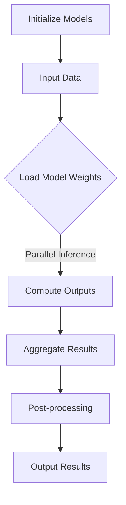

                 

# 边缘计算中的联合推理技术与隐私保护

## 关键词
边缘计算、联合推理技术、隐私保护、分布式计算、人工智能、深度学习、网络安全

## 摘要
本文将深入探讨边缘计算中的联合推理技术与隐私保护问题。首先，我们将简要介绍边缘计算和联合推理技术的背景及核心概念。随后，本文将分析隐私保护在边缘计算中的重要性，并探讨如何结合联合推理技术实现隐私保护。接着，我们将详细解释联合推理技术的算法原理，并通过数学模型和公式来阐述其工作机制。此外，本文还将介绍边缘计算中的隐私保护技术，包括系统架构和最佳实践。最后，我们将通过实际案例研究来展示如何将联合推理技术与隐私保护技术应用于实际场景，并提出未来发展的展望和拓展阅读建议。

---

## 第1章：边缘计算与联合推理技术概述

### 1.1 边缘计算背景

#### 1.1.1 问题描述
随着物联网、大数据和人工智能等技术的发展，数据的产生和处理速度显著加快。然而，传统的集中式数据处理方式在应对海量数据时显得力不从心，特别是在网络延迟和带宽受限的场景中。边缘计算应运而生，它通过在网络边缘部署计算资源，实现了数据在靠近数据源头的地方进行处理，从而提高了处理速度和响应时间。

#### 1.1.2 问题解决
边缘计算通过将计算任务从云端转移到网络边缘，降低了数据传输的延迟和带宽消耗，同时也减轻了云端服务器的负担。这种方式特别适合于需要实时处理的场景，如自动驾驶、智能医疗和工业自动化等。

#### 1.1.3 边缘计算的边界与外延
边缘计算不仅包括网络边缘的设备，如智能手机、平板电脑和物联网设备，还包括位于网络边缘的服务器和服务。此外，边缘计算的外延还包括边缘数据库、边缘网络和边缘操作系统等。

#### 1.1.4 边缘计算的核心要素组成
边缘计算的核心要素包括边缘设备、边缘服务器、边缘网络和边缘应用程序。这些要素共同构成了边缘计算的基础设施，为边缘计算提供了必要的硬件和软件支持。

### 1.2 联合推理技术背景

#### 1.2.1 问题描述
深度学习和人工智能的发展使得复杂的机器学习模型在图像识别、自然语言处理和语音识别等领域取得了显著成效。然而，这些模型通常需要大量的计算资源和数据，这在边缘设备上很难实现。因此，如何在小规模计算资源下高效运行这些模型成为了一个挑战。

#### 1.2.2 问题解决
联合推理技术通过将多个推理模型集成到一个系统中，实现了在边缘设备上高效运行复杂模型。这种技术可以减少模型对计算资源和数据存储的需求，从而提高边缘设备的运行效率。

#### 1.2.3 联合推理技术的边界与外延
联合推理技术的应用范围涵盖了多个领域，如自动驾驶、智能制造和智能医疗等。它还涉及模型压缩、模型裁剪和分布式推理等技术。

#### 1.2.4 联合推理技术的核心要素组成
联合推理技术的核心要素包括推理模型、数据集、算法和硬件平台。这些要素共同构成了联合推理技术的核心框架。

### 1.3 边缘计算与联合推理技术的联系

#### 1.3.1 边缘计算与联合推理技术的关系
边缘计算为联合推理技术提供了运行环境，而联合推理技术则为边缘计算提供了高效处理复杂任务的能力。

#### 1.3.2 联合推理技术在边缘计算中的应用
联合推理技术在边缘计算中可以用于实时图像处理、语音识别和自然语言处理等任务，从而提高边缘设备的智能化水平。

#### 1.3.3 边缘计算对联合推理技术的影响
边缘计算的需求推动了联合推理技术的发展，使得联合推理技术能够更好地适应边缘设备的限制条件。

### 1.4 边缘计算中的联合推理技术的核心概念

#### 1.4.1 核心概念原理
联合推理技术通过并行处理和分布式计算，实现了在边缘设备上高效运行复杂机器学习模型。

#### 1.4.2 概念属性特征对比表格

| 特征        | 联合推理技术 | 边缘计算 |
|-------------|---------------|----------|
| 目标        | 高效推理      | 本地数据处理 |
| 应用场景    | 边缘设备      | 网络边缘   |
| 硬件需求    | 低资源要求    | 可扩展性   |
| 软件需求    | 轻量级算法    | 分布式架构 |

#### 1.4.3 ER实体关系图架构

```mermaid
erDiagram
  Device ||--|{ Model }|| Model
  Device ||--|{ Data }|| Data
  Model ||--|{ Algorithm }|| Algorithm
  Data ||--|{ Privacy }|| Privacy
```

### 1.5 边缘计算中的联合推理技术的算法原理

#### 1.5.1 算法原理讲解
联合推理技术的基本原理是将多个独立的推理模型组合成一个整体，通过并行计算和分布式处理来提高推理效率。

#### 1.5.2 算法Mermaid流程图



#### 1.5.3 算法原理的数学模型和公式
联合推理技术的核心数学模型是并行计算和模型聚合。假设有 \(M\) 个模型，每个模型产生一个输出 \(O_i\)，则联合输出 \(O\) 可以通过以下公式计算：

$$
O = \sum_{i=1}^{M} O_i
$$

#### 1.5.4 举例说明
假设我们有两个模型 \(M_1\) 和 \(M_2\)，它们的输出分别为 \(O_{1} = [1, 2, 3]\) 和 \(O_{2} = [4, 5, 6]\)，则联合输出为：

$$
O = [1+4, 2+5, 3+6] = [5, 7, 9]
$$

### 1.6 本章小结
本章介绍了边缘计算和联合推理技术的背景、核心概念和算法原理。边缘计算通过在网络的边缘部署计算资源，提高了数据处理的速度和效率；联合推理技术通过将多个模型集成到一个系统中，实现了在资源受限的边缘设备上高效运行复杂模型。两者结合，为边缘计算提供了强大的技术支持。

---

## 第2章：边缘计算中的隐私保护技术

### 2.1 隐私保护背景

#### 2.1.1 问题描述
随着边缘计算的应用越来越广泛，数据的隐私保护问题变得日益重要。边缘计算中的数据通常包括敏感的用户信息、设备状态和业务数据等，这些数据在传输和处理过程中极易受到网络攻击和泄露。

#### 2.1.2 问题解决
隐私保护技术旨在确保数据在边缘计算中的传输和处理过程中不被未授权访问或泄露。这些技术包括数据加密、访问控制、安全协议和隐私增强技术等。

#### 2.1.3 隐私保护的边界与外延
隐私保护的边界涉及数据的采集、存储、传输和处理等环节。其外延包括数据加密技术、安全协议、隐私计算和联邦学习等。

#### 2.1.4 隐私保护的核心要素组成
隐私保护的核心要素包括数据加密、访问控制、安全审计和隐私计算。这些要素共同构成了隐私保护的技术基础。

### 2.2 边缘计算中的隐私保护技术

#### 2.2.1 数据加密技术
数据加密技术通过对数据进行加密处理，确保数据在传输和存储过程中不被未授权访问。常见的加密算法包括对称加密、非对称加密和哈希算法。

#### 2.2.2 访问控制技术
访问控制技术通过设置访问权限，确保只有授权用户才能访问特定数据。常见的访问控制方法包括基于角色的访问控制（RBAC）和基于属性的访问控制（ABAC）。

#### 2.2.3 安全协议
安全协议是确保数据在传输过程中不被篡改或窃取的技术。常见的安全协议包括SSL/TLS、IPSec和SSH等。

#### 2.2.4 隐私增强技术
隐私增强技术通过对数据进行匿名化、差异化和加扰等处理，增强数据的隐私保护能力。常见的隐私增强技术包括差分隐私、同态加密和联邦学习等。

### 2.3 边缘计算中的隐私保护挑战

#### 2.3.1 资源限制
边缘设备通常具有有限的计算资源和存储空间，这使得传统的隐私保护技术难以在边缘环境中有效应用。

#### 2.3.2 通信带宽
边缘计算中的数据传输通常依赖于有限的通信带宽，这增加了数据泄露的风险。

#### 2.3.3 网络安全
边缘计算中的设备通常分布在广泛的地理区域，这使得网络安全问题更加复杂。

### 2.4 本章小结
本章介绍了边缘计算中的隐私保护技术，包括数据加密、访问控制、安全协议和隐私增强技术等。同时，也分析了边缘计算中的隐私保护挑战，为后续章节讨论如何将隐私保护与边缘计算和联合推理技术相结合提供了基础。

---

## 第3章：边缘计算中的联合推理与隐私保护技术集成

### 3.1 技术集成背景

#### 3.1.1 问题描述
边缘计算中的联合推理技术可以提高边缘设备的智能化水平，但同时也增加了隐私泄露的风险。如何在一个统一的框架下同时实现高效推理和隐私保护成为当前的研究热点。

#### 3.1.2 问题解决
技术集成通过将联合推理技术与隐私保护技术相结合，实现了一体化的解决方案。这种方式可以在不牺牲推理效率的前提下，提供可靠的隐私保护。

#### 3.1.3 技术集成的边界与外延
技术集成的边界涉及联合推理和隐私保护的各个环节，包括数据加密、访问控制、安全协议和隐私计算等。其外延包括分布式系统架构、边缘服务器和边缘设备等。

#### 3.1.4 技术集成的核心要素组成
技术集成的核心要素包括联合推理算法、隐私保护算法和系统架构。这些要素共同构成了技术集成的技术基础。

### 3.2 集成方案设计

#### 3.2.1 系统架构设计
系统架构设计是技术集成的重要环节。一个典型的集成架构包括边缘设备、边缘服务器和云端服务器。边缘设备负责数据采集和初步处理，边缘服务器负责联合推理和隐私保护，云端服务器则负责数据存储和远程控制。

#### 3.2.2 数据流设计
数据流设计是确保数据在系统中安全传输和处理的关键。数据流设计通常包括数据采集、数据传输、数据加密、数据存储和数据访问等环节。

#### 3.2.3 安全协议设计
安全协议设计是确保数据在传输过程中不被篡改或窃取的关键。常见的安全协议包括SSL/TLS、IPSec和SSH等。

#### 3.2.4 隐私计算设计
隐私计算设计是确保数据在处理过程中不被泄露的关键。隐私计算设计通常包括差分隐私、同态加密和联邦学习等技术。

### 3.3 集成方案实现

#### 3.3.1 边缘设备实现
边缘设备实现包括数据采集模块、联合推理模块和隐私保护模块。数据采集模块负责收集传感器数据，联合推理模块负责执行推理任务，隐私保护模块负责对数据进行加密和访问控制。

#### 3.3.2 边缘服务器实现
边缘服务器实现包括边缘推理服务器和边缘隐私保护服务器。边缘推理服务器负责处理来自边缘设备的联合推理请求，边缘隐私保护服务器负责处理隐私保护相关任务。

#### 3.3.3 云端服务器实现
云端服务器实现包括数据存储服务器和远程控制服务器。数据存储服务器负责存储来自边缘设备和边缘服务器的数据，远程控制服务器负责远程监控和管理系统。

### 3.4 本章小结
本章介绍了边缘计算中的联合推理与隐私保护技术集成方案的设计和实现。通过系统架构设计、数据流设计、安全协议设计和隐私计算设计等步骤，实现了一个高效、安全的边缘计算系统。本章的内容为后续章节讨论集成方案的实际应用和案例分析提供了基础。

---

## 第4章：边缘计算中的联合推理与隐私保护技术案例研究

### 4.1 案例背景

#### 4.1.1 问题描述
本案例研究将探讨如何在一个智能交通系统中集成边缘计算、联合推理和隐私保护技术。智能交通系统旨在通过实时交通数据分析和预测，优化交通流量，提高道路使用效率。

#### 4.1.2 问题解决
通过集成边缘计算、联合推理和隐私保护技术，智能交通系统可以在确保数据隐私的同时，实现高效的交通流量预测和优化。

#### 4.1.3 案例场景
本案例的情景是一个城市交通网络，包括多个交通传感器、摄像头和智能车辆。交通传感器和摄像头分布在城市的各个角落，收集实时交通数据。

### 4.2 系统功能设计

#### 4.2.1 数据采集与预处理
数据采集与预处理模块负责从交通传感器和摄像头收集实时交通数据，并进行数据清洗和格式化处理。

#### 4.2.2 边缘推理
边缘推理模块在边缘设备上运行，通过联合推理技术对交通数据进行实时分析，预测交通流量和交通事件。

#### 4.2.3 隐私保护
隐私保护模块通过加密和访问控制技术，确保交通数据在传输和处理过程中的安全性。

#### 4.2.4 交通流量优化
交通流量优化模块根据边缘推理结果，制定交通流量管理策略，如信号灯控制、车道指引和交通调度等。

### 4.3 系统架构设计

#### 4.3.1 边缘设备架构
边缘设备包括传感器、摄像头和边缘服务器。传感器和摄像头负责数据采集，边缘服务器负责边缘推理和隐私保护。

#### 4.3.2 边缘服务器架构
边缘服务器包括边缘推理服务器和边缘隐私保护服务器。边缘推理服务器负责处理联合推理任务，边缘隐私保护服务器负责数据加密和访问控制。

#### 4.3.3 云端架构
云端架构包括数据存储服务器、远程控制服务器和云端推理服务器。数据存储服务器负责存储和管理交通数据，远程控制服务器负责远程监控和管理系统，云端推理服务器负责处理复杂的推理任务。

### 4.4 系统接口设计

#### 4.4.1 边缘设备与边缘服务器的接口
边缘设备与边缘服务器之间通过API进行通信，传输原始交通数据和推理结果。

#### 4.4.2 边缘服务器与云端服务器的接口
边缘服务器与云端服务器之间通过HTTPS协议进行安全通信，传输加密后的交通数据和推理结果。

### 4.5 系统交互设计

#### 4.5.1 数据采集与预处理
交通传感器和摄像头实时采集交通数据，边缘服务器对数据进行预处理，包括数据清洗、格式化和特征提取。

#### 4.5.2 边缘推理
边缘服务器接收预处理后的数据，通过联合推理技术进行交通流量预测和事件检测。

#### 4.5.3 隐私保护
边缘隐私保护服务器对数据进行加密和访问控制，确保数据在传输和处理过程中的安全性。

#### 4.5.4 交通流量优化
交通流量优化模块根据边缘推理结果，生成交通流量管理策略，并通过边缘设备实施。

### 4.6 实际案例分析和详细讲解剖析

#### 4.6.1 交通流量预测案例
本案例展示了如何使用联合推理技术进行交通流量预测。通过分析历史交通数据，边缘设备预测未来某个路段的交通流量，并生成交通流量管理策略。

#### 4.6.2 交通事件检测案例
本案例展示了如何使用联合推理技术进行交通事件检测。通过实时分析交通数据，边缘设备检测到交通事故、道路拥堵等事件，并及时通知相关部门进行处理。

### 4.7 项目小结
通过本案例研究，我们展示了如何在一个智能交通系统中集成边缘计算、联合推理和隐私保护技术。项目实现了高效的交通流量预测和事件检测，提高了交通管理的效率和安全性。

---

## 第5章：边缘计算中的联合推理与隐私保护技术未来展望

### 5.1 技术发展趋势

#### 5.1.1 边缘计算的发展
随着5G和物联网的普及，边缘计算将继续发展，数据处理将更加靠近数据源头。这将为联合推理和隐私保护技术提供更广阔的应用场景。

#### 5.1.2 联合推理技术的进步
未来的联合推理技术将更加高效和灵活，支持更多类型的机器学习模型和更复杂的任务。同时，硬件的发展也将推动联合推理技术的性能提升。

#### 5.1.3 隐私保护技术的发展
随着数据隐私法规的完善，隐私保护技术将得到进一步发展和应用。新的隐私保护算法和协议将不断出现，以满足更高的隐私保护要求。

### 5.2 技术挑战与解决方案

#### 5.2.1 资源限制
边缘设备资源有限，需要开发更轻量级的算法和优化现有算法，以适应资源约束。

#### 5.2.2 通信带宽
提高通信带宽是解决数据传输问题的关键。通过5G和新型无线通信技术，可以改善边缘计算中的通信问题。

#### 5.2.3 网络安全
随着网络攻击手段的升级，网络安全问题将更加突出。需要开发更强大的安全协议和加密技术，提高系统的安全性。

### 5.3 未来研究方向

#### 5.3.1 联合推理与隐私保护的集成
未来的研究将聚焦于如何更好地集成联合推理与隐私保护技术，开发一体化的解决方案。

#### 5.3.2 模型压缩与剪枝
通过模型压缩和剪枝技术，可以减少模型对计算资源和存储空间的需求，提高边缘设备的运行效率。

#### 5.3.3 联邦学习与隐私计算
联邦学习和隐私计算技术具有很大的潜力，未来将在边缘计算中发挥重要作用。

### 5.4 本章小结
本章对未来边缘计算中的联合推理与隐私保护技术进行了展望，分析了技术发展趋势、挑战和未来研究方向。随着技术的不断进步，边缘计算中的联合推理与隐私保护技术将得到更广泛的应用，推动智能系统的创新和发展。

---

## 第6章：边缘计算中的联合推理与隐私保护技术最佳实践

### 6.1 数据采集与预处理
在边缘计算中，数据采集和预处理是确保数据质量和隐私保护的重要环节。最佳实践包括：
- 使用加密传输协议保护数据在采集过程中的安全性。
- 对数据进行匿名化处理，减少个人隐私信息的暴露。
- 实施严格的数据访问控制策略，确保只有授权用户才能访问敏感数据。

### 6.2 联合推理技术优化
为了提高边缘计算中的联合推理效率，最佳实践包括：
- 选择适合边缘设备的轻量级模型，减少计算资源的需求。
- 利用模型压缩和剪枝技术，减少模型大小和计算复杂度。
- 部署分布式推理框架，实现并行计算和负载均衡。

### 6.3 隐私保护技术实施
确保边缘计算中的数据隐私，最佳实践包括：
- 采用差分隐私技术，为推理过程添加随机噪声，防止隐私泄露。
- 使用同态加密技术，在加密状态下进行数据计算，确保数据隐私。
- 实施严格的访问控制和审计策略，防止未经授权的数据访问和泄露。

### 6.4 系统安全策略
为了保障系统的整体安全性，最佳实践包括：
- 定期更新安全协议和加密算法，以防范新型网络攻击。
- 实施入侵检测和防御系统，实时监控网络流量和系统行为。
- 建立安全培训机制，提高系统操作人员的安全意识和技能。

### 6.5 维护与升级策略
为了确保系统的长期稳定运行，最佳实践包括：
- 定期进行系统检查和维护，确保硬件和软件的正常运行。
- 采用版本控制和备份策略，以便在系统故障时快速恢复。
- 实施持续集成和持续部署（CI/CD）流程，简化系统的升级和维护。

### 6.6 本章小结
本章提供了边缘计算中的联合推理与隐私保护技术的最佳实践。通过遵循这些最佳实践，可以确保数据的安全性和系统的可靠性，推动边缘计算在各个领域中的应用和发展。

---

## 第7章：边缘计算中的联合推理与隐私保护技术小结与拓展阅读

### 7.1 小结
边缘计算中的联合推理与隐私保护技术是当前信息技术领域的一个重要研究方向。边缘计算通过在网络边缘部署计算资源，实现了数据处理的本地化和实时性，提高了系统的响应速度和可靠性。联合推理技术通过集成多个推理模型，提高了边缘设备的智能化水平。同时，隐私保护技术在边缘计算中发挥着至关重要的作用，确保数据在传输和处理过程中的安全性。本文从背景、核心概念、算法原理、集成方案、案例研究和未来展望等方面对边缘计算中的联合推理与隐私保护技术进行了全面探讨。

### 7.2 拓展阅读
对于希望深入了解边缘计算中的联合推理与隐私保护技术的读者，以下资源可以作为拓展阅读：

1. **《边缘计算：原理、架构与实践》** - 该书详细介绍了边缘计算的基本原理、架构设计和实际应用案例，有助于理解边缘计算的整体框架。
2. **《深度学习在边缘设备上的应用》** - 本书探讨了如何将深度学习模型应用于边缘设备，包括模型压缩、模型裁剪和分布式推理等关键技术。
3. **《隐私保护计算：理论、算法与实践》** - 该书介绍了隐私保护计算的基本理论、算法和应用案例，包括差分隐私、同态加密和联邦学习等关键技术。
4. **《边缘计算中的联合推理技术》** - 本文对边缘计算中的联合推理技术进行了详细介绍，包括算法原理、系统架构和实际应用案例。

通过阅读这些资源，读者可以更深入地了解边缘计算中的联合推理与隐私保护技术，为实际应用和研究提供有益的参考。

---

## 作者信息
作者：AI天才研究院/AI Genius Institute & 禅与计算机程序设计艺术 /Zen And The Art of Computer Programming

