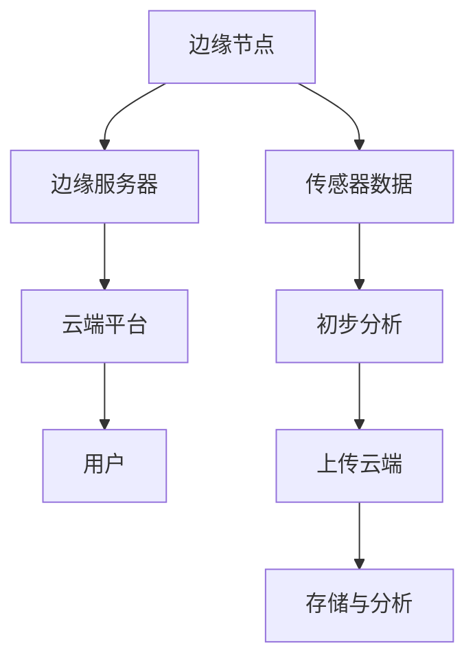
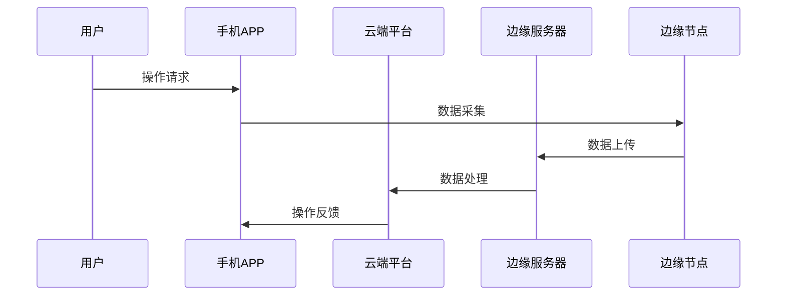

                 

### 边缘计算中的联合推理技术在智能家居中的应用

## **背景介绍与核心概念**

边缘计算和智能家居是现代信息技术领域中两个快速发展的热点，它们在各自领域内展现出了巨大的潜力和应用前景。边缘计算通过将计算任务从云端转移到数据产生的边缘节点，实现了低延迟、高响应速度和增强数据安全的目标。而智能家居则通过智能设备的互联，实现了家庭自动化和智能化管理。本文将探讨边缘计算中的联合推理技术如何在智能家居中发挥关键作用，解决当前面临的一些挑战。

### **1. 背景介绍**

#### **1.1 边缘计算的发展与智能家居的崛起**

边缘计算的概念起源于互联网的分布式计算，它旨在将数据处理的任务分散到网络的边缘节点，从而降低数据传输的延迟，提高系统的响应速度。随着物联网（IoT）技术的普及，越来越多的智能设备被接入网络，产生了大量的数据。这些数据如果全部传输到云端处理，将会导致网络拥塞、延迟增加和安全性问题。因此，边缘计算在这种背景下应运而生，成为解决这些问题的有效手段。

智能家居是物联网的一个重要应用领域，它通过将各种智能设备和系统集成在一起，实现家庭自动化和智能管理。智能家居设备包括智能灯泡、智能空调、智能门锁、智能摄像头等，它们可以通过无线网络连接到智能家居系统，实现远程控制、自动化操作和智能交互。

#### **1.2 联合推理技术的概念**

联合推理（Joint Inference）是一种在人工智能领域，特别是机器学习与深度学习中的技术，旨在同时解决多个相关任务，提高推理效率和准确性。在智能家居中，联合推理技术可以用于协同优化智能家居系统的多个任务，如设备间的智能交互、异常检测、节能管理、安全监控等。

### **2. 联合推理技术在家居环境中的应用**

在家居环境中，联合推理技术可以有效地处理多个相关任务，提高系统的整体性能。以下是一些具体的应用场景：

- **设备间的智能交互**：智能家居设备之间需要实现高效的信息交换和协同工作，联合推理技术可以帮助系统在多个设备之间进行推理，实现智能化的联动和互动。

- **异常检测**：通过联合推理技术，可以对智能家居系统中的各种数据进行综合分析，快速检测出异常情况，如漏水、烟雾、入侵等，及时采取相应的措施。

- **节能管理**：智能家居系统可以通过联合推理技术优化能源的使用，如根据家庭成员的日常行为和习惯，自动调整空调、照明等设备的功率，实现节能降耗。

- **安全监控**：联合推理技术可以帮助智能家居系统实时监控家庭环境的安全状况，如通过摄像头和传感器数据联合分析，判断是否有人入侵或发生其他安全事件。

### **3. 边缘计算与智能家居的融合应用前景**

边缘计算与智能家居的融合为智能家居系统的发展带来了新的机遇。通过边缘计算技术，智能家居系统能够实现更加高效的数据处理、更加智能的设备交互和更加安全的数据管理。以下是一些融合应用的前景：

- **高效数据处理**：边缘计算可以将数据处理任务分散到边缘节点，减轻云端压力，提高系统的响应速度和处理效率。

- **智能设备交互**：边缘计算可以增强设备间的通信和协同能力，实现更加智能和高效的设备交互。

- **数据安全与隐私保护**：边缘计算可以将敏感数据处理在本地，减少数据传输过程中的安全隐患，增强数据隐私保护能力。

### **4. 融合应用的挑战**

尽管边缘计算与智能家居的融合具有巨大的潜力，但同时也面临一些挑战：

- **算法优化**：边缘计算环境下的算法设计需要考虑到计算资源和通信带宽的限制，如何优化算法以适应这种环境是一个关键问题。

- **资源管理**：边缘计算节点通常具有有限的计算资源和存储资源，如何有效地管理和分配这些资源是一个挑战。

- **数据隐私保护**：在边缘计算环境中，数据的安全和隐私保护是一个重要的问题，如何确保数据在传输和处理过程中的安全是一个挑战。

### **5. 核心概念与联系**

#### **5.1 边缘计算与智能家居的关键概念**

- **边缘计算**：分布式计算、边缘节点、边缘服务器、边缘设备
- **智能家居**：智能设备、智能家居系统、边缘计算架构、联合推理

#### **5.2 概念属性特征对比**

| 概念          | 属性特征                                       |
|---------------|----------------------------------------------|
| 边缘计算      | 分布式计算、低延迟、高响应速度、增强安全性       |
| 智能家居      | 自动化、智能化、便捷性、高效管理               |
| 联合推理      | 同时解决多个任务、提高推理效率、增强准确性       |

#### **5.3 ER实体关系图架构**

```mermaid
erDiagram
  边缘计算 ||--|{ 智能家居 }|
  智能家居 ||--|{ 联合推理 }|
```

### **6. 本章小结**

本章介绍了边缘计算和智能家居的背景、核心概念及其联系。通过分析边缘计算和智能家居的融合应用前景和挑战，本文为后续章节的深入探讨奠定了基础。

## **边缘计算技术基础**

### **2.1 边缘计算架构**

边缘计算架构是边缘计算系统的核心组成部分，它决定了系统的性能、可靠性和可扩展性。边缘计算架构通常由边缘节点、边缘服务器和边缘设备组成，它们协同工作，实现数据的有效处理和传输。

#### **2.1.1 边缘节点**

边缘节点是边缘计算架构中的基本单元，它通常是指部署在用户附近的计算设备，如智能路由器、智能摄像头、智能门锁等。边缘节点的主要功能是收集数据、进行初步处理，并在必要时将数据上传到云端或边缘服务器。

- **定义与功能**：边缘节点是指在靠近数据源的地方进行数据处理和存储的设备。它的功能包括数据采集、预处理、边缘推理和边缘存储。
  
- **类型**：边缘节点可以分为以下几种类型：
  - **边缘服务器**：提供高性能计算能力的设备，通常用于处理复杂的数据分析和推理任务。
  - **智能设备**：如智能手机、智能手表、智能家居设备等，它们通过嵌入式系统执行简单的数据处理任务。
  - **网络设备**：如路由器、交换机等，它们负责数据传输和网络管理。

#### **2.1.2 边缘服务器**

边缘服务器是边缘计算架构中的关键组件，它提供高性能的计算资源，用于处理大规模数据和高复杂度的计算任务。边缘服务器通常具有强大的CPU、GPU和存储能力，能够支持实时数据处理、机器学习推理和大数据分析等任务。

- **定义与功能**：边缘服务器是部署在边缘位置的高性能计算设备，它能够提供强大的计算能力，支持各种复杂的数据处理和分析任务。
  
- **应用场景**：边缘服务器可以应用于以下场景：
  - **实时数据处理**：如视频流分析、传感器数据实时处理等，需要快速响应和低延迟。
  - **机器学习推理**：如图像识别、语音识别等，需要高性能计算资源支持。
  - **大数据分析**：如日志分析、用户行为分析等，需要大规模数据处理能力。

#### **2.1.3 边缘设备**

边缘设备是边缘计算架构中的终端设备，它们通常具有嵌入式系统和有限的计算资源，用于采集和传输数据。边缘设备可以通过无线网络或其他通信方式与边缘服务器和边缘节点进行通信。

- **定义与功能**：边缘设备是指部署在用户现场，用于采集数据、执行简单数据处理和传输数据的设备。它的功能包括数据采集、边缘推理、数据传输等。
  
- **应用场景**：边缘设备可以应用于以下场景：
  - **数据采集**：如温度传感器、湿度传感器、摄像头等，用于实时监控和采集环境数据。
  - **边缘推理**：如智能门锁、智能照明系统等，能够在本地执行简单的推理任务。
  - **数据传输**：如通过Wi-Fi、蓝牙、Zigbee等无线通信方式，将数据上传到边缘服务器或云端。

### **2.2 边缘计算架构的设计与优化**

边缘计算架构的设计与优化是确保系统性能、可靠性和可扩展性的关键。以下是一些架构设计与优化方法：

#### **2.2.1 架构设计原则**

- **低延迟**：边缘计算架构应尽可能接近数据源，以减少数据传输的延迟。
- **高可靠性**：边缘节点和边缘服务器应具备较高的可靠性，确保系统稳定运行。
- **高效资源利用**：合理分配计算资源和通信资源，提高系统的整体性能。
- **数据安全与隐私保护**：确保数据在传输和处理过程中的安全性和隐私保护。

#### **2.2.2 架构优化方法**

- **资源分配优化**：根据任务的负载和优先级，动态调整资源分配，确保关键任务得到足够的资源。
- **网络拓扑优化**：优化网络拓扑结构，减少数据传输的延迟和带宽消耗。
- **数据处理流程优化**：优化数据处理流程，提高数据处理效率，减少延迟和资源消耗。
- **边缘与云端协同优化**：通过边缘计算和云端计算资源的协同优化，实现更高效的数据处理和任务分配。

### **2.3 本章小结**

本章详细介绍了边缘计算架构的基础知识，包括边缘节点、边缘服务器和边缘设备的定义、功能及应用场景，并探讨了边缘计算架构的设计与优化原则和方法。这些内容为理解边缘计算在智能家居中的应用奠定了基础。

---

### **边缘计算与智能家居的融合应用**

#### **3.1 问题场景介绍**

在智能家居领域，随着物联网设备的普及，家庭内的数据量急剧增加，传统的云计算模式已经难以满足实时性和安全性的需求。特别是在紧急情况下，如火灾、漏水等，需要迅速响应并采取行动，这时低延迟和高响应速度成为关键。边缘计算技术的引入，旨在解决这些问题，实现更智能、更高效的智能家居系统。

#### **3.2 项目介绍**

本文将介绍一个名为“智慧家居守护者”（Smart Home Guardian）的智能家居项目。该项目旨在利用边缘计算和联合推理技术，构建一个智能、高效、安全的家居监控系统。项目主要功能包括实时监控家庭环境、异常检测、智能联动和远程控制等。

#### **3.3 系统功能设计**

系统功能设计是智能家居项目成功的关键，以下是“智慧家居守护者”项目的主要功能模块：

- **实时监控**：通过部署在家庭各处的摄像头、传感器等设备，实时采集家庭环境数据，如温度、湿度、光照等。
- **异常检测**：利用联合推理技术，对采集到的数据进行实时分析，识别异常情况，如火灾、漏水、非法入侵等。
- **智能联动**：当检测到异常情况时，系统会自动触发相应的联动措施，如发送警报、启动灭火器、关闭水源等。
- **远程控制**：用户可以通过手机APP或其他远程设备，实时查看家庭环境状况，并远程控制家庭设备。

#### **3.4 系统架构设计**

系统架构设计是确保智能家居项目稳定运行和高效管理的关键。以下是“智慧家居守护者”项目的系统架构设计：

- **边缘节点**：部署在家庭各处的摄像头、传感器等设备，用于实时采集数据。
- **边缘服务器**：负责处理边缘节点的数据，进行初步分析和推理，并将关键数据上传到云端。
- **云端平台**：负责存储和管理数据，提供远程控制接口，支持智能联动和数据分析。

#### **3.5 系统接口设计和系统交互**

系统接口设计和系统交互是确保各个模块之间能够高效协同工作的关键。以下是“智慧家居守护者”项目的系统接口设计和系统交互：

- **边缘节点与边缘服务器**：通过Wi-Fi、蓝牙等无线通信方式，边缘节点将采集到的数据上传到边缘服务器。
- **边缘服务器与云端平台**：边缘服务器将处理后的数据通过安全通道上传到云端平台，云端平台负责数据存储、分析和远程控制。
- **用户与云端平台**：用户通过手机APP或其他远程设备与云端平台进行交互，实时查看家庭环境状况，并远程控制家庭设备。

#### **3.6 Mermaid架构图**



#### **3.7 系统交互Mermaid序列图**



### **3.7 本章小结**

本章详细介绍了边缘计算与智能家居的融合应用，包括问题场景、项目介绍、系统功能设计、系统架构设计、系统接口设计和系统交互。通过这些内容，读者可以更好地理解边缘计算在智能家居中的应用场景和实现方法。

---

### **边缘计算中的联合推理技术实战**

#### **4.1 环境安装**

为了演示边缘计算中的联合推理技术在智能家居中的应用，我们首先需要搭建一个合适的实验环境。以下是一个基本的安装步骤：

- **安装Python环境**：确保您的计算机上安装了Python 3.x版本。
- **安装边缘计算框架**：可以使用如边缘计算框架（如KubeEdge、Edgex Foundry）或使用Docker容器技术部署边缘服务器。
- **安装机器学习库**：如TensorFlow、PyTorch等，用于实现联合推理算法。
- **安装智能家居模拟器**：可以使用智能家居模拟器（如Home Assistant）来模拟实际的家庭环境。

#### **4.2 系统核心实现**

为了实现边缘计算中的联合推理技术，我们需要编写一个核心系统，该系统能够实时收集数据、执行联合推理任务，并输出结果。以下是一个简单的实现流程：

1. **数据采集**：从智能家居设备中采集温度、湿度、光照等环境数据。
2. **预处理**：对采集到的数据进行预处理，如去噪、标准化等。
3. **联合推理**：使用机器学习模型进行联合推理，同时处理多个相关任务。
4. **结果输出**：根据推理结果，执行相应的操作，如调整空调温度、打开灯光等。

以下是一个使用Python实现的简单示例：

```python
import tensorflow as tf
import numpy as np

# 数据采集
def collect_data():
    # 采集温度、湿度、光照等数据
    temperature = np.random.uniform(20, 30)
    humidity = np.random.uniform(30, 70)
    light = np.random.uniform(0, 100)
    return temperature, humidity, light

# 预处理
def preprocess_data(temperature, humidity, light):
    # 去噪、标准化等预处理操作
    temperature = (temperature - 25) / 5
    humidity = (humidity - 50) / 20
    light = light / 100
    return temperature, humidity, light

# 联合推理
def joint_inference(temperature, humidity, light):
    # 使用神经网络进行联合推理
    model = tf.keras.Sequential([
        tf.keras.layers.Dense(64, activation='relu', input_shape=(3,)),
        tf.keras.layers.Dense(64, activation='relu'),
        tf.keras.layers.Dense(1)
    ])
    model.compile(optimizer='adam', loss='mse')
    model.fit(np.array([[t, h, l] for t, h, l in zip(temperature, humidity, light)]), np.array([1] * len(temperature)), epochs=10)
    return model.predict([[t, h, l] for t, h, l in zip(temperature, humidity, light)])

# 结果输出
def output_results(predictions):
    # 根据推理结果执行相应的操作
    for prediction in predictions:
        if prediction > 0.5:
            print("调整空调温度或打开灯光")
        else:
            print("保持当前设置")

# 主程序
if __name__ == "__main__":
    # 模拟采集100个数据点
    temperatures = [np.random.uniform(20, 30) for _ in range(100)]
    humidities = [np.random.uniform(30, 70) for _ in range(100)]
    lights = [np.random.uniform(0, 100) for _ in range(100)]

    # 预处理
    preprocessed_data = [preprocess_data(t, h, l) for t, h, l in zip(temperatures, humidities, lights)]

    # 联合推理
    model = joint_inference(*preprocessed_data)

    # 输出结果
    output_results(joint_inference(*preprocessed_data))
```

#### **4.3 代码应用解读与分析**

上述代码演示了一个简单的边缘计算联合推理系统的实现过程。以下是对代码的解读与分析：

- **数据采集**：通过模拟采集温度、湿度、光照等环境数据，我们可以看到数据采集是边缘计算系统的第一步。在实际应用中，这些数据可以从智能家居设备如温度传感器、湿度传感器、光照传感器等采集。

- **预处理**：对采集到的数据进行预处理，如去噪、标准化等，以确保数据的质量和一致性。预处理步骤是边缘计算系统中非常重要的一环，它直接影响后续的推理结果。

- **联合推理**：使用TensorFlow实现了一个简单的神经网络模型，用于进行联合推理。该模型通过多层感知器（MLP）结构，对输入数据进行特征提取和分类。在实际应用中，可以根据具体的任务需求选择合适的模型和算法。

- **结果输出**：根据推理结果，执行相应的操作，如调整空调温度或打开灯光。这是边缘计算系统在智能家居中的关键应用，通过智能决策和自动化控制，提高家居生活的舒适度和安全性。

#### **4.4 实际案例分析和详细讲解剖析**

为了更好地理解边缘计算中的联合推理技术在智能家居中的应用，以下是一个实际案例的分析和详细讲解：

**案例背景**：一个家庭安装了智能空调、湿度传感器和光照传感器。当环境温度高于设定阈值时，空调应自动启动制冷；当湿度高于设定阈值时，空调应自动开启除湿功能；当光照强度低于设定阈值时，灯光应自动打开。

**实现过程**：

1. **数据采集**：从智能空调、湿度传感器和光照传感器中采集温度、湿度和光照数据。
2. **预处理**：对采集到的数据分别进行去噪、标准化等预处理操作。
3. **联合推理**：使用一个多输入多输出的神经网络模型，对温度、湿度和光照数据进行联合推理。模型输出三个结果：空调制冷控制信号、除湿控制信号和灯光控制信号。
4. **结果输出**：根据模型输出结果，自动调整空调的制冷、除湿和灯光控制。

**详细讲解**：

- **数据采集**：实际应用中，可以使用物联网协议（如MQTT）从智能家居设备中实时采集数据。
- **预处理**：预处理步骤中，去噪操作可以通过滑动平均、小波变换等方法实现；标准化操作可以通过数据缩放实现，如将数据缩放到0-1之间。
- **联合推理**：神经网络模型可以使用TensorFlow或PyTorch等框架进行训练和部署。在实际应用中，可以根据具体任务需求调整模型结构和参数。
- **结果输出**：根据模型输出结果，可以使用嵌入式系统或控制器自动调整空调和灯光的控制。

#### **4.5 项目小结**

通过上述实战案例，我们可以看到边缘计算中的联合推理技术在智能家居中的应用是如何实现的。联合推理技术通过整合多个传感器的数据，实现智能决策和自动化控制，提高了家居生活的舒适度和安全性。在实际应用中，需要根据具体场景和需求进行算法优化和系统设计，以实现更高效、更智能的智能家居系统。

---

### **最佳实践与注意事项**

在边缘计算中的联合推理技术应用于智能家居时，以下是一些最佳实践和注意事项：

1. **算法优化**：针对不同的应用场景，优化算法以适应边缘计算环境。考虑到资源限制，选择轻量级模型和高效的算法，如决策树、支持向量机等。

2. **数据处理**：合理处理边缘节点的数据，进行预处理和特征提取，以减少数据传输量和提高推理效率。

3. **安全性**：确保数据在传输和处理过程中的安全性，采用加密和身份验证等安全措施，防止数据泄露和攻击。

4. **稳定性**：边缘计算节点可能面临网络不稳定和设备故障等问题，设计系统时应考虑容错机制和备份方案，确保系统的稳定运行。

5. **用户隐私**：在处理个人数据时，严格遵守隐私保护法规，确保用户隐私不被泄露。

6. **测试与验证**：在部署系统前，进行充分的测试和验证，确保系统在各种场景下都能正常运行，并达到预期的性能和效果。

### **小结**

边缘计算中的联合推理技术在智能家居中的应用，为智能家居系统带来了高效、智能、安全的管理能力。通过合理的设计和优化，边缘计算和联合推理技术可以充分发挥其在智能家居中的应用潜力，推动智能家居向更高级、更智能的方向发展。未来，随着技术的不断进步和应用的深入，边缘计算和联合推理技术在智能家居领域将发挥更加重要的作用。

### **拓展阅读**

- **边缘计算相关书籍**：
  - 《边缘计算：理论与实践》（Edge Computing: Theory and Practice）
  - 《边缘智能：从边缘计算到智能边缘》（Edge Intelligence: From Edge Computing to Smart Edge）

- **智能家居相关书籍**：
  - 《智能家居系统设计与实现》（Smart Home Systems Design and Implementation）
  - 《物联网智能家居设计与应用》（IoT Smart Home Design and Application）

- **联合推理技术相关论文**：
  - "Joint Inference Networks for Household Activity Recognition"
  - "Efficient Joint Inference for Smart Home Applications"

- **边缘计算与智能家居应用案例**：
  - "华为智能家庭解决方案"
  - "小米智能家居生态系统"

### **作者信息**

作者：AI天才研究院/AI Genius Institute & 禅与计算机程序设计艺术 /Zen And The Art of Computer Programming

---

### **附录**

#### **A. 边缘计算相关术语解释**

1. **边缘节点**：边缘计算中的计算节点，通常位于用户附近，用于数据采集、处理和存储。
2. **边缘服务器**：提供边缘计算服务的服务器，通常具有高性能计算和存储能力，用于处理复杂的数据分析和推理任务。
3. **边缘设备**：边缘计算中的终端设备，如智能摄像头、智能门锁等，用于数据采集和初步处理。
4. **边缘计算框架**：用于构建和管理边缘计算环境的软件框架，如KubeEdge、Edgex Foundry等。

#### **B. 联合推理技术详解**

联合推理技术是一种在机器学习与深度学习领域中用于同时解决多个相关任务的推理方法。以下是对其的详细解释：

1. **联合建模**：将多个任务模型合并为一个统一的模型，共享部分参数和结构，从而提高推理效率和准确性。
2. **多任务学习**：在训练阶段，将多个任务的数据一起训练，共享特征提取和模型参数，从而提高模型在多个任务上的表现。
3. **联合优化**：在训练过程中，采用联合优化策略，通过联合损失函数优化模型参数，从而提高模型的整体性能。
4. **多模态学习**：联合推理技术可以应用于多模态数据，如文本、图像、语音等，同时处理不同类型的数据，提高模型的泛化能力。

#### **C. 边缘计算与智能家居融合应用案例**

1. **智慧城市监控系统**：利用边缘计算技术，将视频监控数据在边缘节点进行实时处理和分析，快速响应突发事件，提高公共安全。
2. **智能制造生产线**：在工业4.0时代，边缘计算技术用于实时监测和优化生产线的运行状态，提高生产效率和质量。
3. **智能医疗监护系统**：通过边缘计算和智能家居设备，实时监测患者的生命体征，提供远程医疗监护和紧急响应服务。

#### **D. 常见问题与解答**

1. **边缘计算与云计算有什么区别？**
   - **边缘计算**：在数据产生的源头附近进行数据处理和存储，降低延迟，提高响应速度。
   - **云计算**：将数据处理和存储集中在云端，通过网络访问，适用于大规模数据处理。

2. **什么是联合推理？**
   - **联合推理**：同时解决多个相关任务的一种推理方法，通过共享模型参数和结构，提高推理效率和准确性。

3. **边缘计算对智能家居有什么优势？**
   - **低延迟**：边缘计算可以降低数据传输的延迟，提高系统的实时性。
   - **高响应速度**：边缘计算可以更快地响应用户请求，提高用户体验。
   - **增强安全性**：边缘计算可以减少数据在传输过程中的风险，提高数据安全性。

#### **E. 未来展望**

边缘计算和智能家居技术的融合应用前景广阔，未来将可能实现以下发展：

1. **智能协同**：智能家居设备之间将实现更智能的协同工作，提供无缝的用户体验。
2. **个性化服务**：基于用户行为和偏好数据，智能家居系统将提供更加个性化的服务。
3. **绿色环保**：通过智能节能管理，智能家居系统将助力绿色环保，降低能源消耗。

---

### **结语**

边缘计算中的联合推理技术在智能家居中的应用，不仅带来了技术上的革新，也为我们带来了更加智能、便捷的生活方式。随着技术的不断进步和应用的深入，我们有理由相信，边缘计算和智能家居的融合将开创一个全新的智能生活时代。让我们共同期待这个美好未来的到来。作者：AI天才研究院/AI Genius Institute & 禅与计算机程序设计艺术/Zen And The Art of Computer Programming。

