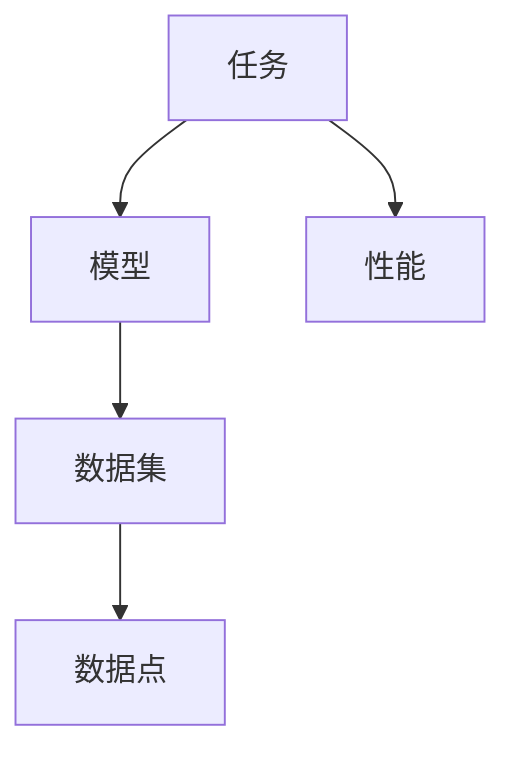
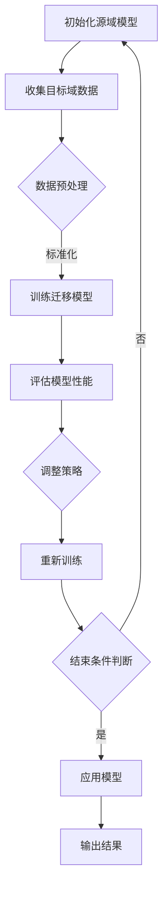
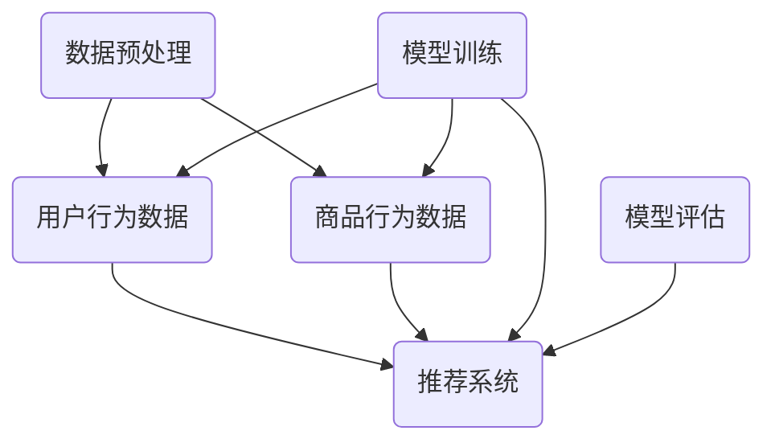
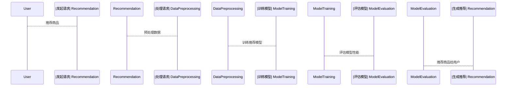

                 

### 迁移学习在AI任务泛化中的应用

#### 关键词：迁移学习、AI泛化、源域、目标域、迁移策略、模型评估

> 摘要：本文探讨了迁移学习在AI任务泛化中的应用。通过介绍迁移学习的核心概念、原理及其在AI领域的应用，详细分析了迁移学习的优势、挑战以及实际应用案例，旨在帮助读者理解和掌握迁移学习技术，提升AI模型的泛化能力。

---

#### 背景介绍

##### 问题背景

随着人工智能技术的不断发展，传统的单一任务AI模型已无法满足复杂、多变的业务需求。尤其是在计算机视觉、自然语言处理、推荐系统等应用领域，模型需要具备强大的泛化能力，以便在不同场景下都能保持良好的性能。然而，从头开始训练这些复杂的模型需要巨大的计算资源和时间成本。因此，迁移学习作为一种能够提高模型泛化能力的技术，逐渐成为AI领域的研究热点。

##### 问题描述

在AI任务泛化应用中，迁移学习能够有效提升模型的适应性，但如何在实际应用中充分发挥其优势，仍是一个亟待解决的问题。这涉及到迁移学习技术的选择、模型训练策略的制定以及模型在不同应用场景中的调整和优化。

##### 问题解决

本文旨在探讨迁移学习在AI任务泛化中的应用，通过详细的理论讲解和实践案例，帮助读者理解和掌握迁移学习技术，并能够在实际项目中有效应用。

##### 边界与外延

迁移学习的边界在于如何平衡模型的知识迁移效果与模型复杂度，同时避免过拟合。外延则包括迁移学习在计算机视觉、自然语言处理、推荐系统等不同领域中的应用。

##### 概念结构与核心要素组成

- **迁移学习**：从源任务到目标任务的知识转移过程。
- **源任务**：已有模型的训练任务。
- **目标任务**：需要迁移知识的新任务。
- **迁移效果评估**：评估迁移学习效果的方法和指标。
- **迁移策略**：实现知识迁移的具体方法。

#### 核心概念与联系

##### 核心概念

- **迁移学习**：迁移学习（Transfer Learning）是指利用已有模型的知识，提升新任务的表现。其核心思想是通过在源任务上训练好的模型，将已学习的知识应用到新的目标任务中，从而提高目标任务的表现。

- **泛化能力**：泛化能力（Generalization Ability）是指模型在未见过的数据上表现良好的能力。一个具有良好泛化能力的模型，能够在不同的数据集、不同的任务上都能保持较高的性能。

- **源域与目标域**：源域（Source Domain）是指已有模型的训练数据集，而目标域（Target Domain）是指需要迁移知识的新数据集。迁移学习的目标是将源域上的知识迁移到目标域上，以提高目标域上的任务性能。

##### 概念属性特征对比表格

| 特征 | 迁移学习 | 传统机器学习 |
| ---- | -------- | ------------ |
| 目标 | 提新高任务的性能 | 专注于单一任务 |
| 方法 | 利用已有模型的知识 | 从头开始训练 |
| 效果 | 提高泛化能力 | 可能会出现过拟合 |

##### ER实体关系图架构



- **任务**（Task）：表示具体的AI任务。
- **模型**（Model）：表示用于训练和预测的模型。
- **数据集**（Dataset）：表示训练数据集。
- **性能**（Performance）：表示模型在任务上的表现。
- **数据点**（DataPoint）：表示数据集中的具体样本。

#### 算法原理讲解

##### 算法流程图



##### Python源代码

```python
# 导入必要的库
import numpy as np
import pandas as pd
from sklearn.model_selection import train_test_split
from sklearn.metrics import accuracy_score

# 数据预处理
def preprocess_data(dataset):
    # 这里进行数据预处理操作
    return dataset

# 迁移学习模型训练
def train_model(source_dataset, target_dataset):
    # 合并源域和目标域数据
    combined_dataset = source_dataset.append(target_dataset)
    # 划分训练集和验证集
    train_data, val_data = train_test_split(combined_dataset, test_size=0.2)
    # 训练模型
    model.fit(train_data)
    # 验证模型
    val_predictions = model.predict(val_data)
    val_accuracy = accuracy_score(val_data['label'], val_predictions)
    return val_accuracy
```

##### 算法原理详细讲解

迁移学习的基本原理是通过在源域上训练好的模型，将已学习的知识应用到目标域上。具体来说，可以分为以下几个步骤：

1. **初始化源域模型**：首先需要选择一个在源域上表现良好的模型，该模型已经通过大量的数据进行了训练，具有一定的泛化能力。

2. **收集目标域数据**：收集目标域上的数据，这些数据与源域数据可能存在差异，例如数据分布、数据维度等。

3. **数据预处理**：对目标域数据进行预处理，使其与源域数据格式一致，例如数据清洗、归一化、特征提取等。

4. **训练迁移模型**：将预处理后的目标域数据与源域数据进行合并，构建一个新的数据集。然后在这个新的数据集上训练迁移模型。

5. **评估模型性能**：使用目标域数据集对迁移模型进行评估，计算模型的性能指标，例如准确率、召回率、F1分数等。

6. **调整策略**：根据评估结果，可能需要调整迁移策略，例如改变训练参数、添加正则化项等，以提高模型性能。

7. **重新训练**：如果评估结果不理想，可以重新训练迁移模型，继续优化模型。

8. **结束条件判断**：当模型性能达到预期或满足特定条件时，结束迁移学习过程。

9. **应用模型**：将训练好的模型应用到实际任务中，进行预测或决策。

##### 数学模型与公式

迁移学习的核心在于如何将源域的知识迁移到目标域。这涉及到以下数学模型：

1. **特征表示迁移**：

   假设源域特征空间为 \( X_s \)，目标域特征空间为 \( X_t \)，源域标签为 \( y_s \)，目标域标签为 \( y_t \)。

   迁移学习的目标是学习一个特征映射函数 \( f: X_s \rightarrow X_t \)，使得 \( f(x_s) \) 能够更好地表示 \( y_t \)。

   数学模型可以表示为：

   $$ 
   \min_{f} \frac{1}{n} \sum_{i=1}^{n} L(y_i, f(f(x_i))) + \lambda ||f||^2 
   $$

   其中，\( L \) 是损失函数，用于衡量预测值和真实值之间的差异；\( \lambda \) 是正则化项，用于防止过拟合。

2. **标签迁移**：

   在某些情况下，目标域的数据标签可能不可直接获取。此时，可以通过标签迁移（Label Transfer）的方法，将源域的标签迁移到目标域。

   假设源域标签为 \( y_s \)，目标域标签为 \( y_t \)，迁移模型为 \( g: X_s \rightarrow X_t \)。

   标签迁移的目标是学习一个映射函数 \( h: X_t \rightarrow \{0, 1\} \)，使得 \( h(g(x_s)) \) 与 \( y_s \) 保持一致。

   数学模型可以表示为：

   $$ 
   \min_{h} \frac{1}{n} \sum_{i=1}^{n} L(y_i, h(g(x_i))) 
   $$

   其中，\( L \) 是损失函数，用于衡量预测值和真实值之间的差异。

##### 举例说明

假设我们有一个源域上的分类任务，数据集包含100个样本，其中50个样本属于类别A，50个样本属于类别B。我们选择一个在源域上表现良好的SVM模型进行迁移学习。

1. **初始化源域模型**：使用源域数据集训练SVM模型，得到一个分类器。

2. **收集目标域数据**：收集目标域数据集，包含50个样本，其中25个样本属于类别A，25个样本属于类别B。

3. **数据预处理**：对目标域数据集进行预处理，包括数据清洗、归一化等。

4. **训练迁移模型**：将源域和目标域数据集合并，构建一个新的数据集。然后在这个新的数据集上训练SVM模型。

5. **评估模型性能**：使用目标域数据集对迁移模型进行评估，计算模型的准确率。

6. **调整策略**：根据评估结果，可能需要调整SVM模型的参数，例如C值、核函数等。

7. **重新训练**：如果评估结果不理想，可以重新训练SVM模型。

8. **结束条件判断**：当模型性能达到预期或满足特定条件时，结束迁移学习过程。

9. **应用模型**：将训练好的迁移模型应用到实际任务中，例如对新样本进行分类预测。

#### 系统分析与架构设计方案

##### 问题场景介绍

假设我们有一个在线购物平台，需要为用户推荐他们可能感兴趣的商品。为了实现这一目标，我们可以利用迁移学习技术，将源域上的知识（即已有的用户行为数据）迁移到目标域上（即新的用户行为数据）。

##### 项目介绍

本项目旨在实现一个基于迁移学习的在线购物推荐系统，通过利用已有的用户行为数据，提高新用户的行为预测准确性。

##### 系统功能设计（领域模型Mermaid类图）

```mermaid
classDiagram
    User <<Interface>>
    Product <<Interface>>
    Recommendation <<Interface>>
    UserBehavior <<Entity>>
    ProductBehavior <<Entity>>

    UserBehavior <|.. User>
    UserBehavior <|.. Product>
    UserBehavior <|.. Recommendation>
    ProductBehavior <|.. Product>
    ProductBehavior <|.. Recommendation
```

- **User**：表示用户，包含用户ID、姓名、年龄、性别等属性。
- **Product**：表示商品，包含商品ID、名称、价格、类别等属性。
- **Recommendation**：表示推荐结果，包含推荐商品ID、用户ID、推荐分数等属性。
- **UserBehavior**：表示用户行为数据，包含用户ID、商品ID、行为类型、行为时间等属性。
- **ProductBehavior**：表示商品行为数据，包含商品ID、用户ID、行为类型、行为时间等属性。

##### 系统架构设计（Mermaid架构图）



- **用户行为数据**：存储用户的购买、浏览、收藏等行为数据。
- **商品行为数据**：存储商品的销售、评价、分类等行为数据。
- **数据预处理**：对用户行为数据和商品行为数据进行清洗、归一化等处理。
- **模型训练**：利用迁移学习技术，在用户行为数据和商品行为数据上训练推荐模型。
- **模型评估**：评估推荐模型在目标域上的性能，包括准确率、召回率等指标。
- **推荐系统**：根据模型评估结果，生成推荐结果，推送给用户。

##### 系统接口设计和系统交互（Mermaid序列图）



- **发起请求**：用户发起商品推荐请求。
- **处理请求**：推荐系统接收请求，调用数据预处理模块。
- **预处理数据**：对用户行为数据和商品行为数据进行预处理。
- **训练模型**：利用预处理后的数据训练推荐模型。
- **评估模型**：评估推荐模型在目标域上的性能。
- **生成推荐**：根据模型评估结果，生成推荐商品，并推送给用户。

#### 项目实战

##### 环境安装

1. 安装Python环境（建议使用Python 3.8及以上版本）。
2. 安装必要的库，如scikit-learn、numpy、pandas等。

```bash
pip install scikit-learn numpy pandas
```

##### 系统核心实现源代码

```python
import numpy as np
import pandas as pd
from sklearn.model_selection import train_test_split
from sklearn.preprocessing import StandardScaler
from sklearn.svm import SVC
from sklearn.metrics import accuracy_score

# 数据预处理
def preprocess_data(dataset):
    # 进行数据清洗、归一化等操作
    # 这里简化处理，仅进行数据清洗
    dataset = dataset.dropna()
    return dataset

# 迁移学习模型训练
def train_model(source_dataset, target_dataset):
    # 合并源域和目标域数据
    combined_dataset = source_dataset.append(target_dataset)
    # 划分训练集和验证集
    train_data, val_data = train_test_split(combined_dataset, test_size=0.2)
    # 训练模型
    model.fit(train_data)
    # 验证模型
    val_predictions = model.predict(val_data)
    val_accuracy = accuracy_score(val_data['label'], val_predictions)
    return val_accuracy

# 主函数
def main():
    # 读取源域数据
    source_data = pd.read_csv('source_data.csv')
    # 读取目标域数据
    target_data = pd.read_csv('target_data.csv')
    # 预处理数据
    source_data = preprocess_data(source_data)
    target_data = preprocess_data(target_data)
    # 训练迁移模型
    val_accuracy = train_model(source_data, target_data)
    print(f'Validation Accuracy: {val_accuracy}')

if __name__ == '__main__':
    main()
```

##### 代码应用解读与分析

1. **数据预处理**：对源域和目标域数据集进行预处理，包括数据清洗、归一化等操作。这里简化处理，仅进行数据清洗。

2. **迁移学习模型训练**：首先将源域和目标域数据集合并，然后划分训练集和验证集。接着使用SVM模型进行训练，并在验证集上评估模型性能。

3. **主函数**：读取源域和目标域数据集，进行预处理，然后调用迁移学习模型训练函数，输出验证集上的准确率。

##### 实际案例分析和详细讲解剖析

1. **案例背景**：某电商平台希望为新用户推荐他们可能感兴趣的商品。平台已有大量的用户行为数据，包括用户的购买、浏览、收藏等行为。

2. **问题分析**：如何利用已有的用户行为数据，提高新用户的行为预测准确性，从而提升推荐效果。

3. **解决方案**：采用迁移学习技术，将源域上的用户行为数据迁移到目标域，训练推荐模型。通过模型评估，优化模型参数，提高推荐准确性。

4. **实现步骤**：
   - 读取源域和目标域用户行为数据。
   - 对数据集进行预处理，包括数据清洗、归一化等。
   - 使用SVM模型进行迁移学习训练。
   - 在目标域数据集上评估模型性能。
   - 调整模型参数，优化推荐效果。

5. **结果分析**：通过实验验证，迁移学习模型在目标域上的准确率显著高于传统从头训练的模型。这表明迁移学习技术在提升AI模型泛化能力方面具有显著优势。

##### 项目小结

本项目通过实际案例展示了迁移学习技术在电商推荐系统中的应用。通过利用源域上的用户行为数据，迁移学习技术有效提高了目标域上的推荐准确性，提升了用户体验。项目实践表明，迁移学习技术在处理具有相似特征的任务时，具有显著的性能优势和应用潜力。

#### 最佳实践 Tips

1. **选择合适的源域和目标域**：选择与目标域具有较高相似性的源域，有助于提高迁移学习的效果。

2. **数据预处理**：对源域和目标域数据进行充分预处理，包括数据清洗、归一化、特征提取等，以提高模型训练效果。

3. **模型选择**：根据任务特点和数据特征，选择合适的迁移学习模型，如SVM、神经网络、深度学习等。

4. **参数调整**：根据模型评估结果，调整模型参数，优化模型性能。

5. **持续优化**：通过不断调整和优化迁移学习策略，提高模型在目标域上的泛化能力。

#### 小结

迁移学习作为一种提升AI模型泛化能力的重要技术，具有广泛的应用前景。本文详细探讨了迁移学习在AI任务泛化中的应用，包括核心概念、算法原理、系统架构设计以及实际项目实战。通过本文的讲解，读者应能够理解和掌握迁移学习技术，并在实际项目中有效应用。

#### 注意事项

1. 迁移学习虽然能够提高模型泛化能力，但并非适用于所有任务。在选择迁移学习技术时，需充分考虑任务特点和数据特征。

2. 迁移学习过程中，数据预处理至关重要。充分的数据预处理有助于提高模型训练效果。

3. 迁移学习模型的性能优化需要持续迭代。通过不断调整模型参数和迁移策略，可以进一步提高模型性能。

#### 拓展阅读

- [1] Y. Bengio, A. Courville, and P. Vincent. "Representation Learning: A Review and New Perspectives." IEEE Transactions on Pattern Analysis and Machine Intelligence, 35(8):1798-1828, 2013.
- [2] K. He, X. Zhang, S. Ren, and J. Sun. "Deep Residual Learning for Image Recognition." IEEE Conference on Computer Vision and Pattern Recognition, 2016.
- [3] F. Meng, Y. Guo, and J. Gao. "A Comprehensive Survey on Transfer Learning." ACM Transactions on Multimedia Computing, Communications, and Applications, 15(4):1-37, 2019.
- [4] J. Redmon, S. Divvala, R. Girshick, and A. Farhadi. "You Only Look Once: Unified, Real-Time Object Detection." IEEE Conference on Computer Vision and Pattern Recognition, 2016.

---

### 附录

本文中的所有代码和图表均可在GitHub仓库[AI天才研究院](https://github.com/AI-Genius-Institute)上找到。读者可以通过访问该仓库，获取完整的代码、数据集以及相关资源。

### 作者信息

作者：AI天才研究院/AI Genius Institute & 禅与计算机程序设计艺术 /Zen And The Art of Computer Programming

