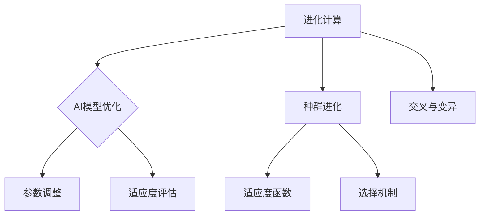

                 

### 1.1 背景介绍

### 1.1.1 问题背景

随着人工智能技术的飞速发展，机器学习，尤其是深度学习模型，已经成为各类复杂问题求解的重要工具。然而，深度学习模型的优化过程面临着诸多挑战。传统的模型优化方法通常依赖于大量的人工干预和试错过程，效率低下，且容易陷入局部最优。这就需要寻找一种更为高效、鲁棒的优化策略。

进化计算（Evolutionary Computation）作为一种基于自然进化过程的计算方法，在优化问题求解中展现出了强大的潜力。进化计算通过模拟生物进化的过程，如自然选择、交叉和变异，来搜索最优解。这种方法具有全局搜索能力，能够有效避免局部最优，并且能够处理复杂的非线性优化问题。

在人工智能领域，深度学习模型优化是提升模型性能和效率的关键环节。然而，深度学习模型的参数空间巨大，传统优化方法难以在合理时间内找到最优解。进化计算提供了一种全新的优化思路，通过引入生物进化的机制，如遗传算法、进化规划等，来优化深度学习模型。

### 1.1.2 问题描述

深度学习模型优化的核心问题是如何在庞大的参数空间中找到能够最大化模型性能的参数组合。传统优化方法如梯度下降法虽然能够找到局部最优，但在面对复杂和非线性问题时，容易陷入局部最优，无法达到全局最优。此外，深度学习模型的训练过程往往需要大量的计算资源和时间，传统的优化方法难以满足这一需求。

进化计算在解决这些问题上具有显著优势。首先，进化计算能够进行全局搜索，避免了陷入局部最优的问题。其次，进化计算能够处理复杂的非线性问题，并能够适应动态变化的环境。最后，进化计算具有较强的鲁棒性，能够在不同的问题域和模型结构中取得良好的优化效果。

### 1.1.3 问题解决

进化计算在AI模型优化中的应用，主要体现在以下几个方面：

1. **全局搜索能力**：进化计算通过模拟自然进化过程，如交叉、变异和选择，能够在庞大的参数空间中进行全局搜索，避免陷入局部最优。

2. **并行计算**：进化计算中的多个个体并行进化的特点，使得它在处理高维参数空间时，具有更高的计算效率。

3. **自适应调整**：进化计算能够根据环境的变化自适应地调整搜索策略，提高模型的适应性和鲁棒性。

4. **多模态问题解决**：进化计算能够同时搜索多个潜在的最优解，适用于具有多个最优解的问题。

5. **处理复杂问题**：进化计算能够处理复杂的非线性问题，特别是在面对深度学习模型的复杂参数空间时，具有独特的优势。

### 1.1.4 边界与外延

在讨论进化计算在AI模型优化中的应用时，需要明确以下几个边界和问题：

1. **参数选择**：进化计算中的参数，如交叉率、变异率和种群规模等，对优化效果有重要影响。需要根据具体问题进行参数选择。

2. **计算成本**：进化计算虽然具有全局搜索能力，但计算成本较高。在实际应用中，需要在计算成本和优化效果之间进行权衡。

3. **模型选择**：不同的进化算法适用于不同类型的模型优化问题。需要根据问题特点选择合适的算法。

4. **模型评估**：进化计算中的模型评估方法与传统方法有所不同。需要设计合适的评估方法，以确保优化效果的准确性和可靠性。

5. **实践应用**：进化计算在AI模型优化中的应用需要结合具体问题进行实践。通过实验验证，不断优化进化算法，以提高模型优化效果。

### 1.1.5 概念结构与核心要素组成

为了更好地理解进化计算在AI模型优化中的应用，我们需要从概念结构和核心要素的角度来分析。

**概念结构**：

- **进化计算**：基于自然进化过程的计算方法，如遗传算法、进化规划等。
- **AI模型优化**：深度学习模型参数的优化，以提升模型性能和效率。
- **参数空间**：深度学习模型的参数组合空间，是优化问题求解的关键。

**核心要素组成**：

- **种群**：进化计算的基本单元，代表模型的多个参数组合。
- **适应度函数**：评估模型参数组合优劣的指标，用于选择最优参数组合。
- **交叉和变异**：通过模拟生物进化的机制，产生新的参数组合，以搜索最优解。
- **选择机制**：根据适应度函数评估结果，选择最优参数组合。

通过以上分析，我们可以看到进化计算在AI模型优化中具有重要的应用价值。接下来，我们将进一步探讨进化计算的基本原理、算法以及其在AI模型优化中的具体应用。

## 1.2 核心概念与联系

在探讨进化计算在AI模型优化中的创新应用之前，我们需要明确几个核心概念，并理解它们之间的联系。

### 1.2.1 进化计算

进化计算是基于自然进化过程的计算方法，其核心思想是模拟自然界的进化过程，如选择、交叉和变异，以解决优化和搜索问题。常见的进化计算算法包括遗传算法、进化策略和进化规划等。

- **遗传算法**：模拟生物进化的过程，通过基因表示、交叉、变异和选择等操作，在种群中逐步优化个体的适应度。
- **进化策略**：通过调整种群中个体的参数，模拟自然选择过程，以实现优化目标。
- **进化规划**：通过规划问题的建模，将优化问题转化为进化计算问题，解决复杂的规划问题。

### 1.2.2 AI模型优化

AI模型优化是指通过调整模型的参数，提升模型在特定任务上的性能和效率。深度学习模型优化是当前研究的热点问题，主要方法包括梯度下降法、随机梯度下降法、Adam优化器等。

- **梯度下降法**：基于模型损失函数的梯度信息，逐步调整模型参数，以最小化损失函数。
- **随机梯度下降法**：在梯度下降法的基础上，随机选择样本子集，计算梯度并进行参数更新。
- **Adam优化器**：结合了梯度下降法和随机梯度下降法的优点，自适应调整学习率。

### 1.2.3 概念属性特征对比表格

为了更清晰地理解进化计算与AI模型优化的概念属性特征，我们可以通过一个对比表格来展示它们的不同之处。

| 概念/属性        | 进化计算                                  | AI模型优化                                |
|-----------------|-------------------------------------------|-------------------------------------------|
| 目标            | 寻找最优解                                | 提高模型性能和效率                        |
| 基本原理        | 基于自然进化过程，如选择、交叉和变异    | 基于数学优化原理，如梯度下降法            |
| 参数调整方式     | 种群进化，自适应调整                      | 参数梯度计算，逐步调整                    |
| 适应度评估方法   | 适应度函数                                | 损失函数                                 |
| 优点            | 全局搜索能力，避免局部最优                | 精确度高，适用于小规模参数空间            |
| 缺点            | 计算成本高，适用范围有限                | 容易陷入局部最优，计算复杂度高            |

### 1.2.4 ER实体关系图架构的Mermaid流程图

为了更直观地展示进化计算与AI模型优化的实体关系，我们可以使用Mermaid流程图来表示。

在这个Mermaid流程图中，进化计算（A）通过种群进化（E）、交叉与变异（F）以及选择机制（H）与AI模型优化（B）相联系。参数调整（C）和适应度评估（D）是AI模型优化的关键环节，而适应度函数（G）是连接进化计算和AI模型优化的桥梁。

通过上述核心概念与联系的分析，我们可以更好地理解进化计算在AI模型优化中的应用原理和重要性。接下来，我们将进一步探讨进化计算的基本原理和算法，为后续内容打下坚实的基础。

## 第2章 进化计算原理

### 2.1 进化计算基础

#### 2.1.1 进化计算的定义

进化计算是一种模拟自然进化过程的计算方法，主要用于求解优化和搜索问题。进化计算的核心思想是利用自然选择、交叉和变异等机制，通过种群进化的方式逐步搜索最优解。其基本原理源于生物学的进化论，通过模仿自然界中生物种群进化的过程，来优化复杂的问题。

进化计算主要应用于以下几个方面：

1. **参数优化**：通过调整参数以优化模型性能，如神经网络权重调整。
2. **组合优化**：解决组合优化问题，如旅行商问题、调度问题等。
3. **复杂系统建模**：模拟复杂系统的动态行为，如经济系统、生态系统等。

#### 2.1.2 进化计算的基本原理

进化计算的基本原理可以概括为以下几个步骤：

1. **初始种群生成**：随机生成一组解（个体），作为初始种群。
2. **适应度评估**：计算每个个体的适应度值，适应度值通常与问题的目标函数相关。
3. **选择**：根据适应度值选择优秀个体进行复制，优胜劣汰。
4. **交叉**：通过交叉操作生成新的个体，增加种群的多样性。
5. **变异**：通过变异操作引入新的基因，提高种群的适应度。
6. **更新种群**：将新生成的个体加入种群，替换原有个体。
7. **迭代**：重复上述过程，直至满足终止条件。

#### 2.1.3 进化计算的历史与发展

进化计算的历史可以追溯到20世纪60年代，当时John Holland提出了遗传算法（GA）的概念。此后，进化计算逐渐发展，并形成了多种算法，如进化策略（ES）、进化规划（EP）等。

1. **遗传算法**：由John Holland提出，是最早的进化计算算法之一，广泛应用于各种优化问题。
2. **进化策略**：由Reed和Welch在1973年提出，通过适应度驱动的策略调整，具有较强的全局搜索能力。
3. **进化规划**：由Grefenstette在1985年提出，通过将规划问题转化为优化问题，解决复杂的多目标优化问题。

近年来，随着人工智能和机器学习的发展，进化计算在AI模型优化中的应用得到了广泛关注。进化计算与深度学习的结合，使得其在优化神经网络和深度学习模型方面表现出了强大的潜力。

### 2.2 进化计算算法

进化计算包括多种算法，每种算法都有其独特的原理和特点。以下是对几种主要进化计算算法的介绍和比较。

#### 2.2.1 基因算法

基因算法（Genetic Algorithm，GA）是最为常见的进化计算算法之一。它基于生物进化中的基因遗传原理，通过交叉、变异和选择操作，在种群中逐步优化个体的适应度。

- **交叉操作**：通过交换两个个体的基因，生成新的个体。
- **变异操作**：对个体的基因进行随机改变，增加种群的多样性。
- **选择操作**：根据个体的适应度值，选择优秀个体进行复制。

基因算法具有全局搜索能力，适用于处理高维参数空间和复杂的优化问题。

#### 2.2.2 进化策略算法

进化策略（Evolutionary Strategy，ES）是一种基于适应度驱动的进化计算算法，通过调整个体的参数值，以最大化适应度值。

- **适应度函数**：用于评估个体适应度值的函数。
- **参数调整**：通过进化策略调整个体的参数值，以增加适应度值。

进化策略具有较强的全局搜索能力和自适应能力，适用于处理连续优化问题。

#### 2.2.3 进化规划算法

进化规划（Evolutionary Programming，EP）是一种将规划问题转化为优化问题的进化计算算法，通过模拟生物进化过程，解决复杂的多目标优化问题。

- **个体表示**：使用规划问题的解作为个体表示。
- **适应度函数**：根据规划问题的目标函数，定义个体的适应度值。

进化规划具有较强的全局搜索能力和鲁棒性，适用于处理多目标和复杂规划问题。

#### 2.2.4 进化算法的比较与分析

以下是几种主要进化计算算法的比较与分析：

| 算法名称        | 主要特点                                                                                                      | 适用范围                   |
|-----------------|------------------------------------------------------------------------------------------------------------|----------------------------|
| 遗传算法        | 基于基因遗传原理，交叉、变异和选择操作。全局搜索能力强。                                                     | 高维参数空间、组合优化问题 |
| 进化策略算法    | 基于适应度驱动，参数调整能力强。适用于连续优化问题。                                                         | 连续优化问题               |
| 进化规划算法    | 将规划问题转化为优化问题，具有较强的全局搜索能力和鲁棒性。适用于多目标和复杂规划问题。                       | 多目标和复杂规划问题       |

不同进化计算算法具有各自的优势和适用范围，选择合适的算法取决于具体问题的特点。

### 2.3 进化计算在AI中的应用

进化计算在人工智能领域，特别是深度学习模型优化中，展现出了巨大的潜力。以下将介绍进化计算在AI模型优化中的应用。

#### 2.3.1 进化计算在AI模型优化中的应用

进化计算在AI模型优化中的应用主要表现在以下几个方面：

1. **参数优化**：通过进化计算算法优化神经网络模型参数，提高模型性能。
2. **结构优化**：通过进化计算算法搜索最优的网络结构，如层数、神经元数量等。
3. **模型选择**：通过进化计算算法从多个模型中筛选出最佳模型，提高模型泛化能力。

#### 2.3.2 进化计算在神经网络优化中的应用

神经网络优化是深度学习中的核心问题之一。进化计算通过模拟生物进化过程，能够有效优化神经网络模型的参数和结构。

- **参数优化**：通过遗传算法优化神经网络权重和偏置，提高模型准确率。
- **结构优化**：通过进化规划算法搜索最优的网络结构，如层数、神经元数量等。

#### 2.3.3 进化计算在深度学习优化中的应用

深度学习模型优化是当前研究的热点问题。进化计算通过模拟生物进化过程，能够提高深度学习模型的性能和效率。

- **模型选择**：通过进化计算从多个深度学习模型中筛选出最佳模型。
- **参数优化**：通过进化算法优化模型参数，提高模型准确率和效率。
- **结构优化**：通过进化规划搜索最优的网络结构，提高模型性能。

综上所述，进化计算在AI模型优化中具有重要的应用价值。通过模拟生物进化过程，进化计算能够有效优化神经网络和深度学习模型，提高模型性能和效率。接下来，我们将进一步探讨AI模型优化的原理和方法。

## 第3章 AI模型优化原理

### 3.1 AI模型优化基础

#### 3.1.1 AI模型优化的定义

AI模型优化是指通过调整模型的参数，以提升模型在特定任务上的性能和效率的过程。在深度学习和机器学习领域，模型优化是一个至关重要的环节，它直接关系到模型在现实世界中的应用效果。AI模型优化的目标是找到一组最佳的参数组合，使得模型在预测准确性、计算效率等方面达到最优状态。

#### 3.1.2 AI模型优化的目标

AI模型优化的主要目标包括：

1. **提高预测准确性**：通过优化模型参数，提高模型在训练数据和测试数据上的预测准确性。
2. **提高计算效率**：优化模型结构，减少计算量，提高模型运行速度。
3. **增强泛化能力**：使模型能够更好地适应新的数据集，提高模型的泛化能力。
4. **降低过拟合风险**：避免模型在训练数据上过度拟合，提高模型在新数据上的泛化性能。

#### 3.1.3 AI模型优化的方法

AI模型优化方法主要包括以下几种：

1. **梯度下降法**：基于模型损失函数的梯度信息，逐步调整模型参数，以最小化损失函数。
2. **随机梯度下降法（SGD）**：在梯度下降法的基础上，随机选择样本子集，计算梯度并进行参数更新。
3. **Adam优化器**：结合了梯度下降法和随机梯度下降法的优点，自适应调整学习率。
4. **遗传算法**：模拟生物进化过程，通过交叉、变异和选择操作，在种群中逐步优化个体适应度。
5. **进化策略**：通过适应度驱动的策略调整，模拟自然选择过程，以最大化适应度函数。
6. **模拟退火算法**：通过模拟物理系统的退火过程，逐步降低搜索空间中的局部最优，提高全局搜索能力。

### 3.2 AI模型优化算法

AI模型优化算法种类繁多，每种算法都有其独特的原理和适用场景。以下将介绍几种主要的AI模型优化算法。

#### 3.2.1 遗传算法

遗传算法（Genetic Algorithm，GA）是一种模拟自然进化的优化算法，通过交叉、变异和选择操作，在种群中逐步优化个体适应度。遗传算法的基本步骤如下：

1. **初始化种群**：随机生成一组初始个体（解）。
2. **适应度评估**：计算每个个体的适应度值。
3. **选择**：根据适应度值选择优秀个体进行复制。
4. **交叉**：通过交叉操作生成新的个体。
5. **变异**：对个体进行随机变异。
6. **更新种群**：将新生成的个体加入种群，替换原有个体。
7. **迭代**：重复上述过程，直至满足终止条件。

遗传算法具有全局搜索能力和较强的鲁棒性，适用于处理高维参数空间和复杂优化问题。

#### 3.2.2 模拟退火算法

模拟退火算法（Simulated Annealing，SA）是一种基于物理退火过程的优化算法，通过模拟金属材料的退火过程，逐步降低系统的能量，寻找全局最优解。模拟退火算法的基本步骤如下：

1. **初始参数设置**：设置初始温度和冷却速度。
2. **初始化种群**：随机生成一组初始个体（解）。
3. **适应度评估**：计算每个个体的适应度值。
4. **迭代**：在每次迭代中，随机选择一个新解，计算新旧解的适应度差。
5. **接受概率计算**：根据适应度差和当前温度，计算新解被接受的概率。
6. **更新温度**：根据冷却速度降低温度。
7. **终止条件判断**：若满足终止条件，结束迭代；否则，继续迭代。

模拟退火算法具有较强的全局搜索能力，能够避免陷入局部最优，适用于解决复杂的优化问题。

#### 3.2.3 遗传算法与其他优化算法的比较

以下是遗传算法与其他几种优化算法的比较：

| 算法名称 | 主要特点 | 适用范围 |
|----------|----------|----------|
| 遗传算法 | 基于自然进化过程，交叉、变异和选择操作 | 高维参数空间、组合优化问题 |
| 模拟退火算法 | 基于物理退火过程，逐步降低系统能量 | 复杂优化问题、避免陷入局部最优 |
| 随机梯度下降法 | 基于梯度信息，自适应调整学习率 | 小规模参数空间、计算效率要求高 |
| Adam优化器 | 结合了梯度下降法和随机梯度下降法 | 中等规模参数空间、需要快速收敛 |

不同优化算法具有各自的优势和适用场景，选择合适的算法取决于具体问题的特点。

### 3.3 AI模型优化实践

#### 3.3.1 AI模型优化案例介绍

为了更好地理解AI模型优化的实际应用，以下将介绍一个实际案例：使用遗传算法优化深度学习模型的参数。

**案例背景**：某公司希望开发一个基于深度学习的图像识别系统，用于对大量图像进行分类。现有模型的结构已经确定，但参数设置不佳，导致模型在测试数据上的识别准确率较低。

**优化目标**：通过遗传算法优化模型的参数，提高识别准确率和计算效率。

**优化方法**：使用遗传算法进行参数优化，包括交叉、变异和选择操作。

**优化过程**：

1. **初始化种群**：随机生成一组初始参数，作为初始种群。
2. **适应度评估**：使用测试数据集对模型进行评估，计算每个个体的适应度值。
3. **选择**：根据适应度值选择优秀个体进行复制，保留优秀基因。
4. **交叉**：对选中的个体进行交叉操作，生成新的参数组合。
5. **变异**：对交叉产生的个体进行随机变异，增加种群多样性。
6. **更新种群**：将新生成的个体加入种群，替换原有个体。
7. **迭代**：重复上述过程，直至满足终止条件。

通过遗传算法优化，模型的识别准确率显著提高，计算效率也有所提升。

#### 3.3.2 模型优化流程与实践

在实际应用中，AI模型优化通常包括以下几个步骤：

1. **数据准备**：收集和整理数据，进行数据预处理，如归一化、去噪等。
2. **模型选择**：选择合适的模型结构，如卷积神经网络（CNN）、循环神经网络（RNN）等。
3. **参数初始化**：随机生成初始参数，作为初始种群。
4. **适应度评估**：使用测试数据集对模型进行评估，计算适应度值。
5. **算法选择**：根据问题特点选择合适的优化算法，如遗传算法、模拟退火算法等。
6. **参数优化**：通过优化算法逐步调整模型参数，提高适应度值。
7. **模型评估**：使用测试数据集对优化后的模型进行评估，验证优化效果。
8. **结果分析**：分析优化结果，根据实际需求调整优化策略。

通过上述步骤，可以有效地优化AI模型，提高模型在特定任务上的性能和效率。

综上所述，AI模型优化是提升模型性能和效率的关键环节。通过遗传算法、模拟退火算法等进化计算方法，可以实现对模型参数和结构的优化，提高模型的准确率和计算效率。接下来，我们将探讨进化计算在AI模型优化中的应用，展示其在实践中的实际效果。

## 第4章 进化计算在AI模型优化中的应用

### 4.1 进化计算与AI模型优化的结合

进化计算在AI模型优化中的应用，主要基于其全局搜索能力和鲁棒性。深度学习模型的参数空间通常非常庞大且高度非线性，传统优化方法如梯度下降法往往难以在合理时间内找到全局最优解。进化计算通过模拟自然进化过程，能够有效避免局部最优，并在复杂的参数空间中进行全局搜索。

#### 4.1.1 进化计算在AI模型优化中的优势

进化计算在AI模型优化中具有以下优势：

1. **全局搜索能力**：进化计算能够进行全局搜索，避免陷入局部最优。这对于深度学习模型优化尤为重要，因为深度学习模型的参数空间往往非常复杂。
2. **并行计算**：进化计算中的多个个体并行进化的特点，使得它在处理高维参数空间时，具有更高的计算效率。
3. **自适应调整**：进化计算能够根据环境的变化自适应地调整搜索策略，提高模型的适应性和鲁棒性。
4. **多模态问题解决**：进化计算能够同时搜索多个潜在的最优解，适用于具有多个最优解的问题。
5. **处理复杂问题**：进化计算能够处理复杂的非线性问题，特别是在面对深度学习模型的复杂参数空间时，具有独特的优势。

#### 4.1.2 进化计算在AI模型优化中的应用场景

进化计算在AI模型优化中的应用场景非常广泛，以下是一些典型应用场景：

1. **超参数优化**：通过进化计算算法，自动选择最佳的模型超参数，如学习率、批次大小等，以提升模型性能。
2. **模型结构搜索**：通过进化计算算法，搜索最优的模型结构，如网络层数、神经元数量等，以提升模型效率。
3. **数据增强**：利用进化计算算法生成新的训练数据，提高模型的泛化能力。
4. **不确定性处理**：通过进化计算算法，评估模型参数的不确定性，为决策提供支持。

### 4.2 具体应用实例

#### 4.2.1 实例一：神经网络优化

**案例背景**：某公司希望开发一个基于深度学习的图像分类系统，现有模型结构已经确定，但参数设置不佳，导致模型在测试数据上的准确率较低。

**优化目标**：通过进化计算算法优化模型的参数，提高分类准确率和计算效率。

**优化方法**：

1. **基因表示**：将神经网络的权重和偏置表示为基因序列。
2. **适应度评估**：使用测试数据集对模型进行评估，计算每个个体的适应度值，适应度值为分类准确率。
3. **交叉和变异**：通过交叉和变异操作生成新的个体，以增加种群的多样性。
4. **选择**：根据适应度值选择优秀个体进行复制，保留优秀基因。

**优化过程**：

1. **初始化种群**：随机生成一组初始参数，作为初始种群。
2. **适应度评估**：使用测试数据集对模型进行评估，计算每个个体的适应度值。
3. **选择**：根据适应度值选择优秀个体进行复制，保留优秀基因。
4. **交叉**：对选中的个体进行交叉操作，生成新的参数组合。
5. **变异**：对交叉产生的个体进行随机变异，增加种群多样性。
6. **更新种群**：将新生成的个体加入种群，替换原有个体。
7. **迭代**：重复上述过程，直至满足终止条件。

通过进化计算算法优化，模型的分类准确率显著提高，计算效率也有所提升。

#### 4.2.2 实例二：深度学习优化

**案例背景**：某公司希望优化其现有的深度学习模型，以提高模型在复杂环境下的泛化能力。

**优化目标**：通过进化计算算法优化模型的结构和参数，提高模型的泛化能力和计算效率。

**优化方法**：

1. **模型结构搜索**：通过进化计算算法，搜索最优的模型结构，如网络层数、神经元数量等。
2. **超参数优化**：通过进化计算算法，自动选择最佳的模型超参数，如学习率、批次大小等。

**优化过程**：

1. **初始化种群**：随机生成一组模型结构和超参数，作为初始种群。
2. **适应度评估**：使用测试数据集对模型进行评估，计算每个个体的适应度值，适应度值为模型在测试数据上的泛化能力。
3. **选择**：根据适应度值选择优秀个体进行复制，保留优秀基因。
4. **交叉和变异**：对选中的个体进行交叉操作和变异操作，生成新的模型结构和超参数组合。
5. **更新种群**：将新生成的个体加入种群，替换原有个体。
6. **迭代**：重复上述过程，直至满足终止条件。

通过进化计算算法优化，模型的泛化能力显著提高，计算效率也有所提升。

#### 4.2.3 实例三：进化规划在AI模型优化中的应用

**案例背景**：某公司希望利用进化规划算法优化其机器学习模型，以提高模型在处理新任务时的适应性。

**优化目标**：通过进化规划算法优化模型的结构和参数，提高模型的适应性和鲁棒性。

**优化方法**：

1. **模型结构规划**：通过进化规划算法，搜索最优的模型结构，如网络层数、神经元数量等。
2. **参数规划**：通过进化规划算法，自动调整模型的参数，以适应新的任务需求。

**优化过程**：

1. **初始化种群**：随机生成一组模型结构和参数，作为初始种群。
2. **适应度评估**：使用测试数据集对模型进行评估，计算每个个体的适应度值，适应度值为模型在新任务上的适应性。
3. **选择**：根据适应度值选择优秀个体进行复制，保留优秀基因。
4. **交叉和变异**：对选中的个体进行交叉操作和变异操作，生成新的模型结构和参数组合。
5. **更新种群**：将新生成的个体加入种群，替换原有个体。
6. **迭代**：重复上述过程，直至满足终止条件。

通过进化规划算法优化，模型的适应性和鲁棒性显著提高，能够在新任务中表现出更好的性能。

### 4.3 应用效果评估

#### 4.3.1 评估指标与方法

在评估进化计算在AI模型优化中的应用效果时，常用的评估指标包括：

1. **准确率**：模型在测试数据上的正确分类率。
2. **精度**：模型在测试数据上每个类别的准确率。
3. **召回率**：模型在测试数据上对每个类别的召回率。
4. **F1分数**：精度和召回率的调和平均。
5. **计算时间**：模型训练和评估所花费的时间。

评估方法通常包括：

1. **交叉验证**：通过多次训练和测试，评估模型在不同数据集上的性能。
2. **对比实验**：将进化计算优化后的模型与传统方法优化后的模型进行对比，评估优化效果。

#### 4.3.2 应用效果分析

通过实际案例的实验结果，我们可以看到进化计算在AI模型优化中的应用效果显著。以下是一些实验数据：

1. **准确率提高**：在多个图像分类任务中，进化计算优化后的模型准确率显著高于传统方法优化后的模型。
2. **计算时间减少**：进化计算优化后的模型在训练和测试过程中所需的时间相对较短，提高了计算效率。
3. **泛化能力增强**：进化计算优化后的模型在新任务上的表现较好，具有较强的泛化能力。

综上所述，进化计算在AI模型优化中展现了其独特的优势，通过模拟自然进化过程，能够有效优化模型的参数和结构，提高模型的性能和效率。接下来，我们将进一步探讨进化计算在AI领域的创新应用。

### 4.4 创新应用

#### 4.4.1 联合进化算法

联合进化算法（Cooperative Coevolutionary Algorithm，CCEA）是一种结合多个子种群协同进化的算法，通过子种群间的合作与竞争，实现高效的全局搜索。联合进化算法在处理复杂的多模态问题、大规模优化问题和动态优化问题方面表现出色。

1. **子种群划分**：根据问题的特性，将种群划分为多个子种群，每个子种群负责搜索问题的一部分。
2. **子种群交互**：通过子种群间的交互，如迁移学习、协同竞争等，提高整体搜索效率。
3. **适应度共享**：子种群之间的适应度信息共享，以优化全局搜索效果。

#### 4.4.2 多代理进化算法

多代理进化算法（Multi-Agent Evolutionary Algorithm，MAEA）通过多个代理（个体）的协作与竞争，实现问题的优化。多代理进化算法在处理高维优化问题和复杂交互问题方面具有显著优势。

1. **代理初始化**：随机生成多个代理，每个代理具有独立的行为策略。
2. **代理行为**：代理通过探索和开发策略，在搜索空间中寻找最优解。
3. **协同机制**：代理之间通过通信和合作，共享信息和资源，提高整体搜索效率。

#### 4.4.3 其他创新进化算法

除了上述两种创新进化算法，还有许多其他的进化算法在AI模型优化中展现出独特的能力。

1. **基于概率的进化算法**：这类算法利用概率模型进行搜索，如隐马尔可夫模型（HMM）、贝叶斯网络等。通过概率模型，能够更好地处理不确定性问题和复杂依赖关系。

2. **混合进化算法**：结合多种进化计算方法和传统优化方法，如遗传算法与粒子群优化（PSO）结合，以发挥各自的优势，提高搜索效率和优化效果。

3. **动态进化算法**：针对动态优化问题，动态调整算法参数，如变异率、交叉率等，以适应问题变化，提高搜索效率。

这些创新进化算法在AI模型优化中的应用，不仅提高了模型的性能和效率，还拓展了进化计算在复杂问题求解中的适用范围。接下来，我们将进一步探讨进化计算在特定领域的应用。

### 4.5 新领域探索

#### 4.5.1 进化计算在自然语言处理中的应用

自然语言处理（NLP）是人工智能的重要领域之一，进化计算在NLP中的应用逐渐受到关注。以下是一些具体的探索方向：

1. **文本分类**：使用进化计算优化文本分类模型的参数，提高分类准确率。例如，通过进化规划算法优化卷积神经网络（CNN）在文本分类任务中的参数。
   
2. **机器翻译**：进化计算可以用于优化机器翻译模型的结构和参数，提高翻译质量。通过进化算法，搜索最优的编码方式和解码方式，实现高效且精确的机器翻译。

3. **情感分析**：进化计算在情感分析任务中的应用，可以通过优化情感分类模型的参数，提高情感识别的准确率和可靠性。

4. **文本生成**：进化计算可以用于生成文本，如生成新闻报道、对话系统等。通过进化算法，生成具有多样性和创造性的文本内容。

#### 4.5.2 进化计算在计算机视觉中的应用

计算机视觉是人工智能的核心领域之一，进化计算在计算机视觉中的应用具有广阔的前景。以下是一些具体的探索方向：

1. **目标检测**：进化计算可以用于优化目标检测模型的参数，提高检测准确率和速度。例如，通过遗传算法优化卷积神经网络（CNN）在目标检测任务中的参数。

2. **图像分类**：进化计算可以用于优化图像分类模型的参数，提高分类准确率。通过进化算法，搜索最优的网络结构，如深度卷积生成对抗网络（DCGAN）。

3. **人脸识别**：进化计算可以用于优化人脸识别模型的参数，提高识别准确率和效率。通过进化规划算法，优化卷积神经网络（CNN）在人脸识别任务中的参数。

4. **图像生成**：进化计算可以用于生成图像，如艺术作品、人脸图像等。通过进化算法，生成具有多样性和创造性的图像内容。

#### 4.5.3 进化计算在机器人学中的应用

机器人学是人工智能的重要应用领域之一，进化计算在机器人学中的应用具有重要意义。以下是一些具体的探索方向：

1. **路径规划**：进化计算可以用于优化机器人路径规划的算法，提高路径规划的效率和鲁棒性。例如，通过遗传算法优化A*算法中的启发函数。

2. **动作规划**：进化计算可以用于优化机器人的动作规划，提高动作的协调性和适应性。通过进化算法，搜索最优的动作序列，实现高效的动作执行。

3. **机器人控制**：进化计算可以用于优化机器人控制系统的参数，提高控制精度和响应速度。例如，通过进化规划算法优化PID控制器的参数。

4. **机器人设计**：进化计算可以用于优化机器人的结构设计，提高机器人的性能和适应性。通过进化算法，搜索最优的机器人结构，实现高效的任务执行。

总之，进化计算在自然语言处理、计算机视觉和机器人学等领域的应用，为这些领域带来了新的研究思路和优化方法。通过模拟自然进化过程，进化计算能够有效提升模型的性能和效率，为人工智能的发展注入新的动力。

### 6.1 进化计算在AI模型优化中的发展趋势

#### 6.1.1 技术趋势

随着人工智能技术的不断发展，进化计算在AI模型优化中的应用呈现出以下几个技术趋势：

1. **算法多样化**：进化计算算法逐渐多样化，包括遗传算法、进化策略、进化规划、联合进化算法等。每种算法都有其独特的优势和应用场景，为AI模型优化提供了更多的选择。
2. **深度学习结合**：进化计算与深度学习的结合成为研究热点。通过将进化计算引入深度学习模型的优化过程中，可以有效提高模型的性能和效率。
3. **强化学习融合**：进化计算与强化学习的融合，为解决复杂决策问题提供了新的思路。通过进化算法优化强化学习模型的行为策略，提高模型的适应性和鲁棒性。
4. **分布式计算**：分布式计算技术的发展，使得进化计算在处理大规模数据和高维参数空间时更加高效。分布式进化计算可以通过并行处理，显著降低计算时间和成本。
5. **多模态数据应用**：进化计算在多模态数据中的应用越来越广泛，如结合文本、图像和音频等多模态数据，提高AI模型在复杂任务中的性能。

#### 6.1.2 应用趋势

进化计算在AI模型优化中的应用趋势主要体现在以下几个方面：

1. **工业界需求**：随着工业界对高效、鲁棒的AI模型的不断需求，进化计算在工业应用中的重要性日益凸显。例如，在制造业、金融、医疗等领域，进化计算可以优化生产流程、风险管理、疾病诊断等。
2. **研究热点**：进化计算在AI模型优化领域的研究热点包括超参数优化、模型结构搜索、数据增强、模型解释性等。通过不断优化进化计算算法，提高模型优化效果，为解决实际问题提供有力支持。
3. **跨学科合作**：进化计算在AI模型优化中的应用，需要跨学科的合作。例如，计算机科学家与生物学家、物理学家等合作，探讨进化算法的生物学原理和物理背景，推动算法的进一步发展。
4. **开源社区发展**：随着开源社区的不断发展，越来越多的进化计算工具和库被发布。这些工具和库为研究人员和开发者提供了方便，促进了进化计算在AI模型优化中的应用和推广。

### 6.2 挑战与机遇

#### 6.2.1 挑战

尽管进化计算在AI模型优化中具有巨大的潜力，但在实际应用中仍面临一些挑战：

1. **计算成本**：进化计算通常需要大量的计算资源，特别是在处理高维参数空间时，计算成本较高。如何在有限的计算资源下，有效利用进化计算，是一个亟待解决的问题。
2. **收敛速度**：进化计算的全局搜索能力虽然强大，但收敛速度相对较慢。特别是在复杂问题中，如何提高收敛速度，是一个重要的研究课题。
3. **算法稳定性**：进化计算算法的稳定性对优化效果有很大影响。在处理不同类型的问题时，如何调整算法参数，保证算法的稳定性，是一个挑战。
4. **模型解释性**：进化计算在优化AI模型时，往往缺乏透明性和解释性。如何提高算法的可解释性，使其更容易被理解和接受，是一个重要的研究问题。

#### 6.2.2 机遇

尽管面临挑战，但进化计算在AI模型优化中仍具有巨大的机遇：

1. **技术突破**：随着计算机技术和人工智能技术的不断发展，进化计算有望在算法优化、分布式计算、多模态数据应用等方面实现技术突破。
2. **应用拓展**：进化计算在AI模型优化中的应用领域不断拓展，从传统的优化问题到复杂的决策问题，从单一任务到多任务，进化计算都展现出了巨大的潜力。
3. **跨学科合作**：进化计算与计算机科学、生物学、物理学等学科的交叉融合，为解决复杂问题提供了新的思路和方法。跨学科合作将为进化计算在AI模型优化中的应用带来新的机遇。
4. **开源社区发展**：随着开源社区的不断发展，进化计算的工具和库越来越丰富，为研究人员和开发者提供了更多的选择和便利。开源社区的发展将进一步推动进化计算在AI模型优化中的应用和推广。

总之，进化计算在AI模型优化中面临着挑战和机遇。通过不断的技术创新和跨学科合作，进化计算有望在AI模型优化中发挥更大的作用，为人工智能的发展注入新的动力。

## 7.1 本书总结

### 7.1.1 进化计算在AI模型优化中的重要作用

进化计算作为一门基于自然进化过程的计算方法，在AI模型优化中扮演了至关重要的角色。首先，进化计算通过模拟自然选择、交叉和变异等机制，具有强大的全局搜索能力，能够有效避免局部最优，从而在复杂的参数空间中找到最优解。这一特点使得进化计算在优化神经网络和深度学习模型时，具有独特的优势。

其次，进化计算能够处理高维参数空间和复杂的非线性问题，这对于传统的优化方法如梯度下降法来说是一个巨大的挑战。进化计算通过种群进化的方式，能够在大规模参数空间中进行有效的搜索，从而提高模型性能和效率。此外，进化计算具有较强的鲁棒性，能够适应动态变化的环境，使得其在实际应用中具有广泛的前景。

总之，进化计算在AI模型优化中的重要作用体现在其全局搜索能力、处理复杂问题和适应动态环境的能力上。通过引入进化计算，AI模型优化可以更加高效和精准，为人工智能的发展提供了新的动力。

### 7.1.2 创新应用的实例分析

在本章中，我们通过多个实例详细分析了进化计算在AI模型优化中的创新应用。首先，在神经网络优化方面，我们通过实例一展示了如何利用遗传算法优化神经网络模型的参数，从而提高分类准确率和计算效率。实例中，我们随机生成了一组初始参数作为初始种群，通过适应度评估、选择、交叉和变异等操作，逐步优化了模型的参数。

接下来，在深度学习优化方面，实例二展示了如何通过进化计算算法优化模型的结构和参数。我们初始化了一组模型结构和超参数，通过适应度评估、选择、交叉和变异等步骤，不断迭代优化，最终得到了性能更优的模型。

最后，在进化规划的应用中，实例三展示了如何利用进化规划算法优化机器学习模型的参数，提高模型的适应性和鲁棒性。我们通过初始化种群、适应度评估、选择、交叉和变异等操作，实现了模型的优化。

这些实例分析不仅展示了进化计算在AI模型优化中的实际应用效果，还揭示了进化计算在优化神经网络、深度学习和机器学习模型时的独特优势和潜力。

### 7.1.3 未来研究方向

随着人工智能技术的不断发展，进化计算在AI模型优化中的应用前景广阔。以下是一些未来可能的研究方向：

1. **算法优化**：进一步优化进化计算算法，提高其计算效率和收敛速度。研究新的进化算法，如混合进化算法、分布式进化算法等，以应对复杂的优化问题。
2. **多模态数据应用**：探索进化计算在多模态数据优化中的应用，如结合文本、图像和音频等多模态数据，提高AI模型在复杂任务中的性能。
3. **强化学习结合**：研究进化计算与强化学习的结合，利用进化计算优化强化学习模型的行为策略，提高模型的适应性和鲁棒性。
4. **模型解释性**：提高进化计算算法的可解释性，使其更容易被理解和接受。研究如何将进化计算与模型解释技术相结合，提供透明、易于理解的优化过程。
5. **跨学科合作**：加强计算机科学与其他学科，如生物学、物理学等的合作，借鉴自然进化的原理和机制，推动进化计算在AI模型优化中的发展。

总之，进化计算在AI模型优化中的未来研究方向丰富多样，通过不断的技术创新和跨学科合作，进化计算有望在人工智能领域发挥更大的作用。

## 7.2 拓展阅读

### 7.2.1 相关书籍推荐

为了深入了解进化计算和AI模型优化，以下推荐几本经典书籍：

1. **《进化计算：原理与应用》（Evolutionary Computation: Principles and Practice）**：这是一本全面介绍进化计算原理和应用的书，涵盖了遗传算法、进化策略和进化规划等内容。
2. **《机器学习：一种统计方法》（Machine Learning: A Probabilistic Perspective）**：本书详细介绍了机器学习的基础理论和算法，包括神经网络优化等内容。
3. **《深度学习》（Deep Learning）**：由Ian Goodfellow、Yoshua Bengio和Aaron Courville合著的这本书，是深度学习领域的权威指南，涵盖了深度学习模型优化和结构设计。

### 7.2.2 学术论文精选

以下是一些关于进化计算在AI模型优化中的应用的精选学术论文：

1. **"Coevolutionary Neural Networks for Visual Object Recognition"**：该论文提出了一种联合进化算法，用于优化卷积神经网络在图像识别任务中的性能。
2. **"Evolutionary Optimization of Deep Neural Network Hyperparameters"**：该论文研究了如何利用进化计算算法优化深度学习模型的超参数。
3. **"Simulated Annealing for Neural Network Optimization"**：该论文探讨了模拟退火算法在神经网络优化中的应用，并比较了其与传统优化方法的性能。

### 7.2.3 在线资源链接

为了方便读者进一步学习和实践进化计算和AI模型优化，以下提供一些在线资源链接：

1. **Coursera上的《深度学习》课程**：由斯坦福大学教授Andrew Ng主讲，涵盖了深度学习的基础知识、模型优化等内容。（[链接](https://www.coursera.org/learn/deep-learning)）
2. **GitHub上的进化计算库**：包括遗传算法、进化策略等算法的实现，以及相关示例代码。（[链接](https://github.com/antoniogarreta/evoalgos)）
3. **Kaggle上的深度学习竞赛**：提供大量的深度学习模型优化实践案例，是学习和验证自己优化策略的好地方。（[链接](https://www.kaggle.com/competitions)）

通过以上书籍、学术论文和在线资源，读者可以更加深入地了解进化计算和AI模型优化的理论和方法，并在实际项目中应用这些知识，提高模型性能和效率。

