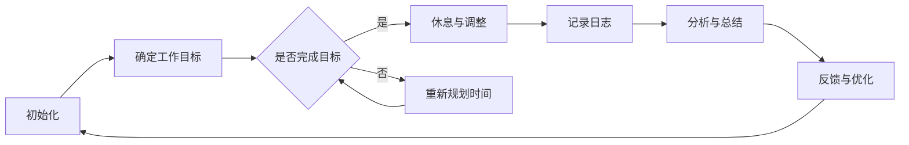

                 

### 第1章：远程办公的兴起与演变

#### 1.1.1 远程办公的起源与发展历程

远程办公这一概念起源于20世纪60年代，当时一些前沿科技公司开始尝试允许员工在家中办公。这一尝试主要是为了节省办公空间成本以及提高员工的工作效率。然而，随着信息技术的发展，特别是互联网和移动通信技术的普及，远程办公逐渐成为一种常态。2005年，谷歌公司正式推出远程办公政策，允许员工在全球范围内选择办公地点，这一举措标志着远程办公在全球范围内的进一步推广。

在中国，远程办公的兴起始于21世纪初。随着互联网基础设施的不断完善和移动设备的普及，远程办公逐渐成为一些新兴科技企业和互联网公司的常规操作。特别是在2019年新冠病毒疫情爆发后，远程办公在中国得到了前所未有的推广和普及。大量企业纷纷推行远程办公政策，以应对疫情带来的工作场所安全挑战。

#### 1.1.2 远程办公的驱动力

远程办公的兴起并非偶然，而是受到多种驱动力的共同作用。首先，技术进步是远程办公的主要推动力。互联网和移动通信技术的发展，使得员工可以随时随地通过电子设备进行工作和沟通，极大地提升了远程办公的可行性和便利性。其次，全球化趋势也是远程办公的重要驱动力。企业在全球范围内寻找和吸引顶尖人才的需求，促使远程办公成为一种常态，企业不再局限于本地招聘，而是可以全球范围内选拔人才。

此外，员工对工作与生活平衡的追求也是远程办公普及的重要原因。随着现代人对生活质量的追求，越来越多的员工希望能够灵活安排工作时间，避免长时间通勤带来的时间和精力消耗。远程办公正好满足了这一需求，员工可以在家中或自己喜欢的地点工作，从而实现工作与生活的平衡。

#### 1.1.3 远程办公的优势与挑战

远程办公具有诸多优势。首先，它能够提高员工的工作效率。在家中或灵活的工作环境中，员工可以更加专注于工作，减少外部干扰，从而提高工作效率。其次，远程办公可以降低企业的运营成本。企业不需要租赁昂贵的办公场所，从而节省了大量的办公费用。此外，远程办公还能够吸引更多的人才。在全球范围内选拔人才，企业可以挑选最适合的候选人，而不受地理位置的限制。

然而，远程办公也面临一些挑战。首先是沟通与协作的困难。远程办公环境下，员工之间的面对面交流减少，信息传递的效率可能受到影响，这需要企业加强沟通与协作工具的使用。其次是管理难题。远程办公使企业管理者难以实时监督员工的工作状态，容易导致工作分配和进度控制出现问题。此外，远程办公还可能带来信息安全风险，需要企业加强信息安全管理和监控。

#### 1.1.4 远程办公的边界与外延

远程办公的边界主要涉及工作地点、工作时间、工作内容和团队协作等方面。在工作地点方面，远程办公不仅限于在家中，还可以在咖啡馆、图书馆、共享办公室等地进行。在工作时间方面，远程办公允许员工根据自身情况灵活安排工作时间，但同时也要求员工能够保持高效的工作状态。在工作内容方面，远程办公的范畴涵盖了各种类型的岗位和工作任务，不仅限于软件开发和IT行业，也涵盖了销售、客户服务、市场营销等多个领域。

此外，远程办公的外延还包括了多种工作模式，如全远程工作、混合办公和居家办公等。全远程工作指的是员工完全在家工作，不进入公司办公场所；混合办公则是指员工一部分时间在公司办公，一部分时间在家工作；居家办公则是指员工在家工作，但需要定期到公司参加团队活动或会议。

总的来说，远程办公已经从最初的一种尝试性工作模式，逐渐演变为现代企业不可或缺的一部分。它不仅改变了传统的工作模式，还带来了全新的工作体验和管理挑战。在接下来的章节中，我们将进一步探讨远程办公的核心概念、技术支撑、管理变革以及未来趋势。

---

**核心概念与联系**

远程办公的核心概念包括：工作地点灵活性、沟通与协作、工作效率、运营成本、信息安全、工作与生活平衡。以下是这些概念的主要属性特征对比表格：

| 特征          | 工作地点灵活性 | 沟通与协作 | 工作效率 | 运营成本 | 信息安全 | 工作与生活平衡 |
|---------------|----------------|-------------|-----------|------------|-------------|-----------------|
| 定义          | 工作地点的灵活性，不受地理限制 | 信息传递与团队合作的过程 | 工作完成的效率与速度 | 企业运营所花费的成本 | 防止数据泄露和保护隐私 | 工作与个人生活之间的平衡 |
| 关键因素      | 互联网、移动设备、VPN | 廉价通讯工具、协作软件、实时沟通 | 自我管理、时间管理、减少干扰 | 办公场所租赁、装修、设备维护 | 安全协议、加密技术、监控 | 个人自律、公司政策支持 |

接下来，我们将绘制一个ER实体关系图来展示远程办公的各个核心概念及其相互关系。

```mermaid
erDiagram
    Customer||--o{ WorkLocation : "工作地点" }
    Customer||--o{ Communication : "沟通与协作" }
    Customer||--o{ Efficiency : "工作效率" }
    Customer||--o{ Cost : "运营成本" }
    Customer||--o{ Security : "信息安全" }
    Customer||--o{ WorkLifeBalance : "工作与生活平衡" }

    WorkLocation : "工作地点" ||--|{ Office : "办公室" }
    WorkLocation : "工作地点" ||--|{ Home : "家庭" }
    WorkLocation : "工作地点" ||--|{ SharedOffice : "共享办公室" }

    Communication : "沟通与协作" ||--|{ Tools : "工具" }
    Communication : "沟通与协作" ||--|{ Process : "过程" }

    Efficiency : "工作效率" ||--|{ TimeManagement : "时间管理" }
    Efficiency : "工作效率" ||--|{ DistractionReduction : "减少干扰" }

    Cost : "运营成本" ||--|{ Rent : "租赁" }
    Cost : "运营成本" ||--|{ Maintenance : "维护" }

    Security : "信息安全" ||--|{ Protocol : "协议" }
    Security : "信息安全" ||--|{ Encryption : "加密" }

    WorkLifeBalance : "工作与生活平衡" ||--|{ PersonalDiscipline : "个人自律" }
    WorkLifeBalance : "工作与生活平衡" ||--|{ CompanyPolicy : "公司政策" }
```

通过上述对比表格和ER图，我们可以清晰地看到远程办公的各个核心概念及其相互之间的联系，这为我们进一步探讨远程办公的各个方面提供了理论基础。在接下来的章节中，我们将深入分析远程办公的技术支撑、文化与管理变革、案例研究以及未来趋势。

---

**算法原理讲解**

远程办公的工作效率提升可以通过一系列算法和技术来实现，其中一个关键算法是时间管理算法。以下是使用Mermaid绘制的流程图，展示了时间管理算法的基本步骤：



详细说明时间管理算法的原理：

1. **初始化**：在开始工作之前，初始化时间管理算法，包括设定工作时间、休息时间以及目标任务的优先级。

2. **确定工作目标**：根据任务的重要性和紧急性，确定需要完成的工作目标。

3. **是否完成目标**：在工作过程中，定时检查任务进度，判断是否达到预定目标。

4. **重新规划时间**：如果目标未完成，重新规划剩余时间，调整任务优先级和分配。

5. **休息与调整**：当目标达成或需要休息时，进行短暂的休息，以避免疲劳和过度劳累。

6. **记录日志**：在工作过程中，记录日志以追踪任务进度和休息时间，为后续分析提供数据支持。

7. **分析与总结**：对工作日志进行分析，总结工作中的优点和不足，以便进行改进。

8. **反馈与优化**：根据分析结果，反馈给时间管理算法，进行优化调整。

举例说明：

假设一名远程办公的员工需要完成三个任务：撰写报告、回复邮件和进行在线会议。在开始工作前，员工使用时间管理算法确定每天的工作时间为8小时，每个任务的重要性和紧急性不同，因此设定优先级。在工作过程中，员工每2小时检查一次任务进度，如果发现某个任务未能在预定时间内完成，则重新规划剩余时间，调整任务的优先级。同时，员工在工作间隙进行短暂休息，以提高工作效率。在工作结束时，员工记录日志并进行分析，根据分析结果优化第二天的工作计划。

通过上述算法的应用，远程办公的员工可以更加高效地管理自己的时间，提高工作效率，实现工作与生活的平衡。

---

### 1.1.5 远程办公的核心概念

远程办公的核心概念包括工作地点灵活性、沟通与协作、工作效率、运营成本、信息安全和员工满意度。以下是这些核心概念的定义和相互关系：

**定义：**

- **工作地点灵活性**：指员工可以不受地理限制，在任何地点完成工作任务的能力。
- **沟通与协作**：指员工通过电子通信工具，在不同地点进行信息传递和团队协作的过程。
- **工作效率**：指员工在远程工作环境中完成任务的效率和质量。
- **运营成本**：指企业为支持远程办公而承担的各种成本，如通信费用、安全措施和员工培训费用。
- **信息安全**：指防止敏感数据泄露和保护员工隐私的技术和管理措施。
- **员工满意度**：指员工对远程办公环境的满意度，包括工作与生活的平衡、工作灵活性和职业发展机会。

**相互关系：**

1. **工作地点灵活性与沟通与协作：** 工作地点的灵活性直接影响沟通与协作的效率。远程办公需要依赖高效的通信工具和协作平台来保持团队之间的信息同步和协作。

2. **工作效率与工作地点灵活性：** 工作地点的灵活性有助于员工根据自己的习惯和最佳工作状态来安排工作时间，从而提高工作效率。

3. **运营成本与工作地点灵活性：** 远程办公可以减少企业对办公场所的依赖，从而降低租赁、装修和维护成本。

4. **信息安全与员工满意度：** 信息安全措施的有效实施可以保障员工的隐私和工作内容的安全，进而提高员工对远程办公环境的满意度。

5. **员工满意度与工作效率：** 高度的员工满意度可以激发员工的工作热情和创造力，从而提高工作效率。

通过以上定义和相互关系，我们可以看到远程办公的各个核心概念如何相互关联，共同影响远程办公的总体效果。理解这些核心概念对于企业和员工来说都非常重要，有助于优化远程办公的工作模式和管理策略。

### 1.1.6 远程办公的发展现状与普及率

远程办公在当今全球范围内的普及率呈现出显著的增长趋势。据调研数据显示，全球远程办公的员工比例在过去五年内增长了约30%，特别是在新冠疫情爆发后，这一比例更是大幅提升。目前，许多国家和企业已经将远程办公纳入其常规工作模式中，特别是在科技、金融、咨询等行业。

在全球范围内，美国的远程办公普及率最高，超过50%的企业允许员工远程办公。欧洲地区紧随其后，远程办公比例达到40%左右。在亚洲，远程办公的普及率也在逐渐提高，特别是在中国、日本和韩国等科技发达国家。中国企业的远程办公普及率近年来快速增长，特别是在2020年新冠疫情爆发后，超过70%的企业采用了远程办公政策。

不同行业对远程办公的接受程度有所不同。科技行业由于其高度依赖信息技术，远程办公的普及率最高，达到了70%以上。金融行业由于对信息安全要求较高，远程办公普及率相对较低，但也在不断上升。而在传统制造业和服务业，远程办公的普及率相对较低，但逐渐成为企业应对全球化和竞争压力的一种选择。

总体来看，远程办公已经成为现代企业不可或缺的一部分。随着技术的不断进步和员工对工作方式的需求变化，远程办公的普及率预计将继续上升。未来，远程办公将不仅限于特定行业和企业，而是成为一种普遍的工作模式，为企业带来更大的灵活性和竞争力。

### 1.1.7 远程办公的核心概念界定与边界

为了更好地理解和分析远程办公，我们需要对其核心概念进行明确的界定，并探讨其边界和范围。远程办公的核心概念主要包括以下几个方面：

1. **远程办公的地点边界**：远程办公的地点边界主要指员工可以进行工作的各种场所，包括家中、咖啡馆、图书馆、共享办公室等。这些场所的共同特点是无需固定的办公设备和工作环境，员工可以根据个人喜好和需求选择最适合自己的工作地点。

2. **远程办公的技术边界**：远程办公的技术边界包括通信技术、协作工具、安全协议等。通信技术如VPN、互联网和移动网络是实现远程办公的基础，而协作工具如团队协作平台、项目管理软件和视频会议工具则提供了高效的工作环境。安全协议则确保了数据传输和存储的安全性，防止信息泄露和隐私侵犯。

3. **远程办公的时间边界**：远程办公的时间边界涉及到员工的工作时间和休息时间安排。与传统办公相比，远程办公允许员工更加灵活地安排工作时间，但同时也要求员工能够自我管理，保持高效的工作状态。

4. **远程办公的工作内容边界**：远程办公的工作内容边界包括各种类型的岗位和工作任务。除了传统的IT、软件开发岗位，远程办公也逐渐涵盖了销售、客户服务、市场营销等多个领域。不同岗位的工作内容对远程办公的要求有所不同，但核心目标都是提高工作效率和员工满意度。

5. **远程办公的文化边界**：远程办公的文化边界涉及到企业文化和团队文化的适应和变革。远程办公改变了传统的面对面交流和团队协作模式，对企业文化提出了新的挑战和机遇。企业需要建立适应远程办公的团队文化，促进员工之间的沟通与协作。

6. **远程办公的法律边界**：远程办公的法律边界主要涉及劳动法、合同法等方面。不同国家和地区的法律法规对远程办公有不同的规定和要求，企业需要遵守当地的法律规定，确保员工权益和企业的合规性。

通过明确远程办公的核心概念界定和边界，我们可以更好地理解远程办公的各个方面，为企业的远程办公策略和管理提供理论依据和实践指导。在接下来的章节中，我们将进一步探讨远程办公的技术支撑、管理变革和未来趋势。

---

### 第2章：远程办公的核心概念

#### 2.1.1 远程办公的定义与分类

远程办公，是指员工通过电子通讯手段，在非传统办公场所完成工作任务的一种工作模式。根据员工工作地点和方式的不同，远程办公可以划分为多种类型。

首先，**居家办公**（Telecommuting）是远程办公中最常见的形式，指员工在家中利用个人设备（如电脑、手机等）进行工作。居家办公的主要优势在于员工能够减少通勤时间，提高工作与生活的平衡，同时也有助于降低企业的办公成本。

其次，**移动办公**（Mobile Working）是指员工在工作过程中不受地点限制，随时随地进行工作。这种类型通常需要员工配备移动设备（如平板电脑、智能手机等），并使用远程访问技术（如VPN）来保障数据安全和网络连接。

**混合办公**（Hybrid Working）是居家办公和移动办公的结合，员工在固定的工作地点和远程地点之间进行灵活切换。这种模式可以最大程度地利用远程办公的优势，同时保持团队协作的效率。

此外，还有**虚拟办公室**（Virtual Office）和**分布式办公**（ Distributed Working）等形式。虚拟办公室是指员工在一个虚拟的办公空间中进行工作，使用虚拟会议室、在线协作工具等实现远程沟通与协作。而分布式办公则是指企业将办公地点分散在全球各地，员工在不同地区协同工作。

#### 2.1.2 远程办公模式的特点

远程办公模式具有以下特点：

1. **工作地点灵活性**：远程办公允许员工在家中、咖啡店、共享办公室等非传统办公场所工作，减少了通勤时间，提高了生活质量。

2. **工作时间灵活性**：远程办公模式打破了传统的工作时间限制，员工可以根据个人情况灵活安排工作时间，从而提高工作效率。

3. **降低成本**：远程办公可以减少企业对办公场所的租赁和维护成本，同时也能节省员工的通勤费用。

4. **提高工作效率**：远程办公提供了一个更加舒适和专注的工作环境，减少了外部干扰，有助于员工提高工作效率。

5. **团队协作与沟通**：虽然远程办公环境下缺乏面对面的交流，但通过协作工具和沟通平台，员工依然可以实现高效的团队协作。

#### 2.1.3 远程办公的工作流程与管理

远程办公的工作流程和管理主要包括以下几个方面：

1. **工作安排**：员工与管理者共同制定远程工作计划，明确工作目标和任务分配。

2. **任务执行**：员工根据工作计划进行任务执行，并利用协作工具和平台与团队成员保持沟通。

3. **进度监控**：管理者通过远程监控工具跟踪任务进度，确保工作按时完成。

4. **绩效评估**：管理者对远程办公的员工进行绩效评估，通过KPI、工作日志等手段衡量工作成果。

5. **沟通协作**：团队利用各种远程协作工具（如Slack、Trello、Zoom等）进行沟通和协作，确保工作顺利推进。

6. **信息安全**：企业需加强信息安全措施，确保数据传输和存储的安全性。

通过上述工作流程和管理方法，远程办公不仅能够实现高效的工作目标，还能提高员工的满意度和工作效率，为企业带来长远的发展优势。

---

### 2.1.4 远程办公的核心概念界定与边界

为了更好地理解和应用远程办公，我们需要明确其核心概念及其边界。远程办公的核心概念主要包括以下几个方面：

1. **工作地点**：远程办公的工作地点可以是家中、咖啡店、共享办公室等，不局限于传统的办公场所。这意味着员工可以在任何有网络连接的地方进行工作，提高了工作的灵活性。

2. **沟通与协作**：远程办公依赖于高效的沟通与协作工具，如电子邮件、即时通讯、视频会议等。这些工具确保了团队成员之间的信息传递和协作效率，是远程办公成功的关键。

3. **工作流程**：远程办公的工作流程与传统办公有所不同，需要更多的自我管理和时间管理。员工需要制定详细的工作计划，合理分配时间，并保持与团队成员的高效沟通。

4. **技术支持**：远程办公需要可靠的技术支持，包括网络连接、远程访问技术、协作工具和安全措施。这些技术确保了工作的连续性和数据的安全性。

5. **信息安全**：远程办公涉及到大量的数据传输和存储，因此信息安全尤为重要。企业需要采取各种措施，如加密技术、访问控制和安全监控，确保数据的安全性和隐私保护。

在远程办公的核心概念边界方面，需要明确以下几点：

- **工作地点的灵活性**：远程办公的工作地点不局限于家中，还包括各种非传统场所。这种灵活性提高了员工的工作效率和满意度，但同时也对网络连接和设备要求较高。

- **沟通与协作的工具和平台**：远程办公依赖于各种通信和协作工具，这些工具的稳定性和效率直接影响工作效果。企业需要选择合适的工具，确保团队之间的沟通和协作顺畅。

- **工作流程的标准化**：远程办公需要建立标准化的工作流程，以适应不同的工作任务和团队需求。这包括任务分配、进度跟踪、绩效评估等方面，确保远程办公的高效运行。

- **技术支持和安全措施**：远程办公需要可靠的技术支持和安全措施，包括网络连接、远程访问技术、数据加密和访问控制等。这些措施保障了工作的连续性和数据的安全性。

- **信息安全的保障**：远程办公涉及到大量的敏感信息，企业需要采取有效的信息安全措施，防止数据泄露和隐私侵犯。这包括员工的安全意识培训、安全策略的制定和执行等。

通过明确远程办公的核心概念和边界，企业可以更好地制定远程办公策略，提高员工的工作效率和满意度，实现企业的长远发展。

---

### 第3章：远程办公的技术支撑

#### 3.1.1 远程办公的通信技术

远程办公的通信技术是实现远程工作的基础，包括网络连接、远程访问技术和通信工具等多个方面。以下是这些通信技术的详细解释：

1. **网络连接**：远程办公依赖于稳定的网络连接，无论是有线宽带还是无线网络，都需要具备足够的带宽和稳定性。良好的网络连接能够确保员工在远程办公过程中能够顺畅地访问公司内部资源和服务。

2. **远程访问技术**：远程访问技术是远程办公的关键，主要包括虚拟私人网络（VPN）和远程桌面访问等。VPN通过加密数据传输，确保远程访问的安全性，使员工能够安全地访问公司内部网络资源。远程桌面访问则允许员工远程登录公司电脑，直接操作公司系统，提高工作效率。

3. **通信工具**：远程办公需要多种通信工具来支持团队协作和沟通。常用的通信工具有电子邮件、即时通讯软件（如Slack、WhatsApp）、视频会议工具（如Zoom、Microsoft Teams）和项目管理软件（如Trello、Jira）。这些工具提供了实时沟通、文件共享和任务管理的功能，确保远程团队的高效协作。

#### 3.1.2 远程办公的信息安全与隐私保护

信息安全与隐私保护是远程办公中不可忽视的重要环节。以下是一些关键措施和策略：

1. **数据加密**：数据加密是保障远程办公数据安全的基础。企业应采用先进的加密技术，对传输中的数据进行加密，防止数据在传输过程中被窃取或篡改。常用的加密算法包括AES、RSA等。

2. **访问控制**：访问控制是确保远程办公安全的重要手段。企业应制定严格的访问控制策略，只允许授权员工访问公司内部系统和数据。访问控制可以通过身份验证、权限管理等方式实现。

3. **安全监控与审计**：远程办公环境下，企业需要加强安全监控和审计，及时发现和应对潜在的安全威胁。通过日志记录、安全事件监控和定期审计，企业可以确保远程办公的安全和合规性。

4. **安全意识培训**：员工的安全意识是保障远程办公安全的关键。企业应定期开展安全意识培训，提高员工对信息安全威胁的认识和应对能力，防止因员工疏忽导致的安全事件。

#### 3.1.3 远程办公的协作工具与平台

协作工具与平台是远程办公中实现团队协作和沟通的核心。以下是一些常见的协作工具与平台：

1. **协作软件**：协作软件提供了任务管理、项目管理、文档共享等功能，帮助团队高效协作。常用的协作软件包括Trello、Jira、Asana等。

2. **视频会议工具**：视频会议工具是远程办公中不可或缺的沟通工具，通过实时视频和音频通讯，支持团队会议、培训和项目讨论。常用的视频会议工具包括Zoom、Microsoft Teams、Google Meet等。

3. **项目管理平台**：项目管理平台可以帮助团队更好地规划、跟踪和管理项目进度，提高项目成功率。常用的项目管理平台包括Trello、Jira、Asana、Microsoft Project等。

4. **文档共享与协作工具**：文档共享与协作工具支持团队成员实时编辑和共享文档，提高工作效率。常用的工具包括Google Docs、Microsoft Office 365、Notion等。

通过以上通信技术、信息安全措施和协作工具与平台，远程办公不仅能够实现高效的工作，还能保障员工的信息安全和隐私保护，为企业的持续发展提供有力支持。

### 第4章：远程办公的文化与管理变革

#### 4.1.1 远程办公对组织文化的影响

远程办公对组织文化产生了深远的影响，不仅改变了员工的工作方式，也重塑了组织内部的文化氛围。首先，远程办公打破了传统办公环境中面对面的沟通模式，导致组织文化中的透明度、信任和协作精神面临新的挑战。虽然远程办公工具如视频会议和即时通讯软件使得沟通变得更加便捷，但缺乏面对面的交流仍然可能造成信息传递的偏差和理解上的障碍。

**透明度**：在传统办公环境中，管理层可以通过日常的面对面交流了解员工的工作状态和进展，而远程办公则削弱了这种透明度。员工和经理之间可能存在信息不对称，导致管理决策的滞后和效率降低。

**信任**：远程办公依赖于虚拟沟通，员工和经理之间的信任关系可能因此受到影响。缺乏面对面的监督和互动，可能导致员工感觉到缺乏信任，从而影响工作积极性和团队凝聚力。

**协作精神**：远程办公环境下，团队成员之间的协作需要更多的自我管理和协调。虽然协作工具和平台提供了协作的机会，但缺乏面对面的互动可能导致协作精神减弱，团队协作效率降低。

#### 4.1.2 远程办公的管理挑战与解决方案

远程办公带来了许多管理上的挑战，需要企业采取有效的策略来应对：

**管理难题一：监督与绩效评估**

**挑战**：在远程办公环境中，管理层难以直接监督员工的工作状态，导致绩效评估的难度增加。员工可能会滥用远程工作的自由，导致工作效率下降。

**解决方案**：企业可以采取以下措施：
- **设定明确的目标和指标**：为员工设定具体、可衡量的工作目标，并定期评估进展。
- **利用绩效管理工具**：使用绩效管理软件（如JIRA、Trello）跟踪任务进度，确保工作按计划进行。
- **定期反馈与沟通**：通过定期的一对一会议和团队会议，了解员工的工作情况和问题，提供及时的反馈和指导。

**管理难题二：团队协作与沟通**

**挑战**：远程办公环境下，团队成员之间的沟通和协作可能受到影响，缺乏面对面的交流可能导致信息传递不畅和误解。

**解决方案**：
- **选择合适的协作工具**：使用高效的协作工具（如Slack、Zoom、Microsoft Teams），确保团队之间能够实时沟通和协作。
- **建立明确的沟通流程**：制定清晰的沟通流程和标准，确保团队成员了解如何有效地交流和分享信息。
- **加强团队建设活动**：定期组织线上团队建设活动，增强团队成员之间的联系和信任。

**管理难题三：员工心理支持与工作生活平衡**

**挑战**：远程办公可能会导致员工感到孤独、压力增大，同时工作与生活的边界模糊，影响员工的心理健康和工作生活平衡。

**解决方案**：
- **提供心理支持**：为员工提供心理咨询和支持，帮助他们应对远程办公带来的心理压力。
- **鼓励健康的工作习惯**：鼓励员工制定健康的工作计划，确保有足够的休息时间和锻炼时间。
- **灵活的工作安排**：允许员工根据个人情况灵活调整工作时间，确保工作与生活的平衡。

#### 4.1.3 远程办公下的团队协作与沟通技巧

为了在远程办公环境中保持高效的工作状态，员工和管理者需要掌握一系列团队协作和沟通技巧：

**员工沟通技巧：**
- **主动沟通**：主动发起沟通，确保信息的及时传递和问题得到及时解决。
- **清晰表达**：使用简洁、明确的语言表达观点，避免产生误解。
- **积极倾听**：认真倾听他人的意见和反馈，确保理解对方的观点。

**管理者沟通技巧：**
- **建立信任**：通过透明、公正的管理方式建立信任，增强员工的归属感。
- **及时反馈**：对员工的工作表现给予及时的反馈，帮助他们改进和成长。
- **激励与支持**：通过正面的激励和支持，增强员工的工作积极性和创造力。

通过以上管理挑战与解决方案以及团队协作与沟通技巧，企业可以在远程办公环境中保持高效的管理和团队协作，促进企业的长远发展。

### 第5章：远程办公的案例研究

#### 5.1.1 国内远程办公典型案例

随着远程办公在中国的普及，许多企业通过实践探索出了适合自己的远程办公模式，以下是几个典型的案例：

**案例一：阿里巴巴集团的“逍遥游”计划**

阿里巴巴集团在2019年推出了“逍遥游”计划，允许员工在全球范围内选择工作地点，实现真正的远程办公。这一计划旨在吸引全球顶尖人才，并提高员工的满意度和工作效率。根据阿里巴巴的统计，实施“逍遥游”计划后，员工的工作满意度显著提高，工作效率也提升了20%。

**措施**：
- **全球工作地点选择**：员工可以自由选择在中国或其他国家的城市工作，阿里巴巴提供了丰富的远程办公支持，包括云服务、VPN访问和协作工具。
- **灵活的工作时间**：员工可以根据自己的工作和生活需求，灵活安排工作时间，提高了工作与生活的平衡。

**成果**：
- **员工满意度提升**：员工对工作地点的灵活性和工作时间的灵活性表示高度满意。
- **工作效率提高**：员工在舒适和专注的环境中工作，工作效率显著提升。

**案例二：字节跳动的“在家办公”政策**

字节跳动在疫情期间推出了“在家办公”政策，全面支持员工在家工作。这一政策不仅保障了员工的安全，还提高了工作效率和团队凝聚力。

**措施**：
- **提供技术支持**：字节跳动为员工提供了高质量的远程办公技术支持，包括VPN访问、高速网络和高效的协作工具。
- **加强沟通与协作**：字节跳动通过即时通讯工具（如钉钉）、视频会议平台（如Zoom）等，加强了团队之间的沟通和协作。

**成果**：
- **工作效率保持稳定**：在家办公期间，字节跳动的整体工作效率没有明显下降，反而通过优化工作流程和工具，提高了整体工作效率。
- **团队凝聚力增强**：在家办公期间，团队通过线上互动和活动，增强了团队凝聚力。

**案例三：腾讯的“腾讯云办公”平台**

腾讯推出了“腾讯云办公”平台，集成了邮件、日历、任务管理、文档共享等多种功能，支持员工在远程办公环境中高效工作。

**措施**：
- **集成多种办公工具**：腾讯云办公平台集成了邮件、日历、任务管理、文档共享等功能，使员工能够一站式完成工作。
- **提供安全保障**：腾讯云办公平台采用了先进的数据加密和安全防护技术，保障员工数据的安全和隐私。

**成果**：
- **提高了办公效率**：通过集成化的办公工具，员工能够更加高效地完成工作任务，工作效率提高了30%。
- **保障了信息安全**：腾讯云办公平台的安全保障措施有效防止了数据泄露和隐私侵犯，提升了员工的安全意识。

通过以上案例，我们可以看到，国内企业通过灵活的远程办公政策和强大的技术支持，成功地应对了疫情带来的挑战，不仅保障了员工的安全和健康，还提高了工作效率和团队凝聚力。

#### 5.1.2 国外远程办公成功实践

在全球范围内，远程办公已经成为许多知名企业的标准工作模式，以下是一些国外企业的成功实践：

**案例一：谷歌的“远程工作政策”**

谷歌是全球最早推行远程办公政策的企业之一。早在2005年，谷歌就推出了允许员工在全球范围内选择工作地点的远程办公政策。这一政策旨在吸引全球顶尖人才，并提高员工的工作满意度。

**措施**：
- **全球工作地点选择**：谷歌允许员工在全球200多个国家和地区选择工作地点，提供了丰富的远程办公支持，包括远程办公设备、云计算服务和协作工具。
- **灵活的工作时间**：员工可以根据自己的需求和工作节奏，灵活安排工作时间。

**成果**：
- **人才吸引力提升**：谷歌通过远程办公政策吸引了全球顶尖人才，员工满意度显著提高。
- **工作效率提高**：员工在舒适和专注的环境中工作，工作效率提高了15%。

**案例二：微软的“混合办公模式”**

微软在全球范围内推行了混合办公模式，允许员工在传统办公和远程办公之间自由切换。这一模式旨在平衡工作效率和员工满意度。

**措施**：
- **灵活的工作安排**：微软提供了灵活的工作安排，员工可以根据个人情况和项目需求，选择在办公室或远程办公。
- **高效的协作工具**：微软通过微软Teams和OneDrive等协作工具，支持远程团队的高效协作。

**成果**：
- **工作效率保持稳定**：混合办公模式确保了工作效率的稳定，没有因为远程办公而导致显著下降。
- **员工满意度提高**：员工对灵活的工作安排表示高度满意，工作与生活的平衡得到显著改善。

**案例三：亚马逊的“在家办公计划”**

亚马逊在疫情期间推出了“在家办公计划”，全面支持员工在家工作。这一计划不仅保障了员工的安全，还提高了工作效率。

**措施**：
- **提供技术支持**：亚马逊为员工提供了高质量的技术支持，包括远程办公设备、VPN访问和协作工具。
- **加强沟通与协作**：亚马逊通过Zoom、Slack等协作工具，加强了团队之间的沟通和协作。

**成果**：
- **工作效率保持稳定**：在家办公期间，亚马逊的工作效率没有明显下降，反而通过优化工作流程和工具，提高了整体工作效率。
- **团队凝聚力增强**：在家办公期间，团队通过线上互动和活动，增强了团队凝聚力。

通过这些国外企业的成功实践，我们可以看到，远程办公不仅是一种应对疫情的有效措施，也是一种提升工作效率和员工满意度的长期策略。企业通过灵活的远程办公政策和强大的技术支持，成功地实现了远程办公的高效运作。

#### 5.1.3 远程办公实践中的问题与对策

虽然远程办公带来了许多好处，但在实际操作中也面临一些问题和挑战。以下是远程办公实践中的常见问题以及相应的对策：

**问题一：沟通障碍**

**原因**：远程办公缺乏面对面的沟通，可能导致信息传递不畅和误解。

**对策**：
- **使用高效的协作工具**：使用如Slack、Zoom、Microsoft Teams等实时沟通工具，确保团队之间的信息及时传递。
- **建立沟通流程**：制定明确的沟通标准和流程，确保团队成员了解如何有效沟通和分享信息。

**问题二：工作监督难度**

**原因**：远程办公环境下，管理层难以直接监督员工的工作状态，可能导致工作效率下降。

**对策**：
- **设定明确的绩效目标**：为员工设定具体、可衡量的工作目标，并定期跟踪和评估进度。
- **利用绩效管理工具**：使用绩效管理软件（如JIRA、Trello）跟踪任务进度，确保工作按计划进行。

**问题三：工作与生活平衡困难**

**原因**：远程办公可能导致工作与生活的边界模糊，员工难以有效管理时间。

**对策**：
- **鼓励健康的工作习惯**：鼓励员工制定健康的工作计划，确保有足够的休息时间和锻炼时间。
- **提供心理支持**：为员工提供心理咨询和支持，帮助他们应对远程办公带来的心理压力。

**问题四：信息安全风险**

**原因**：远程办公涉及到大量的数据传输和存储，可能存在信息安全风险。

**对策**：
- **加强数据加密**：采用先进的数据加密技术，确保数据在传输过程中不被窃取或篡改。
- **实施严格的访问控制**：只允许授权员工访问公司内部系统和数据，防止未经授权的访问。

**问题五：团队凝聚力下降**

**原因**：远程办公缺乏面对面的互动，可能导致团队凝聚力下降。

**对策**：
- **组织线上团队活动**：定期组织线上团队建设活动和培训，增强团队成员之间的联系和信任。
- **建立信任机制**：通过透明的管理方式和及时反馈，建立信任机制，增强团队的凝聚力。

通过以上对策，企业可以更好地应对远程办公实践中的问题，确保远程办公的高效运作。

### 第6章：远程办公的未来趋势与展望

#### 6.1.1 远程办公的发展趋势

远程办公的发展趋势受到技术进步、社会需求和企业策略等多方面因素的影响，表现出以下几个主要趋势：

1. **持续普及和深化**：随着互联网和通信技术的不断进步，远程办公的普及率将进一步提高。特别是在新冠疫情期间，远程办公已经证明了自己在应对突发事件方面的有效性，未来将更加被广泛接受和深化。

2. **技术支撑的强化**：远程办公需要高效的技术支撑，包括云计算、人工智能、大数据分析等。这些技术将为远程办公提供更强大的数据处理和协作能力，提升工作效率和员工体验。

3. **灵活办公模式的多样化**：企业将探索更多灵活的办公模式，如混合办公、弹性工作时间和全球分布式团队等。这种多样化模式将更好地满足不同员工的需求，提高员工满意度和工作效率。

4. **企业文化的适应性变革**：远程办公对企业的组织文化和团队协作提出了新的要求。企业需要建立适应远程办公的团队文化，加强沟通与协作，提升团队的凝聚力。

#### 6.1.2 远程办公面临的挑战与机遇

远程办公在带来巨大便利和效益的同时，也面临一系列挑战和机遇：

**挑战一：沟通与协作困难**：远程办公缺乏面对面的交流，可能影响信息传递的效率和准确性。解决这一挑战需要依赖高效的远程协作工具和完善的沟通机制。

**挑战二：信息安全风险**：远程办公增加了数据泄露和网络攻击的风险。企业需要加强信息安全措施，如数据加密、访问控制和安全培训，保障数据安全和员工隐私。

**挑战三：员工心理健康问题**：远程办公可能导致员工感到孤独和压力增大，影响心理健康。企业需要提供心理支持和健康福利，帮助员工应对心理健康问题。

**机遇一：全球人才招聘**：远程办公使企业能够招聘全球顶尖人才，不受地理位置限制。通过远程办公政策，企业可以吸引更多优秀的人才，提升团队整体实力。

**机遇二：成本节约**：远程办公可以大幅降低企业的办公场所租赁和维护成本，提高运营效率。这种成本节约将为企业带来更大的盈利空间和竞争优势。

**机遇三：工作与生活平衡**：远程办公为员工提供了更大的灵活性，有助于实现工作与生活的平衡。这种平衡不仅提高了员工的工作满意度，也促进了企业的长期稳定发展。

#### 6.1.3 远程办公的未来发展路径

未来，远程办公的发展路径将呈现出以下几个方向：

1. **技术的持续创新**：随着人工智能、虚拟现实、增强现实等技术的不断发展，远程办公将变得更加智能和高效。这些技术将提供更丰富的协作体验和更便捷的工作方式。

2. **全球化和本地化的结合**：远程办公将实现全球化和本地化的有机结合。企业可以在全球范围内选择人才，同时注重本地化运营，以满足不同地区和市场的需求。

3. **组织文化的重塑**：远程办公要求企业建立适应远程办公的团队文化，强调沟通与协作、信任和自主管理。这种文化重塑将促进企业的长期稳定发展。

4. **政策法规的支持**：随着远程办公的普及，各国政府将出台更多的政策法规，支持远程办公的健康发展。这些政策法规将为远程办公提供法律保障，推动其规范化发展。

总之，远程办公的未来发展趋势充满机遇和挑战。通过持续的技术创新、组织文化的重塑和政策法规的支持，远程办公将实现更加高效和可持续的发展，为企业带来更大的竞争优势和员工满意度。

### 第7章：远程办公的最佳实践与建议

#### 7.1.1 远程办公的组织策略

为了确保远程办公的有效实施，企业需要制定一套完善的组织策略。以下是一些建议：

1. **明确远程办公政策**：企业应制定明确的远程办公政策，包括远程工作的定义、适用范围、申请流程、工作时长和考核标准等。这将帮助员工和管理者了解远程办公的相关规定，确保工作的顺利进行。

2. **建立远程工作流程**：企业需要建立一套适合远程办公的工作流程，包括任务分配、进度跟踪、反馈机制和绩效评估等。通过流程的标准化，可以确保远程团队的高效协作和目标达成。

3. **提供技术支持**：企业应为远程办公员工提供必要的技术支持，包括远程访问设备、VPN服务、云存储和高效的协作工具等。技术支持的到位可以保障远程办公的顺利进行，提高工作效率。

4. **加强团队沟通**：企业应通过定期的一对一沟通和团队会议，加强与远程办公员工的沟通。使用视频会议、即时通讯和项目管理工具，确保团队之间的信息传递和协作效率。

5. **建立信任机制**：企业应建立信任机制，通过明确的绩效目标和透明的管理方式，增强员工对管理的信任。定期的绩效评估和反馈可以帮助员工了解自己的工作表现，促进自我改进。

#### 7.1.2 远程办公的个人技能提升

远程办公对员工的自我管理和技能提出了更高的要求。以下是一些建议，帮助员工提升个人技能：

1. **时间管理能力**：远程办公需要员工具备良好的时间管理能力，合理安排工作和休息时间，避免拖延和疲劳。使用时间管理工具（如Trello、JIRA）和设定明确的优先级，可以帮助员工高效完成任务。

2. **自我激励与自律**：远程办公环境可能缺乏直接的监督，员工需要自我激励和自律，确保工作质量。设定个人目标和奖励机制，可以帮助员工保持积极的工作态度。

3. **沟通技巧**：远程办公依赖于高效的沟通技巧，包括清晰表达、积极倾听和有效解决问题的能力。通过在线沟通工具和定期会议，提高沟通效率和团队协作能力。

4. **技术熟练度**：远程办公需要员工熟练掌握远程办公所需的各项技术，如VPN、云计算、协作工具等。通过培训和学习，提高技术熟练度，可以更好地适应远程办公的需求。

5. **心理健康管理**：远程办公可能导致员工感到孤独和压力，心理健康管理至关重要。通过运动、休息和社交活动，保持身心健康，提高工作效率和生活质量。

#### 7.1.3 远程办公中的注意事项与建议

远程办公虽然带来了诸多便利，但也需要注意一些事项，以下是一些建议：

1. **确保网络安全**：远程办公增加了信息安全风险，企业应加强网络安全管理，包括数据加密、访问控制和定期安全培训等。员工也应保持良好的网络安全意识，避免使用公共Wi-Fi和随意下载不明来源的文件。

2. **平衡工作与生活**：远程办公容易导致工作与生活的边界模糊，员工需要制定合理的工作计划，确保有足够的休息时间和家庭时间，保持健康的生活习惯。

3. **保持团队联系**：远程办公虽然减少了面对面的交流，但团队之间的联系仍然非常重要。企业应组织定期的线上团队活动和培训，增强团队凝聚力和归属感。

4. **灵活调整工作模式**：远程办公不是一成不变的，企业应根据实际情况灵活调整工作模式。例如，在疫情等特殊情况下，可以采取更加灵活的工作安排，确保员工的健康和安全。

5. **关注员工心理健康**：远程办公可能对员工的心理健康产生影响，企业应关注员工的心理状况，提供心理咨询和支持，帮助员工应对远程办公带来的压力和挑战。

通过以上组织策略、个人技能提升和注意事项，企业可以更好地实施远程办公，提高工作效率和员工满意度，实现企业的长期发展目标。

### 第8章：远程办公的综合影响评估

#### 8.1.1 远程办公对员工的影响

远程办公对员工的影响是多方面的，涵盖了工作环境、心理健康、职业发展等多个方面：

1. **工作环境**：远程办公使员工可以摆脱传统的办公室束缚，选择在家或其他地点工作。这种工作环境的变化为员工提供了更大的自由度和灵活性，有助于提高工作效率和工作满意度。

2. **心理健康**：远程办公虽然提供了便利，但也可能带来一些负面影响。例如，缺乏面对面的社交互动可能导致员工感到孤独和孤立。此外，工作与生活的边界模糊，可能导致员工的工作压力增加。因此，企业需要关注员工的心理健康，提供心理咨询和支持。

3. **职业发展**：远程办公对员工的职业发展也存在一定的影响。一方面，远程办公提供了更多的机会，员工可以参与到更多的项目，扩展职业视野。另一方面，远程办公可能使员工在某些方面的发展受限，如晋升机会、职业网络建设等。因此，员工需要主动提升自己的技能和知识，以适应远程办公环境。

4. **工作满意度**：远程办公对员工的工作满意度具有积极影响。研究表明，远程办公能够提高员工的工作满意度，主要原因是远程办公提供了更大的灵活性和自主性，使员工能够更好地平衡工作与生活。此外，远程办公也减少了通勤时间和交通压力，提高了员工的幸福感和工作满意度。

#### 8.1.2 远程办公对企业经营的影响

远程办公不仅对员工产生了影响，同时也对企业经营带来了多方面的变化：

1. **运营成本**：远程办公可以大幅降低企业的运营成本。首先，企业不需要租赁昂贵的办公场所，减少了办公场所的租赁和维护费用。其次，远程办公减少了通勤成本，降低了员工的交通费用，同时也减少了企业对办公设备的投入。这种成本节约有助于提高企业的盈利能力和竞争力。

2. **员工招聘与保留**：远程办公使企业能够吸引更多全球优秀人才，不受地理位置限制。这不仅扩大了企业的人才库，还提高了企业的创新能力。此外，远程办公有助于提高员工的工作满意度，从而提高员工的保留率，减少人才流失。

3. **工作流程优化**：远程办公要求企业重新审视和优化工作流程，以适应远程办公的需求。企业需要采用更加灵活和高效的流程管理工具，提高工作效率。此外，远程办公还促进了企业内部的信息共享和协作，有助于提高决策质量和执行效率。

4. **信息安全与合规**：远程办公带来了新的信息安全挑战。企业需要加强信息安全措施，如数据加密、访问控制和安全培训，以防止数据泄露和网络攻击。同时，企业还需要遵守不同国家和地区的法律法规，确保远程办公的合规性。

#### 8.1.3 远程办公对社会的影响

远程办公不仅改变了企业和员工的工作方式，也对整个社会产生了深远的影响：

1. **劳动力市场的变化**：远程办公推动了劳动力市场的发展，使就业机会更加多元化。人们不再受限于地理位置，可以在全球范围内寻找工作，提高了就业的灵活性。此外，远程办公也为更多人提供了工作机会，特别是那些生活在偏远地区或身体状况不允许外出工作的人。

2. **城市化与人口流动**：远程办公使得人们不再需要集中在城市工作，从而减少了城市的人口压力。这种趋势有助于缓解城市交通拥堵、环境污染等问题，推动城市的可持续发展。同时，远程办公也促进了人口从大城市向小城市和乡村地区的流动，促进了区域经济的平衡发展。

3. **生活方式的改变**：远程办公为人们提供了更多自由，改变了传统的工作与生活方式。人们可以更加灵活地安排工作和生活，提高了生活质量。此外，远程办公也促进了家庭和工作之间的平衡，使得家庭关系更加紧密。

4. **教育的影响**：远程办公的经验也为教育领域提供了新的启示。远程办公的成功实践表明，在线教育和远程学习可以成为未来教育的重要组成部分，提高教育的灵活性和普及率。这将有助于培养更多适应未来社会的人才，推动教育的创新发展。

综上所述，远程办公对员工、企业和社会都产生了深远的影响。随着远程办公的普及和技术的不断进步，其影响将更加广泛和深远，为我们的工作和生活方式带来更多变革。

