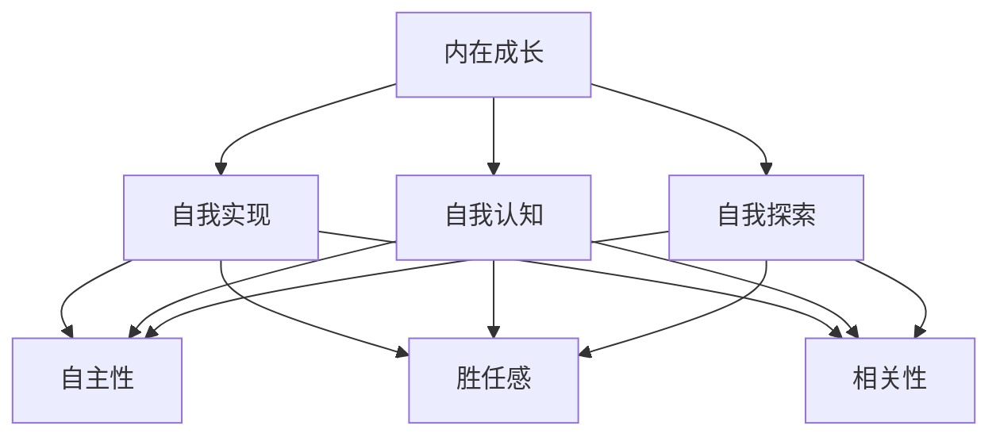
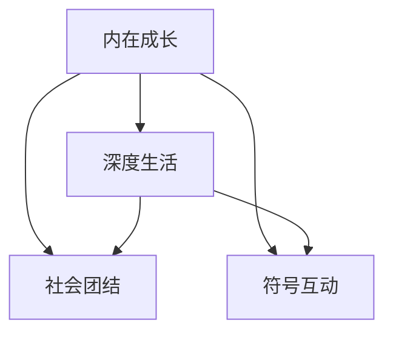

                 

### 追求内在成长：超越表面的深度生活

在当今快节奏、碎片化的社会中，人们往往被表面的繁荣和瞬息万变的信息所吸引，而忽视了内心深处真正的需求和成长。这种追求外在、忽视内在的生活状态，虽然带来了一时的满足和快感，但长远来看，却难以带来真正的幸福感和成就感。《追求内在成长：超越表面的深度生活》这本书，正是针对这一现象提出的深刻思考和解决方案。本书由AI天才研究院的专家撰写，结合心理学、哲学、社会学等多学科知识，旨在帮助读者认识到内在成长的重要性，并提供实现深度生活的具体方法和路径。

关键词：内在成长、深度生活、心理学、哲学、社会学

摘要：本文将围绕《追求内在成长：超越表面的深度生活》这本书的核心内容和主旨进行探讨，分析内在成长和深度生活的定义与重要性，阐述实现这两个目标的理论基础和实践方法，并通过案例分析展示具体的应用。同时，本文还将探讨如何通过深度交流和持续学习来实现更深层次的内在成长，最后对全书进行总结并展望未来的深度生活。

**目录大纲**

1. 引言
   1.1 书籍背景与主旨
   1.2 目标读者
   1.3 内在成长与深度生活的定义与重要性

2. 理论基础
   2.1 内在成长的心理学理论
   2.2 深度生活的哲学探讨
   2.3 社会学视角下的内在成长与深度生活

3. 实践方法
   3.1 深度阅读
   3.2 冥想与自我反思
   3.3 深度交流
   3.4 持续学习

4. 案例分析
   4.1 个人内在成长的故事
   4.2 深度生活的实践案例
   4.3 深度交流的实践案例

5. 深度交流
   5.1 深度交流的重要性
   5.2 沟通技巧与倾听技巧
   5.3 深度交流的实际案例解析

6. 总结与展望
   6.1 全书内容的回顾与总结
   6.2 对未来深度生活的展望

7. 附录
   7.1 深度阅读推荐书目
   7.2 冥想资源与工具介绍
   7.3 深度交流相关资源推荐

接下来，我们将逐步深入探讨这些章节的内容，为读者提供一篇逻辑清晰、结构紧凑、简单易懂的专业IT领域技术博客文章。在探讨每一个核心概念和具体方法时，我们将使用一步一步分析推理的方式，帮助读者更好地理解和应用这些理念。让我们一起思考，追求内在成长，超越表面的深度生活。接下来，让我们首先来深入理解什么是内在成长以及为什么它对我们至关重要。### 1. 引言

在现代社会，随着科技的发展和信息的爆炸，人们的生活节奏日益加快，生活中的压力和焦虑感也随之增加。在这种背景下，越来越多的人开始反思自己的生活状态，渴望找到一种更加充实和有意义的生活方式。《追求内在成长：超越表面的深度生活》这本书正是应运而生，旨在引导读者从内心深处找到生活的意义和价值。

**1.1 书籍背景与主旨**

《追求内在成长：超越表面的深度生活》由AI天才研究院的专家撰写，融合了心理学、哲学、社会学等多学科的理论和实践经验。本书的主旨在于，通过深入探讨内在成长和深度生活的概念，帮助读者认识到这两种生活方式的重要性，并提供具体的实践方法和路径。

内在成长是指个体在心理、精神层面上的自我完善和提升。它不仅仅是追求物质上的满足，更关注于内心的平静、情感的丰富和智慧的积累。而深度生活则强调对事物的深度理解和思考，追求知识、情感和心灵的丰富与提升。

**1.2 目标读者**

本书的目标读者是那些渴望改变生活状态、追求内心成长和深度生活的现代人。无论你是职场人士、学生、家庭主妇，还是退休老人，只要你对生活有着更高层次的追求，渴望找到内心的平静和意义，这本书都适合你。

**1.3 内在成长与深度生活的定义与重要性**

**内在成长：** 内在成长是一个多维度的过程，包括心理、精神、情感和道德等方面的提升。它不仅仅是通过学习新知识或技能来增加自己的竞争力，更是通过自我探索、自我反思和自我提升来达到内心的平静和满足。内在成长的重要性在于，它能够帮助人们更好地应对生活中的挑战，增强内心的力量，找到生活的真正意义。

**深度生活：** 深度生活是一种追求深度理解、深度思考和深度体验的生活方式。它不仅仅是表面上的娱乐和消遣，更是一种对生活、对世界、对自我的深刻认识。深度生活的重要性在于，它能够让人们摆脱浮躁和焦虑，找到内心的宁静和满足。

内在成长和深度生活是相辅相成的，它们共同构成了我们追求更好生活的两个重要维度。在接下来的章节中，我们将深入探讨内在成长和深度生活的理论基础、实践方法以及具体案例分析，帮助读者更好地理解并实现这两种生活方式。

### 2. 理论基础

在探讨内在成长和深度生活之前，我们需要先理解一些相关的理论基础。这些理论来源于心理学、哲学和社会学等多个学科，它们为我们提供了对内在成长和深度生活的深刻理解。

**2.1 内在成长的心理学理论**

心理学是研究人类行为和心理过程的科学。在心理学领域，许多理论都涉及到内在成长的概念。例如，马斯洛的需求层次理论指出，人类有五种层次的需求，从基本的生理需求到最高层次的自我实现需求。内在成长是指个体在自我实现需求上的提升，通过自我探索、自我认知和自我提升来达到自我实现的境界。

另一个重要的心理学理论是自我决定理论。该理论认为，个体的行为和动机是由自主性、胜任感和相关性三个因素决定的。内在成长的过程就是个体通过自我决定来增强自主性、提高胜任感和增强相关性的过程。

**内在成长的心理学概念关系图**

**2.2 深度生活的哲学探讨**

哲学是研究存在、知识、价值和理性的学科。在哲学领域，许多思想家对深度生活有过深刻的探讨。例如，柏拉图认为，真正的智慧来自于对真理的深度追求，而不仅仅是表面上的知识和经验。

另一个重要的哲学理论是康德的道德哲学。康德认为，道德是基于理性而非情感或欲望的，真正的道德行为需要个体进行深度思考和判断。这种深度思考的过程就是深度生活的核心。

**深度生活的哲学概念对比表格**

| 概念        | 柏拉图的观点                   | 康德的观点                   |
|-------------|------------------------------|------------------------------|
| 深度生活    | 对真理的深度追求             | 道德行为的深度思考和判断     |
| 表面生活    | 对表面现象的追求             | 情感和欲望驱动的行为         |

**2.3 社会学视角下的内在成长与深度生活**

社会学是研究社会行为和社会结构的学科。从社会学的角度来看，内在成长和深度生活不仅是个体层面的现象，也与社会环境和人际交往密切相关。

社会学家涂尔干提出了“社会团结”的概念，他认为，社会团结是通过个体之间的深度交往和共同价值观来实现的。内在成长和深度生活可以增强个体的社会团结感，促进社会的稳定和和谐。

另一个重要的社会学理论是“符号互动论”。该理论认为，个体通过符号互动来构建和认识社会现实。深度生活意味着个体在符号互动中能够进行深度思考和交流，从而构建更加丰富和有意义的社会现实。

**内在成长与深度生活的社会学关系ER图**

通过这些理论基础的探讨，我们可以更深入地理解内在成长和深度生活的概念。内在成长不仅仅是心理和精神层面上的提升，它还与社会环境、人际交往和道德行为密切相关。深度生活则强调对事物的深度理解和思考，以及对生活本身的深刻反思。在接下来的章节中，我们将进一步探讨如何通过具体的实践方法来实现内在成长和深度生活。### 3. 实践方法

在理解了内在成长和深度生活的理论基础后，接下来我们需要探讨如何通过具体的实践方法来实现这两个目标。以下是一些有效的实践方法，包括深度阅读、冥想、自我反思以及深度交流等。

**3.1 深度阅读**

深度阅读是一种专注于理解和吸收书籍内容的阅读方式。与快速浏览或碎片化阅读不同，深度阅读强调对书籍进行深入的理解和思考。以下是一些深度阅读的技巧和策略：

**深度阅读技巧和策略：**

1. **选择合适的书籍：** 选择那些与你的兴趣、职业或人生目标相关的书籍。这些书籍不仅能够提供知识，还能够激发你的思考和成长。

2. **制定阅读计划：** 制定一个可行的阅读计划，确保你有足够的时间去深入阅读。将阅读时间安排在每天固定的时间，例如早晨或晚上。

3. **积极思考和提问：** 在阅读过程中，积极思考和提问。尝试理解作者的论点，思考他们为什么提出这样的观点，以及这些观点对你的生活有何启示。

4. **笔记和总结：** 在阅读过程中做笔记，记录关键观点、问题和个人感悟。阅读结束后，进行总结和反思，巩固所学知识。

**深度阅读挑战与应对：**

1. **时间和精力有限：** 深度阅读需要大量的时间和精力。为了应对这一挑战，你可以将阅读时间分散到每天的小块时间中，例如利用通勤时间或睡前时间。

2. **难以集中注意力：** 现代生活中，各种干扰因素使我们难以集中注意力。为了提高阅读效率，你可以选择一个安静的环境，关闭手机和电脑，专注于阅读。

3. **缺乏动力：** 有时，阅读可能会变得枯燥乏味，缺乏动力。为了保持动力，你可以设定目标，例如阅读一定数量的书籍或完成某个特定的阅读任务。

**3.2 冥想与自我反思**

冥想是一种通过专注和觉察来训练心智的实践方法。它可以帮助我们更好地了解自己，减少压力和焦虑，提高内在平静。以下是一些冥想的基本原理和实践方法：

**冥想的基本原理和实践方法：**

1. **专注呼吸：** 在冥想过程中，专注呼吸是一种常见的方法。通过深呼吸和缓慢呼吸，你可以平静心情，集中注意力。

2. **身体扫描：** 身体扫描是一种冥想方法，通过逐一关注身体的不同部位，释放紧张和焦虑。

3. **正念冥想：** 正念冥想强调活在当下，不评判地观察自己的思维和情绪。通过练习正念冥想，你可以提高对自己的觉察，减少内心的焦虑和烦恼。

**自我反思的方法与应用：**

1. **日常反思：** 在每天的某个固定时间，例如睡前，花几分钟时间反思自己的一天。回顾你的行为、思维和情绪，思考哪些方面做得好，哪些方面需要改进。

2. **写日记：** 写日记是一种有效的自我反思方法。通过记录自己的想法、感受和经历，你可以更好地了解自己，发现自己的问题和成长点。

3. **与朋友或导师交流：** 与他人分享你的反思和感悟，可以获得不同的视角和建议。朋友或导师的支持和反馈可以帮助你更好地成长。

**3.3 深度交流**

深度交流是指通过开放、真诚和有深度的对话来建立深层次的人际关系。以下是一些深度交流的技巧和策略：

**沟通技巧与倾听技巧：**

1. **倾听：** 倾听是深度交流的关键。通过倾听，你可以理解对方的观点和感受，建立信任和共鸣。

2. **表达清晰：** 在交流中，确保你的表达清晰、准确。使用具体的例子和情感词汇来传达你的想法和感受。

3. **开放心态：** 保持开放的心态，接受不同的观点和意见。尊重他人的观点，即使你不同意，也要以理性和尊重的方式表达自己的观点。

**深度交流的实际案例解析：**

1. **案例一：** 在一次团队会议上，团队成员围绕一个项目的问题进行了深入的讨论。通过倾听、表达和提问，他们最终找到了一个解决方案。

2. **案例二：** 一对夫妇在日常生活中通过深度交流解决了许多家庭矛盾。他们学会了倾听对方的感受，表达自己的需求，并通过妥协和沟通找到了共同点。

**3.4 持续学习**

持续学习是实现内在成长和深度生活的重要途径。以下是一些持续学习的技巧和策略：

1. **设定学习目标：** 设定明确的学习目标，例如学习一门新技能或阅读一定数量的书籍。

2. **定期复习：** 学习新知识后，定期复习和回顾，以巩固记忆和深化理解。

3. **利用网络资源：** 利用网络上的学习资源，如在线课程、讲座和博客，扩展自己的知识面。

4. **实践和应用：** 将学到的知识应用到实际生活中，通过实践来加深理解和提高能力。

通过以上实践方法，我们可以逐步实现内在成长和深度生活。这些方法不仅可以帮助我们提高自我认知和心理素质，还能够促进人际交往和社会适应。在接下来的章节中，我们将通过具体的案例来展示这些方法的应用和效果。### 4. 案例分析

为了更好地理解如何通过内在成长和深度生活来实现个人和职业上的提升，我们可以通过几个具体的案例来探讨这些方法在实际中的应用。

**4.1 个人内在成长的故事**

张明是一位年轻的软件工程师，他在工作中表现出色，但内心总觉得缺乏满足感。经过一段时间的自我反思和深度阅读，他决定通过冥想和持续学习来提升自己的内在成长。

**案例步骤：**

1. **自我反思：** 张明开始每天晚上花10分钟时间进行自我反思，记录下自己的情绪、想法和日常行为。通过这个过程，他逐渐认识到自己内心深处的需求和期望。

2. **深度阅读：** 张明选择了一些关于个人成长和心理学方面的书籍，例如《高效能人士的七个习惯》和《自控力》。通过阅读，他学到了许多关于自我管理和情绪调节的技巧。

3. **冥想练习：** 为了提高内在平静，张明开始每天早上进行冥想练习。他选择了正念冥想，通过专注呼吸和身体扫描来放松身心。

4. **持续学习：** 张明报名参加了一个在线编程课程，学习新的编程语言和技术。通过不断学习和实践，他的技术水平得到了显著提升。

**案例效果：**

通过一系列的实践，张明感到自己的内心变得更加平静和有目标。他的工作效率提高了，与同事和领导的关系也更加融洽。他不仅在工作中获得了更多的成就感，还在个人生活中找到了更多的满足感。

**4.2 深度生活的实践案例**

李华是一位公司高管，她的职业生涯非常成功，但最近她感到内心的空虚和焦虑。为了寻找生活的意义，她决定通过深度阅读、冥想和深度交流来实践深度生活。

**案例步骤：**

1. **深度阅读：** 李华开始阅读一些哲学和心理学方面的书籍，例如《道德经》和《人类简史》。她通过这些书籍的深度思考，重新审视了自己的生活和工作。

2. **冥想练习：** 李华每天晚上都会花30分钟时间进行冥想，通过专注和觉察来放松自己的心灵。这个习惯帮助她减轻了工作压力，提高了情绪管理能力。

3. **深度交流：** 李华参加了一个读书会，与一群志同道合的人分享自己的阅读体验和人生感悟。通过这些交流，她获得了许多新的观点和启发。

4. **个人发展计划：** 李华制定了一个个人发展计划，包括学习新的领导力技能、参加公益活动以及旅行探索不同的文化。这个计划帮助她找到了生活的意义和目标。

**案例效果：**

通过实践深度生活，李华不仅在工作中取得了更好的成绩，还在个人生活中找到了更多的快乐和满足。她学会了如何平衡工作和生活，如何处理人际关系中的冲突，以及如何持续提升自己的内在成长。

**4.3 深度交流的实践案例**

王强是一位创业者，他的公司正处于快速发展阶段，但他发现自己在管理团队时遇到了很多挑战。为了改善团队氛围和提高工作效率，他决定通过深度交流和持续学习来提升自己的管理能力。

**案例步骤：**

1. **团队建设：** 王强组织了一次团队建设活动，包括团队拓展训练和团队合作游戏。通过这些活动，团队成员之间的关系得到了加强，团队凝聚力也大大提高。

2. **深度交流：** 王强每周都会与团队成员进行一次深度交流，听取他们的意见和建议。他鼓励团队成员表达自己的想法，并在讨论中提出自己的看法。

3. **领导力培训：** 王强报名参加了一个领导力培训课程，学习了如何有效沟通、激励团队和解决冲突。这些技能帮助他在管理团队时更加得心应手。

4. **持续学习：** 王强定期阅读关于商业管理和领导力的书籍，参加行业研讨会，并关注最新的管理趋势。通过不断学习和实践，他的管理能力得到了显著提升。

**案例效果：**

通过深度交流和持续学习，王强的团队氛围变得更加和谐，工作效率也大幅提高。团队成员更加积极地参与工作，并提出了一些创新的想法。王强不仅成功地解决了管理中的挑战，还为公司的发展带来了新的机遇。

这些案例展示了如何通过内在成长和深度生活的实践方法来提升个人和职业发展。通过自我反思、深度阅读、冥想、深度交流和持续学习，人们可以在内心找到平静和满足，同时在职场上取得更好的成绩。这些方法不仅适用于个人成长，也可以应用于团队管理和组织发展。在接下来的章节中，我们将继续探讨如何通过深度交流来进一步深化人际关系和提升生活品质。### 5. 深度交流

深度交流是内在成长和深度生活的重要组成部分，它能够帮助我们建立更深层次的人际关系，增强彼此的理解和信任。在现代社会，随着科技的发展和信息爆炸，人们的交流方式变得更加多样和快速，但深度交流却往往被忽视。以下，我们将探讨深度交流的重要性，以及如何通过沟通技巧和倾听技巧来提升深度交流的效果。

**5.1 深度交流的重要性**

深度交流不仅仅是表面上的信息传递，它涉及到情感、思想和价值观的交流和碰撞。以下是深度交流的重要性：

1. **增强人际关系：** 深度交流能够帮助我们更好地理解他人，建立信任和共鸣，从而增强人际关系。

2. **促进自我成长：** 通过与他人进行深度交流，我们可以获得不同的观点和见解，这些新的视角有助于我们自我反思和成长。

3. **解决冲突：** 深度交流提供了一个平台，使人们能够公开表达自己的感受和需求，从而更好地理解和解决冲突。

4. **提升决策能力：** 深度交流有助于我们收集更多的信息和意见，从而做出更加明智的决策。

**5.2 沟通技巧与倾听技巧**

有效的沟通和倾听技巧是深度交流的关键。以下是一些提高沟通技巧和倾听技巧的方法：

1. **积极倾听：** 积极倾听不仅仅是听别人说话，更重要的是理解对方的观点和感受。以下是一些积极倾听的技巧：

   - **保持专注：** 在交流过程中，保持目光接触和身体前倾，表明你在认真倾听。
   - **避免打断：** 等对方说完再表达自己的看法，不要急于打断对方。
   - **复述和确认：** 通过复述对方的话来确认自己的理解是否准确，例如：“我理解你的意思是……，是这样吗？”

2. **表达清晰：** 清晰表达是有效沟通的基础。以下是一些提高表达清晰度的技巧：

   - **使用简单的语言：** 避免使用复杂和专业的术语，确保对方能够理解。
   - **明确目的：** 在交流开始前，明确交流的目的和期望结果，确保双方目标一致。
   - **提供具体例子：** 使用具体的例子来支持你的观点，使对方更容易理解。

3. **开放心态：** 保持开放的心态，尊重对方的观点和感受，即使你不同意，也要以理性和尊重的方式表达自己的观点。

4. **提问和反馈：** 提问和反馈是深度交流的重要部分。通过提问，你可以更好地理解对方，通过反馈，你可以确保对方理解你的观点。

**5.3 深度交流的实际案例解析**

以下是一些深度交流的实际案例，展示了如何通过有效的沟通技巧和倾听技巧来实现深度交流。

**案例一：**

在一次项目讨论中，团队成员A和团队成员B就某个问题产生了分歧。通过积极倾听和表达清晰，团队成员A理解了团队成员B的观点，并通过提问和反馈澄清了自己的理解。最终，双方找到了一个共识，解决了分歧。

**案例解析：**

- **积极倾听：** 团队成员A在讨论中保持专注和目光接触，避免打断团队成员B的表达。
- **表达清晰：** 团队成员A在表达自己的观点时，使用了简单明了的语言，并提供具体例子。
- **提问和反馈：** 团队成员A在理解了团队成员B的观点后，通过提问和反馈确保双方理解一致。

**案例二：**

在一个家庭聚会中，家庭成员C和家庭成员D就某个家庭决策产生了冲突。通过开放心态和积极倾听，家庭成员C和家庭成员D最终找到了共同点，并达成了一致意见。

**案例解析：**

- **开放心态：** 家庭成员C和家庭成员D在交流中保持开放心态，尊重对方的观点和感受。
- **积极倾听：** 家庭成员C和家庭成员D在表达自己的观点时，积极倾听对方的意见，并复述和确认理解。
- **提问和反馈：** 家庭成员C和家庭成员D通过提问和反馈，确保双方理解对方的观点，并找到共同点。

通过这些案例，我们可以看到，深度交流不仅能够解决分歧，还能够增强人际关系和提升决策能力。在日常生活中，通过不断练习和提升沟通技巧和倾听技巧，我们可以实现更有效的深度交流，从而在个人和职业生活中取得更大的成功。在接下来的章节中，我们将对全书内容进行总结，并对未来的深度生活进行展望。### 6. 总结与展望

在《追求内在成长：超越表面的深度生活》这本书中，我们探讨了内在成长和深度生活的概念、理论基础和实践方法。通过自我反思、深度阅读、冥想、深度交流和持续学习，我们可以逐步实现内在成长和深度生活，从而找到内心的平静和满足，提升个人和职业发展。

**6.1 全书内容的回顾与总结**

1. **内在成长与深度生活的概念：** 我们明确了内在成长和深度生活的定义，以及它们在个人和职业发展中的重要性。
   
2. **理论基础：** 通过心理学、哲学和社会学的视角，我们深入理解了内在成长和深度生活的理论基础，包括自我实现理论、自我决定理论和社会团结理论。

3. **实践方法：** 我们提供了具体的实践方法，如深度阅读、冥想、自我反思和深度交流，帮助读者在实际生活中应用这些方法。

4. **案例分析：** 通过具体案例，我们展示了内在成长和深度生活的方法在个人和职业发展中的应用和效果。

5. **深度交流：** 我们探讨了深度交流的重要性，以及如何通过沟通技巧和倾听技巧来实现有效沟通。

**6.2 对未来深度生活的展望**

未来的深度生活将更加注重个人的内在成长和深度体验。随着科技的发展，我们将有更多的工具和方法来支持我们的成长。以下是对未来深度生活的展望：

1. **数字化工具：** 通过在线课程、虚拟现实（VR）和增强现实（AR）等技术，我们可以更方便地进行学习和体验深度生活。

2. **智能助手：** 智能助手和人工智能（AI）将帮助我们更好地管理时间和信息，提高学习效率。

3. **个性化学习：** 未来的教育将更加个性化，根据个人的需求和兴趣进行定制化学习。

4. **跨学科合作：** 多学科的合作将带来更多创新的解决方案，帮助我们更好地理解世界和自我。

5. **社会支持：** 社会和组织的支持将成为内在成长和深度生活的重要保障，鼓励人们追求更高层次的生活。

总之，未来深度生活将是一个充满机会和挑战的时代。通过持续学习和实践，我们可以不断提升自己的内在成长和深度体验，实现个人和职业上的更大成功。让我们携手共进，追求更加充实、有意义和深刻的深度生活。### 7. 附录

**7.1 深度阅读推荐书目**

1. 《高效能人士的七个习惯》作者：史蒂芬·柯维
2. 《自控力》作者：凯利·麦格尼格尔
3. 《人类简史》作者：尤瓦尔·赫拉利
4. 《沉默的大多数》作者：王小波
5. 《活着》作者：余华
6. 《道德经》作者：老子

**7.2 冥想资源与工具介绍**

1. **Headspace**：提供一系列冥想课程，适合初学者。
2. **Insight Timer**：一个免费的冥想应用程序，提供多种冥想指导。
3. **10% Happier**：由广播主持人丹·哈里撰写的书籍，提供了关于冥想的实用建议。
4. **冥想课程**：许多在线教育平台，如Coursera和Udemy，提供冥想课程。

**7.3 深度交流相关资源推荐**

1. **《深度工作》作者：卡尔·纽波特**：介绍了如何在现代世界中保持专注和高效工作的方法。
2. **《非暴力沟通》作者：马歇尔·卢森堡**：提供了沟通技巧，帮助人们更好地理解和表达自己。
3. **《沟通的艺术》作者：罗恩·塔南鲍姆等**：探讨了沟通的不同层次和策略。
4. **在线课程**：Coursera和edX等平台提供关于沟通和人际关系的课程。
5. **图书推荐**：《如何赢得朋友与影响他人》作者：戴尔·卡耐基

这些资源将为您的内在成长、深度阅读和深度交流提供更多的支持和灵感，帮助您更好地实践和实现书中的理念。### 作者信息

**作者：AI天才研究院/AI Genius Institute & 禅与计算机程序设计艺术 /Zen And The Art of Computer Programming**

