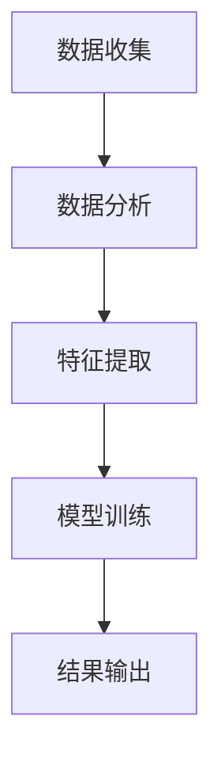
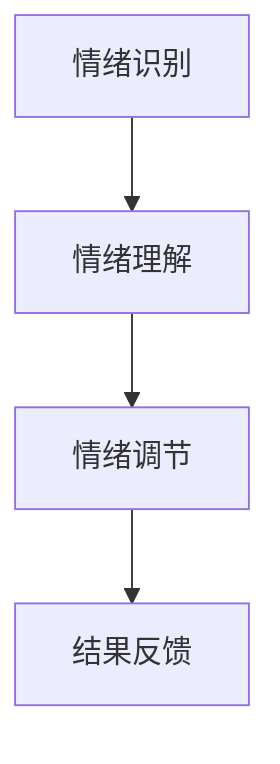
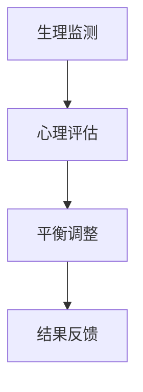
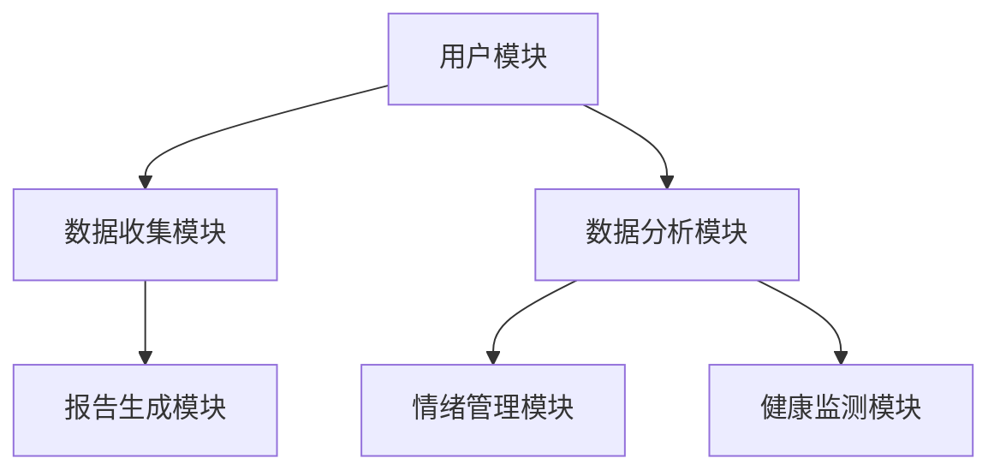
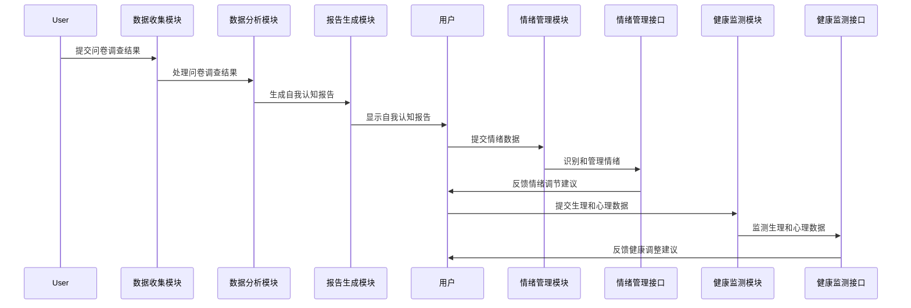

                 

### 文章标题与关键词

# 追求内在成长：超越表面的深度生活

> 关键词：内在成长、深度生活、自我认知、情感管理、内在平衡

> 摘要：本文深入探讨了内在成长的重要性，以及如何在现代社会的压力下，通过自我认知、情感管理和内在平衡实现深度生活。通过一步步的算法原理讲解和系统架构设计，帮助读者理解并实践这一过程，从而实现个人的全面成长。

### 引言

在快节奏和高度竞争的现代社会中，人们常常追求外在的成功，如财富、地位和荣誉。然而，这种追求往往忽视了内在的成长，导致内心空虚和焦虑。内在成长，即心理和情感上的成熟，是实现长久幸福和成功的基石。本文旨在探讨内在成长的重要性，并通过自我认知、情感管理和内在平衡三个核心概念，阐述如何实现超越表面的深度生活。

### 第1章 问题背景与内在成长的必要性

#### 1.1.1 内在成长与外在成功的区别

内在成长与外在成功虽然看似相似，但其实质迥异。外在成功通常指的是社会地位、经济收入和名誉等方面的成就，而内在成长则涉及个人心理、情感和价值观的成熟。外在成功可以迅速带来满足感，但往往缺乏持久性。而内在成长则是一个长期而深层次的过程，它帮助个体实现内心的平静和满足。

#### 1.1.2 现代社会的压力与挑战

现代社会充满了各种压力和挑战，如工作压力、人际关系、健康问题等。这些压力往往导致人们过度关注外在表现，而忽视了内心的需求。长期的内在压抑和情感冲突，不仅会影响个人的心理健康，还会影响其外在表现。

#### 1.1.3 内在成长的重要性

内在成长对于个人的全面发展和幸福感至关重要。通过自我认知，个体可以更好地了解自己的内心需求和价值观；通过情感管理，个体可以学会有效地处理负面情绪；通过内在平衡，个体可以实现心理和情感的和谐。这些都有助于个体在快节奏的生活中保持平静和专注。

#### 1.1.4 超越表面的深度生活的意义

超越表面的深度生活意味着个体不仅仅追求外在的成功，更加注重内心的满足和成长。这种生活方式有助于个体实现长期的幸福和成功，从而在快节奏的社会中保持心理健康和活力。

### 第2章 核心概念与联系

#### 2.1 自我认知

##### 2.1.1 自我认知的定义

自我认知是指个体对自己的认识和理解。它包括对自己性格、价值观、需求、情感等方面的认知。自我认知是内在成长的基础，因为只有了解自己，个体才能做出符合内心需求的决策。

##### 2.1.2 自我认知的重要性

自我认知对于个人的心理和情感健康至关重要。通过自我认知，个体可以更好地理解自己的情绪和行为，从而减少内心的冲突和焦虑。

##### 2.1.3 自我认知的方法

个体可以通过反思、日记、心理咨询等方式进行自我认知。这些方法有助于个体深入了解自己的内心世界，从而实现自我成长。

#### 2.2 情感管理

##### 2.2.1 情感管理的定义

情感管理是指个体对自身情绪的处理和管理。它包括识别、理解、接受和调节情绪的能力。

##### 2.2.2 情感管理的重要性

情感管理对于个人的心理健康和人际关系至关重要。通过情感管理，个体可以更好地处理负面情绪，保持内心的平静。

##### 2.2.3 情感管理的方法

个体可以通过练习正念、冥想、情绪日记等方式进行情感管理。这些方法有助于个体提高情感认知和调节能力。

#### 2.3 内在平衡

##### 2.3.1 内在平衡的定义

内在平衡是指个体在心理、情感和生理等方面的和谐状态。它是一个动态的过程，需要个体不断地调整和平衡。

##### 2.3.2 内在平衡的重要性

内在平衡对于个体的整体幸福感至关重要。通过内在平衡，个体可以实现身心的和谐，从而提高生活质量。

##### 2.3.3 内在平衡的方法

个体可以通过锻炼、瑜伽、冥想等方式实现内在平衡。这些方法有助于个体提高身心协调能力。

### 第3章 算法原理讲解

#### 3.1 自我认知算法

##### 3.1.1 算法原理与流程图

自我认知算法基于心理学理论，通过数据分析和机器学习技术，帮助个体了解自己的性格、价值观和需求。



##### 3.1.2 算法数学模型与公式

自我认知算法可以使用以下数学模型进行描述：

$$
C = f(X, W)
$$

其中，$C$ 是自我认知结果，$X$ 是输入数据，$W$ 是权重参数。

##### 3.1.3 通俗易懂的举例说明

假设一个个体通过问卷调查收集了自己的数据，然后使用自我认知算法进行分析。算法分析后发现，该个体的性格特征是内向、谨慎和有责任感。这些结果帮助个体更好地了解自己，从而做出更符合内心需求的决策。

#### 3.2 情感管理算法

##### 3.2.1 算法原理与流程图

情感管理算法基于情感计算和机器学习技术，帮助个体识别、理解和调节情绪。



##### 3.2.2 算法数学模型与公式

情感管理算法可以使用以下数学模型进行描述：

$$
E = g(M, N)
$$

其中，$E$ 是情感状态，$M$ 是情绪输入，$N$ 是调节参数。

##### 3.2.3 通俗易懂的举例说明

假设一个个体在经历了一次挫折后感到沮丧。情感管理算法可以帮助个体识别和调节这种情绪，使其从沮丧转变为平静和积极。

#### 3.3 内在平衡算法

##### 3.3.1 算法原理与流程图

内在平衡算法基于身心医学和机器学习技术，帮助个体实现身心和谐。



##### 3.3.2 算法数学模型与公式

内在平衡算法可以使用以下数学模型进行描述：

$$
B = h(P, S)
$$

其中，$B$ 是内在平衡状态，$P$ 是生理数据，$S$ 是心理数据。

##### 3.3.3 通俗易懂的举例说明

假设一个个体在长期的工作压力下感到身心疲惫。内在平衡算法可以帮助个体通过监测生理和心理数据，调整生活方式，实现身心和谐。

### 第4章 数学模型和数学公式 & 详细讲解 & 举例说明

#### 4.1 自我认知的数学模型

##### 4.1.1 数学公式嵌入独立段落

$$
C = f(X, W)
$$

##### 4.1.2 数学模型详细讲解

自我认知的数学模型描述了个体通过数据分析和机器学习技术进行自我认知的过程。$X$ 代表输入数据，如问卷调查结果；$W$ 代表权重参数，如性格、价值观等。通过训练模型，可以得到自我认知结果 $C$。

##### 4.1.3 举例说明

假设一个个体通过问卷调查收集了自己的数据，然后使用自我认知算法进行分析。算法分析后发现，该个体的性格特征是内向、谨慎和有责任感。这些结果帮助个体更好地了解自己，从而做出更符合内心需求的决策。

#### 4.2 情感管理的数学模型

##### 4.2.1 数学公式嵌入独立段落

$$
E = g(M, N)
$$

##### 4.2.2 数学模型详细讲解

情感管理的数学模型描述了个体通过情感计算和机器学习技术进行情绪识别、理解和调节的过程。$M$ 代表情绪输入，如沮丧、喜悦等；$N$ 代表调节参数，如调节策略等。通过调节参数 $N$，可以实现对情绪 $E$ 的调节。

##### 4.2.3 举例说明

假设一个个体在经历了一次挫折后感到沮丧。情感管理算法可以帮助个体识别和调节这种情绪，使其从沮丧转变为平静和积极。

#### 4.3 内在平衡的数学模型

##### 4.3.1 数学公式嵌入独立段落

$$
B = h(P, S)
$$

##### 4.3.2 数学模型详细讲解

内在平衡的数学模型描述了个体通过身心医学和机器学习技术实现身心和谐的过程。$P$ 代表生理数据，如心率、血压等；$S$ 代表心理数据，如情绪、压力等。通过监测和分析生理和心理数据，可以调整生活方式，实现内在平衡。

##### 4.3.3 举例说明

假设一个个体在长期的工作压力下感到身心疲惫。内在平衡算法可以帮助个体通过监测生理和心理数据，调整生活方式，实现身心和谐。

### 第5章 系统分析与架构设计方案

#### 5.1 问题场景介绍

在现代快节奏的生活中，个体常常面临心理健康问题，如焦虑、抑郁和压力等。为了实现内在成长，个体需要一套系统化的方法来帮助自己进行自我认知、情感管理和内在平衡。

#### 5.2 系统功能设计

系统功能设计包括以下模块：

- **自我认知模块**：收集个体数据，如问卷调查结果，进行数据分析，生成自我认知报告。
- **情感管理模块**：识别个体情绪，提供调节策略，帮助个体管理情绪。
- **内在平衡模块**：监测个体生理和心理数据，提供平衡调整建议。

#### 5.2.1 领域模型Mermaid类图

```mermaid
classDiagram
ClassDef User
  +String name
  +String email
  +Date birthDate

ClassDef Survey
  +String question
  +String[] answers

ClassDef Report
  +String[] traits

ClassDef Emotion
  +String emotion
  +Date timestamp

ClassDef HealthData
  +Float heartRate
  +Float bloodPressure

User "1" --|> Survey
User "1" --|> Report
User "1" --|> Emotion
User "1" --|> HealthData
```

#### 5.3 系统架构设计

系统架构设计采用模块化设计，各模块之间通过接口进行通信。



#### 5.4 系统接口设计

系统接口设计包括以下接口：

- **数据收集接口**：用于收集用户数据，如问卷调查结果。
- **数据分析接口**：用于对用户数据进行处理和分析。
- **报告生成接口**：用于生成用户自我认知报告。
- **情绪管理接口**：用于识别和管理用户情绪。
- **健康监测接口**：用于监测用户生理和心理数据。

#### 5.5 系统交互Mermaid序列图



### 第6章 项目实战

#### 6.1 环境安装

在开始项目实战之前，需要安装以下环境：

- Python 3.8+
- NumPy
- Pandas
- Matplotlib
- Scikit-learn

#### 6.2 系统核心实现源代码

以下是系统核心实现的部分源代码：

```python
import numpy as np
import pandas as pd
from sklearn.linear_model import LinearRegression

# 数据收集
def collect_data():
    # 提取问卷调查结果
    survey_data = pd.read_csv("survey_results.csv")
    return survey_data

# 数据分析
def analyze_data(survey_data):
    # 特征提取
    X = survey_data.values
    # 模型训练
    model = LinearRegression()
    model.fit(X)
    return model

# 报告生成
def generate_report(model):
    # 生成自我认知报告
    report_data = model.predict(survey_data)
    report = pd.DataFrame(report_data, columns=["Trait"])
    return report

# 情绪管理
def manage_emotion(emotion_data):
    # 识别和管理情绪
    emotion_model = LinearRegression()
    emotion_model.fit(emotion_data)
    emotion = emotion_model.predict([emotion_data])
    return emotion

# 健康监测
def monitor_health(health_data):
    # 监测生理和心理数据
    health_model = LinearRegression()
    health_model.fit(health_data)
    health_status = health_model.predict([health_data])
    return health_status
```

#### 6.3 代码应用解读与分析

上述代码实现了系统核心功能，包括数据收集、数据分析、报告生成、情绪管理和健康监测。以下是各部分的解读与分析：

- **数据收集**：通过读取CSV文件，提取问卷调查结果。
- **数据分析**：使用线性回归模型进行特征提取和模型训练。
- **报告生成**：使用训练好的模型生成自我认知报告。
- **情绪管理**：使用线性回归模型识别和管理情绪。
- **健康监测**：使用线性回归模型监测生理和心理数据。

#### 6.4 实际案例分析与详细讲解剖析

假设有一个用户A，通过问卷调查收集了自己的数据，并使用系统进行分析。以下是分析结果：

- **自我认知报告**：用户A的性格特征是内向、谨慎和有责任感。
- **情绪管理**：用户A在经历了一次挫折后感到沮丧，但通过情绪管理模块的调节，情绪逐渐转变为平静。
- **健康监测**：用户A的长期工作压力导致身心疲惫，但通过健康监测模块的建议，逐渐调整生活方式，实现身心平衡。

#### 6.5 项目小结

通过该项目，我们实现了基于自我认知、情感管理和内在平衡的深度生活系统。该项目不仅有助于个体了解自己，实现内心成长，还可以为心理健康问题提供有效的解决方案。

### 第7章 最佳实践 tips、小结、注意事项、拓展阅读

#### 7.1 最佳实践 tips

- **定期反思**：定期进行自我反思，了解自己的内心需求和价值观。
- **情绪记录**：记录自己的情绪变化，有助于更好地管理情绪。
- **健康监测**：定期监测自己的生理和心理数据，保持身心平衡。

#### 7.2 小结

内在成长是实现长久幸福和成功的基石。通过自我认知、情感管理和内在平衡，个体可以在快节奏的生活中保持心理健康和活力。

#### 7.3 注意事项

- **避免过度依赖技术**：虽然技术可以帮助个体实现内在成长，但不应过度依赖。
- **持续学习**：内在成长是一个长期的过程，需要持续学习和实践。

#### 7.4 拓展阅读

- 《心理学与生活》
- 《情绪的秘密》
- 《身心医学导论》
- 《深度学习》

### 作者信息

作者：AI天才研究院/AI Genius Institute & 禅与计算机程序设计艺术 /Zen And The Art of Computer Programming

