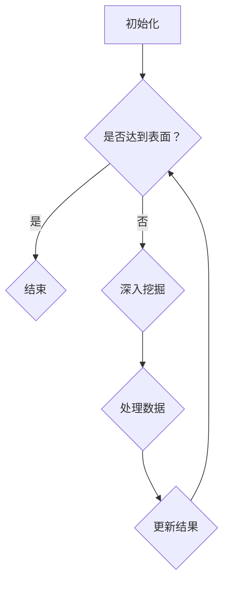
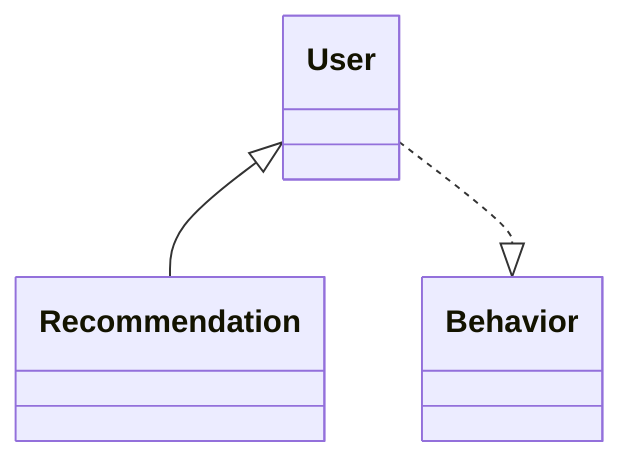
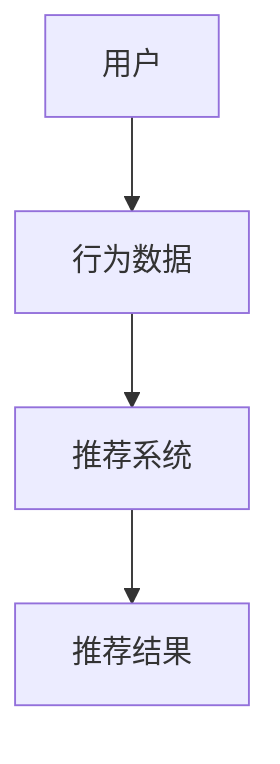
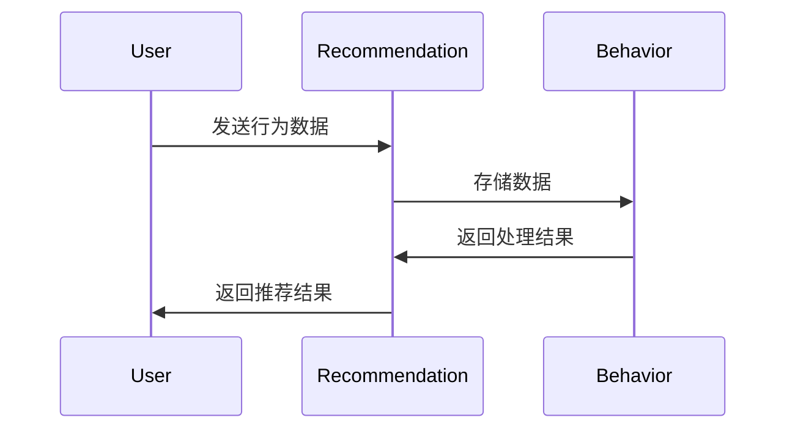
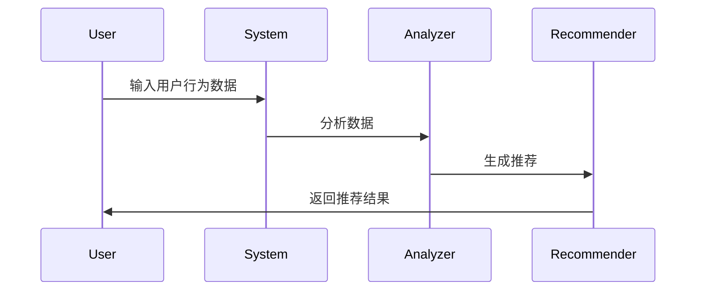

                 

### 追求生命的深度：超越表面的生活智慧

在数字化和快速发展的现代社会，我们常常被表面现象所吸引，追求瞬间的快感与即时的满足。然而，真正有意义的生活和职业发展，往往需要我们深入探索，追求生命的深度和生活的智慧。本文将以《追求生命的深度：超越表面的生活智慧》为主题，探讨如何在技术领域和日常生活中，实现这一追求。

**关键词**：
- 生命的深度
- 生活智慧
- 超越表面
- 技术追求
- 个体成长

**摘要**：
本文旨在探讨如何通过深度思考和实践，超越表面的生活智慧，追求更深层次的人生价值。我们将从核心概念、实际案例分析、系统架构设计以及项目实战等多个角度，详细阐述这一追求的过程和意义。

## 引言

在当前社会，我们很容易被表面的光鲜亮丽所迷惑，追求物质财富和短暂的快乐。然而，这种表面的满足并不能带来长久的幸福和成就感。相反，当我们能够深入探索生命的本质，理解并运用生活的智慧，我们才能获得更加持久和深刻的满足感。

### 生命的深度：为什么我们需要追求？

生命的深度是指对自我、世界以及生命意义的深刻理解。这种理解不仅包括对知识的掌握，更包括对生活哲学的领悟。追求生命的深度，可以让我们在纷繁复杂的世界中找到自己的位置，明确自己的目标和方向。

**核心概念与联系**：

- **生命的定义**：生命是指有机体存在的状态，包括生物体从出生到死亡的过程。
- **深度的含义**：深度是指对事物本质的理解程度，是对事物多维度、多层次的综合把握。
- **深度与表面的区别**：表面是事物外在的、容易看到的特征，而深度则是事物内在的、需要挖掘的内涵。

### 生活智慧：如何提炼？

生活智慧是指从生活实践中总结出来的有益经验和智慧。它不仅包括对知识的运用，还涉及对人际交往、情感管理以及自我提升等方面的深刻理解。

**核心概念原理**：

- **智慧的定义**：智慧是指能够正确理解和处理问题的能力，它包括知识、洞察力和判断力。
- **智慧的属性特征对比**：

| 特征       | 说明                                                         |
| ---------- | ------------------------------------------------------------ |
| 知识性     | 智慧的基础是知识，但知识本身并不等同于智慧。                  |
| 洞察力     | 智慧体现在对事物本质的洞察和预见。                           |
| 判断力     | 智慧体现在对复杂情况的判断和决策能力。                       |

### 超越表面：为何与如何？

超越表面意味着不仅仅看到事物的表面现象，而是深入挖掘其背后的本质和规律。在技术领域，这意味着不仅仅追求技术的炫酷和先进，而是深入理解技术背后的原理和设计哲学。在日常生活中，这意味着不仅仅追求物质享受，而是追求精神层面的满足和成长。

**算法原理讲解**：

为了更好地理解如何超越表面，我们可以通过一个简单的算法流程图来说明。



使用Python代码，我们可以更具体地描述这一算法：

```python
def explore_depth(surface):
    while not reached_surface:
        surface = deep_dive(surface)
        process_data(surface)
        update_result(surface)
    return result

def deep_dive(surface):
    # 深入挖掘表面现象，获取深层信息
    return deeper_info

def process_data(data):
    # 处理获取的数据
    pass

def update_result(result):
    # 更新结果
    pass
```

通过这个例子，我们可以看到，要实现超越表面的目标，需要不断地深入挖掘，处理数据和更新结果。这个过程需要耐心和智慧。

### 系统分析与架构设计方案

为了更好地理解如何实现超越表面，我们可以通过一个简单的系统架构设计来说明。

**问题场景介绍**：

假设我们需要开发一个智能推荐系统，该系统能够根据用户的历史行为数据，提供个性化的推荐。

**系统功能设计（领域模型mermaid类图）**：



**系统架构设计（mermaid架构图）**：



**系统接口设计**：



**系统交互（mermaid序列图）**：



通过这个系统架构设计，我们可以看到，要实现智能推荐，需要用户行为数据、分析系统和推荐系统等多个模块的协同工作。这个过程需要深入理解和处理数据，才能实现真正的个性化推荐。

### 项目实战

为了更好地理解如何超越表面，我们通过一个实际项目来进行讲解。

**环境安装**：

首先，我们需要安装Python环境以及相关的库，如NumPy、Pandas和Scikit-learn等。

```bash
pip install numpy pandas scikit-learn
```

**系统核心实现源代码**：

接下来，我们实现一个简单的用户行为数据分析系统。

```python
import numpy as np
import pandas as pd
from sklearn.cluster import KMeans

class UserBehaviorAnalysis:
    def __init__(self, data):
        self.data = data

    def analyze(self):
        # 数据预处理
        processed_data = self.preprocess_data(self.data)
        # 数据聚类
        clusters = self.cluster_data(processed_data)
        # 生成推荐
        recommendations = self.generate_recommendations(clusters)
        return recommendations

    def preprocess_data(self, data):
        # 数据清洗和处理
        return processed_data

    def cluster_data(self, data):
        # 使用K-Means聚类
        kmeans = KMeans(n_clusters=5)
        kmeans.fit(data)
        return kmeans.labels_

    def generate_recommendations(self, clusters):
        # 生成推荐列表
        return recommendations
```

**代码应用解读与分析**：

在这个系统中，我们首先对用户行为数据进行了预处理，然后使用K-Means聚类算法对数据进行了聚类，最后根据聚类结果生成了推荐列表。这个过程需要深入理解数据预处理、聚类算法以及推荐系统的原理。

**实际案例分析和详细讲解剖析**：

我们以一个实际案例来分析如何使用这个系统。

```python
# 加载用户行为数据
data = pd.read_csv('user_behavior.csv')

# 实例化分析系统
analysis = UserBehaviorAnalysis(data)

# 执行分析
recommendations = analysis.analyze()

# 打印推荐结果
print(recommendations)
```

在这个案例中，我们首先加载了用户行为数据，然后实例化了一个用户行为分析系统，并执行了分析。最终，我们得到了一组推荐结果。

**项目小结**：

通过这个实际项目，我们可以看到，要实现一个智能推荐系统，需要深入理解用户行为数据、聚类算法以及推荐系统的原理。这个过程不仅需要技术能力，还需要对业务有深刻的理解。

### 总结与反思

通过本文的讨论，我们可以得出以下结论：

- 追求生命的深度和生活的智慧，需要我们超越表面的现象，深入挖掘事物的本质。
- 在技术领域，这意味着要深入理解技术原理和设计哲学。
- 在日常生活中，这意味着要追求精神层面的满足和成长。

**最佳实践 Tips**：

1. **持续学习**：不断学习新知识和技能，提升自己的认知水平。
2. **深度思考**：在做决策和解决问题时，要深入思考，不要满足于表面的答案。
3. **实践验证**：理论知识需要通过实践来验证，不断调整和优化。

**小结**：

本文通过探讨生命的深度、生活智慧和超越表面的实践，提供了一种追求更深层次人生价值的思路。希望读者能够在日常生活中，不断追求深度和智慧，实现个人成长。

**注意事项**：

1. **保持耐心**：追求深度和智慧需要时间和耐心，不要期望一蹴而就。
2. **实践为王**：理论知识需要通过实践来验证，只有实践才能真正掌握。

**拓展阅读**：

- 《深度工作：如何有效利用每一点脑力》
- 《智慧的觉醒：生命智慧的探索与实践》
- 《算法导论》

**作者信息**：

作者：AI天才研究院/AI Genius Institute & 禅与计算机程序设计艺术 /Zen And The Art of Computer Programming

通过本文的探讨，我们希望能够激发读者对深度和智慧的追求，超越表面的生活，实现个人成长和价值提升。让我们共同努力，追求生命的深度，超越表面的生活智慧。

