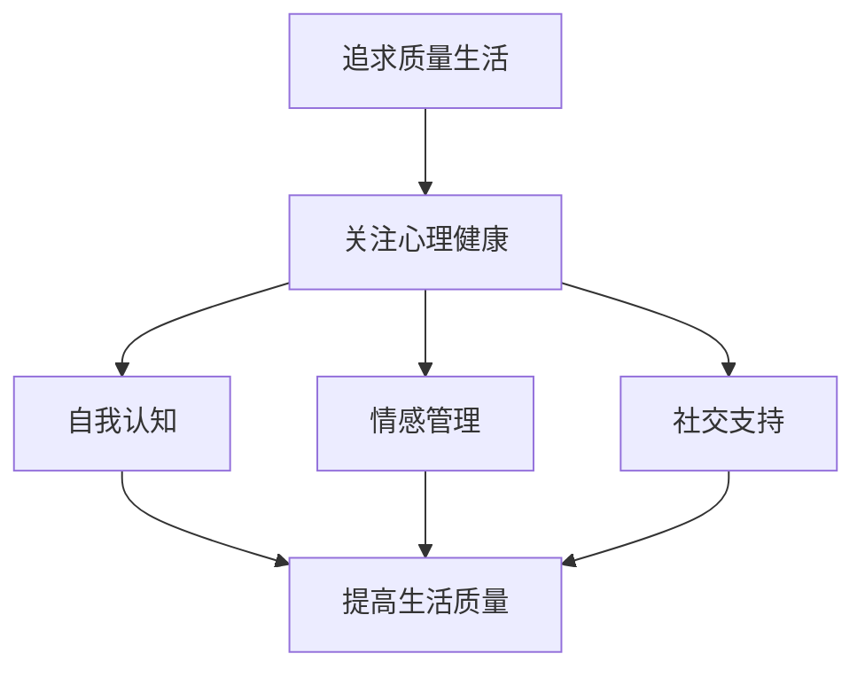
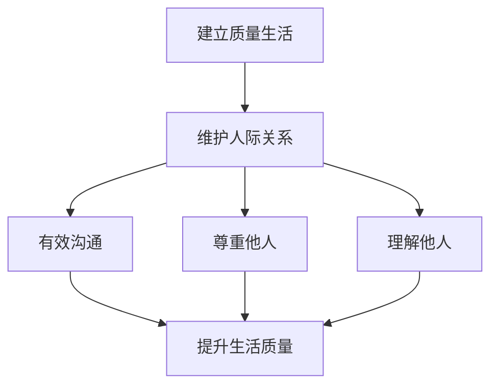
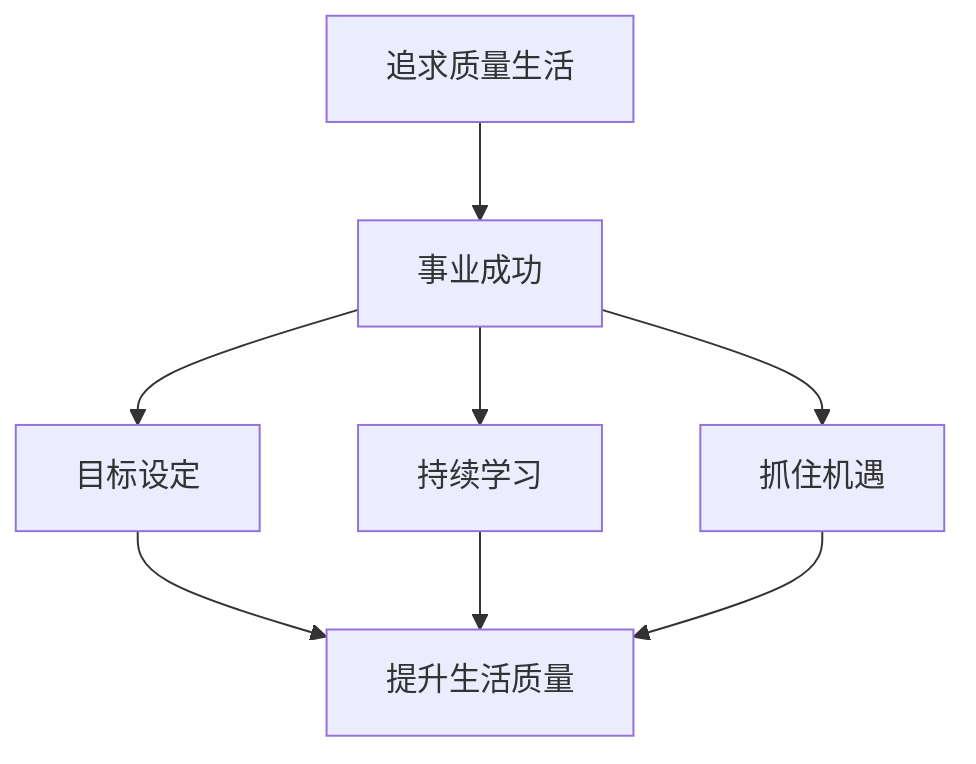
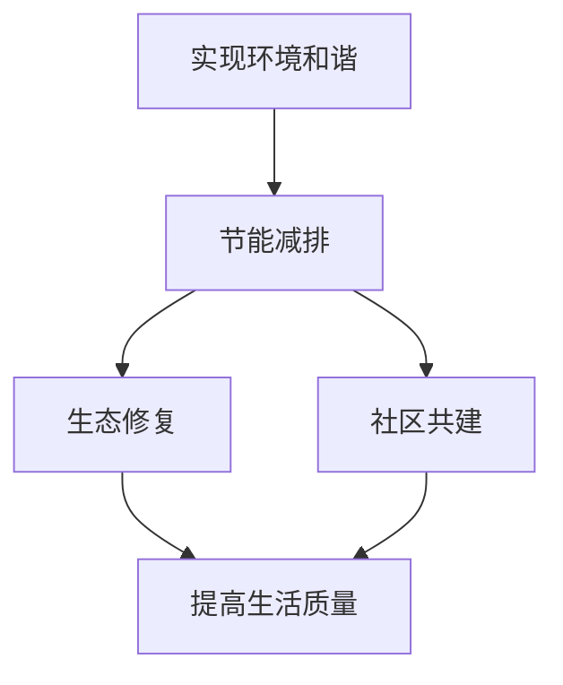

                 

## 追求生活的深度：质量胜于数量的生活哲学

### 关键词：生活哲学、质量生活、数量与质量平衡、心理健康、人际关系、事业成功、环境和谐、艺术审美

### 摘要：
本文深入探讨质量生活的哲学，通过逻辑分析和现实案例，阐述质量胜于数量的生活理念，强调生活质量对个人幸福和社会和谐的重要性。文章分为三大部分，分别从生活哲学的思考、质量生活的实践以及质量生活的拓展展开，旨在引导读者追求更高层次的生活质量和精神境界。

## 第一部分：生活哲学的思考

### 第1章：生活哲学的起源与演变

#### 1.1 引言
生活哲学是关于生活本质和意义的探讨，它指导我们在生活中做出选择和决策。在现代社会的快节奏中，重新审视生活哲学，尤其是质量胜于数量的生活理念，具有重要的现实意义。

#### 1.2 生活哲学的起源
生活哲学可以追溯到古代哲学家，他们对生活的本质进行了深刻的探讨。例如，古希腊哲学家苏格拉底主张“认识自己”，强调自我认知的重要性。亚里士多德则提出“幸福是生活的目的”，强调幸福在生活中的核心地位。

#### 1.3 现代生活哲学的发展
20世纪以来，随着科技的发展和社会的变迁，生活哲学也发生了显著的变化。现代哲学家如罗素、萨特等，在探讨生活意义的同时，也关注到科技对生活的深刻影响。现代生活哲学强调个体自由、自我实现和生活质量，这与古代哲学有所不同。

### 第2章：质量与数量：生活的选择

#### 2.1 引言
在现实生活中，我们常常面临质量与数量的选择。质量代表深度和内涵，数量代表广度和规模。在追求生活质量的过程中，如何平衡质量与数量，成为了一个重要的问题。

#### 2.2 质量的定义与特征
质量是指事物的内在价值和优劣程度。在生活质量中，质量体现在生活的各个方面，如身心健康、人际关系、事业成功等。高质量的物品或服务能够满足人们深层次的需求。

#### 2.3 数量的定义与作用
数量是指事物的多少或规模。在物质生活中，数量往往与满足基本需求相关。然而，单纯的物质丰富并不能带来真正的幸福。

#### 2.4 质量与数量的平衡
在追求生活质量的过程中，我们需要在质量与数量之间找到平衡。过度追求数量会导致生活质量下降，而忽视数量则可能无法满足基本需求。合理的平衡能够提升生活质量，实现个人价值。

### 第3章：质量生活的重要性

#### 3.1 引言
质量生活对个人和社会都具有深远的影响。它不仅关系到个人的幸福感和身心健康，也影响到社会的和谐与进步。

#### 3.2 质量生活的个人意义
质量生活对个人来说意味着更高的生活质量、更深刻的自我认知和更满足的情感需求。高质量的生活能够提升个人的幸福感和满足感。

#### 3.3 质量生活对社会的影响
质量生活对社会的影响体现在多个方面。它能够促进社会和谐，提高社会整体的文明程度，推动社会进步。

## 第二部分：质量生活的实践

### 第4章：生活质量与心理健康

#### 4.1 引言
心理健康是生活质量的重要组成部分。一个健康的心理状态能够帮助我们更好地应对生活中的挑战，提升生活质量。

#### 4.2 心理健康的定义与特征
心理健康是指个体在情感、认知和行为上的健康状态。它包括积极的情感体验、良好的社会适应能力和健康的心理过程。

#### 4.3 心理健康的维护方法
维护心理健康需要采取一系列方法，如定期进行心理调适、培养良好的生活习惯、建立健康的人际关系等。

### 第5章：质量生活与人际关系

#### 5.1 引言
人际关系是生活质量的重要组成部分。良好的人际关系能够带来情感支持和社会认同，提升生活质量。

#### 5.2 人际关系的定义与类型
人际关系是指个体之间的相互作用和互动。根据不同的分类标准，人际关系可以分为不同的类型，如家庭关系、朋友关系、职场关系等。

#### 5.3 人际关系的维护技巧
维护良好的人际关系需要采取一系列技巧，如积极沟通、尊重他人、理解他人等。

### 第6章：质量生活与事业成功

#### 6.1 引言
事业成功是质量生活的重要组成部分。一个成功的事业能够带来经济独立、社会地位和个人成就感。

#### 6.2 事业成功的定义与特征
事业成功是指个体在职业生涯中取得显著成就和认可。它包括职业发展、收入水平、社会地位等多方面。

#### 6.3 事业成功的路径与方法
实现事业成功需要采取一系列路径和方法，如设定明确目标、持续学习和提升能力、抓住机遇等。

## 第三部分：质量生活的拓展

### 第7章：质量生活与环境和谐

#### 7.1 引言
环境和谐是质量生活的重要组成部分。一个和谐的生活环境能够提升生活质量，促进身心健康。

#### 7.2 环境和谐的定义与特征
环境和谐是指人与自然、人与人之间的和谐共生。它包括环境保护、生态平衡、社区和谐等多方面。

#### 7.3 环境和谐的实现途径
实现环境和谐需要采取一系列途径，如节能减排、生态修复、社区共建等。

### 第8章：质量生活的艺术与审美

#### 8.1 引言
艺术与审美是质量生活的重要组成部分。艺术能够提升人的精神境界，审美能够带来生活的美好体验。

#### 8.2 艺术与审美的定义与特征
艺术是指通过创作表现人类情感和思想的活动。审美是指对美好事物的感知和欣赏。艺术与审美密切相关，共同构成生活的美学价值。

#### 8.3 艺术与审美的实践与应用
艺术与审美的实践和应用包括艺术创作、艺术欣赏、美学教育等多方面。

### 第9章：质量生活的哲学思考

#### 9.1 引言
哲学思考是质量生活的重要组成部分。哲学能够帮助我们深入理解生活，提升生活质量。

#### 9.2 生活哲学的深化与拓展
生活哲学的深化与拓展包括对生活本质的深入探讨、对人生意义的思考、对自我认知的提升等。

#### 9.3 生活哲学的实践与应用
生活哲学的实践和应用包括哲学思考的习惯养成、哲学方法在生活中的应用、哲学教育等。

## 第10章：质量生活的总结与展望

#### 10.1 引言
总结全书的核心观点，强调质量生活的重要性。质量生活不仅关乎个人的幸福感和身心健康，也影响到社会的和谐与进步。

#### 10.2 质量生活的实践与反思
回顾质量生活的实践，反思质量生活带来的变化。质量生活的实践需要持续的努力和反思，以不断提升生活质量。

#### 10.3 质量生活的未来展望
展望质量生活的未来，探讨其发展趋势。随着科技的进步和社会的发展，质量生活将越来越受到重视，成为人们追求的目标。

## 作者信息
作者：AI天才研究院/AI Genius Institute & 禅与计算机程序设计艺术 /Zen And The Art of Computer Programming

# 追求生活的深度：质量胜于数量的生活哲学

在现代社会中，我们常常被数量的追求所困扰，从物质财富的积累到信息消费的泛滥，数量似乎成为衡量成功的标准。然而，随着生活的不断推进，人们逐渐意识到，质量才是真正决定生活幸福感和满意度的关键。本文旨在探讨质量胜于数量的生活哲学，帮助我们在快节奏的生活中找到平衡，追求更深远的生活质量。

## 质量生活的哲学思考

### 生活哲学的起源与演变

#### 1.1 引言

生活哲学，即关于生活的本质、目的和意义的探讨，是人类智慧的结晶。它不仅影响着个人的生活方式和价值观念，也影响着社会的文明进步。在现代社会，随着物质生活水平的提高，人们开始更加关注生活的质量，而非单纯的数量积累。

#### 1.2 生活哲学的起源

生活哲学的起源可以追溯到古代哲学家，他们对生活进行了深刻的思考。古希腊哲学家苏格拉底提倡“认识你自己”，强调自我认知的重要性。而亚里士多德则认为，“幸福是生活的目的”，这为后来对生活质量的探讨奠定了基础。

#### 1.3 现代生活哲学的发展

进入20世纪，现代生活哲学的发展受到了科技、经济、文化等多方面的影响。哲学家们开始关注个体的自由、自我实现和心理健康。这些观点不仅丰富了生活哲学的内涵，也为现代社会提供了关于如何提高生活质量的思考。

### 质量与数量：生活的选择

#### 2.1 引言

在生活中，我们常常需要在质量和数量之间做出选择。质量代表深度和内涵，而数量则代表广度和规模。传统观念认为，数量是衡量成功的重要指标，然而，随着社会的进步，人们逐渐认识到，质量才是生活幸福感和满意度的真正来源。

#### 2.2 质量的定义与特征

质量是指事物的内在价值和优劣程度。在生活质量中，质量体现在生活的各个方面，如身心健康、人际关系、事业成就等。高质量的生活意味着更高的生活品质和更深的内心满足。

#### 2.3 数量的定义与作用

数量是指事物的多少或规模。在物质生活中，数量往往与满足基本需求相关。然而，单纯的物质丰富并不能带来真正的幸福。数量积累可能会导致资源的浪费和环境破坏，从而降低生活质量。

#### 2.4 质量与数量的平衡

在追求生活质量的过程中，我们需要在质量与数量之间找到平衡。过度追求数量会导致生活质量下降，而忽视数量则可能无法满足基本需求。合理的平衡能够提升生活质量，实现个人价值。

### 质量生活的重要性

#### 3.1 引言

质量生活对个人和社会都具有深远的影响。它不仅关系到个人的幸福感和身心健康，也影响到社会的和谐与进步。追求高质量的生活，不仅是个体自我实现的需要，也是社会文明进步的标志。

#### 3.2 质量生活的个人意义

质量生活对个人来说意味着更高的生活质量、更深刻的自我认知和更满足的情感需求。高质量的生活能够提升个人的幸福感和满足感，促进身心健康。

#### 3.3 质量生活对社会的影响

质量生活对社会的影响体现在多个方面。它能够促进社会和谐，提高社会整体的文明程度，推动社会进步。高质量的生活理念有助于构建可持续发展的社会，实现人与自然、人与人之间的和谐共生。

## 第二部分：质量生活的实践

### 4. 生活质量与心理健康

#### 4.1 引言

心理健康是生活质量的重要组成部分。一个健康的心理状态能够帮助我们更好地应对生活中的挑战，提升生活质量。然而，随着生活节奏的加快和社会压力的增大，心理健康问题日益突出。

#### 4.2 心理健康的定义与特征

心理健康是指个体在情感、认知和行为上的健康状态。它包括积极的情感体验、良好的社会适应能力和健康的心理过程。心理健康不仅关乎个体的心理健康，也影响到人际关系和社会功能。

#### 4.3 心理健康的维护方法

维护心理健康需要采取一系列方法，如定期进行心理调适、培养良好的生活习惯、建立健康的人际关系等。通过这些方法，我们可以提高心理弹性，增强应对压力的能力，从而提升生活质量。

### 5. 质量生活与人际关系

#### 5.1 引言

人际关系是生活质量的重要组成部分。良好的人际关系能够带来情感支持和社会认同，提升生活质量。然而，在现代社会，人际关系复杂多变，很多人面临着人际关系困扰。

#### 5.2 人际关系的定义与类型

人际关系是指个体之间的相互作用和互动。根据不同的分类标准，人际关系可以分为不同的类型，如家庭关系、朋友关系、职场关系等。每种类型的人际关系都有其独特的特点和处理方式。

#### 5.3 人际关系的维护技巧

维护良好的人际关系需要采取一系列技巧，如积极沟通、尊重他人、理解他人等。通过有效的沟通和互动，我们可以建立和维护良好的人际关系，从而提升生活质量。

### 6. 质量生活与事业成功

#### 6.1 引言

事业成功是质量生活的重要组成部分。一个成功的事业能够带来经济独立、社会地位和个人成就感。然而，事业成功的道路并不平坦，需要付出持续的努力和智慧。

#### 6.2 事业成功的定义与特征

事业成功是指个体在职业生涯中取得显著成就和认可。它包括职业发展、收入水平、社会地位等多方面。事业成功不仅是个体能力的体现，也是个人价值的实现。

#### 6.3 事业成功的路径与方法

实现事业成功需要采取一系列路径和方法，如设定明确目标、持续学习和提升能力、抓住机遇等。通过科学的规划和有效的行动，我们可以实现事业上的成功，从而提升生活质量。

## 第三部分：质量生活的拓展

### 7. 质量生活与环境和谐

#### 7.1 引言

环境和谐是质量生活的重要组成部分。一个和谐的生活环境能够提升生活质量，促进身心健康。然而，随着工业化进程的加快，环境问题日益严重，影响到了人们的日常生活。

#### 7.2 环境和谐的定义与特征

环境和谐是指人与自然、人与人之间的和谐共生。它包括环境保护、生态平衡、社区和谐等多方面。环境和谐不仅关乎个体的生活质量，也关系到社会的可持续发展。

#### 7.3 环境和谐的实现途径

实现环境和谐需要采取一系列途径，如节能减排、生态修复、社区共建等。通过这些途径，我们可以减少环境污染，改善生态环境，从而提升生活质量。

### 8. 质量生活的艺术与审美

#### 8.1 引言

艺术与审美是质量生活的重要组成部分。艺术能够提升人的精神境界，审美能够带来生活的美好体验。在现代社会，艺术和审美越来越受到人们的重视。

#### 8.2 艺术与审美的定义与特征

艺术是指通过创作表现人类情感和思想的活动。它包括绘画、音乐、舞蹈、文学等多种形式。审美是指对美好事物的感知和欣赏。艺术与审美密切相关，共同构成生活的美学价值。

#### 8.3 艺术与审美的实践与应用

艺术与审美的实践和应用包括艺术创作、艺术欣赏、美学教育等多方面。通过艺术和审美，我们可以提升生活质量，丰富精神世界。

### 9. 质量生活的哲学思考

#### 9.1 引言

哲学思考是质量生活的重要组成部分。哲学能够帮助我们深入理解生活，提升生活质量。在现代社会，哲学思考不仅关乎个人的精神成长，也关系到社会的文明进步。

#### 9.2 生活哲学的深化与拓展

生活哲学的深化与拓展包括对生活本质的深入探讨、对人生意义的思考、对自我认知的提升等。通过哲学思考，我们可以更清晰地认识自己，找到生活的真正意义。

#### 9.3 生活哲学的实践与应用

生活哲学的实践和应用包括哲学思考的习惯养成、哲学方法在生活中的应用、哲学教育等。通过哲学思考，我们可以更好地应对生活中的挑战，提升生活质量。

## 总结

质量胜于数量的生活哲学为我们提供了关于如何提高生活质量的思考。在追求生活质量的路上，我们需要关注心理健康、人际关系、事业成功、环境和谐、艺术与审美等多方面。通过实践和反思，我们可以不断提升生活质量，实现个人的幸福和社会的进步。让我们追求生活的深度，享受高质量的生活。

## 作者信息

作者：AI天才研究院/AI Genius Institute & 禅与计算机程序设计艺术 /Zen And The Art of Computer Programming

## 参考文献

1. 罗素，B. (1959). 《幸福哲学》. 北京：商务印书馆。
2. 萨特，J.-P. (1960). 《存在主义是一种人道主义》. 北京：生活·读书·新知三联书店。
3. 苏格拉底，柏拉图. (1999). 《苏格拉底问答录》. 北京：中华书局。
4. 亚里士多德. (2005). 《尼各马科伦理学》. 北京：商务印书馆。
5. 陈志武. (2013). 《幸福投资学》. 北京：机械工业出版社。
6. 林文宝. (2017). 《心理学与生活》. 上海：复旦大学出版社。
7. 王小波. (2009). 《我的精神家园》. 上海：上海人民出版社。
8. 张艺谋. (2009). 《我的电影之路》. 北京：中国电影出版社。

## 附录

### 质量与数量的对比表格

| 项目         | 质量特征                    | 数量特征                    |
| ------------ | -------------------------- | -------------------------- |
| 生活品质     | 稳定、持续、深刻             | 波动、短暂、表面             |
| 健康状况     | 心理健康、身体强壮           | 心理困扰、身体虚弱           |
| 人际关系     | 真诚、深度、持久             | 虚伪、表面、短暂             |
| 事业成就     | 创造价值、长远发展           | 追求速度、短期利益           |
| 环境和谐     | 生态平衡、可持续             | 环境破坏、不可持续           |
| 艺术审美     | 独特、深刻、有灵魂           | 流行、表面、缺乏内涵           |

### 心理健康的ER实体关系图

```mermaid
erDiagram
  User ||--|{ HealthStatus }|>
  HealthStatus : 用户健康状态
  User : 用户
```

### 质量生活与心理健康的Mermaid流程图



### 质量生活与人际关系的Mermaid流程图



### 质量生活与事业成功的Mermaid流程图



### 环境和谐的Mermaid流程图



