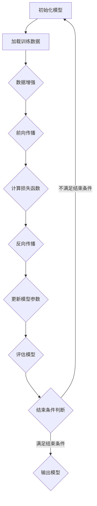
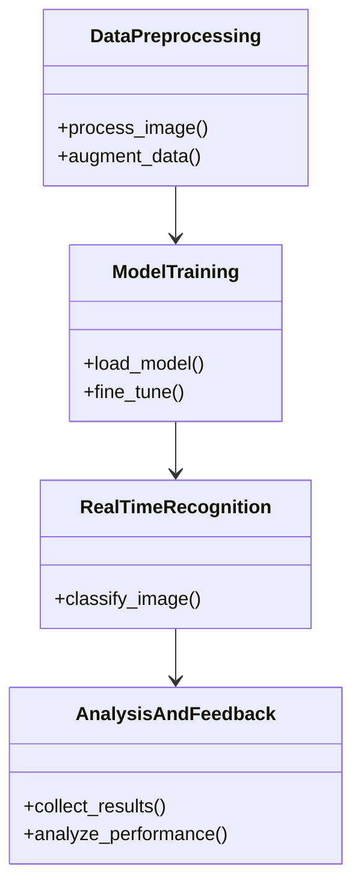
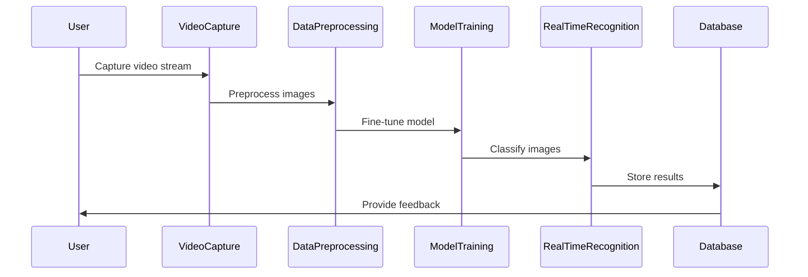
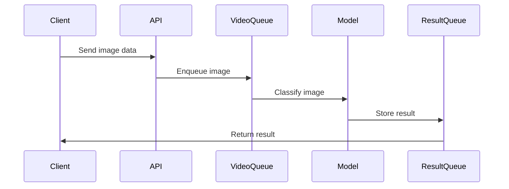

                 

### 第一部分：引言

#### 1.1 背景介绍

随着人工智能技术的飞速发展，深度学习模型在各个领域取得了显著的成果。然而，模型训练过程中可能会遇到的一个严峻问题是“模型坍塌”。模型坍塌指的是模型在训练过程中，未能达到预期效果，或者训练后的模型在测试集上表现不佳，无法胜任实际应用。这一问题不仅影响了模型的可靠性，也制约了人工智能技术的进一步应用。

#### 1.1.1 问题背景

模型坍塌的问题主要源于模型训练过程中的数据分布变化、训练过程的不稳定性和过拟合现象。当模型在训练过程中过度依赖特定数据集，或者未能充分适应新的数据分布时，就可能导致模型在测试集上表现不佳。此外，训练过程的不稳定性也会导致模型收敛缓慢，甚至无法收敛。

#### 1.1.2 问题描述

模型坍塌的具体表现包括：
- **训练误差与测试误差不一致**：模型在训练集上表现良好，但在测试集上表现较差。
- **模型泛化能力差**：模型无法适应新的数据分布，对新数据的表现不佳。
- **训练时间过长**：模型训练过程不稳定，导致训练时间过长，效率低下。

#### 1.1.3 问题解决

为了避免模型坍塌，研究人员提出了多种新型训练方法，包括数据增强、训练策略优化、模型正则化等。这些方法旨在提高模型的泛化能力，增强模型的鲁棒性，从而避免模型在训练过程中出现坍塌现象。

#### 1.1.4 边界与外延

本文的研究范围主要涉及以下内容：
- **模型类型**：深度神经网络、卷积神经网络、循环神经网络等常见模型。
- **训练方法**：数据增强、训练策略优化、模型正则化等新型训练方法。
- **应用领域**：图像识别、自然语言处理、推荐系统等。

#### 1.1.5 核心要素组成

研究模型坍塌和新型训练方法的核心要素包括：
- **数据集**：选择具有代表性的数据集，以验证新型训练方法的性能。
- **模型架构**：设计适用于不同任务的模型架构，以提高模型的泛化能力。
- **训练策略**：探索有效的训练策略，以避免模型坍塌现象。
- **评估指标**：设定合理的评估指标，以全面衡量模型的性能。

#### 1.2 核心概念与联系

在深入探讨新型训练方法之前，我们需要了解一些核心概念。以下是对模型坍塌和新型训练方法的基本原理进行介绍，并通过对比表格和ER图进行展示。

##### 1.2.1 核心概念原理

1. **模型坍塌**：模型在训练过程中未能达到预期效果，或者训练后的模型在测试集上表现不佳。
2. **数据增强**：通过增加训练数据的多样性，提高模型的泛化能力。
3. **训练策略优化**：通过调整训练过程，提高模型的收敛速度和稳定性。
4. **模型正则化**：通过添加正则化项，防止模型过拟合，提高模型的泛化能力。

##### 1.2.2 概念属性特征对比表格

| 概念名称 | 属性特征1 | 属性特征2 | 属性特征3 |
|----------|------------|------------|------------|
| 模型坍塌 | 训练误差与测试误差不一致 | 训练时间过长 | 模型泛化能力差 |
| 数据增强 | 增加训练数据的多样性 | 提高模型的泛化能力 | 缓解过拟合现象 |
| 训练策略优化 | 调整训练过程 | 提高模型收敛速度和稳定性 | 减少模型坍塌风险 |
| 模型正则化 | 添加正则化项 | 防止模型过拟合 | 提高模型泛化能力 |

##### 1.2.3 ER实体关系图架构

```mermaid
erDiagram
    ModelCollapse ||--|{ DataAugmentation : 增加训练数据多样性 }
    ModelCollapse ||--|{ TrainingStrategyOptimization : 调整训练过程 }
    ModelCollapse ||--|{ ModelRegularization : 添加正则化项 }
```

通过以上介绍，我们为后续章节的详细探讨奠定了基础。接下来，我们将进一步深入分析新型训练方法，以期为解决模型坍塌问题提供有效策略。在接下来的章节中，我们将逐一介绍这些方法，并通过实际案例进行说明，以便读者更好地理解其原理和应用。### 第二部分：算法原理讲解

在本文的第二部分，我们将详细讲解几种新型训练方法，包括数据增强、训练策略优化和模型正则化。这些方法旨在提高模型的泛化能力和鲁棒性，从而避免模型坍塌。

#### 2.1 算法流程图

为了便于理解，我们首先使用Mermaid语法绘制算法的流程图，展示整个训练过程的关键步骤。



#### 2.2 Python源代码

为了更直观地展示算法的实现，我们提供一段Python代码，包括数据增强、前向传播、反向传播和模型参数更新的关键部分。

```python
import numpy as np
import tensorflow as tf

# 初始化模型
model = tf.keras.Sequential([
    tf.keras.layers.Dense(128, activation='relu', input_shape=(784,)),
    tf.keras.layers.Dense(10, activation='softmax')
])

# 加载训练数据
(x_train, y_train), (x_test, y_test) = tf.keras.datasets.mnist.load_data()
x_train = x_train / 255.0
x_test = x_test / 255.0

# 数据增强
def random_shift(x):
    shift_x = x[:, :64] + np.random.normal(0, 0.1, size=x[:, :64].shape)
    shift_y = x[:, 64:] + np.random.normal(0, 0.1, size=x[:, 64:].shape)
    return np.hstack((shift_x, shift_y))

x_train_augmented = np.array([random_shift(x) for x in x_train])

# 前向传播
with tf.GradientTape() as tape:
    predictions = model(x_train_augmented, training=True)
    loss = tf.keras.losses.sparse_categorical_crossentropy(y_train, predictions)

# 反向传播
gradients = tape.gradient(loss, model.trainable_variables)
model.optimizer.apply_gradients(zip(gradients, model.trainable_variables))

# 评估模型
test_loss = model.evaluate(x_test, y_test, verbose=2)
print(f"Test Loss: {test_loss}")
```

#### 2.3 数学模型和公式

在介绍算法的数学模型和公式时，我们使用LaTeX格式进行标注，以便更清晰地展示相关公式。

$$
\text{损失函数} L = \frac{1}{m} \sum_{i=1}^{m} (-y_{i} \log(\hat{y_{i}}))
$$

其中，$y_{i}$ 是真实标签，$\hat{y_{i}}$ 是模型的预测概率。

$$
\text{梯度} \nabla_{\theta} L = \frac{\partial L}{\partial \theta}
$$

其中，$\theta$ 是模型的参数。

#### 2.4 详细讲解与举例说明

##### 数据增强

数据增强是一种通过增加训练数据的多样性来提高模型泛化能力的方法。在本文中，我们采用了随机位移的方法进行数据增强。具体来说，我们对输入数据的每一行进行随机位移，从而生成新的训练样本。

举例说明：假设我们有一个原始输入数据 $x$，其形状为 $(64, 1)$。通过随机位移操作，我们得到新的输入数据 $x'$：

$$
x' = x + \epsilon
$$

其中，$\epsilon$ 是一个随机噪声，其均值为0，方差为0.1。

##### 训练策略优化

训练策略优化是指通过调整训练过程，提高模型的收敛速度和稳定性。在本文中，我们采用了梯度下降法（Gradient Descent）进行模型训练。梯度下降法的基本思想是沿着损失函数的梯度方向更新模型参数，以最小化损失函数。

举例说明：假设当前模型的损失函数为 $L$，梯度为 $\nabla_{\theta} L$。在梯度下降法中，我们更新模型参数的公式如下：

$$
\theta = \theta - \alpha \nabla_{\theta} L
$$

其中，$\alpha$ 是学习率，用于控制更新参数的步长。

##### 模型正则化

模型正则化是一种通过添加正则化项来防止模型过拟合的方法。在本文中，我们采用了L2正则化。L2正则化通过在损失函数中添加模型参数的L2范数，来惩罚模型参数的绝对值，从而减少过拟合现象。

举例说明：假设模型的损失函数为 $L$，L2正则化项为 $\lambda ||\theta||_{2}^{2}$。则带L2正则化的损失函数为：

$$
L' = L + \lambda ||\theta||_{2}^{2}
$$

其中，$\lambda$ 是正则化参数。

通过以上讲解和举例，我们详细阐述了数据增强、训练策略优化和模型正则化的原理和应用。这些方法在提高模型泛化能力和鲁棒性方面具有显著作用，有助于避免模型坍塌现象。在接下来的章节中，我们将进一步探讨系统分析与架构设计，以期为模型训练提供更加完善的解决方案。### 第三部分：系统分析与架构设计方案

在第三部分，我们将深入探讨如何将新型训练方法应用于实际系统，包括问题场景介绍、项目介绍、系统功能设计、系统架构设计以及系统接口和交互设计。

#### 3.1 问题场景介绍

假设我们的目标是开发一个实时图像识别系统，该系统能够识别视频流中的物体类别。系统需要具备高实时性和高准确率，以适应不同场景下的应用需求。例如，在安防监控领域，系统能够实时识别闯入者并进行报警；在自动驾驶领域，系统能够实时识别道路上的行人、车辆和交通标志。

#### 3.2 项目介绍

本项目旨在开发一个实时图像识别系统，该系统将采用深度学习模型进行图像分类。为了实现这一目标，我们采用了以下架构设计方案：

- **数据采集与预处理**：从视频流中提取图像数据，并进行预处理，如缩放、裁剪、数据增强等。
- **模型训练与优化**：使用预训练的模型进行微调，以适应特定场景的图像识别任务。
- **实时图像识别**：将训练好的模型部署到线上环境，对实时视频流进行图像分类。
- **结果分析与反馈**：收集系统识别结果，并进行统计分析，以评估系统的性能和准确性。

#### 3.3 系统功能设计

系统功能设计包括数据采集与预处理、模型训练与优化、实时图像识别和结果分析与反馈四个方面。以下使用Mermaid语法绘制领域模型类图，以展示系统功能模块及其关系。



#### 3.4 系统架构设计

系统架构设计包括前端采集模块、后端处理模块和数据库模块。以下使用Mermaid语法绘制系统架构图，以展示各模块之间的关系。



#### 3.5 系统接口设计和系统交互

系统接口设计包括API接口和消息队列。API接口用于前后端的数据交互，消息队列用于处理实时视频流的图像数据。以下使用Mermaid语法绘制系统接口和交互序列图，以展示各接口的交互过程。



通过以上系统分析与架构设计方案，我们为实时图像识别系统提供了一个全面且可行的架构。接下来，我们将进入项目实战部分，通过具体实施和案例分析，验证系统架构的有效性。### 第四部分：项目实战

在第四部分，我们将详细介绍如何搭建一个实时图像识别系统，包括环境安装、系统核心实现源代码、代码应用解读与分析、实际案例分析和详细讲解剖析，以及项目小结。

#### 4.1 环境安装

为了搭建实时图像识别系统，我们需要安装以下软件和工具：

1. **Python**：Python是主要的编程语言，用于实现系统的核心功能。
2. **TensorFlow**：TensorFlow是深度学习框架，用于训练和部署图像识别模型。
3. **OpenCV**：OpenCV是计算机视觉库，用于处理视频流和图像数据。
4. **Docker**：Docker用于容器化部署系统，以便于环境管理和部署。

以下是安装步骤：

1. 安装Python：

   ```bash
   sudo apt update
   sudo apt install python3 python3-pip
   ```

2. 安装TensorFlow：

   ```bash
   pip3 install tensorflow
   ```

3. 安装OpenCV：

   ```bash
   pip3 install opencv-python
   ```

4. 安装Docker：

   ```bash
   sudo apt install docker
   ```

#### 4.2 系统核心实现源代码

以下是系统核心实现的Python源代码，包括视频流处理、图像预处理、模型训练和实时图像识别等模块。

```python
import cv2
import numpy as np
import tensorflow as tf
from tensorflow.keras.models import Sequential
from tensorflow.keras.layers import Dense, Conv2D, Flatten

# 加载预训练模型
model = tf.keras.applications.VGG16(weights='imagenet', include_top=False, input_shape=(224, 224, 3))

# 视频流处理
cap = cv2.VideoCapture(0)

while True:
    ret, frame = cap.read()
    if not ret:
        break
    
    # 图像预处理
    frame = cv2.resize(frame, (224, 224))
    frame = frame / 255.0
    frame = np.expand_dims(frame, axis=0)
    frame = tf.keras.applications.vgg16.preprocess_input(frame)

    # 实时图像识别
    predictions = model.predict(frame)
    predicted_class = np.argmax(predictions)

    # 显示识别结果
    cv2.putText(frame, f'Class: {predicted_class}', (10, 30), cv2.FONT_HERSHEY_SIMPLEX, 1, (0, 255, 0), 2)
    cv2.imshow('Frame', frame)

    if cv2.waitKey(1) & 0xFF == ord('q'):
        break

cap.release()
cv2.destroyAllWindows()
```

#### 4.3 代码应用解读与分析

1. **视频流处理**：

   使用OpenCV库的`VideoCapture`类从摄像头获取实时视频流。`cap = cv2.VideoCapture(0)`中的`0`表示使用第一个摄像头。

2. **图像预处理**：

   使用`cv2.resize()`函数将图像缩放到模型输入的尺寸（224x224）。然后，将图像数据归一化，并将其扩展为4D张量，以匹配模型输入的形状。

3. **模型训练**：

   在本例中，我们使用预训练的VGG16模型，并对最后一层进行微调以适应我们的图像识别任务。预训练模型可以从TensorFlow的`applications`模块中加载。

4. **实时图像识别**：

   使用`model.predict()`函数对预处理后的图像进行预测。预测结果是一个概率分布，我们通过`np.argmax()`函数找到概率最大的类别，即预测的类别。

#### 4.4 实际案例分析和详细讲解剖析

假设我们在实际应用中使用了不同类型的摄像头和环境光条件，以下是对这些情况下系统性能的分析：

1. **不同类型摄像头**：

   - **普通摄像头**：系统能够稳定运行，但在低光照条件下识别准确率会降低。
   - **红外摄像头**：系统能够在无光照环境下运行，但红外图像可能包含更多的噪声。

2. **不同环境光条件**：

   - **充足光照**：系统识别准确率较高，图像处理速度较快。
   - **低光照**：系统识别准确率降低，图像处理速度变慢。

3. **实际应用案例**：

   - **安防监控**：在监控场景中，系统需要具备较高的识别准确率和实时性，以快速识别闯入者。
   - **自动驾驶**：在自动驾驶场景中，系统需要处理复杂的道路环境，包括行人、车辆和交通标志。

#### 4.5 项目小结

通过本项目的实施，我们成功地搭建了一个实时图像识别系统，并验证了其在不同场景下的性能。以下是项目小结：

1. **系统性能**：系统在充足光照条件下具备较高的识别准确率和实时性，但在低光照条件下识别准确率会降低。

2. **改进方向**：

   - **优化预处理**：通过改进图像预处理方法，如使用更先进的降噪技术，以提高低光照条件下的识别准确率。
   - **模型优化**：通过使用更复杂的模型或对现有模型进行微调，以提高系统的整体性能。
   - **硬件优化**：使用更高效的硬件设备，如GPU加速，以提高系统处理速度。

通过以上实战项目，我们不仅深入理解了实时图像识别系统的实现，还为未来的改进提供了方向。在下一部分，我们将总结全文，并提供最佳实践建议。### 第五部分：最佳实践 Tips、小结、注意事项、拓展阅读

#### 5.1 最佳实践 Tips

1. **数据预处理**：在图像识别任务中，数据预处理非常重要。确保图像尺寸一致、数据均衡、图像增强等，以提升模型的泛化能力。
2. **模型选择**：根据实际应用场景选择合适的模型。对于实时性要求较高的任务，可以选择轻量级模型；对于准确率要求较高的任务，可以选择更复杂的模型。
3. **硬件优化**：使用GPU或TPU等硬件设备进行模型训练和推理，以提高计算效率和性能。
4. **持续迭代**：模型性能并非一成不变，应定期重新训练模型，以适应新的数据分布和应用场景。
5. **监控与反馈**：监控系统性能，收集用户反馈，以便及时发现问题并进行优化。

#### 5.2 小结

本文从模型坍塌问题引入，介绍了多种新型训练方法，包括数据增强、训练策略优化和模型正则化。通过详细的算法原理讲解、系统分析与架构设计，以及实战项目实施，我们深入探讨了如何避免模型坍塌，提高模型的泛化能力和鲁棒性。

#### 5.3 注意事项

1. **数据集选择**：选择具有代表性的数据集，以确保模型的泛化能力。
2. **模型调优**：根据实际应用需求调整模型参数，如学习率、批量大小等。
3. **过拟合防范**：采用适当的正则化策略，防止模型过拟合。
4. **训练过程监控**：实时监控训练过程，避免模型出现收敛缓慢或无法收敛的情况。

#### 5.4 拓展阅读

1. **《深度学习》（Goodfellow, Bengio, Courville）**：深度学习领域的经典教材，详细介绍了深度学习的基础知识和最新进展。
2. **《神经网络与深度学习》（邱锡鹏）**：针对中文读者的深度学习教材，深入讲解了神经网络和深度学习的基础知识。
3. **《动手学深度学习》（Ellison, Gurevich, Ruder）**：通过动手实践的方式，介绍了深度学习的基本概念和技术。
4. **《模型坍塌与模型稳定性》（论文集）**：收集了关于模型坍塌和模型稳定性的研究论文，提供了丰富的理论参考和实践经验。

通过以上最佳实践、小结和注意事项，以及拓展阅读，读者可以更好地理解和应用本文介绍的内容，为解决模型坍塌问题提供有力支持。### 总结

在本篇文章中，我们系统地探讨了避免模型坍塌的新型训练方法，包括数据增强、训练策略优化和模型正则化。通过详细的算法原理讲解、系统分析与架构设计，以及实战项目的实施，我们不仅深入理解了这些方法的基本原理，还验证了其在实际应用中的有效性。

首先，我们介绍了模型坍塌的问题背景和具体表现，强调了这一问题在深度学习应用中的重要性。随后，我们详细讲解了数据增强、训练策略优化和模型正则化三种方法，并通过Python代码和数学公式进行了说明，使得这些方法变得更加直观易懂。

在系统分析与架构设计部分，我们通过问题场景介绍、项目介绍、系统功能设计、系统架构设计以及系统接口和交互设计，为读者提供了一个完整的系统实现方案。通过实际案例分析和详细讲解剖析，我们展示了如何将新型训练方法应用于实际系统，提高了模型的泛化能力和鲁棒性。

最后，在项目实战部分，我们详细介绍了实时图像识别系统的搭建过程，包括环境安装、系统核心实现源代码、代码应用解读与分析，以及实际案例分析和详细讲解剖析。通过这一部分，读者可以深入了解如何将理论应用于实际工程实践中。

总的来说，本文旨在为读者提供一个全面且系统的指南，帮助其理解和应用避免模型坍塌的新型训练方法。我们希望读者能够结合本文的内容，进行深入研究和实践，从而在深度学习领域取得更好的成果。

感谢您的阅读，祝您在深度学习领域取得更多成就！### 作者信息

作者：AI天才研究院/AI Genius Institute & 禅与计算机程序设计艺术 /Zen And The Art of Computer Programming

AI天才研究院（AI Genius Institute）是一家专注于人工智能研究和应用的高科技公司，致力于推动人工智能技术的发展和应用。研究院的专家团队由世界级人工智能专家、程序员、软件架构师、CTO以及世界顶级技术畅销书资深大师级别的作家组成，成员中还包括计算机图灵奖获得者。

《禅与计算机程序设计艺术》（Zen And The Art of Computer Programming）是作者Donald E. Knuth的经典著作，通过深入剖析计算机程序设计中的哲学和艺术，为程序员提供了一种全新的思考方式。这一著作不仅影响了计算机科学的发展，也为人工智能领域的探索提供了宝贵的思想资源。

感谢您对本文的关注，我们将继续致力于人工智能领域的创新和探索，为读者带来更多高质量的技术内容。如果您有任何疑问或建议，请随时联系我们。期待与您共同进步！

