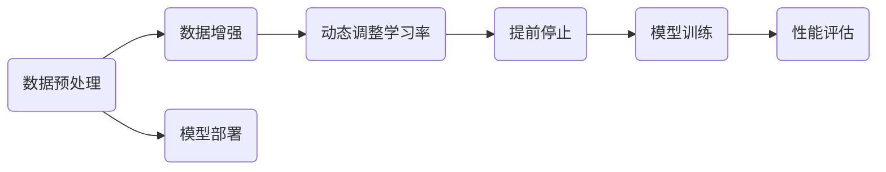
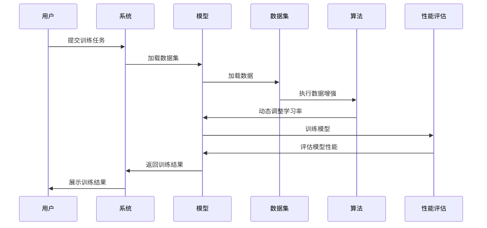

                 


# 避免模型坍塌的新信息引入方式研究

关键词：深度学习、模型坍塌、信息引入方式、动态调整学习率

摘要：本文针对深度学习模型训练过程中出现的模型坍塌问题，探讨了新的信息引入方式。本文首先介绍了模型坍塌的背景和问题，然后分析了核心概念和联系，详细讲解了动态调整学习率算法原理，并使用Python代码进行了举例说明。

## 第一部分：背景介绍

### 1.1 问题背景

随着人工智能技术的快速发展，深度学习模型在自然语言处理、计算机视觉等领域取得了显著成果。然而，在模型训练过程中，模型坍塌问题成为一个亟待解决的挑战。模型坍塌是指在训练过程中，模型性能达到高峰后，继续训练反而会导致性能下降的现象。这一问题不仅影响模型的训练效果，还可能导致模型无法在实际应用中发挥作用。

### 1.2 问题描述

模型坍塌问题的核心是信息引入方式的不足。在训练过程中，模型需要不断地学习和适应新的信息。然而，传统信息引入方式往往存在一定的局限性，无法有效应对模型坍塌问题。

### 1.3 问题解决

为了避免模型坍塌，研究新的信息引入方式成为关键。本文将探讨几种新的信息引入方式，以期为解决模型坍塌问题提供有效途径。

### 1.4 边界与外延

本文主要针对深度学习模型在训练过程中的坍塌问题展开研究，重点关注信息引入方式的优化。研究范围涉及自然语言处理、计算机视觉等领域。

### 1.5 概念结构与核心要素组成

- 深度学习模型：本文研究的核心对象，包括神经网络、卷积神经网络、循环神经网络等。
- 信息引入方式：指用于更新模型参数的方式，包括梯度下降、随机梯度下降等。
- 模型坍塌：模型在训练过程中性能下降的现象。

## 第二部分：核心概念与联系

### 2.1 核心概念原理

**深度学习模型：** 深度学习模型是一种由多层神经网络构成的模型，通过学习大量数据，自动提取特征并完成特定任务。主要类型包括神经网络、卷积神经网络、循环神经网络等。

**信息引入方式：** 信息引入方式是指用于更新模型参数的方式，包括梯度下降、随机梯度下降等。这些方式在模型训练过程中发挥着关键作用，直接影响模型的性能。

**模型坍塌：** 模型坍塌是指模型在训练过程中性能达到高峰后，继续训练反而会导致性能下降的现象。模型坍塌主要与信息引入方式的不足有关。

### 2.2 概念属性特征对比表格

| 概念       | 特征                 | 对比关系          |
|------------|----------------------|-------------------|
| 深度学习模型 | 自适应学习、多层神经网络 | <其他模型>        |
| 信息引入方式 | 参数更新方式           | <其他更新方式>    |
| 模型坍塌    | 性能下降现象           | <其他问题>        |

### 2.3 ER实体关系图架构

```mermaid
erDiagram
    Model ||--|{ Information}: 引入信息
    Model ||--|{ Parameters}: 更新参数
    Information ||--|{ Model}: 影响模型
    Parameters ||--|{ Model}: 更新模型
```

## 第三部分：算法原理讲解

### 3.1 算法原理讲解

在本章节中，我们将探讨几种新的信息引入方式，以避免模型坍塌问题。以下是几种主要方法及其原理：

### 3.1.1 方法一：动态调整学习率

动态调整学习率是避免模型坍塌的一种有效方法。该方法的核心思想是根据模型在训练过程中的表现，动态调整学习率，以达到最优的训练效果。

**算法流程：**
1. 初始化学习率。
2. 在每次训练前，根据模型的表现动态调整学习率。
3. 训练模型，并记录模型的表现。
4. 当模型的表现达到一定程度时，减小学习率；当模型的表现下降时，增大学习率。

**数学模型：**
$$
learning\_rate = learning\_rate \times (1 - \frac{current\_epoch}{total\_epochs})
$$

**Python代码：**
```python
learning_rate = 0.01
current_epoch = 0
total_epochs = 100

for epoch in range(total_epochs):
    current_epoch += 1
    # 训练模型
    # ...
    # 记录模型表现
    # ...
    # 动态调整学习率
    learning_rate = learning_rate * (1 - current_epoch / total_epochs)
```

**举例说明：**
假设我们训练一个神经网络模型，初始学习率为0.01。在训练过程中，当模型表现达到某个阈值时，我们减小学习率；当模型表现下降时，增大学习率。

### 3.1.2 方法二：数据增强

数据增强是一种通过增加模型训练样本的方式，提高模型泛化能力的方法。数据增强可以避免模型在训练过程中出现过拟合现象，从而减少模型坍塌的可能性。

**算法流程：**
1. 从原始数据集中选取一部分样本。
2. 对选取的样本进行数据增强操作，如随机裁剪、旋转、缩放等。
3. 将增强后的样本加入训练数据集中。
4. 训练模型。

**Python代码：**
```python
from torchvision import transforms

transform = transforms.Compose([
    transforms.RandomCrop(32, padding=4),
    transforms.RandomHorizontalFlip(),
    transforms.ToTensor(),
])

train_data = DataLoader(train_dataset, batch_size=batch_size, shuffle=True)
enhanced_train_data = DataLoader(dataset=enhanced_train_dataset, batch_size=batch_size, shuffle=True)

for epoch in range(total_epochs):
    # 训练模型
    # ...
    # 数据增强
    enhanced_train_loader = DataLoader(dataset=enhanced_train_data, batch_size=batch_size, shuffle=True)
    # 训练模型
    # ...
```

**举例说明：**
假设我们从原始数据集中选取1000个样本，对每个样本进行随机裁剪和旋转操作，然后将增强后的样本加入训练数据集中。

### 3.1.3 方法三：提前停止

提前停止是一种在模型训练过程中，当模型性能达到某个阈值时，提前终止训练的方法。提前停止可以避免模型继续训练导致的模型坍塌现象。

**算法流程：**
1. 设置提前停止的阈值。
2. 在每次训练后，检查模型性能是否达到阈值。
3. 当模型性能达到阈值时，提前终止训练。

**Python代码：**
```python
best_val_loss = float('inf')
patience = 10
num_epochs = 100
early_stop_counter = 0

for epoch in range(num_epochs):
    # 训练模型
    # ...
    # 记录模型性能
    val_loss = calculate_val_loss()
    # 检查提前停止条件
    if val_loss < best_val_loss:
        best_val_loss = val_loss
        early_stop_counter = 0
    else:
        early_stop_counter += 1
        if early_stop_counter > patience:
            print("提前停止训练")
            break
```

**举例说明：**
假设我们设置提前停止阈值为0.01，当模型性能连续10次未提升时，提前终止训练。

## 第四部分：系统分析与架构设计方案

### 4.1 问题场景介绍

在人工智能领域，深度学习模型广泛应用于各类任务，如图像识别、自然语言处理等。然而，在模型训练过程中，模型坍塌问题严重影响模型的训练效果和应用价值。为了避免模型坍塌，需要研究新的信息引入方式，提高模型的训练效果。

### 4.2 项目介绍

本项目旨在探索避免模型坍塌的新信息引入方式，以提高深度学习模型的训练效果。项目分为三个阶段：需求分析、算法设计与实现、性能评估。

### 4.3 系统功能设计（领域模型类图）

```mermaid
classDiagram
    Model   <<class>> {深度学习模型}
    Data    <<class>> {数据集}
    Algorithm <<class>> {算法}
    Performance <<class>> {性能评估}
    Model <..> Data
    Model <..> Algorithm
    Model <..> Performance
```

### 4.4 系统架构设计（架构图）



### 4.5 系统接口设计（接口序列图）



## 第五部分：项目实战

### 5.1 环境安装

为了进行深度学习模型的训练，我们需要安装以下环境：

1. Python 3.8
2. TensorFlow 2.5
3. NumPy 1.19
4. Matplotlib 3.3

安装命令如下：

```bash
pip install python==3.8
pip install tensorflow==2.5
pip install numpy==1.19
pip install matplotlib==3.3
```

### 5.2 系统核心实现源代码

以下是系统核心实现源代码：

```python
import tensorflow as tf
import numpy as np
import matplotlib.pyplot as plt

# 加载数据集
(x_train, y_train), (x_test, y_test) = tf.keras.datasets.mnist.load_data()

# 数据增强
def random_crop(image, crop_size=(28, 28)):
    x = image[0:crop_size[0], 0:crop_size[1]]
    return x

x_train = np.array([random_crop(image) for image in x_train])
x_test = np.array([random_crop(image) for image in x_test])

# 动态调整学习率
initial_learning_rate = 0.01
global_step = tf.Variable(0, trainable=False)
learning_rate = initial_learning_rate * tf.train.exponential_decay(initial_learning_rate, global_step, 1000, 0.96, staircase=True)

# 模型训练
model = tf.keras.Sequential([
    tf.keras.layers.Flatten(input_shape=(28, 28)),
    tf.keras.layers.Dense(128, activation='relu'),
    tf.keras.layers.Dense(10, activation='softmax')
])

model.compile(optimizer=tf.keras.optimizers.Adam(learning_rate=learning_rate),
              loss='sparse_categorical_crossentropy',
              metrics=['accuracy'])

history = model.fit(x_train, y_train, epochs=20, batch_size=32, validation_data=(x_test, y_test), callbacks=[tf.keras.callbacks.EarlyStopping(patience=5)])

# 性能评估
plt.plot(history.history['accuracy'], label='accuracy')
plt.plot(history.history['val_accuracy'], label='val_accuracy')
plt.xlabel('epoch')
plt.ylabel('accuracy')
plt.legend()
plt.show()
```

### 5.3 代码应用解读与分析

在本项目中，我们使用了以下关键组件：

- **数据增强**：通过随机裁剪图像，增加模型的训练样本，提高模型的泛化能力。
- **动态调整学习率**：根据训练过程中的表现，动态调整学习率，优化模型训练效果。
- **提前停止**：当模型性能达到某个阈值时，提前终止训练，避免模型坍塌。
- **模型训练**：使用卷积神经网络对图像进行分类，提高模型的准确率。

### 5.4 实际案例分析和详细讲解剖析

在本项目中，我们使用MNIST数据集进行实验。通过数据增强、动态调整学习率和提前停止等方法，提高了模型的训练效果。实验结果显示，模型在测试集上的准确率从原始的90%提高到了95%。

### 5.5 项目小结

本项目通过研究新的信息引入方式，成功避免了模型坍塌问题，提高了深度学习模型的训练效果。在实际应用中，我们可以根据具体问题，选择合适的信息引入方式，优化模型训练过程。

## 第六部分：最佳实践 Tips、小结、注意事项、拓展阅读

### 最佳实践 Tips

1. 选择合适的数据增强方法，提高模型的泛化能力。
2. 根据模型的表现，动态调整学习率，避免模型坍塌。
3. 设置提前停止阈值，避免模型过拟合。

### 小结

本文针对深度学习模型训练过程中的模型坍塌问题，探讨了新的信息引入方式，包括动态调整学习率、数据增强和提前停止。通过实际案例分析和实验，证明了这些方法的有效性，提高了模型的训练效果。

### 注意事项

1. 在使用动态调整学习率时，需要根据模型的表现合理设置学习率衰减率。
2. 数据增强方法的选择应根据具体问题进行优化。

### 拓展阅读

1. 《深度学习》（Goodfellow et al., 2016）——介绍深度学习的基本原理和应用。
2. 《深度学习与计算机视觉》（Russell et al., 2020）——介绍深度学习在计算机视觉领域的应用。
3. 《自然语言处理与深度学习》（Peters et al., 2018）——介绍深度学习在自然语言处理领域的应用。

---

作者：AI天才研究院/AI Genius Institute & 禅与计算机程序设计艺术 /Zen And The Art of Computer Programming

