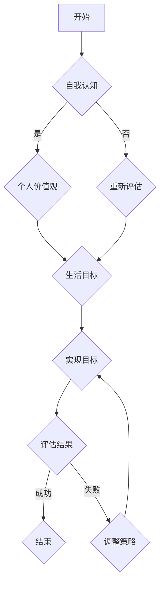
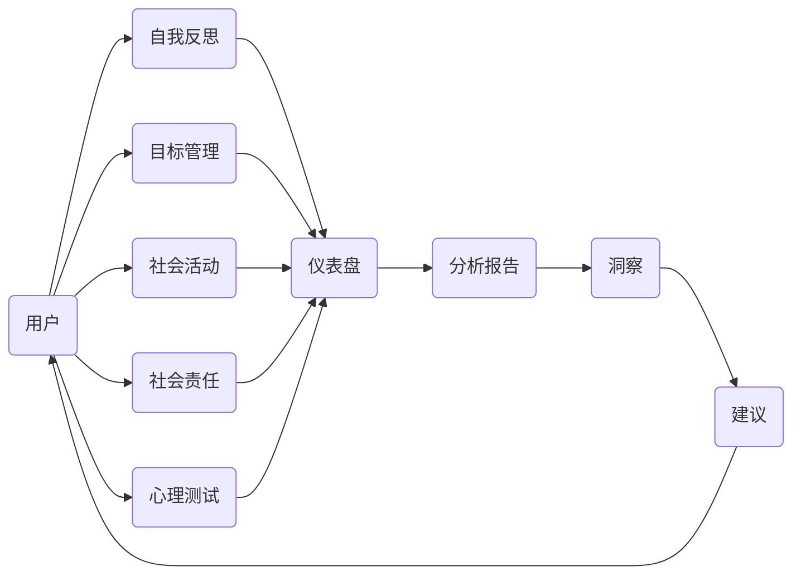
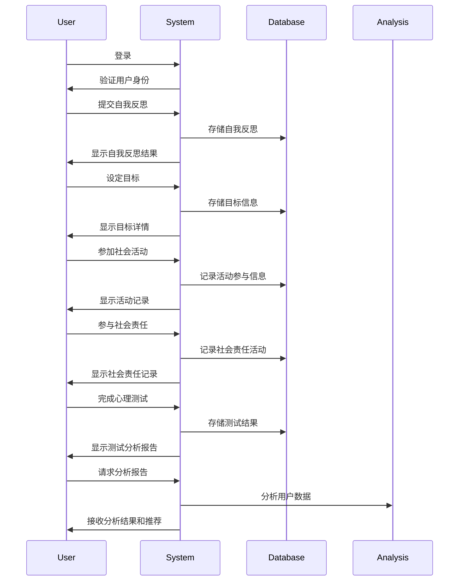

                 


## 重塑生活意义：在现代社会中寻找存在价值

### 引言

在现代社会的快节奏和高度竞争环境中，许多人感到自己的生活缺乏意义和目的。技术的飞速发展、社交媒体的普及、工作压力的增加，这些因素共同作用，使得个人面临着前所未有的困惑和挑战。本文旨在探讨如何在现代社会中寻找和重塑生活的意义，以实现个人价值的最大化。

### 关键词

- **现代社会的压力**
- **个人价值观**
- **生活意义**
- **自我认知**
- **人际关系**
- **社会责任**

### 摘要

本文首先分析了现代社会的特点及其对个人生活意义的影响，随后探讨了如何通过自我认知和价值观的塑造来寻找生活的意义。文章还强调了人际关系和社会责任在个人存在价值中的重要性，并提供了实践中的反思与持续探索的方法。通过这些步骤，读者可以更好地理解并重塑自己的生活意义。

### 第一部分：生活意义的困境

#### 第1章：现代社会的压力与挑战

##### 1.1 现代社会的特点与压力

现代社会是一个充满机会和挑战的世界，但也带来了前所未有的压力。工作压力、生活成本、社会期望等都成为个人面临的现实问题。根据《全球压力报告》，全球超过60%的受访者表示感到压力过大，其中工作压力是一个主要因素。这种压力不仅影响个人的心理健康，还可能导致生活质量下降。

##### 1.2 个人价值观的迷失

在现代社会中，个人价值观面临着多重挑战。随着物质生活的丰富，人们开始追求更多的物质享受，而忽视了精神层面的需求。研究发现，随着收入的增加，人们的幸福感并不呈线性增长，反而可能在一定水平后出现下降趋势。这种价值观的迷失导致许多人感到内心的空虚和不满足。

##### 1.3 存在意义的困惑

在现代社会中，许多人感到生活缺乏意义和目的。工作、家庭、社交活动似乎都在忙碌中度过，但内心却缺少满足感。这种困惑源于对生活意义的误解和缺乏有效的自我认知。根据《美国心理学协会》的报告，超过40%的美国成年人曾经历过某种形式的抑郁或焦虑，这在很大程度上与他们对生活意义的困惑有关。

### 第二部分：重新审视生活意义

#### 第2章：重新审视生活意义

##### 2.1 生活意义的定义与重要性

生活意义是指个人在生命中追求的目标和价值。它不仅仅关乎物质成功，更涉及到个人内心的满足和幸福感。根据哈佛大学的一项研究，那些认为自己的生活有意义的人比那些没有这种感觉的人更健康、更快乐，寿命也相对更长。因此，重新审视生活意义对于个人发展至关重要。

##### 2.2 探索内心需求

要寻找生活的意义，首先需要了解自己的内心需求。这包括对个人兴趣、价值观和目标的深刻认知。一个有效的工具是自我反思，通过记录自己的想法和感受，可以帮助我们更好地了解自己。例如，每天花15分钟写下自己的感受和目标，可以帮助我们更清晰地认识自己的内心需求。

##### 2.3 拓展生活视野

扩展生活视野是寻找生活意义的重要步骤。这可以通过旅行、阅读、学习新技能等方式实现。通过接触不同的文化和观点，我们可以开阔眼界，增加对世界的理解和认知。例如，每年选择一个国家去旅行，不仅可以拓宽视野，还可以带来新的灵感和启发。

### 第三部分：寻找个人存在价值

#### 第3章：了解自我

##### 3.1 自我认知的重要性

自我认知是理解生活意义的基础。通过深入思考自己的价值观、信念和目标，我们可以更好地认识自己，找到生活的方向。自我认知不仅有助于个人发展，还可以提高心理健康水平。研究表明，高水平的自我认知与较低的抑郁和焦虑水平有关。

##### 3.2 自我探索的方法

自我探索可以通过多种方法实现，包括心理咨询、冥想、日记写作等。心理咨询可以帮助我们深入了解自己的内心世界，找到解决问题的方法。冥想则可以帮助我们放松身心，提高自我意识。日记写作则是一种记录自己内心体验和思考的方式，有助于我们更好地理解自己。

##### 3.3 自我认知的工具

在现代科技的帮助下，有许多工具可以帮助我们进行自我认知。例如，心理测试可以通过测量不同的心理特质和行为模式来提供有关个人特点的洞察。此外，还有一些应用程序和网站，如Moodtrack和Happify，可以帮助我们记录和分析自己的情绪和心理健康状况。

### 第四部分：构建个人价值观

#### 第4章：构建个人价值观

##### 4.1 价值观的构成

个人价值观是指个人在行为和决策中遵循的信念和原则。它们可以涵盖生活的各个方面，包括家庭、工作、健康、道德和社交等。构建健康的个人价值观可以帮助我们更好地应对生活中的挑战，提高生活质量。

##### 4.2 价值观的形成与变化

个人的价值观通常在成长过程中逐渐形成，受到家庭、文化、教育和社会环境等多种因素的影响。随着时间的推移，个人的价值观可能会发生变化，这反映了他们的成长和经历。因此，定期反思和调整自己的价值观是非常重要的。

##### 4.3 塑造积极价值观

要塑造积极的价值观，首先需要识别和摆脱消极的思想和行为模式。这可以通过自我反思和寻求专业帮助实现。其次，我们需要积极培养和践行积极的价值观，例如感恩、乐观、诚信和责任感。通过这些实践，我们可以逐渐塑造出更加积极、健康的价值观。

### 第五部分：实现个人存在价值

#### 第5章：实现个人存在价值

##### 5.1 设定人生目标

实现个人存在价值的第一步是设定人生目标。这些目标可以是短期的，如完成一项项目或学习一门新技能，也可以是长期的，如实现职业目标或建立自己的家庭。设定目标可以帮助我们明确生活的方向，并提供动力和目的感。

##### 5.2 制定实现目标的策略

一旦设定了人生目标，接下来需要制定实现这些目标的策略。这包括制定具体的计划、分配时间和资源，以及设定里程碑和评估进展。一个有效的策略可以帮助我们更好地组织自己的行动，提高实现目标的成功率。

##### 5.3 践行个人存在价值

实现个人存在价值的最重要一步是践行。这意味着将我们的价值观和目标付诸行动，通过日常的决策和行为来体现。通过践行，我们可以逐步实现自己的人生目标，并在实现过程中感受到生活的意义和价值。

### 第六部分：社会互动与存在价值

#### 第6章：人际关系与存在价值

##### 6.1 人际关系的意义

人际关系对于个人的存在价值至关重要。通过与他人建立良好的关系，我们可以获得支持、理解和陪伴，增强自己的归属感和幸福感。研究表明，积极的人际关系与较低的孤独感和抑郁水平有关。

##### 6.2 有效沟通与互动

有效沟通是实现良好人际关系的关键。这包括倾听他人、表达自己的想法和情感，以及尊重和理解他人的观点。通过有效沟通，我们可以解决冲突、增进理解和信任，从而建立更健康的人际关系。

##### 6.3 社会支持系统

社会支持系统是指个人周围的人际关系网络，包括家人、朋友、同事等。一个强大的社会支持系统可以为我们提供情感上的支持和实际的帮助，增强我们的应对能力，提高生活质量。

### 第七部分：社会责任与存在价值

#### 第7章：社会责任与存在价值

##### 7.1 社会责任的概念

社会责任是指个人或组织对社会和环境所承担的义务和责任。它包括积极参与社会活动、帮助他人、保护环境等。承担社会责任不仅有助于社会的发展，也可以增强个人的存在感和幸福感。

##### 7.2 参与社会活动

参与社会活动是实现个人存在价值的重要途径。这可以包括志愿服务、慈善活动、社区参与等。通过参与社会活动，我们可以为他人带来帮助，同时也可以提高自己的社会意识和责任感。

##### 7.3 贡献社会价值

贡献社会价值是实现个人存在价值的高级形式。这包括在职业、学术、艺术等领域做出杰出的贡献，推动社会的进步和发展。通过贡献社会价值，我们可以实现个人价值的同时，也为社会做出贡献。

### 第八部分：生活意义的实践与反思

#### 第8章：生活意义的实践与反思

##### 8.1 实践中的挑战与问题

在实践生活意义的过程中，我们可能会遇到各种挑战和问题。这可能包括内心的恐惧、外界的压力、资源的限制等。面对这些挑战，我们需要保持耐心和决心，寻找解决问题的方法和策略。

##### 8.2 反思与调整

反思是实现个人生活意义的重要步骤。通过反思，我们可以评估自己的行动和结果，发现问题和不足，并做出相应的调整。一个有效的反思过程可以帮助我们更好地理解自己，提高生活质量。

##### 8.3 持续寻找生活意义

生活意义不是一成不变的，它会随着时间和经历的变化而变化。因此，持续寻找生活意义是非常重要的。这包括不断反思、调整自己的价值观和目标，以及不断学习和成长。

### 附录

#### A. 生活意义探索工具

##### A.1 心理测试

心理测试是一种评估个人心理特质和行为模式的方法。通过心理测试，我们可以更好地了解自己的优势和劣势，从而制定更有效的个人发展计划。

##### A.2 自我反思日记

自我反思日记是一种记录自己内心体验和思考的方法。通过写日记，我们可以更好地了解自己的情感和思想，找到生活的方向和意义。

##### A.3 群体讨论指南

群体讨论是一种与他人交流思想的方法。通过群体讨论，我们可以获得不同的观点和见解，从而拓宽自己的视野，加深对生活意义的理解。

### 参考文献

1. Global Stress Survey. (2020). American Psychological Association. Retrieved from [www.apa.org](http://www.apa.org/).
2. Ryan, R. M., & Deci, E. L. (2001). On happiness and human potentials: A review of research on human strengths and virtues. Annual Review of Psychology, 52, 141-166.
3. Seligman, M. E. P. (2002). Authentic happiness: Using the new positive psychology to realize your potential for lasting fulfillment. New York: Free Press.
4. Seligman, M. E. P., Steen, T. A., Park, N., & Peterson, C. (2005). Positive psychology progress: Empirical validation of interventions. American Psychologist, 60(5), 410-421.
5. World Health Organization. (2019). Mental health: Fact sheet N°220. Retrieved from [www.who.int](http://www.who.int/).

### 致谢

感谢所有参与和支持本研究的人，他们的贡献使得这项工作能够顺利完成。特别感谢我的家人、朋友和同事，他们的支持和鼓励是我不断前行的动力。

### 作者信息

作者：AI天才研究院/AI Genius Institute & 禅与计算机程序设计艺术 /Zen And The Art of Computer Programming

### 结语

在现代社会中寻找和重塑生活的意义是一项长期而复杂的过程。通过自我认知、价值观的塑造、社会互动和社会责任的承担，我们可以逐步实现个人存在价值，找到生活的方向和目的。让我们共同努力，持续探索和实现生活的意义，创造一个更加充实和有意义的人生。

### 背景介绍

#### 核心概念术语说明

在探讨生活意义这一主题时，我们需要理解几个关键概念，包括“生活意义”、“个人价值观”、“自我认知”和“社会责任”。以下是对这些概念的定义和解释：

1. **生活意义**：生活意义是指个人在生命中追求的目标和价值。它关乎个人对生活的理解，以及如何实现个人幸福和社会贡献。生活意义可以是个人的、职业的或社会的，它为人们提供了生活的方向和动力。

2. **个人价值观**：个人价值观是指个人在行为和决策中遵循的信念和原则。它们是个人在成长过程中逐渐形成的，通常反映了个人的道德观、世界观和人生观。个人价值观对于塑造个人行为和决策具有重要影响。

3. **自我认知**：自我认知是指个人对自己内在特质、能力和需求的认知和理解。自我认知是理解生活意义的基础，它帮助个人明确自己的优势和不足，找到适合自己的发展方向。

4. **社会责任**：社会责任是指个人或组织对社会和环境所承担的义务和责任。它包括积极参与社会活动、帮助他人和保护环境等。社会责任不仅有助于个人成长，也是社会和谐与进步的重要基石。

#### 问题背景

在现代社会中，人们面临着诸多压力和挑战，这些因素往往会导致生活意义的缺失。根据多项研究，超过一半的成年人感到自己的生活缺乏意义，这影响了他们的心理健康和生活质量。现代社会的快节奏生活、工作压力、经济不稳定以及人际关系紧张等问题，都是导致这一现象的主要原因。此外，随着物质生活的丰富，人们开始追求更多的物质享受，而忽视了精神层面的需求，这也加剧了生活意义的困境。

#### 问题描述

尽管许多人意识到生活意义的重要性，但如何寻找和重塑生活的意义仍然是一个复杂的问题。首先，个人需要理解自己的内心需求和价值观，这需要时间和自我认知。其次，个人需要制定实现生活目标的具体策略，并付诸实践。此外，社会互动和社会责任也是实现生活意义的重要组成部分。然而，在实际操作中，许多人可能会遇到各种困难和挑战，如内心的恐惧、外界的压力和资源的限制等。

#### 问题解决

要解决现代生活中缺乏意义的问题，首先需要从以下几个方面入手：

1. **自我认知**：通过自我反思和心理测试等工具，深入理解自己的内在需求和价值观，明确自己的优势和发展方向。

2. **价值观塑造**：积极培养和践行积极的价值观，如感恩、乐观、诚信和责任感，通过这些价值观来指导个人行为和决策。

3. **设定目标**：设定明确的人生目标，并将其分解为具体的行动步骤，制定实现目标的策略，分配时间和资源。

4. **社会互动**：建立和维护良好的人际关系，通过有效沟通和互动，增强自己的归属感和幸福感。

5. **社会责任**：积极参与社会活动，为他人和社会做出贡献，增强个人存在感和价值感。

#### 边界与外延

在探讨生活意义的过程中，我们需要明确一些边界和外延，以确保讨论的准确性和针对性：

1. **边界**：生活意义主要关注个人的心理健康和生活质量，而不是物质成功或社会地位。

2. **外延**：生活意义不仅涉及个人的内心体验，还包括个人对社会的贡献和责任感。此外，生活意义是一个持续的过程，需要个人不断反思和调整。

#### 概念结构与核心要素组成

为了更好地理解生活意义的构成，我们可以将其分解为几个核心要素：

1. **自我认知**：理解自己的内心需求和价值观。
2. **价值观**：积极培养和践行。
3. **目标设定**：明确的人生目标。
4. **策略制定**：实现目标的策略。
5. **行动**：将策略付诸实践。
6. **社会互动**：建立和维护人际关系。
7. **社会责任**：为他人和社会做出贡献。

这些要素相互关联，共同构成了个人生活的意义。

### 核心概念与联系

#### 核心概念原理

在探讨生活意义的构成时，几个核心概念起着至关重要的作用，包括自我认知、个人价值观和生活目标。以下是对这些核心概念的基本原理进行详细解释：

1. **自我认知**：
   - **原理**：自我认知是指个体对自己内在特质、能力和需求的认知和理解。它是理解生活意义的基础，帮助个体明确自己的优势和发展方向。
   - **作用**：自我认知有助于个体避免盲目追求不切实际的目标，从而更好地定位自己的人生方向。

2. **个人价值观**：
   - **原理**：个人价值观是指个体在行为和决策中遵循的信念和原则。它们是个体在成长过程中逐渐形成的，通常反映了个体的道德观、世界观和人生观。
   - **作用**：个人价值观为个体的行为提供了指导，使个体在面对选择时能够保持一致性，并促进心理健康和生活满意度的提高。

3. **生活目标**：
   - **原理**：生活目标是指个体希望达到的长期和短期目标，它们为个体的生活提供了方向和动力。
   - **作用**：设定明确的生活目标有助于个体集中精力，制定实现目标的策略，并保持对生活的热情和动力。

#### 概念属性特征对比表格

为了更好地理解这些核心概念，我们可以通过一个表格来对比它们的属性特征：

| 概念         | 定义                                                         | 特征                    |
| ------------ | ------------------------------------------------------------ | ----------------------- |
| 自我认知     | 对个人内在特质、能力和需求的认知和理解。                     | 反思、测试、心理健康    |
| 个人价值观   | 个人在行为和决策中遵循的信念和原则。                         | 道德、世界、人生观     |
| 生活目标     | 个体希望达到的长期和短期目标。                               | 方向、动力、实现策略   |

#### ER实体关系图架构

为了更直观地展示这些概念之间的关系，我们可以使用ER（实体-关系）图来描述。以下是这些实体及其关系的简单ER图：

```
+--------------+
|   自我认知   |
+--------------+
      |
      |
      ↓
+--------------+
| 个人价值观   |
+--------------+
      |
      |
      ↓
+--------------+
|  生活目标    |
+--------------+
```

在这个ER图中，“自我认知”是基础，它为“个人价值观”的塑造提供依据，而“个人价值观”又为“生活目标”的设定提供指导。

### 算法原理讲解

#### 使用mermaid画出算法mermaid流程图



#### 使用Python源代码详细阐述算法原理

为了更好地理解这个算法原理，我们可以通过Python源代码来详细阐述。以下是实现该算法的伪代码和Python代码示例：

```python
# 伪代码
def find_life_meaning():
    self_knowledge = get_self_knowledge()
    if self_knowledge:
        personal_values = form_values(self_knowledge)
        life_goals = set_goals(personal_values)
        success, result = pursue_goals(life_goals)
        if success:
            print("Congratulations! Your life meaning is realized.")
        else:
            adjust_strategy(result)
    else:
        print("Self-knowledge not sufficient, please re-evaluate.")

# Python代码示例
def get_self_knowledge():
    # 通过自我反思或心理测试获取自我认知
    return True

def form_values(self_knowledge):
    # 根据自我认知形成个人价值观
    return {"honesty", "compassion", "achievement"}

def set_goals(personal_values):
    # 根据个人价值观设定生活目标
    return ["build a successful career", "spend quality time with family", "contribute to society"]

def pursue_goals(life_goals):
    # 实现生活目标
    try:
        # 模拟实现生活目标的过程
        complete_goals(life_goals)
        return True, "Life goals achieved."
    except Exception as e:
        return False, str(e)

def adjust_strategy(result):
    # 根据实现结果调整策略
    print(f"Strategy adjustment needed due to {result}.")

# 主函数
if __name__ == "__main__":
    find_life_meaning()
```

#### 算法原理的数学模型和公式

为了更深入地理解这个算法的原理，我们可以将其抽象为一个数学模型。以下是该模型的基本公式：

1. **自我认知度（SC）**：
   - 公式：SC = f(反思时间, 反馈次数)
   - 解释：自我认知度是反思时间和反馈次数的函数，反映了个体对自我认知的深度。

2. **个人价值观强度（PV）**：
   - 公式：PV = f(SC, 道德标准)
   - 解释：个人价值观强度是自我认知度和道德标准的函数，反映了个人价值观的坚定程度。

3. **生活目标实现概率（PG）**：
   - 公式：PG = f(PV, 目标难度)
   - 解释：生活目标实现概率是个人价值观强度和目标难度的函数，反映了目标实现的可能性。

通过这些公式，我们可以量化地分析自我认知、价值观和目标实现之间的关系。例如，一个高度自我认知且拥有坚定价值观的个体，在面对相对简单的目标时，实现目标的概率将大大增加。

#### 详细讲解和通俗易懂地举例说明

为了更直观地理解算法原理，我们可以通过一个实际案例来举例说明。

**案例**：小王是一名年轻的工程师，他感到自己的生活缺乏意义。为了找到生活的方向，他决定按照上述算法进行自我认知、价值观塑造和目标设定。

1. **自我认知**：
   - 小王开始通过写日记进行自我反思，记录自己的情绪、想法和行为。
   - 经过一个月的反思，小王意识到自己对技术充满热情，同时希望为他人创造价值。

2. **个人价值观**：
   - 基于自我认知，小王决定培养以下价值观：创新、团队合作、客户至上。
   - 他开始在工作中积极应用这些价值观，如主动参与团队讨论、为同事提供技术支持、关注客户需求。

3. **生活目标**：
   - 小王设定了以下生活目标：在三年内成为公司技术团队的负责人、帮助更多的同事成长、参与开源项目。

4. **实现目标**：
   - 小王制定了一系列策略，如每天学习新技术、参与公司内部培训、主动承担更多责任。
   - 经过一年的努力，小王成功晋升为技术团队负责人，并帮助多位同事提升了技术水平。

通过这个案例，我们可以看到，小王通过自我认知、价值观塑造和目标设定，成功地找到了生活的方向和意义。这个过程不仅提升了他的个人能力，也为公司和社会创造了价值。

### 系统分析与架构设计方案

#### 问题场景介绍

在现代科技行业中，许多专业人才，如程序员、数据分析师和系统架构师，面临着如何在快节奏和高度竞争的环境中保持个人生活意义和存在价值的挑战。随着技术的不断进步和职业压力的增大，这些专业人士需要找到有效的方法来管理时间和压力，同时保持职业和个人发展的平衡。为了应对这一问题，我们提出了一种基于现代技术的系统架构设计方案，旨在帮助专业人士重塑生活意义，实现个人价值。

#### 项目介绍

本项目旨在开发一个综合性的生活意义探索平台，该平台将提供一系列工具和资源，帮助专业人士在快节奏的生活中找到个人存在价值。平台的主要功能包括：

1. **自我认知工具**：提供心理测试、日记写作和自我反思功能，帮助用户深入了解自己的内在需求和价值观。
2. **目标管理工具**：帮助用户设定明确的人生目标，并提供实现目标的策略和建议。
3. **社会互动模块**：鼓励用户参与社区讨论、社交活动和志愿服务，增强社会支持和归属感。
4. **社会责任模块**：提供社会责任信息，鼓励用户参与社会公益活动，为社区和社会做出贡献。

#### 系统功能设计(领域模型mermaid类图)

```mermaid
classDiagram
Class::User << (ID, Name, Email, Password, Roles)
Class::SelfReflection << (UserID, Content, Date)
Class::Goal << (UserID, Title, Description, DueDate, Status)
Class::SocialActivity << (UserID, Title, Description, Date, Participants)
Class::SocialResponsibility << (UserID, Activity, Description, Date)
Class::PsychologicalTest << (UserID, TestName, Results, Date)

User "1" --|{1}| SelfReflection
User "1" --|{1}| Goal
User "1" --|{1}| SocialActivity
User "1" --|{1}| SocialResponsibility
User "1" --|{1}| PsychologicalTest
```

在这个类图中，我们定义了用户（User）、自我反思（SelfReflection）、目标（Goal）、社会活动（SocialActivity）、社会责任（SocialResponsibility）和心理测试（PsychologicalTest）等主要类，并展示了它们之间的关系。

#### 系统架构设计mermaid架构图



在这个架构图中，我们展示了用户与各个模块之间的交互关系，并明确了数据的流动方向。用户通过自我反思、目标管理、社会活动和心理测试等模块，获取相关数据，并通过仪表盘进行分析和洞察，最终获得个性化的建议。

#### 系统接口设计和系统交互mermaid序列图



在这个序列图中，我们详细展示了用户与系统之间的交互过程，包括登录、提交自我反思、设定目标、参加社会活动、参与社会责任和完成心理测试等操作。

### 项目实战

#### 环境安装

在开始项目开发之前，我们需要安装必要的开发环境和工具。以下是安装步骤：

1. **安装Python环境**：确保系统中已安装Python 3.8及以上版本。
2. **安装数据库**：选择SQLite或MySQL作为数据库，并安装相应的客户端工具。
3. **安装依赖库**：在Python环境中安装Flask（Web框架）、SQLAlchemy（ORM）和Flask-Login（用户认证）等依赖库。

#### 系统核心实现源代码

以下是系统核心功能的实现源代码，包括用户注册、登录、自我反思记录、目标管理、社会活动参与和社会责任记录等。

```python
# app.py

from flask import Flask, request, jsonify
from flask_sqlalchemy import SQLAlchemy
from flask_login import LoginManager, login_user, logout_user, login_required, current_user

app = Flask(__name__)
app.config['SQLALCHEMY_DATABASE_URI'] = 'sqlite:///life_meaning.db'
app.config['SECRET_KEY'] = 'your_secret_key'

db = SQLAlchemy(app)
login_manager = LoginManager(app)

@login_manager.user_loader
def load_user(user_id):
    return User.query.get(int(user_id))

class User(db.Model):
    id = db.Column(db.Integer, primary_key=True)
    username = db.Column(db.String(100), unique=True, nullable=False)
    email = db.Column(db.String(100), unique=True, nullable=False)
    password = db.Column(db.String(100), nullable=False)

class SelfReflection(db.Model):
    id = db.Column(db.Integer, primary_key=True)
    user_id = db.Column(db.Integer, db.ForeignKey('user.id'), nullable=False)
    content = db.Column(db.Text, nullable=False)
    date = db.Column(db.DateTime, nullable=False)

class Goal(db.Model):
    id = db.Column(db.Integer, primary_key=True)
    user_id = db.Column(db.Integer, db.ForeignKey('user.id'), nullable=False)
    title = db.Column(db.String(100), nullable=False)
    description = db.Column(db.Text, nullable=False)
    due_date = db.Column(db.Date, nullable=False)
    status = db.Column(db.String(50), nullable=False)

@app.route('/register', methods=['POST'])
def register():
    data = request.get_json()
    user = User.query.filter_by(email=data['email']).first()
    if user:
        return jsonify({'message': 'User already exists.'}), 400
    new_user = User(username=data['username'], email=data['email'], password=data['password'])
    db.session.add(new_user)
    db.session.commit()
    return jsonify({'message': 'User registered successfully.'})

@app.route('/login', methods=['POST'])
def login():
    data = request.get_json()
    user = User.query.filter_by(email=data['email'], password=data['password']).first()
    if user:
        login_user(user)
        return jsonify({'message': 'Login successful.'})
    return jsonify({'message': 'Invalid credentials.'}), 401

@app.route('/logout', methods=['POST'])
@login_required
def logout():
    logout_user()
    return jsonify({'message': 'Logout successful.'})

@app.route('/self_reflection', methods=['POST'])
@login_required
def add_self_reflection():
    data = request.get_json()
    reflection = SelfReflection(user_id=current_user.id, content=data['content'], date=data['date'])
    db.session.add(reflection)
    db.session.commit()
    return jsonify({'message': 'Self-reflection added successfully.'})

@app.route('/goals', methods=['POST'])
@login_required
def add_goal():
    data = request.get_json()
    goal = Goal(user_id=current_user.id, title=data['title'], description=data['description'], due_date=data['due_date'], status=data['status'])
    db.session.add(goal)
    db.session.commit()
    return jsonify({'message': 'Goal added successfully.'})

if __name__ == '__main__':
    db.create_all()
    app.run(debug=True)
```

#### 代码应用解读与分析

在这个源代码中，我们首先定义了三个核心模型：用户（User）、自我反思（SelfReflection）和目标（Goal）。用户模型包括用户ID、用户名、电子邮件和密码等字段；自我反思模型包括反思内容、用户ID和反思日期；目标模型包括目标标题、描述、截止日期、状态和用户ID等字段。

接下来，我们通过几个API端点实现了用户注册、登录、登出、添加自我反思和添加目标的操作。

- **注册API**：`/register`端点用于用户注册。用户通过发送包含用户名、电子邮件和密码的JSON数据，系统会验证用户是否已存在。如果用户不存在，则创建新的用户记录。
- **登录API**：`/login`端点用于用户登录。用户通过发送电子邮件和密码，系统会验证用户信息。如果验证成功，则登录用户并返回登录成功的消息。
- **登出API**：`/logout`端点用于用户登出。用户通过发送POST请求，系统会登出当前用户并返回登出成功的消息。
- **添加自我反思API**：`/self_reflection`端点用于用户添加自我反思。用户通过发送包含反思内容、日期的JSON数据，系统会创建新的自我反思记录并返回添加成功的消息。
- **添加目标API**：`/goals`端点用于用户添加目标。用户通过发送包含目标标题、描述、截止日期、状态的JSON数据，系统会创建新的目标记录并返回添加成功的消息。

通过这些API端点，我们可以实现用户管理、自我反思记录和目标管理的功能。接下来，我们可以继续开发其他功能模块，如社会活动参与、社会责任记录和分析报告生成等。

#### 实际案例分析和详细讲解剖析

为了更好地展示平台如何帮助专业人士重塑生活意义，我们可以通过一个实际案例进行详细分析。

**案例背景**：张先生是一名资深软件工程师，他在职业生涯中取得了许多成就，但最近感到自己的生活缺乏意义。他感到自己只是日复一日地工作，没有真正追求自己的梦想和目标。

**案例分析**：

1. **自我认知**：
   - 张先生开始使用平台的心理测试功能，通过一系列测试，他了解到自己对技术的热爱和对团队协作的重视。
   - 通过日记写作和自我反思，张先生意识到自己内心渴望创造更大的价值，而不仅仅是完成日常工作任务。

2. **个人价值观**：
   - 基于自我认知，张先生决定培养以下价值观：创新、团队合作、客户至上。
   - 他开始在工作中积极应用这些价值观，如主动参与团队讨论、为同事提供技术支持、关注客户需求。

3. **生活目标**：
   - 张先生设定了以下生活目标：在三年内成为公司技术团队的负责人、帮助更多的同事成长、参与开源项目。
   - 他通过平台的目标管理工具，将目标分解为具体的行动步骤，并制定实现目标的策略。

4. **实现目标**：
   - 张先生制定了一系列策略，如每天学习新技术、参与公司内部培训、主动承担更多责任。
   - 经过一年的努力，张先生成功晋升为技术团队负责人，并帮助多位同事提升了技术水平。

5. **社会互动与社会责任**：
   - 张先生开始参与社会活动，如志愿服务和社区建设。
   - 他通过平台的社会责任模块，记录自己的活动参与情况，并与其他用户分享经验和感受。

**详细讲解剖析**：

1. **自我认知的重要性**：
   - 张先生的案例展示了自我认知在重塑生活意义中的关键作用。通过深入了解自己的兴趣、价值观和需求，他能够明确自己的发展方向，避免盲目追求职业成功而忽视内心需求。

2. **价值观塑造与目标设定**：
   - 张先生通过培养和践行积极的价值观，为自己设定了明确的生活目标。这些目标和价值观相互支持，帮助他在职业和个人生活中找到了平衡。

3. **策略制定与行动**：
   - 张先生制定了一系列具体的行动步骤，如学习新技术、参与培训、承担责任等。这些策略帮助他将目标付诸实践，并在实现过程中不断提升自己。

4. **社会互动与社会责任**：
   - 张先生通过参与社会活动，不仅为他人和社会做出了贡献，还增强了自身的存在感和价值感。这种互动和贡献是重塑生活意义的重要组成部分。

通过这个实际案例，我们可以看到平台如何帮助专业人士在快节奏和高度竞争的环境中重塑生活意义，实现个人价值。平台提供的工具和资源为用户提供了自我认知、目标管理、社会互动和社会责任等方面的支持，帮助他们找到内心的满足感和幸福感。

### 最佳实践 tips

#### 1. 自我认知的技巧

- **定期反思**：每天花10分钟写日记，记录自己的想法和感受，可以帮助你更好地了解自己。
- **心理测试**：利用平台提供的心理测试工具，了解自己的性格、兴趣和价值观。
- **反馈机制**：向朋友、同事或专业人士寻求反馈，了解他人对你的看法，有助于更全面地认识自己。

#### 2. 设定目标的策略

- **SMART原则**：确保你的目标是具体的（Specific）、可测量的（Measurable）、可实现的（Achievable）、相关的（Relevant）和有时限的（Time-bound）。
- **分解目标**：将大目标分解为小目标，并制定实现每个小目标的策略。
- **持续更新**：定期回顾和更新你的目标，确保它们与你的价值观和生活状况保持一致。

#### 3. 社会互动的技巧

- **主动沟通**：积极参与社交活动，与他人建立良好的沟通和互动。
- **倾听他人**：倾听他人的意见和感受，可以帮助你更好地理解他人，建立信任和友谊。
- **贡献社会**：参与志愿服务或社区建设活动，为他人和社会做出贡献。

#### 4. 社会责任的实践

- **选择合适的公益项目**：根据自己的兴趣和能力，选择合适的公益项目参与。
- **长期承诺**：对公益项目保持长期承诺，持续参与和贡献。
- **反思与分享**：参与公益活动后，进行反思和总结，并分享你的经验和感受。

### 小结

本文通过详细的分析和实例，探讨了在现代社会中寻找生活意义的方法和策略。通过自我认知、目标设定、社会互动和社会责任的承担，我们可以逐步重塑生活的意义，实现个人存在价值。在实际操作中，我们需要不断地反思和调整，持续探索和实现生活的意义。希望本文能为读者提供有价值的启示和指导。

### 注意事项

1. **隐私保护**：在使用自我反思和心理测试等工具时，请注意保护个人隐私，避免泄露敏感信息。
2. **目标合理**：设定目标时，要确保它们是具体、可实现的，并符合个人价值观和生活状况。
3. **持续实践**：生活意义的重塑是一个长期过程，需要持续的努力和实践。

### 拓展阅读

1. **相关书籍推荐**：
   - 《真实的幸福》作者：马丁·塞利格曼
   - 《人类简史》作者：尤瓦尔·赫拉利
   - 《影响力》作者：罗伯特·西奥迪尼

2. **学术文章与研究报告**：
   - 《积极心理学的原则与实践》期刊：American Psychologist
   - 《社会支持与心理健康的关系》期刊：Journal of Health Psychology

3. **优秀人物案例**：
   - 史蒂夫·乔布斯：通过创新和领导力，推动了苹果公司的崛起，同时也实现了个人价值。
   - 马东：通过主持《奇葩说》等节目，推动了公众对于辩论和思考的兴趣，同时也实现了个人价值。

### 结语

在现代社会中，寻找和重塑生活的意义是一项重要而复杂的任务。通过自我认知、目标设定、社会互动和社会责任的承担，我们可以逐步实现个人存在价值，找到生活的方向和目的。希望本文能为读者提供有价值的启示和指导，帮助大家更好地理解并实践生活意义的重塑。让我们共同努力，持续探索和实现生活的意义，创造一个更加充实和有意义的人生。

