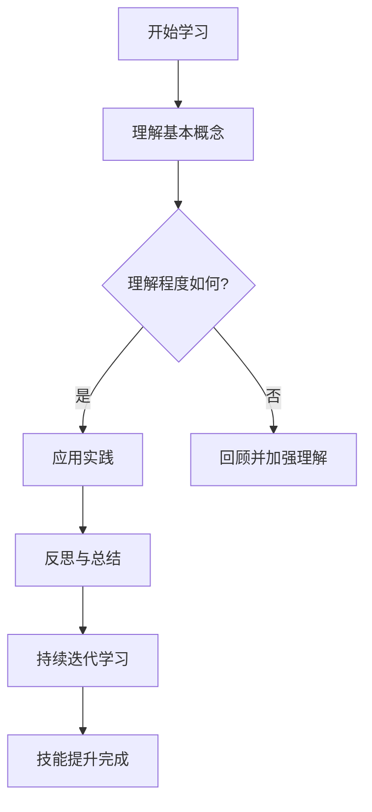
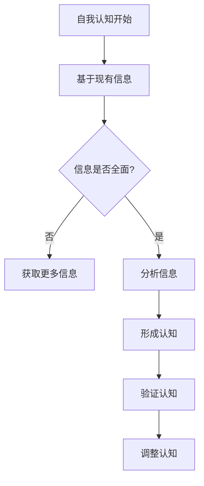
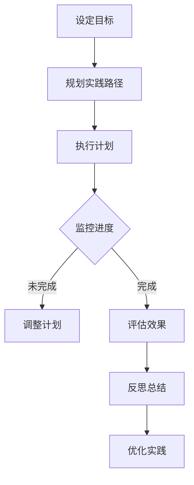

                 


# 《重新定义个人成长：从外在成就到内在成熟的转变》

> 关键词：个人成长、内在成熟、外在成就、成长路径、情绪管理、价值观、自我认知

> 摘要：本文旨在重新定义个人成长，从外在成就到内在成熟的转变。通过分析外在成就与内在成熟的关系，阐述个人成长的多维视角，探讨如何实现从外在成就到内在成熟的转变，为读者提供全面的成长指导。

## 第一部分：问题背景与核心概念

### 1.1.1 问题的提出

在当今社会，个人成长已经成为人们普遍关注的话题。然而，传统观念中，个人成长往往被等同于外在成就的积累，如财富、地位、名誉等。然而，随着社会的发展，人们开始意识到，外在成就并非个人成长的唯一标准，甚至可能不是最重要的标准。因此，如何重新定义个人成长，从外在成就到内在成熟的转变，成为一个亟待解决的问题。

### 1.1.2 个人成长的多维视角

个人成长是一个多维度的过程，不仅仅包括外在成就的积累，还包括内在品质的提升。外在成就与内在成熟之间存在着辩证关系，外在成就可以为内在成熟提供物质基础，而内在成熟则可以为外在成就提供精神支撑。因此，重新定义个人成长，需要从外在成就与内在成熟两个维度进行思考。

### 1.1.3 外在成就与内在成熟的辩证关系

外在成就与内在成熟并非对立的关系，而是相互促进、相互转化的关系。外在成就可以通过努力实现，而内在成熟则需要时间的沉淀和内心的修炼。在实现外在成就的同时，我们需要关注内在成熟，以实现个人成长的全面性。

### 1.1.4 本书的目标与结构

本书的目标是重新定义个人成长，提供一种从外在成就到内在成熟的转变路径。本书将分为四个部分：问题背景与核心概念、外在成就的成长路径、内在成熟的探索与实践、综合实践与案例分享。通过逐步分析，帮助读者实现个人成长的转变。

## 第二部分：外在成就的成长路径

### 第2章：设定目标与规划

#### 2.1.1 目标设定的基本原则

在实现外在成就的过程中，目标设定至关重要。首先，目标要具有明确性，即具体、可衡量、可实现。其次，目标要具有挑战性，即激励个人不断超越自我。最后，目标要具有时间限制，以促使个人在有限的时间内实现成长。

#### 2.1.2 如何制定可行的成长计划

制定成长计划需要遵循以下原则：一是分解目标，将大目标分解为小目标，逐步实现；二是制定时间表，为每个小目标设定具体的时间节点；三是持续跟踪进度，定期评估成长计划的有效性。

#### 2.1.3 成长路径中的挑战与应对策略

在成长路径中，我们可能会面临各种挑战，如时间管理、技能提升、人脉构建等。针对这些挑战，我们可以采取以下应对策略：一是制定详细的计划，提前预判可能遇到的问题；二是学会分解问题，将复杂问题拆分为可解决的子问题；三是保持积极心态，勇于面对困难。

### 第3章：技能提升与知识积累

#### 3.1.1 技能提升的重要性

技能提升是实现外在成就的关键。通过不断学习新技能，我们可以提高自己的竞争力，从而实现更大的成就。技能提升不仅包括技术技能，还包括人际交往、领导力等方面的技能。

#### 3.1.2 如何有效学习新技能

有效学习新技能需要遵循以下原则：一是选择适合自己的学习方式，如线上课程、线下培训、自学等；二是制定学习计划，确保学习目标的实现；三是积极参与实践，将所学知识应用于实际工作中。

#### 3.1.3 知识积累的方法与工具

知识积累是实现技能提升的基础。我们可以通过以下方法进行知识积累：一是广泛阅读，包括专业书籍、行业资讯、学术期刊等；二是参加行业会议、讲座等活动，与同行交流；三是利用互联网资源，如在线课程、技术论坛等。

### 第4章：网络与人脉的构建

#### 4.1.1 人脉网络的重要性

人脉网络对于个人成长具有重要意义。一个强大的人脉网络可以帮助我们获取资源、拓宽视野、提高影响力。因此，建立和维护良好的人脉网络是个人成长的重要一环。

#### 4.1.2 如何建立有效的社交网络

建立有效的社交网络需要遵循以下原则：一是主动拓展人脉，积极参与各类社交活动；二是真诚待人，建立互信关系；三是善于利用社交工具，如微信、LinkedIn等，保持与他人的联系。

#### 4.1.3 人脉管理的方法与技巧

人脉管理需要遵循以下原则：一是分类管理，将人脉分为不同类型，如朋友、同事、客户等；二是保持联系，定期与人脉保持互动；三是善于利用人脉资源，为他人提供帮助。

## 第三部分：内在成熟的探索与实践

### 第5章：情绪管理与心理健康

#### 5.1.1 情绪管理的重要性

情绪管理是实现内在成熟的关键。良好的情绪管理可以帮助我们更好地应对生活中的压力，提高心理韧性，从而实现个人的全面发展。

#### 5.1.2 常见情绪问题的应对策略

常见情绪问题包括焦虑、抑郁、愤怒等。针对这些问题，我们可以采取以下应对策略：一是认知重塑，改变对事物的看法；二是行为调整，通过运动、冥想等方式缓解情绪；三是寻求专业帮助，如心理咨询等。

#### 5.1.3 心理健康的维护与提升

心理健康是内在成熟的重要组成部分。我们可以通过以下方式维护和提升心理健康：一是保持良好的生活习惯，如规律作息、健康饮食等；二是培养兴趣爱好，丰富内心世界；三是积极参与社会活动，与他人建立良好关系。

### 第6章：价值观与人生观的重塑

#### 6.1.1 价值观的形成与转变

价值观是个人成长的内在驱动力量。价值观的形成受到家庭、教育、社会等多方面因素的影响。随着个人的成长和阅历的增加，价值观也会发生转变。

#### 6.1.2 人生观的重要性

人生观是个人对生活的看法和态度。一个积极向上的人生观可以帮助我们更好地面对生活的挑战，实现个人的全面发展。

#### 6.1.3 如何塑造积极的人生观

塑造积极的人生观需要从以下几个方面进行：一是正确看待生活中的得失，学会感恩；二是树立正确的人生目标，不断追求进步；三是保持积极的心态，勇敢面对困难。

### 第7章：自我认知与成长反思

#### 7.1.1 自我认知的误区与正确方法

自我认知是实现个人成长的重要基础。然而，人们在自我认知过程中往往存在误区，如过度自我评价、忽视自身优点等。正确的方法是通过自我反思、与他人交流等方式，全面了解自己的优点和不足。

#### 7.1.2 成长反思的意义与技巧

成长反思是个人成长的必要环节。通过反思，我们可以发现自己的不足，总结经验教训，为未来的成长提供指导。成长反思的技巧包括定期总结、主动寻求反馈、勇于面对问题等。

#### 7.1.3 如何从反思中获取成长

从反思中获取成长需要遵循以下原则：一是正视问题，不逃避；二是积极寻找解决方案，勇于尝试；三是持续反思，不断优化自己的成长路径。

## 第四部分：综合实践与案例分享

### 第8章：综合实践方法

#### 8.1.1 综合实践的重要性

综合实践是将所学知识应用于实际生活的过程，是实现个人成长的重要途径。通过综合实践，我们可以更好地理解知识，提高自己的能力。

#### 8.1.2 综合实践的方法与步骤

综合实践的方法包括以下步骤：一是明确实践目标，二是制定实践计划，三是执行实践计划，四是总结实践成果，五是反思实践过程。

#### 8.1.3 成功实践的关键因素

成功实践的关键因素包括：一是明确目标，二是充分准备，三是积极参与，四是持续反思。

### 第9章：案例分享与启示

#### 9.1.1 成功案例分享

在本章中，我们将分享一些成功的个人成长案例，包括外在成就的取得和内在成熟的过程。

#### 9.1.2 案例中的共性与差异

通过对比分析成功案例，我们可以发现一些共性和差异。共性包括：坚定的信念、持续的努力、积极的心态等；差异则体现在各自的具体实践中。

#### 9.1.3 案例启示与个人应用

成功案例为我们提供了宝贵的启示，我们可以根据自身情况，借鉴其中的经验，制定适合自己的成长计划。

## 第10章：结语与展望

#### 10.1.1 成长过程中的自我超越

个人成长是一个不断超越自我的过程。在成长过程中，我们要敢于挑战自我，不断突破自己的舒适区。

#### 10.1.2 内在成熟的意义与价值

内在成熟是个人成长的终极目标。内在成熟不仅可以提升个人的综合素质，还可以为他人带来积极影响。

#### 10.1.3 对未来的展望与建议

未来，个人成长将更加注重内在成熟。我们建议读者在成长过程中，关注自身的内在成长，实现从外在成就到内在成熟的转变。

### 总结

本文重新定义了个人成长，提出了从外在成就到内在成熟的转变路径。通过分析外在成就与内在成熟的关系，探讨了如何实现个人成长的转变。我们相信，只有实现内在成熟，才能真正实现个人的全面发展。

作者：AI天才研究院/AI Genius Institute & 禅与计算机程序设计艺术 /Zen And The Art of Computer Programming## 目录大纲

### 目录大纲

#### 《重新定义个人成长：从外在成就到内在成熟的转变》

##### 关键词：个人成长、内在成熟、外在成就、成长路径、情绪管理、价值观

##### 摘要：本文旨在重新定义个人成长，从外在成就到内在成熟的转变。通过分析外在成就与内在成熟的关系，阐述个人成长的多维视角，探讨如何实现从外在成就到内在成熟的转变，为读者提供全面的成长指导。

----------------------------------------------------------------

## 第一部分：问题背景与核心概念

### 第1章：问题背景与核心概念

##### 1.1.1 问题的提出

##### 1.1.2 个人成长的多维视角

##### 1.1.3 外在成就与内在成熟的辩证关系

##### 1.1.4 本书的目标与结构

## 第二部分：外在成就的成长路径

### 第2章：设定目标与规划

##### 2.1.1 目标设定的基本原则

##### 2.1.2 如何制定可行的成长计划

##### 2.1.3 成长路径中的挑战与应对策略

### 第3章：技能提升与知识积累

##### 3.1.1 技能提升的重要性

##### 3.1.2 如何有效学习新技能

##### 3.1.3 知识积累的方法与工具

### 第4章：网络与人脉的构建

##### 4.1.1 人脉网络的重要性

##### 4.1.2 如何建立有效的社交网络

##### 4.1.3 人脉管理的方法与技巧

## 第三部分：内在成熟的探索与实践

### 第5章：情绪管理与心理健康

##### 5.1.1 情绪管理的重要性

##### 5.1.2 常见情绪问题的应对策略

##### 5.1.3 心理健康的维护与提升

### 第6章：价值观与人生观的重塑

##### 6.1.1 价值观的形成与转变

##### 6.1.2 人生观的重要性

##### 6.1.3 如何塑造积极的人生观

### 第7章：自我认知与成长反思

##### 7.1.1 自我认知的误区与正确方法

##### 7.1.2 成长反思的意义与技巧

##### 7.1.3 如何从反思中获取成长

## 第四部分：综合实践与案例分享

### 第8章：综合实践方法

##### 8.1.1 综合实践的重要性

##### 8.1.2 综合实践的方法与步骤

##### 8.1.3 成功实践的关键因素

### 第9章：案例分享与启示

##### 9.1.1 成功案例分享

##### 9.1.2 案例中的共性与差异

##### 9.1.3 案例启示与个人应用

## 第10章：结语与展望

##### 10.1.1 成长过程中的自我超越

##### 10.1.2 内在成熟的意义与价值

##### 10.1.3 对未来的展望与建议

### 结论

本文通过重新定义个人成长，从外在成就到内在成熟的转变，为读者提供了全面的成长指导。希望读者能够在实践中不断探索，实现个人的全面发展。

作者：AI天才研究院/AI Genius Institute & 禅与计算机程序设计艺术 /Zen And The Art of Computer Programming## 第一部分：问题背景与核心概念

### 第1章：问题背景与核心概念

在现代社会，个人成长成为许多人追求的目标。然而，传统的个人成长观念往往将成就视为衡量个人价值的唯一标准，特别是外在成就，如财富、地位、名誉等。这种观念在一定程度上推动了社会的进步，但也导致了个人成长过程中的诸多问题。本文旨在重新定义个人成长，从外在成就到内在成熟的转变，探讨个人成长的多维视角，为读者提供一种全面的成长路径。

### 1.1.1 问题的提出

首先，我们来看外在成就的局限性。外在成就虽然可以带来一定的物质和精神的满足，但它往往具有不可持续性。一旦外在成就依赖于外部因素，如经济波动、政策变化等，个人可能面临巨大的风险。此外，过度追求外在成就可能导致个人忽视内心的需求，甚至引发心理问题。

另一方面，内在成熟的重要性不容忽视。内在成熟包括情绪管理、心理健康、价值观和人生观等方面。一个内在成熟的人能够在面对挑战和压力时保持冷静，拥有积极的生活态度和价值观，从而实现个人的全面发展和可持续发展。

### 1.1.2 个人成长的多维视角

个人成长是一个多维度的过程，不仅仅包括外在成就的积累，还包括内在品质的提升。外在成就与内在成熟之间存在着辩证关系。外在成就可以为内在成熟提供物质基础，而内在成熟则可以为外在成就提供精神支撑。因此，重新定义个人成长，需要从外在成就与内在成熟两个维度进行思考。

首先，外在成就的视角关注个人的社会地位、经济收入、职业成就等方面。这些成就往往可以通过设定目标、提升技能、建立人脉等方式实现。然而，外在成就的局限性在于它无法全面反映个人的成长状态，有时甚至会成为个人成长的障碍。

其次，内在成熟的视角关注个人的心理素质、情绪管理、心理健康、价值观和人生观等方面。这些品质的塑造需要长时间的沉淀和内心的修炼，但它们对个人成长的影响是深远而持久的。

### 1.1.3 外在成就与内在成熟的辩证关系

外在成就与内在成熟并非对立的关系，而是相互促进、相互转化的关系。外在成就可以为内在成熟提供物质基础，但内在成熟是外在成就的真正动力。一个外在成就突出但内心不成熟的人，可能在面对挫折和困难时难以保持积极的心态，从而影响其长期发展。

反之，一个内心成熟但外在成就有限的人，往往能够在心理上保持平衡，积极面对生活中的挑战。这种内在成熟的状态有助于他们在职业生涯中不断进步，最终实现更大的成就。

### 1.1.4 本书的目标与结构

本书的目标是重新定义个人成长，提供一种从外在成就到内在成熟的转变路径。全书分为四个部分：

第一部分：问题背景与核心概念，阐述个人成长面临的问题以及外在成就与内在成熟的关系。

第二部分：外在成就的成长路径，介绍如何通过设定目标、提升技能、建立人脉等方式实现外在成就。

第三部分：内在成熟的探索与实践，探讨情绪管理、心理健康、价值观和人生观等方面，帮助读者实现内在成熟。

第四部分：综合实践与案例分享，通过实际案例分享和综合实践方法，为读者提供具体的成长指导。

通过这四个部分的逐步分析，本书旨在帮助读者全面了解和实现个人成长的转变，实现从外在成就到内在成熟的转变。

### 小结

个人成长是一个复杂的过程，既包括外在成就的积累，也包含内在品质的提升。外在成就与内在成熟之间存在着辩证关系，两者相互促进、相互转化。本文提出重新定义个人成长的目标，通过分析问题背景和核心概念，为读者提供了一种从外在成就到内在成熟的转变路径。希望读者能够在阅读本书的过程中，认识到个人成长的多维视角，积极探索和实践，实现自身的全面发展。

## 第二部分：外在成就的成长路径

### 第2章：设定目标与规划

在实现个人成长的过程中，设定目标与规划是至关重要的一步。正确的目标设定和科学的成长规划不仅能够帮助个人明确方向，还能够激发内在的动力，使个人在实现外在成就的道路上更加坚定和高效。

### 2.1.1 目标设定的基本原则

目标设定的基本原则包括明确性、具体性、可衡量性和可实现性。首先，目标要具有明确性，即具体、可衡量、可实现。例如，设定一个“提高收入”的目标不如设定一个“在一年内将年收入提高20%”的具体目标。明确的目标有助于个人聚焦努力方向，避免资源浪费。

其次，目标要具有具体性。具体的目标能够使个人对目标有更清晰的认识，从而制定出更有效的策略。例如，将“提升专业技能”这个抽象的目标细化为“学习Python编程语言并掌握数据分析工具”，这样目标就变得更加具体和可操作。

第三，目标要具有可衡量性。可衡量性使得个人能够通过具体的指标来评估目标实现的进度。例如，设定“阅读10本专业书籍”的目标，可以通过记录阅读进度和完成时间来衡量目标的实现情况。

最后，目标要具有可实现性。设定的目标需要是切实可行的，不能过于理想化。例如，对于一个职场新人来说，设定“成为行业顶尖专家”可能过于理想化，而设定“在三年内晋升为部门经理”则更加现实和可实现。

### 2.1.2 如何制定可行的成长计划

制定可行的成长计划是目标实现的重要保障。以下是一些制定成长计划的方法：

1. **分解目标**：将大目标分解为小目标，将长期目标细化为短期目标。这样不仅使目标更加具体，还能够帮助个人逐步实现，避免因目标过于宏大而产生挫败感。

2. **设定时间节点**：为每个小目标设定具体的时间节点，确保每个小目标都有明确的时间限制。这样可以帮助个人保持紧迫感，合理安排时间。

3. **制定具体的行动步骤**：针对每个目标，制定具体的行动步骤。例如，如果目标是“学习Python编程语言”，那么具体的行动步骤可能包括：“每天学习2小时”、“每周完成一个小项目”等。

4. **定期评估进度**：定期评估成长计划的执行情况，根据实际情况进行调整。这样可以帮助个人保持目标的清晰度，确保目标的实现。

5. **持续跟踪进度**：使用工具或方法记录成长计划的执行情况，如使用日历、笔记本或专业软件等。这样可以帮助个人及时了解自己的进度，保持持续的动力。

### 2.1.3 成长路径中的挑战与应对策略

在成长路径中，个人可能会面临各种挑战。以下是一些常见的挑战及其应对策略：

1. **时间管理问题**：由于工作、家庭等原因，个人可能面临时间不足的挑战。应对策略包括优化时间管理，如设定优先级、使用时间管理工具等。

2. **技能提升困难**：对于某些新技能的学习，个人可能感到困难。应对策略包括寻找合适的资源，如在线课程、辅导书籍等，以及寻求专业指导。

3. **缺乏动力**：在成长过程中，个人可能会感到动力不足。应对策略包括设定奖励机制，如达成小目标后给予自己奖励，以及寻求外部激励，如参加比赛、与他人交流等。

4. **外部环境变化**：外部环境的变化，如市场波动、政策变化等，可能会对个人的成长计划产生影响。应对策略包括保持灵活性，及时调整计划，以及建立备选方案。

5. **情绪压力**：成长过程中，个人可能会面临情绪压力。应对策略包括情绪管理技巧，如冥想、运动等，以及寻求专业心理咨询帮助。

通过上述方法，个人可以更好地应对成长路径中的挑战，实现外在成就的目标。

### 小结

设定目标与规划是外在成就成长路径中的关键一步。通过明确目标、分解目标、设定时间节点、制定具体的行动步骤，个人可以更有效地实现外在成就。同时，面对成长路径中的挑战，个人需要采取相应的应对策略，以保持成长的动力和方向。希望读者能够通过本章节的学习，掌握目标设定和成长规划的方法，为个人成长奠定坚实的基础。

### 第3章：技能提升与知识积累

在个人成长的过程中，技能提升和知识积累是不可或缺的组成部分。掌握新技能和积累知识不仅可以提高个人的竞争力，还能为外在成就的取得提供强有力的支撑。在这一章节中，我们将探讨技能提升的重要性，以及如何有效学习和积累知识。

#### 3.1.1 技能提升的重要性

技能提升是个人成长的重要驱动力。在现代社会，技能的多样性和专业性要求越来越高，无论是职场竞争还是个人发展，技能的提升都显得尤为重要。以下是技能提升的几个关键重要性：

1. **提高职业竞争力**：技能的提升可以使个人在职场中具备更强的竞争力，从而在求职、晋升等方面获得更多的机会。

2. **促进职业发展**：具备多种技能的个人往往能够在职业生涯中更快地发展，更灵活地适应不同的工作环境。

3. **增强解决问题的能力**：技能的提升不仅使个人能够更好地应对日常的工作任务，还能提高解决复杂问题的能力，从而为个人成长奠定坚实基础。

4. **拓宽视野**：通过学习新技能，个人可以接触到不同领域的知识和方法，从而拓宽视野，提升综合素质。

#### 3.1.2 如何有效学习新技能

有效学习新技能是个人成长的重要一环。以下是一些有效学习新技能的方法：

1. **确定学习目标**：在开始学习新技能之前，首先要明确学习目标。这包括了解该技能的应用领域、掌握程度等。明确的学习目标有助于个人制定科学的学习计划。

2. **选择合适的学习资源**：选择适合自己的学习资源是成功学习新技能的关键。这些资源可以包括在线课程、专业书籍、视频教程等。例如，对于编程技能的学习，可以选择在线编程平台和开源项目进行实践。

3. **制定学习计划**：制定详细的学习计划，包括每天的学习时间、学习内容等。这样可以帮助个人保持学习的连续性和系统性。

4. **实践与理论相结合**：理论学习是技能提升的基础，但实践是检验学习成果的关键。通过实际操作，个人可以更好地理解和掌握所学知识。

5. **持续学习与反思**：技能的提升是一个持续的过程。在学习过程中，个人需要不断反思学习效果，调整学习策略，以实现技能的持续提升。

#### 3.1.3 知识积累的方法与工具

知识积累是技能提升的重要保障。以下是一些有效积累知识的方法和工具：

1. **广泛阅读**：阅读是积累知识的重要途径。个人可以阅读专业书籍、学术论文、行业报告等，以获取前沿知识和行业动态。

2. **参加专业培训**：参加专业培训和讲座，可以快速获取专业知识，提升技能水平。这些培训通常由行业专家或学者主持，内容具有高度的专业性和实用性。

3. **利用互联网资源**：互联网提供了丰富的知识资源，如在线课程、技术论坛、博客等。个人可以利用这些资源进行自主学习和交流。

4. **建立知识体系**：通过整理和总结所学知识，建立自己的知识体系。这有助于个人系统地理解和掌握知识，提高学习效率。

5. **利用学习工具**：使用各种学习工具，如学习软件、笔记应用等，可以帮助个人更好地管理和学习知识。例如，使用Evernote等应用记录学习笔记和心得，使用Trello等工具进行任务管理。

通过上述方法和工具，个人可以有效地提升技能和积累知识，为个人成长奠定坚实的基础。

### 小结

技能提升和知识积累是个人成长的重要方面。通过有效学习新技能和积累知识，个人可以提高职业竞争力，促进职业发展，拓宽视野，增强解决问题的能力。在这一章节中，我们探讨了技能提升的重要性，以及如何有效学习和积累知识。希望读者能够通过这些方法和工具，实现技能的提升和知识的积累，为个人成长之路奠定坚实的基础。

### 第4章：网络与人脉的构建

在个人成长的过程中，建立和维护良好的人际关系网络是至关重要的。人脉不仅能够为个人的职业发展提供支持，还能够带来丰富的资源和机会。在这一章节中，我们将探讨人脉网络的重要性，如何建立有效的社交网络，以及人脉管理的方法与技巧。

#### 4.1.1 人脉网络的重要性

人脉网络在个人成长中扮演着关键角色。以下是人脉网络的重要性：

1. **资源获取**：通过人脉网络，个人可以更快速地获取各种资源，如资金、技术、市场信息等。这些资源对于个人的职业发展和项目推进具有重要意义。

2. **职业发展**：人脉网络可以帮助个人在职业发展过程中获得更多的机会，如晋升、职位调整等。同时，通过人脉网络，个人可以接触到不同的行业和领域，拓宽视野。

3. **合作与支持**：良好的人脉网络为个人提供了合作和支持的平台。在遇到困难和挑战时，人脉网络可以帮助个人获得专业建议和实际帮助。

4. **信息交流**：人脉网络促进了信息的交流和分享，使个人能够及时获取行业动态、市场趋势等前沿信息，从而做出更明智的决策。

#### 4.1.2 如何建立有效的社交网络

建立有效的社交网络需要一定的策略和方法。以下是一些关键步骤：

1. **明确目标**：在建立社交网络之前，首先要明确自己的目标。这些目标可以是职业发展、学习交流、兴趣爱好等。明确的目标有助于个人有针对性地选择社交活动和人群。

2. **积极参与社交活动**：参加各种社交活动，如行业会议、讲座、社交聚会等，是建立人脉的有效途径。通过这些活动，个人可以结识不同领域的人，扩展自己的社交圈子。

3. **主动交流**：在社交活动中，要主动与他人交流，展示自己的热情和诚意。可以通过问候、自我介绍、提问等方式，与他人建立联系。

4. **持续互动**：建立联系后，要持续互动，保持联系。可以通过发送邮件、社交媒体私信、电话等方式，与他人保持沟通。这有助于加深彼此的了解，建立更稳固的关系。

5. **建立信任**：建立信任是维护人脉网络的关键。要通过实际行动展示自己的诚信和能力，赢得他人的信任。

#### 4.1.3 人脉管理的方法与技巧

建立人脉网络只是第一步，有效管理人脉网络同样重要。以下是一些人脉管理的方法与技巧：

1. **分类管理**：将人脉分为不同类型，如同事、朋友、客户、合作伙伴等。这样可以更方便地管理和联系人脉，确保在不同的情境下能够找到合适的人。

2. **定期更新联系信息**：定期更新人脉的联系信息，如电话号码、电子邮箱、社交媒体账号等。这有助于在需要时快速找到人脉。

3. **利用社交媒体**：利用社交媒体平台，如LinkedIn、微信、微博等，进行人脉管理和维护。这些平台可以帮助个人及时分享动态、交流信息，保持与人的联系。

4. **主动提供帮助**：在与人脉互动中，不仅要关注对方的请求，还要主动提供帮助。这可以加深彼此的关系，建立长期的信任。

5. **保持沟通频率**：定期与重要的人脉保持沟通，分享自己的工作、生活动态，保持联系。这有助于在需要时获得对方的帮助和支持。

通过上述方法与技巧，个人可以有效地建立和维护良好的人际关系网络，为个人成长提供持续的支持。

### 小结

网络与人脉的构建在个人成长中具有重要价值。通过积极参与社交活动、主动交流、持续互动，以及有效管理人脉，个人可以扩展自己的社交圈子，获取更多资源和支持。在这一章节中，我们探讨了人脉网络的重要性，以及如何建立有效的社交网络和进行人脉管理。希望读者能够通过这些方法，建立和维护良好的人际关系网络，为自己的成长之路增添助力。

### 第5章：情绪管理与心理健康

在个人成长的过程中，情绪管理和心理健康是不可或缺的组成部分。情绪管理不仅影响个人的生活质量，还直接关系到个人的心理健康和整体幸福感。本章将探讨情绪管理的重要性，常见情绪问题的应对策略，以及如何维护和提升心理健康。

#### 5.1.1 情绪管理的重要性

情绪管理是个体在面对各种生活和工作情境时，通过适当的策略和方法调节自己的情绪状态，以保持心理平衡和健康的能力。情绪管理的重要性体现在以下几个方面：

1. **提升生活质量**：良好的情绪管理有助于个人在面对压力和挑战时保持积极的心态，从而提升生活质量。

2. **增强心理健康**：有效的情绪管理可以减少负面情绪的影响，降低心理问题的发生概率，增强心理健康。

3. **提高工作效率**：情绪稳定的人能够更好地集中注意力，提高工作效率，避免因情绪波动而导致的错误和失误。

4. **改善人际关系**：情绪管理良好的人更容易与他人建立和谐的人际关系，增强团队合作能力。

#### 5.1.2 常见情绪问题的应对策略

在日常生活中，人们可能会面临各种情绪问题，如焦虑、抑郁、愤怒等。以下是一些常见的情绪问题及其应对策略：

1. **焦虑**：焦虑是一种常见的情绪问题，主要表现为过度担忧、紧张不安。应对策略包括：
   - **认知重塑**：通过改变对事物的看法，减轻焦虑感。例如，将“必须成功”的想法转变为“尽力而为”。
   - **深呼吸和放松训练**：通过深呼吸和放松训练，缓解紧张情绪。
   - **寻求专业帮助**：如果焦虑感严重，可以寻求心理咨询师的帮助，进行系统性的情绪管理训练。

2. **抑郁**：抑郁是一种常见的心理问题，主要表现为情绪低落、兴趣丧失、自我评价过低等。应对策略包括：
   - **积极心态**：通过积极的心态面对生活中的挑战，减轻抑郁情绪。
   - **社交支持**：与家人、朋友交流，寻求情感支持，减轻心理压力。
   - **专业治疗**：如果抑郁情绪严重，可以寻求专业心理治疗，如认知行为疗法、药物治疗等。

3. **愤怒**：愤怒是一种强烈的情绪反应，主要表现为冲动、易怒等。应对策略包括：
   - **情绪宣泄**：通过适当的方式宣泄情绪，如运动、写日记等。
   - **冷静思考**：在愤怒时，先暂停行动，冷静思考问题的本质，避免冲动行为。
   - **寻求帮助**：如果愤怒情绪影响到了工作和生活，可以寻求心理咨询师的帮助，学习情绪管理的技巧。

#### 5.1.3 心理健康的维护与提升

维护和提升心理健康是个人成长的重要任务。以下是一些心理健康维护和提升的方法：

1. **保持健康的生活方式**：健康的饮食、适量的运动和充足的睡眠有助于维持心理健康。
   - **健康饮食**：均衡摄取各种营养，减少高糖、高脂食物的摄入。
   - **适量运动**：定期进行有氧运动，如散步、跑步、瑜伽等，释放压力。
   - **充足睡眠**：保持规律的作息时间，保证每晚7-8小时的睡眠。

2. **培养兴趣爱好**：兴趣爱好可以丰富个人的内心世界，提供情绪释放的途径。
   - **阅读**：通过阅读，获取知识，提升自我修养。
   - **艺术创作**：如绘画、音乐、写作等，通过艺术表达情感，缓解压力。
   - **旅行**：探索新的环境和文化，拓宽视野，增强心理弹性。

3. **建立良好的人际关系**：良好的人际关系有助于提升心理健康，减少孤独感和焦虑。
   - **家庭关系**：与家人保持良好的沟通，建立和谐的家庭氛围。
   - **社交活动**：积极参与社交活动，扩大社交圈子，增加社会支持。
   - **志愿服务**：通过志愿服务，帮助他人，提升自我价值感。

4. **心理调适**：学会心理调适技巧，如冥想、正念等，增强心理韧性。
   - **冥想**：通过冥想，放松身心，提高专注力。
   - **正念**：通过正念练习，关注当下，减少焦虑和压力。

通过上述方法，个人可以有效地维护和提升心理健康，为个人成长提供坚实的心理基础。

### 小结

情绪管理和心理健康在个人成长中扮演着至关重要的角色。通过有效的情绪管理，个人可以更好地应对生活中的挑战，维持心理平衡；通过维护和提升心理健康，个人可以增强心理韧性，提高生活质量。在这一章节中，我们探讨了情绪管理的重要性，常见情绪问题的应对策略，以及如何维护和提升心理健康。希望读者能够通过这些方法和技巧，实现情绪管理与心理健康的平衡，为个人成长奠定坚实的心理基础。

### 第6章：价值观与人生观的重塑

在个人成长的过程中，价值观和人生观是内在成熟的基石。一个积极、健康的价值观和人生观不仅能指导我们的行为和决策，还能帮助我们更好地应对生活中的挑战和困难。本章将探讨价值观的形成与转变，人生观的重要性，以及如何塑造积极的人生观。

#### 6.1.1 价值观的形成与转变

价值观是个人对事物的评价标准，是我们行为和决策的内在驱动力。价值观的形成受到家庭、教育、文化、社会等多方面因素的影响。例如，一个家庭中注重诚信和责任的孩子，往往会在成长过程中形成相应的价值观。

随着个人的成长和阅历的增加，价值观也会发生转变。这种转变可能是因为外界环境的变化，也可能是因为个人内心的反思和觉醒。例如，一个原本重视物质财富的人，可能在经历了一次人生的挫折后，开始更加重视家庭和人际关系。

价值观的形成与转变是一个复杂的过程，但以下几个原则可以帮助我们更好地理解和塑造自己的价值观：

1. **自我反思**：通过反思自己的行为和决策，了解自己的价值观，并对其进行调整和优化。

2. **学习和借鉴**：从他人的经验和智慧中学习，借鉴他们的价值观，丰富自己的价值观念。

3. **实践与验证**：将价值观应用于实际生活中，通过实践来验证和调整价值观的有效性。

#### 6.1.2 人生观的重要性

人生观是个人对生活的看法和态度，是价值观的具体体现。一个积极向上的人生观能够帮助我们更好地面对生活中的挑战和困难，保持积极的心态和行动力。以下是人生观的重要性：

1. **指导行为**：人生观决定了我们如何看待世界，如何看待自己和他人。一个积极的人生观能够引导我们做出正确的决策和行动。

2. **应对挑战**：在生活和工作中，我们不可避免地会遇到各种困难和挑战。一个积极的人生观能够帮助我们保持乐观和坚韧，更好地应对这些挑战。

3. **提高幸福感**：一个积极的人生观能够提高我们的幸福感，让我们感受到生活的美好和意义。

4. **影响他人**：积极的人生观不仅能够影响自己，还能通过我们的行为和态度影响他人，传递正能量。

#### 6.1.3 如何塑造积极的人生观

塑造积极的人生观需要从以下几个方面入手：

1. **树立正确的人生目标**：明确自己的人生目标，使自己的生活有方向和意义。目标可以是大到一生追求的梦想，也可以是具体到每天的行动计划。

2. **保持积极的心态**：面对生活中的挑战和困难，保持积极的心态至关重要。可以通过调整自己的思维方式，如用积极的语言描述问题，用乐观的态度面对困难。

3. **培养感恩心态**：感恩是一种积极的心态，能够让我们更加珍惜现有的生活，更加感激身边的每一个人和事。

4. **持续学习和成长**：通过不断学习和成长，提升自己的能力和素质，使自己的生活更加充实和有意义。

5. **参与社会活动**：参与社会活动，帮助他人，不仅能够提升自己的幸福感，还能增强自己的人际关系和社会责任感。

通过上述方法，我们可以逐步塑造积极的人生观，为自己的成长和幸福奠定基础。

### 小结

价值观和人生观在个人成长中起着至关重要的作用。通过了解和塑造积极的价值观和人生观，我们可以更好地指导自己的行为和决策，应对生活中的挑战，提高生活质量。在这一章节中，我们探讨了价值观的形成与转变，人生观的重要性，以及如何塑造积极的人生观。希望读者能够通过这些方法和思考，逐步建立和优化自己的价值观和人生观，实现个人的全面发展。

### 第7章：自我认知与成长反思

自我认知是实现个人成长的重要基础。通过深入了解自己的优点和不足，我们可以更好地规划个人发展路径，实现自我超越。本章将探讨自我认知的误区与正确方法，成长反思的意义与技巧，以及如何从反思中获取成长。

#### 7.1.1 自我认知的误区与正确方法

自我认知是指个体对自己的了解和认识，包括自己的性格、能力、价值观等方面。然而，在自我认知过程中，人们常常会陷入一些误区：

1. **过度自我评价**：有些人会过度自我评价，过高或过低地估计自己的能力和价值。这种偏见会影响个人的决策和行为，导致不切实际的期望。

2. **忽视自身优点**：有些人可能会过分关注自己的不足，忽视自身的优点。这种做法不仅会降低自信心，还可能错失个人发展的机会。

3. **依赖他人评价**：有些人会过分依赖他人的评价来认识自己，缺乏自我反思和判断能力。这种做法可能导致自我认知的偏差，失去自我成长的动力。

正确的方法是：

1. **自我反思**：定期对自己的行为、决策和表现进行反思，了解自己的优点和不足。通过自我反思，我们可以更客观地认识自己，发现问题的根源。

2. **积极寻求反馈**：向身边的人，如朋友、同事、家人等，寻求关于自己的反馈。他人的观点可以为我们提供不同的视角，帮助我们更全面地认识自己。

3. **制定个人发展计划**：根据自我认知的结果，制定个人发展计划，明确自己的目标和努力方向。通过计划的实施，我们可以逐步提升自己的能力和素质。

#### 7.1.2 成长反思的意义与技巧

成长反思是指对个人成长过程中的经历和结果进行深入思考和分析。成长反思的意义在于：

1. **总结经验教训**：通过反思，我们可以总结自己在成长过程中的成功经验和教训，为未来的发展提供宝贵的指导。

2. **发现问题和不足**：反思可以帮助我们发现自己在成长过程中存在的问题和不足，从而有针对性地进行改进。

3. **促进自我提升**：通过反思，我们可以更深入地了解自己，明确自己的成长方向，从而促进自我提升和全面发展。

成长反思的技巧包括：

1. **定期反思**：设定固定的反思时间，如每周或每月，定期回顾自己的成长过程，总结经验教训。

2. **详细记录**：在反思过程中，详细记录自己的想法、感受和观察，这有助于我们更全面地分析自己的行为和结果。

3. **多角度分析**：从不同的角度，如行为、情感、环境等，分析自己的成长过程，以获得更深入的洞察。

#### 7.1.3 如何从反思中获取成长

从反思中获取成长需要以下几个步骤：

1. **明确反思目标**：在反思前，明确反思的目标，如总结经验、发现不足等，这有助于我们更有针对性地进行反思。

2. **深度思考**：在反思过程中，深入思考自己的行为和决策，分析背后的原因和影响。通过深度思考，我们可以获得更多的启示和洞见。

3. **制定改进计划**：根据反思的结果，制定具体的改进计划，如学习新技能、调整行为习惯等。通过实施改进计划，我们可以逐步提升自己的能力和素质。

4. **持续跟踪**：在改进计划实施后，持续跟踪自己的进展，评估改进效果。通过持续跟踪，我们可以及时调整改进策略，确保成长目标的实现。

通过自我认知和成长反思，我们可以更好地认识自己，发现问题和不足，制定改进计划，并持续跟踪成长过程。这些步骤不仅有助于我们的个人成长，还能为我们的职业发展提供有力支持。

### 小结

自我认知和成长反思是个人成长的重要环节。通过深入了解自己，我们可以明确成长方向，发现问题和不足，并制定改进计划。通过持续反思和改进，我们可以不断提升自己的能力和素质，实现个人成长。在这一章节中，我们探讨了自我认知的误区与正确方法，成长反思的意义与技巧，以及如何从反思中获取成长。希望读者能够通过这些方法和步骤，实现自我认知和成长反思的有效进行，为个人成长奠定坚实基础。

### 第8章：综合实践方法

在个人成长的过程中，理论的学习固然重要，但实践同样不可或缺。综合实践是将所学知识应用于实际生活和工作中的关键步骤，通过实践，我们可以验证理论的有效性，提升自己的能力和技能。本章将探讨综合实践的重要性，介绍综合实践的方法与步骤，并分析成功实践的关键因素。

#### 8.1.1 综合实践的重要性

综合实践在个人成长中具有不可替代的重要性，主要体现在以下几个方面：

1. **理论验证**：通过实践，我们可以将所学知识应用于实际问题，验证其有效性和可行性，从而加深对理论的理解。

2. **能力提升**：实践是提高能力的最佳途径。在实际操作中，我们面临各种挑战和问题，需要不断思考和解决，这有助于提升我们的分析能力、决策能力和执行能力。

3. **经验积累**：实践过程中，我们会积累丰富的经验和教训，这些经验对于今后的工作和生活具有重要意义。

4. **自我认知**：通过实践，我们可以更真实地认识自己，了解自己的优势和不足，从而更好地规划个人发展路径。

5. **提升信心**：成功的实践可以增强我们的自信心，使我们更加坚信自己的能力和潜力，从而激发更强的学习动力和成长意愿。

#### 8.1.2 综合实践的方法与步骤

综合实践需要一套科学的方法和步骤，以下是一些建议：

1. **明确实践目标**：在开始实践前，首先要明确实践的目标。这包括实践的内容、期望的结果、时间安排等。明确的目标有助于我们更有针对性地进行实践。

2. **制定详细计划**：根据实践目标，制定详细的实践计划。这包括具体的行动步骤、所需资源、时间安排等。详细的计划可以帮助我们更好地组织实践过程，确保实践目标的实现。

3. **实施计划**：按照制定的实践计划，开始实施。在实施过程中，要严格执行计划，确保每一步行动都有明确的指导和目标。

4. **记录与反馈**：在实践过程中，要定期记录实践进展和遇到的问题，以及解决方案和经验。这些记录不仅可以帮助我们总结实践成果，还可以为今后的实践提供宝贵的参考。

5. **反思与调整**：在实践结束后，进行反思与总结。分析实践过程中的得失，总结经验教训，为今后的实践提供指导。同时，根据反思结果，对实践计划进行调整和优化。

#### 8.1.3 成功实践的关键因素

成功实践需要考虑多个关键因素，以下是一些关键因素：

1. **持续动力**：保持持续的实践动力是成功实践的关键。这需要我们设定明确的目标，保持对实践的激情和兴趣。

2. **学习态度**：成功的实践离不开良好的学习态度。我们要对所学知识保持好奇心，勇于探索和实践，不断学习和提升。

3. **执行力**：执行力是实现实践目标的关键。我们要严格按照实践计划执行，确保每一项行动都得到有效落实。

4. **资源整合**：在实践过程中，需要整合各种资源，如时间、人力、物力等。有效利用资源可以提高实践的效率和效果。

5. **灵活调整**：在实践过程中，可能会遇到各种意想不到的问题和挑战。我们需要保持灵活性，根据实际情况调整实践计划，确保实践目标的实现。

通过综合实践，我们可以将所学知识应用于实际，提升自己的能力和素质，实现个人成长。本章介绍了综合实践的方法与步骤，并分析了成功实践的关键因素。希望读者能够通过这些方法和步骤，实现有效的综合实践，为个人成长奠定坚实基础。

### 小结

综合实践是个人成长不可或缺的环节，通过实践，我们可以验证理论、提升能力、积累经验、增强信心。本章探讨了综合实践的重要性，介绍了实践的方法与步骤，并分析了成功实践的关键因素。希望读者能够通过实践，实现个人成长的目标，不断提升自己的能力和素质。

### 第9章：案例分享与启示

在个人成长的过程中，成功的案例不仅能够提供具体的实践指导，还能够为读者带来深刻的启示。本章将分享一些个人成长的成功案例，探讨案例中的共性与差异，并总结案例启示与个人应用。

#### 9.1.1 成功案例分享

以下是一些个人成长的成功案例：

1. **案例一：张三的职场晋升**：
   张三在一家大型企业工作，通过不断学习和实践，从一名普通的业务员晋升为部门经理。他的成功经验包括：
   - **设定明确目标**：张三在职业生涯初期就明确了自己的职业目标，并通过设定具体的小目标逐步实现。
   - **持续学习与提升**：他积极参加公司提供的培训课程，不断提升自己的专业技能和管理能力。
   - **建立良好人脉**：张三注重人际关系，通过积极参与公司活动和社交聚会，建立了广泛的人脉网络。

2. **案例二：李四的创业之路**：
   李四在大学期间就开始创业，经过多次尝试和调整，最终创立了自己的公司。他的成功经验包括：
   - **坚定的信念**：李四对创业充满热情和信心，即使在面临困难和挫折时，他也从未放弃。
   - **灵活调整**：在创业过程中，李四根据市场变化和客户需求，不断调整自己的商业模式和产品策略。
   - **资源整合**：他善于利用各种资源，如投资人、合作伙伴、行业专家等，为创业提供了有力支持。

3. **案例三：王五的技能提升**：
   王五是一名程序员，通过自学和不断实践，他掌握了多种编程语言和开发工具，成为公司技术团队的骨干。他的成功经验包括：
   - **自我驱动**：王五具有很强的学习动力，每天都会花时间自学新的技术。
   - **实践应用**：他不仅通过学习获取知识，还通过实际项目来应用所学，不断提升自己的技术水平。
   - **积极参与社区**：他积极参与技术社区，与其他开发者交流学习，拓宽了自己的视野。

#### 9.1.2 案例中的共性与差异

通过分析上述成功案例，我们可以发现一些共性和差异：

**共性**：
1. **明确的成长目标**：所有案例中的成功者都有明确的成长目标，并围绕目标进行具体的规划和行动。
2. **持续的学习与提升**：无论是职场晋升、创业成功还是技能提升，成功者都表现出持续学习和不断提升的意愿和能力。
3. **积极的态度**：成功者在面对挑战和困难时，都能保持积极的态度，勇于面对并解决问题。

**差异**：
1. **行业和领域**：不同的成功者所在行业和领域各不相同，他们的成长路径和经验也各有特色。
2. **资源和环境**：成功者所处的环境和资源条件也各不相同，但他们都能有效地利用现有资源和环境，实现自己的目标。
3. **个人特质**：尽管成功者都具备积极的态度和持续学习的习惯，但他们的个人特质，如性格、兴趣等也有所不同。

#### 9.1.3 案例启示与个人应用

成功案例为我们提供了宝贵的启示，以下是一些可以应用于个人成长的建议：

1. **明确目标**：设定明确、具体、可衡量的成长目标，并制定详细的计划，确保目标的实现。
2. **持续学习**：保持持续学习的习惯，通过多种途径获取新知识和技能，不断提升自己的竞争力。
3. **积极应对挑战**：面对困难和挫折时，保持积极的态度，勇于面对并解决问题。
4. **利用资源**：善于利用身边的资源，如人脉、工具、平台等，为自己的成长提供支持。
5. **个性化发展**：根据个人的兴趣和特长，制定个性化的成长路径，实现自我超越。

通过以上建议，个人可以借鉴成功案例的经验，结合自身实际情况，制定适合自己的成长计划，实现个人成长的目标。

### 小结

本章通过分享成功案例，探讨了个人成长中的共性与差异，总结了案例启示与个人应用。成功案例为我们提供了宝贵的经验和启示，希望读者能够从中汲取智慧，结合自身实际，制定出适合自己的成长计划，实现个人成长的目标。

### 第10章：结语与展望

在个人成长的道路上，我们不断追求外在成就，同时也认识到内在成熟的重要性。通过本文的探讨，我们重新定义了个人成长，从外在成就到内在成熟的转变，为读者提供了全面的成长指导。

#### 10.1.1 成长过程中的自我超越

个人成长是一个不断超越自我的过程。在追求外在成就的同时，我们也要关注内在成熟，通过情绪管理、心理健康、价值观和人生观的塑造，实现自我超越。只有内外兼修，我们才能真正实现个人的全面发展。

#### 10.1.2 内在成熟的意义与价值

内在成熟是个人成长的终极目标。它不仅能够提升个人的心理素质和幸福感，还能为外在成就提供坚实的支撑。一个内心成熟的人，在面对生活中的挑战和困难时，能够保持冷静和理智，从而更好地应对问题，实现自我价值。

#### 10.1.3 对未来的展望与建议

展望未来，个人成长将更加注重内在成熟。我们建议读者：

1. **持续自我反思**：定期进行自我反思，了解自己的优点和不足，明确成长方向。
2. **积极塑造价值观**：树立正确的人生观和价值观，使自己的行为和决策更加符合内心的信仰。
3. **培养良好的习惯**：养成良好的学习、工作和生活习惯，为个人成长奠定基础。
4. **拓展人际交往**：积极拓展人际交往，建立广泛的人脉网络，为个人发展提供支持。
5. **终身学习**：保持终身学习的态度，不断提升自己的知识和技能，适应社会的发展。

通过以上建议，读者可以更好地实现个人成长，迈向更加成熟和充实的人生。

### 总结

个人成长是一个复杂而多维的过程，既包括外在成就的积累，也包含内在成熟的提升。本文通过重新定义个人成长，提供了从外在成就到内在成熟的转变路径，为读者提供了全面的成长指导。希望读者能够在实践中不断探索，实现个人的全面发展。

### 结语

感谢您阅读《重新定义个人成长：从外在成就到内在成熟的转变》。我们相信，通过本文的探讨，您对个人成长有了更深刻的认识。祝愿您在未来的成长道路上，不断超越自我，实现内心的成熟与外在成就的双丰收。期待您在实现个人成长的过程中，能够不断探索、不断进步，为我们的生活和社会贡献更多的正能量。

作者：AI天才研究院/AI Genius Institute & 禅与计算机程序设计艺术 /Zen And The Art of Computer Programming## 文章格式输出

```markdown
# 《重新定义个人成长：从外在成就到内在成熟的转变》

> 关键词：个人成长、内在成熟、外在成就、成长路径、情绪管理、价值观

> 摘要：本文旨在重新定义个人成长，从外在成就到内在成熟的转变。通过分析外在成就与内在成熟的关系，阐述个人成长的多维视角，探讨如何实现从外在成就到内在成熟的转变，为读者提供全面的成长指导。

----------------------------------------------------------------

## 第一部分：问题背景与核心概念

### 第1章：问题背景与核心概念

#### 1.1.1 问题的提出

#### 1.1.2 个人成长的多维视角

#### 1.1.3 外在成就与内在成熟的辩证关系

#### 1.1.4 本书的目标与结构

## 第二部分：外在成就的成长路径

### 第2章：设定目标与规划

##### 2.1.1 目标设定的基本原则

##### 2.1.2 如何制定可行的成长计划

##### 2.1.3 成长路径中的挑战与应对策略

### 第3章：技能提升与知识积累

##### 3.1.1 技能提升的重要性

##### 3.1.2 如何有效学习新技能

##### 3.1.3 知识积累的方法与工具

### 第4章：网络与人脉的构建

##### 4.1.1 人脉网络的重要性

##### 4.1.2 如何建立有效的社交网络

##### 4.1.3 人脉管理的方法与技巧

## 第三部分：内在成熟的探索与实践

### 第5章：情绪管理与心理健康

##### 5.1.1 情绪管理的重要性

##### 5.1.2 常见情绪问题的应对策略

##### 5.1.3 心理健康的维护与提升

### 第6章：价值观与人生观的重塑

##### 6.1.1 价值观的形成与转变

##### 6.1.2 人生观的重要性

##### 6.1.3 如何塑造积极的人生观

### 第7章：自我认知与成长反思

##### 7.1.1 自我认知的误区与正确方法

##### 7.1.2 成长反思的意义与技巧

##### 7.1.3 如何从反思中获取成长

## 第四部分：综合实践与案例分享

### 第8章：综合实践方法

##### 8.1.1 综合实践的重要性

##### 8.1.2 综合实践的方法与步骤

##### 8.1.3 成功实践的关键因素

### 第9章：案例分享与启示

##### 9.1.1 成功案例分享

##### 9.1.2 案例中的共性与差异

##### 9.1.3 案例启示与个人应用

## 第10章：结语与展望

##### 10.1.1 成长过程中的自我超越

##### 10.1.2 内在成熟的意义与价值

##### 10.1.3 对未来的展望与建议

### 结论

本文通过重新定义个人成长，从外在成就到内在成熟的转变，为读者提供了全面的成长指导。希望读者能够在实践中不断探索，实现个人的全面发展。

作者：AI天才研究院/AI Genius Institute & 禅与计算机程序设计艺术 /Zen And The Art of Computer Programming
```## 文章数学公式与流程图

为了更好地嵌入数学公式和流程图，我们将使用Markdown中的LaTeX和Mermaid语法。以下是文章中相关的数学公式和Mermaid流程图的示例：

```markdown
### 第3章：技能提升与知识积累

#### 3.1.1 技能提升的重要性

技能提升是实现外在成就的关键。一个典型的技能提升过程可以用以下数学模型来描述：

$$
L(t) = L_0 + \alpha \cdot t
$$

其中，$L(t)$ 表示技能水平在时间 $t$ 的累积值，$L_0$ 为初始技能水平，$\alpha$ 为技能提升速率。

---

#### 3.1.2 如何有效学习新技能

学习新技能的过程可以简化为一个流程图，如下所示：



这个流程图展示了学习新技能的几个关键步骤：理解基本概念、应用实践、反思与总结，以及持续迭代学习。

### 第7章：自我认知与成长反思

#### 7.1.1 自我认知的误区与正确方法

自我认知的误区可以用以下流程图表示：



这个流程图说明了如何通过获取更多信息、分析信息和验证认知来避免自我认知的误区。

### 第8章：综合实践方法

#### 8.1.3 成功实践的关键因素

成功实践的关键因素可以用以下流程图描述：



这个流程图展示了如何通过设定目标、规划实践路径、执行计划、监控进度、评估效果和反思总结来确保实践的成功。
```

以上代码展示了如何在Markdown文件中嵌入数学公式和Mermaid流程图。LaTeX公式用于复杂数学表达式的书写，而Mermaid用于绘制流程图和序列图等图形。这些元素可以有效地增强文章的技术性和可读性。在撰写实际文章时，可以根据需要插入相应的数学公式和流程图。

