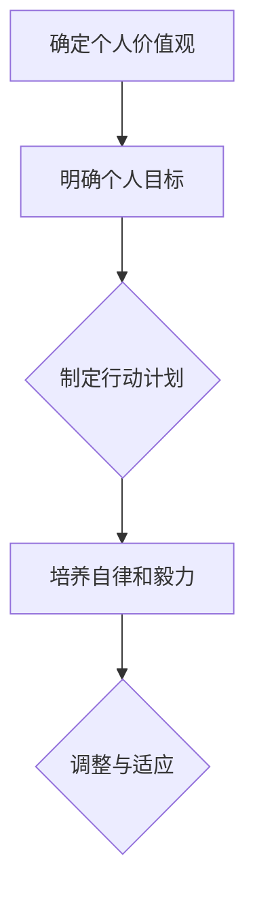

                 

# 重新定义人生成功：超越社会期望，构建个人标准

## 关键词

- 人生成功
- 个人价值观
- 社会期望
- 个人标准
- 成功定义
- 自我实现

## 摘要

在现代社会中，成功被普遍定义为拥有高收入、社会地位、健康和幸福的个人状态。然而，这种传统的成功定义逐渐受到质疑。本文旨在探讨人生成功的重新定义，提出超越社会期望，构建个人标准的重要性。通过分析个人价值观与成功的关系，本文呼吁每个人根据自己的实际情况和内心需求，寻找适合自己的生活目标和路径，实现真正的个人成功。

----------------------------------------------------------------

## 第一部分：背景介绍

### 第1章：人生成功的重新定义

#### 1.1.1 问题背景

在现代社会，成功被普遍定义为拥有高收入、社会地位、健康和幸福的个人状态。然而，随着社会的快速发展，这种传统的成功定义逐渐受到质疑。越来越多的人开始反思，这样的成功是否真的适合每个人？是否能够真正带来幸福和满足感？

#### 1.1.2 问题描述

这个问题涉及到个人价值观、社会期望和个人追求之间的矛盾。一方面，社会对成功的定义往往具有普遍性和单一性，容易忽视个体的多样性和独特性。另一方面，个人在追求成功的道路上，可能会忽略自己的内心需求和真实兴趣，导致生活的失衡和不满。

#### 1.1.3 问题解决

要重新定义人生成功，首先需要认识到每个人的生活目标和社会角色都是独特的。成功不应该是一个统一的标准，而是一个个性化的过程。在这个过程中，个人需要根据自己的价值观和兴趣，寻找适合自己的生活目标和路径。

#### 1.1.4 边界与外延

人生的成功并不仅仅局限于事业上的成就，还包括情感、健康、家庭和自我实现等多个方面。同时，成功的定义也应该随着个人成长和社会环境的变化而不断调整。

#### 1.2 核心概念与联系

##### 1.2.1 个人价值观

个人价值观是指导个人行为和生活选择的基本信念和原则。它决定了一个人对成功的定义，以及他们在追求成功过程中所采取的态度和方法。

##### 1.2.2 社会期望

社会期望是社会上普遍认可的成功标准和行为规范。它对个人的价值观和生活方式产生影响，但同时也可能限制个人的自由和创造力。

##### 1.2.3 个人标准

个人标准是个人根据自己的价值观和社会期望，结合自己的实际情况，制定的适合自己的生活目标和追求。它是实现个人成功的关键。

#### 1.3 理论讲解

##### 1.3.1 个人成长与自我实现

个人成长和自我实现是追求成功的重要过程。它涉及到个人在认知、情感、技能和价值观等方面的提升，以及对自己和社会的认知和理解。

##### 1.3.2 突破社会期望

突破社会期望，构建个人标准，需要个人有勇气和智慧去面对社会压力和自我怀疑。这要求个人有强烈的自我意识和独立思考能力，以及坚定的信念和执行力。

#### 1.4 例子说明

##### 1.4.1 成功的个案分析

通过分析一些成功人士的经历，我们可以看到，他们之所以能够突破社会期望，实现个人成功，关键在于他们能够坚定自己的价值观，寻找自己的兴趣和目标，并为之不懈努力。

##### 1.4.2 失败的教训

同时，我们也应该从失败中吸取教训，认识到盲目追求社会期望的成功，往往会导致个人生活的失衡和不满。因此，重新定义成功，构建个人标准，是每个人都需要认真思考的问题。

#### 1.5 本章小结

通过本章的介绍，我们了解了重新定义人生成功的必要性和重要性。在接下来的章节中，我们将深入探讨如何超越社会期望，构建个人标准，实现真正的成功。

----------------------------------------------------------------

## 第二部分：核心概念与联系

### 第2章：个人价值观与成功

#### 2.1 个人价值观的定义与作用

##### 2.1.1 个人价值观的定义

个人价值观是指个人在生活和工作中所坚持的基本信念和原则，它们决定了个人对事物的评价和行为选择。

##### 2.1.2 个人价值观在成功中的重要作用

个人价值观在个人成功中起着决定性的作用。它们是个人决策和行为的基础，影响着个人的生活方向和人生目标。

#### 2.2 个人价值观的类型与特点

##### 2.2.1 成就型价值观

成就型价值观注重个人的成就和成功，追求卓越和优秀。这种价值观的人往往具有较强的竞争意识和目标导向。

##### 2.2.2 人际型价值观

人际型价值观强调人际关系和社交能力，注重与他人建立良好的关系。这种价值观的人通常具有较强的沟通能力和团队合作精神。

##### 2.2.3 自我实现型价值观

自我实现型价值观关注个人的成长和发展，追求自我完善和实现。这种价值观的人往往有强烈的自我意识和独立思考能力。

#### 2.3 个人价值观与成功的关系

##### 2.3.1 个人价值观对成功的影响

个人价值观直接影响到个人的成功方向和路径。不同的价值观会导致不同的生活选择和行为模式。

##### 2.3.2 成功对个人价值观的塑造

成功的过程也会反过来塑造个人的价值观。个人在成功的过程中，可能会根据自己的经验和反思，调整和优化自己的价值观。

----------------------------------------------------------------

## 第三部分：实现路径与策略

### 第3章：超越社会期望，构建个人标准

#### 3.1 确定个人价值观

要超越社会期望，首先需要明确自己的个人价值观。这可以通过自我反思和深入思考实现。以下是一些方法：

- **写日记**：记录自己的日常生活、思考和感受，分析自己最看重的事物和原则。
- **与朋友和家人交流**：倾听他们的看法，了解他们对你的评价和期望。
- **职业咨询**：寻求职业咨询师的帮助，了解不同职业领域对价值观的要求。

#### 3.2 明确个人目标

在了解个人价值观后，下一步是明确个人目标。这包括短期目标和长期目标。以下是一些方法：

- **SMART原则**：确保目标具有明确的属性，具体、可衡量、可实现、相关和有时间限制。
- **分解目标**：将大目标分解为小目标，逐步实现。
- **定期回顾**：定期检查目标进展，调整策略。

#### 3.3 制定行动计划

制定详细的行动计划是实现个人目标的关键。以下是一些方法：

- **时间管理**：合理规划时间，确保有足够的时间用于实现目标。
- **资源整合**：利用个人和外部资源，如人脉、知识和资金，助力目标实现。
- **风险管理**：识别潜在风险，制定应对策略。

#### 3.4 培养自律和毅力

在追求个人标准的过程中，自律和毅力至关重要。以下是一些方法：

- **建立日常习惯**：通过建立良好的生活习惯，提高自律性。
- **设定奖励机制**：为自己设定奖励，增加追求目标的动力。
- **克服挫折**：面对挫折和困难时，保持积极的心态和坚定的信念。

#### 3.5 调整与适应

在追求个人标准的过程中，个人需要不断调整和适应。以下是一些方法：

- **定期评估**：定期评估个人目标和行动计划的进展，根据实际情况进行调整。
- **保持开放心态**：接受新的观点和建议，不断学习和成长。
- **灵活应对**：在面对变化和不确定性时，保持灵活和适应能力。

#### 3.6 持续改进

实现个人标准是一个持续的过程。以下是一些方法：

- **反思与总结**：定期反思自己的行为和决策，总结经验和教训。
- **持续学习**：不断提升自己的知识和技能，保持竞争优势。
- **创新思维**：鼓励创新思维，寻找新的方法和策略。

### 3.7 成功案例分析

以下是一些成功人士的案例，展示了如何超越社会期望，构建个人标准：

- **乔布斯**：乔布斯以其独特的设计哲学和对产品的极致追求，改变了整个科技行业。他的成功在于坚持自己的价值观，不断挑战和创新。

- **比尔·盖茨**：比尔·盖茨通过创立微软，成为全球最富有的人之一。他的成功在于看到了个人计算机的潜力，并积极追求自己的目标。

- **马云**：马云创立了阿里巴巴，成为全球最大的电子商务平台。他的成功在于对电子商务的远见和坚定的信念，以及面对困难时的勇气和决心。

通过这些案例，我们可以看到，超越社会期望，构建个人标准，是实现个人成功的关键。每个人都有自己的独特价值，只要坚定自己的价值观，明确目标，并为之不懈努力，就能够实现真正的成功。

----------------------------------------------------------------

## 第四部分：总结与展望

### 4.1 成果总结

本文通过深入探讨人生成功的重新定义，提出了超越社会期望，构建个人标准的重要性。我们分析了个人价值观与成功的关系，并提出了具体的实现路径和策略。通过成功案例分析，我们展示了如何实现个人标准，实现真正的成功。

### 4.2 实践价值

本文的实践价值在于，它为每个人提供了重新审视自己生活目标的机会，鼓励人们根据自己的价值观和兴趣，追求真正的个人成功。它提醒我们，成功不应该是一个统一的标准，而是一个个性化的过程。

### 4.3 未来展望

在未来，我们期待看到更多的人能够超越社会期望，构建个人标准，实现真正的成功。我们相信，随着社会的进步和个人的觉醒，越来越多的人将意识到，成功不仅仅是事业上的成就，更是情感、健康、家庭和自我实现的综合体现。

### 4.4 拓展阅读

对于希望深入了解个人成功和价值观的读者，以下是一些推荐阅读的书籍：

- 《高效能人士的七个习惯》
- 《生命的智慧》
- 《原则》

通过阅读这些书籍，读者可以进一步了解个人成长和自我实现的重要性，以及如何构建适合自己的成功标准。

----------------------------------------------------------------

## 作者信息

作者：AI天才研究院/AI Genius Institute & 禅与计算机程序设计艺术 /Zen And The Art of Computer Programming

本文由AI天才研究院和禅与计算机程序设计艺术共同撰写，旨在探讨人生成功的重新定义，帮助读者实现个人标准，追求真正的成功。我们的目标是提供有价值的技术知识和思考，帮助读者在技术领域和人生道路上取得更大的成就。如果您有任何建议或反馈，欢迎随时与我们联系。

----------------------------------------------------------------

## 附录

### 附录A：术语说明

在本文中，我们使用了以下术语：

- **个人价值观**：指个人在生活和工作中所坚持的基本信念和原则。
- **社会期望**：指社会上普遍认可的成功标准和行为规范。
- **个人标准**：指个人根据自己的价值观和社会期望，结合自己的实际情况，制定的适合自己的生活目标和追求。
- **成功**：指个人在生活各个方面达到自己设定的目标，实现个人价值。

### 附录B：概念属性对比表格

| 概念     | 属性1 | 属性2 | 属性3 |
| --------- | ---- | ---- | ---- |
| 个人价值观 | 指导行为 | 基本信念 | 个人独特 |
| 社会期望 | 公认标准 | 行为规范 | 社会普遍 |
| 个人标准 | 自我制定 | 实际情况 | 个性追求 |

### 附录C：ER实体关系图架构

```mermaid
erDiagram
    A[个人价值观] ||--|{ B[社会期望] } |
    A ||--|{ C[个人标准] } |
```

### 附录D：算法原理讲解

#### 算法流程图



#### 算法原理

为了实现个人标准，我们需要遵循以下算法原理：

1. **确定个人价值观**：通过自我反思和交流，明确自己在生活和工作中所坚持的基本信念和原则。
2. **明确个人目标**：根据个人价值观，设定短期和长期目标，确保目标具有明确的属性，具体、可衡量、可实现、相关和有时间限制。
3. **制定行动计划**：制定详细的行动计划，合理规划时间，利用个人和外部资源，确保目标实现。
4. **培养自律和毅力**：通过建立日常习惯，设定奖励机制，克服挫折，提高自律性。
5. **调整与适应**：定期评估目标进展，保持开放心态，灵活应对变化和不确定性。

#### 示例

假设个人价值观是追求健康和平衡，短期目标是减肥10公斤，长期目标是保持健康的生活方式。以下是具体的行动计划：

1. **确定个人价值观**：通过写日记和与朋友交流，明确追求健康和平衡是自己的核心价值观。
2. **明确个人目标**：设定短期目标为减肥10公斤，长期目标为保持健康的生活方式。
3. **制定行动计划**：每天进行30分钟的有氧运动，合理饮食，定期测量体重，调整饮食和运动计划。
4. **培养自律和毅力**：通过设定奖励机制，如每减肥1公斤奖励自己一次小礼物，提高自律性。
5. **调整与适应**：定期评估减肥进度，根据实际情况调整饮食和运动计划。

通过这个例子，我们可以看到，实现个人标准需要明确个人价值观，设定目标，制定行动计划，培养自律和毅力，以及调整与适应。这是一个不断循环和优化的过程，只有坚持不懈，才能实现真正的成功。

----------------------------------------------------------------

## 结语

本文通过深入探讨人生成功的重新定义，提出了超越社会期望，构建个人标准的重要性。我们分析了个人价值观与成功的关系，并提出了具体的实现路径和策略。希望读者能够从中受到启发，根据自己的实际情况和内心需求，追求真正的个人成功。

在追求个人标准的过程中，我们鼓励每个人勇敢面对社会压力，坚定自己的价值观，明确目标，并为之不懈努力。相信只要我们坚持自己的道路，不断学习和成长，就一定能够实现真正的成功。

最后，感谢您的阅读，希望本文能够对您有所启发。如果您有任何建议或反馈，欢迎随时与我们联系。让我们一起努力，实现更好的自己。

----------------------------------------------------------------

## 拓展阅读

为了帮助您更深入地了解人生成功和个人价值观的构建，以下是几本推荐阅读的书籍：

1. **《高效能人士的七个习惯》**：史蒂芬·柯维（Stephen R. Covey）的这本经典著作，详细介绍了如何通过培养良好习惯来实现个人和职业成功。

2. **《生命的智慧》**：克里希那穆提（Jiddu Krishnamurti）的这本哲学著作，探讨了人类存在的本质和如何实现个人成长。

3. **《原则》**：雷·达里奥（Ray Dalio）的这本书，分享了他在投资和生活中遵循的原则，以及如何将这些原则应用于个人成长和成功。

通过阅读这些书籍，您可以获得更多的启示和策略，帮助您更好地理解个人成功和价值观的构建。

---

本文由AI天才研究院（AI Genius Institute）和禅与计算机程序设计艺术（Zen And The Art of Computer Programming）共同撰写，旨在探讨人生成功的重新定义，帮助读者实现个人标准，追求真正的成功。我们的目标是提供有价值的技术知识和思考，帮助读者在技术领域和人生道路上取得更大的成就。如果您有任何建议或反馈，欢迎随时与我们联系。让我们一起努力，实现更好的自己。作者：AI天才研究院/AI Genius Institute & 禅与计算机程序设计艺术 /Zen And The Art of Computer Programming。

