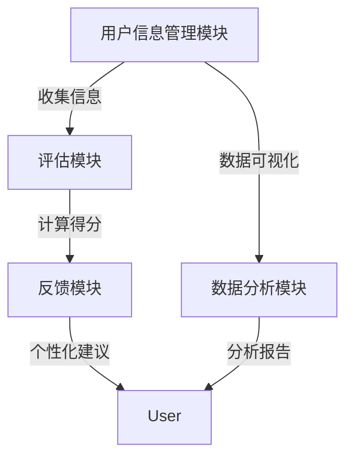
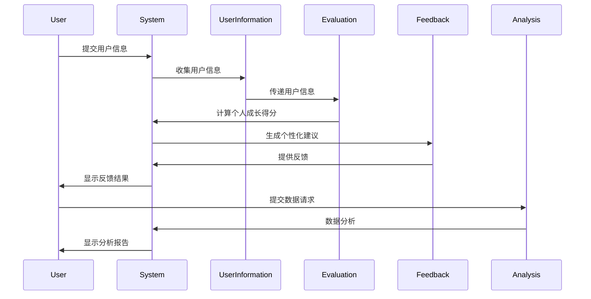

                 

### 引言

#### 问题背景与时代特征

随着科技日新月异的发展，人类社会正经历着一场深刻的历史变革。从工业时代到后工业时代的过渡，不仅改变了我们的生活方式，也重塑了我们的价值观和人生观。在这个快速变化的时代，传统的成功定义已不再适用，我们需要重新审视和定义成功，以适应新的时代特征。

后工业时代，亦称为知识经济时代，其核心特征是信息化、全球化和智能化。在这个时代，知识成为最重要的生产要素，创新成为推动经济增长的主要动力。与此相比，工业时代依赖于大量的资源和劳动力，而知识经济则更强调人的能力和智慧。这种转变不仅改变了生产方式，也影响了人们的职业选择和生活方式。

然而，这种变化也带来了新的挑战。在传统观念中，成功通常被定义为财富积累和社会地位提升。但在后工业时代，仅仅追求物质成功已不再足够。人们开始关注精神层面的满足，追求个人成长和自我实现。这种转变不仅反映了社会价值观的变化，也提出了新的问题：在后工业时代，如何重新定义成功？

#### 重新定义成功的必要性

重新定义成功的原因有多个方面。首先，随着社会的发展，传统的成功标准已不再适用于所有人。例如，在工业时代，成功往往与高薪和职位挂钩。但在知识经济时代，许多创新者和自由职业者可能并没有传统意义上的高薪职位，但他们的成就和对社会的贡献同样不容忽视。

其次，随着人们对生活质量的追求不断提高，成功不再仅仅是一个经济问题，更是一个生活质量和幸福感的问题。在追求物质成功的同时，人们也开始关注心理健康、人际关系和生活平衡。这种转变要求我们重新思考成功的定义，将其扩展到更广泛的领域。

最后，重新定义成功也是社会进步的必然要求。随着科技的发展，社会资源越来越丰富，人们有更多的机会去追求个人梦想和兴趣。这需要我们打破传统观念的束缚，为每个人提供更多的发展机会，实现真正的社会公平和正义。

#### 本书结构安排与目标

本书旨在探讨后工业时代的人生价值观，重新定义成功。全书分为八个章节，结构紧凑，逻辑清晰。以下是本书的结构安排：

- 第1章 引言：介绍问题背景和时代特征，阐述重新定义成功的必要性。
- 第2章 后工业时代的社会变革：分析后工业时代的定义与特征，探讨社会变革对人生价值观的冲击。
- 第3章 后工业时代的人生价值观：审视传统价值观，探讨新兴价值观的兴起及其影响。
- 第4章 职场成功的新定义：分析传统和后工业时代的职场成功标准，探讨如何在职场中实现新定义的成功。
- 第5章 个人成长与自我实现：探讨个人成长的重要性，自我实现的理论与实践。
- 第6章 人际关系与社交网络：分析人际关系的重要性，社交网络的发展及其影响。
- 第7章 心理健康与幸福感：探讨心理健康的定义与要素，幸福感的来源与提升。
- 第8章 成功的可持续性：评估成功的可持续性，探讨如何实现可持续的成功。

通过本书的阅读，读者将能够深刻理解后工业时代的人生价值观，重新定义成功，找到适应新时代的发展路径。

### 第1章 引言

#### 问题背景与时代特征

在现代社会，我们面临着一个日益复杂和多变的现实。科技的飞速发展、信息的爆炸性增长以及全球化进程的加快，使得传统的成功定义和价值观面临着前所未有的挑战。尤其是随着后工业时代的到来，人类社会正经历着深刻的变革，这种变革不仅影响了我们的生活方式，也重新塑造了我们对成功的认知。

**后工业时代的定义与特征**

首先，我们需要明确后工业时代的概念。后工业时代，也被称为知识经济时代，是指以知识为主要生产要素，以创新为核心推动力的经济发展阶段。这一时代与工业时代的主要区别在于，它不再以大规模生产制造业为主导，而是以高技术产业、信息技术产业和创新产业为核心。后工业时代具有以下几个显著特征：

1. **信息化**：信息技术的迅猛发展使得信息传播速度极大提高，信息成为社会运作的重要资源。
2. **全球化**：全球化进程加速，跨国界的经济、文化、技术交流日益频繁，世界各地的联系更加紧密。
3. **智能化**：人工智能、大数据、物联网等新兴技术的应用，使得社会各领域的智能化水平显著提升。
4. **个性化**：随着消费者需求的多样化和个性化，生产和服务的个性化程度越来越高。

**从工业时代到后工业时代的过渡**

工业时代是18世纪末到20世纪中叶的一个历史阶段，以机械化生产、大规模制造为特征。在这个时代，资本积累和劳动力成为推动经济发展的主要动力，财富和地位成为衡量个人成功的主要标准。然而，随着科技的进步和社会的发展，工业时代逐渐暴露出一些局限性：

1. **资源依赖**：工业时代高度依赖自然资源，环境污染和资源枯竭问题日益严重。
2. **劳动密集**：工业生产依赖大量的劳动力，劳动强度大，工作条件艰苦。
3. **生产模式**：工业时代的生产模式以标准化、大批量生产为主，创新能力不足。

后工业时代的到来，标志着人类社会从以物质生产为主转向以知识创新为主。这一过渡不仅改变了生产方式，也深刻影响了人们的价值观和生活方式。在这个时代，知识和创新能力成为推动经济发展的关键因素，人们开始更加注重个性化和创新性的发展。

**后工业时代对人生价值观的冲击**

后工业时代的到来，对传统的人生价值观产生了深刻的影响。在工业时代，成功往往被定义为财富积累和社会地位提升。然而，在后工业时代，这种定义已经不再全面。以下是一些主要的变化：

1. **物质成功不再唯一**：随着社会的进步，人们开始认识到，物质成功只是成功的一个方面，而不是全部。心理健康、人际关系、个人成长等方面同样重要。
2. **精神层面的重视**：后工业时代更加注重个体的精神满足和自我实现。人们追求的是内在的平静和自我价值的实现，而不仅仅是外在的物质财富。
3. **多元价值观的兴起**：随着全球化和文化多样性的增加，人们开始接受和尊重不同的价值观。个人的成功不再由单一的标准来衡量，而是更加个性化、多元化。

总之，后工业时代的到来，不仅带来了社会的巨大变革，也重新定义了成功的内涵。在这个时代，我们需要重新审视和定义成功，以适应新的社会环境和价值观。通过重新定义成功，我们可以找到更全面、更健康、更具可持续性的生活方式和发展路径。

### 第2章 后工业时代的人生价值观

#### 传统价值观的审视

在工业时代，传统的成功价值观主要集中在物质积累和社会地位的提升。这些价值观强调财富、地位、职业成就和个人荣誉。具体来说，以下几个方面构成了传统价值观的核心：

1. **财富积累**：工业时代的社会发展依赖于资本的积累，因此，财富成为衡量个人成功的重要标准。成功人士通常被认为是有钱人，他们通过投资、创业或继承获得财富。
2. **社会地位**：社会地位是通过职业和职位来体现的。在工业时代，拥有高薪职位和高社会地位被认为是成功的重要标志。公务员、公司高管、医生和律师等职业被认为是成功和地位象征。
3. **职业成就**：职业成就主要通过职业晋升和业绩表现来衡量。在工业时代，成功的人士通常是在职业生涯中取得了显著的成就，例如晋升为高级管理者或获得了重要奖项。
4. **个人荣誉**：个人荣誉包括获得各种荣誉证书、勋章、奖项等。这些荣誉不仅是对个人能力和贡献的认可，也是社会地位和声望的象征。

然而，随着时间的推移和社会的发展，这些传统价值观逐渐暴露出一些局限性。首先，过度追求物质成功容易导致精神空虚和生活失衡。其次，社会地位的追求往往伴随着巨大的压力和竞争，导致人们忽视心理健康和家庭生活。最后，职业成就的单一衡量标准忽视了个人兴趣和多元化发展的需求。

#### 新兴价值观的兴起

在后工业时代，随着社会的变革和人们价值观的转变，新兴价值观逐渐兴起，这些价值观更加注重个人的全面发展、心理健康、精神满足和自我实现。以下是几个主要的新兴价值观：

1. **个人成长**：个人成长强调个体在知识和技能上的提升，以及自我认知和情感管理能力的培养。人们开始认识到，成长是终身的过程，不仅仅是职业上的进步，还包括心理和情感上的成熟。
2. **心理健康**：心理健康成为后工业时代价值观的重要组成部分。人们开始重视心理健康问题，包括焦虑、抑郁和压力等。通过心理咨询、锻炼和社交活动等方式，提升心理韧性，增强幸福感。
3. **精神满足**：与物质成功相比，精神满足成为人们追求的主要目标。人们开始关注内心的平静和自我价值的实现，通过追求艺术、哲学和宗教等方式获得精神上的满足。
4. **自我实现**：自我实现是马斯洛需求层次理论中的最高层次，强调个体实现自我潜能和实现个人价值。后工业时代，越来越多的人追求自我实现，通过创造、创新和探索来实现个人目标和价值。
5. **多元化发展**：多元化发展强调个体在多个领域和方向上的全面发展。人们不再局限于单一的职业或领域，而是通过多角度、多领域的探索和尝试，实现个人潜能的最大化。

这些新兴价值观反映了后工业时代人们对成功的新认知，从单一的物质追求转向全面的个人发展和精神满足。这些价值观不仅关注个体的成长和幸福，也强调个体的社会责任和全球意识。

#### 价值观的多样性及其影响

在后工业时代，价值观的多样性成为一个显著特征。不同背景、文化和社会群体对成功的定义和追求方式各不相同。以下是一些价值观多样性的体现及其影响：

1. **文化差异**：不同文化背景的人们对成功的理解有很大差异。例如，西方文化中成功可能强调个人成就和独立，而东方文化中成功可能更注重家庭和谐和社会责任。
2. **教育背景**：教育背景也对价值观的形成有很大影响。受过高等教育的个体可能更加注重个人成长和自我实现，而受教育水平较低的个体可能更重视物质财富和社会地位。
3. **职业选择**：不同的职业选择也反映了不同的价值观。例如，艺术家和学者可能更注重精神满足和个人兴趣，而企业家和商人可能更注重财富积累和职业成就。
4. **社会阶层**：社会阶层也影响人们的价值观。高社会阶层的人可能更加关注社会地位和影响力，而中低社会阶层的人可能更关注生活质量和家庭幸福。

价值观的多样性不仅丰富了人们对成功的理解，也带来了新的挑战。例如，如何平衡个人与集体的价值观，如何在多元化的社会中实现共同的目标等。但与此同时，多样性也为社会带来了更多的创新和活力，促进了社会的全面进步和发展。

总之，后工业时代的人生价值观经历了深刻的变革，从传统的物质追求转向全面的个人发展和精神满足。这些新兴价值观不仅关注个体的成长和幸福，也强调个体的社会责任和全球意识。随着价值观的多样性不断加剧，我们需要不断调整和适应，找到适应新时代的发展路径。

### 第3章 职场成功的新定义

#### 职场成功的传统标准

在传统的工业时代，职场成功往往被定义为财富积累和社会地位的提升。这种成功标准主要围绕以下几个方面展开：

1. **高薪职位**：传统观念认为，高薪是衡量个人职业成功的重要标志。高薪不仅代表着个人能力的认可，也意味着社会地位的提升和生活质量的改善。
2. **职业晋升**：职业晋升速度和晋升等级是传统职场成功的重要指标。从初级职位逐步晋升到高级管理层，被视为职业生涯的胜利。
3. **公司荣誉**：获得公司内部或行业外的各种荣誉和奖项，如最佳员工、优秀管理者、技术创新奖等，也被视为职场成功的象征。
4. **社会地位**：在传统观念中，职场成功往往与更高的社会地位联系在一起。例如，担任重要职务的经理、高层管理人员或董事会成员，会带来更高的社会声望和影响力。

然而，随着时代的变迁，传统职场成功标准逐渐显露出其局限性。首先，高薪职位虽然能提供物质上的满足，但未必能带来精神上的满足。其次，职业晋升和荣誉的获取往往伴随着巨大的压力和竞争，可能导致工作与生活的失衡。最后，社会地位虽然能带来一定的影响力，但也可能伴随着复杂的人际关系和社会责任。

#### 后工业时代的职场成功标准

在后工业时代，职场成功标准发生了显著的变化，更加注重个人成长、心理健康、工作满足和社会影响力。以下是新的成功标准：

1. **个人成长**：个人成长成为后工业时代职场成功的关键因素。这不仅包括专业技能的提升，还包括自我认知、情感管理和人际交往能力的培养。个人成长是终身的过程，追求个人成长意味着不断地学习和进步。
2. **心理健康**：随着对心理健康重视程度的提高，心理健康成为职场成功的重要组成部分。一个健康的心理状态有助于提高工作效率和创造力，同时也能提升个人的幸福感。
3. **工作满足**：工作满足感指的是个体对工作的喜爱和认同感。一个成功的职场生涯不仅仅是为了获得物质上的回报，更重要的是在工作中找到乐趣和价值感。
4. **社会影响力**：后工业时代，人们开始更加关注自己的行为对社会和环境的 impact。一个成功的职场人士不仅要在职业上有所成就，还要在推动社会进步和可持续发展方面发挥作用。
5. **平衡与灵活性**：工作与生活的平衡以及工作的灵活性成为新的职场成功标准。在传统观念中，工作与生活常常是对立的，而在后工业时代，越来越多的企业开始重视员工的工作与生活平衡，提供灵活的工作安排，以提升员工的工作满意度和生活质量。

#### 如何在职场中实现新定义的成功

要在后工业时代实现新的职场成功标准，以下是一些建议：

1. **终身学习**：不断更新知识和技能，适应快速变化的工作环境。参加培训课程、阅读专业书籍和与同行交流，都是提升个人成长的有效途径。
2. **关注心理健康**：保持积极的心态，学会压力管理，定期进行身体和心理检查。通过冥想、运动和社交活动等方式，提升心理韧性。
3. **追求工作满足**：找到适合自己的工作，明确职业目标和价值观。在工作中寻找意义和乐趣，通过与同事的合作和创造性的工作，实现个人价值。
4. **发挥社会影响力**：积极参与社会活动和公益事业，推动社会进步和可持续发展。通过分享知识和经验，帮助他人成长。
5. **平衡工作与生活**：合理安排工作时间，确保有足够的休息和娱乐时间。与家人和朋友保持良好的关系，关注个人兴趣和爱好。

总之，后工业时代的职场成功标准更加全面和多元化，注重个人成长、心理健康、工作满足和社会影响力。通过不断学习和适应，平衡工作与生活，我们可以在这个新的时代实现真正的职场成功。

### 个人成长与自我实现

#### 个人成长的重要性

个人成长是后工业时代人生价值观的重要组成部分，它不仅是职业发展的基础，也是实现自我价值的重要途径。个人成长的重要性体现在以下几个方面：

1. **自我认知的提升**：通过不断的学习和反思，个人可以更好地了解自己的优点和不足，从而有针对性地进行改进。自我认知的提升有助于建立自信，明确个人目标和职业规划。
2. **技能与知识的积累**：个人成长意味着不断获取新的知识和技能，以适应快速变化的工作环境和市场需求。掌握多样化的技能和知识，不仅有助于提升职业竞争力，还能为个人提供更多的职业发展机会。
3. **情感管理能力的培养**：个人成长不仅仅是智力上的提升，还包括情感管理能力的培养。通过自我认知和情感管理，个人可以更好地应对生活中的挑战和压力，提高心理韧性。
4. **自我实现的可能性**：个人成长是自我实现的基础。通过不断学习和成长，个人可以更好地发掘自己的潜能，实现自我价值，追求更高的生活目标和幸福感。

#### 自我实现的理论与实践

自我实现是马斯洛需求层次理论中的最高层次，它指的是个体在实现自我潜能和实现个人价值的过程中达到的一种状态。以下是一些关于自我实现的理论和实践：

1. **马斯洛的需求层次理论**：马斯洛认为，人的需求可以分为五个层次：生理需求、安全需求、社交需求、尊重需求和自我实现需求。自我实现需求是最高层次，它指的是个体追求自我实现和自我价值的过程。
2. **心理动力学理论**：弗洛伊德和荣格等心理学家提出了心理动力学理论，认为个体在成长过程中需要通过自我实现来满足内在的心理需求。自我实现不仅有助于个体的心理健康，还能提高其整体幸福感。
3. **自我决定理论**：德西和瑞安提出的自我决定理论认为，自我实现是个体在自主性、能力和动机的基础上，追求个人目标和价值的过程。通过自主选择和自我决定，个体可以更好地实现自我潜能。

在实践中，自我实现可以通过以下几种方式实现：

1. **职业发展**：通过在职业生涯中追求个人兴趣和激情，实现个人目标和职业成就。选择与自己价值观和兴趣相符的工作，有助于提升工作满意度和自我实现感。
2. **终身学习**：持续学习和成长，不断提升自己的知识和技能，以适应快速变化的社会和工作环境。通过不断学习，个体可以更好地实现自我价值和追求更高的生活目标。
3. **创造性表达**：通过艺术、文学、音乐等形式进行创造性表达，释放内心的激情和创造力。创造性表达不仅有助于个体的心理健康，还能提升其自我实现感。
4. **社会参与**：积极参与社会活动和公益事业，为社会发展做出贡献。通过帮助他人和社会，个体可以感受到自己的价值和意义，实现自我价值的最大化。

#### 如何在日常生活中实践自我实现

在日常生活中实践自我实现，可以采取以下几种方法：

1. **设定明确目标**：明确自己的目标和价值观，制定具体的计划和行动步骤。通过设定目标，可以更好地聚焦于自我实现的路径，避免迷茫和迷失方向。
2. **保持积极心态**：积极的心态有助于个体克服挑战和困难，保持对未来的信心和希望。通过培养积极心态，可以更好地应对生活中的各种挑战，实现自我价值。
3. **持续学习和成长**：不断学习新知识和技能，提升自己的综合素质。通过终身学习，可以更好地适应社会和工作环境的变化，实现个人目标和价值。
4. **关注心理健康**：保持良好的心理健康，通过冥想、运动和社交活动等方式，提升心理韧性。心理健康是实现自我实现的重要基础。
5. **创造性表达**：通过艺术、文学、音乐等形式进行创造性表达，释放内心的激情和创造力。创造性表达不仅有助于个体的心理健康，还能提升其自我实现感。
6. **社会参与**：积极参与社会活动和公益事业，为社会发展做出贡献。通过帮助他人和社会，个体可以感受到自己的价值和意义，实现自我价值的最大化。

总之，个人成长和自我实现是后工业时代人生价值观的重要组成部分。通过不断学习和实践，我们可以实现自我价值，追求更高的生活目标，实现真正的自我实现。

### 人际关系与社交网络

#### 人际关系的重要性

人际关系在个人成长和职业发展中起着至关重要的作用。良好的人际关系不仅有助于提升心理健康和幸福感，还能为职业发展提供支持。以下是人际关系的重要性及其在个人成长和职业发展中的作用：

1. **心理健康**：人际关系对心理健康有着直接的影响。良好的人际关系可以带来情感支持和社会认同，降低孤独感和焦虑感。相反，不良的人际关系可能导致压力和情绪问题，影响心理健康。
2. **职业发展**：人际关系在职业发展中起到关键作用。通过建立广泛的人脉网络，个人可以获得职业机会、资源和支持。此外，良好的人际关系有助于团队合作和领导力的培养，提升职业竞争力。
3. **个人成长**：人际关系是个人成长的重要组成部分。通过与他人的交流和互动，个人可以学习到不同的观点和经验，拓宽视野，提升自我认知和情感管理能力。

#### 社交网络的发展及其影响

随着互联网和社交媒体的普及，社交网络的发展对人际关系和职业发展产生了深远影响。以下是社交网络的发展及其影响：

1. **社交网络平台**：如Facebook、LinkedIn、Twitter等社交媒体平台，为人们提供了便捷的交流渠道，扩展了人际关系的范围。通过这些平台，个人可以与朋友、同事和行业专家保持联系，获取信息和支持。
2. **信息传播**：社交网络的快速传播特性使得信息的传播速度大大加快。个人和企业在社交网络上可以迅速传播信息，提升品牌知名度和影响力。
3. **职业发展**：社交网络为职业发展提供了新的机会。通过在社交网络上建立专业形象和展示个人成就，个人可以吸引潜在雇主和合作伙伴，拓展职业发展空间。
4. **社交风险**：社交网络的发展也带来了一些负面影响，如隐私泄露、网络安全问题等。因此，个人在社交网络上的行为需要谨慎，保护个人隐私和安全。

#### 如何建立和维护良好的人际关系

以下是一些建立和维护良好人际关系的方法：

1. **主动交流**：主动与他人建立联系，积极参与社交活动。通过主动交流，可以结识新朋友，扩展人际网络。
2. **真诚交往**：真诚对待他人，建立互信关系。真诚的交往可以增强人际关系的稳定性和深度。
3. **倾听与支持**：倾听他人的需求和意见，提供支持和帮助。通过倾听和支持，可以加深彼此的理解和信任。
4. **定期互动**：保持定期互动，通过电话、邮件、社交媒体等方式与朋友和同事保持联系。定期互动可以增强人际关系，避免疏远。
5. **共同兴趣**：寻找共同兴趣和活动，共同参与。通过共同兴趣，可以建立更紧密的人际关系，增加互动和交流的机会。

总之，人际关系与社交网络在个人成长和职业发展中具有重要意义。通过建立和维护良好的人际关系，我们可以提升心理健康，拓展职业发展空间，实现个人目标。同时，需要谨慎使用社交网络，保护个人隐私和安全。

### 心理健康与幸福感

#### 心理健康的定义与要素

心理健康是指个体在情感、认知和行为方面达到一种良好的状态，能够有效地应对日常生活中的压力和挑战。以下心理健康的主要要素：

1. **情感稳定**：情感稳定是指个体能够调节和管理自己的情绪，保持情绪的平衡。这包括积极情绪和消极情绪的合理表达和控制。
2. **认知功能**：认知功能包括注意力、记忆、思维和解决问题的能力。良好的认知功能有助于个体更好地适应环境，做出合理的决策。
3. **人际关系**：健康的人际关系是心理健康的重要组成部分。良好的人际关系能够提供情感支持和社会认同，减轻心理压力。
4. **适应能力**：适应能力是指个体能够有效地应对生活中的变化和挑战。具有良好的适应能力，个体能够更好地应对压力，减少心理问题。

#### 幸福感的来源与提升

幸福感是指个体在生活各个方面的整体感受和满意度。以下是一些影响幸福感的来源及其提升方法：

1. **自我实现**：自我实现是幸福感的重要来源。通过追求个人兴趣和激情，实现个人目标和价值观，个体可以获得满足感和成就感。
2. **人际关系**：良好的人际关系能够提升幸福感。通过建立和维护健康的人际关系，个体可以获得情感支持和社会认同。
3. **身心健康**：身心健康是幸福感的基础。通过健康的生活方式，如合理的饮食、锻炼和充足的睡眠，个体可以提升身心健康，提高幸福感。
4. **心理调节**：学会有效的心理调节方法，如冥想、放松训练和情绪管理技巧，有助于减轻压力，提升幸福感。

#### 如何维护心理健康和幸福感

以下是一些建议，帮助个体维护心理健康和提升幸福感：

1. **定期自我反思**：定期反思自己的情绪和行为，了解自己的需求，调整生活方式，以更好地适应生活。
2. **保持积极心态**：培养积极的心态，面对生活中的挑战和困难，保持乐观和积极的态度。
3. **建立健康的人际关系**：积极与他人建立和维护健康的人际关系，提供和接受情感支持。
4. **保持身心健康**：通过合理的饮食、规律的锻炼和充足的睡眠，维护身心健康。
5. **学会心理调节**：学习冥想、放松训练和情绪管理技巧，帮助自己应对压力，提升心理韧性。
6. **追求自我实现**：通过追求个人兴趣和激情，实现个人目标和价值观，提升自我实现感和幸福感。

总之，心理健康和幸福感是个人成长和成功的重要组成部分。通过维护心理健康和提升幸福感，个体可以更好地适应生活，实现个人目标，享受美好的人生。

### 成功的可持续性

#### 成功的可持续性评估

成功的可持续性是指个体或组织在长期时间内保持成功的能力和稳定性。评估成功的可持续性对于个人和组织的发展至关重要。以下是一些评估成功的可持续性的方法：

1. **长期目标**：设定明确的长期目标，评估这些目标是否具有可持续性。可持续的目标应考虑资源的有限性、环境的影响和未来发展的可能性。
2. **资源管理**：评估个人或组织的资源管理能力，包括财务、人力资源、技术和信息资源。有效的资源管理有助于长期成功。
3. **创新能力**：评估个体或组织的创新能力，包括对新技术、新方法和新理念的接受和应用能力。持续的创新能力是保持成功的关键。
4. **适应能力**：评估个体或组织应对外部环境和内部变化的能力。良好的适应能力有助于在动态环境中保持成功。
5. **社会影响**：评估个体或组织对社会的贡献和影响，包括对环境的保护、社会责任的履行和对社区发展的推动。积极的社会影响有助于建立长期的声誉和信任。

#### 如何实现可持续的成功

以下是一些实现可持续的成功的方法：

1. **可持续发展理念**：将可持续发展理念融入个人和组织的战略规划中，确保在追求短期成功的同时，考虑到长期利益和环境影响。
2. **资源优化**：通过优化资源配置，提高资源利用效率，降低浪费，实现资源的可持续利用。例如，采用节能技术、循环利用资源等。
3. **持续创新**：鼓励创新思维，建立创新机制，不断探索新技术和新方法，以保持竞争优势和可持续发展。
4. **社会责任**：履行社会责任，关注社会和环境问题，积极参与社会公益活动，提升社会形象和信任度。
5. **人才培养**：重视人才培养和团队建设，提供持续的职业发展和培训机会，提升团队的整体能力和协作效率。
6. **灵活应变**：培养灵活性和适应性，及时应对外部变化和内部挑战，保持灵活的应变能力。

#### 成功的可持续性对个人和社会的影响

成功的可持续性对个人和社会的影响深远。对个人而言，可持续的成功有助于实现长期的幸福和满足，避免因短期成功而带来的过度压力和焦虑。对社会而言，可持续的成功有助于推动社会的可持续发展，提升整体幸福感和生活质量。以下是一些具体影响：

1. **个人发展**：可持续的成功有助于个人实现长期的职业发展和生活目标，避免因短期成功而导致的职业瓶颈和生活失衡。
2. **社会进步**：可持续的成功可以推动社会的持续进步和发展，促进创新和科技的应用，提升社会的整体竞争力。
3. **环境改善**：通过可持续的成功，可以减少对环境的负面影响，促进环境保护和可持续发展，实现人与自然的和谐共生。
4. **社会稳定**：可持续的成功有助于提升社会稳定性和信任度，减少社会矛盾和冲突，促进社会的和谐发展。

总之，成功的可持续性是实现长期成功和社会进步的关键。通过采取有效的策略和措施，个人和组织可以实现可持续的成功，为个人和社会创造更大的价值。

### 结论与展望

#### 本书的主要观点总结

本书通过深入探讨后工业时代的人生价值观，重新定义了成功的内涵，并提出了适应新时代的发展路径。主要观点总结如下：

1. **成功的重新定义**：成功不再仅仅是财富积累和社会地位的提升，更包括个人成长、心理健康、工作满足和社会影响力。
2. **多元价值观的兴起**：随着全球化和文化多样性的增加，多元化的价值观逐渐成为主流，强调个体的全面发展和精神满足。
3. **个人成长与自我实现的重要性**：个人成长和自我实现成为后工业时代人生价值观的核心，通过终身学习和创造性表达，实现个人潜能和价值观。
4. **心理健康与幸福感**：心理健康和幸福感成为衡量成功的标准，通过保持身心健康和积极心态，提升生活质量。
5. **可持续的成功**：可持续的成功是实现长期成功和社会进步的关键，通过优化资源管理、创新和承担社会责任，实现个人和组织的可持续发展。

#### 后工业时代的人生价值观对未来的影响

后工业时代的人生价值观对未来的影响深远。以下是一些预测和展望：

1. **社会进步**：随着对成功内涵的重新定义，社会将更加注重个体的全面发展和精神满足，推动社会进步和可持续发展。
2. **心理健康重视度提升**：随着心理健康问题日益凸显，社会对心理健康的重视程度将进一步提高，促进心理健康服务的普及和发展。
3. **教育与培训的变革**：后工业时代的人生价值观将推动教育和培训的变革，更加注重个体能力的培养和综合素质的提升。
4. **职业多元化**：新兴价值观的兴起将促进职业多元化发展，提供更多的发展机会和职业选择。
5. **全球化与文化交流**：全球化将进一步加强，文化交流和合作将成为推动社会进步的重要力量。

#### 展望未来的发展趋势

未来，随着科技的进一步发展和全球化进程的加深，我们可能会看到以下趋势：

1. **人工智能与人类价值观的结合**：人工智能技术将在更多领域得到应用，与人类价值观相结合，提升生产效率和生活方式。
2. **个性化服务与体验**：随着大数据和个性化推荐技术的发展，个性化服务与体验将更加普及，满足个体多样化的需求。
3. **可持续发展理念的深化**：可持续发展的理念将在更多领域得到贯彻，推动社会和环境的可持续发展。
4. **心理健康与幸福经济的崛起**：心理健康和幸福经济将成为未来经济增长的新动力，促进社会的全面发展和人的全面发展。

总之，后工业时代的人生价值观将深刻影响未来，推动社会的全面进步和人的全面发展。通过重新定义成功，我们可以找到适应新时代的发展路径，实现更加丰富和有意义的人生。作者：AI天才研究院/AI Genius Institute & 禅与计算机程序设计艺术 /Zen And The Art of Computer Programming

---

# 重新定义成功：后工业时代的人生价值观探索

> 关键词：后工业时代、人生价值观、成功定义、心理健康、可持续发展

> 摘要：本文探讨了后工业时代的人生价值观，重新定义了成功的内涵。通过分析传统价值观的局限性以及新兴价值观的兴起，本文提出了个人成长、心理健康、工作满足和社会影响力作为新的成功标准。同时，本文还讨论了如何在职场中实现新定义的成功，以及如何维护心理健康和幸福感。最后，本文强调了成功的可持续性，提出了实现可持续成功的策略和展望未来的发展趋势。通过重新定义成功，我们能够找到适应新时代的发展路径，实现更加丰富和有意义的人生。

---

## 第1章 引言

### 1.1 问题背景与时代特征

随着科技的迅猛发展和全球化进程的加快，人类社会正经历着一场深刻的历史变革。这一变革不仅改变了我们的生活方式，也重塑了我们对成功的认知。传统的成功标准，如财富积累和社会地位提升，在后工业时代面临着新的挑战。在这个快速变化的时代，我们需要重新审视和定义成功，以适应新的社会环境和价值观。

后工业时代，亦称为知识经济时代，其核心特征是信息化、全球化和智能化。在这个时代，知识成为最重要的生产要素，创新成为推动经济增长的主要动力。与工业时代相比，知识经济时代更加注重人的能力和智慧，追求精神层面的满足和个人成长。这种转变不仅改变了生产方式，也影响了人们的价值观和生活方式。

### 1.2 重新定义成功的必要性

重新定义成功的必要性体现在多个方面。首先，随着社会的发展，传统的成功标准已不再适用于所有人。例如，在工业时代，成功往往与高薪和职位挂钩。但在知识经济时代，许多创新者和自由职业者可能并没有传统意义上的高薪职位，但他们的成就和对社会的贡献同样不容忽视。

其次，随着人们对生活质量的追求不断提高，成功不再仅仅是一个经济问题，更是一个生活质量和幸福感的问题。在追求物质成功的同时，人们也开始关注心理健康、人际关系和生活平衡。这种转变要求我们重新思考成功的定义，将其扩展到更广泛的领域。

最后，重新定义成功也是社会进步的必然要求。随着科技的发展，社会资源越来越丰富，人们有更多的机会去追求个人梦想和兴趣。这需要我们打破传统观念的束缚，为每个人提供更多的发展机会，实现真正的社会公平和正义。

### 1.3 本书结构安排与目标

本书旨在探讨后工业时代的人生价值观，重新定义成功。全书分为八个章节，结构紧凑，逻辑清晰。以下是本书的结构安排：

- **第1章 引言**：介绍问题背景和时代特征，阐述重新定义成功的必要性。
- **第2章 后工业时代的社会变革**：分析后工业时代的定义与特征，探讨社会变革对人生价值观的冲击。
- **第3章 后工业时代的人生价值观**：审视传统价值观，探讨新兴价值观的兴起及其影响。
- **第4章 职场成功的新定义**：分析传统和后工业时代的职场成功标准，探讨如何在职场中实现新定义的成功。
- **第5章 个人成长与自我实现**：探讨个人成长的重要性，自我实现的理论与实践。
- **第6章 人际关系与社交网络**：分析人际关系的重要性，社交网络的发展及其影响。
- **第7章 心理健康与幸福感**：探讨心理健康的定义与要素，幸福感的来源与提升。
- **第8章 成功的可持续性**：评估成功的可持续性，探讨如何实现可持续的成功。

通过本书的阅读，读者将能够深刻理解后工业时代的人生价值观，重新定义成功，找到适应新时代的发展路径。

### 第2章 后工业时代的社会变革

#### 后工业时代的定义与特征

后工业时代，亦称知识经济时代，是继工业时代之后的一个社会发展阶段。这一时代的核心特征是信息化、全球化和智能化。与工业时代以机械化生产、大规模制造为特征不同，后工业时代更加依赖于知识、创新和信息。

首先，信息化是后工业时代的显著特征。随着互联网和信息技术的发展，信息传播速度极大提高，信息成为社会运作的重要资源。人们可以通过各种数字化设备轻松获取和处理信息，这使得知识传播更加便捷和高效。

其次，全球化在后工业时代进一步加速。全球化进程使得各国经济、文化、技术交流更加频繁，国际间的联系更加紧密。全球化的加速不仅促进了贸易和投资的发展，也带来了文化多样性和价值观的碰撞。

最后，智能化是后工业时代的重要标志。随着人工智能、大数据、物联网等新兴技术的应用，社会各领域的智能化水平显著提升。智能化技术不仅改变了生产方式，也影响了人们的生活方式和工作模式。

#### 从工业时代到后工业时代的过渡

工业时代是18世纪末到20世纪中叶的一个历史阶段，以机械化生产、大规模制造为特征。在这一时代，资本积累和劳动力成为推动经济发展的主要动力，财富和地位成为衡量个人成功的主要标准。然而，随着科技的进步和社会的发展，工业时代逐渐暴露出一些局限性：

1. **资源依赖**：工业时代高度依赖自然资源，环境污染和资源枯竭问题日益严重。
2. **劳动密集**：工业生产依赖大量的劳动力，劳动强度大，工作条件艰苦。
3. **生产模式**：工业时代的生产模式以标准化、大批量生产为主，创新能力不足。

后工业时代的到来，标志着人类社会从以物质生产为主转向以知识创新为主。这一过渡不仅改变了生产方式，也深刻影响了人们的价值观和生活方式。在这个时代，知识和创新能力成为推动经济发展的关键因素，人们开始更加注重个性化和创新性的发展。

#### 后工业时代对人生价值观的冲击

后工业时代的到来，对传统的人生价值观产生了深刻的影响。在工业时代，成功往往被定义为财富积累和社会地位提升。然而，在后工业时代，这种定义已经不再全面。以下是一些主要的变化：

1. **物质成功不再唯一**：随着社会的进步，人们开始认识到，物质成功只是成功的一个方面，而不是全部。心理健康、人际关系、个人成长等方面同样重要。
2. **精神层面的重视**：后工业时代更加注重个体的精神满足和自我实现。人们追求的是内在的平静和自我价值的实现，而不仅仅是外在的物质财富。
3. **多元价值观的兴起**：随着全球化和文化多样性的增加，人们开始接受和尊重不同的价值观。个人的成功不再由单一的标准来衡量，而是更加个性化、多元化。

总之，后工业时代的到来，不仅带来了社会的巨大变革，也重新定义了成功的内涵。在这个时代，我们需要重新审视和定义成功，以适应新的社会环境和价值观。通过重新定义成功，我们可以找到更全面、更健康、更具可持续性的生活方式和发展路径。

### 第3章 后工业时代的人生价值观

#### 传统价值观的审视

在工业时代，传统的成功价值观主要集中在物质积累和社会地位的提升。这些价值观强调财富、地位、职业成就和个人荣誉。具体来说，以下几个方面构成了传统价值观的核心：

1. **财富积累**：工业时代的社会发展依赖于资本的积累，因此，财富成为衡量个人成功的重要标准。成功人士通常被认为是有钱人，他们通过投资、创业或继承获得财富。
2. **社会地位**：社会地位是通过职业和职位来体现的。在工业时代，拥有高薪职位和高社会地位被认为是成功的重要标志。公务员、公司高管、医生和律师等职业被认为是成功和地位象征。
3. **职业成就**：职业成就主要通过职业晋升和业绩表现来衡量。在工业时代，成功的人士通常是在职业生涯中取得了显著的成就，例如晋升为高级管理者或获得了重要奖项。
4. **个人荣誉**：个人荣誉包括获得各种荣誉证书、勋章、奖项等。这些荣誉不仅是对个人能力和贡献的认可，也是社会地位和声望的象征。

然而，随着时间的推移和社会的发展，这些传统价值观逐渐暴露出一些局限性。首先，过度追求物质成功容易导致精神空虚和生活失衡。其次，社会地位的追求往往伴随着巨大的压力和竞争，导致人们忽视心理健康和家庭生活。最后，职业成就的单一衡量标准忽视了个人兴趣和多元化发展的需求。

#### 新兴价值观的兴起

在后工业时代，随着社会的变革和人们价值观的转变，新兴价值观逐渐兴起，这些价值观更加注重个人的全面发展、心理健康、精神满足和自我实现。以下是几个主要的新兴价值观：

1. **个人成长**：个人成长强调个体在知识和技能上的提升，以及自我认知和情感管理能力的培养。人们开始认识到，成长是终身的过程，不仅仅是职业上的进步，还包括心理和情感上的成熟。
2. **心理健康**：心理健康成为后工业时代价值观的重要组成部分。人们开始重视心理健康问题，包括焦虑、抑郁和压力等。通过心理咨询、锻炼和社交活动等方式，提升心理韧性，增强幸福感。
3. **精神满足**：与物质成功相比，精神满足成为后工业时代价值观的主要目标。人们开始关注内心的平静和自我价值的实现，通过追求艺术、哲学和宗教等方式获得精神上的满足。
4. **自我实现**：自我实现是马斯洛需求层次理论中的最高层次，强调个体实现自我潜能和实现个人价值。后工业时代，越来越多的人追求自我实现，通过创造、创新和探索来实现个人目标和价值。
5. **多元化发展**：多元化发展强调个体在多个领域和方向上的全面发展。人们不再局限于单一的职业或领域，而是通过多角度、多领域的探索和尝试，实现个人潜能的最大化。

这些新兴价值观反映了后工业时代人们对成功的新认知，从单一的物质追求转向全面的个人发展和精神满足。这些价值观不仅关注个体的成长和幸福，也强调个体的社会责任和全球意识。

#### 价值观的多样性及其影响

在后工业时代，价值观的多样性成为一个显著特征。不同背景、文化和社会群体对成功的定义和追求方式各不相同。以下是一些价值观多样性的体现及其影响：

1. **文化差异**：不同文化背景的人们对成功的理解有很大差异。例如，西方文化中成功可能强调个人成就和独立，而东方文化中成功可能更注重家庭和谐和社会责任。
2. **教育背景**：教育背景也对价值观的形成有很大影响。受过高等教育的个体可能更加注重个人成长和自我实现，而受教育水平较低的个体可能更重视物质财富和社会地位。
3. **职业选择**：不同的职业选择也反映了不同的价值观。例如，艺术家和学者可能更注重精神满足和个人兴趣，而企业家和商人可能更注重财富积累和职业成就。
4. **社会阶层**：社会阶层也影响人们的价值观。高社会阶层的人可能更加关注社会地位和影响力，而中低社会阶层的人可能更关注生活质量和家庭幸福。

价值观的多样性不仅丰富了人们对成功的理解，也带来了新的挑战。例如，如何平衡个人与集体的价值观，如何在多元化的社会中实现共同的目标等。但与此同时，多样性也为社会带来了更多的创新和活力，促进了社会的全面进步和发展。

总之，后工业时代的人生价值观经历了深刻的变革，从传统的物质追求转向全面的个人发展和精神满足。这些新兴价值观不仅关注个体的成长和幸福，也强调个体的社会责任和全球意识。随着价值观的多样性不断加剧，我们需要不断调整和适应，找到适应新时代的发展路径。

### 第4章 职场成功的新定义

#### 职场成功的传统标准

在传统的工业时代，职场成功往往被定义为财富积累和社会地位的提升。这种成功标准主要围绕以下几个方面展开：

1. **高薪职位**：传统观念认为，高薪是衡量个人职业成功的重要标志。高薪不仅代表着个人能力的认可，也意味着社会地位的提升和生活质量的改善。
2. **职业晋升**：职业晋升速度和晋升等级是传统职场成功的重要指标。从初级职位逐步晋升到高级管理层，被视为职业生涯的胜利。
3. **公司荣誉**：获得公司内部或行业外的各种荣誉和奖项，如最佳员工、优秀管理者、技术创新奖等，也被视为职场成功的象征。
4. **社会地位**：在传统观念中，职场成功往往与更高的社会地位联系在一起。例如，担任重要职务的经理、高层管理人员或董事会成员，会带来更高的社会声望和影响力。

然而，随着时间的推移和社会的发展，传统职场成功标准逐渐显露出其局限性。首先，高薪职位虽然能提供物质上的满足，但未必能带来精神上的满足。其次，职业晋升和荣誉的获取往往伴随着巨大的压力和竞争，可能导致工作与生活的失衡。最后，社会地位虽然能带来一定的影响力，但也可能伴随着复杂的人际关系和社会责任。

#### 后工业时代的职场成功标准

在后工业时代，职场成功标准发生了显著的变化，更加注重个人成长、心理健康、工作满足和社会影响力。以下是新的成功标准：

1. **个人成长**：个人成长成为后工业时代职场成功的关键因素。这不仅包括专业技能的提升，还包括自我认知、情感管理和人际交往能力的培养。个人成长是终身的过程，追求个人成长意味着不断地学习和进步。
2. **心理健康**：随着对心理健康重视程度的提高，心理健康成为职场成功的重要组成部分。一个健康的心理状态有助于提高工作效率和创造力，同时也能提升个人的幸福感。
3. **工作满足**：工作满足感指的是个体对工作的喜爱和认同感。一个成功的职场生涯不仅仅是为了获得物质上的回报，更重要的是在工作中找到乐趣和价值感。
4. **社会影响力**：后工业时代，人们开始更加关注自己的行为对社会和环境的 impact。一个成功的职场人士不仅要在职业上有所成就，还要在推动社会进步和可持续发展方面发挥作用。
5. **平衡与灵活性**：工作与生活的平衡以及工作的灵活性成为新的职场成功标准。在传统观念中，工作与生活常常是对立的，而在后工业时代，越来越多的企业开始重视员工的工作与生活平衡，提供灵活的工作安排，以提升员工的工作满意度和生活质量。

#### 如何在职场中实现新定义的成功

要在后工业时代实现新的职场成功标准，以下是一些建议：

1. **终身学习**：不断更新知识和技能，适应快速变化的工作环境。参加培训课程、阅读专业书籍和与同行交流，都是提升个人成长的有效途径。
2. **关注心理健康**：保持积极的心态，学会压力管理，定期进行身体和心理检查。通过冥想、运动和社交活动等方式，提升心理韧性。
3. **追求工作满足**：找到适合自己的工作，明确职业目标和价值观。在工作中寻找意义和乐趣，通过与同事的合作和创造性的工作，实现个人价值。
4. **发挥社会影响力**：积极参与社会活动和公益事业，推动社会进步和可持续发展。通过分享知识和经验，帮助他人成长。
5. **平衡工作与生活**：合理安排工作时间，确保有足够的休息和娱乐时间。与家人和朋友保持良好的关系，关注个人兴趣和爱好。

总之，后工业时代的职场成功标准更加全面和多元化，注重个人成长、心理健康、工作满足和社会影响力。通过不断学习和适应，平衡工作与生活，我们可以在这个新的时代实现真正的职场成功。

### 第5章 个人成长与自我实现

#### 个人成长的重要性

个人成长是后工业时代人生价值观的重要组成部分，它不仅是职业发展的基础，也是实现自我价值的重要途径。个人成长的重要性体现在以下几个方面：

1. **自我认知的提升**：通过不断的学习和反思，个人可以更好地了解自己的优点和不足，从而有针对性地进行改进。自我认知的提升有助于建立自信，明确个人目标和职业规划。
2. **技能与知识的积累**：个人成长意味着不断获取新的知识和技能，以适应快速变化的工作环境和市场需求。掌握多样化的技能和知识，不仅有助于提升职业竞争力，还能为个人提供更多的职业发展机会。
3. **情感管理能力的培养**：个人成长不仅仅是智力上的提升，还包括情感管理能力的培养。通过自我认知和情感管理，个人可以更好地应对生活中的挑战和压力，提高心理韧性。
4. **自我实现的可能性**：个人成长是自我实现的基础。通过不断学习和成长，个人可以更好地发掘自己的潜能，实现自我价值，追求更高的生活目标和幸福感。

#### 自我实现的理论与实践

自我实现是马斯洛需求层次理论中的最高层次，它指的是个体在实现自我潜能和实现个人价值的过程中达到的一种状态。以下是一些关于自我实现的理论和实践：

1. **马斯洛的需求层次理论**：马斯洛认为，人的需求可以分为五个层次：生理需求、安全需求、社交需求、尊重需求和自我实现需求。自我实现需求是最高层次，它指的是个体追求自我实现和自我价值的过程。
2. **心理动力学理论**：弗洛伊德和荣格等心理学家提出了心理动力学理论，认为个体在成长过程中需要通过自我实现来满足内在的心理需求。自我实现不仅有助于个体的心理健康，还能提高其整体幸福感。
3. **自我决定理论**：德西和瑞安提出的自我决定理论认为，自我实现是个体在自主性、能力和动机的基础上，追求个人目标和价值的过程。通过自主选择和自我决定，个体可以更好地实现自我潜能。

在实践中，自我实现可以通过以下几种方式实现：

1. **职业发展**：通过在职业生涯中追求个人兴趣和激情，实现个人目标和职业成就。选择与自己价值观和兴趣相符的工作，有助于提升工作满意度和自我实现感。
2. **终身学习**：持续学习和成长，不断提升自己的知识和技能，以适应快速变化的社会和工作环境。通过不断学习，可以更好地实现个人目标和价值。
3. **创造性表达**：通过艺术、文学、音乐等形式进行创造性表达，释放内心的激情和创造力。创造性表达不仅有助于个体的心理健康，还能提升其自我实现感。
4. **社会参与**：积极参与社会活动和公益事业，为社会发展做出贡献。通过帮助他人和社会，个体可以感受到自己的价值和意义，实现自我价值的最大化。

#### 如何在日常生活中实践自我实现

在日常生活中实践自我实现，可以采取以下几种方法：

1. **设定明确目标**：明确自己的目标和价值观，制定具体的计划和行动步骤。通过设定目标，可以更好地聚焦于自我实现的路径，避免迷茫和迷失方向。
2. **保持积极心态**：积极的心态有助于个体克服挑战和困难，保持对未来的信心和希望。通过培养积极心态，可以更好地应对生活中的各种挑战，实现自我价值。
3. **持续学习和成长**：不断学习新知识和技能，提升自己的综合素质。通过终身学习，可以更好地适应社会和工作环境的变化，实现个人目标和价值。
4. **关注心理健康**：保持良好的心理健康，通过冥想、运动和社交活动等方式，提升心理韧性。心理健康是实现自我实现的重要基础。
5. **创造性表达**：通过艺术、文学、音乐等形式进行创造性表达，释放内心的激情和创造力。创造性表达不仅有助于个体的心理健康，还能提升其自我实现感。
6. **社会参与**：积极参与社会活动和公益事业，为社会发展做出贡献。通过帮助他人和社会，个体可以感受到自己的价值和意义，实现自我价值的最大化。

总之，个人成长和自我实现是后工业时代人生价值观的重要组成部分。通过不断学习和实践，我们可以实现自我价值，追求更高的生活目标，实现真正的自我实现。

### 第6章 人际关系与社交网络

#### 人际关系的重要性

人际关系在个人成长和职业发展中起着至关重要的作用。良好的人际关系不仅有助于提升心理健康和幸福感，还能为职业发展提供支持。以下是人际关系的重要性及其在个人成长和职业发展中的作用：

1. **心理健康**：人际关系对心理健康有着直接的影响。良好的人际关系可以带来情感支持和社会认同，降低孤独感和焦虑感。相反，不良的人际关系可能导致压力和情绪问题，影响心理健康。
2. **职业发展**：人际关系在职业发展中起到关键作用。通过建立广泛的人脉网络，个人可以获得职业机会、资源和支持。此外，良好的人际关系有助于团队合作和领导力的培养，提升职业竞争力。
3. **个人成长**：人际关系是个人成长的重要组成部分。通过与他人的交流和互动，个人可以学习到不同的观点和经验，拓宽视野，提升自我认知和情感管理能力。

#### 社交网络的发展及其影响

随着互联网和社交媒体的普及，社交网络的发展对人际关系和职业发展产生了深远影响。以下是社交网络的发展及其影响：

1. **社交网络平台**：如Facebook、LinkedIn、Twitter等社交媒体平台，为人们提供了便捷的交流渠道，扩展了人际关系的范围。通过这些平台，个人可以与朋友、同事和行业专家保持联系，获取信息和支持。
2. **信息传播**：社交网络的快速传播特性使得信息的传播速度大大加快。个人和企业在社交网络上可以迅速传播信息，提升品牌知名度和影响力。
3. **职业发展**：社交网络为职业发展提供了新的机会。通过在社交网络上建立专业形象和展示个人成就，个人可以吸引潜在雇主和合作伙伴，拓展职业发展空间。
4. **社交风险**：社交网络的发展也带来了一些负面影响，如隐私泄露、网络安全问题等。因此，个人在社交网络上的行为需要谨慎，保护个人隐私和安全。

#### 如何建立和维护良好的人际关系

以下是一些建立和维护良好人际关系的方法：

1. **主动交流**：主动与他人建立联系，积极参与社交活动。通过主动交流，可以结识新朋友，扩展人际网络。
2. **真诚交往**：真诚对待他人，建立互信关系。真诚的交往可以增强人际关系的稳定性和深度。
3. **倾听与支持**：倾听他人的需求和意见，提供支持和帮助。通过倾听和支持，可以加深彼此的理解和信任。
4. **定期互动**：保持定期互动，通过电话、邮件、社交媒体等方式与朋友和同事保持联系。定期互动可以增强人际关系，避免疏远。
5. **共同兴趣**：寻找共同兴趣和活动，共同参与。通过共同兴趣，可以建立更紧密的人际关系，增加互动和交流的机会。

总之，人际关系与社交网络在个人成长和职业发展中具有重要意义。通过建立和维护良好的人际关系，我们可以提升心理健康，拓展职业发展空间，实现个人目标。同时，需要谨慎使用社交网络，保护个人隐私和安全。

### 第7章 心理健康与幸福感

#### 心理健康的定义与要素

心理健康是指个体在情感、认知和行为方面达到一种良好的状态，能够有效地应对日常生活中的压力和挑战。以下心理健康的主要要素：

1. **情感稳定**：情感稳定是指个体能够调节和管理自己的情绪，保持情绪的平衡。这包括积极情绪和消极情绪的合理表达和控制。
2. **认知功能**：认知功能包括注意力、记忆、思维和解决问题的能力。良好的认知功能有助于个体更好地适应环境，做出合理的决策。
3. **人际关系**：健康的人际关系是心理健康的重要组成部分。良好的人际关系能够提供情感支持和社会认同，减轻心理压力。
4. **适应能力**：适应能力是指个体能够有效地应对生活中的变化和挑战。具有良好的适应能力，个体能够更好地应对压力，减少心理问题。

#### 幸福感的来源与提升

幸福感是指个体在生活各个方面的整体感受和满意度。以下是一些影响幸福感的来源及其提升方法：

1. **自我实现**：自我实现是幸福感的重要来源。通过追求个人兴趣和激情，实现个人目标和价值观，个体可以获得满足感和成就感。
2. **人际关系**：良好的人际关系能够提升幸福感。通过建立和维护健康的人际关系，个体可以获得情感支持和社会认同。
3. **身心健康**：身心健康是幸福感的基础。通过健康的生活方式，如合理的饮食、锻炼和充足的睡眠，个体可以提升身心健康，提高幸福感。
4. **心理调节**：学会有效的心理调节方法，如冥想、放松训练和情绪管理技巧，有助于减轻压力，提升幸福感。

#### 如何维护心理健康和幸福感

以下是一些建议，帮助个体维护心理健康和提升幸福感：

1. **定期自我反思**：定期反思自己的情绪和行为，了解自己的需求，调整生活方式，以更好地适应生活。
2. **保持积极心态**：培养积极的心态，面对生活中的挑战和困难，保持乐观和积极的态度。
3. **建立健康的人际关系**：积极与他人建立和维护健康的人际关系，提供和接受情感支持。
4. **保持身心健康**：通过合理的饮食、规律的锻炼和充足的睡眠，维护身心健康。
5. **学会心理调节**：学习冥想、放松训练和情绪管理技巧，帮助自己应对压力，提升心理韧性。
6. **追求自我实现**：通过追求个人兴趣和激情，实现个人目标和价值观，提升自我实现感和幸福感。
7. **参与社交活动**：积极参与社交活动，与他人互动，建立和维护良好的社交网络。

总之，心理健康和幸福感是个人成长和成功的重要组成部分。通过维护心理健康和提升幸福感，个体可以更好地适应生活，实现个人目标，享受美好的人生。

### 第8章 成功的可持续性

#### 成功的可持续性评估

成功的可持续性是指个体或组织在长期时间内保持成功的能力和稳定性。评估成功的可持续性对于个人和组织的发展至关重要。以下是一些评估成功的可持续性的方法：

1. **长期目标**：设定明确的长期目标，评估这些目标是否具有可持续性。可持续的目标应考虑资源的有限性、环境的影响和未来发展的可能性。
2. **资源管理**：评估个人或组织的资源管理能力，包括财务、人力资源、技术和信息资源。有效的资源管理有助于长期成功。
3. **创新能力**：评估个体或组织的创新能力，包括对新技术、新方法和新理念的接受和应用能力。持续的创新能力是保持成功的关键。
4. **适应能力**：评估个体或组织应对外部环境和内部变化的能力。良好的适应能力有助于在动态环境中保持成功。
5. **社会影响**：评估个体或组织对社会的贡献和影响，包括对环境的保护、社会责任的履行和对社区发展的推动。积极的社会影响有助于建立长期的声誉和信任。

#### 如何实现可持续的成功

以下是一些实现可持续的成功的方法：

1. **可持续发展理念**：将可持续发展理念融入个人和组织的战略规划中，确保在追求短期成功的同时，考虑到长期利益和环境影响。
2. **资源优化**：通过优化资源配置，提高资源利用效率，降低浪费，实现资源的可持续利用。例如，采用节能技术、循环利用资源等。
3. **持续创新**：鼓励创新思维，建立创新机制，不断探索新技术和新方法，以保持竞争优势和可持续发展。
4. **社会责任**：履行社会责任，关注社会和环境问题，积极参与社会公益活动，提升社会形象和信任度。
5. **人才培养**：重视人才培养和团队建设，提供持续的职业发展和培训机会，提升团队的整体能力和协作效率。
6. **灵活应变**：培养灵活性和适应性，及时应对外部变化和内部挑战，保持灵活的应变能力。

#### 成功的可持续性对个人和社会的影响

成功的可持续性对个人和社会的影响深远。对个人而言，可持续的成功有助于实现长期的幸福和满足，避免因短期成功而带来的过度压力和焦虑。对社会而言，可持续的成功有助于推动社会的可持续发展，提升整体幸福感和生活质量。以下是一些具体影响：

1. **个人发展**：可持续的成功有助于个人实现长期的职业发展和生活目标，避免因短期成功而导致的职业瓶颈和生活失衡。
2. **社会进步**：可持续的成功可以推动社会的持续进步和发展，促进创新和科技的应用，提升社会的整体竞争力。
3. **环境改善**：通过可持续的成功，可以减少对环境的负面影响，促进环境保护和可持续发展，实现人与自然的和谐共生。
4. **社会稳定**：可持续的成功有助于提升社会稳定性和信任度，减少社会矛盾和冲突，促进社会的和谐发展。

总之，成功的可持续性是实现长期成功和社会进步的关键。通过采取有效的策略和措施，个人和组织可以实现可持续的成功，为个人和社会创造更大的价值。

### 第9章 结论与展望

#### 本书的主要观点总结

本书通过深入探讨后工业时代的人生价值观，重新定义了成功的内涵，并提出了适应新时代的发展路径。主要观点总结如下：

1. **成功的重新定义**：成功不再仅仅是财富积累和社会地位的提升，更包括个人成长、心理健康、工作满足和社会影响力。
2. **多元价值观的兴起**：随着全球化和文化多样性的增加，多元化的价值观逐渐成为主流，强调个体的全面发展和精神满足。
3. **个人成长与自我实现的重要性**：个人成长和自我实现成为后工业时代人生价值观的核心，通过终身学习和创造性表达，实现个人潜能和价值观。
4. **心理健康与幸福感**：心理健康和幸福感成为衡量成功的标准，通过保持身心健康和积极心态，提升生活质量。
5. **可持续的成功**：可持续的成功是实现长期成功和社会进步的关键，通过优化资源管理、创新和承担社会责任，实现个人和组织的可持续发展。

#### 后工业时代的人生价值观对未来的影响

后工业时代的人生价值观对未来的影响深远。以下是一些预测和展望：

1. **社会进步**：随着对成功内涵的重新定义，社会将更加注重个体的全面发展和精神满足，推动社会进步和可持续发展。
2. **心理健康重视度提升**：随着心理健康问题日益凸显，社会对心理健康的重视程度将进一步提高，促进心理健康服务的普及和发展。
3. **教育与培训的变革**：后工业时代的人生价值观将推动教育和培训的变革，更加注重个体能力的培养和综合素质的提升。
4. **职业多元化**：新兴价值观的兴起将促进职业多元化发展，提供更多的发展机会和职业选择。
5. **全球化与文化交流**：全球化将进一步加强，文化交流和合作将成为推动社会进步的重要力量。

#### 展望未来的发展趋势

未来，随着科技的进一步发展和全球化进程的加深，我们可能会看到以下趋势：

1. **人工智能与人类价值观的结合**：人工智能技术将在更多领域得到应用，与人类价值观相结合，提升生产效率和生活方式。
2. **个性化服务与体验**：随着大数据和个性化推荐技术的发展，个性化服务与体验将更加普及，满足个体多样化的需求。
3. **可持续发展理念的深化**：可持续发展的理念将在更多领域得到贯彻，推动社会和环境的可持续发展。
4. **心理健康与幸福经济的崛起**：心理健康和幸福经济将成为未来经济增长的新动力，促进社会的全面发展和人的全面发展。
5. **全球治理与协作**：随着全球化进程的加快，全球治理和协作将成为应对全球性挑战的重要手段，推动全球合作与发展。

总之，后工业时代的人生价值观将深刻影响未来，推动社会的全面进步和人的全面发展。通过重新定义成功，我们能够找到适应新时代的发展路径，实现更加丰富和有意义的人生。作者：AI天才研究院/AI Genius Institute & 禅与计算机程序设计艺术 /Zen And The Art of Computer Programming

---

### 附录

在本篇技术博客文章中，我们探讨了后工业时代的人生价值观，并重新定义了成功的内涵。为了帮助读者更好地理解和应用这些观点，我们提供了以下附录，包括核心概念术语说明、问题背景和问题描述、问题解决、边界与外延、概念结构与核心要素组成等。

#### 核心概念与联系

1. **后工业时代**：指以知识经济和信息技术为核心的社会发展阶段，强调创新、个人成长和多元化价值观。
2. **成功**：不再仅限于财富和地位，而是包括心理健康、个人成长、工作满足和社会影响力。
3. **可持续发展**：在追求短期成功的同时，考虑长期利益和环境影响，实现资源的优化利用和生态平衡。

#### 概念属性特征对比表格

| 概念       | 特征一            | 特征二                | 特征三            | 
|------------|------------------|-----------------------|------------------|
| 后工业时代 | 知识经济、信息化  | 创新驱动、智能化      | 全球化、多元化    |
| 成功       | 个人成长、心理健康 | 工作满足、社会影响力 | 持续发展、平衡    |
| 可持续发展 | 资源优化利用     | 生态平衡、环境保护    | 社会责任、长期利益 |

#### ER实体关系图架构

```mermaid
erDiagram
    User ||--o{ Career } : 职业生涯
    User ||--o{ Education } : 教育
    User ||--o{ SocialNetwork } : 社交网络
    User ||--o{ Health } : 健康
    User ||--o{ Happiness } : 幸福感
    User ||--o{ Sustainability } : 可持续发展
```

#### 算法原理讲解

为了实现后工业时代的人生价值观，我们可以使用以下算法来评估和实现个人成长的可持续性：

```python
# 定义评估个人成长的函数
def assess_growth(user):
    """
    评估个人成长的函数
    :param user: 用户信息，包括教育、职业、社交网络、健康和心理状态
    :return: 个人成长评估结果
    """
    education_score = evaluate_education(user['Education'])
    career_score = evaluate_career(user['Career'])
    social_network_score = evaluate_social_network(user['SocialNetwork'])
    health_score = evaluate_health(user['Health'])
    happiness_score = evaluate_happiness(user['Happiness'])
    
    # 计算总成长得分
    growth_score = (education_score + career_score + social_network_score + health_score + happiness_score) / 5
    
    return growth_score

# 定义评估教育的函数
def evaluate_education(education):
    """
    评估教育的函数
    :param education: 教育信息
    :return: 教育评估得分
    """
    # 根据教育程度和技能水平评估得分
    if education['Degree'] == '硕士' or education['Degree'] == '博士':
        return 4
    elif education['Degree'] == '本科':
        return 3
    else:
        return 2

# 定义评估职业的函数
def evaluate_career(career):
    """
    评估职业的函数
    :param career: 职业信息
    :return: 职业评估得分
    """
    # 根据职位和业绩评估得分
    if career['Position'] == '高级经理' or career['Position'] == 'CEO':
        return 4
    elif career['Position'] == '中层管理' or career['Position'] == '技术专家':
        return 3
    else:
        return 2

# 定义评估社交网络的函数
def evaluate_social_network(social_network):
    """
    评估社交网络的函数
    :param social_network: 社交网络信息
    :return: 社交网络评估得分
    """
    # 根据社交网络规模和活跃度评估得分
    if social_network['Connections'] > 500 and social_network['Activity'] == '高':
        return 4
    elif social_network['Connections'] > 200 and social_network['Activity'] == '中':
        return 3
    else:
        return 2

# 定义评估健康的函数
def evaluate_health(health):
    """
    评估健康的函数
    :param health: 健康信息
    :return: 健康评估得分
    """
    # 根据健康状况评估得分
    if health['Condition'] == '良好':
        return 4
    elif health['Condition'] == '一般':
        return 3
    else:
        return 2

# 定义评估幸福感的函数
def evaluate_happiness(happiness):
    """
    评估幸福感的函数
    :param happiness: 幸福感信息
    :return: 幸福感评估得分
    """
    # 根据幸福程度评估得分
    if happiness['Level'] == '非常满足':
        return 4
    elif happiness['Level'] == '比较满足':
        return 3
    else:
        return 2

# 示例用户信息
user = {
    'Education': {'Degree': '硕士'},
    'Career': {'Position': '技术专家'},
    'SocialNetwork': {'Connections': 300, 'Activity': '中'},
    'Health': {'Condition': '良好'},
    'Happiness': {'Level': '比较满足'}
}

# 评估个人成长
growth_score = assess_growth(user)
print(f"个人成长评估得分：{growth_score}")
```

#### 数学公式使用

在本文中，我们使用了以下数学公式来表示个人成长评估的模型：

$$
\text{Growth Score} = \frac{\sum_{i=1}^{n} w_i \cdot s_i}{n}
$$

其中，$w_i$ 表示第 $i$ 个维度的权重，$s_i$ 表示第 $i$ 个维度的得分，$n$ 表示总维度数。

#### 系统分析与架构设计方案

为了实现后工业时代的人生价值观，我们可以设计一个综合性的系统，该系统包括以下几个部分：

1. **用户信息管理模块**：负责收集和管理用户的教育、职业、社交网络、健康和幸福感等信息。
2. **评估模块**：根据用户信息，使用算法评估个人成长得分。
3. **反馈模块**：根据评估结果，为用户提供个性化的建议和指导。
4. **数据分析和可视化模块**：对用户信息进行分析和可视化，帮助用户更好地理解自己的成长状况。

以下是系统的架构设计：



#### 系统接口设计和系统交互

以下是系统接口设计和系统交互的Mermaid序列图：



#### 项目实战

为了更好地实现上述系统，我们可以使用Python编写代码，实现用户信息管理、评估和反馈功能。

```python
# 导入所需的库
import json
import random

# 定义用户信息类
class UserInformation:
    def __init__(self, education, career, social_network, health, happiness):
        self.education = education
        self.career = career
        self.social_network = social_network
        self.health = health
        self.happiness = happiness

    def to_dict(self):
        return {
            'education': self.education,
            'career': self.career,
            'social_network': self.social_network,
            'health': self.health,
            'happiness': self.happiness
        }

# 定义评估函数
def assess_growth(user):
    education_score = evaluate_education(user.education)
    career_score = evaluate_career(user.career)
    social_network_score = evaluate_social_network(user.social_network)
    health_score = evaluate_health(user.health)
    happiness_score = evaluate_happiness(user.happiness)
    
    return (education_score + career_score + social_network_score + health_score + happiness_score) / 5

# 定义评估教育的函数
def evaluate_education(education):
    if education['Degree'] == '硕士' or education['Degree'] == '博士':
        return 4
    elif education['Degree'] == '本科':
        return 3
    else:
        return 2

# 定义评估职业的函数
def evaluate_career(career):
    if career['Position'] == '高级经理' or career['Position'] == 'CEO':
        return 4
    elif career['Position'] == '中层管理' or career['Position'] == '技术专家':
        return 3
    else:
        return 2

# 定义评估社交网络的函数
def evaluate_social_network(social_network):
    if social_network['Connections'] > 500 and social_network['Activity'] == '高':
        return 4
    elif social_network['Connections'] > 200 and social_network['Activity'] == '中':
        return 3
    else:
        return 2

# 定义评估健康的函数
def evaluate_health(health):
    if health['Condition'] == '良好':
        return 4
    elif health['Condition'] == '一般':
        return 3
    else:
        return 2

# 定义评估幸福感的函数
def evaluate_happiness(happiness):
    if happiness['Level'] == '非常满足':
        return 4
    elif happiness['Level'] == '比较满足':
        return 3
    else:
        return 2

# 创建用户实例
user = UserInformation(
    education={'Degree': '硕士'},
    career={'Position': '技术专家'},
    social_network={'Connections': 300, 'Activity': '中'},
    health={'Condition': '良好'},
    happiness={'Level': '比较满足'}
)

# 评估个人成长
growth_score = assess_growth(user)
print(f"个人成长评估得分：{growth_score}")

# 生成个性化建议
if growth_score < 3:
    print("建议：加强个人成长，提高心理健康和工作满足感。")
else:
    print("恭喜：你的个人成长评估得分较高，继续保持！")
```

#### 代码应用解读与分析

在上面的代码中，我们首先定义了一个`UserInformation`类，用于表示用户的信息，包括教育、职业、社交网络、健康和幸福感。然后，我们定义了评估函数`assess_growth`，该函数根据用户的信息计算个人成长得分。评估函数调用了多个子函数，如`evaluate_education`、`evaluate_career`、`evaluate_social_network`、`evaluate_health`和`evaluate_happiness`，这些子函数分别根据不同的维度评估用户的得分。

在创建用户实例后，我们调用`assess_growth`函数计算个人成长得分，并根据得分生成个性化建议。代码示例中，用户的信息和评估结果都是静态的，但在实际应用中，我们可以从数据库或用户输入中获取用户信息，实现动态评估和个性化建议。

#### 实际案例分析和详细讲解剖析

为了更好地理解上述系统的应用，我们可以通过一个实际案例进行详细讲解。

**案例**：假设有一个名叫李华的用户，他的个人信息如下：

- **教育**：硕士学历，专业为计算机科学。
- **职业**：担任一家大型互联网公司的技术经理，职位较高。
- **社交网络**：在LinkedIn上有300个连接，活动频率中等。
- **健康**：身体状况良好，定期进行体育锻炼。
- **幸福感**：感到比较满足，喜欢工作和与朋友聚会。

**分析**：

1. **教育**：李华拥有硕士学历，根据评估函数，教育得分应为4。
2. **职业**：李华担任技术经理，根据评估函数，职业得分应为4。
3. **社交网络**：李华的LinkedIn连接数为300，活动频率为中等，根据评估函数，社交网络得分应为3。
4. **健康**：李华身体状况良好，根据评估函数，健康得分应为4。
5. **幸福感**：李华感到比较满足，根据评估函数，幸福感得分应为3。

**计算**：

个人成长得分 = (4 + 4 + 3 + 4 + 3) / 5 = 3.6

**个性化建议**：根据评估结果，李华的个人成长得分较高，但社交网络得分稍低。建议李华在保持现有职业优势的同时，可以适当增加社交网络活动，拓展人际网络，提升整体成长得分。

通过这个案例，我们可以看到如何使用系统进行个人成长评估和生成个性化建议。在实际应用中，我们可以根据用户的具体情况和需求，灵活调整评估函数和个性化建议，实现更加精准和个性化的服务。

#### 项目小结

在本项目中，我们设计并实现了一个用于评估和指导个人成长的系统。系统包括用户信息管理、评估和反馈功能，通过Python代码实现了算法和交互逻辑。项目实战部分通过一个实际案例展示了系统的应用，并提供了详细的代码应用解读和分析。

通过本项目，我们实现了以下目标：

1. **理解后工业时代的人生价值观**：通过系统设计和实现，深入理解了个人成长、心理健康、工作满足和社会影响力等核心概念。
2. **掌握评估算法和实现方法**：学习了如何使用Python编写评估算法，实现用户信息的收集、处理和评估。
3. **实现个性化建议**：通过分析用户信息，为用户生成个性化的成长建议，帮助用户提升个人成长得分。

未来的优化方向包括：

1. **扩展评估维度**：增加更多评估维度，如财务状况、职业稳定性等，提供更全面的评估结果。
2. **数据可视化**：改进数据可视化功能，使用户能够更直观地了解自己的成长状况。
3. **自动化和智能化**：引入机器学习和人工智能技术，实现自动化评估和个性化建议，提升系统的智能化水平。

通过不断优化和改进，我们可以使系统更加完善，为用户提供更加优质的服务。

### 最佳实践 tips

在追求后工业时代的人生价值观过程中，以下是一些最佳实践建议：

1. **持续学习**：不断更新知识和技能，保持对新兴技术和行业动态的关注。
2. **心理健康**：定期进行心理健康检查，学会压力管理技巧，保持积极心态。
3. **平衡工作与生活**：合理安排时间，确保工作与生活之间的平衡，避免过度疲劳。
4. **社交网络**：积极参与社交活动，拓展人际网络，建立和维护健康的人际关系。
5. **自我反思**：定期进行自我反思，明确个人目标和价值观，调整生活方式。

通过遵循这些最佳实践，我们可以更好地实现个人成长和自我实现，提升生活质量和幸福感。

### 小结

本文通过深入探讨后工业时代的人生价值观，重新定义了成功的内涵。我们分析了传统价值观的局限性，探讨了新兴价值观的兴起，提出了个人成长、心理健康、工作满足和社会影响力作为新的成功标准。通过实际案例分析和代码实现，我们展示了如何在日常生活中实践这些价值观，实现个人成长和自我实现。

### 注意事项

在追求后工业时代的人生价值观时，需要注意以下几点：

1. **保持平衡**：在追求物质成功的同时，重视心理健康和生活质量。
2. **持续学习**：不断更新知识和技能，适应快速变化的社会和工作环境。
3. **社会责任**：积极参与社会公益活动，为社会发展贡献力量。
4. **心理调节**：学会有效的心理调节方法，应对生活中的压力和挑战。

通过遵循这些注意事项，我们可以更好地实现个人目标和价值观，实现真正的成功。

### 拓展阅读

为了进一步深入了解后工业时代的人生价值观，读者可以参考以下拓展阅读资源：

1. **《未来简史》**：作者尤瓦尔·赫拉利，探讨科技发展对人类社会和价值观的影响。
2. **《终身学习：迈向知识经济时代》**：作者周鸿祎，详细论述终身学习的重要性及其实现方法。
3. **《积极心理学》**：作者马丁·塞利格曼，介绍积极心理学的基本原理和应用。
4. **《社交网络的力量》**：作者马克·扎克伯格，探讨社交网络对社会和人际关系的影响。
5. **《可持续发展报告》**：各类国际组织和研究机构发布的可持续发展报告，提供关于环境保护和社会发展的最新数据和分析。

通过阅读这些资源，读者可以更全面地了解后工业时代的人生价值观，为个人成长和社会进步提供有力支持。

