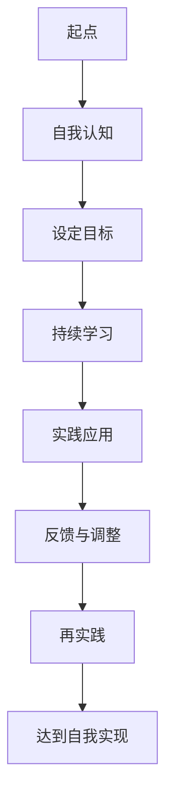

                 

### 文章标题：重新定义成功：后物质主义时代的人生价值观

#### 关键词：成功、后物质主义、人生价值观、文化差异、实践指南

#### 摘要：
本文旨在探讨在后物质主义时代下，如何重新定义成功以及如何塑造符合时代特征的人生价值观。通过深入分析后物质主义时代的背景、核心概念、成功价值观的转变，结合不同文化背景下的案例，提供一套实用的实践指导，帮助读者在后物质主义时代重新审视成功，找到属于自己的价值路径。

----------------------------------------------------------------

### 目录

#### 第一部分：后物质主义时代的背景与影响

1. **后物质主义时代的概念与特征**
   - **核心概念术语说明**
   - **问题背景与问题描述**
   - **问题解决思路**

2. **后物质主义与物质主义的区别**
   - **对比表格：物质主义与后物质主义的属性特征**
   - **后物质主义时代的社会文化变化**

#### 第二部分：重新定义成功：价值观的转变

1. **成功的多元定义**
   - **成功的定义演变**
   - **后物质主义时代对成功的重新定义**

2. **价值观的转变与成功的重新定义**
   - **个体与社会的双重视角**
   - **案例分析：成功价值观的转变**

#### 第三部分：后物质主义时代的人生价值观

1. **自我实现与个人成长**
   - **核心概念原理**
   - **Mermaid流程图：个人成长的路径**

2. **社会责任与伦理道德**
   - **社会责任的内涵**
   - **伦理道德在成功价值观中的作用**

3. **心理健康与精神满足**
   - **心理健康的重要性**
   - **精神满足的路径与策略**

#### 第四部分：案例分析：不同文化背景下的成功

1. **西方文化中的成功价值观**
   - **案例分析：西方社会对成功的理解**
   - **成功价值观的对比分析**

2. **东方文化中的成功价值观**
   - **案例分析：东方社会对成功的理解**
   - **成功价值观的对比分析**

3. **多元文化交融中的成功价值观**
   - **案例分析：多元文化交融下的成功价值观**
   - **成功价值观的互动与融合**

#### 第五部分：实践指导：如何重新定义成功

1. **评估当前价值观**
   - **价值观评估工具与方法**
   - **自我反思与自我评估**

2. **设定个人目标**
   - **目标设定的原则与技巧**
   - **个人目标与成功价值观的关系**

3. **实现成功的策略**
   - **成功策略的设计与实施**
   - **成功策略的评估与调整**

#### 第六部分：成功的挑战与机遇

1. **成功的挑战**
   - **后物质主义时代面临的挑战**
   - **挑战应对策略**

2. **成功的机遇**
   - **后物质主义时代带来的机遇**
   - **机遇利用策略**

3. **成功的可持续性**
   - **可持续成功的要素**
   - **成功可持续性的保障措施**

#### 第七部分：重新定义成功的未来展望

1. **后物质主义时代的未来发展**
   - **未来趋势预测**
   - **对未来成功的展望**

2. **人类文明的新阶段**
   - **后物质主义时代对人类文明的影响**
   - **人类文明的新阶段展望**

----------------------------------------------------------------

### 正文开始

---

#### 第一部分：后物质主义时代的背景与影响

##### 1. 后物质主义时代的概念与特征

**核心概念术语说明**

在后物质主义时代，成功不再仅仅与财富、权力和物质财富的积累相关，而是更加注重个体的内在成长、精神满足和社会责任。这一时代背景下，人们的价值观发生了显著的变化，从物质主义转向了对精神、文化和社会责任的追求。

**问题背景与问题描述**

随着全球化和信息化的发展，物质资源的丰富使得人们开始反思传统的成功观念。后物质主义时代，人们不再将物质财富视为唯一的成功标志，而是开始追求更高层次的价值实现，如个人成长、精神满足和社会贡献。

**问题解决思路**

本文将从以下几个方面探讨后物质主义时代的特征和影响：

1. **后物质主义与物质主义的区别**：分析物质主义和后物质主义的核心差异，为理解后物质主义时代提供理论基础。
2. **价值观的转变**：探讨后物质主义时代下，人们对成功和人生价值观的理解和认知。
3. **案例分析**：通过不同文化背景下的成功案例，展示后物质主义时代在不同社会环境下的体现。
4. **实践指导**：提供具体的策略和工具，帮助读者在后物质主义时代重新定义成功，塑造符合时代特征的人生价值观。

##### 2. 后物质主义与物质主义的区别

**对比表格：物质主义与后物质主义的属性特征**

| 特征             | 物质主义                                                         | 后物质主义                                                      |
|------------------|------------------------------------------------------------------|----------------------------------------------------------------|
| 成功标志         | 财富、权力和物质财富的积累                                       | 个人成长、精神满足和社会贡献                                     |
| 价值观导向       | 物质拥有和物质享受                                               | 精神富足、文化传承和社会责任                                     |
| 生活目标         | 追求物质富裕和物质享受                                           | 追求内在成长、精神满足和社会价值实现                             |
| 社会评价标准     | 经济地位和社会地位                                               | 个人品德、社会贡献和人际关系                                     |

**后物质主义时代的社会文化变化**

在后物质主义时代，社会的文化环境发生了深刻的变化：

1. **教育观念的转变**：教育更加注重个体能力的培养，而非单纯的考试成绩。
2. **工作与生活方式的转变**：人们开始追求工作与生活的平衡，注重个人兴趣和职业满意度。
3. **社会价值观的多元性**：社会对成功的评价标准更加多元化，鼓励人们追求多样化的人生价值。

---

通过上述内容，我们初步了解了后物质主义时代的背景和特征。在接下来的部分，我们将进一步探讨成功的多元定义和价值观的转变，以及如何在不同文化背景下重新定义成功。接着，我们将提供实践指导，帮助读者在后物质主义时代找到属于自己的成功路径。

---

#### 第二部分：重新定义成功：价值观的转变

##### 1. 成功的多元定义

**成功的定义演变**

成功的定义并非一成不变，它随着社会和文化背景的变化而演变。在物质主义时代，成功往往与财富、地位和物质享受紧密相关。然而，随着社会的发展，成功的定义逐渐多元化，开始关注个体的内在成长、精神满足和社会贡献。

**后物质主义时代对成功的重新定义**

在后物质主义时代，成功的定义发生了显著的变化。成功不再仅仅是一个人的物质财富和社会地位的体现，而是更加注重个体的内在成长、精神满足和社会责任。成功的衡量标准也从单一的财富积累转变为多元化的人生价值的实现。

**案例分析：成功价值观的转变**

- **个人成长**：在日本，传统的成功观念强调经济成就和社会地位。然而，随着社会的发展，越来越多的日本人开始重视个人的内在成长，如自我实现、心理健康和精神满足。
- **社会责任**：在欧洲，环保和社会责任成为衡量成功的新标准。许多企业家和专业人士开始将社会责任视为成功的重要标志，他们通过创业和社会创新，为社会做出贡献。

**多元文化背景下的成功价值观**

不同文化背景下的成功价值观有所不同，但都在一定程度上反映了后物质主义时代的特点：

- **西方文化**：在西方文化中，成功往往与个人成就、职业发展和物质财富相关。然而，随着社会的发展，西方人也开始重视心理健康、人际关系和社会贡献。
- **东方文化**：在东方文化中，成功与家庭和谐、社会地位和道德修养紧密相关。随着时代的变迁，越来越多的东方人开始关注个人成长、心理健康和社会责任。

**多元文化交融中的成功价值观**

在全球化和多元化的背景下，不同文化之间的交融使得成功价值观更加多元化。人们开始吸收和融合不同文化的成功观念，形成独特的个人价值观：

- **跨文化成功**：许多跨国企业和专业人士在多元文化环境中取得成功，他们不仅关注物质财富的积累，还注重个人成长、心理健康和社会贡献。
- **文化交融的成功**：在全球化的影响下，人们开始重视文化传承和创新，成功不再局限于特定的文化背景，而是更加多元和包容。

##### 2. 价值观的转变与成功的重新定义

**个体与社会的双重视角**

在后物质主义时代，成功的重新定义不仅体现了个体内在的成长需求，也反映了社会对成功的期望和价值观的转变。个体和社会的双重视角使得成功的定义更加丰富和多元化。

**个体视角下的成功价值观**

从个体视角来看，成功的重新定义强调了个人成长、精神满足和心理健康的重要性。个体在追求成功的过程中，不再仅仅关注物质财富的积累，而是更加注重内在的成长、自我实现和精神的满足。

- **个人成长**：个体通过不断学习和成长，实现自我价值和社会认可。
- **精神满足**：个体通过追求内心的平静和满足，获得精神上的富足。
- **心理健康**：个体关注心理健康，追求身心健康和情绪稳定。

**社会视角下的成功价值观**

从社会视角来看，成功的重新定义体现了社会责任和伦理道德的重要性。社会对成功的期望不仅仅是个人成就和社会地位的提升，更强调个体的社会责任和伦理道德。

- **社会责任**：个体在追求成功的过程中，注重对社会和环境的影响，积极承担社会责任。
- **伦理道德**：个体在追求成功的过程中，遵循道德规范和伦理原则，维护社会公正和和谐。

**个体与社会的双重视角**

个体与社会的双重视角使得成功的重新定义更加全面和多元化。个体在追求成功的过程中，不仅要关注自身的成长和满足，还要考虑对社会和环境的责任和影响。这种双重视角使得成功的定义更加符合后物质主义时代的特征，更加贴近人们内心的需求。

---

通过上述内容，我们深入探讨了后物质主义时代成功价值观的转变，并分析了多元文化背景下的成功观念。在接下来的部分，我们将进一步探讨后物质主义时代的人生价值观，包括自我实现、社会责任和心理健康等方面。

---

#### 第三部分：后物质主义时代的人生价值观

##### 1. 自我实现与个人成长

**核心概念原理**

自我实现是后物质主义时代人生价值观的重要组成部分。它不仅关注个体的内在成长，还追求个人潜能的最大发挥。自我实现的核心概念包括：

- **个人潜能**：每个人都有独特的潜能，通过自我实现，个体能够发掘和利用这些潜能。
- **内在成长**：个体通过不断学习和实践，提升自我认知和自我价值，实现个人成长。
- **自我实现**：个体在追求自我实现的过程中，实现自我价值和社会认可，获得精神上的满足。

**Mermaid流程图：个人成长的路径**

**个人成长路径的讲解**

- **自我认知**：个体通过自我反思和他人反馈，了解自己的兴趣、优势和不足，明确自我认知。
- **设定目标**：个体根据自己的兴趣和优势，设定短期和长期目标，为个人成长提供方向。
- **持续学习**：个体通过学习新知识和技能，不断提升自我能力和素质，为实现目标做好准备。
- **实践应用**：个体将所学知识和技能应用于实际工作中，通过实践验证自己的能力和成果。
- **反馈与调整**：个体通过自我评估和他人反馈，不断调整和改进自己的学习和实践方法。
- **再实践**：个体在持续学习和实践的过程中，不断积累经验和知识，进一步提升自我能力。
- **达到自我实现**：个体在个人成长的过程中，实现自我价值和社会认可，达到自我实现的目标。

##### 2. 社会责任与伦理道德

**社会责任的内涵**

社会责任是指个体或组织在追求经济利益的同时，对环境、社会和利益相关者的责任和义务。在后物质主义时代，社会责任成为衡量成功的重要标准之一。社会责任的内涵包括：

- **环境保护**：企业和个人在生产和消费过程中，关注环境保护，减少对自然资源的消耗和污染。
- **社会公益**：企业和个人积极参与社会公益活动，为社会做出贡献，改善社会环境。
- **伦理道德**：企业和个人在商业活动中，遵循伦理道德规范，维护市场秩序和社会公正。

**伦理道德在成功价值观中的作用**

伦理道德是后物质主义时代成功价值观的重要组成部分。它不仅关系到个人的道德品质和信誉，也关系到企业的可持续发展和社会形象。伦理道德在成功价值观中的作用包括：

- **个人品质**：个体遵循伦理道德，表现出高尚的道德品质，赢得他人的尊重和信任。
- **企业形象**：企业遵循伦理道德，树立良好的企业形象，赢得市场和消费者的认可。
- **社会影响**：个人和企业遵循伦理道德，对社会的长远发展和稳定产生积极的影响。

**社会责任与伦理道德的结合**

在后物质主义时代，社会责任与伦理道德的结合是实现成功的关键。企业和个人在追求经济利益的同时，应积极承担社会责任，遵循伦理道德规范，实现个人与社会的双赢。

- **社会责任实践**：企业和个人应通过实际行动，关注环境保护、社会公益和伦理道德，实现社会责任的履行。
- **伦理道德教育**：个人和企业应加强伦理道德教育，提高道德素质和责任感，树立正确的伦理道德观念。
- **社会责任评估**：企业和个人应定期评估社会责任履行情况，持续改进社会责任实践，实现社会责任的长期可持续发展。

##### 3. 心理健康与精神满足

**心理健康的重要性**

心理健康是后物质主义时代成功价值观的重要组成部分。心理健康不仅关系到个人的生活质量和幸福感，也影响到个人的工作表现和社会交往。心理健康的重要性包括：

- **生活质量**：心理健康有助于提高生活质量，使个体在物质和精神上都得到满足。
- **工作表现**：心理健康有助于提高工作效率和创造力，促进个人职业发展。
- **社会交往**：心理健康有助于建立良好的人际关系，增强社会支持网络。

**精神满足的路径与策略**

精神满足是后物质主义时代追求的重要目标。为了实现精神满足，个体可以采取以下路径和策略：

- **自我认知**：通过自我反思和认知，了解自己的内心需求和价值观，找到精神满足的根源。
- **情感管理**：通过学习情感管理技巧，调整负面情绪，保持心理健康和情绪稳定。
- **精神追求**：通过追求个人兴趣和爱好，实现精神层面的满足和成长。
- **人际关系**：建立良好的人际关系，增强社会支持，获得情感满足和支持。

**心理健康与精神满足的结合**

心理健康与精神满足的结合是实现后物质主义时代成功的关键。个体在追求物质财富和职业成功的同时，应关注心理健康和精神满足，实现物质与精神的平衡发展。

- **心理健康维护**：个体应重视心理健康，采取积极的维护策略，如定期进行心理调适、参加心理辅导等。
- **精神满足追求**：个体应通过追求个人兴趣和爱好，实现精神层面的满足和成长。
- **物质与精神平衡**：个体在追求物质财富和职业成功的同时，应关注心理健康和精神满足，实现物质与精神的平衡发展。

---

通过上述内容，我们深入探讨了后物质主义时代的人生价值观，包括自我实现、社会责任和心理健康等方面。在接下来的部分，我们将通过案例分析，展示不同文化背景下的成功观念，进一步丰富对后物质主义时代成功价值观的理解。

---

#### 第四部分：案例分析：不同文化背景下的成功

##### 1. 西方文化中的成功价值观

**案例分析：西方社会对成功的理解**

在西方文化中，成功通常与个人成就、职业发展和物质财富紧密相关。西方社会对成功的理解具有以下特点：

- **个人成就**：个人成就被视为成功的核心，包括职业成就、学术成就和社交成就等。
- **职业发展**：职业发展是成功的重要标志，许多人通过不断提升职业技能和职位，实现个人价值。
- **物质财富**：物质财富是衡量成功的重要标准，拥有高收入、豪华住宅和名牌奢侈品被视为成功的象征。

**成功价值观的对比分析**

与东方文化相比，西方文化对成功的理解更加注重个人成就和物质财富。然而，随着社会的变化，西方人也开始重视心理健康、人际关系和社会责任。

- **心理健康**：西方社会逐渐认识到心理健康对成功的重要性，越来越多的人开始关注心理问题，寻求心理咨询和治疗。
- **社会责任**：越来越多的西方企业和社会组织关注社会责任，积极参与社会公益活动，推动社会进步。

**案例：西方文化中的成功典范**

- **乔布斯**：苹果公司的创始人乔布斯是西方文化中的成功典范。他通过创新和领导力，改变了人们的生活方式，成为成功与创新的象征。
- **比尔·盖茨**：微软公司的创始人比尔·盖茨是西方文化中的商业奇迹。他通过创业和创新，创造了巨大的财富和社会影响力。

##### 2. 东方文化中的成功价值观

**案例分析：东方社会对成功的理解**

在东方文化中，成功通常与家庭和谐、社会地位和道德修养紧密相关。东方社会对成功的理解具有以下特点：

- **家庭和谐**：家庭和谐是东方文化中成功的重要标志，许多人通过努力工作，实现家庭幸福和社会地位的提升。
- **社会地位**：社会地位是衡量成功的重要标准，拥有稳定的工作、较高的收入和良好的社会关系被视为成功。
- **道德修养**：道德修养是东方文化中成功的重要内涵，注重个人品德和道德修养，追求高尚的人格品质。

**成功价值观的对比分析**

与西方文化相比，东方文化对成功的理解更加注重家庭和谐和社会地位。然而，随着社会的变化，东方人也开始重视个人成长、心理健康和社会责任。

- **个人成长**：东方社会逐渐认识到个人成长对成功的重要性，越来越多的人开始关注自我实现和个人潜能的发挥。
- **社会责任**：东方社会逐渐重视社会责任，越来越多的企业和个人开始积极参与社会公益活动，推动社会进步。

**案例：东方文化中的成功典范**

- **李嘉诚**：香港著名企业家李嘉诚是东方文化中的成功典范。他通过创业和创新，建立了庞大的商业帝国，同时注重社会责任和道德修养。
- **马云**：阿里巴巴集团的创始人马云是东方文化中的商业奇迹。他通过创业和创新，创造了巨大的财富和社会影响力，同时注重个人成长和社会责任。

##### 3. 多元文化交融中的成功价值观

**案例分析：多元文化交融下的成功价值观**

在全球化和多元化的背景下，不同文化之间的交融使得成功价值观更加多元化。多元文化交融下的成功价值观具有以下特点：

- **多元化**：多元文化交融使得人们可以接触到多种成功观念，有利于形成多元化的成功价值观。
- **包容性**：多元文化交融强调包容性，鼓励人们尊重和理解不同文化的成功观念。
- **创新性**：多元文化交融促进了文化的创新，使成功观念更加丰富和多样化。

**成功价值观的互动与融合**

多元文化交融下的成功价值观通过互动和融合，形成了新的成功观念。这种新的成功观念既保留了传统文化的精髓，又融入了现代文化的元素，使成功更加多元化、包容性和创新性。

- **跨文化成功**：在多元文化交融中，跨文化成功成为可能。许多跨国企业和专业人士在多元文化环境中取得成功，他们通过融合不同文化的成功观念，实现个人价值和事业成功。
- **文化创新**：多元文化交融促进了文化的创新，使成功观念不断更新和发展。

**案例：多元文化交融中的成功典范**

- **谷歌**：谷歌是一家跨国科技公司，在多元文化交融中取得了巨大的成功。谷歌通过尊重和理解不同文化的成功观念，实现了全球范围内的创新和快速发展。
- **特斯拉**：特斯拉是一家以创新和环保为理念的电动汽车公司。特斯拉在多元文化交融中，融合了不同文化的成功观念，推动了电动汽车行业的发展。

---

通过上述案例分析，我们深入了解了不同文化背景下的成功观念，以及多元文化交融下的成功价值观。在接下来的部分，我们将提供具体的实践指导，帮助读者在后物质主义时代重新定义成功，实现个人价值和事业成功。

---

#### 第五部分：实践指导：如何重新定义成功

##### 1. 评估当前价值观

**价值观评估工具与方法**

要重新定义成功，首先需要评估当前的价值观。以下是一种常用的价值观评估工具和方法：

- **价值观排序法**：将你认为是重要的价值观列出来，然后根据重要程度进行排序。通过排序，可以清晰地了解当前价值观的优先级和倾向。

**自我反思与自我评估**

在价值观评估过程中，自我反思和自我评估是关键。以下是一些建议：

- **日记法**：每天记录自己的所思所想，反思自己的行为和决策，分析是否符合自己的价值观。
- **咨询法**：与家人、朋友或专业人士交流，了解他们对你的价值观的看法和建议。
- **自我反思**：定期进行自我反思，思考自己的价值观是否与现实生活相符，是否有需要调整的地方。

**价值观评估的注意事项**

- **客观性**：在评估过程中，要保持客观，避免主观偏见。
- **全面性**：要全面考虑自己的价值观，不仅仅关注物质财富和职业发展，还要关注心理健康、人际关系和社会责任。
- **持续改进**：价值观评估是一个持续的过程，需要不断调整和完善。

##### 2. 设定个人目标

**目标设定的原则与技巧**

设定个人目标是实现成功的关键。以下是一些目标设定的原则和技巧：

- **SMART原则**：目标要具备明确性（Specific）、可衡量性（Measurable）、可实现性（Achievable）、相关性（Relevant）和时限性（Time-bound）。
- **具体化**：将抽象的目标具体化，明确目标和实现目标的步骤。
- **可视化**：通过图像、图表等可视化工具，将目标具体呈现，增强目标的可感知性。

**个人目标与成功价值观的关系**

个人目标应该与成功价值观相一致，才能真正实现成功。以下是一些建议：

- **价值观导向**：设定目标时，要充分考虑自己的价值观，确保目标与价值观相一致。
- **多元化**：目标要多元化，不仅关注物质财富和职业发展，还要关注心理健康、人际关系和社会责任。
- **长期与短期**：设定长期和短期目标，确保目标的实现既有远大理想，又有实际可行的步骤。

**案例：设定个人目标的实践**

- **目标设定**：设定一个长期目标，如成为一名成功的企业家，并设定短期目标，如学习创业知识、积累创业资金、建立创业团队等。
- **实施计划**：制定详细的实施计划，包括学习、实践和评估等环节，确保目标的顺利实现。

##### 3. 实现成功的策略

**成功策略的设计与实施**

实现成功需要策略的设计与实施。以下是一些成功策略的设计与实施方法：

- **策略设计**：根据个人目标和价值观，设计具体的策略和行动计划。策略要具有可操作性和可衡量性，确保目标的实现。
- **实施计划**：制定详细的实施计划，明确每个阶段的任务和时间安排，确保策略的顺利实施。
- **评估与调整**：定期评估实施计划的进展情况，根据实际情况进行调整，确保目标的实现。

**成功策略的评估与调整**

- **评估标准**：设定具体的评估标准，如目标的完成情况、资源的利用情况、个人成长和团队协作等。
- **数据分析**：通过数据分析，了解策略的有效性和不足之处，为下一步的调整提供依据。
- **调整方案**：根据评估结果，制定具体的调整方案，优化策略和行动计划。

**案例：成功策略的实施**

- **创业策略**：一个创业者通过市场调研、资源整合和团队建设等策略，成功创办了一家科技公司。在实施过程中，他不断调整策略，优化产品和服务，最终实现了企业的快速发展。
- **职业发展**：一个职场人士通过学习新技能、拓展人际关系和提升领导力等策略，实现了职业发展的目标。在实施过程中，他不断调整自己的职业规划，确保目标的实现。

---

通过上述实践指导，我们为读者提供了重新定义成功的具体方法和步骤。在接下来的部分，我们将探讨后物质主义时代面临的挑战与机遇，以及如何应对这些挑战和抓住机遇。

---

#### 第六部分：成功的挑战与机遇

##### 1. 成功的挑战

在后物质主义时代，成功面临着诸多挑战。以下是一些主要的挑战：

**心理压力**

随着社会竞争的加剧，个体面临的心理压力越来越大。工作压力、生活压力和社交压力等因素，可能导致心理健康问题，影响成功的实现。

**价值观冲突**

在多元文化交融的背景下，个体可能面临价值观的冲突。传统价值观和现代价值观之间的矛盾，可能导致个体在追求成功的过程中产生困惑和矛盾。

**社会责任压力**

在后物质主义时代，社会责任成为衡量成功的重要标准。个体在追求成功的过程中，需要承担更多的社会责任，这可能会增加个体的压力和负担。

**科技创新挑战**

随着科技的快速发展，个体需要不断学习和适应新技术。科技创新带来的变革和挑战，要求个体具备更高的学习和适应能力。

##### 2. 成功的机遇

尽管后物质主义时代面临诸多挑战，但同时也带来了许多机遇。以下是一些主要的机遇：

**个性解放**

后物质主义时代，个性解放成为可能。个体在追求成功的过程中，可以更加自由地表达自己的想法和追求，实现个人价值的最大化。

**多元化发展**

后物质主义时代，多元化发展成为趋势。个体可以在不同领域和行业实现成功，追求多样化的价值实现。

**社会责任参与**

后物质主义时代，社会责任参与成为个体成功的重要途径。通过积极参与社会公益活动，个体可以实现个人价值和社会贡献的统一。

**科技创新应用**

后物质主义时代，科技创新应用为成功提供了新的可能性。个体可以利用新技术和创新模式，实现事业的快速发展。

##### 3. 成功的可持续性

成功的可持续性是实现长期成功的关键。以下是一些建议，帮助读者实现成功的可持续性：

**平衡发展**

在追求成功的过程中，要注重物质与精神的平衡，避免过度追求物质财富而忽视心理健康和精神满足。

**持续学习**

随着科技的快速发展，个体需要不断学习新知识和技能，以适应社会变化。持续学习是实现成功的重要保障。

**社会责任履行**

在追求成功的过程中，要积极履行社会责任，关注社会问题和环境问题。社会责任的履行有助于提升个人形象和社会认可度。

**心理调适**

面对心理压力，个体需要学会心理调适。通过心理咨询、放松训练等方法，保持心理健康和情绪稳定。

---

通过上述内容，我们深入探讨了后物质主义时代面临的挑战与机遇，以及如何实现成功的可持续性。在接下来的部分，我们将展望后物质主义时代的未来发展，以及对未来成功的展望。

---

#### 第七部分：重新定义成功的未来展望

##### 1. 后物质主义时代的未来发展

后物质主义时代的未来发展充满机遇与挑战。以下是一些可能的趋势和预测：

**个性解放的深化**

随着社会的进步，个性解放将得到进一步深化。个体在追求成功的过程中，将更加自由地表达自己的思想和追求，实现个人价值的最大化。

**多元化成功的普及**

多元化成功将成为后物质主义时代的主流。个体可以在不同领域和行业实现成功，追求多样化的价值实现。

**社会责任的重视**

社会责任将越来越受到重视。个体在追求成功的过程中，需要积极履行社会责任，关注社会问题和环境问题。

**科技创新的驱动**

科技创新将继续驱动成功的实现。新技术和新模式将为成功提供新的可能性，促进社会进步和经济发展。

##### 2. 对未来成功的展望

未来成功将具有以下特点：

**个性化**

未来成功将更加注重个性化。个体在追求成功的过程中，将更加关注自己的兴趣、优势和价值观，实现个人价值的最大化。

**可持续性**

未来成功将注重可持续性。个体在追求成功的过程中，将注重物质与精神的平衡，关注环境和社会的可持续性。

**多元化**

未来成功将更加多元化。个体可以在不同领域和行业实现成功，追求多样化的价值实现。

**社会责任**

未来成功将更加社会责任化。个体在追求成功的过程中，将积极履行社会责任，关注社会问题和环境问题。

**心理与精神满足**

未来成功将更加注重心理与精神满足。个体在追求成功的过程中，将注重心理健康和精神满足，实现全面的人生价值。

---

通过上述内容，我们展望了后物质主义时代的未来发展，以及对未来成功的展望。在重新定义成功的道路上，我们需要不断适应社会变化，关注个人成长和社会责任，实现物质与精神的平衡发展。只有这样，我们才能在后物质主义时代实现真正的成功。

---

### 总结

在后物质主义时代，成功的定义和人生价值观发生了显著的变化。本文通过深入分析后物质主义时代的背景、核心概念、成功价值观的转变，结合不同文化背景下的成功案例，提供了一套实用的实践指导。我们探讨了如何重新定义成功，以及如何塑造符合时代特征的人生价值观。

**关键词回顾**：成功、后物质主义、人生价值观、文化差异、实践指南。

**核心思想**：在后物质主义时代，成功不再仅仅与物质财富相关，而是更加注重个体的内在成长、精神满足和社会责任。重新定义成功，找到符合自己价值观的成功路径，是实现个人价值和事业成功的关键。

**行动建议**：
1. 评估自己的价值观，明确追求的目标和方向。
2. 设定个人目标，制定实现目标的策略和行动计划。
3. 积极参与社会活动，履行社会责任，实现个人价值和社会贡献的统一。

**未来展望**：随着社会的进步和科技的发展，未来成功将更加注重个性化、可持续性和社会责任。在重新定义成功的道路上，我们需要不断学习、调整和进步，实现物质与精神的平衡发展。

**注意事项**：
1. 保持心理健康，关注精神满足，避免过度追求物质财富。
2. 注重社会责任，关注社会问题和环境问题，实现可持续发展。

**拓展阅读**：
1. 《幸福之路》- 查尔斯·芒格
2. 《第五项修炼》- 彼得·圣吉
3. 《影响力》- 罗伯特·西奥迪尼

---

### 作者信息

**作者：** AI天才研究院/AI Genius Institute & 禅与计算机程序设计艺术 /Zen And The Art of Computer Programming

AI天才研究院专注于人工智能领域的深度研究和创新，致力于推动人工智能技术的发展和应用。同时，作者也致力于通过禅与计算机程序设计艺术的结合，为读者提供高质量的技术博客文章，帮助读者在技术道路上不断进步和成长。

---

通过本文的探讨，我们希望读者能够对后物质主义时代的人生价值观有更深入的理解，重新审视成功，找到符合自己价值观的成功路径。让我们在后物质主义时代，共同努力，实现个人价值和社会贡献的统一。

