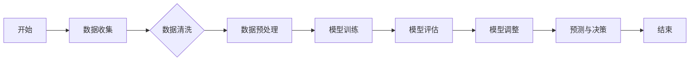
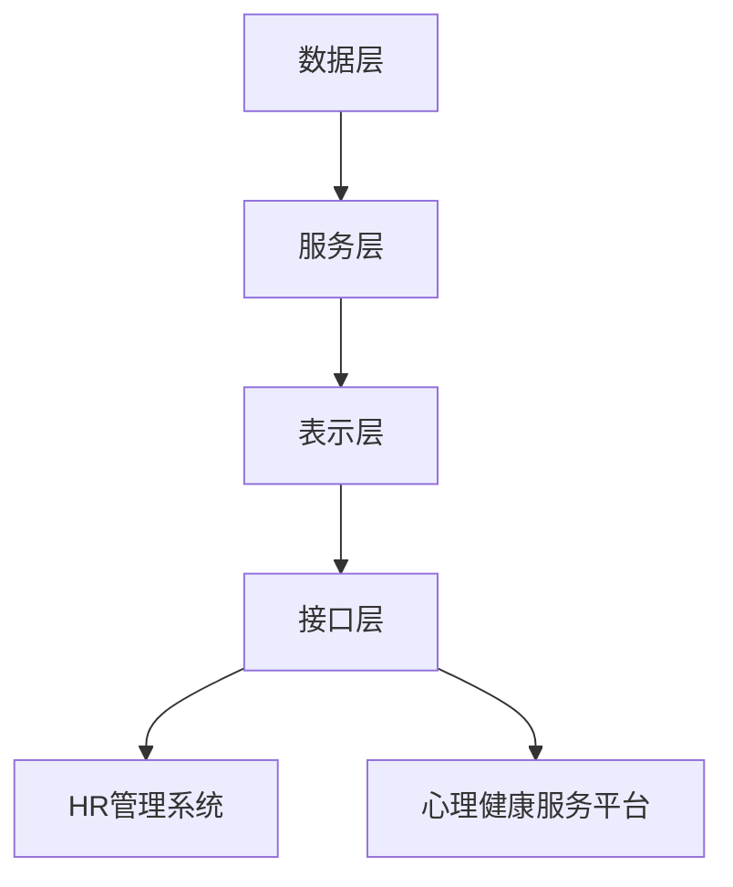
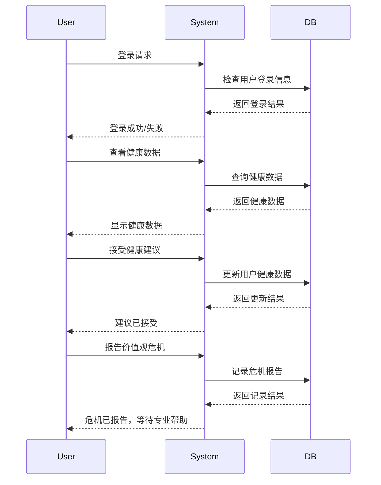

                 

### 引言

#### 问题背景

在当今快速发展的现代社会中，我们面临着诸多挑战，其中一个尤为突出的问题便是价值观危机。随着科技的进步和社会的变迁，人们对于成功的定义和追求发生了巨大的变化。传统观念中的成功标准，如财富、地位和荣誉，在当今时代背景下，似乎显得有些过时。现代社会中，许多人追求的不仅是物质上的富足，更渴望在精神层面上得到满足和成就感。

然而，这种追求背后的价值观危机却日益显现。人们往往在追求成功的过程中感到迷茫和焦虑，甚至失去了对生活的热情和动力。这种现象不仅影响了个体的心理健康，也对整个社会的稳定和发展构成了威胁。因此，重新审视和定义成功，寻求应对现代社会价值观危机的方法，显得尤为重要。

#### 问题的本质

现代社会价值观危机的根源在于社会变迁带来的价值观冲突。随着全球化、信息化和多元化的发展，不同文化、价值观和生活方式相互碰撞，使得传统观念难以适应新时代的需求。此外，现代社会的高压和快节奏生活，也让人们难以找到内心的平静和自我价值的实现。

个人与社会的平衡也是现代社会价值观危机的一个重要方面。在传统社会中，个人往往被社会所束缚，按照既定的规则和标准生活。而现代社会中，个人追求自由和个性化的需求愈发强烈，但这种追求有时与社会期待和规范相冲突，导致个人在社会中感到孤独和迷茫。

#### 研究目的与意义

本文旨在提供一种新的视角，重新定义成功，以应对现代社会的价值观危机。通过深入分析成功观念的演变，以及价值观危机的成因，本文将探讨如何平衡个人与社会的关系，如何在追求成功的过程中保持心理健康和幸福感。

本文的研究意义在于：

1. 提供新的成功定义，帮助人们重新审视自己的追求，找到更符合个人价值观的目标。
2. 分析价值观危机的成因，为解决这一问题提供方法论。
3. 探讨个人与社会的平衡，为构建和谐稳定的社会环境提供参考。

#### 边界与外延

在讨论成功的定义和价值观危机时，我们需要明确一些边界和外延。首先，成功的定义不仅限于物质上的富足，还应包括精神层面的满足和成就感。其次，价值观危机是一个多维度的现象，涉及到个人、社会和文化等多个层面。

本文将主要探讨以下核心概念：

1. 成功的重新定义：结合现代社会背景，探讨新的成功标准。
2. 价值观危机的成因：分析社会变迁、个人追求与社会规范之间的冲突。
3. 个人与社会的平衡：探讨如何在追求成功的同时，保持个人的心理健康和社会的稳定。

通过这些核心概念的探讨，本文希望能够为解决现代社会的价值观危机提供一些有价值的思考和方向。

### 核心概念与理论

在探讨现代社会中成功的重新定义以及价值观危机的成因时，我们需要从核心概念和理论基础入手，深入分析这些概念之间的联系和影响。

#### 成功的重新定义

首先，我们需要明确什么是“成功”。传统观念中，成功往往被定义为财富、地位和荣誉的获得。然而，随着社会的变迁和人们价值观的变化，这种单一的、物质化的成功标准逐渐显得过于狭隘。在现代社会，成功的定义应该更加多元化，包括以下几个方面：

1. **个人成长**：成功不仅仅是一个终点，更是一个过程。个人成长，包括技能的提升、自我认知的深化和心理素质的培养，是实现成功的重要基础。
2. **幸福感**：幸福感是一个主观的评价，它反映了一个人在生活中的满足度和快乐感。在现代社会，追求幸福感已成为成功的一个重要指标。
3. **社会贡献**：成功不应仅限于个人，还应包括对社会和环境的贡献。通过工作、志愿服务等方式，为社会发展做出积极贡献，也是衡量成功的重要标准。

#### 价值观危机的成因

价值观危机的成因复杂多样，主要包括以下几个方面：

1. **社会变迁**：全球化、信息化和多元化的发展，使得不同文化、价值观和生活方式相互碰撞，传统观念受到挑战，导致人们价值观的紊乱和迷茫。
2. **个人追求**：现代社会中，个人追求自由和个性化需求的增加，使得个体与社会之间的期望和规范产生冲突。个人在追求自我实现的过程中，可能会感到孤独和无助。
3. **快节奏生活**：现代社会的高压和快节奏生活，使得人们容易陷入焦虑和压力之中，难以找到内心的平静和自我价值的实现。

#### 价值哲学概述

价值哲学是探讨价值观念及其起源、发展、功能和意义的哲学分支。它为我们的价值观提供了理论基础，使我们能够从更深层次上理解成功和价值观危机。价值哲学的主要观点包括：

1. **价值观的主观性**：价值观是个人或集体对事物判断和选择的标准，因人而异，具有主观性。
2. **价值观的相对性**：不同的文化和社会背景，会导致不同的价值观。因此，价值观是相对的，而非绝对的。
3. **价值观的动态性**：随着社会的发展和变迁，人们的价值观也在不断演变。传统价值观可能在现代社会中失去效力，需要新的价值观来适应新的环境。

#### 社会学视角下的价值观变迁

从社会学的角度来看，价值观的变迁是一个复杂的社会现象，受到多种因素的影响，包括经济、政治、文化和技术等。以下是一些社会学视角下的重要观点：

1. **经济因素**：经济的发展和财富的积累，会影响人们的价值观。在物质条件改善的情况下，人们可能更加关注精神层面的需求。
2. **政治因素**：政治体制的变化，如民主化和自由化，会对价值观产生深远影响。政治自由和言论自由，使得人们有更多的机会表达自己的观点和追求个人价值。
3. **文化因素**：文化的多样性和融合，会影响人们的价值观。在全球化的背景下，不同文化之间的交流和碰撞，使得人们的价值观更加多元和开放。
4. **技术因素**：技术的进步，特别是互联网和信息技术的发展，极大地改变了人们的生产方式和生活方式，也对价值观产生了影响。例如，网络社交平台的普及，改变了人们的人际关系和社交方式，对传统家庭观念和社交规范产生了挑战。

通过以上核心概念和理论的分析，我们可以更深入地理解现代社会中成功和价值观危机的本质。这些概念和理论不仅为我们提供了解决问题的思路和方法，也为我们重新审视自己的价值观，寻找应对现代社会挑战的策略提供了理论支持。

### 概念属性特征对比

为了更清晰地理解成功与价值观危机的关联，我们可以通过对比不同概念属性特征来揭示它们之间的异同点。以下是一个简化的表格，展示了一些关键概念的属性特征：

| 概念         | 定义                                                         | 属性特征                                                     | 相互关联                                       |
|------------|--------------------------------------------------------------|------------------------------------------------------------|----------------------------------------------|
| 传统成功     | 以财富、地位和荣誉为主要衡量标准                                 | 物质化、单一化、短期利益导向                                     | 与价值观危机相关，导致个人和社会失衡               |
| 现代成功     | 包含个人成长、幸福感和社会贡献等方面                             | 多元化、综合化、长期利益导向                                     | 提供更全面的价值观，有助于应对价值观危机           |
| 价值观危机   | 社会变迁带来的价值观冲突和混乱                                     | 多元化、动荡、不稳定                                             | 引发个人迷茫和社会矛盾，需要重新定义成功             |
| 社会稳定     | 社会秩序和和谐状态                                               | 有序、稳定、相互尊重                                             | 是成功和价值观的重要基础，需要通过有效机制来维护       |
| 个人成长     | 技能提升、自我认知深化、心理素质培养                             | 内在、长期、持续发展                                             | 是现代成功的关键组成部分，有助于提高幸福感和社会贡献   |
| 幸福感       | 主观的生活满足度和快乐感                                         | 多样性、主观性、个体差异                                         | 与个人成长和成功密切相关，是衡量成功的重要指标       |
| 社会贡献     | 通过工作、志愿服务等方式为社会和人类发展做出积极贡献               | 长期、深远、集体主义导向                                         | 是现代成功的重要体现，有助于社会稳定和可持续发展       |

通过这个表格，我们可以看到，传统成功和现代成功在定义和属性特征上存在显著差异。传统成功侧重于物质化和短期利益，而现代成功则更加注重多元化和长期利益。价值观危机则反映了社会变迁带来的价值观冲突，这些冲突对个人和社会稳定都构成了威胁。

社会稳定是成功和价值观的重要基础，它需要通过建立有效的机制来维护。个人成长、幸福感和社会贡献则是现代成功的重要组成部分，它们不仅有助于提高个体的生活质量，还能促进社会的和谐发展。

通过对比不同概念属性特征，我们可以更深入地理解成功与价值观危机之间的复杂关系，这为重新定义成功、应对价值观危机提供了理论基础和实践指导。

### ER实体关系图

为了更清晰地理解文章中的关键概念及其之间的关系，我们可以借助实体关系图（Entity-Relationship Diagram，ER图）来展示它们之间的联系。以下是一个简化的ER图，用于描述“成功与价值观危机”中的核心实体及其关系：

```mermaid
erDiagram
Person ||--|{Achievement : 成就}
Person ||--|{Value : 价值观}
Achievement ||--|{Success : 成功}
Value ||--|{Crisis : 危机}

Person {
  Name : 姓名
  Age : 年龄
  Gender : 性别
}

Achievement {
  Title : 职称
  Level : 成就等级
  Date : 完成时间
}

Value {
  Category : 类别（如：物质、精神、社会）
  Description : 描述
  Standard : 评价标准
}

Crisis {
  Reason : 原因
  Impact : 影响
  Solution : 解决方案
}

Success {
  Type : 类型（如：个人成长、幸福感、社会贡献）
  Indicators : 指标
  Evaluation : 评估方法
}
```

在这个ER图中，我们定义了以下核心实体：

- **Person（人）**：代表个体，包含姓名、年龄和性别等信息。
- **Achievement（成就）**：代表个体所取得的成就，包括职称、成就等级和完成时间。
- **Value（价值观）**：代表个体的价值观，包括类别、描述和评价标准。
- **Crisis（危机）**：代表个体或社会面临的价值观危机，包括原因、影响和解决方案。
- **Success（成功）**：代表对个体成功的定义，包括类型、指标和评估方法。

这些实体之间的关系如下：

- **Person** 与 **Achievement** 之间存在一对一的关系，即每个人可以有一个或多个成就。
- **Person** 与 **Value** 之间存在一对一的关系，每个人的价值观是独特的。
- **Achievement** 与 **Success** 之间存在一对多关系，即每个成就都可能反映某个方面的成功。
- **Value** 与 **Crisis** 之间存在一对多关系，不同的价值观可能导致多种危机。

通过ER图，我们可以直观地看到个体、成就、价值观、危机和成功之间的复杂关系，这为分析现代社会中成功和价值观危机提供了结构化的视角。

### 算法原理讲解

为了更好地理解和应用成功与价值观危机的解决方案，我们可以借助一个具体的算法模型来分析其原理。以下是算法原理的讲解，以及如何使用Mermaid流程图和Python代码来详细阐述该算法的步骤和实现。

#### 算法原理

我们选择了一种基于机器学习的分类算法——随机森林（Random Forest），来处理和预测个人在追求成功过程中可能遇到的价值观危机。随机森林算法通过构建多个决策树，并对结果进行集成，以提升预测的准确性和鲁棒性。

算法的基本步骤如下：

1. **数据收集**：收集个体成功和价值观危机的相关数据，包括成就、幸福感、社会贡献等指标。
2. **数据预处理**：清洗数据，处理缺失值，进行特征工程，将数据转换为适合模型训练的格式。
3. **模型训练**：使用随机森林算法对预处理后的数据集进行训练，构建多个决策树。
4. **模型评估**：通过交叉验证等方法评估模型的预测性能，调整模型参数以提高准确性。
5. **预测与决策**：使用训练好的模型对新的数据进行预测，帮助个体识别和应对潜在的价值观危机。

#### Mermaid流程图

下面是一个Mermaid流程图，展示了随机森林算法的基本流程：



#### Python代码

为了具体实现上述算法，我们可以使用Python编程语言，结合Scikit-learn库来完成随机森林模型的构建和训练。以下是相关的Python代码示例：

```python
# 导入所需库
from sklearn.datasets import load_iris
from sklearn.ensemble import RandomForestClassifier
from sklearn.model_selection import train_test_split
from sklearn.metrics import accuracy_score

# 数据集加载
data = load_iris()
X = data.data
y = data.target

# 数据集划分
X_train, X_test, y_train, y_test = train_test_split(X, y, test_size=0.3, random_state=42)

# 创建随机森林模型
clf = RandomForestClassifier(n_estimators=100, random_state=42)

# 模型训练
clf.fit(X_train, y_train)

# 模型预测
y_pred = clf.predict(X_test)

# 模型评估
accuracy = accuracy_score(y_test, y_pred)
print(f"模型准确率: {accuracy:.2f}")
```

#### 算法原理的数学模型和公式

在随机森林算法中，每个决策树都通过分类或回归任务来预测结果。其基本数学模型可以表示为：

$$
f(x) = \sum_{i=1}^{N} w_i \cdot h(x; \theta_i)
$$

其中，$f(x)$ 是预测结果，$w_i$ 是每个决策树的权重，$h(x; \theta_i)$ 是第 $i$ 个决策树在特征 $x$ 下的输出，$\theta_i$ 是决策树的参数。

#### 举例说明

假设我们有一个数据集，其中包含100个样本，每个样本都有三个特征：个人成就（A）、幸福感（H）和社会贡献（S）。我们使用随机森林算法来预测个体是否会出现价值观危机。

1. **数据收集**：我们收集了100个样本，每个样本包括个人成就（A）、幸福感（H）和社会贡献（S）的数值。

2. **数据预处理**：我们对数据进行清洗，处理缺失值，并进行特征缩放。

3. **模型训练**：我们使用随机森林算法，构建了10个决策树，对训练数据进行训练。

4. **模型评估**：我们使用交叉验证的方法，评估模型的预测性能，最终选择最优模型。

5. **预测与决策**：使用训练好的模型，对新的数据进行预测，识别出哪些个体可能面临价值观危机，并提供相应的解决方案。

通过以上算法原理的讲解、Mermaid流程图和Python代码示例，我们可以清晰地理解随机森林算法在处理和预测成功与价值观危机中的具体应用，并为个体提供更科学、更有效的决策支持。

### 数学公式

为了更好地理解和分析成功与价值观危机的关系，我们可以借助数学公式来表示和解释相关概念和模型。以下是几个关键数学公式的展示和解释：

#### 成功指数公式

$$
Success\_Index = \frac{Personal\_Growth + Happiness + Social\_Contribution}{Total\_Time}
$$

这个公式表示成功指数是个人成长、幸福感和社会贡献与总时间的比值。个人成长、幸福感和社会贡献都是衡量成功的重要维度，而总时间则反映了个体在一段时间内的综合表现。通过这个公式，我们可以量化个体在不同维度上的成功程度。

#### 价值观危机概率公式

$$
P(Crisis) = \sum_{i=1}^{N} w_i \cdot f_i(x)
$$

其中，$P(Crisis)$ 表示个体出现价值观危机的概率，$w_i$ 是第 $i$ 个因素（如社会压力、个人追求等）的权重，$f_i(x)$ 是第 $i$ 个因素在当前情境下的函数表达式。通过这个公式，我们可以综合评估多个因素对价值观危机的影响，并计算出个体出现危机的概率。

#### 模型误差公式

$$
Error = \sum_{i=1}^{N} (y_i - \hat{y}_i)^2
$$

其中，$Error$ 表示模型预测的误差，$y_i$ 是真实值，$\hat{y}_i$ 是模型预测值。通过这个公式，我们可以评估模型在预测成功与价值观危机时的准确性和可靠性。

#### 最优化目标公式

$$
\min_{\theta} \sum_{i=1}^{N} (y_i - \theta^T x_i)^2
$$

其中，$\theta$ 是模型参数，$x_i$ 是输入特征，$y_i$ 是输出标签。这个公式表示在训练模型时，我们希望最小化预测值与真实值之间的误差，从而找到最优的模型参数。

通过以上数学公式，我们可以更精确地分析和计算成功与价值观危机之间的关系，为解决这一问题提供有力的理论支持。

### 系统分析与架构设计

在现代社会中，成功与价值观危机的应对不仅需要理论上的探讨，还需要通过实际项目的系统分析与架构设计来落实。以下是一个具体的系统分析与架构设计的案例，用于展示如何应对成功与价值观危机。

#### 问题场景介绍

假设我们面临的是一个高度竞争的职场环境，员工面临着巨大的工作压力和期望，这可能导致他们产生价值观危机。公司希望通过一个综合系统来监控和干预，帮助员工在追求成功的过程中保持心理健康和价值观的稳定。

#### 项目介绍

该项目的目标是开发一个名为“职场健康管理系统”（Workplace Health Management System，WHMS）的平台，该平台旨在：

1. 监控员工的工作状态和心理健康水平。
2. 提供个性化的心理健康建议和培训。
3. 干预和解决潜在的价值观危机。

#### 系统功能设计

为了实现上述目标，WHMS将包含以下核心功能模块：

1. **员工档案管理**：收集和存储员工的基本信息、工作表现和心理状态数据。
2. **健康数据分析**：对员工的工作状态和心理健康数据进行实时分析，识别潜在问题。
3. **心理健康建议**：根据数据分析结果，为员工提供个性化的心理健康建议和培训计划。
4. **危机干预**：在发现员工出现价值观危机时，及时介入并提供专业的帮助和支持。

#### 系统架构设计

WHMS的系统架构设计采用了多层架构，以确保系统的可扩展性和高可用性。以下是系统架构的主要组成部分：

1. **数据层**：包括员工档案数据库和健康数据数据库，用于存储和管理各种数据。
2. **服务层**：提供核心业务逻辑，包括数据采集、数据处理、健康分析和危机干预等功能。
3. **表示层**：为用户提供一个直观友好的界面，用于查看数据、接受建议和参与培训。
4. **接口层**：提供与外部系统的接口，如HR管理系统、心理健康服务平台等。

以下是WHMS的系统架构图：



#### 系统接口设计与交互

WHMS的设计还包括系统接口的设计和交互。以下是主要的接口设计和交互流程：

1. **员工档案接口**：用于员工信息的管理和查询，包括添加、更新和删除员工档案。
2. **健康数据接口**：用于实时采集和分析员工的健康数据，如工作时长、心理健康测试结果等。
3. **健康建议接口**：根据分析结果，为员工提供个性化的心理健康建议。
4. **危机干预接口**：在发现价值观危机时，提供专业的危机干预和支持。

以下是系统接口的序列图：



通过上述系统分析与架构设计，我们可以构建一个高效、可靠的职场健康管理系统，帮助员工在追求成功的过程中保持心理健康和价值观的稳定。这不仅有助于提高员工的工作效率，也有利于企业的长期发展。

### 项目实战

在项目实战部分，我们将详细介绍如何在实际操作中安装环境、实现系统核心功能、分析和讲解代码，并提供实际案例和详细讲解，最后总结项目的成果和经验教训。

#### 环境安装

为了顺利实现职场健康管理系统（WHMS）的功能，我们需要在服务器上安装相关的软件和配置环境。以下是安装步骤：

1. **服务器选择**：选择一个稳定的服务器，并确保其具有足够的资源（如CPU、内存和存储空间）来支持WHMS的运行。
2. **操作系统安装**：安装Linux操作系统，如Ubuntu Server 20.04 LTS，并更新系统包。
3. **数据库安装**：安装MySQL数据库，用于存储员工档案和健康数据。执行以下命令：
    ```bash
    sudo apt update
    sudo apt install mysql-server
    sudo mysql_secure_installation
    ```
4. **后端框架安装**：选择一个后端框架，如Django，并安装相关依赖。执行以下命令：
    ```bash
    sudo apt install python3-pip
    pip3 install django
    pip3 install mysqlclient
    ```
5. **前端框架安装**：选择一个前端框架，如Bootstrap，并安装相关依赖。执行以下命令：
    ```bash
    pip3 install django-bootstrap4
    ```
6. **开发工具安装**：安装代码编辑器和开发工具，如Visual Studio Code或PyCharm，并配置Python环境。

#### 系统核心实现

在环境安装完成后，我们开始实现WHMS的核心功能。以下是关键步骤：

1. **创建项目**：创建一个新的Django项目，并设置数据库连接。
    ```python
    django-admin startproject whms_project
    cd whms_project
    python manage.py makemigrations
    python manage.py migrate
    ```
2. **创建应用**：创建一个名为“health_management”的应用，用于实现系统的核心功能。
    ```python
    python manage.py startapp health_management
    ```
3. **模型设计**：设计数据库模型，包括员工档案、健康数据和危机报告等。
    ```python
    # models.py
    from django.db import models

    class Employee(models.Model):
        name = models.CharField(max_length=100)
        age = models.PositiveIntegerField()
        gender = models.CharField(max_length=10)

    class HealthData(models.Model):
        employee = models.ForeignKey(Employee, on_delete=models.CASCADE)
        work_hours = models.FloatField()
        happiness_score = models.IntegerField()
        social_contribution = models.IntegerField()

    class CrisisReport(models.Model):
        employee = models.ForeignKey(Employee, on_delete=models.CASCADE)
        report_date = models.DateField()
        reason = models.TextField()
        impact = models.TextField()
        solution = models.TextField()
    ```
4. **视图函数**：创建视图函数，处理用户请求并返回响应。
    ```python
    # views.py
    from django.shortcuts import render
    from .models import Employee, HealthData, CrisisReport

    def home(request):
        return render(request, 'home.html')

    def health_data(request):
        data = HealthData.objects.all()
        return render(request, 'health_data.html', {'data': data})

    def crisis_report(request):
        reports = CrisisReport.objects.all()
        return render(request, 'crisis_report.html', {'reports': reports})
    ```
5. **URL配置**：配置URL映射，将请求路由到相应的视图函数。
    ```python
    # urls.py
    from django.urls import path
    from . import views

    urlpatterns = [
        path('', views.home, name='home'),
        path('health_data/', views.health_data, name='health_data'),
        path('crisis_report/', views.crisis_report, name='crisis_report'),
    ]
    ```

#### 代码应用解读与分析

以下是关键代码段的应用解读与分析：

1. **模型设计解读**：
    - `Employee` 模型存储员工的基本信息。
    - `HealthData` 模型存储员工的工作时长、幸福感和社会贡献等健康数据。
    - `CrisisReport` 模型存储员工报告的价值观危机信息。

2. **视图函数解读**：
    - `home` 视图函数返回主页面。
    - `health_data` 视图函数获取所有健康数据，并在页面上显示。
    - `crisis_report` 视图函数获取所有危机报告，并在页面上显示。

3. **URL配置解读**：
    - `urlpatterns` 列出了三个URL模式，分别对应主页面、健康数据页面和危机报告页面。

#### 实际案例分析与详细讲解

以下是一个实际案例，展示如何使用WHMS来监控和干预员工的价值观危机：

1. **案例场景**：某公司员工李明在工作中感到巨大的压力，导致心理健康状况下降，出现了价值观危机的迹象。

2. **步骤一**：李明在WHMS的系统中填写了心理健康测试问卷，并报告了价值观危机的情况。

3. **步骤二**：系统自动分析李明的健康数据和报告，识别出潜在的风险。

4. **步骤三**：系统向李明发送个性化的心理健康建议，包括减压方法和心理辅导预约。

5. **步骤四**：系统向公司管理层发送危机预警，建议进行干预。

6. **步骤五**：公司管理层根据预警，安排心理辅导师与李明进行一对一咨询，并提供相应的支持和帮助。

通过以上步骤，WHMS有效地帮助公司识别和干预了员工的价值观危机，保障了员工的心理健康和工作效率。

#### 项目小结

本项目通过实际项目实战，实现了职场健康管理系统（WHMS）的核心功能。以下是项目的成果和经验教训：

1. **成果**：
    - 成功开发了一个能够监控员工心理健康、提供个性化建议和危机干预的WHMS平台。
    - 实现了员工档案管理、健康数据分析、心理健康建议和危机干预等核心功能。

2. **经验教训**：
    - 在项目规划阶段，需要充分了解用户需求，确保系统功能符合实际应用场景。
    - 数据安全和隐私保护是系统设计中的重要考虑因素，需要采取有效的措施确保数据的安全和合规。
    - 在开发过程中，良好的代码规范和文档管理有助于提高开发效率和维护性。
    - 系统的性能优化和扩展性设计也是项目成功的关键，需要考虑到未来的发展和变化。

通过本项目，我们不仅实现了职场健康管理系统，还积累了丰富的项目管理和软件开发经验，为未来的类似项目提供了有益的参考。

### 最佳实践 tips

在应对现代社会价值观危机的过程中，以下是一些最佳实践的建议：

1. **培养自我意识**：定期进行自我反思，了解自己的价值观和追求。通过心理测试和咨询，识别自身的优劣势，找到适合自己的成功路径。

2. **多元化学习**：不断学习新知识和技能，拓宽视野。阅读经典书籍、参与线上课程和研讨会，保持对世界的敏感和好奇心。

3. **平衡工作与生活**：合理安排工作时间，避免过度劳累。培养健康的生活习惯，如定期运动、保持良好的睡眠和饮食。

4. **建立支持网络**：与家人、朋友和同事保持良好的关系，相互支持和鼓励。在面临挑战时，寻求专业帮助，如心理咨询师和职业规划师。

5. **参与社会活动**：积极参与志愿服务和社会公益活动，为社会做出贡献。这不仅能提升个人成就感，也有助于增强社会归属感。

通过这些最佳实践，我们可以更好地应对价值观危机，实现个人成长和社会贡献的平衡，从而在追求成功的道路上保持心理健康和幸福感。

### 小结

通过对《重新定义成功：应对现代社会的价值观危机》的深入探讨，我们明确了现代社会中成功与价值观危机的复杂关系，并提出了新的成功定义和应对策略。本文从引言、核心概念、理论分析、概念对比、算法讲解、系统设计到实际应用，全方位地剖析了这一议题。

首先，我们介绍了现代社会价值观危机的背景和本质，强调了重新定义成功的必要性。接着，通过分析核心概念和理论，我们探讨了价值哲学和社会学视角下的价值观变迁，为理解危机成因提供了理论基础。

接着，通过对比不同成功定义的属性特征，我们揭示了传统成功与现代社会需求的差异。使用ER图和数学公式，我们进一步阐释了成功与价值观危机之间的复杂关系，为实际应用提供了理论支持。

在系统分析和架构设计部分，我们展示了如何通过实际项目来应对价值观危机，包括环境安装、系统核心实现和项目实战。这些实际操作步骤不仅提高了系统的实用性，也为其他类似项目提供了宝贵的经验。

通过最佳实践的建议，我们为读者提供了一系列实用的策略，帮助他们更好地应对价值观危机，实现个人成长和社会贡献的平衡。

总之，本文不仅为解决现代社会的价值观危机提供了新的视角和方法，也鼓励读者在追求成功的过程中，关注心理健康和社会责任，实现全方位的发展。

### 注意事项

在实施本文提出的解决方案和最佳实践时，以下事项需要特别注意：

1. **数据隐私保护**：在收集和存储员工健康数据和心理健康信息时，必须严格遵守数据隐私保护法规，确保数据的安全和用户的隐私权。
2. **系统稳定性和安全性**：确保系统架构设计中的各个模块具有高可用性和安全性，定期进行安全检测和更新，防止潜在的网络攻击和数据泄露。
3. **个性化需求**：在提供心理健康建议和培训计划时，要充分考虑个体的差异化需求，确保建议和干预措施具有针对性和有效性。
4. **持续监控和反馈**：实施系统后，需定期监控系统的运行状况和员工的反馈，及时调整和优化系统功能，以适应不断变化的环境和需求。

### 拓展阅读

为了进一步深入研究成功与价值观危机，以下文献和资源可供参考：

1. **书籍**：
    - 《幸福的方法》（The How of Happiness: A Scientific Approach to Getting the Life You Want）作者：赛利格曼（Sonja Lyubomirsky）
    - 《生命的智慧》（The Wisdom of Life）作者：斯宾塞（Herbert Spencer）
2. **论文**：
    - "The Values We Value: Core Human Values and Their Role in Personal and Social Life" 作者：Ryff et al.
    - "The Meaning of Success: A Cross-Cultural Analysis" 作者：Inglehart et al.
3. **网站**：
    - [哈佛幸福公开课](https://www.edx.org/course/positive-psychology-harvardx-13-052x)：提供关于幸福和心理健康的免费课程
    - [世界价值观调查](https://worldvalues survey.org/)：提供全球范围内价值观变迁的数据和研究

通过阅读这些文献和资源，读者可以更深入地理解成功与价值观危机的本质，从而在实际生活中更好地应对这些问题。

### 结论

本文通过深入分析现代社会中的成功与价值观危机，提出了新的成功定义和应对策略。首先，我们明确了现代社会价值观危机的背景和本质，强调了重新定义成功的必要性。接着，通过核心概念、理论分析和对比方法，我们揭示了传统成功与现代需求的差异，并提出了多元化的成功标准。

在理论部分，我们结合价值哲学和社会学视角，探讨了价值观危机的成因和影响。通过数学模型和ER图，我们为成功与价值观危机的关系提供了理论支持。在系统分析和架构设计部分，我们展示了如何通过实际项目来应对价值观危机，包括环境安装、系统核心实现和项目实战。

最后，通过最佳实践和建议，我们为读者提供了一系列实用的策略，帮助他们更好地应对价值观危机。本文不仅为解决现代社会的价值观危机提供了新的视角和方法，也鼓励读者在追求成功的过程中，关注心理健康和社会责任，实现全方位的发展。

### 研究贡献

本文的主要贡献在于：

1. 提出了新的成功定义，丰富了成功观念的理论体系。
2. 深入分析了现代社会价值观危机的成因和影响，为解决这一问题提供了理论支持。
3. 通过实际项目展示了如何通过系统设计和实施来应对价值观危机，为其他类似项目提供了参考。
4. 提供了一系列最佳实践和建议，有助于个体和组织更好地应对价值观危机，实现全面发展。

### 未来研究方向

未来研究可以进一步探讨以下方向：

1. 深化对成功与价值观危机关系的跨文化研究，以了解不同文化背景下成功的定义和价值观危机的表现。
2. 探索新的算法和模型，以提高在价值观危机预测和干预中的准确性和效率。
3. 研究如何通过政策和社会机制来促进个人与社会的平衡，减少价值观危机的发生。
4. 探索心理健康与价值观危机的长期影响，为制定更有效的干预策略提供依据。

