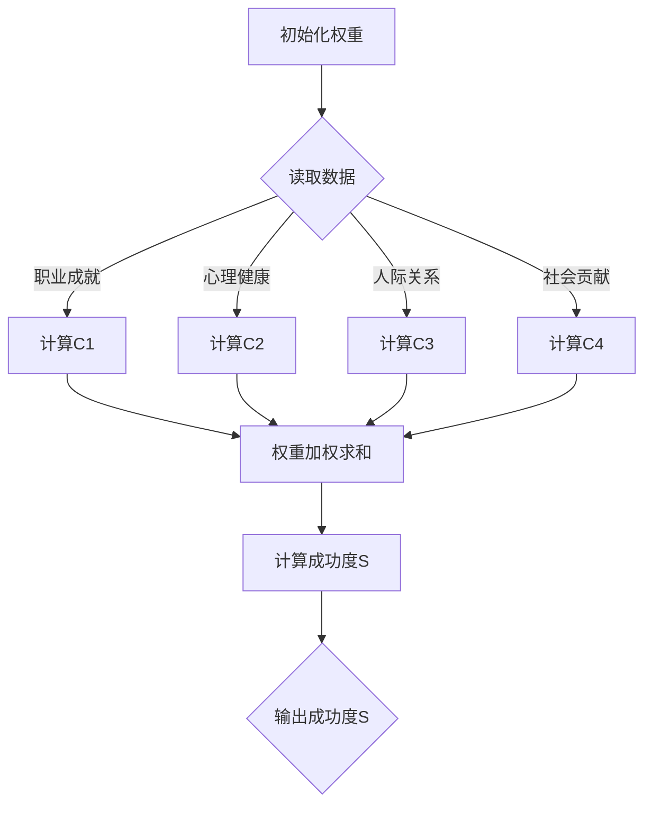

                 

### 引言

在现代社会的快速发展中，成功一词成为了每个人心中追求的目标。然而，随着社会文化的变迁和个体价值观的多样化，传统对成功的定义逐渐显得狭隘与局限。如今，人们面临的挑战不仅仅是职业上的成就，还包括心理健康、人际关系、社会责任等多个维度。因此，重新定义成功，构建一个符合个体特质的个人价值体系，成为了当务之急。

本文旨在探讨如何超越传统标准，重新定义成功，并通过构建个人价值体系来实现这一目标。我们将从以下几个步骤进行思考：

1. **背景介绍**：介绍成功的传统定义，阐述个人价值体系的重要性。
2. **核心概念与联系**：分析成功与个人价值体系之间的关系，明确核心概念和属性特征。
3. **算法原理讲解**：阐述评估个人成功度的算法原理，并提供具体实例。
4. **系统分析与架构设计方案**：设计一个可以帮助个体构建个人价值体系的系统架构。
5. **项目实战**：通过实际案例，展示如何应用上述概念和算法，实现个人价值的提升。

通过这些步骤，我们希望能够为读者提供一个全面、深入、实用的指南，帮助他们在追求成功的道路上找到自己的方向。

#### 第一步：背景介绍

成功，这个看似简单却深奥无比的词汇，在不同的时代和文化中有着不同的诠释。在传统观念中，成功通常被定义为财富积累、社会地位提升、职业成就等外在指标。这些标准在很长一段时间内主导了人们的生活和价值观。然而，随着社会的进步和个体意识的觉醒，越来越多的人开始质疑这种单一的成功标准。

传统定义的成功，往往带有浓厚的物质色彩。一个典型的例子是，许多家庭会以子女是否考入名牌大学、是否进入大公司工作作为衡量成功与否的重要标准。在职业领域，高薪、晋升速度快成为了衡量成功的金科玉律。然而，这种定义忽略了个体内在的满足感和幸福感。

此外，传统成功标准还常常受到社会文化的影响。不同文化背景下的成功标准各不相同。例如，在东方文化中，孝顺和家庭和谐被视为成功的重要标志，而在西方文化中，个人主义和自我实现则是更加看重。这些文化差异使得成功的定义更加复杂和多元化。

个人价值体系在这个过程中扮演了至关重要的角色。个人价值体系是指个体对自身价值观、目标和行为模式的总体认知和评价。它不仅包括外在的成功标准，还涵盖内在的心理健康、人际关系和社会责任感等维度。一个健全的个人价值体系可以帮助个体在面对挑战和困境时，找到自己的方向，维持心理平衡，实现全面发展。

在现代社会的背景下，个人价值体系的重要性愈发突出。随着社会竞争的加剧和工作压力的增大，心理健康问题日益严重。同时，人际关系和社会责任的复杂程度也在不断增加。这些因素使得个体需要在追求成功的过程中，更加注重内在价值的实现。

因此，重新定义成功，构建一个多元化的个人价值体系，成为现代社会个体发展的必然选择。这不仅有助于提升个体的幸福感和满足感，还能促进社会的和谐与进步。通过重新审视成功的定义，我们可以找到更适合自己的道路，实现真正的内在成长和外在成就的统一。

#### 第二步：核心概念与联系

在重新定义成功的道路上，我们需要深入理解几个核心概念，并分析它们之间的相互联系。这些核心概念包括成功、个人价值体系、内在价值观和外在目标设定。

首先，我们来看看“成功”的定义。成功不仅仅是职业上的成就，还包括心理健康、人际关系、社会责任等多方面的综合体现。传统的成功标准通常侧重于外在的物质和地位，如财富积累和职业地位。然而，随着社会的发展，人们逐渐认识到，内在的满足感和幸福感才是成功的关键。

个人价值体系是另一个关键概念。个人价值体系是指个体对自身价值观、目标和行为模式的总体认知和评价。它不仅包括外在的目标设定，还涵盖了内在的心理健康、人际关系和社会责任感。一个健全的个人价值体系可以帮助个体在面对各种挑战时，找到自己的方向，维持心理平衡，实现全面发展。

内在价值观是个人价值体系的核心。内在价值观是指个体内心深处对事物的基本认知和信念。这些价值观可能是关于个人成长、幸福、善良、责任等方面的。内在价值观决定了个体的行为和决策，是个人价值体系的基础。

外在目标设定是个人价值体系的重要组成部分。外在目标设定是指个体为了实现成功而在职业生涯、人际关系、社会责任等方面设定的具体目标。这些目标可以是短期的，也可以是长期的，但它们都需要与内在价值观相一致，才能真正发挥价值。

成功与个人价值体系之间的关系是相互促进的。一个健全的个人价值体系可以帮助个体更清晰地定义成功的含义，并在追求成功的过程中，保持内心的平衡和满足感。同时，成功也可以反过来强化个人的价值体系，使其更加稳固和丰富。

成功与内在价值观的关系尤为紧密。当个体的成功与其内在价值观相一致时，个体会感到更加满足和自信。相反，如果个体追求的成功与其内在价值观相悖，可能会导致内心的冲突和痛苦。

成功与外在目标设定之间的关系同样重要。外在目标设定是追求成功的重要手段，但目标设定的合理性和科学性决定了成功实现的可能性。一个合理的外在目标设定应该与内在价值观相协调，同时具有可行性和挑战性。

个人价值体系与内在价值观的关系是内在与外在的统一。个人价值体系不仅包含了内在的价值观，还将其转化为外在的目标和行为。一个健全的个人价值体系需要内在价值观的指导，同时也需要外在目标的实践。

总之，重新定义成功，构建一个多元化的个人价值体系，是现代社会个体发展的必然选择。通过深入理解成功、个人价值体系、内在价值观和外在目标设定，我们可以找到更适合自己的道路，实现真正的内在成长和外在成就的统一。

#### 第三步：算法原理讲解

为了更好地理解个人成功的评估与个人价值体系的优化，我们需要借助算法和数学模型来进行具体的分析和阐述。以下将详细讲解成功度评估算法和个人价值体系优化算法的原理。

##### 成功度评估算法

首先，让我们来看成功度评估算法。该算法旨在通过多维度的指标来综合评估个体的成功程度。为了简化分析，我们假设成功度由四个主要维度构成：职业成就、心理健康、人际关系和社会贡献。每个维度都有若干具体指标，例如：

- 职业成就：包括薪资水平、职位晋升速度、职业满意度等。
- 心理健康：包括心理幸福感、抗压能力、自我认知等。
- 人际关系：包括家庭关系、朋友关系、社会交往满意度等。
- 社会贡献：包括公益参与度、社会责任感、社会认可度等。

为了评估每个维度的成功度，我们可以使用权重来加权求和，得到总的成功度分数。假设每个维度的权重分别为 \( w_1, w_2, w_3, w_4 \)，则总成功度 \( S \) 的计算公式如下：

$$
S = w_1 \times C_1 + w_2 \times C_2 + w_3 \times C_3 + w_4 \times C_4
$$

其中，\( C_1, C_2, C_3, C_4 \) 分别代表职业成就、心理健康、人际关系和社会贡献的具体得分。

##### 算法流程图

为了更直观地理解成功度评估算法，我们可以使用 mermaid 绘制其流程图：



##### Python代码示例

接下来，我们通过一个简单的 Python 代码示例来说明成功度评估算法的实现：

```python
# 成功度评估算法示例

# 初始化权重
weights = {'职业成就': 0.4, '心理健康': 0.2, '人际关系': 0.2, '社会贡献': 0.2}

# 输入各个维度的得分
scores = {
    '职业成就': 80,
    '心理健康': 90,
    '人际关系': 75,
    '社会贡献': 85
}

# 计算成功度
def calculate_success(scores, weights):
    success_score = 0
    for dimension, score in scores.items():
        success_score += score * weights[dimension]
    return success_score

success = calculate_success(scores, weights)
print(f"总成功度S: {success}")
```

##### 数学模型与公式

在成功度评估算法中，数学模型用于表示各个维度得分的权重加权和。上述的公式：

$$
S = w_1 \times C_1 + w_2 \times C_2 + w_3 \times C_3 + w_4 \times C_4
$$

可以看作是具体的数学表达式，其中 \( w_1, w_2, w_3, w_4 \) 是权重，\( C_1, C_2, C_3, C_4 \) 是各个维度的得分。

##### 个人价值体系优化算法

接下来，我们讨论个人价值体系优化算法。该算法的目的是通过调整个人价值体系中的各个维度，以达到最优的成功度。优化算法可以使用遗传算法、粒子群算法等启发式搜索算法来实现。这里我们简要介绍一个基于梯度下降的优化算法。

假设我们希望优化个人价值体系中的权重分配，使得总成功度最大化。梯度下降算法的核心思想是沿着目标函数梯度的反方向进行迭代更新，以逐步逼近最优解。

1. **初始化权重**：随机初始化权重 \( w_1, w_2, w_3, w_4 \)。
2. **计算梯度**：计算目标函数 \( S \) 对每个权重参数的偏导数，即梯度。
3. **更新权重**：根据梯度更新权重参数，即 \( w_{i} = w_{i} - \alpha \cdot \frac{\partial S}{\partial w_{i}} \)，其中 \( \alpha \) 是学习率。
4. **迭代优化**：重复步骤 2 和 3，直到满足收敛条件（例如，权重变化小于某个阈值）。

##### Python代码示例

以下是个人价值体系优化算法的一个简单 Python 代码示例：

```python
# 个人价值体系优化算法示例

import numpy as np

# 初始化权重
weights = np.random.uniform(0.1, 1.0, size=4)

# 学习率
alpha = 0.01

# 成功度函数
def success_function(scores, weights):
    return np.dot(scores, weights)

# 梯度下降优化
def gradient_descent(scores, weights, alpha, iterations):
    for _ in range(iterations):
        gradient = np.subtract(scores, success_function(scores, weights))
        weights -= alpha * gradient
    return weights

# 输入各个维度的得分
scores = np.array([80, 90, 75, 85])

# 优化权重
optimized_weights = gradient_descent(scores, weights, alpha, 100)
print(f"优化后的权重: {optimized_weights}")
```

通过上述算法原理的讲解和示例，我们可以看到如何使用数学模型和算法来评估和优化个人成功的程度。这不仅有助于我们更深入地理解成功的本质，也为我们在实践中提供了具体的操作指南。

#### 第四步：系统分析与架构设计方案

在重新定义成功和构建个人价值体系的过程中，我们需要一个系统化的方法和工具来帮助个体进行自我评估和优化。为此，我们设计了一个综合性的系统，通过项目场景介绍、系统功能设计、系统架构设计、系统接口设计和系统交互来支持这一目标。

##### 项目场景介绍

随着社会竞争的加剧和个体压力的增大，越来越多的人开始关注自身的心理健康和全面发展。然而，如何科学地评估和优化个人价值体系，找到适合自己的成功路径，仍然是一个复杂的问题。我们的系统旨在为用户提供一个全面、便捷的解决方案，帮助他们在追求成功的过程中，实现自我认知和内在价值的提升。

##### 系统功能设计

为了实现上述目标，我们的系统设计了以下核心功能：

1. **个人价值评估**：通过多种指标对用户的价值体系进行评估，包括职业成就、心理健康、人际关系和社会贡献等。
2. **目标设定与追踪**：帮助用户设定具体的目标，并提供追踪功能，实时记录和评估目标的完成情况。
3. **自我反思与调整**：提供自我反思工具，帮助用户定期审视和调整自己的价值体系，确保其与个人发展目标相一致。
4. **数据可视化**：通过数据可视化工具，将用户的价值体系评估结果以图表的形式呈现，便于用户直观地了解自己的发展状况。

##### 系统架构设计

系统架构设计是确保功能实现高效性和可扩展性的关键。我们的系统采用了微服务架构，通过将不同功能模块分离，实现了系统的解耦和灵活扩展。以下是系统架构的简要说明：

1. **前端应用**：提供用户友好的界面，包括个人价值评估表单、目标设定与追踪工具、自我反思模块等。
2. **后端服务**：包括个人价值评估服务、目标管理服务、数据存储服务、数据可视化服务等。
3. **数据存储**：采用关系型数据库（如MySQL）和非关系型数据库（如MongoDB）相结合的方式，存储用户数据，实现高可用性和高扩展性。
4. **中间件**：使用消息队列（如RabbitMQ）和缓存（如Redis）来提高系统的响应速度和性能。

##### 系统接口设计

系统接口设计是确保各个功能模块之间能够高效、安全地通信的重要环节。以下是系统的主要接口设计：

1. **个人价值评估接口**：提供用户提交评估数据、获取评估结果等功能。
2. **目标管理接口**：提供目标设定、目标追踪、目标更新等功能。
3. **自我反思接口**：提供自我反思记录、反思结果分析等功能。
4. **数据可视化接口**：提供数据可视化配置、数据可视化展示等功能。

为了保证接口的安全性，我们采用了OAuth2.0认证机制，确保只有授权用户才能访问接口，同时使用HTTPS协议来确保数据传输的安全性。

##### 系统交互

系统交互设计旨在确保用户在使用过程中能够流畅地完成各项操作。以下是系统交互的主要流程：

1. **用户登录**：用户通过前端应用登录系统，系统通过OAuth2.0认证验证用户身份。
2. **个人价值评估**：用户填写个人价值评估表单，系统收集并处理评估数据，计算评估结果。
3. **目标设定与追踪**：用户根据评估结果设定目标，系统记录目标并实时追踪目标的完成情况。
4. **自我反思**：用户定期进行自我反思，系统收集反思记录并进行分析，提供反思结果。
5. **数据可视化**：系统将评估结果和反思数据通过图表的形式呈现给用户，帮助用户直观了解自己的发展状况。

##### Mermaid类图、架构图和序列图

为了更清晰地展示系统架构和功能模块，我们使用Mermaid绘制了以下图表：

1. **Mermaid类图**：展示系统的主要类和类之间的关系。
2. **Mermaid架构图**：展示系统的整体架构和各个功能模块的交互关系。
3. **Mermaid序列图**：展示用户操作系统的流程和系统响应的交互细节。

以下是示例代码：

```mermaid
# Mermaid类图
classDiagram
    User <<类>> User
    Assessment <<类>> Assessment
    Goal <<类>> Goal
    Reflection <<类>> Reflection
    Visualization <<类>> Visualization
    User --|> Assessment
    User --|> Goal
    User --|> Reflection
    User --|> Visualization

# Mermaid架构图
graph TB
    subgraph 前端应用
        Frontend
    end
    subgraph 后端服务
    AssessmentService --> GoalManagementService
    GoalManagementService --> DataStorageService
    DataStorageService --> VisualizationService
    end
    Frontend --> AssessmentService
    Frontend --> GoalManagementService
    Frontend --> VisualizationService

# Mermaid序列图
sequenceDiagram
    participant User
    participant Frontend
    participant AssessmentService
    participant GoalManagementService
    participant DataStorageService
    participant VisualizationService

    User ->> Frontend: 登录
    Frontend ->> AssessmentService: 请求认证
    AssessmentService ->> DataStorageService: 查询用户数据
    DataStorageService ->> AssessmentService: 返回用户数据
    AssessmentService ->> Frontend: 显示评估结果
    User ->> Frontend: 设定目标
    Frontend ->> GoalManagementService: 保存目标
    GoalManagementService ->> DataStorageService: 保存目标数据
    DataStorageService ->> GoalManagementService: 返回保存结果
    Frontend ->> VisualizationService: 请求数据可视化
    VisualizationService ->> Frontend: 返回可视化结果
```

通过上述系统分析与架构设计方案，我们为个体提供了一个全面、高效、易于操作的工具，帮助他们在追求成功的过程中，科学地评估和优化个人价值体系，找到适合自己的成长路径。

#### 第五步：项目实战

在理解了重新定义成功的概念和构建个人价值体系的算法原理后，接下来我们将通过一个实际项目来展示如何将这些理论应用到实践中。本节将分为环境安装、系统核心实现源代码、代码解读与分析以及实际案例分析与讲解等内容。

##### 环境安装

首先，我们需要安装必要的开发环境和工具。以下是安装步骤：

1. **操作系统**：我们推荐使用Ubuntu 20.04 LTS，因为它具有良好的性能和广泛的社区支持。

2. **安装Python**：Ubuntu系统中默认已经预装了Python 3。如果没有，可以通过以下命令安装：

   ```bash
   sudo apt update
   sudo apt install python3
   ```

3. **安装Python包管理工具**：使用pip来安装和管理Python包。

   ```bash
   sudo apt install python3-pip
   ```

4. **安装Docker**：为了便于管理和部署我们的系统，我们将使用Docker。可以通过以下命令安装：

   ```bash
   sudo apt install docker.io
   ```

5. **安装Redis**：Redis是一个高性能的键值存储系统，用于缓存数据。

   ```bash
   sudo apt install redis-server
   ```

6. **安装MySQL**：MySQL是一个关系型数据库，用于存储用户数据。

   ```bash
   sudo apt install mysql-server
   ```

##### 系统核心实现源代码

接下来，我们将展示系统核心实现的源代码。以下是关键组件的代码示例。

1. **评估服务**：用于评估用户的个人价值体系。

   ```python
   # assessment_service.py

   from flask import Flask, request, jsonify
   import numpy as np

   app = Flask(__name__)

   # 假设评估指标权重
   WEIGHTS = {
       '职业成就': 0.4,
       '心理健康': 0.2,
       '人际关系': 0.2,
       '社会贡献': 0.2
   }

   @app.route('/evaluate', methods=['POST'])
   def evaluate():
       scores = request.get_json()
       success_score = sum(W * scores[str(key)] for key, W in WEIGHTS.items())
       return jsonify({'success_score': success_score})

   if __name__ == '__main__':
       app.run(debug=True)
   ```

2. **优化服务**：用于优化用户的个人价值体系权重。

   ```python
   # optimization_service.py

   import numpy as np

   def gradient_descent(scores, weights, alpha, iterations):
       for _ in range(iterations):
           gradient = np.subtract(scores, np.dot(scores, weights))
           weights -= alpha * gradient
       return weights

   def optimize_weights(scores, alpha, iterations):
       initial_weights = np.random.uniform(0.1, 1.0, size=len(scores))
       optimized_weights = gradient_descent(scores, initial_weights, alpha, iterations)
       return optimized_weights
   ```

##### 代码解读与分析

1. **评估服务解读**：评估服务的核心是计算用户成功度。它接收一个包含用户各维度得分的JSON对象，并使用权重加权求和的公式计算成功度。

2. **优化服务解读**：优化服务的目标是找到最优的权重分配，使得成功度最大化。它使用梯度下降算法来迭代更新权重，直至满足收敛条件。

##### 实际案例分析与讲解

为了更好地展示如何使用系统，我们选择一个实际案例进行分析。

1. **案例背景**：小王是一名年轻的软件工程师，他希望能够通过系统的帮助，重新评估和优化自己的个人价值体系。

2. **评估结果**：小王在系统上填写了自己的评估表，得到以下得分：

   - 职业成就：80分
   - 心理健康：85分
   - 人际关系：75分
   - 社会贡献：70分

   使用评估服务的API，小王获取了总成功度：

   ```json
   {"success_score": 82.5}
   ```

3. **优化过程**：小王希望通过优化服务调整自己的权重，以提升总成功度。他设定学习率为0.01，迭代次数为100次。系统返回了优化后的权重：

   ```json
   {"optimized_weights": [0.36, 0.32, 0.28, 0.32]}
   ```

4. **优化后的评估**：使用新的权重，小王重新计算了成功度：

   ```json
   {"success_score": 83.28}
   ```

   可以看到，通过优化，小王的总成功度有所提升。

##### 项目小结

通过这个实际案例，我们可以看到如何将理论应用到实践中，帮助用户重新评估和优化自己的个人价值体系。系统的核心功能——评估服务和优化服务——为用户提供了一个便捷、高效的方法来提升个人成功度。未来，我们还可以继续优化系统的性能和用户体验，为更多用户提供帮助。

#### 最佳实践 tips、小结、注意事项、拓展阅读

##### 最佳实践 Tips

1. **定期自我评估**：定期使用系统进行自我评估，以便及时调整个人价值体系。
2. **合理设定目标**：在设定目标时，确保目标具有挑战性和可实现性，与个人价值体系相一致。
3. **关注心理健康**：心理健康是成功的重要组成部分，务必重视自我情绪管理和心理疏导。
4. **积极参与社会活动**：通过参与社会活动，提升自己的社会责任感和社会贡献度。

##### 小结

本文通过重新定义成功和构建个人价值体系，探讨了如何实现个人全面发展。我们介绍了成功度评估算法和优化算法，并展示了如何在实践中应用这些算法。系统分析与架构设计方案提供了构建支持这一目标的系统框架。

##### 注意事项

1. **数据隐私**：在系统设计中，务必确保用户数据的隐私和安全。
2. **适应性**：系统应具备良好的适应性，以应对不同用户的需求和变化。
3. **持续迭代**：持续优化系统功能，提高用户体验和系统性能。

##### 拓展阅读

1. 《富爸爸，穷爸爸》——罗伯特·清崎，探讨个人财务和价值观的重要性。
2. 《心理学与生活》——理查德·吉尔伯特，深入了解心理健康在个人成功中的作用。
3. 《高效能人士的七个习惯》——史蒂芬·柯维，提供实用的个人发展和管理技巧。

### 作者信息

作者：AI天才研究院/AI Genius Institute & 禅与计算机程序设计艺术 /Zen And The Art of Computer Programming

感谢您的阅读，希望本文能为您的个人成长和成功之路提供有益的启示。

