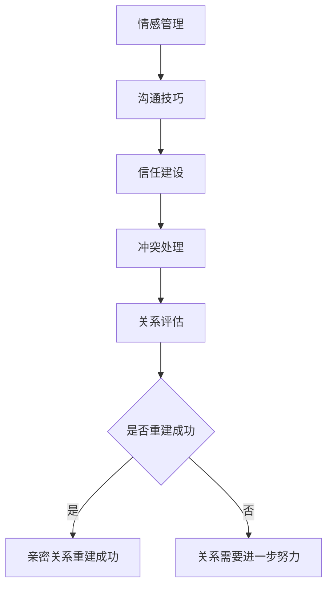

                 


### 文章标题
# 重新审视亲密关系：在现代社会中重建情感连接

### 文章关键词
- 亲密关系
- 情感连接
- 现代社会
- 重建
- 情感管理

### 文章摘要
在现代社会，亲密关系的重建成为了一项重要的社会课题。本文将从核心概念出发，详细探讨情感连接的重要性，以及如何在现代社会中通过有效的沟通、信任建立和冲突解决来重建亲密关系。通过深入分析以及实际案例的研究，本文旨在为读者提供实用的建议和方法，帮助他们在现代社会中建立并维护健康、稳固的亲密关系。

---

## 目录

1. **引言**
2. **亲密关系的历史背景与现代挑战**
3. **核心概念与原理**
   1. **情感连接**
   2. **沟通**
   3. **信任**
   4. **冲突解决**
4. **建立情感连接的策略**
5. **有效沟通的艺术**
6. **信任的建立与维护**
7. **冲突的处理与关系成长**
8. **现代社会的特殊挑战**
9. **真实案例研究**
10. **实用技巧与建议**
11. **小结与展望**
12. **注意事项**
13. **拓展阅读**

---

## 引言
在快速变化和高度连接的现代社会，亲密关系的维持和重建变得越来越具有挑战性。传统的社会结构和文化背景在逐渐消失，取而代之的是多元化和个性化的生活方式。这种变化不仅影响了人们的职业和生活节奏，也深刻地影响了亲密关系的本质和形式。

### 问题背景
- **社会结构变化**：现代社会中，传统家庭结构逐渐被单一家庭、非婚同居等新型家庭模式所取代，这导致了亲密关系的形式和内容发生了变化。
- **生活方式变化**：快节奏的生活和工作压力使得人们难以投入时间和精力去维护亲密关系。
- **文化多样性**：全球化使得不同文化之间的交流更加频繁，人们需要适应和融合不同的文化观念，这在亲密关系中产生了新的挑战。

### 问题描述
在现代社会中，亲密关系的重建面临以下问题：
- **沟通障碍**：由于文化差异、生活压力等，人们往往难以有效沟通，导致误解和冲突。
- **信任缺失**：长期的分居或职业压力可能导致信任的破裂，重建信任成为一大难题。
- **情感疏离**：随着社交网络的普及，人们虽然在网络上交流频繁，但真实的情感连接却在减弱。

### 问题解决
本文将深入探讨以下解决方案：
- **核心概念与原理**：理解情感连接、沟通、信任和冲突解决的基本概念和原理。
- **实际策略**：提供具体的策略和技巧，帮助读者在现代社会中重建亲密关系。
- **案例研究**：通过真实案例的研究，分析成功重建亲密关系的方法和经验。

### 边界与外延
本文主要讨论现代亲密关系的重建，不包括家庭关系、亲子关系等其他类型的亲密关系。

### 概念结构与核心要素组成
以下是对本文核心概念和原理的结构分析：

#### 核心概念
1. **情感连接**：情感连接是亲密关系的基础，包括情感共鸣、共情和理解。
2. **沟通**：有效的沟通是建立和维护亲密关系的关键，包括倾听、表达和反馈。
3. **信任**：信任是亲密关系的支柱，包括诚实、可靠和一致性。
4. **冲突解决**：冲突是亲密关系中的常见问题，有效的冲突解决可以增强关系。

#### 核心要素组成
1. **情感管理**：包括自我情感管理和情感表达能力。
2. **沟通技巧**：包括倾听、非暴力沟通和积极反馈。
3. **信任建设**：包括诚实、透明和一致性。
4. **冲突处理**：包括情感调节、沟通技巧和共同寻找解决方案。

### 算法原理讲解
为了更好地理解亲密关系重建的算法原理，我们可以将其抽象为一个多阶段的流程：

#### Mermaid 流程图


#### Python 源代码
```python
class IntimateRelationshipBuilder:
    def __init__(self):
        self.emotion_management = None
        self.communication_skills = None
        self.trust_building = None
        self.conflict_resolution = None

    def build_relationship(self):
        # 情感管理
        self.emotion_management = self.manage_emotions()
        
        # 沟通技巧
        self.communication_skills = self.improve_communication()
        
        # 信任建设
        self.trust_building = self.build_trust()
        
        # 冲突处理
        self.conflict_resolution = self.resolve_conflicts()
        
        # 关系评估
        if self.evaluate_relationship():
            return "亲密关系重建成功"
        else:
            return "亲密关系需要进一步努力"

    def manage_emotions(self):
        # 情感管理方法
        pass

    def improve_communication(self):
        # 改进沟通技巧方法
        pass

    def build_trust(self):
        # 建立信任方法
        pass

    def resolve_conflicts(self):
        # 解决冲突方法
        pass

    def evaluate_relationship(self):
        # 评估关系方法
        pass

builder = IntimateRelationshipBuilder()
result = builder.build_relationship()
print(result)
```

#### 算法原理
1. **情感管理**：通过自我情感管理和情感表达能力，提高个体在亲密关系中的情感调节能力。
2. **沟通技巧**：通过倾听、非暴力沟通和积极反馈，改善双方在沟通中的互动模式。
3. **信任建设**：通过诚实、透明和一致性，建立和维护双方之间的信任。
4. **冲突处理**：通过情感调节、沟通技巧和共同寻找解决方案，有效解决冲突。

### 数学模型和公式
在亲密关系重建的算法中，我们可以使用以下数学模型和公式来描述情感管理、沟通技巧、信任建设和冲突处理：

#### 情感管理模型
$$
\text{情感管理} = f(\text{情感表达}, \text{情感调节})
$$

#### 沟通技巧模型
$$
\text{沟通技巧} = f(\text{倾听}, \text{表达}, \text{反馈})
$$

#### 信任建设模型
$$
\text{信任建设} = f(\text{诚实}, \text{透明}, \text{一致性})
$$

#### 冲突处理模型
$$
\text{冲突处理} = f(\text{情感调节}, \text{沟通技巧}, \text{共同寻找解决方案})
$$

### 举例说明
假设一个情侣关系中的两个人为小明和小红，他们在重建亲密关系时，可以按照以下步骤进行：

1. **情感管理**：小明通过自我反思，学会了更好地表达自己的情感，同时学会了调节负面情绪。
2. **沟通技巧**：小红通过学习倾听技巧，改善了与小明的沟通，双方能够更好地表达自己的需求和感受。
3. **信任建设**：小明和小红在日常生活中保持诚实和透明，建立了坚实的基础信任。
4. **冲突处理**：当冲突发生时，小明和小红通过情感调节和积极沟通，共同寻找解决方案，有效地解决了冲突。

通过这样的步骤，小明和小红的亲密关系得以重建，最终实现了亲密关系的成功重建。

---

## 亲密关系的历史背景与现代挑战

### 历史背景

亲密关系的历史可以追溯到人类社会的早期。在传统社会结构中，家庭是社会的核心单位，亲密关系主要通过家族和婚姻来维持。在这样的社会中，亲密关系往往具有明确的角色和功能分工，男性负责家庭的经济支持，女性则负责家务和育儿。这种模式下的亲密关系建立在一定的经济基础和家族关系之上，情感连接往往被看作是次要的。

随着时间的推移，社会结构和文化观念发生了深刻的变化。工业革命和城市化进程的加速，导致了家庭结构和角色的变化。随着女性的解放和就业机会的增加，女性在家庭中的地位和角色发生了变化，亲密关系的形式也发生了相应的调整。

### 现代社会中的亲密关系挑战

在现代社会中，亲密关系面临着一系列新的挑战：

1. **工作与生活的平衡**：现代社会的快节奏生活和高强度工作，使得人们难以在工作和家庭之间找到平衡，这导致了亲密关系的压力和紧张。
2. **文化多样性**：全球化使得不同文化之间的交流和融合变得更加频繁，不同文化背景的人之间的亲密关系面临着文化差异带来的挑战。
3. **技术的影响**：互联网和社交媒体的普及，虽然加强了人与人之间的联系，但也在某种程度上导致了面对面沟通的减少，情感连接的减弱。
4. **价值观的多样性**：现代社会中，人们对于亲密关系的期望和需求更加多样化，传统价值观和现代价值观之间的冲突，也成为了亲密关系重建的挑战。

### 当前挑战的具体分析

1. **沟通障碍**：随着社交媒体的普及，人们虽然可以随时随地与他人交流，但真正的面对面沟通却在减少。这种沟通方式的改变，导致了亲密关系中误解和冲突的增加。
2. **信任缺失**：长期的分居、职业压力或生活压力，可能导致亲密关系中的信任破裂。重建信任需要时间和努力，但在现代社会中，往往难以得到足够的关注和资源。
3. **情感疏离**：在现代社会中，人们往往忙于工作和社交，缺乏真正的情感交流和共鸣。这导致了亲密关系中的情感疏离，使得关系变得脆弱。

### 案例分析

以小明和小红为例，他们在现代社会中面临着亲密关系重建的挑战。小明是一名软件工程师，工作压力大，经常加班。小红则是一名教师，每天面对大量的教学任务和家长的沟通。两人由于工作繁忙，常常忽视了彼此的情感需求，导致关系紧张。

在尝试重建亲密关系时，他们意识到沟通障碍和信任缺失是主要问题。他们开始通过定期的面对面沟通，改善彼此的沟通方式。同时，他们也学会了如何在忙碌的工作中，找到时间陪伴对方，共同度过高质量的时光。

通过这样的努力，小明和小红的亲密关系逐渐得到了重建。他们学会了如何在现代社会中维护和加强亲密关系，克服了工作压力和文化差异带来的挑战。

### 结论

现代社会中的亲密关系面临着诸多挑战，但通过有效的沟通、信任建设和情感管理，这些挑战是可以被克服的。理解历史背景和当前挑战，有助于我们更好地面对亲密关系的重建，建立健康、稳定的亲密关系。

---

## 核心概念与原理

在探讨如何在现代社会中重建亲密关系时，理解并掌握核心概念和原理至关重要。以下是本文将详细讨论的核心概念及其相互关系：

### 1. 情感连接
情感连接是亲密关系的基础，它包括情感共鸣、共情和理解。情感共鸣指的是双方能够在情感上相互感应和共振，共情则是能够理解并感受对方的情感状态，理解则是对对方思维和行为的深刻认知。

#### 情感连接的重要性
- **情感共鸣**：情感共鸣使得双方在情感上感到更加亲密，增强了彼此的归属感和安全感。
- **共情**：共情能够减少误解和冲突，增强双方之间的理解和信任。
- **理解**：深刻的理解有助于建立长期的亲密关系，使双方能够在面对困难时共同成长。

### 2. 沟通
沟通是建立和维护亲密关系的桥梁，它包括倾听、表达和反馈。有效的沟通能够增进双方的情感连接，减少误解和冲突。

#### 沟通的重要性
- **倾听**：倾听是沟通的基础，它体现了对对方的尊重和理解。
- **表达**：表达是沟通的核心，它使得双方能够明确地传达自己的需求和感受。
- **反馈**：反馈有助于双方理解彼此的沟通效果，并不断改进沟通方式。

### 3. 信任
信任是亲密关系的支柱，它建立在诚实、可靠和一致性之上。信任的缺失会导致亲密关系的破裂，而信任的重建则需要时间和努力。

#### 信任的重要性
- **诚实**：诚实是信任的基石，它使得双方能够在关系中保持透明。
- **可靠**：可靠性体现在对承诺的履行和对对方的关心。
- **一致性**：一致性意味着双方能够在关系中保持稳定的行为模式，这有助于增强信任。

### 4. 冲突解决
冲突是亲密关系中不可避免的现象，有效的冲突解决能够增强关系，使其更加稳固。

#### 冲突解决的重要性
- **情感调节**：在冲突中保持冷静，避免情绪化，有助于理性解决问题。
- **沟通技巧**：有效的沟通技巧能够帮助双方在冲突中表达和理解彼此的观点。
- **共同寻找解决方案**：双方共同参与解决问题，有助于增强关系的稳定性。

### 核心概念属性特征对比表格

| 核心概念   | 属性特征                     | 关联性                    |
| ---------- | ---------------------------- | ------------------------- |
| 情感连接   | 共情、共鸣、理解             | 是亲密关系的基础          |
| 沟通       | 倾听、表达、反馈             | 是建立和维护亲密关系的桥梁 |
| 信任       | 诚实、可靠、一致性           | 是亲密关系的支柱          |
| 冲突解决   | 情感调节、沟通技巧、解决方案 | 是关系稳定性的保障        |

### ER实体关系图架构

以下是一个简化的ER实体关系图，用于描述核心概念之间的关系：

```mermaid
entity Relationship {
  id
  type
}

entity Component {
  id
  name
}

relationship Between {
  type
  related
}

entity Example {
  id
  name
}

relationship Of {
  component
  relationship
}

graph LR
A[Relationship] -->|基础| B[Component]
A -->|桥梁| C[Component]
A -->|支柱| D[Component]
B -->|包含| E[Component]
C -->|包含| F[Component]
D -->|包含| G[Component]
E -->|关联| H[Example]
F -->|关联| I[Example]
G -->|关联| J[Example]
```

在这个ER图中，关系（Relationship）是核心，包含了沟通（Component）、信任（Component）和情感连接（Component）。每个组件都与具体的例子（Example）相关联，体现了核心概念在实际亲密关系中的应用。

### 数学模型和公式

为了更好地理解核心概念之间的关系，我们可以使用以下数学模型和公式：

#### 情感连接模型
$$
\text{情感连接} = f(\text{情感共鸣}, \text{共情}, \text{理解})
$$

#### 沟通模型
$$
\text{沟通} = f(\text{倾听}, \text{表达}, \text{反馈})
$$

#### 信任模型
$$
\text{信任} = f(\text{诚实}, \text{可靠}, \text{一致性})
$$

#### 冲突解决模型
$$
\text{冲突解决} = f(\text{情感调节}, \text{沟通技巧}, \text{共同寻找解决方案})
$$

这些模型和公式帮助我们理解核心概念的内在逻辑和相互关系，从而为亲密关系的重建提供了理论依据。

### 总结

通过理解情感连接、沟通、信任和冲突解决的核心概念和原理，我们可以更好地应对现代社会中亲密关系面临的挑战。这些核心概念不仅是理论框架，更是我们在实践中可以应用的具体方法，帮助我们重建稳固、健康的亲密关系。

---

## 建立情感连接的策略

情感连接是亲密关系的基石，它决定了双方是否能够在情感上相互支持、理解和依赖。在现代社会中，由于快节奏的生活和工作压力，许多人发现自己难以在情感上与他人建立深刻的连接。以下是几种有效的策略，帮助我们在现代社会中建立和加强情感连接：

### 1. **积极倾听**

倾听是建立情感连接的关键。积极倾听不仅仅是听到对方说什么，更是在对方表达时，给予足够的关注和理解。以下是几个积极倾听的技巧：

- **全神贯注**：在与对方交流时，将注意力完全集中在对方身上，避免分心。
- **身体语言**：通过点头、眼神接触和微笑等身体语言，表达你对对方的关注。
- **复述和总结**：在对方说完后，复述和总结对方的主要观点，确保你理解了对方的意图。
- **避免打断**：给予对方充分的时间表达，避免在对方讲话时打断或插话。

### 2. **表达自己的情感**

表达情感是建立深度连接的另一个重要方面。在现代社会中，很多人害怕表达自己的情感，担心会被误解或评判。以下是一些表达情感的技巧：

- **具体而非抽象**：用具体的词语和情境来表达你的感受，而不是抽象的词汇。
- **使用“我”语句**：使用“我感到...”这样的语句，表达你的感受，而不是指责对方。
- **情感可视化**：通过绘画、写作或其他艺术形式，将自己的情感可视化，然后与对方分享。

### 3. **培养共情能力**

共情能力是指能够理解并感受到他人的情感。培养共情能力可以增强双方的情感连接。以下是一些建议：

- **换位思考**：尝试从对方的角度看问题，理解对方的情感和需求。
- **情感共鸣**：在与对方交流时，努力体验对方的情感，共情对方的情绪。
- **反思和自省**：定期反思自己的行为和情感，识别并改进可能阻碍共情的行为。

### 4. **共享情感经历**

共享情感经历是建立深度连接的有效方法。以下是一些建议：

- **共同经历**：参与共同的兴趣爱好或活动，分享彼此的经历和感受。
- **情感分享**：在日常生活中，与对方分享你的情感体验，无论是快乐的还是痛苦的。
- **庆祝和纪念**：一起庆祝重要的日子和成就，共同纪念生活中的特殊时刻。

### 5. **使用非语言沟通**

非语言沟通，如身体接触、面部表情和姿态，也是建立情感连接的重要手段。以下是一些建议：

- **拥抱和握手**：在适当的时候，用拥抱或握手来传达你的情感和关怀。
- **眼神交流**：保持适当的眼神交流，表达你的关注和理解。
- **姿势和手势**：使用积极的身体语言，如微笑和开放的手势，传达你的友好和接纳。

### 实际应用

假设小明和小红是一对情侣，他们正面临着情感连接的挑战。以下是一些他们可以采取的具体措施：

1. **积极倾听**：小明学会了在对话中保持专注，小红则开始使用具体词语表达自己的情感。
2. **表达情感**：小明学会了用“我”语句来表达自己的感受，小红则开始通过绘画分享自己的情感体验。
3. **培养共情能力**：小明尝试从小红的角度看问题，理解她的需求和情感。
4. **共享情感经历**：他们一起参加了一个烹饪课程，分享制作美食的喜悦和挑战。
5. **使用非语言沟通**：小明开始在日常对话中更多地使用拥抱和眼神交流，表达自己的关怀和理解。

通过这些措施，小明和小红的情感连接得到了显著加强，他们的关系变得更加稳固和健康。

### 结论

建立情感连接需要时间和努力，但通过积极的倾听、表达情感、培养共情能力、共享情感经历和使用非语言沟通，我们可以有效地在现代社会中建立和加强亲密关系。这些策略不仅有助于改善现有的关系，也为未来的情感连接奠定了坚实的基础。

---

## 有效沟通的艺术

沟通是亲密关系的桥梁，它决定了双方是否能够理解彼此、建立信任并解决冲突。在现代社会中，有效的沟通显得尤为重要，因为技术的进步虽然拉近了物理距离，但也在某种程度上疏远了人们的情感连接。以下是几个关键技巧，帮助我们在亲密关系中实现有效沟通：

### 1. **倾听的技巧**

倾听不仅仅是听对方说什么，更重要的是理解对方的情感和需求。以下是一些有效的倾听技巧：

- **全神贯注**：在与对方交流时，避免分心，全身心地倾听。
- **身体语言**：通过点头、眼神接触和微笑等非语言信号，表明你在认真倾听。
- **避免打断**：让对方完成表达，不要急于插话或反驳。
- **复述和总结**：在对方说完后，简要复述对方的主要观点，确保你理解了对方的意图。

### 2. **表达的技巧**

有效表达是沟通的核心，它有助于清晰地传达你的情感和需求。以下是一些建议：

- **使用“我”语句**：用“我感到...”这样的表达方式，避免指责对方，更加中立和客观。
- **具体而非抽象**：用具体的例子和情境来描述你的感受，使对方更容易理解。
- **情感可视化**：通过绘画、写作或其他艺术形式，将自己的情感可视化，然后与对方分享。
- **控制情绪**：在表达时，尽量保持冷静和理性，避免情绪化。

### 3. **反馈的技巧**

反馈是沟通的重要部分，它有助于双方理解彼此的沟通效果。以下是一些有效的反馈技巧：

- **及时反馈**：在对方表达后，及时给予反馈，避免长时间延迟。
- **积极反馈**：在对方做出积极行为时，及时给予肯定和鼓励。
- **建设性反馈**：在提出批评时，用建设性的语言表达，帮助对方理解你的意图。
- **避免指责**：在反馈时，避免使用指责性的语言，而是用“我们”而不是“你”来构建对话。

### 4. **应对冲突的技巧**

冲突是亲密关系中不可避免的一部分，有效的冲突解决能够增强关系的稳定性。以下是一些应对冲突的技巧：

- **冷静处理**：在冲突发生时，保持冷静，避免情绪化。
- **避免攻击性语言**：避免使用攻击性的语言，如“你总是...”或“你从不...”，这些语言容易引发对方的防御性反应。
- **共同寻找解决方案**：双方共同参与解决问题，寻找双方都能接受的解决方案。
- **定期沟通**：定期安排沟通时间，讨论双方的关系和问题，避免问题积累。

### 实际应用

假设小明和小红在计划一次旅行时发生了冲突，小明认为小红没有按照计划行事，而小红则感到被指责和不被理解。

以下是他们的沟通过程：

1. **倾听的技巧**：小明学会了在对话中保持专注，小红则通过身体语言表明她在认真倾听。
2. **表达的技巧**：小红使用“我”语句来表达自己的感受：“我感到有些失落，因为我原以为我们会按照计划进行。”
3. **反馈的技巧**：小明及时给予反馈，并表达了理解：“我理解你的感受，我也没有按照计划进行。”
4. **冲突解决的技巧**：双方共同讨论了如何在未来避免类似的问题，并找到了解决方案。

通过这样的沟通，小明和小红不仅解决了当前的冲突，也增强了他们之间的理解和信任。

### 结论

有效沟通需要双方的努力和持续的实践。通过倾听、表达、反馈和冲突解决的技巧，我们可以改善亲密关系中的沟通质量，建立更加稳固的情感连接。这些技巧不仅适用于当前的问题解决，也为未来的关系维护奠定了基础。

---

## 信任的建立与维护

信任是亲密关系的支柱，它决定了双方是否能够在困难和挑战面前相互支持和依赖。在现代社会中，由于生活节奏加快、沟通障碍和文化差异，信任的缺失成为一个常见问题。以下是几个关键策略，帮助我们在亲密关系中建立和维护信任：

### 1. **诚实与透明**

诚实是信任的基石。在亲密关系中，双方都需要保持诚实，无论面对何种情况。以下是一些建议：

- **诚实表达**：在面对问题时，诚实地表达自己的想法和感受，避免隐瞒或误导对方。
- **透明行为**：在日常生活中，保持透明，让彼此了解彼此的行踪和社交活动。
- **诚信承诺**：在做出承诺时，要确保能够履行，避免不必要的误解和失望。

### 2. **一致性**

一致性是建立信任的关键因素。以下是一些建议：

- **稳定的行为模式**：在日常生活中，保持稳定的行为模式，让对方感受到你的可靠性和可预测性。
- **一致的价值观**：在关系中长期坚持一致的价值观，这有助于增强彼此的信任。
- **处理冲突的一致性**：在处理冲突时，保持冷静和理性，采取一致的解决策略。

### 3. **沟通的开放性**

开放性沟通有助于建立信任，以下是一些建议：

- **鼓励表达**：鼓励双方在关系中自由表达想法和感受，避免压制或忽略对方的意见。
- **积极倾听**：在对方表达时，积极倾听，理解并尊重对方的观点。
- **共同解决问题**：在遇到问题时，双方共同参与解决问题，增强彼此的信任。

### 4. **共同目标和价值观**

共同目标和价值观有助于增强信任，以下是一些建议：

- **共同制定目标**：在关系初期，共同制定长期和短期的目标，这有助于双方保持一致。
- **共同决策**：在重大决策时，共同参与决策，增强彼此的参与感和信任。
- **价值观的一致性**：在关系中长期坚持一致的价值观，这有助于双方在关键时刻保持一致。

### 实际应用

假设小明和小红在计划结婚时，遇到了一些关于家庭财务管理的问题。以下是他们的解决方案：

1. **诚实与透明**：小红诚实地表达了自己对于家庭财务管理的担忧，小明也坦诚了自己的看法。
2. **一致性**：双方决定在家庭财务管理上保持一致，共同制定预算和财务计划。
3. **沟通的开放性**：双方定期讨论财务问题，共同寻找解决方案，增强彼此的理解和信任。
4. **共同目标和价值观**：他们共同讨论并确定了家庭财务管理的目标和价值观，确保在未来的决策中保持一致。

通过这样的努力，小明和小红的信任关系得到了加强，他们的婚姻生活也更加稳定和幸福。

### 结论

信任的建立与维护需要双方的努力和持续的实践。通过诚实与透明、一致性、开放性沟通和共同目标和价值观，我们可以有效地建立和维护亲密关系中的信任。这些策略不仅有助于解决当前的问题，也为未来的关系奠定了坚实的基础。

---

## 冲突的处理与关系成长

冲突是亲密关系中不可避免的现象，但它们也可以成为关系成长的契机。通过有效的冲突处理，双方可以增进理解和信任，使关系更加稳固。以下是几个关键步骤，帮助我们在冲突中实现关系成长：

### 1. **识别冲突**

首先，我们需要识别冲突的来源。冲突可能源于价值观的差异、沟通障碍、误解或期望不一致。以下是一些建议：

- **自我反思**：在冲突发生时，反思自己的行为和期望，了解冲突的根源。
- **倾听对方的观点**：与对方沟通，倾听他们的看法和感受，尝试理解他们的立场。
- **明确问题**：将冲突具体化，明确问题所在，有助于更有效地解决。

### 2. **保持冷静**

在冲突中保持冷静是解决问题的关键。以下是一些保持冷静的技巧：

- **深呼吸**：在情绪激动时，深呼吸可以帮助我们冷静下来，避免情绪化的回应。
- **暂时退出**：如果感到情绪无法控制，可以暂时退出对话，给自己和对方一些时间和空间冷静思考。
- **理性分析**：在冷静的状态下，理性分析问题的原因和解决方案。

### 3. **有效沟通**

沟通是解决冲突的核心。以下是一些有效沟通的技巧：

- **表达自己的观点**：用“我”语句表达自己的感受和需求，避免指责对方。
- **倾听对方的意见**：给予对方充分的表达空间，理解他们的观点和感受。
- **共同寻找解决方案**：双方共同参与解决问题，找到双方都能接受的解决方案。

### 4. **情感调节**

在冲突中，情感调节至关重要。以下是一些情感调节的技巧：

- **情绪释放**：通过运动、写作或艺术创作等方式，释放负面情绪。
- **积极心态**：保持积极的心态，相信自己能够通过沟通解决问题。
- **寻求支持**：在必要时，寻求家人、朋友或专业人士的支持和指导。

### 5. **关系成长**

冲突处理不仅仅是解决问题，更是关系成长的契机。以下是一些建立关系成长的建议：

- **反思和学习**：在冲突解决后，双方可以一起反思和学习，了解如何在未来避免类似的问题。
- **加强信任**：通过有效沟通和冲突处理，双方可以加强信任，使关系更加稳固。
- **共同成长**：在冲突中，双方都可以找到成长的机会，提升自己的人际关系能力。

### 实际应用

以小明和小红的婚姻为例，他们在家庭财务管理上出现了冲突。以下是他们的冲突处理过程：

1. **识别冲突**：小明和小红明确了他们在财务管理上的分歧，即小红的储蓄习惯和明的小额消费。
2. **保持冷静**：当情绪激动时，小明和小红都采取了深呼吸和暂时退出对话的策略，让自己冷静下来。
3. **有效沟通**：小明用“我”语句表达了他在家庭财务管理上的担忧，小红则倾听并理解了小明的观点。
4. **情感调节**：他们通过运动和艺术创作释放了负面情绪，保持了积极的心态。
5. **关系成长**：在冲突解决后，小明和小红一起反思和学习，找到了更好的财务管理方法，并加强了彼此的信任。

通过这样的冲突处理，小明和小红的婚姻关系不仅得到了改善，也变得更加稳固。

### 结论

冲突的处理与关系成长是亲密关系中的重要环节。通过识别冲突、保持冷静、有效沟通、情感调节和关系成长，我们可以有效地解决冲突，使关系更加健康和稳固。这些步骤不仅有助于解决当前的问题，也为未来的关系奠定了坚实的基础。

---

## 现代社会的特殊挑战

在现代社会中，亲密关系面临着诸多特殊挑战，这些挑战不仅影响了亲密关系的稳定性，也影响了人们的幸福感和生活质量。以下是几个现代社会的特殊挑战及其应对策略：

### 1. **科技的影响**

随着互联网和社交媒体的普及，科技对亲密关系的影响日益显著。以下是一些具体的影响和应对策略：

- **影响**：科技的便利性虽然加强了人们的联系，但也导致了面对面沟通的减少，情感连接的减弱。
- **应对策略**：限制科技使用时间，设定“科技禁用时间”，增强面对面沟通的机会。

### 2. **工作压力**

现代社会中，工作压力普遍存在，这对亲密关系产生了负面影响。以下是一些应对策略：

- **影响**：长时间的工作和加班，使得夫妻或情侣难以投入时间和精力去维护亲密关系。
- **应对策略**：平衡工作和生活，设定家庭时间，确保双方有足够的时间共同度过。

### 3. **文化多样性**

全球化带来了文化多样性，不同文化背景的人之间的亲密关系面临着新的挑战。以下是一些应对策略：

- **影响**：文化差异可能导致沟通障碍、价值观冲突和误解。
- **应对策略**：增进文化理解，尊重彼此的文化背景，寻找共同点。

### 4. **长期分居**

现代社会中，由于工作和生活原因，夫妻或情侣可能长期分居。以下是一些应对策略：

- **影响**：长期分居可能导致信任缺失、情感疏离和冲突增加。
- **应对策略**：定期视频通话，保持情感联系，共同规划未来。

### 5. **价值观的多样性**

现代社会中，人们的价值观更加多样化，这也对亲密关系产生了影响。以下是一些应对策略：

- **影响**：价值观的差异可能导致关系紧张、冲突和误解。
- **应对策略**：增进沟通，理解彼此的价值观，共同寻找解决方案。

### 实际案例

假设小明和小红是一对长期分居的情侣，小明在纽约工作，小红在洛杉矶。以下是他们的应对策略：

1. **科技的影响**：他们每晚都会进行视频通话，确保情感上的连接。
2. **工作压力**：他们设定了家庭时间，每天晚上七点到九点为家庭时间，这段时间内不处理工作事宜。
3. **文化多样性**：他们互相分享自己的文化背景，尊重彼此的差异，寻找共同点。
4. **长期分居**：他们定期见面，每隔一个月安排一次约会，增进情感联系。
5. **价值观的多样性**：他们经常沟通，了解彼此的价值观，共同规划未来。

通过这些策略，小明和小红的亲密关系不仅得到了维护，还变得更加稳固。

### 结论

现代社会的特殊挑战对亲密关系提出了新的要求，但通过有效的沟通、理解和应对策略，我们可以克服这些挑战，建立健康、稳固的亲密关系。这些策略不仅适用于当前的问题解决，也为未来的关系维护奠定了坚实的基础。

---

## 真实案例研究

在本节中，我们将通过两个真实案例来深入分析亲密关系重建的过程，探讨成功重建亲密关系的方法和经验。

### 案例一：小红的爱情重生

**案例背景**：小红和男友小张相识于大学，毕业后步入婚姻殿堂。然而，随着时间的推移，小红发现他们之间的情感连接逐渐减弱。小张由于工作繁忙，经常加班，导致两人沟通减少，情感疏离。此外，小张的家长对小红有一些传统观念的偏见，这也给他们的关系带来了压力。

**重建过程**：

1. **自我反思**：小红首先进行了自我反思，意识到自己在沟通和情感表达方面存在不足。她决定主动改变，提升自己的沟通技巧和情感管理能力。

2. **沟通技巧**：小红学习了积极倾听和表达情感的技巧，开始用“我”语句表达自己的感受，避免指责和攻击。她还在日常生活中增加了与小张的沟通时间，确保两人有足够的时间交流。

3. **家庭关系处理**：小红与小张共同面对家长的问题，通过沟通和理解，逐渐改变了家长对她的看法。双方共同制定了家庭和谐的策略，如定期家庭聚会，增进家长与小红的关系。

4. **共同活动**：小红和小张找到了共同兴趣爱好，如旅行和摄影，这些活动不仅增进了他们的情感连接，也成为了他们共同回忆的重要部分。

**结果**：通过一系列的努力，小红和小张的亲密关系得到了重建，他们的沟通变得更加有效，情感连接更加牢固。最终，小张的家长也接受了小红，两人的关系更加稳固。

### 案例二：小明的幸福再续

**案例背景**：小明和妻子小芳结婚多年，但随着孩子出生和家庭责任的增加，他们之间的冲突和误解逐渐增多。小明的职业压力导致他经常情绪失控，家庭气氛紧张。小芳则感到被忽视，情感需求无法得到满足。

**重建过程**：

1. **情感管理**：小明意识到自己的情绪管理问题，开始学习放松技巧和情绪调节方法。他每天晚上都会花时间放松，避免将负面情绪带入家庭。

2. **沟通升级**：小芳和小明决定进行定期家庭沟通会议，每次会议都讨论家庭中的问题和解决方案。他们学会了用“我”语句表达自己的感受，同时倾听对方的意见。

3. **共同参与家庭事务**：小明和小芳开始共同参与家庭事务，如家务分工和孩子的教育。这使两人更加了解对方的需求和压力，增强了合作和信任。

4. **寻求专业帮助**：当两人发现难以独自解决时，他们决定寻求婚姻咨询的帮助。在专业咨询师的帮助下，他们学会了更有效的沟通技巧和冲突处理方法。

**结果**：通过一系列的努力，小明和小芳的亲密关系得到了显著改善。他们的沟通变得更加有效，情感连接更加牢固。家庭气氛也变得更加和谐，孩子们的幸福感也大大提高。

### 结论

这两个案例展示了在现代社会中重建亲密关系的可能性和方法。通过自我反思、有效的沟通技巧、情感管理和共同参与家庭事务，我们可以克服亲密关系中的挑战，重建健康、稳固的亲密关系。这些成功经验为其他面临类似问题的读者提供了宝贵的启示和借鉴。

---

## 实用技巧与建议

在亲密关系的重建过程中，以下实用技巧和建议可以帮助您更好地应对挑战，维护和增强关系的稳定性：

### 1. **时间管理**

- **设定家庭时间**：每周至少安排一次没有干扰的家庭聚会时间，确保双方有足够的时间相处和沟通。
- **平衡工作和生活**：合理安排工作时间，避免过度工作，确保有足够的时间陪伴家人。

### 2. **沟通技巧**

- **积极倾听**：在对方表达时，避免打断，给予充分的关注和理解。
- **使用“我”语句**：用“我”语句表达自己的感受和需求，避免指责对方。

### 3. **情感管理**

- **情绪调节**：学会放松和调节情绪，避免将负面情绪带入家庭。
- **表达情感**：鼓励双方表达自己的情感需求，增进彼此的理解。

### 4. **共同目标**

- **制定共同目标**：在关系初期，共同制定长期和短期的目标，增强双方的共同感和合作。
- **定期回顾**：定期回顾和调整目标，确保双方目标的一致性。

### 5. **专业帮助**

- **寻求专业咨询**：当面临难以解决的问题时，寻求专业婚姻咨询师的帮助。
- **参加培训课程**：参加情感管理、沟通技巧等方面的培训课程，提升自己的能力。

### 6. **文化适应**

- **增进文化理解**：尊重彼此的文化背景，增进文化理解，寻找共同点。
- **文化融合**：在关系中，鼓励文化融合，共同创造新的家庭文化。

通过这些实用技巧和建议，您可以更好地应对亲密关系中的挑战，建立和维护健康、稳固的亲密关系。

---

## 小结

在本文中，我们深入探讨了在现代社会中重建亲密关系的重要性以及相关的核心概念和策略。我们首先介绍了亲密关系的历史背景和现代社会中的挑战，然后详细阐述了情感连接、沟通、信任和冲突解决等核心概念，以及如何通过这些概念来重建亲密关系。此外，我们还通过真实案例展示了成功重建亲密关系的方法和经验，并提供了实用的技巧和建议。

重建亲密关系并非一蹴而就，它需要双方的努力和持续的实践。通过有效的沟通、信任建设、情感管理和冲突处理，我们可以克服现代社会中的各种挑战，建立健康、稳定的亲密关系。希望本文能够为您的亲密关系提供有益的启示和指导。

---

## 注意事项

在重建亲密关系的过程中，以下注意事项尤为重要：

1. **尊重差异**：尊重彼此的文化背景、价值观和生活方式，避免因为差异而产生冲突。
2. **保持耐心**：重建亲密关系需要时间，过程中可能会有挫折，但保持耐心和积极态度是关键。
3. **寻求专业帮助**：当遇到难以解决的问题时，及时寻求专业婚姻咨询师的帮助，避免问题恶化。
4. **平衡工作与生活**：合理安排时间，确保有足够的时间和精力投入到亲密关系中。
5. **自我反思**：定期反思自己的行为和情感，了解自己在关系中的不足，并积极改进。

通过注意这些事项，您可以更好地应对亲密关系重建中的挑战，建立更加稳固的关系。

---

## 拓展阅读

如果您对亲密关系的重建和心理健康有更深入的探索需求，以下是一些推荐阅读：

1. **《亲密关系：激情与承诺的心理学研究》** - 加里·查普曼（Gary Chapman）
   - 本书详细探讨了亲密关系的心理学原理，提供了实用的沟通和情感管理技巧。

2. **《如何让爱情持久》** - 斯蒂芬·考特（Stephen Covey）
   - 本书提供了关于如何建立持久、幸福的亲密关系的实用建议，包括自我提升和沟通技巧。

3. **《非暴力沟通》** - 马歇尔·卢森堡（Marshall B. Rosenberg）
   - 本书介绍了非暴力沟通的方法，帮助读者在亲密关系中实现更有效的沟通和情感连接。

4. **《情感心理学：如何理解自己的情绪，理解他人的情绪》** - 理查德·J. 斯泰因豪斯（Richard J. Gerrig）
   - 本书深入探讨了情感心理学的基本原理，帮助读者更好地理解和管理自己的情感。

通过阅读这些书籍，您可以进一步加深对亲密关系和心理健康理论的理解，为自己的亲密关系建设提供更多的启示。

---

### 作者信息

作者：AI天才研究院/AI Genius Institute & 禅与计算机程序设计艺术 /Zen And The Art of Computer Programming

