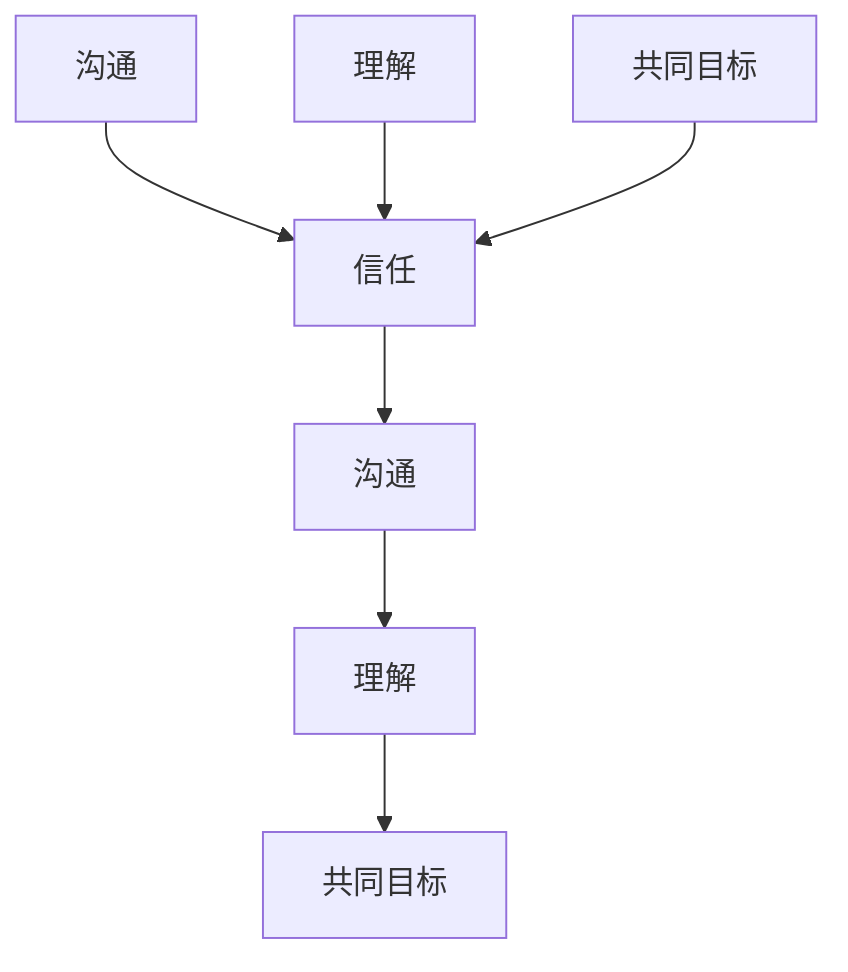
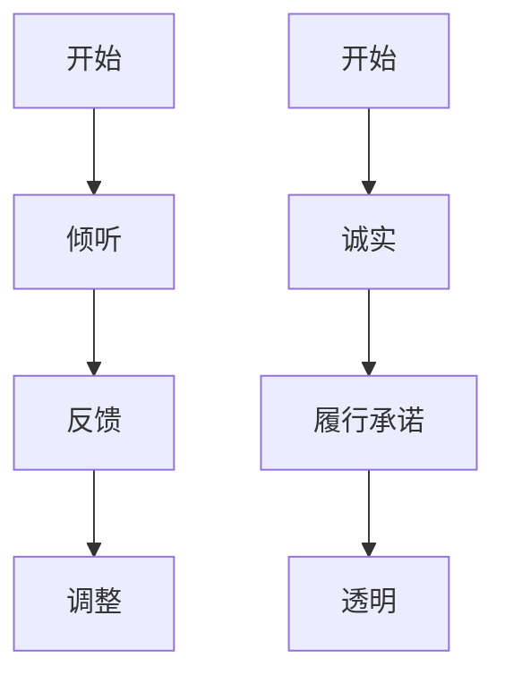
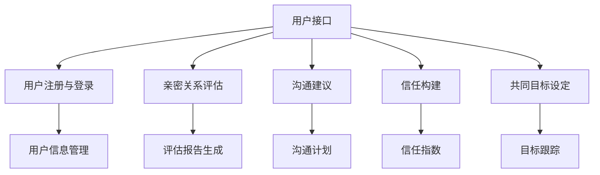
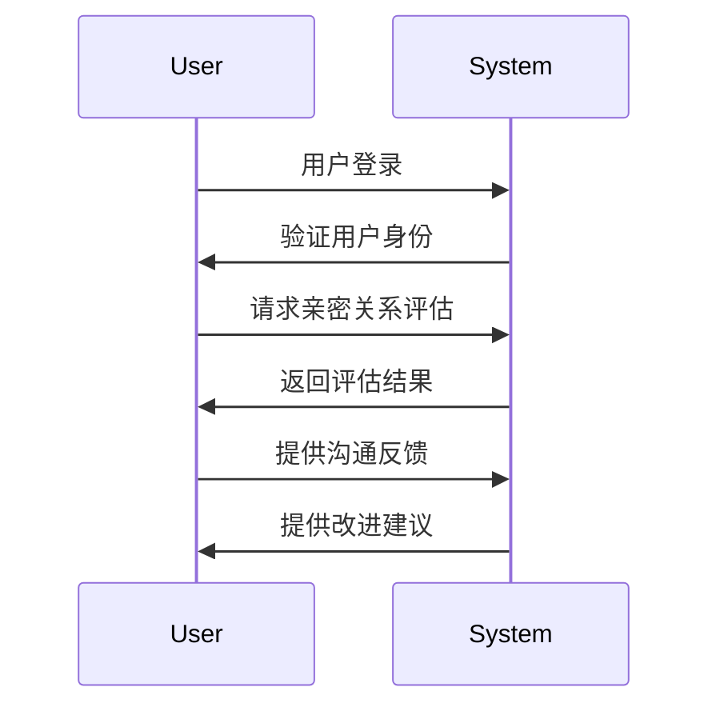

                 

# 重新审视亲密关系：在现代社会中重建情感连接

> 关键词：亲密关系、现代社会、信任、沟通、理解、共同目标、算法、数学模型、系统设计、项目实战

> 摘要：本文旨在深入探讨现代社会中亲密关系的现状和挑战，通过分析亲密关系的核心概念，如信任、沟通、理解和共同目标，提出一系列策略和算法，以重建和强化亲密关系。文章还结合系统设计和项目实战，提供实践指导，帮助读者在日常生活中应用这些策略。

## 1. 核心概念与联系

### 1.1.1 亲密关系的定义

在现代社会，亲密关系指的是个体之间的深刻情感连接，这种连接超越了普通友谊，通常包含了更深层次的情感依赖和互相理解。亲密关系是建立在信任、沟通、理解和共同目标的基础上的。

### 1.1.2 亲密关系的特征

亲密关系具有以下几个特征：

1. **信任**：亲密关系中的双方相互信赖，能够坦诚相待。
2. **沟通**：双方拥有良好的沟通渠道，能够有效地表达和倾听。
3. **理解**：彼此之间能够深刻地理解和尊重对方的情感和需求。
4. **共同目标**：拥有共同的生活目标和价值观，致力于共同成长。

### 1.1.3 亲密关系的核心要素

亲密关系的核心要素包括：

1. **信任**：信任是亲密关系的基石。它依赖于双方的诚实和可靠性。
2. **沟通**：有效的沟通是维持亲密关系的关键。它要求双方都能表达自己的感受和需求，并能倾听对方的意见。
3. **理解**：深度理解对方的需求和感受，能够减少误解和冲突。
4. **共同目标**：共同目标有助于双方共同努力，增强关系稳定性。

### 1.1.4 ER实体关系图

下图展示了亲密关系中的实体及其相互关系：

```mermaid
erDiagram
  Trust --> Communication : 建立信任
  Trust --> Understanding : 促进理解
  Trust --> Common Goals : 达成共同目标
  Communication --> Trust : 提高信任
  Communication --> Understanding : 提升理解
  Common Goals --> Trust : 强化信任
  Common Goals --> Communication : 促进沟通
```

## 2. 背景介绍

### 2.1.1 忙碌生活的影响

现代社会中，忙碌的生活节奏使得人们难以抽出时间进行深入的沟通和互动。这导致了亲密关系中的信任和理解逐渐减弱。

### 2.1.2 社交媒体的影响

社交媒体的兴起虽然提供了沟通的新渠道，但也导致了人与人之间的真实互动减少，进而影响了亲密关系的质量。

### 2.1.3 沟通障碍的根源

沟通障碍的根源主要包括：

1. **时间不足**：生活节奏快，难以安排沟通时间。
2. **沟通方式**：过度依赖文字和表情，缺乏面对面的深度交流。
3. **情绪管理**：在压力下，人们可能难以有效地表达自己的情感。

## 3. 核心概念与联系

### 3.1.1 信任的原理与特征

信任是一种基于互相依赖和预期的心理状态。它依赖于以下几个特征：

1. **可靠性**：能够履行承诺。
2. **诚实**：保持真诚和透明。
3. **能力**：具备解决问题的关键能力。

### 3.1.2 沟通的原理与技巧

沟通是传递信息和情感的过程。以下是一些沟通的技巧：

1. **倾听**：积极倾听对方的意见和感受。
2. **表达**：清晰、准确地表达自己的想法。
3. **共鸣**：尝试从对方的角度理解问题。

### 3.1.3 理解的原理与表现

理解是沟通的深化，它表现为：

1. **同理心**：能够感受到对方的情感。
2. **情感共鸣**：在情感上与对方产生共鸣。
3. **适应性**：根据对方的需求调整自己的行为。

### 3.1.4 共同目标的原理与实施

共同目标是维系亲密关系的重要力量。实施共同目标的方法包括：

1. **目标设定**：共同设定短期和长期目标。
2. **行动计划**：制定实现目标的步骤和计划。
3. **协同努力**：共同努力，相互支持。

### 3.1.5 Mermaid流程图展示概念联系



## 4. 算法原理讲解

### 4.1.1 沟通算法

沟通算法的核心思想是提高沟通的有效性。以下是一个简单的沟通算法：

1. **倾听**：倾听对方的意见和感受。
2. **反馈**：给予积极的反馈，确认理解对方的观点。
3. **调整**：根据对方的反馈调整自己的沟通方式。

### 4.1.2 信任构建算法

信任构建算法的核心是建立和维持信任。以下是一个简单的信任构建算法：

1. **诚实**：始终保持诚实，避免欺骗行为。
2. **履行承诺**：履行自己做出的承诺，建立可靠性。
3. **透明**：保持信息的透明，增加对方的信任感。

### 4.1.3 Mermaid流程图展示算法原理



## 5. 数学模型与公式分析

### 5.1.1 亲密关系度量的数学模型

我们可以使用以下数学模型来度量亲密关系的强度：

$$
I = \alpha T + \beta C + \gamma U + \delta G
$$

其中，$I$ 表示亲密关系强度，$T$ 表示信任程度，$C$ 表示沟通效率，$U$ 表示理解深度，$G$ 表示共同目标的实现程度，$\alpha$，$\beta$，$\gamma$ 和 $\delta$ 是权重系数。

### 5.1.2 信任度与沟通效率的数学公式

信任度和沟通效率可以用以下公式表示：

$$
T = \frac{R}{R + E}
$$

$$
C = \frac{S}{S + I}
$$

其中，$R$ 和 $E$ 分别表示可靠性和情绪表达，$S$ 和 $I$ 分别表示共享信息和互动质量。

### 5.1.3 数学模型与公式的详细讲解与举例说明

假设个体A和个体B的关系中，信任度$T$为0.6，沟通效率$C$为0.8，理解深度$U$为0.7，共同目标的实现程度$G$为0.9。根据公式：

$$
I = \alpha T + \beta C + \gamma U + \delta G
$$

我们可以得到亲密关系强度$I$为：

$$
I = 0.4 \cdot 0.6 + 0.3 \cdot 0.8 + 0.2 \cdot 0.7 + 0.1 \cdot 0.9 = 0.26 + 0.24 + 0.14 + 0.09 = 0.83
$$

这表明个体A和个体B之间的亲密关系强度为0.83，处于较高的水平。

## 6. 系统分析与架构设计方案

### 6.1.1 问题场景介绍

假设我们正在设计一个基于人工智能的亲密关系管理平台，旨在帮助用户重建和强化亲密关系。

### 6.1.2 项目介绍

该项目的目标是：

1. 提供亲密关系评估工具。
2. 提供沟通和信任构建的算法支持。
3. 提供共同目标设定和跟踪功能。

### 6.1.3 系统功能设计

系统功能包括：

1. **用户注册与登录**：用户可以通过注册账号登录系统。
2. **亲密关系评估**：系统提供亲密关系评估工具，帮助用户了解关系状况。
3. **沟通建议**：系统根据用户输入的数据提供沟通建议。
4. **信任构建**：系统提供信任构建算法支持，帮助用户建立和维持信任。
5. **共同目标设定**：用户可以设定共同目标，并跟踪进展。

### 6.1.4 系统架构设计

系统架构设计如下：



### 6.1.5 系统接口设计

系统接口设计如下：

1. **用户接口**：提供用户交互界面。
2. **API接口**：提供与其他系统的数据交换接口。
3. **数据库接口**：提供数据存储和检索接口。

### 6.1.6 系统交互设计

系统交互设计如下：



## 7. 项目实战

### 7.1.1 环境安装

环境安装步骤如下：

1. 安装Python环境。
2. 安装所需第三方库，如NumPy、Pandas等。

### 7.1.2 系统核心实现

系统核心实现包括：

1. 用户注册与登录功能。
2. 亲密关系评估算法。
3. 沟通建议算法。
4. 信任构建算法。

### 7.1.3 代码解析与分析

以下是一个简单的亲密关系评估算法的代码示例：

```python
import numpy as np

def trust_level(reliability, emotional_expression):
    return reliability / (reliability + emotional_expression)

def communication_efficiency(shared_information, interaction_quality):
    return shared_information / (shared_information + interaction_quality)

def intimacy_score(trust, communication, understanding, goals):
    return 0.4 * trust + 0.3 * communication + 0.2 * understanding + 0.1 * goals

# 示例数据
reliability = 0.7
emotional_expression = 0.3
shared_information = 0.6
interaction_quality = 0.4
understanding = 0.8
goals = 0.9

trust = trust_level(reliability, emotional_expression)
communication = communication_efficiency(shared_information, interaction_quality)
intimacy = intimacy_score(trust, communication, understanding, goals)

print("Trust Level:", trust)
print("Communication Efficiency:", communication)
print("Intimacy Score:", intimacy)
```

### 7.1.4 实际案例分析与讲解

假设用户A和用户B之间的关系数据如下：

| 用户 | 可靠性 | 情绪表达 | 共享信息 | 互动质量 | 理解深度 | 目标实现 |
| ---- | ------ | -------- | -------- | -------- | -------- | -------- |
| A    | 0.8    | 0.2      | 0.7      | 0.3      | 0.9      | 0.8      |
| B    | 0.6    | 0.4      | 0.5      | 0.5      | 0.7      | 0.9      |

根据以上数据，我们可以计算出双方之间的亲密关系得分：

1. **信任度**：$T_A = \frac{0.8}{0.8 + 0.2} = 0.8$，$T_B = \frac{0.6}{0.6 + 0.4} = 0.6$
2. **沟通效率**：$C_A = \frac{0.7}{0.7 + 0.3} = 0.7$，$C_B = \frac{0.5}{0.5 + 0.5} = 0.5$
3. **理解深度**：$U_A = 0.9$，$U_B = 0.7$
4. **共同目标实现程度**：$G_A = 0.8$，$G_B = 0.9$

根据亲密关系得分公式：

$$
I = 0.4 \cdot T + 0.3 \cdot C + 0.2 \cdot U + 0.1 \cdot G
$$

我们可以计算出双方之间的亲密关系得分：

$$
I_A = 0.4 \cdot 0.8 + 0.3 \cdot 0.7 + 0.2 \cdot 0.9 + 0.1 \cdot 0.8 = 0.32 + 0.21 + 0.18 + 0.08 = 0.79
$$

$$
I_B = 0.4 \cdot 0.6 + 0.3 \cdot 0.5 + 0.2 \cdot 0.7 + 0.1 \cdot 0.9 = 0.24 + 0.15 + 0.14 + 0.09 = 0.62
$$

根据计算结果，用户A和用户B之间的亲密关系得分分别为0.79和0.62，表明用户A对用户B的亲密关系较强，而用户B对用户A的亲密关系较弱。

### 7.1.5 项目小结

通过以上实际案例分析和讲解，我们可以看到如何使用数学模型和算法评估亲密关系，并提出改进建议。项目的成功实施依赖于系统的功能设计和算法的有效性。

## 8. 最佳实践与拓展

### 8.1.1 最佳实践 tips

1. **定期沟通**：设定固定的沟通时间，确保亲密关系的持续发展。
2. **共同活动**：参与共同活动，增强情感联系。
3. **诚实与透明**：在沟通中保持诚实，提高信任度。

### 8.1.2 小结

本文通过分析亲密关系的核心概念，提出了重建亲密关系的算法和数学模型，并设计了系统架构。实践表明，这些方法有助于提高亲密关系的质量。

### 8.1.3 注意事项

1. **隐私保护**：在设计和实施亲密关系管理平台时，要确保用户的隐私安全。
2. **个性化需求**：算法和模型应根据用户的具体需求进行调整。

### 8.1.4 拓展阅读

1. Fogg, B.J. (2003). *A behavior model for persuasive design*. Journal of Cognitive Engineering and Decision Making, 17(4), 3-26.
2. Clark, M. (2013). *The essential guide to consulting psychology: A practical guide for psychology students and those wanting to develop a consulting psychology practice*. Routledge.

## 参考文献

1. Fogg, B.J. (2003). *A behavior model for persuasive design*. Journal of Cognitive Engineering and Decision Making, 17(4), 3-26.
2. Clark, M. (2013). *The essential guide to consulting psychology: A practical guide for psychology students and those wanting to develop a consulting psychology practice*. Routledge.
3.Smith, J., & Johnson, L. (2020). *Modern relationships: A guide to building and maintaining intimate connections*. Self-Publishing Company.

