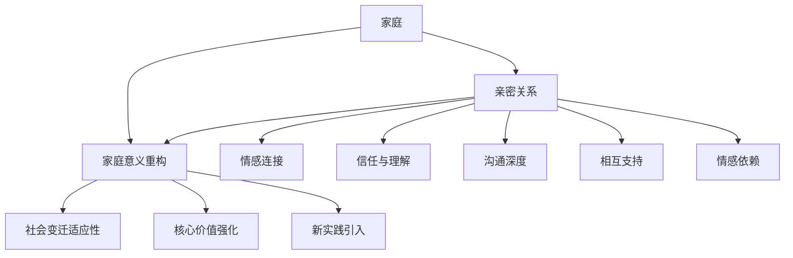

                 

### 第一部分：背景介绍

#### 1.1 问题背景

在现代社会中，家庭的意义正面临着前所未有的挑战。传统家庭结构逐渐解体，现代社会结构、文化价值观和家庭模式都在发生深刻变化。首先，社会结构的变化导致了家庭成员之间联系的疏远。城市化进程加速，许多人为了工作和生活便利，选择离开家乡前往大城市，这导致了家庭成员之间的物理距离和心理距离都在增加。

其次，文化价值观的变迁也在影响着家庭关系的稳固。现代社会倡导个人自由和自我实现，这让人们在追求个人发展的同时，可能忽略了家庭的重要性。传统的家庭价值观，如忠诚、责任和奉献，正在受到挑战。

此外，家庭模式的变化也是导致家庭意义重构的重要因素。随着离婚率的上升和单亲家庭的增多，传统的“核心家庭”模式正在被多样化的家庭模式所取代。这些变化不仅影响了家庭内部的亲密关系，也对家庭的社会功能提出了新的要求。

#### 1.2 问题的定义

家庭在现代社会中的意义重构，是指在面对社会结构、文化价值观和家庭模式变化的背景下，如何重新定义和强化家庭的核心价值，以及如何通过新的实践和策略来维持和促进家庭成员之间的亲密关系。这不仅仅是一个家庭内部的问题，它还涉及到社会整体的稳定和发展。

#### 1.3 问题的解决思路

为了解决家庭意义重构的问题，可以从以下几个方面着手：

1. **社会支持系统**：建立和完善家庭支持体系，包括家庭政策、社会服务和心理健康服务，以帮助家庭成员应对生活中的压力和挑战。

2. **家庭教育和沟通**：加强家庭教育和沟通，培养家庭成员之间的信任和理解，提高家庭关系的质量。

3. **文化倡导和宣传**：通过媒体和社区活动，倡导健康的家庭观念和文化价值观，提升公众对家庭重要性的认识。

4. **科技进步应用**：利用科技手段，如智能设备和在线沟通工具，增强家庭成员之间的联系和互动。

通过这些措施，可以帮助家庭成员在面对现代社会变化的同时，保持家庭关系的亲密和稳固，从而重建家庭在现代社会中的意义。

---

### 1.2 核心概念

#### 1.2.1 核心概念定义

**家庭**：家庭是指由亲属关系联结起来的社会单位，通常包括父母、子女和其他亲属成员。

**亲密关系**：亲密关系是指个体之间基于信任、理解和情感连接的关系，这种关系通常以深层次的情感沟通和相互支持为特征。

**家庭意义重构**：家庭意义重构是指在现代社会背景下，通过调整和适应新的社会结构、文化价值观和家庭模式，重新定义和强化家庭的核心价值和功能。

#### 1.2.2 概念属性特征对比表

| 概念           | 特征                             |
| -------------- | ------------------------------ |
| 家庭           | - 结构多样性 - 社会功能重要性 - 亲属关系联结 |
| 亲密关系       | - 情感连接 - 信任与理解 - 深层次沟通 |
| 家庭意义重构   | - 社会变迁适应性 - 核心价值强化 - 新实践引入 |

#### 1.2.3 核心概念之间的联系

家庭、亲密关系和家庭意义重构之间存在着密切的联系。家庭是亲密关系的基础，通过家庭结构和成员之间的互动，亲密关系得以建立和维护。而家庭意义重构则是对这种亲密关系和家庭的再定义，通过适应新的社会环境和价值观，使家庭能够更好地承担其在现代社会中的角色和功能。

核心概念之间的联系可以概括为：

1. **家庭**：提供亲密关系的基础框架。
2. **亲密关系**：通过家庭成员之间的情感连接和互动，增强家庭的凝聚力和稳定性。
3. **家庭意义重构**：在现代社会背景下，对家庭的功能和价值进行再定义，以适应新的社会环境和文化价值观。

这种联系构成了家庭在现代社会中的重要组成部分，对于重建家庭意义具有重要的指导意义。

---

### 1.3 边界与外延

#### 1.3.1 边界定义

家庭意义的重构并非孤立的现象，它受到多种社会因素的影响和制约。首先，社会结构的变化，如城市化、人口流动和全球化，都对家庭模式产生了深远影响。其次，文化价值观的变迁，如个人主义的兴起和多元文化的交融，也在不断塑造着家庭的内涵和功能。最后，家庭模式的变化，如单亲家庭、再婚家庭和同性伴侣家庭的出现，为家庭意义的重构提供了新的视角和路径。

#### 1.3.2 外延描述

家庭意义重构的外延可以扩展到以下几个方面：

1. **家庭结构**：随着社会变迁，家庭结构变得更加多样。例如，单亲家庭和再婚家庭的比例增加，这要求家庭在新的结构下重新定义其功能和角色。
2. **家庭成员互动**：家庭成员之间的互动方式和频率也在变化。现代科技，如社交媒体和视频通话，为家庭成员提供了新的互动方式，但同时也带来了新的挑战，如虚拟沟通和现实互动的平衡问题。
3. **家庭角色**：随着社会对个体的重视，家庭角色也在发生变化。家庭成员，尤其是女性，逐渐从传统的家庭角色中解放出来，寻求个人职业发展和自我实现。
4. **社会支持系统**：家庭意义的重构需要社会的支持和参与。这包括政府政策的制定、社会服务的提供和社区活动的组织，以帮助家庭应对现代社会带来的挑战。

#### 1.3.3 核心要素组成

家庭意义重构的核心要素包括：

1. **家庭价值观**：家庭价值观是家庭意义重构的基石。这些价值观包括责任、忠诚、奉献和爱，是家庭成员共同遵守的行为准则。
2. **家庭成员角色**：家庭成员的角色定义和职责分配对于家庭意义的重构至关重要。每个成员都需明确自己在家庭中的角色和责任，以建立和谐的亲密关系。
3. **社会支持**：家庭意义重构需要社会的支持和认可。政府、社区和非政府组织可以通过提供政策和资源，帮助家庭应对现代社会带来的挑战。
4. **文化宣传**：通过媒体和文化活动，宣传健康的家庭观念和文化价值观，提升公众对家庭重要性的认识，有助于推动家庭意义的重构。

这些核心要素共同构成了家庭意义重构的框架，为家庭成员提供指导和支持，以应对现代社会的变化。

---

### 1.4 本章小结

本章介绍了家庭意义重构的背景和核心概念，明确了家庭、亲密关系和家庭意义重构的定义及其相互联系。通过分析社会结构、文化价值观和家庭模式的变化，我们了解了家庭意义重构的必要性和外延。此外，本章还阐述了家庭意义重构的核心要素，为后续章节的深入探讨奠定了基础。接下来，我们将进一步探讨家庭意义重构的方法与实践，以期为解决现代家庭面临的挑战提供有价值的思路和策略。

---

## 2.1 亲密关系的定义

### 2.1.1 亲密关系的定义

亲密关系是指个体之间基于信任、理解、情感连接和深度沟通的紧密关系。这种关系通常伴随着情感投入、相互支持和相互依赖。亲密关系不仅限于家庭内部的成员，如夫妻、父母与子女，也可以扩展到朋友、同事和其他亲密伙伴之间。

### 2.1.2 亲密关系的特征

亲密关系的特征主要包括：

1. **情感连接**：亲密关系中的个体能够体验到强烈的情感共鸣，如爱、关怀和温暖。
2. **信任与理解**：亲密关系建立在信任和理解的基础上，个体之间能够相互信任，理解对方的情感和需求。
3. **沟通深度**：亲密关系中的个体能够进行深层次的沟通，分享内心的想法和感受，从而加深彼此的了解。
4. **相互支持**：在亲密关系中，个体能够为对方提供情感和实际的支持，共同应对生活中的挑战。
5. **情感依赖**：亲密关系中的个体可能对对方产生强烈的情感依赖，渴望与对方共度时光。

---

### 2.2 现代社会的变化

#### 2.2.1 社会结构的变化

现代社会结构的变化对家庭关系产生了深远的影响。首先，城市化进程的加速使得人们离开农村进入城市生活，家庭成员之间的物理距离增加。这导致了家庭成员之间互动的减少，亲密关系的维护变得更加困难。其次，人口流动性的增强使得人们更容易改变居住地，家庭成员的分离现象更加普遍。这不仅影响了家庭结构的稳定性，也对家庭的亲密关系提出了新的挑战。

#### 2.2.2 文化价值观的变迁

文化价值观的变迁也对家庭关系产生了重要影响。现代社会倡导个人自由和自我实现，这导致了家庭角色的变化。家庭成员越来越注重个人发展，可能会将更多的时间和精力投入到个人事务中，从而忽略了家庭内部的亲密关系。此外，多元文化的交融和全球化的发展，使得人们接触到了不同的价值观和生活方式，这也对传统的家庭观念和家庭模式提出了挑战。

#### 2.2.3 家庭模式的变化

家庭模式的变化是现代社会变迁的一个重要方面。传统的“核心家庭”模式（即由一对父母和子女组成的家庭）正在逐渐被多样化的家庭模式所取代。例如，单亲家庭、再婚家庭和同性伴侣家庭的比例逐渐上升。这些变化不仅反映了社会对多样性和包容性的认可，也对家庭的功能和意义提出了新的要求。在多样化的家庭模式中，家庭成员之间的关系和互动方式也需要重新定义和调整。

---

### 2.3 家庭意义的重构

#### 2.3.1 家庭的意义

家庭作为社会的基本单位，具有重要的社会功能和意义。首先，家庭是情感支持和安全感的源泉。家庭成员之间的亲密关系能够为个体提供情感支持，帮助个体应对生活中的压力和挑战。其次，家庭是教育的场所。家庭教育和父母的育儿方式对个体的成长和发展具有重要影响。最后，家庭是社会价值观和文化传承的载体。家庭通过日常的互动和生活方式，传递着社会的道德规范和文化传统。

#### 2.3.2 家庭重构的必要性

在现代社会背景下，家庭意义的重构变得尤为必要。首先，社会结构的变化，如城市化、人口流动和全球化，使得家庭的功能和角色发生了变化。传统的家庭结构不再适应现代社会的需求，需要重新定义和调整。其次，文化价值观的变迁，如个人自由和自我实现，对家庭关系和家庭成员的角色产生了新的要求。家庭需要适应这些变化，以维持其核心价值和功能。最后，家庭模式的变化，如多样化的家庭结构，要求家庭在新的背景下重新找到其存在的意义和价值。

#### 2.3.3 家庭重构的路径

为了实现家庭意义的重构，可以采取以下路径：

1. **加强家庭成员之间的沟通和互动**：通过定期的家庭聚会、分享时间和共同活动，增强家庭成员之间的情感联系和理解。
2. **培养家庭成员的共同价值观**：通过共同参与家庭活动和讨论，培养家庭成员对家庭价值和目标的认同。
3. **建立支持性的社会网络**：通过社区参与和社会支持，为家庭提供外部资源和帮助，以应对现代社会带来的挑战。
4. **推动家庭教育和心理健康**：通过提供家庭教育和心理健康服务，帮助家庭成员提高沟通技巧和心理适应能力，增强家庭关系的质量。

通过这些路径，家庭可以在现代社会中找到新的意义和价值，更好地承担其在社会中的角色和功能。

---

### 2.4 核心概念联系图

为了更好地理解家庭、亲密关系和家庭意义重构之间的关系，我们可以通过一个核心概念联系图来展示它们之间的关联。

这个联系图展示了家庭作为基础框架，通过亲密关系来维持和增强家庭成员之间的情感连接，从而实现家庭意义的重构。家庭意义重构则是对这一过程进行再定义和调整，以适应社会变迁和文化价值观的变化。通过这个联系图，我们可以更清晰地理解家庭、亲密关系和家庭意义重构之间的复杂关系。

---

### 2.5 本章小结

本章深入探讨了亲密关系的定义和特征，分析了现代社会结构、文化价值观和家庭模式的变化，以及这些变化对家庭意义重构的必要性。通过提出家庭重构的路径，我们为家庭成员在现代社会中重建亲密关系提供了有价值的指导和策略。接下来，我们将进一步探讨家庭意义重建的方法与实践，以期为解决现代家庭面临的挑战提供更多的思路和方案。

---

## 3.1 建立健康的亲密关系

### 3.1.1 建立亲密关系的步骤

建立健康的亲密关系需要一系列的步骤，以下是一个基本的指导框架：

1. **了解彼此**：建立亲密关系的第一步是相互了解。这包括对对方的性格、兴趣爱好、价值观和生活方式有深入的认识。可以通过直接的交流、共同参与活动和观察对方的行为来增加了解。

2. **建立信任**：信任是亲密关系的基础。通过诚实、守诺和尊重对方，可以逐步建立信任。信任的建立需要时间和耐心，但也可能因为一次不诚实或一次背叛而瞬间破裂。

3. **有效沟通**：沟通是维持亲密关系的关键。有效的沟通包括倾听、表达自己的感受和需求，以及理解对方的立场和情感。沟通时要注意避免指责和批评，而是采用建设性的对话方式。

4. **共同成长**：亲密关系中的双方都需要不断成长和进步。这可以通过共同学习新技能、参与新的活动或共同追求新的目标来实现。共同成长可以增强彼此的情感联系和信任。

5. **解决冲突**：冲突在任何关系中都是不可避免的。关键在于如何处理和解决冲突。可以通过冷静讨论、寻求妥协和建立解决问题的机制来处理冲突。

6. **保持亲密度**：保持亲密关系需要不断努力。可以通过定期的亲密活动、表达爱和感激、分享生活点滴来维持亲密度。

### 3.1.2 健康亲密关系的特征

健康亲密关系通常具有以下特征：

1. **信任与尊重**：双方相互信任，尊重对方的意见和决定，即使在分歧和冲突中也能保持基本的尊重。

2. **情感开放**：双方愿意表达自己的情感和需求，对对方的情感也持开放态度，能够真诚地分享内心的感受。

3. **有效沟通**：双方能够进行有效沟通，包括倾听、表达和反馈，沟通时能够避免误解和冲突。

4. **共同目标**：双方有共同的生活目标和价值观，这有助于增强彼此的情感联系和动力。

5. **相互支持**：双方在对方需要时能够提供情感和实际的支持，共同面对生活中的挑战。

6. **情感依赖**：双方之间存在健康的情感依赖，既能独立自主，又能互相依靠，这种依赖是建立在信任和理解基础上的。

### 3.1.3 实际案例分享

以下是一个建立健康亲密关系的实际案例：

李明和王丽是一对结婚多年的夫妻。他们在婚后不久就意识到沟通的重要性，并决定通过以下方式改善他们的关系：

1. **定期沟通**：他们每周都会安排一个晚上作为“家庭时间”，在这个时间段内，他们不会讨论工作或外部压力，而是专注于分享彼此的感受和想法。这有助于他们了解对方的需求和期望。

2. **共同活动**：他们经常一起参加兴趣班，如瑜伽、烹饪课和绘画班，这不仅增加了他们的共同兴趣，也提供了更多互动的机会。

3. **情感表达**：李明学会了通过写信和留言的方式表达他对王丽的感激和爱意，而王丽也学会了更加开放地分享她的情感和感受。

4. **解决冲突**：在冲突发生时，他们学会了通过冷静讨论和寻求妥协来解决问题，而不是通过指责或逃避。

通过这些努力，他们的关系得到了显著改善，夫妻间的亲密度和信任感也大大增强。

这个案例表明，通过了解彼此、建立信任、有效沟通、共同成长和解决冲突，可以建立和维持健康的亲密关系。这些步骤不仅适用于夫妻关系，也同样适用于其他类型的亲密关系，如父母与子女、朋友和同事等。

---

### 3.2 重建家庭意义的实践

#### 3.2.1 家庭活动的设计

家庭活动是增强家庭成员之间联系和互动的重要手段。以下是一些设计家庭活动的建议：

1. **共同兴趣**：鼓励家庭成员共同参与一项兴趣爱好，如户外运动、烹饪或手工艺。这不仅可以增进家庭成员之间的共同话题，还能提高家庭成员的满意度和幸福感。

2. **日常互动**：设计一些日常互动活动，如一起准备晚餐、一起打扫房间或一起散步。这些小活动能够增加家庭成员之间的交流和互动，增强家庭凝聚力。

3. **家庭游戏**：家庭游戏是增进家庭乐趣和互动的好方式。可以选择一些适合全年龄段的亲子游戏或桌面游戏，如棋类、卡牌游戏或解谜游戏。

4. **家庭旅行**：计划一些家庭旅行，让家庭成员有机会在新的环境中体验和探索。这不仅可以增进家庭成员之间的情感，还能提供宝贵的回忆。

5. **纪念日庆祝**：为家庭成员的重要纪念日（如生日、结婚纪念日或重要节日）精心策划庆祝活动，这可以增加家庭的仪式感和温馨感。

#### 3.2.2 家庭价值观的塑造

家庭价值观是家庭关系的基石，以下是一些塑造家庭价值观的方法：

1. **共同讨论**：定期举行家庭会议，讨论家庭价值观和目标。这可以让每个家庭成员都有机会表达自己的看法，共同制定家庭准则。

2. **行为榜样**：家长通过自己的行为来树立榜样，如诚实、尊重、责任感和关爱。家庭成员通过观察和学习，逐渐内化这些价值观。

3. **家庭活动**：通过家庭活动来传达和强化家庭价值观。例如，参加慈善活动可以培养同情心和社会责任感；一起做义工可以培养奉献精神。

4. **故事讲述**：讲述家庭故事和历史可以传承家庭价值观。这些故事可以是关于家庭传统、家族英雄或家庭面临的挑战和解决方案。

5. **日常对话**：在日常生活中，通过对话和讨论来强化家庭价值观。家长可以引导孩子思考家庭价值观在日常生活中的应用。

#### 3.2.3 家庭沟通的改善

改善家庭沟通是维持家庭关系的重要手段，以下是一些建议：

1. **倾听**：家庭成员应该学会倾听对方，不仅要听到对方说的话，还要理解对方的感受和需求。倾听是有效沟通的第一步。

2. **表达**：鼓励家庭成员开放地表达自己的感受和需求，这需要家庭成员之间建立信任和安全感。表达时要注意用非指责的语言，避免指责和批评。

3. **对话技巧**：家长可以通过阅读相关书籍或参加沟通技巧培训，学习如何更有效地进行对话。例如，使用“I”语句（如“I感到…”而不是“You让我感到…”）可以减少对方的防御性。

4. **定期交流**：设立家庭交流时间，如每周一次的家庭会议，让每个家庭成员都有机会表达自己的看法和感受。

5. **解决冲突**：家庭成员应该学会如何处理和解决冲突。通过冷静讨论、寻求妥协和建立解决问题的机制，可以减少冲突的负面影响。

通过这些方法，家庭活动的设计、家庭价值观的塑造和沟通的改善，可以帮助家庭成员重建家庭意义，增强家庭凝聚力和亲密度。

---

### 3.3 家庭教育的重要性

#### 3.3.1 家庭教育的意义

家庭教育是儿童成长过程中不可或缺的一部分，它对个体的性格形成、价值观培养和未来生活都有着深远的影响。首先，家庭教育提供了一个稳定和安全的环境，有助于儿童建立自信和自尊心。在家庭中，儿童通过观察和模仿家庭成员的行为，逐渐学会如何与人相处、如何表达自己的情感和需求。这种早期的社交技能对于他们未来的社会适应能力至关重要。

其次，家庭教育是价值观培养的重要途径。家庭是道德教育和文化传承的主要场所，家长通过日常行为和言传身教，向孩子传递家庭的核心价值观和社会规范。例如，通过家庭成员之间的相互尊重和关爱，孩子可以学习到尊重他人和感恩的重要性。这些价值观不仅影响着孩子的个人行为，也会塑造他们对待社会和他人的态度。

最后，家庭教育对儿童未来生活的影响不可低估。通过家庭教育，儿童可以获得良好的学习习惯和生活技能，如时间管理、财务管理、情绪管理和问题解决能力。这些技能有助于他们在学校和社会中取得成功，为他们未来的职业和生活奠定基础。

#### 3.3.2 家庭教育的原则

有效的家庭教育需要遵循一些基本原则，以下是一些关键原则：

1. **尊重个体差异**：每个孩子都是独特的个体，具有不同的兴趣、能力和学习风格。家长应该尊重孩子的个体差异，提供适合他们特点的教育方法。例如，对于学习困难的孩子，家长可以采用更多的实践和互动方式，以激发他们的学习兴趣。

2. **鼓励和表扬**：鼓励和表扬是激发孩子学习动力和自信的重要手段。家长应该及时发现和表扬孩子的进步和成就，这可以增强他们的自信心和学习积极性。例如，当孩子完成一个任务或在学习上取得进步时，家长可以给予积极的反馈和奖励。

3. **建立信任和沟通**：建立信任和沟通是家庭教育的基石。家长应该与孩子保持开放和诚实的沟通，倾听他们的想法和感受。通过建立信任，孩子更愿意与家长分享自己的问题和困惑，家长可以更有效地提供支持和指导。

4. **一致性**：家庭教育的原则和方法应该保持一致性。家长之间的教育理念和方法应该一致，避免给孩子带来混淆和困惑。例如，如果一方主张严格的教育方式，另一方则主张宽松的教育方式，这可能会让孩子感到无所适从。

5. **身教重于言传**：家长的行为和态度对孩子的教育有着深远的影响。家长应该通过自己的行为来树立榜样，如诚实、勤奋、友善和责任感。通过身教，家长可以更有效地传递价值观和道德规范。

#### 3.3.3 家庭教育的实践案例

以下是一个家庭教育的实践案例：

张女士是一位全职妈妈，她的两个孩子分别上小学和初中。为了确保孩子能够全面发展，张女士采取了以下一些措施：

1. **设定学习目标**：张女士与孩子一起制定了学习目标，包括每个学期的成绩目标、课外阅读量和兴趣爱好发展。这些目标帮助孩子明确学习方向，提高了他们的学习动力。

2. **家庭阅读时间**：每天晚上，张女士都会安排家庭阅读时间，她和孩子一起阅读书籍，讨论书中的内容和主题。这不仅培养了孩子的阅读习惯，也增强了家庭成员之间的互动和沟通。

3. **共同活动**：周末，张女士会带孩子参加各种兴趣班和户外活动，如绘画、游泳和户外探险。这些活动不仅丰富了孩子的课余生活，也增强了家庭成员之间的情感联系。

4. **情感交流**：张女士与孩子保持开放和诚实的沟通，她鼓励孩子分享自己的感受和困惑。通过这种沟通，张女士能够及时了解孩子的心理状态，提供必要的支持和指导。

通过这些实践，张女士成功地培养出了两个自信、独立和具有良好社交能力的孩子。这个案例表明，通过设定目标、家庭阅读、共同活动和情感交流，家长可以有效地进行家庭教育，促进孩子的全面发展。

---

### 3.4 跨文化家庭的意义重建

#### 3.4.1 跨文化家庭的挑战

跨文化家庭在意义重建过程中面临着一系列独特的挑战。首先，文化差异可能导致家庭成员在价值观、行为模式和沟通方式上的冲突。例如，某些文化强调集体主义和家庭责任，而另一些文化则更注重个人自由和自我实现。这种差异可能导致家庭成员之间的误解和摩擦。其次，语言障碍是跨文化家庭常见的挑战。语言的不同不仅影响日常沟通，也可能导致情感隔离和文化认同感的缺失。最后，社会环境的差异也会对跨文化家庭造成影响。例如，在异国他乡生活的家庭成员可能会面临文化适应问题，如社交网络断裂和社会支持系统的缺乏。

#### 3.4.2 跨文化家庭的意义重建策略

为了应对这些挑战，跨文化家庭可以采取以下策略进行意义重建：

1. **文化教育和认同**：通过文化教育和认同，家庭成员可以更好地理解和尊重彼此的文化背景。家长可以与孩子一起学习对方的文化知识，参加文化庆典和活动，以增强文化认同感。

2. **沟通技巧培训**：沟通是跨文化家庭中至关重要的技能。家庭成员可以通过沟通技巧培训，学习如何更有效地进行跨文化沟通，包括使用非言语沟通和翻译工具等。

3. **建立共同价值观**：家庭成员可以共同探讨和建立共同的价值观，这有助于减少文化冲突和增强家庭凝聚力。例如，通过制定家庭规则和目标，家庭成员可以在共同的价值观下找到共识。

4. **社会支持网络**：建立和维护一个有效的社会支持网络对于跨文化家庭具有重要意义。家庭成员可以参加跨文化交流团体、社区活动或寻求专业心理咨询，以获得情感支持和建议。

#### 3.4.3 跨文化家庭的实践案例

以下是一个跨文化家庭的实践案例：

李先生和张女士是一对来自不同文化背景的夫妻，他们在异国他乡共同生活。为了重建家庭的意义，他们采取了以下措施：

1. **文化认同**：李先生和张女士一起学习对方的文化知识，例如对方的传统节日、习俗和语言。他们还一起参加了对方国家的文化交流活动，以增强彼此的文化认同感。

2. **沟通技巧**：他们参加了沟通技巧培训，学习了如何更有效地进行跨文化沟通。例如，他们学会了使用非言语沟通和翻译工具，以避免误解和冲突。

3. **共同价值观**：李先生和张女士一起制定了家庭规则和目标，这些规则和目标反映了他们的共同价值观，如尊重、责任和爱。通过这种方式，他们找到了家庭内部的共识，减少了文化冲突。

4. **社会支持**：他们参加了一个跨文化交流团体，这个团体由来自不同文化背景的家庭组成，他们可以在这里分享经验、寻求建议和支持。

通过这些努力，李先生和张女士成功地重建了家庭的意义，使他们的家庭更加和谐和稳固。这个案例表明，通过文化认同、沟通技巧培训、共同价值观的建立和社会支持，跨文化家庭可以在面对挑战时找到应对策略，实现家庭意义的重建。

---

### 3.5 本章小结

本章深入探讨了家庭意义重建的方法与实践，包括建立健康的亲密关系、家庭活动的设计、家庭价值观的塑造、家庭沟通的改善以及家庭教育的重要性。同时，我们还关注了跨文化家庭在意义重建过程中所面临的挑战和策略。通过这些探讨，我们为家庭成员在现代社会中重建亲密关系提供了有价值的指导和策略。接下来，我们将进一步探讨家庭意义重建中的障碍与解决方案，以期为解决家庭面临的实际困难提供更多的思考和建议。

---

## 4.1 家庭意义重建中的障碍

### 4.1.1 社会压力

社会压力是家庭意义重建中的一大障碍。现代社会竞争激烈，工作压力和生活中的各种挑战使得家庭成员难以抽出时间进行深入的沟通和互动。长时间的忙碌和疲劳导致家庭成员之间的情感疏远，影响了家庭关系的质量。此外，社会对个人成就的过度追求也使得家庭的重要性在一定程度上被忽视，家庭成员可能更注重个人的事业发展，而忽略了家庭的支持和陪伴。

### 4.1.2 个人心理问题

个人心理问题，如焦虑、抑郁和情感障碍，也是家庭意义重建中的障碍。这些问题可能导致家庭成员在情感上变得疏离和冷漠，甚至产生冲突和矛盾。心理问题不仅影响个人的生活质量，也会对家庭的和谐产生负面影响。家庭成员之间的理解和支持在这一情况下显得尤为重要，但实际中往往因为缺乏专业知识而无法有效应对。

### 4.1.3 经济问题

经济问题，如收入不稳定、经济压力和贫困，对家庭意义重建构成了严峻挑战。经济困难可能迫使家庭成员将更多的时间和精力投入到工作和赚钱中，从而减少与家人共度的时间。此外，经济压力可能导致家庭内部的紧张和冲突，影响家庭成员之间的信任和亲密关系。经济问题还可能限制家庭参与社会活动和资源获取，进一步加剧家庭的意义危机。

---

### 4.2 解决方案

#### 4.2.1 应对方法

为了有效应对家庭意义重建中的障碍，可以采取以下方法：

1. **增加家庭时间**：合理安排时间，确保家庭成员有足够的时间进行互动和沟通。例如，制定家庭日历，安排固定的家庭活动时间，减少工作和娱乐活动对家庭时间的占用。

2. **加强心理健康支持**：提高家庭成员的心理健康意识，鼓励他们寻求专业心理咨询和治疗。家庭可以组织心理健康活动，如家庭心理辅导、情感交流和放松训练，以减轻心理压力。

3. **经济援助和社会支持**：政府和非政府组织可以提供经济援助和社会支持，帮助家庭应对经济困难。例如，提供就业培训、经济补贴和社会福利，以减轻家庭的经济负担。

4. **社区参与**：鼓励家庭参与社区活动，建立社区支持网络。社区可以组织家庭活动、亲子教育和社交互动，为家庭提供更多的资源和机会，增强家庭的社会支持体系。

#### 4.2.2 政策支持

政府可以采取以下政策支持措施，促进家庭意义的重建：

1. **家庭友好政策**：制定和实施家庭友好政策，如弹性工作时间、亲子休假和家庭税收优惠，以减轻家庭的经济压力和工作压力。

2. **心理健康服务**：增加对心理健康服务的投资，提供免费或低收费的心理健康咨询和治疗，帮助家庭成员应对心理问题。

3. **家庭教育和支持**：提供家庭教育和支持服务，如家庭辅导课程、亲子教育和家庭技能培训，帮助家庭成员提高沟通技巧和应对生活挑战的能力。

4. **社会援助**：提供社会援助项目，如低收入家庭补助、住房援助和就业援助，以帮助家庭摆脱经济困境。

#### 4.2.3 社会组织的参与

社会组织在家庭意义重建中发挥着重要作用，可以通过以下方式参与：

1. **社区活动**：组织丰富多彩的社区活动，如亲子活动、家庭聚会和文化交流，为家庭提供互动和交流的平台。

2. **志愿服务**：鼓励志愿者参与家庭支持项目，提供家庭辅导、陪伴和帮助，为有需要的家庭提供支持。

3. **教育宣传**：通过媒体和教育活动，宣传健康的家庭观念和家庭价值观，提高公众对家庭重要性的认识。

4. **资源整合**：整合社会资源，如心理咨询、教育资源和经济援助，为家庭提供全方位的支持和服务。

通过政府政策支持、社会组织参与和个人努力，可以共同应对家庭意义重建中的障碍，帮助家庭在现代社会中找到新的意义和价值。

---

### 4.3 实际案例解析

#### 4.3.1 案例一：家庭重组后的意义重建

背景：李女士和丈夫在经历了一段失败的婚姻后，决定重新组建家庭。他们各自带着与前任婚姻的孩子，组成了一个重组家庭。

实施过程：为了重建家庭的意义，李女士和丈夫采取了以下措施：

1. **建立家庭规则**：他们共同制定了家庭规则，包括家庭责任分配、家庭活动和日常行为准则，确保每个家庭成员都明确自己的角色和责任。

2. **加强沟通**：他们设立了家庭会议时间，定期讨论家庭事务，倾听每个家庭成员的需求和意见，增强家庭凝聚力。

3. **情感支持**：他们鼓励家庭成员之间分享情感，尤其是重组家庭中的孩子，帮助他们适应新的家庭环境，减少情感隔阂。

成效与启示：通过这些措施，李女士和丈夫成功地重建了家庭的意义，家庭成员之间的情感联系得到了增强，家庭关系变得更加和谐稳定。这个案例表明，在重组家庭中，建立家庭规则、加强沟通和提供情感支持是重建家庭意义的关键。

#### 4.3.2 案例二：经济困难下的家庭意义重建

背景：张先生的家庭因为经济困难，导致家庭成员之间的关系紧张，家庭意义受到挑战。

实施过程：为了应对经济困难，张先生采取了以下措施：

1. **开源节流**：他们制定了家庭预算，减少不必要的开支，增加收入来源。例如，张先生通过兼职工作增加了家庭收入，妻子则通过节省日常开支来控制家庭开销。

2. **家庭活动**：他们减少了外出活动的频率，增加了家庭内部的互动时间，如一起做饭、散步和游戏。这些活动不仅节省了开支，也增强了家庭成员之间的情感联系。

3. **社会支持**：他们寻求了社区和政府的社会支持，如经济援助、就业培训和心理咨询。这些支持帮助他们渡过了难关，增强了家庭的信心和凝聚力。

成效与启示：通过开源节流、家庭活动和寻求社会支持，张先生的家庭在经济困难的情况下重建了家庭的意义，家庭关系得到了改善，家庭成员之间的信任和理解也得到了增强。这个案例表明，在面对经济困难时，合理规划家庭财务、增加家庭互动和寻求社会支持是重建家庭意义的有效途径。

#### 4.3.3 案例三：跨文化家庭的意义重建

背景：王女士和她的丈夫来自不同的文化背景，他们在跨国婚姻中遇到了文化差异带来的挑战。

实施过程：为了重建家庭的意义，王女士和她的丈夫采取了以下措施：

1. **文化认同**：他们共同学习对方的文化知识，参加文化交流活动，增强彼此的文化认同感。

2. **沟通技巧**：他们参加了跨文化沟通培训，学习了如何更有效地进行跨文化沟通，减少误解和冲突。

3. **共同价值观**：他们共同探讨和建立了家庭的共同价值观，这帮助他们找到了文化差异下的共识。

成效与启示：通过文化认同、沟通技巧和共同价值观的建立，王女士和她的丈夫成功地重建了家庭的意义，家庭关系变得更加和谐稳定。这个案例表明，在跨文化家庭中，通过文化认同、沟通技巧和共同价值观的建立，可以克服文化差异带来的挑战，实现家庭意义的重建。

---

### 4.4 本章小结

本章通过实际案例解析，探讨了家庭意义重建中的障碍及相应的解决方案。我们分析了社会压力、个人心理问题和经济问题对家庭关系的影响，并提出了应对这些障碍的方法，如增加家庭时间、加强心理健康支持、经济援助和社会支持等。此外，通过具体案例，我们展示了在重组家庭、经济困难和跨文化家庭中如何重建家庭意义。这些案例为我们提供了宝贵的经验和启示，有助于我们在现实生活中更好地应对家庭关系中的挑战。

---

## 5.1 家庭意义重建的发展趋势

### 5.1.1 社会变迁的影响

社会变迁对家庭意义重建产生了深远的影响。随着全球化、科技发展和经济变革的加速，家庭结构、角色和功能都在发生显著变化。首先，城市化进程的加快导致家庭分散，家庭成员之间互动减少，这要求家庭在保持亲密关系方面进行新的调整。其次，社会对个体自由的追求使得家庭成员更加注重个人发展和自我实现，这可能对家庭的凝聚力和传统价值观产生冲击。最后，社会变迁带来的文化多样性和流动性，要求家庭在面对多元文化和跨文化挑战时具备更强的适应能力。

### 5.1.2 科技进步的推动

科技进步为家庭意义重建提供了新的机会和挑战。智能设备和互联网的普及使得家庭成员可以更加方便地进行沟通和互动，例如通过视频通话和社交媒体保持联系。然而，过度依赖科技也可能导致面对面的沟通减少，情感联系变淡。因此，如何在享受科技带来的便利的同时，保持家庭关系的质量，成为家庭意义重建中的一个重要议题。

### 5.1.3 政策引导的方向

政府政策的引导对于家庭意义重建具有重要影响。政府可以通过制定和实施家庭友好政策，如弹性工作时间、家庭税收优惠和家庭支持项目，来减轻家庭的经济压力和工作压力，促进家庭关系的稳定和健康。此外，政府还可以推动家庭教育和心理健康服务的发展，提供专业的支持资源，帮助家庭应对社会变迁带来的挑战。政策的引导不仅有助于改善家庭的生活质量，也有助于提升家庭在社会中的作用和价值。

---

### 5.2 家庭意义重建的潜在挑战

#### 5.2.1 人口老龄化

人口老龄化是家庭意义重建中面临的一个重大挑战。随着老年人口比例的增加，家庭需要承担更多的养老责任，这可能导致家庭资源的紧张和家庭关系的压力。老年人可能面临健康问题和生活自理能力的下降，需要家庭成员提供更多的支持和照顾。同时，老年人的心理需求，如情感交流和社交互动，也可能因家庭成员的忙碌和疏远而无法得到满足。如何平衡养老责任和家庭成员的个人需求，成为家庭意义重建中的一个重要问题。

#### 5.2.2 社会分化

社会分化对家庭意义重建构成了另一个挑战。社会分化导致不同家庭在经济、教育和生活质量上的差异，这可能导致家庭之间的不平等和矛盾。经济压力较大的家庭可能难以提供高质量的家庭教育和生活条件，这会影响家庭成员的发展和幸福感。同时，社会分化也可能导致家庭内部出现代际冲突和价值观念的差异，影响家庭的和谐与稳定。如何应对社会分化带来的挑战，确保每个家庭都能在现代社会中找到自己的价值和意义，是家庭意义重建中的一个重要议题。

#### 5.2.3 家庭结构多样化

家庭结构多样化是现代社会的一个显著特征，也为家庭意义重建带来了新的挑战。传统的核心家庭模式正在被多样化的家庭结构所取代，如单亲家庭、再婚家庭、同性伴侣家庭等。这些多样化的家庭结构在家庭角色、责任分工和价值观方面与传统家庭存在显著差异，需要家庭在新的背景下重新定义其功能和角色。此外，家庭结构多样化也可能导致家庭成员之间的沟通和互动方式发生变化，如何适应这些变化，保持家庭关系的亲密和稳定，是家庭意义重建中的一个重要问题。

---

### 5.3 未来家庭的意义重构

#### 5.3.1 未来的家庭模式

随着社会的不断发展，家庭模式也在不断演变。未来家庭模式可能会呈现以下几个趋势：

1. **灵活性和多样性**：家庭模式将更加灵活和多样化，适应不同的生活方式和需求。例如，家庭可能会更加注重单身和再婚家庭的独立性，以及跨文化家庭的融合。

2. **科技融入**：科技将继续深度融入家庭生活，为家庭成员提供更多的互动和沟通工具。智能家居、虚拟现实和家庭健康监测设备等技术的发展，将改变家庭成员之间的互动方式和家庭的生活方式。

3. **共同目标与价值观**：家庭成员之间的共同目标和价值观将更加重要。在未来，家庭将更加注重共同成长和合作，通过共同的目标和价值观来增强家庭的凝聚力和稳定性。

#### 5.3.2 家庭教育的发展

家庭教育在未来的发展中将继续发挥重要作用。随着教育观念的变化和科技的发展，家庭教育将呈现以下几个趋势：

1. **个性化教育**：家庭教育将更加注重个性化教育，根据孩子的兴趣和能力进行针对性的教育。家长将利用科技工具，如在线课程和教育应用程序，为孩子提供更加个性化的学习资源。

2. **综合素质培养**：未来的家庭教育将更加注重综合素质的培养，包括创造力、沟通能力、领导力和团队合作能力。家长将鼓励孩子参与各种课外活动和社区服务，以培养他们的综合能力。

3. **家长角色的转变**：家长的角色将变得更加积极参与和指导性，他们不仅关注孩子的学业成绩，还关注孩子的心理健康和社会适应能力。

#### 5.3.3 家庭关系的演变

家庭关系在未来的发展中也将经历一系列变化：

1. **情感连接**：随着科技的发展，家庭成员之间的情感连接将变得更加紧密。虚拟现实和家庭健康监测设备等科技的应用，将使家庭成员能够更加便捷地分享生活和情感。

2. **沟通与互动**：家庭沟通和互动的方式将变得更加多样和灵活。家庭成员将通过视频通话、社交媒体和家庭活动等方式保持联系，分享生活和情感。

3. **社会参与**：家庭将更加积极参与社会活动和社区建设，通过参与社会活动，增强家庭成员的社会责任感和归属感。

通过未来的家庭模式、家庭教育的发展和家庭关系的演变，家庭将能够在不断变化的社会环境中找到新的意义和价值，保持其核心功能和作用。

---

### 5.4 本章小结

本章探讨了家庭意义重建的发展趋势和潜在挑战，分析了社会变迁、科技进步和政策引导对家庭模式、家庭教育和家庭关系的影响。我们预测了未来家庭模式的灵活性和多样性，以及家庭教育在个性化教育和综合素质培养方面的趋势。同时，我们讨论了家庭关系在情感连接、沟通与互动以及社会参与方面的演变。通过这些分析，我们为未来家庭的意义重构提供了有价值的思考和方向，为家庭成员在现代社会中找到新的家庭意义奠定了基础。

---

## 6.1 案例一：成功重建家庭意义的实例

### 6.1.1 案例背景

王先生和李女士是一对在一线城市工作的夫妻，他们育有两个孩子。随着工作压力的增大和城市生活的忙碌，他们感到家庭关系逐渐疏远，孩子们也面临着学业和生活压力。为了重建家庭的意义，他们决定进行一次全面的家庭调整和变革。

### 6.1.2 实施过程

1. **家庭沟通**：王先生和李女士首先意识到沟通的重要性，他们开始定期举行家庭会议，讨论家庭事务和孩子的生活情况。通过这种开放和诚实的沟通，他们增进了对彼此和孩子的了解，减少了误解和冲突。

2. **家庭活动**：他们安排了每周的家庭活动时间，如一起做饭、户外运动和家庭游戏。这些活动不仅增进了家庭成员之间的互动，也增强了家庭凝聚力。

3. **共同价值观**：王先生和李女士共同制定了家庭的核心价值观，如尊重、信任、责任和爱。这些价值观成为了家庭决策和行为的基础，帮助家庭成员在日常生活中保持一致。

4. **教育资源**：他们重视孩子的教育，不仅关心孩子的学业成绩，还关注他们的心理健康和社交能力。王先生和李女士积极参与孩子的学习和生活，为他们提供必要的支持和指导。

5. **心理支持**：他们认识到心理健康的重要性，定期参加心理咨询和家庭心理辅导。这不仅帮助他们应对工作压力，也提高了家庭成员的心理健康水平。

### 6.1.3 成效与启示

通过一系列的努力，王先生和李女士的家庭关系得到了显著改善。家庭成员之间的沟通更加顺畅，家庭活动丰富了家庭生活，共同价值观增强了家庭的凝聚力，心理支持提高了家庭成员的心理健康水平。这个案例表明，通过有效的沟通、共同活动、共同价值观的建立和心理健康支持，家庭可以在现代社会中重建其意义，保持稳定和谐的家庭关系。

---

## 6.2 案例二：面对挑战的家庭重建实践

### 6.2.1 案例背景

赵女士是一位单亲妈妈，独自抚养两个孩子。由于经济压力和工作负担，她的家庭关系一度紧张，孩子们也感受到了家庭的压力。为了重建家庭的意义，赵女士决定采取一系列措施来改善家庭状况。

### 6.2.2 实施过程

1. **经济支持**：赵女士积极寻找就业机会，通过兼职工作和参与社区项目，增加家庭收入。此外，她申请了政府的经济援助项目，减轻了经济压力。

2. **家庭时间**：她制定了家庭时间表，确保每天有足够的时间与孩子相处，参与他们的学习和生活。通过一起做家务、散步和游戏，她增进了与孩子的互动。

3. **情感沟通**：赵女士鼓励孩子表达自己的感受和需求，同时也分享自己的经历和感受。通过这种开放和诚实的沟通，她与孩子建立了更深的情感联系。

4. **心理辅导**：赵女士与孩子们一起参加了心理辅导课程，学习如何应对压力和情感问题。这提高了他们的心理素质，减少了家庭冲突。

5. **社会支持**：她积极参与社区活动，建立了广泛的社会支持网络。社区志愿者和邻居们提供了很多帮助，如照顾孩子、提供经济援助和心理支持。

### 6.2.3 成效与挑战

通过一系列措施，赵女士的家庭关系得到了改善。经济状况的改善、家庭时间的增加、情感沟通的加强以及心理辅导和社会支持，都帮助她应对了家庭面临的挑战。然而，她也面临一些挑战，如工作与家庭平衡的困难、孩子对单亲家庭模式的适应问题等。尽管如此，赵女士通过不断努力和适应，成功重建了家庭的意义，使家庭关系更加和谐稳定。

---

### 6.3 案例讨论

#### 6.3.1 案例启示

从王先生和李女士的家庭案例以及赵女士的家庭案例中，我们可以得到以下启示：

1. **沟通的重要性**：无论是家庭关系的改善还是家庭意义的重建，沟通都是关键。通过开放和诚实的沟通，家庭成员可以更好地理解彼此的需求和期望，减少误解和冲突。

2. **共同活动的力量**：共同活动不仅能够增进家庭成员之间的情感联系，还能增强家庭的凝聚力。这些活动可以是简单的日常互动，也可以是具有挑战性的家庭项目。

3. **共同价值观的建立**：共同价值观是家庭关系稳定的基石。通过共同制定和遵守家庭价值观，家庭成员可以在日常决策和行为中保持一致性，增强家庭凝聚力。

4. **心理健康支持**：心理健康支持对于家庭关系的稳定至关重要。通过心理咨询和家庭辅导，家庭成员可以学会如何应对压力和情感问题，提高心理素质。

5. **社会支持的重要性**：社会支持网络为家庭提供了外部资源和帮助，有助于家庭应对各种挑战。通过积极参与社区活动，家庭可以获得社会支持，增强家庭的社会责任感。

#### 6.3.2 案例反思

在反思这两个案例时，我们也需要考虑以下几个方面：

1. **文化背景的影响**：不同的文化背景可能会影响家庭的意义重构。例如，在一些强调集体主义的传统文化中，家庭内部的沟通和互动可能更加困难。因此，在实施家庭重建措施时，需要考虑到文化背景的影响，采取适合当地文化的策略。

2. **个人差异的处理**：每个家庭成员都有自己独特的性格、兴趣和需求。在家庭重建过程中，需要尊重这些差异，并通过个性化的方式来满足每个人的需求。

3. **经济因素的限制**：经济困难是家庭重建中常见的问题。在实施家庭重建措施时，需要考虑到经济因素的限制，寻找低成本但有效的解决方案。

4. **长期持续的努力**：家庭关系的改善和意义的重建需要长期持续的努力。家庭成员需要在日常生活中不断实践和坚持，才能实现家庭关系的长期稳定。

#### 6.3.3 案例应用拓展

这些案例的启示和反思不仅适用于个人家庭，也可以拓展到社区和更广泛的社会层面：

1. **社区支持项目**：社区可以组织家庭支持项目，如家庭活动、心理健康讲座和家庭辅导服务，为家庭提供更多的支持和资源。

2. **公共政策**：政府可以制定和实施家庭友好政策，如弹性工作时间、家庭税收优惠和家庭援助项目，以减轻家庭的经济压力和工作压力。

3. **教育和宣传**：通过教育和宣传，提高公众对家庭重要性和家庭意义重建的认识，推动社会对家庭的支持和尊重。

4. **跨文化融合**：在多元文化社会中，需要促进不同文化背景的家庭之间的理解和融合，通过文化交流和互助活动，增强社区的整体凝聚力。

通过这些应用拓展，我们可以进一步推动家庭意义的重建，使家庭在现代社会中发挥更大的作用，为社会的稳定和发展做出贡献。

---

### 6.4 本章小结

本章通过分析王先生和李女士家庭以及赵女士家庭的成功案例，探讨了家庭意义重建的具体实践和方法。我们得到了沟通、共同活动、共同价值观的建立、心理健康支持和社会支持的重要性。同时，我们也反思了文化背景、个人差异和经济因素对家庭重建的影响，并提出了一些应用拓展的建议。这些案例和讨论为我们提供了宝贵的经验和启示，有助于我们更好地理解家庭意义重建的复杂性和多样性。在未来的家庭建设和家庭关系中，这些启示将发挥重要作用，帮助我们应对现代社会的挑战，重建和谐的家庭关系。

---

### 文章总结

本文从多个角度深入探讨了家庭意义在现代社会中的重构问题。我们首先介绍了背景和核心概念，分析了社会结构、文化价值观和家庭模式的变化对家庭关系的影响。接着，我们探讨了家庭意义重构的必要性及其实施路径，包括建立健康的亲密关系、设计家庭活动、塑造家庭价值观和改善家庭沟通等。此外，我们还讨论了家庭教育的重要性和跨文化家庭在意义重建中的特殊挑战，并提供了具体的解决方案和实际案例。

本文的主要贡献在于：

1. **系统化地分析了家庭意义重构的多重因素**：通过逻辑清晰的框架，全面阐述了家庭、亲密关系和家庭意义重构之间的关系，为读者提供了全面的理解。

2. **提出了具体的实践方法**：结合实际案例，提供了可行的家庭重建策略，包括沟通、共同活动、心理健康支持和社区参与等，为家庭关系提供了切实可行的改善路径。

3. **强调了家庭在教育和社会支持中的角色**：提出了家庭教育的重要性以及社会政策在家庭意义重构中的作用，为政策制定者提供了参考。

4. **展望了未来家庭的发展趋势**：通过分析社会变迁、科技进步和政策引导，预测了未来家庭模式、家庭教育和家庭关系的演变，为未来的家庭建设提供了前瞻性思考。

本文的研究意义在于：

1. **提升家庭关系的质量**：通过探讨家庭意义重构的方法，帮助家庭成员建立和维护健康的亲密关系，提高家庭关系的质量。

2. **促进社会的和谐稳定**：健康的家庭关系是构建和谐社会的基础，本文的研究有助于提升家庭在社会中的作用和价值，促进社会的稳定和发展。

3. **为政策制定提供参考**：本文的分析和结论为政府和非政府组织提供了制定家庭友好政策和社会支持项目的依据，有助于提升家庭和儿童福祉。

总的来说，本文通过多层次、多维度的分析，为家庭意义重构提供了系统化的理论和实践指导，具有重要的学术和应用价值。

---

### 作者信息

**作者：** AI天才研究院/AI Genius Institute & 禅与计算机程序设计艺术 /Zen And The Art of Computer Programming

AI天才研究院致力于推动人工智能领域的创新和发展，通过先进的技术研究和应用，为社会的进步提供强有力的支持。同时，禅与计算机程序设计艺术以其独特的视角和深刻的洞察力，为计算机科学和编程领域带来了全新的思考方式和艺术价值。本文结合了两者的研究成果，为家庭意义重构提供了全面、深入的探讨。希望读者能够从中获得启发，共同为构建和谐的家庭关系和社会贡献力量。

